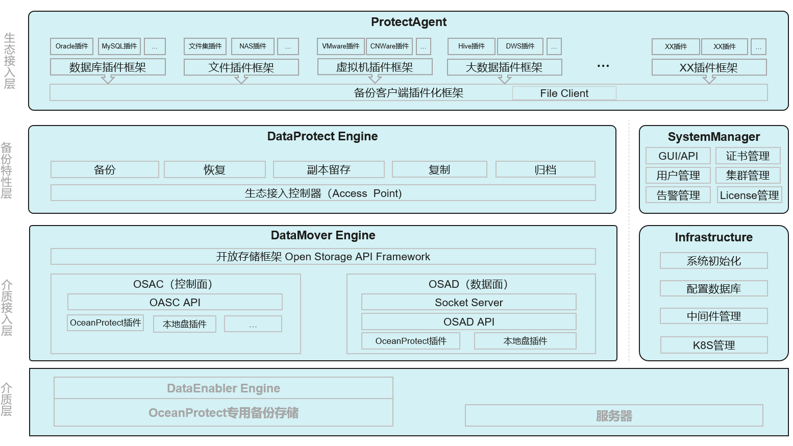
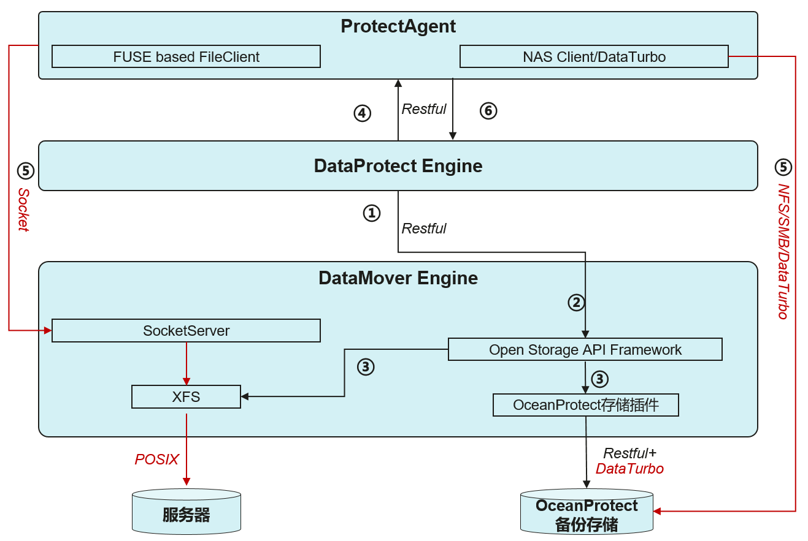
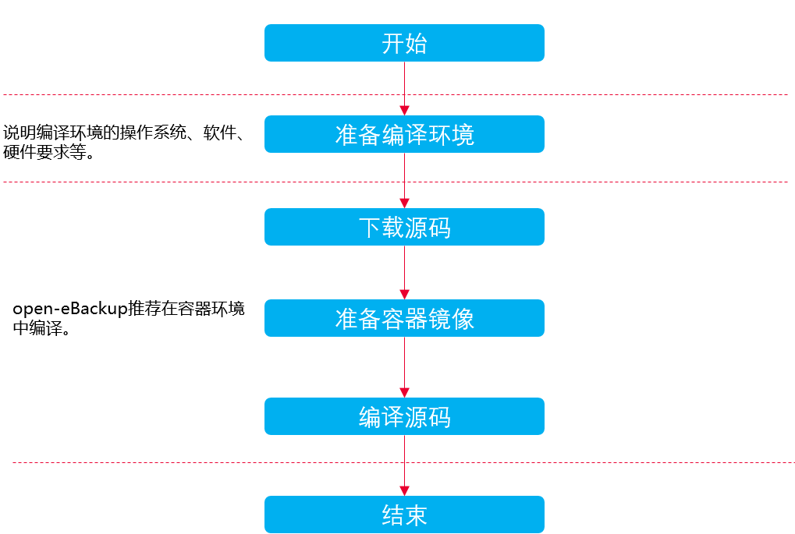

# 概述<a name="ZH-CN_TOPIC_0000001976671042"></a>


## 产品简介<a name="ZH-CN_TOPIC_0000002013230929"></a>

随着数据的数量、种类和增长速度呈现指数级变化，同时，由于人为错误、病毒、自然灾害以及其他网络安全威胁等原因，企业面临越来越多的数据丢失的风险，数据保护的重要性日益明显。

open-eBackup为主流数据库、虚拟化、文件系统、大数据等应用提供E2E包含数据备份、数据恢复能力，帮助用户实现关键数据高效备份，节省数据保护投资。

**生态全面保护<a name="section88413325458"></a>**

广泛适用于边缘/分支站点、数据中心及云场景，广泛支持传统数据库、虚拟化、文件系统备份恢复和副本管理，分布式数据库、大数据、数仓、AI数据、云上SaaS等新兴应用的统一备份保护。

**面向云保护<a name="section82107010505"></a>**

提供多云环境下数据统一备份、统一运营，面向云主机、云数据库、云数仓、容器和云存储实现备份恢复、租户资源隔离、SLA服务，备份数据云上云下自由流动。

**图 1**  open-eBackup产品架构<a name="fig18239127113916"></a>  



**数据保护代理（ProtetectAgent\)**

主要负责获取生态数据，并将数据写入介质接入层。

**数据保护引擎（DataProtect Engine\)**

主要负责配置保护策略，调度备份/恢复/复制/归档任务，向ProtectAgent发送备份任务，并监控任务执行状态，最终生成备份副本。

**数据移动引擎（DataMover Engine\)**

主要负责统一各种类型的备份存储的接入以及管理，并将ProtectAgent写入的数据写入的各种类型的备份介质进行持久化。

**系统管理器（SystemManager）**

主要负责系统配置管理，如：用户管理、告警管理、证书管理以及集群管理等。

**基于设施（Infrastructure\)**

主要负责管理K8S集群以及为其他管理及业务模块提供基础能力，如：数据库服务，Kafka消息服务，ElasticSearch服务，Zookeeper服务等。

**数据使能引擎\(DataEngabler Engine\)**

主要负责将备份数据再次进行加工利用，使能其他业务，如：对数据进行脱敏、勒索检测、AirGap隔离、以及对备份副本再次扫描，抽取元数据，提供检索服务等，该模块与open-eBackup备份介质密不可分，需与open-eBackup介质绑定使用。

## 产品原理<a name="ZH-CN_TOPIC_0000002013071429"></a>

open-eBackup的业务流程主要集中在ProtectAgent、DataProtect Engine和DataMover Engine三个子系统内，在备份的过程中，调用关系如下图所示：

**图 1** <a name="fig185772943315"></a>  


①** **DataProtect Engine发送创建存储库请求到DataMover Engine。

② DataMover Engine将请求转发到存储接入框架。

③ 存储接入框架根据存储类型，创建不同类型的存储库，以本地盘为例，Open Storage API Framework在本地盘上创建XFS文件作为备份存储库。

④ 准备运作完成后，DataProtect Engine将备份请求发送到ProtectAgent。

⑤ Protect Agent根据所备份的应用类型，将备份请求转发到不同的应用插件进行备份，并且根据不同的备份存储类型，调用不同的数据客户端将数据写入到不同的存储。以本地盘为例，ProtectAgent调用FUSE based FileClient将数据写入到DataMover Engine的SocketServer，SocketServer再将数据写入XFS文件系统。

## 工程简介<a name="ZH-CN_TOPIC_0000001976511326"></a>

open-eBackup工程中包含3个重要的目录：

-   build: 编译脚本入口，所有的编译构建从这里开始。
-   doc: 文件目录，关于open-eBackup的相关文档都归档在这里。
-   src: 代码所在路径，所有的开源代码都归档这里。
    -   ProtectAgent： 数据保护客户端，负责抓取生产应用数据，并写入备份存储。或读取备份存储数据，写入生产应用。
    -   AppPlugins: 应用备份插件，其中包含数据库备份插件、虚拟化备份插件、文件备份插件等。
    -   ProtectManager: 数据保护管理引擎，负责配置策略、策略调度、副本管理、任务管理等。
    -   DataMoverEngine: 数据移动引擎，负责管理备份存储、封装存储接口、副本复制、副本归档等。
    -   Infrastructure\_OM：基础设施，负责基础能力管理，如：数据库管理、缓存管理、检索引擎管理、消息队列管理等。
    -   DPAProduct: 构建脚本目录。

# 编译指导<a name="ZH-CN_TOPIC_0000001976671066"></a>


## 概述<a name="ZH-CN_TOPIC_0000001976511350"></a>



## 编译前准备<a name="ZH-CN_TOPIC_0000001976511334"></a>

1.  硬件要求
    -   主机数量：1台
    -   推荐主机硬件规格：
        -   CPU：4核（64位）
        -   内存：8GB
        -   磁盘空闲空间：100GB

    -   ARM架构的主机编译后生成open-eBackup引擎ARM类型的软件包。暂不支持X86架构的主机编译。

1.  操作系统要求

    open-eBackup引擎支持的操作系统（openEuler aarch64-bit）如下，建议open-eBackup引擎的编译操作系统与运行操作系统一致：

    -   OpenEuler-22.03-LTS\(aarch64\)

    下载地址：

    https://www.openeuler.org/en/download/archive/detail/?version=openEuler%2022.03%20LTS%20SP1

1.  软件要求

    open-eBackup引擎编译过程所依赖的软件如[表1](#table4754929184717)所示。

    **表 1**  软件依赖

|所需软件|建议版本|说明|
|--|--|--|
|Docker|18.09.0及后续版本|用于构建、管理、运行open-eBackup编译镜像和容器。|
|Helm|3.13.3及后续版本|用于构建、部署open-eBackup的容器。下载地址：https://github.com/helm/helm/releases/tag/v3.13.3https://get.helm.sh/helm-v3.13.3-linux-arm64.tar.gz|
|Git|2.33.0及后续版本|用于下载源码。|


1.  软件安装
    1.  执行以下命令安装docker。

        ```
        yum install -y docker
        ```

    2.  执行以下命令安装Helm。

        ```
        tar -zxvf helm-v3.13.3-linux-arm64.tar.gz linux-arm64/helm
        ```

        ```
        cp linux-arm64/helm /usr/local/bin
        ```

    3.  安装Git。

        ```
        yum install -y git
        ```

## 版本编译<a name="ZH-CN_TOPIC_0000002013071433"></a>


### 准备源码及其依赖二进制<a name="ZH-CN_TOPIC_0000002018517437"></a>

**操作步骤<a name="section582816517517"></a>**

1.  使用root用户登录主机。
2.  创建并进入源码下载目录。

    此处以将源码下载到目录“/open-eBackup”为例进行说明，您可根据实际环境进行替换。

    ```
    mkdir -p /open-eBackup
    ```

    ```
    cd /open-eBackup
    ```

3.  执行以下命令下载open-eBackup引擎源码。

    ```
    git clone https://gitcode.com/eBackup/open-eBackup.git
    ```

4.  下载open-eBackup-bin.tgz到当前目录并解压。

    ```
    mkdir -p open-eBackup-bin
    tar -zxvf open-eBackup-bin.tgz -C open-eBackup-bin
    ```

5.  Nodejs官网（https://nodejs.org/）下载适合您服务器的nodejs包，版本选择18.20.1，解压到open-eBackup-bin目录并重命名为nodejs

    arm64版本参考如下地址

    ```
    https://nodejs.org/dist/v18.20.1/node-v18.20.1-linux-arm64.tar.xz
    tar -xvJf node-v18.20.1-linux-arm64.tar.xz
    mv node-v18.20.1-linux-arm64 open-eBackup-bin/nodejs
    ```

6.  下载openEuler到open-eBackup-bin目录下。

    下载地址为：

    ```
    https://repo.openeuler.org/openEuler-22.03-LTS/docker_img/aarch64/openEuler-docker.aarch64.tar.xz
    ```

7.  下载openGauss到open-eBackup-bin目录

    下载地址为：

    ```
    https://opengauss.obs.cn-south-1.myhuaweicloud.com/5.0.0/arm_2203/openGauss-Lite-5.0.0-openEuler-aarch64.tar.gz
    ```

8.  下载openGauss-Server和openGauss-connector-python-psycopg2到open-eBackup-bin目录下。

    openGuass-Server下载地址为：

    ```
    https://gitee.com/opengauss/openGauss-server/repository/archive/v5.0.0
    ```

    参考如下地址进行编译：

    ```
    https://gitee.com/opengauss/openGauss-server#%E4%BD%BF%E7%94%A8buildsh%E7%BC%96%E8%AF%91%E4%BB%A3%E7%A0%81
    ```

    openGauss-connector-python-psycopg2下载地址为：

    ```
    https://gitee.com/opengauss/openGauss-connector-python-psycopg2/tree/v5.0.0
    ```

    参考如下地址进行编译：

    ```
    https://gitee.com/opengauss/openGauss-connector-python-psycopg2
    ```

    生成openGauss-5.0.0-openEuler-aarch64-Python.tar.gz文件。将该文件拷贝到open-eBackup-bin目录下。

### 准备容器镜像<a name="ZH-CN_TOPIC_0000001982077300"></a>

**操作步骤<a name="section5812195513530"></a>**

1.  下载openEuler镜像，下载地址为：

    ```
    https://mirrors.aliyun.com/openeuler/openEuler-22.03-LTS/docker_img/aarch64/openEuler-docker.aarch64.tar.xz
    ```

2.  导入基础镜像。

    ```
    docker load -i openEuler-docker.aarch64.tar.xz
    ```

3.  执行以下命令切换目录。

    ```
    cd /open-eBackup/open-eBackup/build
    ```

4.  执行以下命令构建编译镜像。

    ```
    sh build_compile_container.sh
    ```

5.  执行以下命令查询编译镜像。

    ```
    docker image ls
    ```

    输出结果为：

    ```
    REPOSITORY                                        TAG                 IMAGE ID            CREATED             SIZE
    open-ebackup                                     devel               41ce54e25fdc        3 hours ago         1.22GB
    ```

### 编译源码<a name="ZH-CN_TOPIC_0000001981917564"></a>

**操作步骤<a name="section149574014564"></a>**

1.  执行以下命令启动编译容器。

    ```
    docker run -it --name open-ebackup -v /open-eBackup:/open-eBackup -v /var/run/docker.sock:/var/run/docker.sock -v /usr/local/bin/helm:/usr/bin/helm -v /usr/bin/docker:/usr/bin/docker open-ebackup:devel /bin/bash
    ```

2.  在容器中执行以下命令切换路径。

    ```
    cd /open-eBackup/open-eBackup/build
    ```

3.  执行以下命令进行代码编译。

    ```
    sh package_open_source_final.sh <workspace_dir> <code_path> <binary_path>
    如：sh package_open_source_final.sh /open-eBackup /open-eBackup/open-eBackup /open-eBackup/open-eBackup-bin
    ```

    > **说明：** 
    >workspace\_dir: 编译的工作路径，是代码路径和二进制目录的根目录
    >code\_path: 代码存放路径
    >binary\_path: 二进制存放路径

    编译完成后会在dest目录下生成open-ebackup-1.0.zip和open-ebackup-agent-1.0.zip文件。

# 在通用服务器上安装<a name="ZH-CN_TOPIC_0000002030791265"></a>

> **说明：** 
>1. openEuler 22.03操作系统已安装完成。
>2. Kubernetes 1.31及以后版本已安装完成。


## 安装前准备<a name="ZH-CN_TOPIC_0000002030912765"></a>

**操作步骤<a name="section14880112812335"></a>**

1.  浏览器打下如下地址，下载ARM版本的helm。

    [https://get.helm.sh/helm-v3.13.3-linux-arm64.tar.gz](https://get.helm.sh/helm-v3.13.3-linux-arm64.tar.gz)

1.  解压软件包。

    ```
    tar -zxvf helm-v3.0.0-linux-arm.tar.gz
    ```

2.  拷贝helm。

    ```
    cp linux-arm/helm /usr/local/bin
    ```

1.  创建dpa命名空间

    ```
    kubectl create namespace dpa
    ```

2.  创建临时安装目录

    ```
    mdir -p /open-eBackup
    ```

3.  进入安装目录

    ```
    cd /open-eBackup
    ```

4.  上传open-ebackup-1.0.zip到安装环境的/open-eBackup。
5.  解压安装包

    ```
    unzip open-ebackup-1.0.zip
    ```

## 安装MasterServer<a name="ZH-CN_TOPIC_0000002025805753"></a>

1.  创建dpa命名空间

    ```
    kubectl create namespace dpa
    ```

2.  安装MasterServer

    ```
    tar -zxvf open-eBackup_1.6.RC2_MasterServer.tgz
    mkdir open-eBackup_MasterServer_image
    tar -zxvf open-eBackup_1.6.RC2_MasterServer.tgz -C open-eBackup_MasterServer_image
    docker load -i open-eBackup_MasterServer_image/open-eBackup_1.6.RC2_MasterServer.tar.xz
    
    tar -zxvf open-eBackup_1.6.RC2_MediaServer.tgz
    mkdir open-eBackup_MediaServer_image
    tar -zxvf open-eBackup_1.6.RC2_MediaServer.tgz -C open-eBackup_MediaServer_image
    docker load -i open-eBackup_MediaServer_image/open-eBackup_1.6.RC2_MediaServer.tar.xz
    
    mkdir open-eBackup_MasterServer_chart
    tar -zxvf open-eBackup_MasterServer_chart.tgz -C open-eBackup_MasterServer_chart
    tar -zxvf open-eBackup_MasterServer_chart/databackup-1.6.0-RC2.tgz -C open-eBackup_MasterServer_chart
    helm install master-server open-eBackup_MasterServer_chart/databackup --set global.gaussdbpwd=R2F1c3NkYl8xMjM= --set global.replicas=1 --set global.deploy_type=d10 -n dpa
    ```

3.  查看安装结果

    ```
    kubectl get pods -n dpa
    ```

4.  卸载

    ```
    helm uninstall master-server -n dpa
    ```

## 安装MediaServer<a name="ZH-CN_TOPIC_0000001989246506"></a>

1.  安装MediaServer

    ```
    mkdir open-eBackup_MediaServer_chart
    tar -zxvf open-eBackup_MediaServer_chart.tgz -C open-eBackup_MediaServer_chart
    tar -zxvf open-eBackup_MediaServer_chart/databackup-1.6.0-RC2.tgz -C open-eBackup_MediaServer_chart
    helm install media-server open-eBackup_MediaServer_chart/databackup --set global.gaussdbpwd=R2F1c3NkYl8xMjM= --set global.replicas=1 --set global.deploy_type=d10 -n dpa
    ```

1.  查看安装结果

    ```
    kubectl get pods -n dpa
    ```

1.  卸载

    ```
    helm uninstall media-server -n dpa
    kubectl delete namespace dpa(没装DataManager的情况下使用）
    ```

## （可选）安装DataManager<a name="ZH-CN_TOPIC_0000001989406258"></a>

1.  安装DataManager

    ```
    mkdir open-eBackup_DataManager_image
    tar -zxvf open-eBackup_DataManagerServer_image.tgz -C open-eBackup_Manager_image
    docker load -i open-eBackup_DataManager_image/open-eBackup_1.0_DataManager.tar.xz
    
    mkdir open-eBackup_DataManager_chart
    tar -zxvf open-eBackup_DataManager_chart.tgz -C open-eBackup_DataManager_chart
    helm install data-manager open-eBackup_DataManager_chart --set global.gaussdbpwd=R2F1c3NkYl8xMjM= --set global.replicas=1 --set global.deploy_type=d10 -n dpa
    ```

2.  查看安装结果

    ```
    kubectl get pods -n dpa
    ```

1.  卸载

    ```
    helm uninstall data-manager -n dpa
    kubectl delete namespace dpa
    ```

# 卸载服务端软件<a name="ZH-CN_TOPIC_0000002012229924"></a>

1.  卸载MasterServer

    ```
    helm uninstall MasterServer  -n dp
    ```

2.  卸载DataManager

    ```
    helm uninstall DataManager  -n dpa
    ```

3.  卸载MediaServer

    ```
    helm uninstall MediaServer  -n dpa
    ```

4.  删除Namespace

    ```
    kubectl delete namespace dpa
    ```

# 安装ProtectAgent软件<a name="ZH-CN_TOPIC_0000002025895257"></a>


## 安装前配置<a name="ZH-CN_TOPIC_0000002025774789"></a>

如果备份存储类型使用的是NFS协议时，请参考本节为代理主机安装NFS。备份存储协议类型如果不是NFS时请忽略本节。

**Linux OS<a name="section1438105974313"></a>**

安装NFS前，请确保已配置yum源。以下以Red Hat Enterprise Linux 7.2版本为例说明。

1.  使用**root**帐户登录代理主机。
2.  执行以下命令检查是否已安装NFS。

    ```
    rpm -q nfs-utils
    ```

    回显是否显示nfs-utils的安装版本：

    -   是，处理结束。
    -   否，执行[步骤3](#li1910016234219)。

3.  <a name="li1910016234219"></a>执行以下命令安装NFS。

    ```
    yum -y install nfs-utils
    ```

**AIX OS<a name="section12439125974318"></a>**

以下以AIX 7.1版本为例说明。

1.  使用**root**帐户登录代理主机。
2.  执行以下命令查询NFS服务是否已正常启动。

    ```
    lssrc -g nfs
    ```

    回显中以下项的值为“active”，则表示NFS服务已正常启动。

    ```
    # lssrc -g nfs 
    Subsystem         Group            PID          Status 
     biod             nfs              4587710      active 
     rpc.statd        nfs              5767286      active 
     rpc.lockd        nfs              3932320      active 
     nfsd             nfs              11403334     active 
     rpc.mountd       nfs              10158322     active
    ```

3.  执行以下命令查询portmap服务是否已正常启动。

    ```
    lssrc -s portmap
    ```

    回显中portmap为“active”，则表示portmap已正常启动。

    ```
    # lssrc -s portmap 
    Subsystem         Group            PID          Status 
     portmap          portmap          9568416      active
    ```

4.  如果NFS服务或portmap服务未正常启动，执行以下命令启动。

    ```
    startsrc -g nfs
    ```

    ```
    startsrc -s portmap
    ```

**Solaris OS<a name="section17439175917433"></a>**

以下以Oracle Solaris 11.4版本为例说明。

1.  使用**root**帐户登录代理主机。
2.  执行以下命令查看NFS服务是否已启动。

    ```
    svcs -a | grep nfs
    ```

    回显中“/nfs/client”为“online”时表示NFS服务已启动。

    ```
    root@solaris:~# svcs -a | grep nfs 
    disabled       May_06   svc:/network/nfs/server:default 
    disabled       May_06   svc:/network/nfs/rquota:default 
    online         May_06   svc:/network/nfs/fedfs-client:default 
    online         May_06   svc:/network/nfs/cleanup-upgrade:default 
    online         May_06   svc:/network/nfs/cleanup:default 
    online         May_06   svc:/network/nfs/cbd:default 
    online         May_06   svc:/network/nfs/mapid:default 
    online         May_06   svc:/network/nfs/nlockmgr:default 
    online         May_06   svc:/network/nfs/status:default 
    online         May_10   svc:/network/nfs/client:default
    ```

3.  如果NFS服务未启动，执行以下命令启动NFS服务。

    ```
    svcadm enable -s svc:/network/nfs/client:default
    ```

## 安装ProtectAgent<a name="ZH-CN_TOPIC_0000001989375290"></a>


### 自动推送安装<a name="ZH-CN_TOPIC_0000001989376126"></a>

您需要在代理主机上安装ProtectAgent软件，ProtectAgent充当open-eBackup与受保护资源之间的代理进行数据备份和恢复。本节介绍通过DataProtect Engine自动推送安装包至代理主机的方式批量为主机安装ProtectAgent。

**前提条件<a name="section2708mcpsimp"></a>**

-   代理主机上未安装ProtectAgent。
-   已获取需要安装ProtectAgent的代理主机的IP地址，该IP地址必须与open-eBackup的备份网络连通。
-   已获取登录代理主机的系统管理员用户及其密码。
-   代理主机支持curl（要求curl支持TLS1.2、TLS1.3）、unzip、ping、ping6、awk/nawk命令。
-   代理主机已安装net-tools工具包、iproute工具包。
-   部署open-eBackup时，系统会预置相应版本的ProtectAgent软件包至DataProtect Engine。如果预置的ProtectAgent软件包版本不满足您的需求，那么安装ProtectAgent前请先执行以下命令上传其他版本的ProtectAgent软件包：
    1.  选择“保护 \> 主机&应用 \> 主机”。
    2.  单击“ProtectAgent软件包管理”，配置相关参数。

        参数说明如[表1](#_d0e22022)所示。

        **表 1**  上传ProtectAgent软件包

|参数|说明|
|--|--|
|模式|选择“上传”。|
|代理文件|单击，选择已获取的ProtectAgent软件包。只支持上传.zip格式的软件包，文件大小不超过2GB。|


    3.  单击“确定”，开始上传软件包。

**注意事项<a name="section2719mcpsimp"></a>**

受保护资源为GaussDB\(DWS\)时，如果您不需要配置防火墙，可以执行**systemctl stop SuSEfirewall2.service**命令关闭防火墙。

**操作步骤<a name="section31951511194814"></a>**

1.  受保护资源是否为HDFS或HBase集群，且集群中配置了Kerberos认证。
    -   是，安装前要确保代理主机、open-eBackup以及Kerberos服务器的时间一致。如果时间不一致，请使用同一NTP服务器，否则可能导致ProtectAgent安装失败。
    -   否，安装前要确保代理主机与open-eBackup设备时间一致。

        参考以下步骤查看open-eBackup设备时间：

        1. 登录open-eBackup系统。

        2. 选择“系统 \> 设置 \> 设备时间”。

        查看当前设备时间，如果时间不一致，请修改主机时间或使用同一NTP服务器，否则可能导致ProtectAgent安装失败。

2.  选择“保护 \> 主机&应用 \> 主机”。
3.  单击“安装代理”，配置相关参数。

    参数说明如[表2](#_d0e20248)。

    **表 2**  安装代理参数

|参数|说明|
|--|--|
|代理类型|根据受保护资源的类型选择代理类型。主机代理(Oracle)：当受保护资源为Oracle数据库时，选择该类型。外置代理(VMware)：当受保护资源为VMware虚拟机时，选择该类型。外置代理(通用)：当受保护资源为GaussDB(DWS)、HDFS或HBase时，选择该类型。|
|操作系统|代理主机的操作系统类型。|
|IP类型|代理主机的IP地址类型，支持IPv4和IPv6。|
|IP地址|代理主机的IP地址。该IP地址必须与open-eBackup X8000的备份网络连通。当代理主机IP地址为IPv4时，输入代理主机的IP地址或网段（网段地址的前24位必须相同），以英文逗号隔开。如：10.40.100.85~10.40.100.95,10.40.100.101当代理主机IP地址为IPv6时，输入代理主机的IP地址，以英文逗号隔开。如：fe80::250:56ff:fe9f:98ac,fe80::250:56ff:fe9f:98ad|
|用户名|代理主机的系统管理员用户名及密码。|
|密码|


4.  单击“测试”。

    系统验证填写的代理主机IP地址、用户名、密码是否正确。

5.  测试成功后单击“确定”。

    当“主机”页面显示安装了ProtectAgent的主机后，表示该主机已成功注册至DataProtect Engine。

### 手动安装<a name="ZH-CN_TOPIC_0000002025775621"></a>

您需要在代理主机上安装ProtectAgent软件，ProtectAgent充当open-eBackup与受保护资源之间的代理进行数据备份和恢复。本节介绍登录代理主机后台手动为其安装ProtectAgent。

**注意事项<a name="section20911mcpsimp"></a>**

受保护资源为GaussDB\(DWS\)时，如果您不需要配置防火墙，可以执行**systemctl stop SuSEfirewall2.service**命令关闭防火墙。

**操作步骤<a name="section751273420614"></a>**

1.  在DataProtect Engine下载ProtectAgent软件包。

    具体操步骤如下：

    1.  选择“保护 \> 主机&应用 \> 主机”。
    2.  单击“ProtectAgent软件包管理”，配置相关参数。

        参数说明如[表2-36](#_d0e22136)所示。

        **表 1**  上传ProtectAgent软件包

|参数|说明|
|--|--|
|模式|选择“下载”。|
|代理类型|根据受保护资源的类型选择代理类型。主机代理(Oracle)：当受保护资源为Oracle数据库时，选择该类型。外置代理(VMware)：当受保护资源为VMware虚拟机时，选择该类型。外置代理(通用)：当受保护资源为GaussDB(DWS)、HDFS、HBase，选择该类型。|
|操作系统|代理主机的操作系统类型。|
|私钥密码|用户自定义私钥密码，根据界面提示的复杂度要求输入。私钥密码用于对ProtectAgent软件包中的私钥文件进行加密，私钥文件用于代理主机与open-eBackup X8000鉴权。请妥善保管此私钥密码，后续安装过程中会使用。填写私钥密码后，open-eBackup X8000将使用此处填写的私钥密码对ProtectAgent软件包中的私钥文件进行加密。如果在下载ProtectAgent软件包前，已参考《open-eBackup X8000 1.2.1 安全配置指南》导入Agent证书，此处可以填写与Agent证书相同的私钥密码，也可以自行定义私钥密码。|
|确认私钥密码|再次输入私钥密码。|


    3.  单击“确定”。

        获取下载到的ProtectAgent软件包。

        在Windows Server使用Internet Explorer 11下载ProtectAgent。

2.  受保护资源是否为HDFS或HBase集群，且集群中配置了Kerberos认证。
    -   是，安装前要确保代理主机、open-eBackup以及Kerberos服务器的时间一致。如果时间不一致，请使用同一NTP服务器，否则可能导致ProtectAgent安装失败。
    -   否，安装前要确保代理主机与open-eBackup设备时间一致。

        参考以下步骤查看open-eBackup设备时间：

        1.  登录open-eBackup。
        2.  选择“系统 \> 设置 \> 设备时间”。

            查看当前设备时间，如果时间不一致，请修改主机时间或使用同一NTP服务器，否则可能导致ProtectAgent安装失败。

3.  安装ProtectAgent软件。

    1.  使用PuTTY，以系统管理员帐户登录需要安装ProtectAgent的主机。
    2.  依次执行以下命令创建软件包的存放目录并授权。

        软件包存放目录的权限需要为755。此处以存放目录为“/opt/install”为例说明。

        ```
        mkdir /opt/install
        ```

        ```
        chmod -R 755 /opt/install
        ```

    3.  使用WinSCP上传软件包至“/opt/install”目录。
    4.  进入“/opt/install”目录后，执行以下命令解压软件包。_xxx_为ProtectAgent的版本号。

        ```
        unzip open-eBackup_DataProtect_xxx_client_others.zip
        ```

    5.  执行以下命令进入软件包目录。

        ```
        cd /opt/install/open-eBackup_DataProtect_xxx_client/
        ```

    6.  执行以下命令安装ProtectAgent软件。

        ```
        sh install.sh
        ```

    > **说明：** 
    >-   安装ProtectAgent软件时，系统自动检测环境中是否已安装net-tools工具包、iproute工具包，如检测到未安装会提示安装。
    >-   根据回显提示完成软件安装，安装过程中需要输入[表1](#_d0e22136)中创建的私钥。
    >-   安装过程中，系统会检查当前主机已配置的业务网络IP，如果检查到已配置多个业务网络IP，会提示用户选择其中一个业务IP用于代理主机备份恢复业务。
    >-   安装过程中，如果系统检测到DataProtect Engine上存在相同IP地址但UUID不同的主机时，会提示是否覆盖DataProtect Engine的原主机：
    >-   当选择覆盖时，新安装的主机将继承原主机的副本信息，并且更新新主机的UUID与原主机相同。
    >-   当选择不覆盖时，您需要先在DataProtect Engine上删除原主机后，重新安装。

4.  主机安装ProtectAgent软件后，DataProtect Engine会自动发现该主机，执行如下步骤进行检查。
    1.  登录open-eBackup。
    2.  选择“保护 \> 主机&应用 \> 主机”。
    3.  查看已安装ProtectAgent的主机是否已存在于DataProtect Engine。

        如果在DataProtect Engine上未发现已安装ProtectAgent的主机，请联系系统管理员为该用户进行资源授权。

        1.  使用系统管理员登录open-eBackup。
        2.  选择“保护 \> 主机&应用 \> 主机”。
        3.  在该主机所在行，单击“更多 \> 资源授权”。
        4.  将该主机授权给相应的用户。

1.  重复以上步骤为其他代理主机安装ProtectAgent软件。

## 安装后配置<a name="ZH-CN_TOPIC_0000001989215542"></a>


### 添加VDDK（适用于VMware）<a name="ZH-CN_TOPIC_0000002025779581"></a>

备份恢复VMware虚拟机时，依赖VMware的VDDK能力，参考本节在代理主机上添加VDDK库。受保护资源不是VMware时请忽略本节。

**获取VDDK包<a name="section7875mcpsimp"></a>**

**表 1**  VDDK下载路径

|VMware受保护环境版本|获取路径|
|--|--|
|VMware受保护环境为VMware vSphere 5.1、5.5或6.0|下载VDDK 6.0.2版本|
|VMware受保护环境为VMware vSphere 6.5、6.7|下载VDDK 6.7.3版本|
|注：本节以“tar.gz”格式的VDDK包为例说明相关操作。|


**添加VDDK 6.0.2库（VMware受保护环境为VMware vSphere 5.1、5.5或6.0）<a name="section37822732719"></a>**

1.  使用PuTTY，以**root**帐号登录代理主机。
2.  执行以下命令进入“ProtectClient”目录。

    ```
    cd /opt/open-eBackup/ProtectClient
    ```

3.  执行以下命令停止ProtectAgent服务。

    ```
    sh stop.sh
    ```

4.  执行以下命令进入“/ProtectClient-E”目录。

    ```
    cd /opt/open-eBackup/ProtectClient/ProtectClient-E/
    ```

5.  执行以下命令，创建vddk目录。

    ```
    mkdir -p lib/vddk/6.0
    ```

6.  使用WinSCP，以**root**帐号将获取到的VDDK压缩包上传至代理主机的“/opt/open-eBackup/ProtectClient/ProtectClient-E/lib/vddk/6.0”目录。
7.  执行以下命令解压VDDK压缩包。

    ```
    tar -zxvf 压缩包名称
    ```

    解压后的目录一般为：

    vmware-vix-disklib-distrib:

    -   bin64
    -   doc
    -   include
    -   lib32
    -   lib64

8.  进入“/vmware-vix-disklib-distrib”目录后，执行以下命令删除除lib64以外的其他目录。

    ```
    rm -rf bin64 doc include lib32
    ```

9.  依次执行以下命令删除libstdc++.so.6.0.13文件。

    ```
    cd /opt/open-eBackup/ProtectClient/ProtectClient-E/lib/vddk/6.0/vmware-vix-disklib-distrib/lib64/
    ```

    ```
    rm -f libstdc++.so.6.0.13
    ```

10. 创建新的同名软连接文件。

    ```
    ln -s /opt/open-eBackup/ProtectClient/ProtectClient-E/bin/libstdc++.so.6.0.28 libstdc++.so.6.0.13
    ```

11. 如果VMware vSphere为5.1或5.5版本时，执行以下命令创建软连接。否则请跳过。

    ```
    ln -s /opt/open-eBackup/ProtectClient/ProtectClient-E/lib/vddk/6.0 5.1
    ```

    ```
    ln -s /opt/open-eBackup/ProtectClient/ProtectClient-E/lib/vddk/6.0 5.5
    ```

12. 依次执行以下命令更改新创建的lib文件夹的权限，及所属的用户及用户组。

    ```
    cd /opt/open-eBackup/ProtectClient/ProtectClient-E/
    ```

    ```
    chown rdadmin:rdadmin lib -R
    ```

    ```
    chown -h rdadmin:rdadmin lib -R
    ```

    ```
    chmod 550 lib -R
    ```

13. 依次执行以下命令启动ProtectAgent服务。

    ```
    cd /opt/open-eBackup/ProtectClient
    ```

    ```
    sh start.sh
    ```

14. 重复以上步骤在其他代理主机添加VDDK库。

**添加VDDK 6.7.3库（VMware受保护环境为VMware vSphere 6.5、6.7）<a name="section1579152713276"></a>**

1.  使用PuTTY，以**root**帐号登录代理主机。
2.  执行以下命令进入“ProtectClient”目录。

    ```
    cd /opt/open-eBackup/ProtectClient
    ```

3.  执行以下命令停止ProtectAgent服务。

    ```
    sh stop.sh
    ```

4.  执行以下命令进入“/ProtectClient-E”目录。

    ```
    cd /opt/open-eBackup/ProtectClient/ProtectClient-E/
    ```

5.  执行以下命令，创建vddk目录。

    ```
    mkdir -p lib/vddk/6.7
    ```

6.  使用WinSCP，以**root**帐号将获取到的VDDK压缩包上传至代理主机的“/opt/open-eBackup/ProtectClient/ProtectClient-E/lib/vddk/6.7”目录。
7.  执行以下命令解压VDDK压缩包。

    ```
    tar -zxvf 压缩包名称
    ```

    解压后的目录一般为：

    vmware-vix-disklib-distrib:

    -   bin64
    -   doc
    -   include
    -   lib32
    -   lib64

8.  进入“/vmware-vix-disklib-distrib”目录后，执行以下命令删除除lib64以外的其他目录。

    ```
    rm -rf bin64 doc include lib32
    ```

9.  依次执行以下命令删除libstdc++.so.6文件。

    ```
    cd /opt/open-eBackup/ProtectClient/ProtectClient-E/lib/vddk/6.7/vmware-vix-disklib-distrib/lib64/
    ```

    ```
    rm -f libstdc++.so.6
    ```

10. 创建新的同名软连接文件。

    ```
    ln -s /opt/open-eBackup/ProtectClient/ProtectClient-E/bin/libstdc++.so.6.0.28 libstdc++.so.6
    ```

11. 如果VMware vSphere为6.5版本时，执行以下命令创建软连接。否则请跳过。

    ```
    ln -s /opt/open-eBackup/ProtectClient/ProtectClient-E/lib/vddk/6.7 6.5
    ```

12. 依次执行以下命令更改新创建的lib文件夹的权限，及所属的用户及用户组。

    ```
    cd /opt/open-eBackup/ProtectClient/ProtectClient-E/
    ```

    ```
    chown rdadmin:rdadmin lib -R
    ```

    ```
    chown -h rdadmin:rdadmin lib -R
    ```

    ```
    chmod 550 lib -R
    ```

13. 依次执行以下命令启动ProtectAgent服务。

    ```
    cd /opt/open-eBackup/ProtectClient
    ```

    ```
    sh start.sh
    ```

14. 重复以上步骤在其他代理主机添加VDDK库。

### 安装华为多路径软件（适用于VMware）<a name="ZH-CN_TOPIC_0000001989380090"></a>

如果VMware虚拟机使用的生产存储是华为OceanStor Dorado，请参考本节安装华为多路径软件。非该场景请忽略。

**背景信息<a name="section38554mcpsimp"></a>**

-   如果VMware虚拟机使用的生产存储是华为OceanStor Dorado时，您需要执行安装华为多路径软件以及将其作为外部存储加入open-eBackup的操作。代理主机将自动发现生产存储的LUN。
-   如果VMware虚拟机使用的生产存储不是华为OceanStor Dorado时，您需要在代理主机手动挂载LUN，使得代理主机可发现生产存储的LUN。

**获取软件包<a name="section38559mcpsimp"></a>**

获取华为多路径软件包OceanStor\_UltraPath\_xxx\_CentOS.zip，xxx为多路径软件的版本号，获取路径：

-   企业网用户：[点此前往](https://support.huawei.com/enterprise/zh/centralized-storage/ultrapath-pid-8576127/software)
-   运营商用户：[点此前往](https://support.huawei.com/carrier/productNewOffering?col=product&path=PBI1-21430725/PBI1-251363742/PBI1-21499296/PBI1-8576127&resTab=SW)

**操作步骤<a name="section38567mcpsimp"></a>**

在所有代理主机安装华为多路径软件，具体请参考[《OceanStor UltraPath for Linux xxx 用户指南》](https://support.huawei.com/enterprise/zh/centralized-storage/ultrapath-pid-8576127)。

### 添加存储设备（适用于VMware）<a name="ZH-CN_TOPIC_0000001989220342"></a>

如果VMware虚拟机使用的生产存储是华为OceanStor Dorado，则需要参考本节将OceanStor Dorado添加至open-eBackup X8000。非该场景请忽略。

**操作步骤<a name="section1144051617325"></a>**

1.  选择“保护 \> 存储 \> 存储设备”。
2.  单击“添加设备”，添加存储设备。
3.  选择设备类型为OceanStor Dorado 6.x。
4.  按界面要求配置参数。参数说明如[添加存储设备（适用于VMware）](添加存储设备（适用于VMware）.md)所示。

    **表 1**  添加设备参数说明

|参数|说明|
|--|--|
|设备名称|用户自定义设备名称。|
|IP地址|存储设备的管理IP地址。|
|端口|open-eBackup与存储设备的管理平面通信的端口号。默认端口号为8088。|
|用户名|存储设备的用户名及密码，用户角色必须是管理员或超级管理员。|
|密码|
|是否校验证书|当已导入存储设备的CA证书后，请开启该项。开启后，添加存储设备时会对其证书进行校验，确保open-eBackup X8000与存储设备交互的安全性。|


5.  单击“确定”。

    添加成功后，已添加的存储设备信息将在“存储设备”页面显示。

### 挂载生产存储的LUN至代理主机（适用于VMware）<a name="ZH-CN_TOPIC_0000002025900025"></a>

当VMware虚拟化环境使用SAN传输模式备份恢复，且生产存储不是华为OceanStor Dorado时，则需要参考本节手动将生产存储的LUN挂载给代理主机。非该场景请忽略。

**背景信息<a name="section33254mcpsimp"></a>**

本文以VMware生产存储为华为OceanStor 5600 V500R007存储，虚拟化环境为VMware 6.5版本为例，介绍如何挂载生产存储的LUN至代理主机。非该版本操作会有差异，请参考对应存储产品的文档进行操作。

**IP SAN场景<a name="section71511257193320"></a>**

当代理主机与生产存储之间为IP链路时，执行以下步骤。

1.  使用PuTTY，登录代理主机。
2.  <a name="li17429162615404"></a>查询代理主机的iSCSI启动器名称。
    1.  执行**rpm -qa |grep iscsi**命令查询代理主机是否安装了iSCSI启动器。

        \[root@root \~\]\# rpm -qa |grep iscsi

        iscsi-initiator-utils-6.2.0.873-29.el7.x86\_64 

        iscsi-initiator-utils-iscsiuio-6.2.0.873-29.el7.x86\_64

        如上所示，系统已经安装了iSCSI启动器。

    2.  执行**cat /etc/iscsi/initiatorname.iscsi**命令，查询iSCSI启动器的名称。

        \[root@root \~\]\#cat /etc/iscsi/initiatorname.iscsi

        InitiatorName=iqn.1994-05.com.redhat:38d7b046dd9a

        上面的信息中，我们可以发现代理主机的iSCSI启动器名称为“iqn.1994-05.com.redhat:38d7b046dd9a”。

3.  查看待备份的虚拟机对应的数据存储。
    1.  登录待备份的虚拟机所在的虚拟化平台。
    2.  在左侧导航栏单击“虚拟机”，单击待备份的虚拟机名称。
    3.  在右侧视图“硬件配置”区域，单击“硬盘x”，查看硬盘对应的数据存储名称，如datastore01。

4.  联系机房管理员了解datastore01对应的生产存储的管理IP地址。
5.  <a name="li2511185696"></a>查看待备份的虚拟机所在的ESXi主机对应的LUN，并创建LUN组。
    1.  以**admin**帐户登录OceanStor 5600 V500R007存储的DeviceManager界面。

        登录地址：**https://**_生产存储管理IP地址_**:8088**

    2.  在右侧导航，选择“资源分配”，单击“主机”，在“主机”页签，通过搜索找到ESXi主机。
    3.  <a name="li1364271811135"></a>单击主机名称，查看映射给主机的LUN名称。
    4.  在右侧导航，选择“资源分配”，单击“LUN”，选择“LUN组”页签，根据[步骤5.3](#li1364271811135)查到的LUN，查找ESXi主机对应的LUN所在的LUN组。

6.  配置与代理主机通信的以太网端口IP地址。
    1.  在右侧导航，选择“系统”，使用旋转图标，切换到设备后视图。
    2.  单击与代理主机相连的以太网端口，在弹出的“以太网端口”窗口，单击“修改”，配置以太网端口IP地址。

7.  <a name="li1788517511813"></a>创建主机和主机组。
    1.  在右侧导航，选择“资源分配”，单击“主机”，在“主机”页签，单击“创建”，选择“手动创建”。
    2.  根据界面提示，创建主机。

        配置启动器时，选择iSCSI类型，选择[步骤2](#li17429162615404)中查询的iSCSI启动器名称。

    3.  选择“主机组”页签，单击“创建”，根据界面提示创建主机组。

8.  将[步骤5](#li2511185696)的LUN组映射给[步骤7](#li1788517511813)的主机组。
    1.  在右侧导航，选择“资源分配”，单击“映射视图”。
    2.  单击“创建”，根据界面提示创建映射视图。

9.  登录代理主机执行以下命令扫描LUN。

    ```
    for host in $(ls -1d /sys/class/scsi_host/*); do echo "- - -" > ${host}/scan ; done
    ```

10. 执行以下命令检查是否已扫描到对应的LUN。

    ```
    fdisk -l
    ```

**FC SAN场景<a name="section1715205717338"></a>**

当代理主机与生产存储之间为FC链路时，执行以下步骤。

1.  使用PuTTY，登录代理主机。
2.  <a name="li695317364611"></a>执行**cat /sys/class/fc\_host/host\*/port\_name **命令查询代理主机HBA卡的WWN。

    ```
    # cat /sys/class/fc_host/host*/port_name  
    0x210000e08b907955  
    0x210000e08b907956
    ```

    上面的信息中，我们可以发现代理主机HBA卡的WWN为“0x210000e08b907955”和“0x210000e08b907956”。

3.  查看待备份的虚拟机对应的数据存储。
    1.  登录待备份的虚拟机所在的虚拟化平台。
    2.  在左侧导航栏单击“虚拟机”，单击待备份的虚拟机名称。
    3.  在右侧视图“硬件配置”区域，单击“硬盘x”，查看硬盘对应的数据存储名称，如datastore01。

4.  联系机房管理员了解datastore01对应的生产存储的管理IP地址。
5.  <a name="li4313819192213"></a>查看待备份的虚拟机所在的ESXi Server对应的LUN，并创建LUN组。
    1.  以**admin**帐户登录OceanStor 5600 V500R007存储的DeviceManager界面。

        登录地址：**https://**_生产存储管理IP地址_**:8088**

    2.  在右侧导航，选择“资源分配 ”，单击“主机”，在“主机”页签，通过搜索找到ESXi主机。
    3.  <a name="li731316197226"></a>单击主机名称，在界面下方，单击“映射的LUN”，查看映射给主机的LUN名称。
    4.  在右侧导航，选择“资源分配 ”，单击“LUN”，选择“LUN组”页签，根据[步骤5.3](#li731316197226)查到的LUN，查找ESXi主机对应的LUN所在的LUN组。

6.  <a name="li1231312192223"></a>创建主机和主机组。
    1.  在右侧导航，选择“资源分配”，单击“主机”，在“主机”页签，单击“创建”，选择“手动创建”。
    2.  根据界面提示，创建主机。

        配置启动器时，选择FC类型，选择[步骤2](#li695317364611)中查询的WWN。

    3.  选择“主机组”页签，单击“创建”，根据界面提示创建主机组。

7.  将[步骤5](#li4313819192213)的LUN组映射给[步骤6](#li1231312192223)的主机组。
    1.  在右侧导航，选择“资源分配 ”，单击“映射视图”。
    2.  单击“创建”，根据界面提示创建映射视图。

8.  登录代理主机执行以下命令扫描LUN。

    ```
    for host in $(ls -1d /sys/class/scsi_host/*); do echo "- - -" > ${host}/scan ; done
    ```

9.  执行以下命令检查是否已扫描到对应的LUN。

    ```
    fdisk -l
    ```

# 卸载ProtectAgent软件<a name="ZH-CN_TOPIC_0000002013071441"></a>

卸载ProtectAgent后，open-eBackup将不会对该资源进行备份或恢复。如需卸载ProtectAgent可参考本节操作。

**操作步骤<a name="section14199334134012"></a>**

1.  使用PuTTY，以系统管理员帐户登录需要卸载ProtectAgent的主机。
2.  执行以下命令进入ProtectAgent软件安装目录。

    ```
    cd /opt/open-eBackup/ProtectClient
    ```

3.  执行以下命令卸载软件。

    ```
    sh uninstall.sh
    ```

1.  如果该主机后续会再次安装ProtectAgent，且该主机之前是用于保护Oracle数据库再次安装ProtectAgent将用于保护VMware虚拟机，或者该主机之前是用于保护VMware虚拟机再次安装ProtectAgent将用于保护Oracle数据库，那么参考以下步骤删除主机的“/etc/HostSN/HostSN”文件。非该场景请忽略。
    1.  使用PuTTY，登录主机。
    2.  执行以下命令删除“/etc/HostSN/HostSN”文件。

        ```
        rm -rf /etc/HostSN/HostSN
        ```

1.  如果该主机后续会再次安装ProtectAgent，且再次安装ProtectAgent前，主机重新安装过操作系统或者主机的“/etc/HostSN/HostSN”被删除，则参考以下步骤在DataProtect Engine上删除主机。非该场景请忽略。
    1.  登录open-eBackup。
    2.  选择“保护 \> 主机&应用 \> 主机”。
    3.  按照IP地址查找到已卸载ProtectAgent的主机后，单击“删除主机”。

        删除前确保主机未关联SLA。

