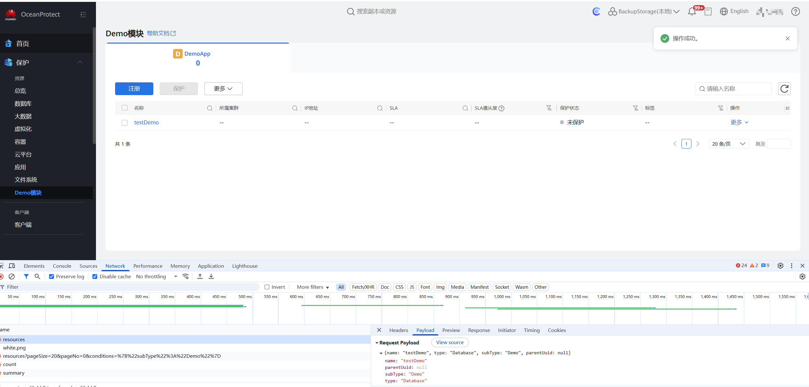

# GUI二次开发

## 项目启动

* 将node_modules手动粘贴到gui仓的`src/service/console/`下面。
* npm run gen
* npm start

如果是老版本代码，angular版本16那一版，启动代码前，需要将`angular.json`中的`architect.baseHref`改成`"/console/"`，这样本地修改的内容才会同步到浏览器。新版本angular18这一版，只需要执行上面两步就能生效。项目默认启动在`localhost:1000`，代理端口为`8001`。


可能遇到的问题

1. 启动项目时报错out of memory

   nodejs默认分配4G空间，项目太大了启动爆内存了，需要设置NODE_OPTIONS参数`--max-old-space-size=8192`，

   最简单的方法是直接修改package.json中的start命令，

   ~~"start": "ng serve --proxy-config proxy.conf.json --port 1000"~~

   ```json
   {
     "start": "node --max-old-space-size=8192 ./node_modules/@angular/cli/bin/ng serve --proxy-config proxy.conf.json --port 1000"
   }
   ```

   这里分配8G内存，可以根据电脑配置调整。

2. npm run gen 报错找不到ng-swagger-gen

   手动导入的node_modules可能识别模块有问题，手动修改一下package.json中的gen命令

   ~~"gen": "npm run pre-swagger && npm run pre-gen && npx ng-swagger-gen -c codegen.json",~~

   ```json
   {
     "gen": "npm run pre-swagger && npm run pre-gen && npx ./node_modules/ng-swagger-gen -c codegen.json"
   }
   ```

3. 启动项目报错too many open files ...

   

   GUI里面有大量的联机帮助文档，启动项目时被系统限制了打开文件数量，网上的方法是使用命令`ulimit -n 2048`，windows系统的话可以在gitBash里输入前面的命令，然后重新npm start。

   

   还是有问题的话，暂时把`src/service/console/src/assets/help`文件下的内容都移走，留一个空的help文件夹就行。联机帮助对项目启动影响不大。

4. 报错三方组件iux/databackup模块导入错误

   大概率是获取的node_modules版本太老了，里面的三方组件版本太低，缺少了部分模块。

## 代码介绍

### 结构总览

简单的介绍一下Angular的组件(Component)、模块(Module)和服务(Service)。

Angular组件类似于Vue中的单文件组件、React中的类组件，逻辑与模板分离，模板通过`templateUrl`被引入到`component.ts`中。

服务则是通过依赖注入实现跨组件逻辑复用，类似Vue中的`provide/inject`。

模块是就是一个单元，将组件、服务、指令等封装在一起，可以导入使用其他模块，也可以导出给其他模块使用，**但是需要特别注意不要模块间循环引入**。

GUI大致代码结构如下：


`app.component.ts`是全局根组件，这里有一些全局功能，比如告警，全局检索，新人指引等模块。`app-router.module.ts`中定义了所有模块的路由，新增模块时，在其中使用`path`，`loadChildren`定义路由和动态引入模块。


### 接口

接口需要先使用swagger生成对应的yaml，然后将yaml放到`src/service/console/swagger/json`目录下，然后使用package.json中的`npm run gen`命令生成对应的service文件，该service文件与yaml中的tags中的name值相同，会保存在`src/service/console/src/app/shared/api/services`中。例如：


接着在组件的constructor中引入该service，


引入之后就可以在组件中调用接口了，


全局Service使用方法类似，在`console/src/app/shared/services`中使用`@Injectable({provideInL:'root'})`定义好后，全局都可以导入使用。

### business模块

business中，是按照业务拆分的文件。

左侧的菜单列表，定义在app.component.ts文件getMenus中，


如果需要在菜单里新增内容，需要修改该函数。


## 添加父模块

这里简单的介绍一下新增模块时的操作，比如我们想在保护中新增一个Demo模块，里面再新增一个应用叫DemoApp。


###  新增组件和模块

```bash
ng g m demo --routing
ng g c demo --module=demo
```

生成如下结构，demo-routing.module和demo.component被引入到demo.module中。


### 添加系统路由

由于我们是想在保护中新增模块，所以需要给protection-router路由中添加新的路由


此时直接跳转会报错无权访问，所以需要在Permission中将`protection/demo`加入权限表中


权限表RouterUrl中定义路由，


然后在URL_PERMISSION所需要的角色中，加入对应的RouterUrl.ProtectionDemo


加好之后再次输入`/protection/demo`就能生效了，


### 添加菜单

上一步加了父级路由，这一次我们增加子路由，在demo模块下增加一个demo-app，

修改之前的RouterUrl，修改protection-router.module，添加新的路由


同时在app.component.ts中目标项后增加新的内容，例如这里想在文件服务后增加一个demo模块，可以按照如下写法。


然后界面就能生效了。


## 添加子模块

例如这里我们想在demo模块中，新增一款应用叫DemoApp，首先需要创建demo-app组件。

```bash
ng g m demo-app --routing
ng g c demo-app --module=demo-app
```

子组件生成好之后，子路由中，将子组件加进去。


父组件中demo-routing，将子路由加进去。


这样一个模块就弄好了，现在的整体视图如下。

```javascript
--保护
  --文件系统
  --Demo模块
    --DemoApp
```

接下来需要修改的是`app-utils.service.ts`，在app-utils中定义了所有应用的基本配置，如果需要新增一个应用，一定要在app-utils中加入。这里演示一下怎么在保护模块中加入新应用，后面的即时挂载，副本数据都是相同的操作。`注意：这里的hide为了方便演示，这里直接写成false，实际需要根据需求来设置。`

新增一个`demoModule`模块，里面有一款应用叫`DemoApp`，添加好之后如下。


一切准备就绪后，需要使用全局组件`sub-app-card`，将DemoApp渲染在页面上。操作如下，父模块`demo.component.html`中引入上述组件，将一个typeTitle和一个子应用数组传递给该组件。


直接在ts文件中，引入AppUtilService，使用`getApplicationConfig().demoModule`即可引入刚才我们在app-utils中添加的应用。


此时回到页面，就能看到已经生效了。


## 使用全局模板组件

接下来往DemoApp里塞内容，

全局组件`aui-database-template`已经内置了很多基本操作，只需要传入一个属性`configParams`。

按照如下方式引入该组件，


然后在ts中定义config，结构如下

```typescript
export interface TemplateParams {
  activeIndex: string; // 资源类型
  tableCols: string[]; // 基本信息
  tableOpts: string[]; // 基本操作
  registerComponent?: any; // 注册组件
}
```

这里的tableCols指的是表格中每一列的信息，tableOpts指的是数据支持的操作。


回到界面已经生效了。


## 实现register组件

上述`configParams`中参数`registerComponent`需要传入一个组件，我们现在补充上。

```powershell
ng g m demo-app-register
ng g c demo-app-register --module=demo-app-register
```


回到界面，点击注册按钮界面已经生效。


## 使用form表单

表单使用liveUI，liveUI同样也在开源仓中。


使用前需要在register.module.ts中引入BaseModule，以下为表单的简单用法，formGroup需要在组件ts中进行定义和初始化，html中一个`lv-form-item`即为一个表单项，`label`是该项的名称，`control`用于联系控件和元素，校验错误提示也在form-control中定义，使用`formControlName`将控件和input绑定。


所有的注册组件，都是使用registerService管理的，组件内只需要实现onOk函数，点击确认就会下发任务。


点击确认后就可以下发注册，这样资源就能成功注册了



## 保护备份

保护备份需要后台java python侧进行适配，所以这里只讲一下怎么适配。

一个是`RESOURCE_CATALOGS`变量需要适配，一个是`ResourceCatalogsService`中的`parseCatalogs`函数，这两处适配之后，在`select-application.component`组件中，新增一个`demoIcons`变量用于记录Demo模块下的子应用，html再进行遍历这个`demoIcons`生成对应的应用。


手动备份适配。

`take-manual-backup.component.ts`文件中有一个映射表，将每个应用和支持的操作一一映射。应用默认类型是GeneralDB，默认支持全量、增量。


在`database-template`有一个函数getProtectType，这里需要将subType根据activeIndex映射成对应的值。


如下设置后，DemoApp就支持四种备份方式了。


## 恢复

生成一个恢复组件`DemoRestoreComponent`，然后在`restore.service.ts`的restore函数中，根据类型去传递恢复组件。例如如下配置


恢复组件中实现restore函数，service会自动调用该函数触发恢复，恢复参数结构如下，其他的form表单之前如上面介绍一样的写法。


