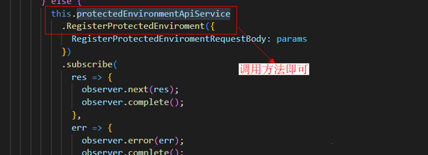
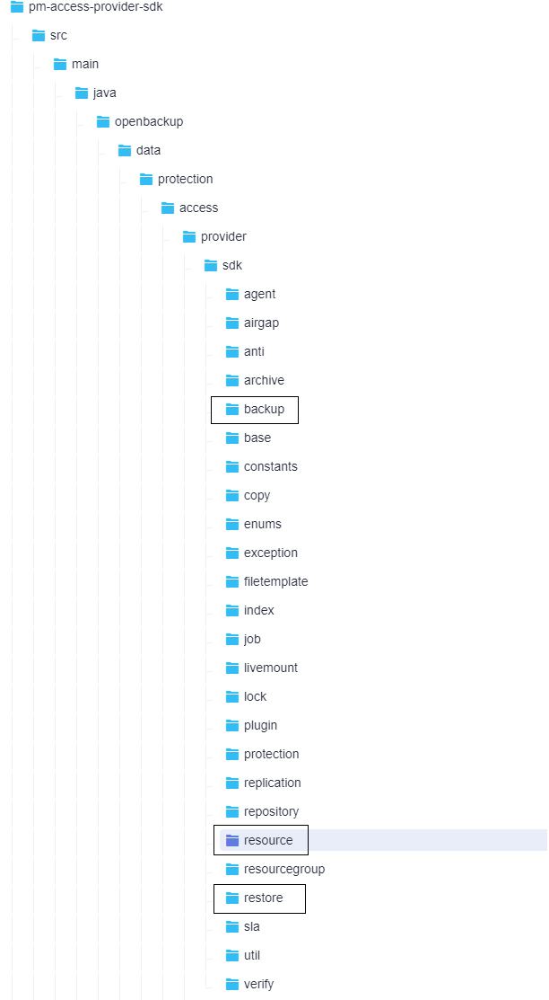

# 版权声明<a name="ZH-CN_TOPIC_0000002059620513"></a>

Copyright © 2024 Huawei Technologies Co.,Ltd.

This work is licensed under the Creative Commons Attribution-ShareAlike 4.0 International License. You are free to share and adapt the material as long as you attribute the author and distribute your contributions under the same license.

To view a copy of this license, visit http://creativecommons.org/licenses/by-sa/4.0/

# 文档简介<a name="ZH-CN_TOPIC_0000002031750569"></a>

本文指导用户如何基于open-eBackup进行二次开发，其中包括：界面（GUI）的开发、DataProtect Engine的开发和ProtectAgent开发三个部分。其中ProtectAgent部分，根据不同的应用类型又分为：文件系统的开发、数据库的开发和虚拟化的开发。

# GUI接口扩展<a name="ZH-CN_TOPIC_0000001995230834"></a>


## 代码结构介绍<a name="ZH-CN_TOPIC_0000002048273121"></a>

GUI代码存储放在ProtectManager/component/PM\_GUI//src/service/console/src/app/business下，代码结构为：


1） app/business：业务代码，按照菜单划分不同业务模块。

2） app/shared：包含接口文件、公共常量文件、服务、指令、公共组件等。

3） app/assets：静态文件，包含样式类、图片、国际化文件等。

4） swagger：接口yaml文件。

## 扩展步骤介绍<a name="ZH-CN_TOPIC_0000002048392141"></a>

1.  生成接口文件

所有接口依赖自定义工具生成，开发过程中无需自己动手写接口定义，只需关注yaml文件是否正确，将yaml文件放在PM\_GUI\\src\\service\\console\\swagger\\json下，执行预置的命令即可生成对应的接口文件。

执行npm run gen命令工具会自动将yaml接口生成对应前端调用的接口服务：app/shared/api

1.  编写接口yaml

    登录官网自定义：https://editor.swagger.io/

2.  调用服务端接口

    通过定义的服务名，在需要引用的地方注入服务名称，调用对应方法，方法名称为定义的接口名称



# DataProtect Engine接口扩展<a name="ZH-CN_TOPIC_0000002013071425"></a>

<a name="table53124916358"></a>
<table><thead align="left"><tr id="row13324923512"><th class="cellrowborder" valign="top" width="11.1%" id="mcps1.1.5.1.1"><p id="p154199575169"><a name="p154199575169"></a><a name="p154199575169"></a>类别</p>
</th>
<th class="cellrowborder" valign="top" width="23.549999999999997%" id="mcps1.1.5.1.2"><p id="p1639316577167"><a name="p1639316577167"></a><a name="p1639316577167"></a>接口定义</p>
</th>
<th class="cellrowborder" valign="top" width="8.03%" id="mcps1.1.5.1.3"><p id="p35749235173"><a name="p35749235173"></a><a name="p35749235173"></a>是否可选</p>
</th>
<th class="cellrowborder" valign="top" width="57.32000000000001%" id="mcps1.1.5.1.4"><p id="p9354916350"><a name="p9354916350"></a><a name="p9354916350"></a>描述</p>
</th>
</tr>
</thead>
<tbody><tr id="row193114933518"><td class="cellrowborder" valign="top" width="11.1%" headers="mcps1.1.5.1.1 "><p id="p094315589167"><a name="p094315589167"></a><a name="p094315589167"></a>资源注册</p>
</td>
<td class="cellrowborder" valign="top" width="23.549999999999997%" headers="mcps1.1.5.1.2 "><p id="p1964333115147"><a name="p1964333115147"></a><a name="p1964333115147"></a>register(ProtectedEnvironment env); void</p>
<p id="p1245897151816"><a name="p1245897151816"></a><a name="p1245897151816"></a></p>
<p id="p9686147181810"><a name="p9686147181810"></a><a name="p9686147181810"></a>openbackup.data.protection.access.provider.sdk.resource.EnvironmentProvider#register</p>
</td>
<td class="cellrowborder" valign="top" width="8.03%" headers="mcps1.1.5.1.3 "><p id="p4575122361718"><a name="p4575122361718"></a><a name="p4575122361718"></a>必选</p>
</td>
<td class="cellrowborder" valign="top" width="57.32000000000001%" headers="mcps1.1.5.1.4 "><p id="p1664333101412"><a name="p1664333101412"></a><a name="p1664333101412"></a>环境注册接口，插件实现该接口，验证环境是否可联通、登录</p>
<p id="p750762791517"><a name="p750762791517"></a><a name="p750762791517"></a><strong id="b3507122716150"><a name="b3507122716150"></a><a name="b3507122716150"></a>输入参数：</strong></p>
<p id="p94361819150"><a name="p94361819150"></a><a name="p94361819150"></a>ProtectedEnvironment env：待注册的环境，包括用户名、密码、环境名称、端口等环境参数。</p>
<p id="p125419217153"><a name="p125419217153"></a><a name="p125419217153"></a>openbackup.data.protection.access.provider.sdk.resource.ProtectedEnvironment</p>
<p id="p1692044141514"><a name="p1692044141514"></a><a name="p1692044141514"></a><strong id="b8692244141518"><a name="b8692244141518"></a><a name="b8692244141518"></a>输出参数</strong>：</p>
<p id="p869214448155"><a name="p869214448155"></a><a name="p869214448155"></a>如果有错，抛出异常</p>
</td>
</tr>
<tr id="row9621192412143"><td class="cellrowborder" valign="top" width="11.1%" headers="mcps1.1.5.1.1 ">&nbsp;&nbsp;</td>
<td class="cellrowborder" valign="top" width="23.549999999999997%" headers="mcps1.1.5.1.2 "><p id="p24781928121415"><a name="p24781928121415"></a><a name="p24781928121415"></a>scan(ProtectedEnvironment env):List&lt;ProtectedResource&gt;</p>
<p id="p15924644161912"><a name="p15924644161912"></a><a name="p15924644161912"></a></p>
<p id="p316754581913"><a name="p316754581913"></a><a name="p316754581913"></a>openbackup.data.protection.access.provider.sdk.resource.EnvironmentProvider#scan</p>
</td>
<td class="cellrowborder" valign="top" width="8.03%" headers="mcps1.1.5.1.3 "><p id="p115751623121710"><a name="p115751623121710"></a><a name="p115751623121710"></a>可选</p>
</td>
<td class="cellrowborder" valign="top" width="57.32000000000001%" headers="mcps1.1.5.1.4 "><p id="p16478132851418"><a name="p16478132851418"></a><a name="p16478132851418"></a>资源扫描接口，插件实现该接口，上报本环境中的资源列表</p>
<p id="p647812891414"><a name="p647812891414"></a><a name="p647812891414"></a><strong id="b20478142811410"><a name="b20478142811410"></a><a name="b20478142811410"></a>输入参数</strong>：</p>
<p id="p1647812820145"><a name="p1647812820145"></a><a name="p1647812820145"></a>ProtectedEnvironment env：待资源扫描的环境，包括用户名、密码、环境名称、端口等环境参数。对于数据库来说，环境就是数据库主机，对于VMware虚拟机来说，环境是是ESXi server或vecntet。环境是特殊的资源</p>
<p id="p104781428171417"><a name="p104781428171417"></a><a name="p104781428171417"></a>openbackup.data.protection.access.provider.sdk.resource.ProtectedEnvironment</p>
<p id="p104781928201414"><a name="p104781928201414"></a><a name="p104781928201414"></a><strong id="b1447842818147"><a name="b1447842818147"></a><a name="b1447842818147"></a>输出参数</strong>：</p>
<p id="p247852841420"><a name="p247852841420"></a><a name="p247852841420"></a>List&lt;ProtectedResource&gt;：本环境中与该应用相关的所有资源列表，插件实现可以返回继承ProtectedResource的子类</p>
<p id="p1768847172012"><a name="p1768847172012"></a><a name="p1768847172012"></a>openbackup.data.protection.access.provider.sdk.resource.ProtectedResource</p>
</td>
</tr>
<tr id="row13347192620179"><td class="cellrowborder" valign="top" width="11.1%" headers="mcps1.1.5.1.1 ">&nbsp;&nbsp;</td>
<td class="cellrowborder" valign="top" width="23.549999999999997%" headers="mcps1.1.5.1.2 "><p id="p5159151814210"><a name="p5159151814210"></a><a name="p5159151814210"></a>validate(ProtectedEnviroment env): void</p>
<p id="p1760534372019"><a name="p1760534372019"></a><a name="p1760534372019"></a></p>
<p id="p2010194432017"><a name="p2010194432017"></a><a name="p2010194432017"></a>openbackup.data.protection.access.provider.sdk.resource.EnvironmentProvider#validate</p>
</td>
<td class="cellrowborder" valign="top" width="8.03%" headers="mcps1.1.5.1.3 "><p id="p8575102371716"><a name="p8575102371716"></a><a name="p8575102371716"></a>必选</p>
</td>
<td class="cellrowborder" valign="top" width="57.32000000000001%" headers="mcps1.1.5.1.4 "><p id="p1139121815210"><a name="p1139121815210"></a><a name="p1139121815210"></a>环境验证接口，插件实现该接口，验证环境的连通性和输入的环境参数是否合法，用于healthcheck</p>
<p id="p0696411135414"><a name="p0696411135414"></a><a name="p0696411135414"></a><strong id="b811323665718"><a name="b811323665718"></a><a name="b811323665718"></a>输入参数</strong>：</p>
<p id="p1481215105417"><a name="p1481215105417"></a><a name="p1481215105417"></a>ProtectedEnvironment env：待验证的环境，包括用户名、密码、环境名称、端口等环境参数。</p>
<p id="p72311552208"><a name="p72311552208"></a><a name="p72311552208"></a>openbackup.data.protection.access.provider.sdk.resource.ProtectedEnvironment</p>
<p id="p1920110511562"><a name="p1920110511562"></a><a name="p1920110511562"></a><strong id="b58672392571"><a name="b58672392571"></a><a name="b58672392571"></a>输出参数</strong>：</p>
<p id="p169513185613"><a name="p169513185613"></a><a name="p169513185613"></a>如果有错，抛出异常</p>
</td>
</tr>
<tr id="row1591433865818"><td class="cellrowborder" valign="top" width="11.1%" headers="mcps1.1.5.1.1 ">&nbsp;&nbsp;</td>
<td class="cellrowborder" valign="top" width="23.549999999999997%" headers="mcps1.1.5.1.2 "><p id="p1233811371898"><a name="p1233811371898"></a><a name="p1233811371898"></a>remove(ProtectedResource resource):void</p>
<p id="p83701871215"><a name="p83701871215"></a><a name="p83701871215"></a></p>
<p id="p135901179211"><a name="p135901179211"></a><a name="p135901179211"></a>openbackup.data.protection.access.provider.sdk.resource.EnvironmentProvider#remove</p>
</td>
<td class="cellrowborder" valign="top" width="8.03%" headers="mcps1.1.5.1.3 "><p id="p20575152317173"><a name="p20575152317173"></a><a name="p20575152317173"></a>可选</p>
</td>
<td class="cellrowborder" valign="top" width="57.32000000000001%" headers="mcps1.1.5.1.4 "><p id="p43381937891"><a name="p43381937891"></a><a name="p43381937891"></a>资源删除接口，插件可选实现该接口，处理资源在数据库删除时相关的特殊逻辑</p>
<p id="p113897469913"><a name="p113897469913"></a><a name="p113897469913"></a><strong id="b838915464915"><a name="b838915464915"></a><a name="b838915464915"></a>输入参数</strong>：</p>
<p id="p83897461096"><a name="p83897461096"></a><a name="p83897461096"></a>ProtectedResource resource：待删除的资源</p>
<p id="p2335105161615"><a name="p2335105161615"></a><a name="p2335105161615"></a>openbackup.data.protection.access.provider.sdk.resource.ProtectedResource</p>
<p id="p1321814931620"><a name="p1321814931620"></a><a name="p1321814931620"></a><strong id="b82182921611"><a name="b82182921611"></a><a name="b82182921611"></a>输出参数</strong>：</p>
<p id="p1421819921616"><a name="p1421819921616"></a><a name="p1421819921616"></a>如果有错，抛出异常</p>
</td>
</tr>
<tr id="row103164919358"><td class="cellrowborder" valign="top" width="11.1%" headers="mcps1.1.5.1.1 "><p id="p53124914356"><a name="p53124914356"></a><a name="p53124914356"></a>备份</p>
</td>
<td class="cellrowborder" valign="top" width="23.549999999999997%" headers="mcps1.1.5.1.2 "><p id="p16384913511"><a name="p16384913511"></a><a name="p16384913511"></a>initialize(BackupTask task)：BackupTask</p>
<p id="p976123612239"><a name="p976123612239"></a><a name="p976123612239"></a></p>
<p id="p13422536172318"><a name="p13422536172318"></a><a name="p13422536172318"></a>openbackup.data.protection.access.provider.sdk.backup.v2.BackupInterceptorProvider#initialize</p>
</td>
<td class="cellrowborder" valign="top" width="8.03%" headers="mcps1.1.5.1.3 "><p id="p11575102318176"><a name="p11575102318176"></a><a name="p11575102318176"></a>必选</p>
</td>
<td class="cellrowborder" valign="top" width="57.32000000000001%" headers="mcps1.1.5.1.4 "><p id="p1332433354917"><a name="p1332433354917"></a><a name="p1332433354917"></a>初始化备份任务接口，插件可选实现该接口，在任务执行之前</p>
<p id="p232443316498"><a name="p232443316498"></a><a name="p232443316498"></a>1.  检查备份参数</p>
<p id="p17324143315498"><a name="p17324143315498"></a><a name="p17324143315498"></a>2.  填充备份需要的必要参数，比如备份客户端、备份节点、sla信息等</p>
<p id="p1032419338490"><a name="p1032419338490"></a><a name="p1032419338490"></a><strong id="b123242336497"><a name="b123242336497"></a><a name="b123242336497"></a>输入参数：</strong></p>
<p id="p7324193384920"><a name="p7324193384920"></a><a name="p7324193384920"></a>BackupTask task：待执行的备份任务</p>
<p id="p15165444341"><a name="p15165444341"></a><a name="p15165444341"></a>openbackup.data.protection.access.provider.sdk.backup.v2.BackupTask</p>
<p id="p517181563417"><a name="p517181563417"></a><a name="p517181563417"></a><strong id="b18171111513416"><a name="b18171111513416"></a><a name="b18171111513416"></a>输出参数：</strong></p>
<p id="p18171191516346"><a name="p18171191516346"></a><a name="p18171191516346"></a>BackupTask task：待执行的备份任务</p>
</td>
</tr>
<tr id="row4675414153715"><td class="cellrowborder" valign="top" width="11.1%" headers="mcps1.1.5.1.1 ">&nbsp;&nbsp;</td>
<td class="cellrowborder" valign="top" width="23.549999999999997%" headers="mcps1.1.5.1.2 "><p id="p176751114193716"><a name="p176751114193716"></a><a name="p176751114193716"></a>finalize(PostBackupTask task)：void</p>
<p id="p34994919273"><a name="p34994919273"></a><a name="p34994919273"></a></p>
<p id="p158131549202710"><a name="p158131549202710"></a><a name="p158131549202710"></a></p>
<p id="p1382214972710"><a name="p1382214972710"></a><a name="p1382214972710"></a>openbackup.data.protection.access.provider.sdk.backup.v2.BackupInterceptorProvider#finalize</p>
</td>
<td class="cellrowborder" valign="top" width="8.03%" headers="mcps1.1.5.1.3 "><p id="p7575182391714"><a name="p7575182391714"></a><a name="p7575182391714"></a>可选</p>
</td>
<td class="cellrowborder" valign="top" width="57.32000000000001%" headers="mcps1.1.5.1.4 "><p id="p0419123812387"><a name="p0419123812387"></a><a name="p0419123812387"></a>后处理备份任务接口，插件可选实现该接口，在任务成功或失败之后进行一些必要的处理</p>
<p id="p164191338193811"><a name="p164191338193811"></a><a name="p164191338193811"></a><strong id="b54191738143816"><a name="b54191738143816"></a><a name="b54191738143816"></a>输入参数：</strong></p>
<p id="p64195387383"><a name="p64195387383"></a><a name="p64195387383"></a>PostBackupTask task：后处理的备份任务</p>
<p id="p14223822134314"><a name="p14223822134314"></a><a name="p14223822134314"></a>openbackup.data.protection.access.provider.sdk.backup.v2.PostBackupTask</p>
<p id="p12511172294312"><a name="p12511172294312"></a><a name="p12511172294312"></a><strong id="b745292934312"><a name="b745292934312"></a><a name="b745292934312"></a>输入参数：</strong></p>
<p id="p153081036164316"><a name="p153081036164316"></a><a name="p153081036164316"></a>如果有错，抛出异常</p>
</td>
</tr>
<tr id="row1192111919376"><td class="cellrowborder" valign="top" width="11.1%" headers="mcps1.1.5.1.1 "><p id="p209212191378"><a name="p209212191378"></a><a name="p209212191378"></a>恢复</p>
</td>
<td class="cellrowborder" valign="top" width="23.549999999999997%" headers="mcps1.1.5.1.2 "><p id="p123126148478"><a name="p123126148478"></a><a name="p123126148478"></a>initialize(RestoreTask task)：voidRestoreTask</p>
<p id="p55181815183110"><a name="p55181815183110"></a><a name="p55181815183110"></a></p>
<p id="p10840171515318"><a name="p10840171515318"></a><a name="p10840171515318"></a></p>
<p id="p479401643117"><a name="p479401643117"></a><a name="p479401643117"></a>openbackup.data.protection.access.provider.sdk.restore.v2.RestoreInterceptorProvider#initialize</p>
</td>
<td class="cellrowborder" valign="top" width="8.03%" headers="mcps1.1.5.1.3 "><p id="p33121314134715"><a name="p33121314134715"></a><a name="p33121314134715"></a>必选</p>
</td>
<td class="cellrowborder" valign="top" width="57.32000000000001%" headers="mcps1.1.5.1.4 "><p id="p442501019494"><a name="p442501019494"></a><a name="p442501019494"></a>初始化恢复任务接口，插件必选实现该接口，在任务执行之前</p>
<p id="p112641414184919"><a name="p112641414184919"></a><a name="p112641414184919"></a>1.  检查副本恢复的参数，如待恢复节点版本校验</p>
<p id="p131251418475"><a name="p131251418475"></a><a name="p131251418475"></a>2.  填充恢复所需要的必要参数，比如待恢复节点、设置恢复速度</p>
<p id="p1131241412473"><a name="p1131241412473"></a><a name="p1131241412473"></a><strong id="b731381494712"><a name="b731381494712"></a><a name="b731381494712"></a>输入参数：</strong></p>
<p id="p143133146476"><a name="p143133146476"></a><a name="p143133146476"></a>RestoreTask task：待执行的恢复任务</p>
<p id="p1331361494711"><a name="p1331361494711"></a><a name="p1331361494711"></a>openbackup.data.protection.access.provider.sdk.restore.v2.RestoreTask</p>
<p id="p13313414164715"><a name="p13313414164715"></a><a name="p13313414164715"></a><strong id="b1931311464718"><a name="b1931311464718"></a><a name="b1931311464718"></a>输出参数：</strong></p>
<p id="p18313714124720"><a name="p18313714124720"></a><a name="p18313714124720"></a>RestoreTask task：待执行的恢复任务</p>
</td>
</tr>
<tr id="row22502812414"><td class="cellrowborder" valign="top" width="11.1%" headers="mcps1.1.5.1.1 ">&nbsp;&nbsp;</td>
<td class="cellrowborder" valign="top" width="23.549999999999997%" headers="mcps1.1.5.1.2 "><p id="p1731321454715"><a name="p1731321454715"></a><a name="p1731321454715"></a>finalize(PostBackupTask task)：void</p>
</td>
<td class="cellrowborder" valign="top" width="8.03%" headers="mcps1.1.5.1.3 "><p id="p73131114144714"><a name="p73131114144714"></a><a name="p73131114144714"></a>可选</p>
</td>
<td class="cellrowborder" valign="top" width="57.32000000000001%" headers="mcps1.1.5.1.4 "><p id="p20313181424718"><a name="p20313181424718"></a><a name="p20313181424718"></a>后处理恢复任务接口，插件可选实现该接口，在任务成功或失败之后进行一些必要的处理</p>
<p id="p2313171418473"><a name="p2313171418473"></a><a name="p2313171418473"></a><strong id="b1731331418475"><a name="b1731331418475"></a><a name="b1731331418475"></a>输入参数：</strong></p>
<p id="p331371434718"><a name="p331371434718"></a><a name="p331371434718"></a>PostRestoreTask task：后处理的恢复任务</p>
<p id="p531319148479"><a name="p531319148479"></a><a name="p531319148479"></a></p>
<p id="p0313171484716"><a name="p0313171484716"></a><a name="p0313171484716"></a><strong id="b93131814184720"><a name="b93131814184720"></a><a name="b93131814184720"></a>输入参数：</strong></p>
<p id="p4313141410477"><a name="p4313141410477"></a><a name="p4313141410477"></a>如果有错，抛出异常</p>
</td>
</tr>
<tr id="row174111626123012"><td class="cellrowborder" valign="top" width="11.1%" headers="mcps1.1.5.1.1 ">&nbsp;&nbsp;</td>
<td class="cellrowborder" valign="top" width="23.549999999999997%" headers="mcps1.1.5.1.2 ">&nbsp;&nbsp;</td>
<td class="cellrowborder" valign="top" width="8.03%" headers="mcps1.1.5.1.3 ">&nbsp;&nbsp;</td>
<td class="cellrowborder" valign="top" width="57.32000000000001%" headers="mcps1.1.5.1.4 ">&nbsp;&nbsp;</td>
</tr>
</tbody>
</table>

<a name="table19480250104115"></a>
<table><thead align="left"><tr id="row648045011411"><th class="cellrowborder" valign="top" width="10%" id="mcps1.1.5.1.1"><p id="p18397131311120"><a name="p18397131311120"></a><a name="p18397131311120"></a>类别</p>
</th>
<th class="cellrowborder" valign="top" width="27.99%" id="mcps1.1.5.1.2"><p id="p1539710137117"><a name="p1539710137117"></a><a name="p1539710137117"></a>接口定义</p>
</th>
<th class="cellrowborder" valign="top" width="7.3999999999999995%" id="mcps1.1.5.1.3"><p id="p153979131818"><a name="p153979131818"></a><a name="p153979131818"></a>是否可选</p>
</th>
<th class="cellrowborder" valign="top" width="54.61%" id="mcps1.1.5.1.4"><p id="p639713133119"><a name="p639713133119"></a><a name="p639713133119"></a>描述</p>
</th>
</tr>
</thead>
<tbody><tr id="row992414516011"><td class="cellrowborder" valign="top" width="10%" headers="mcps1.1.5.1.1 "><p id="p11329174810016"><a name="p11329174810016"></a><a name="p11329174810016"></a>副本删除</p>
</td>
<td class="cellrowborder" valign="top" width="27.99%" headers="mcps1.1.5.1.2 "><p id="p598372615243"><a name="p598372615243"></a><a name="p598372615243"></a>initialize(DeleteCopyTask task, CopyInfoBo copy)：void</p>
<p id="p203431018195318"><a name="p203431018195318"></a><a name="p203431018195318"></a></p>
<p id="p197262186535"><a name="p197262186535"></a><a name="p197262186535"></a>openbackup.data.protection.access.provider.sdk.copy.CopyDeleteInterceptor#initialize</p>
</td>
<td class="cellrowborder" valign="top" width="7.3999999999999995%" headers="mcps1.1.5.1.3 "><p id="p7924204515012"><a name="p7924204515012"></a><a name="p7924204515012"></a>可选</p>
</td>
<td class="cellrowborder" valign="top" width="54.61%" headers="mcps1.1.5.1.4 "><p id="p2660111142519"><a name="p2660111142519"></a><a name="p2660111142519"></a>初始化副本删除任务接口，插件可选实现该接口，在任务执行之前</p>
<p id="p1866061119255"><a name="p1866061119255"></a><a name="p1866061119255"></a>1.  检查任务参数</p>
<p id="p866015111253"><a name="p866015111253"></a><a name="p866015111253"></a>2.  填充副本删除任务所需要的参数</p>
<p id="p31231716474"><a name="p31231716474"></a><a name="p31231716474"></a>3.  删除级联副本</p>
<p id="p117671221204716"><a name="p117671221204716"></a><a name="p117671221204716"></a></p>
<p id="p13660161142511"><a name="p13660161142511"></a><a name="p13660161142511"></a><strong id="b19660181192513"><a name="b19660181192513"></a><a name="b19660181192513"></a>输入参数：</strong></p>
<p id="p10660411192517"><a name="p10660411192517"></a><a name="p10660411192517"></a>DeleteCopyTask task：待执行的副本删除任务</p>
<p id="p9660911162520"><a name="p9660911162520"></a><a name="p9660911162520"></a>CopyInfoBo copy：待删除副本的信息</p>
<p id="p1280912395314"><a name="p1280912395314"></a><a name="p1280912395314"></a>openbackup.data.protection.access.provider.sdk.copy.DeleteCopyTask</p>
<p id="p965263332812"><a name="p965263332812"></a><a name="p965263332812"></a>openbackup.data.protection.access.provider.sdk.copy.CopyInfoBo</p>
<p id="p1166031118258"><a name="p1166031118258"></a><a name="p1166031118258"></a><strong id="b206605112254"><a name="b206605112254"></a><a name="b206605112254"></a>输出参数：</strong></p>
<p id="p10660191162510"><a name="p10660191162510"></a><a name="p10660191162510"></a>如果有错，抛出异常</p>
</td>
</tr>
<tr id="row848010503417"><td class="cellrowborder" valign="top" width="10%" headers="mcps1.1.5.1.1 ">&nbsp;&nbsp;</td>
<td class="cellrowborder" valign="top" width="27.99%" headers="mcps1.1.5.1.2 "><p id="p398317263243"><a name="p398317263243"></a><a name="p398317263243"></a>finalize(Copy copy, TaskCompleteMessageBo taskMessage)：void</p>
<p id="p1917313014545"><a name="p1917313014545"></a><a name="p1917313014545"></a></p>
<p id="p1522120175420"><a name="p1522120175420"></a><a name="p1522120175420"></a>openbackup.data.protection.access.provider.sdk.copy.CopyDeleteInterceptor#finalize</p>
</td>
<td class="cellrowborder" valign="top" width="7.3999999999999995%" headers="mcps1.1.5.1.3 "><p id="p108941833192419"><a name="p108941833192419"></a><a name="p108941833192419"></a>可选</p>
</td>
<td class="cellrowborder" valign="top" width="54.61%" headers="mcps1.1.5.1.4 "><p id="p325631343015"><a name="p325631343015"></a><a name="p325631343015"></a>后处理副本删除任务接口，插件可选实现该接口，在任务成功或失败之后进行一些必要的处理</p>
<p id="p1125631318304"><a name="p1125631318304"></a><a name="p1125631318304"></a><strong id="b8256513183010"><a name="b8256513183010"></a><a name="b8256513183010"></a>输入参数：</strong></p>
<p id="p1625651319308"><a name="p1625651319308"></a><a name="p1625651319308"></a>Copy copy：已删除副本的信息</p>
<p id="p1525611303015"><a name="p1525611303015"></a><a name="p1525611303015"></a>TaskCompleteMessageBo taskMessage：副本删除的任务信息</p>
<p id="p18628222203319"><a name="p18628222203319"></a><a name="p18628222203319"></a>openbackup.system.base.sdk.copy.model.Copy</p>
<p id="p1053114065516"><a name="p1053114065516"></a><a name="p1053114065516"></a>openbackup.data.protection.access.provider.sdk.job.TaskCompleteMessageBo</p>
<p id="p17256101314305"><a name="p17256101314305"></a><a name="p17256101314305"></a><strong id="b525620131300"><a name="b525620131300"></a><a name="b525620131300"></a>输入参数：</strong></p>
<p id="p16256313163012"><a name="p16256313163012"></a><a name="p16256313163012"></a>如果有错，抛出异常</p>
</td>
</tr>
<tr id="row7977335133610"><td class="cellrowborder" valign="top" width="10%" headers="mcps1.1.5.1.1 ">&nbsp;&nbsp;</td>
<td class="cellrowborder" valign="top" width="27.99%" headers="mcps1.1.5.1.2 "><p id="p19977153511360"><a name="p19977153511360"></a><a name="p19977153511360"></a>getAssociatedCopy(String copyId)：List&lt;String&gt;</p>
<p id="p20932194212562"><a name="p20932194212562"></a><a name="p20932194212562"></a></p>
<p id="p9114184317561"><a name="p9114184317561"></a><a name="p9114184317561"></a>openbackup.data.protection.access.provider.sdk.copy.CopyDeleteInterceptor#getAssociatedCopy</p>
</td>
<td class="cellrowborder" valign="top" width="7.3999999999999995%" headers="mcps1.1.5.1.3 "><p id="p11977103513616"><a name="p11977103513616"></a><a name="p11977103513616"></a>可选</p>
</td>
<td class="cellrowborder" valign="top" width="54.61%" headers="mcps1.1.5.1.4 "><p id="p17204115616385"><a name="p17204115616385"></a><a name="p17204115616385"></a>获取级联副本任务接口，插件可选实现该接口，获取指定副本的级联副本列表</p>
<p id="p15204135616386"><a name="p15204135616386"></a><a name="p15204135616386"></a><strong id="b1120455683813"><a name="b1120455683813"></a><a name="b1120455683813"></a>输入参数：</strong></p>
<p id="p62045561382"><a name="p62045561382"></a><a name="p62045561382"></a>String copyId：副本id</p>
<p id="p1320419562381"><a name="p1320419562381"></a><a name="p1320419562381"></a></p>
<p id="p10205105603815"><a name="p10205105603815"></a><a name="p10205105603815"></a><strong id="b18205125612384"><a name="b18205125612384"></a><a name="b18205125612384"></a>输入参数：</strong></p>
<p id="p320525613388"><a name="p320525613388"></a><a name="p320525613388"></a>级联副本列表</p>
</td>
</tr>
<tr id="row19480205024112"><td class="cellrowborder" valign="top" width="10%" headers="mcps1.1.5.1.1 "><p id="p141574399587"><a name="p141574399587"></a><a name="p141574399587"></a>即时挂载</p>
</td>
<td class="cellrowborder" valign="top" width="27.99%" headers="mcps1.1.5.1.2 "><p id="p547861019115"><a name="p547861019115"></a><a name="p547861019115"></a>initialize(LiveMountCreateTask task):void</p>
<p id="p82278411577"><a name="p82278411577"></a><a name="p82278411577"></a></p>
<p id="p4396184119579"><a name="p4396184119579"></a><a name="p4396184119579"></a></p>
<p id="p35671641105716"><a name="p35671641105716"></a><a name="p35671641105716"></a>openbackup.data.protection.access.provider.sdk.livemount.LiveMountInterceptorProvider#initialize</p>
</td>
<td class="cellrowborder" valign="top" width="7.3999999999999995%" headers="mcps1.1.5.1.3 "><p id="p248055084110"><a name="p248055084110"></a><a name="p248055084110"></a>可选</p>
</td>
<td class="cellrowborder" valign="top" width="54.61%" headers="mcps1.1.5.1.4 "><p id="p1034154671714"><a name="p1034154671714"></a><a name="p1034154671714"></a>初始化副本删除任务接口，插件可选实现该接口，在任务执行之前</p>
<p id="p634114641719"><a name="p634114641719"></a><a name="p634114641719"></a>1.  检查即时挂载任务和待挂载副本</p>
<p id="p1234118464177"><a name="p1234118464177"></a><a name="p1234118464177"></a>2.  填充即时挂载任务所需要的参数</p>
<p id="p14849164016204"><a name="p14849164016204"></a><a name="p14849164016204"></a></p>
<p id="p1434174651717"><a name="p1434174651717"></a><a name="p1434174651717"></a><strong id="b2034144691713"><a name="b2034144691713"></a><a name="b2034144691713"></a>输入参数：</strong></p>
<p id="p11341164615171"><a name="p11341164615171"></a><a name="p11341164615171"></a>LiveMountCreateTask task：待执行的即时挂载任务</p>
<p id="p1334174615176"><a name="p1334174615176"></a><a name="p1334174615176"></a>openbackup.data.protection.access.provider.sdk.livemount.LiveMountCreateTask</p>
<p id="p173411946171715"><a name="p173411946171715"></a><a name="p173411946171715"></a><strong id="b2341104615172"><a name="b2341104615172"></a><a name="b2341104615172"></a>输出参数：</strong></p>
<p id="p103411846101710"><a name="p103411846101710"></a><a name="p103411846101710"></a>如果有错，抛出异常</p>
</td>
</tr>
<tr id="row19480155011415"><td class="cellrowborder" valign="top" width="10%" headers="mcps1.1.5.1.1 ">&nbsp;&nbsp;</td>
<td class="cellrowborder" valign="top" width="27.99%" headers="mcps1.1.5.1.2 "><p id="p154781310414"><a name="p154781310414"></a><a name="p154781310414"></a>finalize(LiveMountCancelTask task):void</p>
<p id="p22761251195719"><a name="p22761251195719"></a><a name="p22761251195719"></a></p>
<p id="p184441251105712"><a name="p184441251105712"></a><a name="p184441251105712"></a></p>
<p id="p136081251105712"><a name="p136081251105712"></a><a name="p136081251105712"></a>openbackup.data.protection.access.provider.sdk.livemount.LiveMountInterceptorProvider#finalize</p>
</td>
<td class="cellrowborder" valign="top" width="7.3999999999999995%" headers="mcps1.1.5.1.3 "><p id="p84801050104117"><a name="p84801050104117"></a><a name="p84801050104117"></a>可选</p>
</td>
<td class="cellrowborder" valign="top" width="54.61%" headers="mcps1.1.5.1.4 "><p id="p4341154671712"><a name="p4341154671712"></a><a name="p4341154671712"></a>副本卸载后的处理接口，插件可选实现该接口，在卸载后进行一系列必要操</p>
<p id="p19359151918244"><a name="p19359151918244"></a><a name="p19359151918244"></a>1.  填充卸载任务所需要的参数</p>
<p id="p112828206240"><a name="p112828206240"></a><a name="p112828206240"></a></p>
<p id="p1034104615177"><a name="p1034104615177"></a><a name="p1034104615177"></a><strong id="b173411946191714"><a name="b173411946191714"></a><a name="b173411946191714"></a>输入参数：</strong></p>
<p id="p7341134612170"><a name="p7341134612170"></a><a name="p7341134612170"></a>LiveMountCancelTask task：待执行的卸载任务</p>
<p id="p33411946111719"><a name="p33411946111719"></a><a name="p33411946111719"></a>openbackup.data.protection.access.provider.sdk.livemount.LiveMountCancelTask</p>
<p id="p0341194631710"><a name="p0341194631710"></a><a name="p0341194631710"></a><strong id="b16341946151718"><a name="b16341946151718"></a><a name="b16341946151718"></a>输入参数：</strong></p>
<p id="p133411146121717"><a name="p133411146121717"></a><a name="p133411146121717"></a>如果有错，抛出异常</p>
</td>
</tr>
<tr id="row1833511917018"><td class="cellrowborder" valign="top" width="10%" headers="mcps1.1.5.1.1 "><p id="p1433589908"><a name="p1433589908"></a><a name="p1433589908"></a>SLA校验</p>
</td>
<td class="cellrowborder" valign="top" width="27.99%" headers="mcps1.1.5.1.2 "><p id="p34789101916"><a name="p34789101916"></a><a name="p34789101916"></a>validateSLA(SlaBase slaBase): void</p>
<p id="p1590033105912"><a name="p1590033105912"></a><a name="p1590033105912"></a></p>
<p id="p74601433155911"><a name="p74601433155911"></a><a name="p74601433155911"></a></p>
<p id="p12876183325914"><a name="p12876183325914"></a><a name="p12876183325914"></a>openbackup.data.protection.access.provider.sdk.sla.SlaValidateProvider#validateSLA</p>
</td>
<td class="cellrowborder" valign="top" width="7.3999999999999995%" headers="mcps1.1.5.1.3 "><p id="p13500134713511"><a name="p13500134713511"></a><a name="p13500134713511"></a>可选</p>
</td>
<td class="cellrowborder" valign="top" width="54.61%" headers="mcps1.1.5.1.4 "><p id="p13351091607"><a name="p13351091607"></a><a name="p13351091607"></a>校验SLA的接口，插件可选实现该接口，校验本应用的SLA参数是否合法</p>
<p id="p19778205911452"><a name="p19778205911452"></a><a name="p19778205911452"></a></p>
<p id="p13878249104511"><a name="p13878249104511"></a><a name="p13878249104511"></a><strong id="b102861714124613"><a name="b102861714124613"></a><a name="b102861714124613"></a>输入参数：</strong></p>
<p id="p067519449435"><a name="p067519449435"></a><a name="p067519449435"></a>SlaBase slaBase：SLA的信息</p>
<p id="p175141047104510"><a name="p175141047104510"></a><a name="p175141047104510"></a></p>
<p id="p117117475458"><a name="p117117475458"></a><a name="p117117475458"></a><strong id="b1929382517486"><a name="b1929382517486"></a><a name="b1929382517486"></a>输出参数</strong>：</p>
<p id="p19738132724818"><a name="p19738132724818"></a><a name="p19738132724818"></a>如果有错，抛出异常</p>
</td>
</tr>
<tr id="row548375316507"><td class="cellrowborder" valign="top" width="10%" headers="mcps1.1.5.1.1 "><p id="p548312538506"><a name="p548312538506"></a><a name="p548312538506"></a>代理选择（AgentSelector)</p>
</td>
<td class="cellrowborder" valign="top" width="27.99%" headers="mcps1.1.5.1.2 "><p id="p10483175317505"><a name="p10483175317505"></a><a name="p10483175317505"></a>getSelectedAgents(AgentSelectParam agentSelectParam): List&lt;Endpoint&gt;</p>
</td>
<td class="cellrowborder" valign="top" width="7.3999999999999995%" headers="mcps1.1.5.1.3 "><p id="p10283948155110"><a name="p10283948155110"></a><a name="p10283948155110"></a>可选</p>
</td>
<td class="cellrowborder" valign="top" width="54.61%" headers="mcps1.1.5.1.4 "><p id="p1548395318502"><a name="p1548395318502"></a><a name="p1548395318502"></a>插件实现该接口，选择适合该应用的备份代理列表</p>
<p id="p677103315568"><a name="p677103315568"></a><a name="p677103315568"></a></p>
<p id="p1939783316568"><a name="p1939783316568"></a><a name="p1939783316568"></a><strong id="b11109124612567"><a name="b11109124612567"></a><a name="b11109124612567"></a>输入参数：</strong></p>
<p id="p18473153535611"><a name="p18473153535611"></a><a name="p18473153535611"></a>AgentSelectParam agentSelectParam：辅助选择的相关参数，包括应用资源，作业类型等</p>
<p id="p894693212434"><a name="p894693212434"></a><a name="p894693212434"></a>com.huawei.oceanprotect.sla.sdk.dto.SlaBase</p>
<p id="p19269633154310"><a name="p19269633154310"></a><a name="p19269633154310"></a><strong id="b2200115554318"><a name="b2200115554318"></a><a name="b2200115554318"></a>输出参数：</strong></p>
<p id="p17665193604310"><a name="p17665193604310"></a><a name="p17665193604310"></a>选择出来的代理列表</p>
</td>
</tr>
</tbody>
</table>


## 代码结构介绍<a name="ZH-CN_TOPIC_0000002048275077"></a>

DataProtect Engine代码存储放在ProtectManager/PM\_System\_Base\_Common\_Service/src/pm\_framework/pm\_access\_provider\_sdk下，代码结构为：



其中resource，backup，restore模块是最基础的3个模块：

resource模块：负责生产资源的发现、更新、注册等接口的定义与实现。

backup模块：负责资源的备份接口的定义与实现。

restore模块：负责资源的恢复接口的定义与实现。

## 扩展接口介绍<a name="ZH-CN_TOPIC_0000002048276189"></a>

<a name="table53124916358"></a>
<table><thead align="left"><tr id="row13324923512"><th class="cellrowborder" valign="top" width="11.1%" id="mcps1.1.5.1.1"><p id="p154199575169"><a name="p154199575169"></a><a name="p154199575169"></a>类别</p>
</th>
<th class="cellrowborder" valign="top" width="23.549999999999997%" id="mcps1.1.5.1.2"><p id="p1639316577167"><a name="p1639316577167"></a><a name="p1639316577167"></a>接口定义</p>
</th>
<th class="cellrowborder" valign="top" width="8.03%" id="mcps1.1.5.1.3"><p id="p35749235173"><a name="p35749235173"></a><a name="p35749235173"></a>是否可选</p>
</th>
<th class="cellrowborder" valign="top" width="57.32000000000001%" id="mcps1.1.5.1.4"><p id="p9354916350"><a name="p9354916350"></a><a name="p9354916350"></a>描述</p>
</th>
</tr>
</thead>
<tbody><tr id="row193114933518"><td class="cellrowborder" rowspan="4" valign="top" width="11.1%" headers="mcps1.1.5.1.1 "><p id="p094315589167"><a name="p094315589167"></a><a name="p094315589167"></a>资源注册</p>
<p id="p662110241147"><a name="p662110241147"></a><a name="p662110241147"></a></p>
<p id="p1534719261172"><a name="p1534719261172"></a><a name="p1534719261172"></a></p>
<p id="p18914143845814"><a name="p18914143845814"></a><a name="p18914143845814"></a></p>
</td>
<td class="cellrowborder" valign="top" width="23.549999999999997%" headers="mcps1.1.5.1.2 "><p id="p1964333115147"><a name="p1964333115147"></a><a name="p1964333115147"></a>register(ProtectedEnvironment env); void</p>
<p id="p1245897151816"><a name="p1245897151816"></a><a name="p1245897151816"></a></p>
<p id="p9686147181810"><a name="p9686147181810"></a><a name="p9686147181810"></a>openbackup.data.protection.access.provider.sdk.resource.EnvironmentProvider#register</p>
</td>
<td class="cellrowborder" valign="top" width="8.03%" headers="mcps1.1.5.1.3 "><p id="p4575122361718"><a name="p4575122361718"></a><a name="p4575122361718"></a>必选</p>
</td>
<td class="cellrowborder" valign="top" width="57.32000000000001%" headers="mcps1.1.5.1.4 "><p id="p1664333101412"><a name="p1664333101412"></a><a name="p1664333101412"></a>环境注册接口，插件实现该接口，验证环境是否可联通、登录</p>
<p id="p750762791517"><a name="p750762791517"></a><a name="p750762791517"></a><strong id="b3507122716150"><a name="b3507122716150"></a><a name="b3507122716150"></a>输入参数：</strong></p>
<p id="p94361819150"><a name="p94361819150"></a><a name="p94361819150"></a>ProtectedEnvironment env：待注册的环境，包括用户名、密码、环境名称、端口等环境参数。</p>
<p id="p125419217153"><a name="p125419217153"></a><a name="p125419217153"></a>openbackup.data.protection.access.provider.sdk.resource.ProtectedEnvironment</p>
<p id="p1692044141514"><a name="p1692044141514"></a><a name="p1692044141514"></a><strong id="b8692244141518"><a name="b8692244141518"></a><a name="b8692244141518"></a>输出参数</strong>：</p>
<p id="p869214448155"><a name="p869214448155"></a><a name="p869214448155"></a>如果有错，抛出异常</p>
</td>
</tr>
<tr id="row9621192412143"><td class="cellrowborder" valign="top" headers="mcps1.1.5.1.1 "><p id="p24781928121415"><a name="p24781928121415"></a><a name="p24781928121415"></a>scan(ProtectedEnvironment env):List&lt;ProtectedResource&gt;</p>
<p id="p15924644161912"><a name="p15924644161912"></a><a name="p15924644161912"></a></p>
<p id="p316754581913"><a name="p316754581913"></a><a name="p316754581913"></a>openbackup.data.protection.access.provider.sdk.resource.EnvironmentProvider#scan</p>
</td>
<td class="cellrowborder" valign="top" headers="mcps1.1.5.1.2 "><p id="p115751623121710"><a name="p115751623121710"></a><a name="p115751623121710"></a>可选</p>
</td>
<td class="cellrowborder" valign="top" headers="mcps1.1.5.1.3 "><p id="p16478132851418"><a name="p16478132851418"></a><a name="p16478132851418"></a>资源扫描接口，插件实现该接口，上报本环境中的资源列表</p>
<p id="p647812891414"><a name="p647812891414"></a><a name="p647812891414"></a><strong id="b20478142811410"><a name="b20478142811410"></a><a name="b20478142811410"></a>输入参数</strong>：</p>
<p id="p1647812820145"><a name="p1647812820145"></a><a name="p1647812820145"></a>ProtectedEnvironment env：待资源扫描的环境，包括用户名、密码、环境名称、端口等环境参数。对于数据库来说，环境就是数据库主机，对于VMware虚拟机来说，环境是是ESXi server或vecntet。环境是特殊的资源</p>
<p id="p104781428171417"><a name="p104781428171417"></a><a name="p104781428171417"></a>openbackup.data.protection.access.provider.sdk.resource.ProtectedEnvironment</p>
<p id="p104781928201414"><a name="p104781928201414"></a><a name="p104781928201414"></a><strong id="b1447842818147"><a name="b1447842818147"></a><a name="b1447842818147"></a>输出参数</strong>：</p>
<p id="p247852841420"><a name="p247852841420"></a><a name="p247852841420"></a>List&lt;ProtectedResource&gt;：本环境中与该应用相关的所有资源列表，插件实现可以返回继承ProtectedResource的子类</p>
<p id="p1768847172012"><a name="p1768847172012"></a><a name="p1768847172012"></a>openbackup.data.protection.access.provider.sdk.resource.ProtectedResource</p>
</td>
</tr>
<tr id="row13347192620179"><td class="cellrowborder" valign="top" headers="mcps1.1.5.1.1 "><p id="p5159151814210"><a name="p5159151814210"></a><a name="p5159151814210"></a>validate(ProtectedEnviroment env): void</p>
<p id="p1760534372019"><a name="p1760534372019"></a><a name="p1760534372019"></a></p>
<p id="p2010194432017"><a name="p2010194432017"></a><a name="p2010194432017"></a>openbackup.data.protection.access.provider.sdk.resource.EnvironmentProvider#validate</p>
</td>
<td class="cellrowborder" valign="top" headers="mcps1.1.5.1.2 "><p id="p8575102371716"><a name="p8575102371716"></a><a name="p8575102371716"></a>必选</p>
</td>
<td class="cellrowborder" valign="top" headers="mcps1.1.5.1.3 "><p id="p1139121815210"><a name="p1139121815210"></a><a name="p1139121815210"></a>环境验证接口，插件实现该接口，验证环境的连通性和输入的环境参数是否合法，用于healthcheck</p>
<p id="p0696411135414"><a name="p0696411135414"></a><a name="p0696411135414"></a><strong id="b811323665718"><a name="b811323665718"></a><a name="b811323665718"></a>输入参数</strong>：</p>
<p id="p1481215105417"><a name="p1481215105417"></a><a name="p1481215105417"></a>ProtectedEnvironment env：待验证的环境，包括用户名、密码、环境名称、端口等环境参数。</p>
<p id="p72311552208"><a name="p72311552208"></a><a name="p72311552208"></a>openbackup.data.protection.access.provider.sdk.resource.ProtectedEnvironment</p>
<p id="p1920110511562"><a name="p1920110511562"></a><a name="p1920110511562"></a><strong id="b58672392571"><a name="b58672392571"></a><a name="b58672392571"></a>输出参数</strong>：</p>
<p id="p169513185613"><a name="p169513185613"></a><a name="p169513185613"></a>如果有错，抛出异常</p>
</td>
</tr>
<tr id="row1591433865818"><td class="cellrowborder" valign="top" headers="mcps1.1.5.1.1 "><p id="p1233811371898"><a name="p1233811371898"></a><a name="p1233811371898"></a>remove(ProtectedResource resource):void</p>
<p id="p83701871215"><a name="p83701871215"></a><a name="p83701871215"></a></p>
<p id="p135901179211"><a name="p135901179211"></a><a name="p135901179211"></a>openbackup.data.protection.access.provider.sdk.resource.EnvironmentProvider#remove</p>
</td>
<td class="cellrowborder" valign="top" headers="mcps1.1.5.1.2 "><p id="p20575152317173"><a name="p20575152317173"></a><a name="p20575152317173"></a>可选</p>
</td>
<td class="cellrowborder" valign="top" headers="mcps1.1.5.1.3 "><p id="p43381937891"><a name="p43381937891"></a><a name="p43381937891"></a>资源删除接口，插件可选实现该接口，处理资源在数据库删除时相关的特殊逻辑</p>
<p id="p113897469913"><a name="p113897469913"></a><a name="p113897469913"></a><strong id="b838915464915"><a name="b838915464915"></a><a name="b838915464915"></a>输入参数</strong>：</p>
<p id="p83897461096"><a name="p83897461096"></a><a name="p83897461096"></a>ProtectedResource resource：待删除的资源</p>
<p id="p2335105161615"><a name="p2335105161615"></a><a name="p2335105161615"></a>openbackup.data.protection.access.provider.sdk.resource.ProtectedResource</p>
<p id="p1321814931620"><a name="p1321814931620"></a><a name="p1321814931620"></a><strong id="b82182921611"><a name="b82182921611"></a><a name="b82182921611"></a>输出参数</strong>：</p>
<p id="p1421819921616"><a name="p1421819921616"></a><a name="p1421819921616"></a>如果有错，抛出异常</p>
</td>
</tr>
<tr id="row103164919358"><td class="cellrowborder" rowspan="2" valign="top" width="11.1%" headers="mcps1.1.5.1.1 "><p id="p53124914356"><a name="p53124914356"></a><a name="p53124914356"></a>备份</p>
<p id="p186751614153716"><a name="p186751614153716"></a><a name="p186751614153716"></a></p>
</td>
<td class="cellrowborder" valign="top" width="23.549999999999997%" headers="mcps1.1.5.1.2 "><p id="p16384913511"><a name="p16384913511"></a><a name="p16384913511"></a>initialize(BackupTask task)：BackupTask</p>
<p id="p976123612239"><a name="p976123612239"></a><a name="p976123612239"></a></p>
<p id="p13422536172318"><a name="p13422536172318"></a><a name="p13422536172318"></a>openbackup.data.protection.access.provider.sdk.backup.v2.BackupInterceptorProvider#initialize</p>
</td>
<td class="cellrowborder" valign="top" width="8.03%" headers="mcps1.1.5.1.3 "><p id="p11575102318176"><a name="p11575102318176"></a><a name="p11575102318176"></a>必选</p>
</td>
<td class="cellrowborder" valign="top" width="57.32000000000001%" headers="mcps1.1.5.1.4 "><p id="p1332433354917"><a name="p1332433354917"></a><a name="p1332433354917"></a>初始化备份任务接口，插件可选实现该接口，在任务执行之前</p>
<p id="p232443316498"><a name="p232443316498"></a><a name="p232443316498"></a>1.  检查备份参数</p>
<p id="p17324143315498"><a name="p17324143315498"></a><a name="p17324143315498"></a>2.  填充备份需要的必要参数，比如备份客户端、备份节点、sla信息等</p>
<p id="p1032419338490"><a name="p1032419338490"></a><a name="p1032419338490"></a><strong id="b123242336497"><a name="b123242336497"></a><a name="b123242336497"></a>输入参数：</strong></p>
<p id="p7324193384920"><a name="p7324193384920"></a><a name="p7324193384920"></a>BackupTask task：待执行的备份任务</p>
<p id="p15165444341"><a name="p15165444341"></a><a name="p15165444341"></a>openbackup.data.protection.access.provider.sdk.backup.v2.BackupTask</p>
<p id="p517181563417"><a name="p517181563417"></a><a name="p517181563417"></a><strong id="b18171111513416"><a name="b18171111513416"></a><a name="b18171111513416"></a>输出参数：</strong></p>
<p id="p18171191516346"><a name="p18171191516346"></a><a name="p18171191516346"></a>BackupTask task：待执行的备份任务</p>
</td>
</tr>
<tr id="row4675414153715"><td class="cellrowborder" valign="top" headers="mcps1.1.5.1.1 "><p id="p176751114193716"><a name="p176751114193716"></a><a name="p176751114193716"></a>finalize(PostBackupTask task)：void</p>
<p id="p34994919273"><a name="p34994919273"></a><a name="p34994919273"></a></p>
<p id="p158131549202710"><a name="p158131549202710"></a><a name="p158131549202710"></a></p>
<p id="p1382214972710"><a name="p1382214972710"></a><a name="p1382214972710"></a>openbackup.data.protection.access.provider.sdk.backup.v2.BackupInterceptorProvider#finalize</p>
</td>
<td class="cellrowborder" valign="top" headers="mcps1.1.5.1.2 "><p id="p7575182391714"><a name="p7575182391714"></a><a name="p7575182391714"></a>可选</p>
</td>
<td class="cellrowborder" valign="top" headers="mcps1.1.5.1.3 "><p id="p0419123812387"><a name="p0419123812387"></a><a name="p0419123812387"></a>后处理备份任务接口，插件可选实现该接口，在任务成功或失败之后进行一些必要的处理</p>
<p id="p164191338193811"><a name="p164191338193811"></a><a name="p164191338193811"></a><strong id="b54191738143816"><a name="b54191738143816"></a><a name="b54191738143816"></a>输入参数：</strong></p>
<p id="p64195387383"><a name="p64195387383"></a><a name="p64195387383"></a>PostBackupTask task：后处理的备份任务</p>
<p id="p14223822134314"><a name="p14223822134314"></a><a name="p14223822134314"></a>openbackup.data.protection.access.provider.sdk.backup.v2.PostBackupTask</p>
<p id="p12511172294312"><a name="p12511172294312"></a><a name="p12511172294312"></a><strong id="b745292934312"><a name="b745292934312"></a><a name="b745292934312"></a>输入参数：</strong></p>
<p id="p153081036164316"><a name="p153081036164316"></a><a name="p153081036164316"></a>如果有错，抛出异常</p>
</td>
</tr>
<tr id="row1192111919376"><td class="cellrowborder" rowspan="2" valign="top" width="11.1%" headers="mcps1.1.5.1.1 "><p id="p209212191378"><a name="p209212191378"></a><a name="p209212191378"></a>恢复</p>
<p id="p18251118184118"><a name="p18251118184118"></a><a name="p18251118184118"></a></p>
</td>
<td class="cellrowborder" valign="top" width="23.549999999999997%" headers="mcps1.1.5.1.2 "><p id="p123126148478"><a name="p123126148478"></a><a name="p123126148478"></a>initialize(RestoreTask task)：voidRestoreTask</p>
<p id="p55181815183110"><a name="p55181815183110"></a><a name="p55181815183110"></a></p>
<p id="p10840171515318"><a name="p10840171515318"></a><a name="p10840171515318"></a></p>
<p id="p479401643117"><a name="p479401643117"></a><a name="p479401643117"></a>openbackup.data.protection.access.provider.sdk.restore.v2.RestoreInterceptorProvider#initialize</p>
</td>
<td class="cellrowborder" valign="top" width="8.03%" headers="mcps1.1.5.1.3 "><p id="p33121314134715"><a name="p33121314134715"></a><a name="p33121314134715"></a>必选</p>
</td>
<td class="cellrowborder" valign="top" width="57.32000000000001%" headers="mcps1.1.5.1.4 "><p id="p442501019494"><a name="p442501019494"></a><a name="p442501019494"></a>初始化恢复任务接口，插件必选实现该接口，在任务执行之前</p>
<p id="p112641414184919"><a name="p112641414184919"></a><a name="p112641414184919"></a>1.  检查副本恢复的参数，如待恢复节点版本校验</p>
<p id="p131251418475"><a name="p131251418475"></a><a name="p131251418475"></a>2.  填充恢复所需要的必要参数，比如待恢复节点、设置恢复速度</p>
<p id="p1131241412473"><a name="p1131241412473"></a><a name="p1131241412473"></a><strong id="b731381494712"><a name="b731381494712"></a><a name="b731381494712"></a>输入参数：</strong></p>
<p id="p143133146476"><a name="p143133146476"></a><a name="p143133146476"></a>RestoreTask task：待执行的恢复任务</p>
<p id="p1331361494711"><a name="p1331361494711"></a><a name="p1331361494711"></a>openbackup.data.protection.access.provider.sdk.restore.v2.RestoreTask</p>
<p id="p13313414164715"><a name="p13313414164715"></a><a name="p13313414164715"></a><strong id="b1931311464718"><a name="b1931311464718"></a><a name="b1931311464718"></a>输出参数：</strong></p>
<p id="p18313714124720"><a name="p18313714124720"></a><a name="p18313714124720"></a>RestoreTask task：待执行的恢复任务</p>
</td>
</tr>
<tr id="row22502812414"><td class="cellrowborder" valign="top" headers="mcps1.1.5.1.1 "><p id="p1731321454715"><a name="p1731321454715"></a><a name="p1731321454715"></a>finalize(PostBackupTask task)：void</p>
</td>
<td class="cellrowborder" valign="top" headers="mcps1.1.5.1.2 "><p id="p73131114144714"><a name="p73131114144714"></a><a name="p73131114144714"></a>可选</p>
</td>
<td class="cellrowborder" valign="top" headers="mcps1.1.5.1.3 "><p id="p20313181424718"><a name="p20313181424718"></a><a name="p20313181424718"></a>后处理恢复任务接口，插件可选实现该接口，在任务成功或失败之后进行一些必要的处理</p>
<p id="p2313171418473"><a name="p2313171418473"></a><a name="p2313171418473"></a><strong id="b1731331418475"><a name="b1731331418475"></a><a name="b1731331418475"></a>输入参数：</strong></p>
<p id="p331371434718"><a name="p331371434718"></a><a name="p331371434718"></a>PostRestoreTask task：后处理的恢复任务</p>
<p id="p531319148479"><a name="p531319148479"></a><a name="p531319148479"></a></p>
<p id="p0313171484716"><a name="p0313171484716"></a><a name="p0313171484716"></a><strong id="b93131814184720"><a name="b93131814184720"></a><a name="b93131814184720"></a>输入参数：</strong></p>
<p id="p4313141410477"><a name="p4313141410477"></a><a name="p4313141410477"></a>如果有错，抛出异常</p>
</td>
</tr>
<tr id="row174111626123012"><td class="cellrowborder" rowspan="3" valign="top" width="11.1%" headers="mcps1.1.5.1.1 "><p id="p11329174810016"><a name="p11329174810016"></a><a name="p11329174810016"></a>副本删除</p>
<p id="p2566933423"><a name="p2566933423"></a><a name="p2566933423"></a></p>
<p id="p7977835123617"><a name="p7977835123617"></a><a name="p7977835123617"></a></p>
</td>
<td class="cellrowborder" valign="top" width="23.549999999999997%" headers="mcps1.1.5.1.2 "><p id="p598372615243"><a name="p598372615243"></a><a name="p598372615243"></a>initialize(DeleteCopyTask task, CopyInfoBo copy)：void</p>
<p id="p203431018195318"><a name="p203431018195318"></a><a name="p203431018195318"></a></p>
<p id="p197262186535"><a name="p197262186535"></a><a name="p197262186535"></a>openbackup.data.protection.access.provider.sdk.copy.CopyDeleteInterceptor#initialize</p>
</td>
<td class="cellrowborder" valign="top" width="8.03%" headers="mcps1.1.5.1.3 "><p id="p7924204515012"><a name="p7924204515012"></a><a name="p7924204515012"></a>可选</p>
</td>
<td class="cellrowborder" valign="top" width="57.32000000000001%" headers="mcps1.1.5.1.4 "><p id="p2660111142519"><a name="p2660111142519"></a><a name="p2660111142519"></a>初始化副本删除任务接口，插件可选实现该接口，在任务执行之前</p>
<p id="p1866061119255"><a name="p1866061119255"></a><a name="p1866061119255"></a>1.  检查任务参数</p>
<p id="p866015111253"><a name="p866015111253"></a><a name="p866015111253"></a>2.  填充副本删除任务所需要的参数</p>
<p id="p31231716474"><a name="p31231716474"></a><a name="p31231716474"></a>3.  删除级联副本</p>
<p id="p117671221204716"><a name="p117671221204716"></a><a name="p117671221204716"></a></p>
<p id="p13660161142511"><a name="p13660161142511"></a><a name="p13660161142511"></a><strong id="b19660181192513"><a name="b19660181192513"></a><a name="b19660181192513"></a>输入参数：</strong></p>
<p id="p10660411192517"><a name="p10660411192517"></a><a name="p10660411192517"></a>DeleteCopyTask task：待执行的副本删除任务</p>
<p id="p9660911162520"><a name="p9660911162520"></a><a name="p9660911162520"></a>CopyInfoBo copy：待删除副本的信息</p>
<p id="p1280912395314"><a name="p1280912395314"></a><a name="p1280912395314"></a>openbackup.data.protection.access.provider.sdk.copy.DeleteCopyTask</p>
<p id="p965263332812"><a name="p965263332812"></a><a name="p965263332812"></a>openbackup.data.protection.access.provider.sdk.copy.CopyInfoBo</p>
<p id="p1166031118258"><a name="p1166031118258"></a><a name="p1166031118258"></a><strong id="b206605112254"><a name="b206605112254"></a><a name="b206605112254"></a>输出参数：</strong></p>
<p id="p10660191162510"><a name="p10660191162510"></a><a name="p10660191162510"></a>如果有错，抛出异常</p>
</td>
</tr>
<tr id="row4891486337"><td class="cellrowborder" valign="top" headers="mcps1.1.5.1.1 "><p id="p398317263243"><a name="p398317263243"></a><a name="p398317263243"></a>finalize(Copy copy, TaskCompleteMessageBo taskMessage)：void</p>
<p id="p1917313014545"><a name="p1917313014545"></a><a name="p1917313014545"></a></p>
<p id="p1522120175420"><a name="p1522120175420"></a><a name="p1522120175420"></a>openbackup.data.protection.access.provider.sdk.copy.CopyDeleteInterceptor#finalize</p>
</td>
<td class="cellrowborder" valign="top" headers="mcps1.1.5.1.2 "><p id="p108941833192419"><a name="p108941833192419"></a><a name="p108941833192419"></a>可选</p>
</td>
<td class="cellrowborder" valign="top" headers="mcps1.1.5.1.3 "><p id="p325631343015"><a name="p325631343015"></a><a name="p325631343015"></a>后处理副本删除任务接口，插件可选实现该接口，在任务成功或失败之后进行一些必要的处理</p>
<p id="p1125631318304"><a name="p1125631318304"></a><a name="p1125631318304"></a><strong id="b8256513183010"><a name="b8256513183010"></a><a name="b8256513183010"></a>输入参数：</strong></p>
<p id="p1625651319308"><a name="p1625651319308"></a><a name="p1625651319308"></a>Copy copy：已删除副本的信息</p>
<p id="p1525611303015"><a name="p1525611303015"></a><a name="p1525611303015"></a>TaskCompleteMessageBo taskMessage：副本删除的任务信息</p>
<p id="p18628222203319"><a name="p18628222203319"></a><a name="p18628222203319"></a>openbackup.system.base.sdk.copy.model.Copy</p>
<p id="p1053114065516"><a name="p1053114065516"></a><a name="p1053114065516"></a>openbackup.data.protection.access.provider.sdk.job.TaskCompleteMessageBo</p>
<p id="p17256101314305"><a name="p17256101314305"></a><a name="p17256101314305"></a><strong id="b525620131300"><a name="b525620131300"></a><a name="b525620131300"></a>输入参数：</strong></p>
<p id="p16256313163012"><a name="p16256313163012"></a><a name="p16256313163012"></a>如果有错，抛出异常</p>
</td>
</tr>
<tr id="row18719452123319"><td class="cellrowborder" valign="top" headers="mcps1.1.5.1.1 "><p id="p19977153511360"><a name="p19977153511360"></a><a name="p19977153511360"></a>getAssociatedCopy(String copyId)：List&lt;String&gt;</p>
<p id="p20932194212562"><a name="p20932194212562"></a><a name="p20932194212562"></a></p>
<p id="p9114184317561"><a name="p9114184317561"></a><a name="p9114184317561"></a>openbackup.data.protection.access.provider.sdk.copy.CopyDeleteInterceptor#getAssociatedCopy</p>
</td>
<td class="cellrowborder" valign="top" headers="mcps1.1.5.1.2 "><p id="p11977103513616"><a name="p11977103513616"></a><a name="p11977103513616"></a>可选</p>
</td>
<td class="cellrowborder" valign="top" headers="mcps1.1.5.1.3 "><p id="p17204115616385"><a name="p17204115616385"></a><a name="p17204115616385"></a>获取级联副本任务接口，插件可选实现该接口，获取指定副本的级联副本列表</p>
<p id="p15204135616386"><a name="p15204135616386"></a><a name="p15204135616386"></a><strong id="b1120455683813"><a name="b1120455683813"></a><a name="b1120455683813"></a>输入参数：</strong></p>
<p id="p62045561382"><a name="p62045561382"></a><a name="p62045561382"></a>String copyId：副本id</p>
<p id="p1320419562381"><a name="p1320419562381"></a><a name="p1320419562381"></a></p>
<p id="p10205105603815"><a name="p10205105603815"></a><a name="p10205105603815"></a><strong id="b18205125612384"><a name="b18205125612384"></a><a name="b18205125612384"></a>输入参数：</strong></p>
<p id="p320525613388"><a name="p320525613388"></a><a name="p320525613388"></a>级联副本列表</p>
</td>
</tr>
<tr id="row567385520334"><td class="cellrowborder" rowspan="2" valign="top" width="11.1%" headers="mcps1.1.5.1.1 "><p id="p141574399587"><a name="p141574399587"></a><a name="p141574399587"></a>即时挂载</p>
<p id="p165668364218"><a name="p165668364218"></a><a name="p165668364218"></a></p>
</td>
<td class="cellrowborder" valign="top" width="23.549999999999997%" headers="mcps1.1.5.1.2 "><p id="p547861019115"><a name="p547861019115"></a><a name="p547861019115"></a>initialize(LiveMountCreateTask task):void</p>
<p id="p82278411577"><a name="p82278411577"></a><a name="p82278411577"></a></p>
<p id="p4396184119579"><a name="p4396184119579"></a><a name="p4396184119579"></a></p>
<p id="p35671641105716"><a name="p35671641105716"></a><a name="p35671641105716"></a>openbackup.data.protection.access.provider.sdk.livemount.LiveMountInterceptorProvider#initialize</p>
</td>
<td class="cellrowborder" valign="top" width="8.03%" headers="mcps1.1.5.1.3 "><p id="p248055084110"><a name="p248055084110"></a><a name="p248055084110"></a>可选</p>
</td>
<td class="cellrowborder" valign="top" width="57.32000000000001%" headers="mcps1.1.5.1.4 "><p id="p1034154671714"><a name="p1034154671714"></a><a name="p1034154671714"></a>初始化副本删除任务接口，插件可选实现该接口，在任务执行之前</p>
<p id="p634114641719"><a name="p634114641719"></a><a name="p634114641719"></a>1.  检查即时挂载任务和待挂载副本</p>
<p id="p1234118464177"><a name="p1234118464177"></a><a name="p1234118464177"></a>2.  填充即时挂载任务所需要的参数</p>
<p id="p14849164016204"><a name="p14849164016204"></a><a name="p14849164016204"></a></p>
<p id="p1434174651717"><a name="p1434174651717"></a><a name="p1434174651717"></a><strong id="b2034144691713"><a name="b2034144691713"></a><a name="b2034144691713"></a>输入参数：</strong></p>
<p id="p11341164615171"><a name="p11341164615171"></a><a name="p11341164615171"></a>LiveMountCreateTask task：待执行的即时挂载任务</p>
<p id="p1334174615176"><a name="p1334174615176"></a><a name="p1334174615176"></a>openbackup.data.protection.access.provider.sdk.livemount.LiveMountCreateTask</p>
<p id="p173411946171715"><a name="p173411946171715"></a><a name="p173411946171715"></a><strong id="b2341104615172"><a name="b2341104615172"></a><a name="b2341104615172"></a>输出参数：</strong></p>
<p id="p103411846101710"><a name="p103411846101710"></a><a name="p103411846101710"></a>如果有错，抛出异常</p>
</td>
</tr>
<tr id="row3741159183318"><td class="cellrowborder" valign="top" headers="mcps1.1.5.1.1 "><p id="p154781310414"><a name="p154781310414"></a><a name="p154781310414"></a>finalize(LiveMountCancelTask task):void</p>
<p id="p22761251195719"><a name="p22761251195719"></a><a name="p22761251195719"></a></p>
<p id="p184441251105712"><a name="p184441251105712"></a><a name="p184441251105712"></a></p>
<p id="p136081251105712"><a name="p136081251105712"></a><a name="p136081251105712"></a>openbackup.data.protection.access.provider.sdk.livemount.LiveMountInterceptorProvider#finalize</p>
</td>
<td class="cellrowborder" valign="top" headers="mcps1.1.5.1.2 "><p id="p84801050104117"><a name="p84801050104117"></a><a name="p84801050104117"></a>可选</p>
</td>
<td class="cellrowborder" valign="top" headers="mcps1.1.5.1.3 "><p id="p4341154671712"><a name="p4341154671712"></a><a name="p4341154671712"></a>副本卸载后的处理接口，插件可选实现该接口，在卸载后进行一系列必要操</p>
<p id="p19359151918244"><a name="p19359151918244"></a><a name="p19359151918244"></a>1.  填充卸载任务所需要的参数</p>
<p id="p112828206240"><a name="p112828206240"></a><a name="p112828206240"></a></p>
<p id="p1034104615177"><a name="p1034104615177"></a><a name="p1034104615177"></a><strong id="b173411946191714"><a name="b173411946191714"></a><a name="b173411946191714"></a>输入参数：</strong></p>
<p id="p7341134612170"><a name="p7341134612170"></a><a name="p7341134612170"></a>LiveMountCancelTask task：待执行的卸载任务</p>
<p id="p33411946111719"><a name="p33411946111719"></a><a name="p33411946111719"></a>openbackup.data.protection.access.provider.sdk.livemount.LiveMountCancelTask</p>
<p id="p0341194631710"><a name="p0341194631710"></a><a name="p0341194631710"></a><strong id="b16341946151718"><a name="b16341946151718"></a><a name="b16341946151718"></a>输入参数：</strong></p>
<p id="p133411146121717"><a name="p133411146121717"></a><a name="p133411146121717"></a>如果有错，抛出异常</p>
</td>
</tr>
<tr id="row1310414103417"><td class="cellrowborder" valign="top" width="11.1%" headers="mcps1.1.5.1.1 "><p id="p1433589908"><a name="p1433589908"></a><a name="p1433589908"></a>SLA校验</p>
<p id="p548312538506"><a name="p548312538506"></a><a name="p548312538506"></a>代理选择（AgentSelector)</p>
</td>
<td class="cellrowborder" valign="top" width="23.549999999999997%" headers="mcps1.1.5.1.2 "><p id="p34789101916"><a name="p34789101916"></a><a name="p34789101916"></a>validateSLA(SlaBase slaBase): void</p>
<p id="p1590033105912"><a name="p1590033105912"></a><a name="p1590033105912"></a></p>
<p id="p74601433155911"><a name="p74601433155911"></a><a name="p74601433155911"></a></p>
<p id="p12876183325914"><a name="p12876183325914"></a><a name="p12876183325914"></a>openbackup.data.protection.access.provider.sdk.sla.SlaValidateProvider#validateSLA</p>
<p id="p10483175317505"><a name="p10483175317505"></a><a name="p10483175317505"></a>getSelectedAgents(AgentSelectParam agentSelectParam): List&lt;Endpoint&gt;</p>
</td>
<td class="cellrowborder" valign="top" width="8.03%" headers="mcps1.1.5.1.3 "><p id="p13500134713511"><a name="p13500134713511"></a><a name="p13500134713511"></a>可选</p>
<p id="p10283948155110"><a name="p10283948155110"></a><a name="p10283948155110"></a>可选</p>
</td>
<td class="cellrowborder" valign="top" width="57.32000000000001%" headers="mcps1.1.5.1.4 "><p id="p13351091607"><a name="p13351091607"></a><a name="p13351091607"></a>校验SLA的接口，插件可选实现该接口，校验本应用的SLA参数是否合法</p>
<p id="p19778205911452"><a name="p19778205911452"></a><a name="p19778205911452"></a></p>
<p id="p13878249104511"><a name="p13878249104511"></a><a name="p13878249104511"></a><strong id="b102861714124613"><a name="b102861714124613"></a><a name="b102861714124613"></a>输入参数：</strong></p>
<p id="p067519449435"><a name="p067519449435"></a><a name="p067519449435"></a>SlaBase slaBase：SLA的信息</p>
<p id="p175141047104510"><a name="p175141047104510"></a><a name="p175141047104510"></a></p>
<p id="p117117475458"><a name="p117117475458"></a><a name="p117117475458"></a><strong id="b1929382517486"><a name="b1929382517486"></a><a name="b1929382517486"></a>输出参数</strong>：</p>
<p id="p19738132724818"><a name="p19738132724818"></a><a name="p19738132724818"></a>如果有错，抛出异常</p>
<p id="p1548395318502"><a name="p1548395318502"></a><a name="p1548395318502"></a>插件实现该接口，选择适合该应用的备份代理列表</p>
<p id="p677103315568"><a name="p677103315568"></a><a name="p677103315568"></a></p>
<p id="p1939783316568"><a name="p1939783316568"></a><a name="p1939783316568"></a><strong id="b11109124612567"><a name="b11109124612567"></a><a name="b11109124612567"></a>输入参数：</strong></p>
<p id="p18473153535611"><a name="p18473153535611"></a><a name="p18473153535611"></a>AgentSelectParam agentSelectParam：辅助选择的相关参数，包括应用资源，作业类型等</p>
<p id="p894693212434"><a name="p894693212434"></a><a name="p894693212434"></a>com.huawei.oceanprotect.sla.sdk.dto.SlaBase</p>
<p id="p19269633154310"><a name="p19269633154310"></a><a name="p19269633154310"></a><strong id="b2200115554318"><a name="b2200115554318"></a><a name="b2200115554318"></a>输出参数：</strong></p>
<p id="p17665193604310"><a name="p17665193604310"></a><a name="p17665193604310"></a>选择出来的代理列表</p>
</td>
</tr>
</tbody>
</table>

# ProtectAgent接口扩展<a name="ZH-CN_TOPIC_0000001992210774"></a>


## 文件系统插件接口扩展<a name="ZH-CN_TOPIC_0000002028810385"></a>


### 添加配置<a name="ZH-CN_TOPIC_0000002005790586"></a>

1、插件通用配置

配件文件位置：plugins\\file\\conf\\plugin\_attribute\_1.0.0.json

```
{
    "application": "Fileset,Volume",
    "name": "FilePlugin",
    "cpu_limit": -1,
    "application_version": [{
        "application": "Fileset",
        "min_version": "",
        "max_version": ""
    },
    {
        "application": "Volume",
        "min_version": "",
        "max_version": ""
    }
    ],
    "mount" : {
        "Fileset" : "nfsvers=3,rw,bg,soft,nointr,rsize=1048576,wsize=1048576,tcp,nolock,sync"
     },
    "run_account": "root",
    "feature": [
        "backup",
        "restore",
        "livemount",
        "scan_resource"
    ],
    "application_sub_job_cnt_max": { "Fileset": 10 }
}
```

配置说明：

application：插件应用名称，文件集为Fileset。

name：插件类型名称，文件集为FilePlugin。

cpu\_limit：插件进程cpu最大可占用大小，-1表示不限制，单位为100%。

mount：自定义挂载参数。

run\_account：运行用户，文件集需要以root用户运行。

application\_sub\_job\_cnt\_max：最大可同时执行的子任务数。

2、文件集插件配置

配置文件位置：plugins\\file\\conf\\hcpconf.ini，该文件用于配置文件集备份等功能的详细参数，以下给出部分配置说明。

```
[General]
;The modification of configuration items is checked by this interval(second).
;Note system will afford more load while modify this interval shorter.This item will take effect only after restart the service.
;Suggest configure it to 30 second.
;Range is [1, 30].
ReadConfInterval=5
;Agent log level
;0 : Debug
;1 : Info
;2 : Warning
;3 : Error
;4 : Critical
LogLevel=1
;Agent log count
LogCount=100
;Agent log max size, range is [0, 100]
LogMaxSize=100

[FilePluginConfig]
; backup parameters
; threads number of posix reader
PosixReaderThreadNum=1
; threads number of posix writer
PosixWriterThreadNum=1
; threads number of aggregator
PosixAggregatorThreadNum=1
; posix single task max memory consume
PosixMaxMemory=52428800
```

3、如何新增插件配置项

以在配置文件中新增配置项\[FilePluginConfig\]PosixMaxMemory为例。

1.  按上述配置格式增加配置参数。
2.  在plugins\\file\\src\\job\\FilePlugin.cpp文件中初始化配置。

    ```
    ConfigReader::setIntConfigInfo("FilePluginConfig", "PosixMaxMemory", MIN_MEMORY, MAX_MEMORY, DEFAULT_MEMORY);
    ```

3.  读取配置使用。

    ```
    Module::ConfigReader::(PLUGIN_CONFIG_KEY, "BACKUP_STUCK_TIME"))
    ```

### 接口定义<a name="ZH-CN_TOPIC_0000002005581332"></a>

**表 1**  ProtectAgent与文件插件框架的thrift接口定义

<a name="table4968124335710"></a>
<table><tbody><tr id="row21007449571"><td class="cellrowborder" valign="top" width="5.208958208358328%"><p id="p1610054405711"><a name="p1610054405711"></a><a name="p1610054405711"></a>类型</p>
</td>
<td class="cellrowborder" valign="top" width="8.328334333133373%"><p id="p1610084475711"><a name="p1610084475711"></a><a name="p1610084475711"></a>thrift服务名称</p>
</td>
<td class="cellrowborder" valign="top" width="7.288542291541693%"><p id="p21003443572"><a name="p21003443572"></a><a name="p21003443572"></a>thrift文件</p>
</td>
<td class="cellrowborder" valign="top" width="8.008398320335933%"><p id="p410014449571"><a name="p410014449571"></a><a name="p410014449571"></a>封装后rpc接口文件</p>
</td>
<td class="cellrowborder" valign="top" width="15.946810637872428%"><p id="p131001244115713"><a name="p131001244115713"></a><a name="p131001244115713"></a>名称</p>
</td>
<td class="cellrowborder" valign="top" width="10.687862427514498%"><p id="p141001144155716"><a name="p141001144155716"></a><a name="p141001144155716"></a>同步/异步</p>
</td>
<td class="cellrowborder" valign="top" width="13.807238552289542%"><p id="p4100124410576"><a name="p4100124410576"></a><a name="p4100124410576"></a>框架执行方式</p>
</td>
<td class="cellrowborder" valign="top" width="14.057188562287543%"><p id="p5100184411576"><a name="p5100184411576"></a><a name="p5100184411576"></a>应用实现方式</p>
</td>
<td class="cellrowborder" valign="top" width="16.666666666666664%"><p id="p210024455720"><a name="p210024455720"></a><a name="p210024455720"></a>应用场景（以文件插件举例）</p>
</td>
</tr>
<tr id="row610112448579"><td class="cellrowborder" rowspan="26" valign="top" width="5.208958208358328%"><p id="p1610164415712"><a name="p1610164415712"></a><a name="p1610164415712"></a>服务端</p>
</td>
<td class="cellrowborder" rowspan="22" valign="top" width="8.328334333133373%"><p id="p11015440578"><a name="p11015440578"></a><a name="p11015440578"></a>ProtectService</p>
</td>
<td class="cellrowborder" rowspan="26" valign="top" width="7.288542291541693%"><p id="p01011044145719"><a name="p01011044145719"></a><a name="p01011044145719"></a>ApplicationProtectPlugin.thrift</p>
</td>
<td class="cellrowborder" rowspan="26" valign="top" width="8.008398320335933%"><p id="p151010449571"><a name="p151010449571"></a><a name="p151010449571"></a>ProtectServiceImp.h</p>
</td>
<td class="cellrowborder" valign="top" width="15.946810637872428%"><p id="p12101104412572"><a name="p12101104412572"></a><a name="p12101104412572"></a>AsyncAbortJob</p>
</td>
<td class="cellrowborder" valign="top" width="10.687862427514498%"><p id="p41011445571"><a name="p41011445571"></a><a name="p41011445571"></a>异步</p>
</td>
<td class="cellrowborder" valign="top" width="13.807238552289542%"><p id="p210118445579"><a name="p210118445579"></a><a name="p210118445579"></a>通过JobMgr直接控制任务对象，设置标志位m_isAbort</p>
</td>
<td class="cellrowborder" valign="top" width="14.057188562287543%"><p id="p5101124419578"><a name="p5101124419578"></a><a name="p5101124419578"></a>通过判断成员变量，确认是否中止</p>
</td>
<td class="cellrowborder" valign="top" width="16.666666666666664%"><p id="p1910113447574"><a name="p1910113447574"></a><a name="p1910113447574"></a>1.管理界面下发的中止任务</p>
<p id="p171011244185719"><a name="p171011244185719"></a><a name="p171011244185719"></a>2.某个子任务已经上报失败，会终止其他子任务</p>
</td>
</tr>
<tr id="row111016442574"><td class="cellrowborder" valign="top"><p id="p16101184410571"><a name="p16101184410571"></a><a name="p16101184410571"></a>PauseJob</p>
</td>
<td class="cellrowborder" valign="top"><p id="p5101204411574"><a name="p5101204411574"></a><a name="p5101204411574"></a>异步</p>
</td>
<td class="cellrowborder" valign="top"><p id="p2101104445712"><a name="p2101104445712"></a><a name="p2101104445712"></a>通过JobMgr直接控制任务对象，设置标志位m_isPause</p>
</td>
<td class="cellrowborder" valign="top"><p id="p11018440571"><a name="p11018440571"></a><a name="p11018440571"></a>通过判断成员变量，确认是否暂停</p>
</td>
<td class="cellrowborder" valign="top"><p id="p110164465714"><a name="p110164465714"></a><a name="p110164465714"></a>插件5min没有上报状态，<span>ProtectAgent</span>下发中止命令，nas插件直接认为任务失败，同abortjob</p>
</td>
</tr>
<tr id="row1810124415718"><td class="cellrowborder" valign="top"><p id="p17102944135711"><a name="p17102944135711"></a><a name="p17102944135711"></a>CheckBackupJobType</p>
</td>
<td class="cellrowborder" rowspan="2" valign="top"><p id="p7102194445714"><a name="p7102194445714"></a><a name="p7102194445714"></a>同步</p>
</td>
<td class="cellrowborder" rowspan="2" valign="top"><p id="p14102244175713"><a name="p14102244175713"></a><a name="p14102244175713"></a>显示加载动态库方式</p>
<p id="p3102144425720"><a name="p3102144425720"></a><a name="p3102144425720"></a>dlopen+dlsym</p>
</td>
<td class="cellrowborder" rowspan="2" valign="top"><p id="p1510220448571"><a name="p1510220448571"></a><a name="p1510220448571"></a>提供C接口函数，供框架调用</p>
</td>
<td class="cellrowborder" valign="top"><p id="p1410294455717"><a name="p1410294455717"></a><a name="p1410294455717"></a>检查备份类型是否增量转全量</p>
</td>
</tr>
<tr id="row210274417574"><td class="cellrowborder" valign="top"><p id="p910210441578"><a name="p910210441578"></a><a name="p910210441578"></a>AllowBackupInLocalNode</p>
</td>
<td class="cellrowborder" valign="top"><p id="p2010274465719"><a name="p2010274465719"></a><a name="p2010274465719"></a>检查当前节点能否执行备份</p>
</td>
</tr>
<tr id="row81021644125717"><td class="cellrowborder" valign="top"><p id="p610254420571"><a name="p610254420571"></a><a name="p610254420571"></a>AsyncBackupPrerequisite</p>
</td>
<td class="cellrowborder" rowspan="18" valign="top"><p id="p1410217443573"><a name="p1410217443573"></a><a name="p1410217443573"></a>异步</p>
</td>
<td class="cellrowborder" rowspan="18" valign="top"><p id="p81021444105718"><a name="p81021444105718"></a><a name="p81021444105718"></a>创建对象后，通过JobExecution创建线程执行</p>
</td>
<td class="cellrowborder" rowspan="18" valign="top"><p id="p16102124425710"><a name="p16102124425710"></a><a name="p16102124425710"></a>继承BasicJob，重写PrerequisiteJob()、GenerateSubJob()、ExecuteSubJob()、PostJob()</p>
</td>
<td class="cellrowborder" rowspan="4" valign="top"><p id="p710219440575"><a name="p710219440575"></a><a name="p710219440575"></a>执行备份任务的4个阶段，分别为前置、分解、执行和后置。</p>
</td>
</tr>
<tr id="row9102244195710"><td class="cellrowborder" valign="top"><p id="p1710294465718"><a name="p1710294465718"></a><a name="p1710294465718"></a>AsyncBackupGenerateSubJob</p>
</td>
</tr>
<tr id="row1102044125714"><td class="cellrowborder" valign="top"><p id="p14102114495719"><a name="p14102114495719"></a><a name="p14102114495719"></a>AsyncExecuteBackupSubJob</p>
</td>
</tr>
<tr id="row51031144105715"><td class="cellrowborder" valign="top"><p id="p17103144175717"><a name="p17103144175717"></a><a name="p17103144175717"></a>AsyncBackupPostJob</p>
</td>
</tr>
<tr id="row210311449573"><td class="cellrowborder" valign="top"><p id="p71034448570"><a name="p71034448570"></a><a name="p71034448570"></a>AsyncRestorePrerequisite</p>
</td>
<td class="cellrowborder" rowspan="4" valign="top"><p id="p91033446570"><a name="p91033446570"></a><a name="p91033446570"></a>执行恢复任务的4个阶段，与备份类似。</p>
</td>
</tr>
<tr id="row191032442576"><td class="cellrowborder" valign="top"><p id="p710318446576"><a name="p710318446576"></a><a name="p710318446576"></a>AsyncRestoreGenerateSubJob</p>
</td>
</tr>
<tr id="row1310313445570"><td class="cellrowborder" valign="top"><p id="p21037442572"><a name="p21037442572"></a><a name="p21037442572"></a>AsyncExecuteRestoreSubJob</p>
</td>
</tr>
<tr id="row91031144185718"><td class="cellrowborder" valign="top"><p id="p171039447573"><a name="p171039447573"></a><a name="p171039447573"></a>AsyncRestorePostJob</p>
</td>
</tr>
<tr id="row1810384413572"><td class="cellrowborder" valign="top"><p id="p2010394417572"><a name="p2010394417572"></a><a name="p2010394417572"></a>AsyncLivemountGenerateSubJob</p>
</td>
<td class="cellrowborder" rowspan="4" valign="top"><p id="p31031244145712"><a name="p31031244145712"></a><a name="p31031244145712"></a>即时挂载</p>
</td>
</tr>
<tr id="row2103144411579"><td class="cellrowborder" valign="top"><p id="p210310447579"><a name="p210310447579"></a><a name="p210310447579"></a>AsyncExecuteLivemountSubJob</p>
</td>
</tr>
<tr id="row111031644105714"><td class="cellrowborder" valign="top"><p id="p131031544185711"><a name="p131031544185711"></a><a name="p131031544185711"></a>AsyncCancelLivemountGenerateSubJob</p>
</td>
</tr>
<tr id="row20103444125717"><td class="cellrowborder" valign="top"><p id="p1310374405716"><a name="p1310374405716"></a><a name="p1310374405716"></a>AsyncExecuteCancelLivemountSubJob</p>
</td>
</tr>
<tr id="row1410464495717"><td class="cellrowborder" valign="top"><p id="p171046443572"><a name="p171046443572"></a><a name="p171046443572"></a>AsyncInstantRestorePrerequisite</p>
</td>
<td class="cellrowborder" rowspan="4" valign="top"><p id="p11104134414576"><a name="p11104134414576"></a><a name="p11104134414576"></a>\</p>
</td>
</tr>
<tr id="row15104184475712"><td class="cellrowborder" valign="top"><p id="p1410414447575"><a name="p1410414447575"></a><a name="p1410414447575"></a>AsyncInstantRestoreGenerateSubJob</p>
</td>
</tr>
<tr id="row1110494412571"><td class="cellrowborder" valign="top"><p id="p1210494416577"><a name="p1210494416577"></a><a name="p1210494416577"></a>AsyncExecuteInstantRestoreSubJob</p>
</td>
</tr>
<tr id="row310414417577"><td class="cellrowborder" valign="top"><p id="p5104744115718"><a name="p5104744115718"></a><a name="p5104744115718"></a>AsyncInstantRestorePostJob</p>
</td>
</tr>
<tr id="row101041144105714"><td class="cellrowborder" valign="top"><p id="p310494465712"><a name="p310494465712"></a><a name="p310494465712"></a>AsyncBuildIndexGenerateSubJob</p>
</td>
<td class="cellrowborder" rowspan="2" valign="top"><p id="p1410411443576"><a name="p1410411443576"></a><a name="p1410411443576"></a>索引</p>
</td>
</tr>
<tr id="row141041544125715"><td class="cellrowborder" valign="top"><p id="p910464405713"><a name="p910464405713"></a><a name="p910464405713"></a>AsyncBuildIndexSubJob</p>
</td>
</tr>
<tr id="row810464419572"><td class="cellrowborder" rowspan="3" valign="top"><p id="p110418449572"><a name="p110418449572"></a><a name="p110418449572"></a>ApplicationService</p>
</td>
<td class="cellrowborder" valign="top"><p id="p3105144185714"><a name="p3105144185714"></a><a name="p3105144185714"></a>DiscoverApplications</p>
</td>
<td class="cellrowborder" rowspan="4" valign="top"><p id="p13105104435716"><a name="p13105104435716"></a><a name="p13105104435716"></a>同步</p>
</td>
<td class="cellrowborder" rowspan="3" valign="top"><p id="p910514447577"><a name="p910514447577"></a><a name="p910514447577"></a>显示加载动态库方式</p>
<p id="p21051447572"><a name="p21051447572"></a><a name="p21051447572"></a>dlopen+dlsym</p>
</td>
<td class="cellrowborder" rowspan="4" valign="top"><p id="p31051144135717"><a name="p31051144135717"></a><a name="p31051144135717"></a>提供C接口函数，供框架调用</p>
</td>
<td class="cellrowborder" valign="top"><p id="p41051644195720"><a name="p41051644195720"></a><a name="p41051644195720"></a>\</p>
</td>
</tr>
<tr id="row4105194411578"><td class="cellrowborder" valign="top"><p id="p1810584419578"><a name="p1810584419578"></a><a name="p1810584419578"></a>CheckApplication</p>
</td>
<td class="cellrowborder" valign="top"><p id="p17105644105714"><a name="p17105644105714"></a><a name="p17105644105714"></a>保护对象注册时校验对象</p>
</td>
</tr>
<tr id="row11105104415715"><td class="cellrowborder" valign="top"><p id="p10105444115714"><a name="p10105444115714"></a><a name="p10105444115714"></a>ListApplicationResource</p>
<p id="p20105944175713"><a name="p20105944175713"></a><a name="p20105944175713"></a>ListApplicationResourceV2</p>
</td>
<td class="cellrowborder" valign="top"><p id="p1610594415717"><a name="p1610594415717"></a><a name="p1610594415717"></a>细粒度恢复时浏览生产端</p>
</td>
</tr>
<tr id="row161051144135711"><td class="cellrowborder" valign="top"><p id="p20105444155714"><a name="p20105444155714"></a><a name="p20105444155714"></a>PluginService</p>
</td>
<td class="cellrowborder" valign="top"><p id="p710684495712"><a name="p710684495712"></a><a name="p710684495712"></a>QueryPlugin</p>
</td>
<td class="cellrowborder" valign="top"><p id="p710664495719"><a name="p710664495719"></a><a name="p710664495719"></a>框架提供通用实现</p>
</td>
<td class="cellrowborder" valign="top"><p id="p31062445572"><a name="p31062445572"></a><a name="p31062445572"></a>\</p>
</td>
</tr>
<tr id="row13106844165715"><td class="cellrowborder" rowspan="14" valign="top" width="5.208958208358328%"><p id="p1710615444578"><a name="p1710615444578"></a><a name="p1710615444578"></a>客户端</p>
</td>
<td class="cellrowborder" rowspan="6" valign="top" width="8.328334333133373%"><p id="p15106544135718"><a name="p15106544135718"></a><a name="p15106544135718"></a>ShareResource</p>
</td>
<td class="cellrowborder" rowspan="14" valign="top" width="7.288542291541693%"><p id="p1710613445571"><a name="p1710613445571"></a><a name="p1710613445571"></a>ApplicationProtectFramework.thrift</p>
</td>
<td class="cellrowborder" rowspan="14" valign="top" width="8.008398320335933%"><p id="p7106744175719"><a name="p7106744175719"></a><a name="p7106744175719"></a>ClientInvoke.h</p>
</td>
<td class="cellrowborder" valign="top" width="15.946810637872428%"><p id="p210694419573"><a name="p210694419573"></a><a name="p210694419573"></a>CreateResource</p>
</td>
<td class="cellrowborder" rowspan="14" valign="top" width="10.687862427514498%"><p id="p3106134475717"><a name="p3106134475717"></a><a name="p3106134475717"></a>同步</p>
</td>
<td class="cellrowborder" rowspan="14" valign="top" width="13.807238552289542%"><p id="p1810618446578"><a name="p1810618446578"></a><a name="p1810618446578"></a>\</p>
</td>
<td class="cellrowborder" rowspan="14" valign="top" width="14.057188562287543%"><p id="p6106154418575"><a name="p6106154418575"></a><a name="p6106154418575"></a>调用类静态成员函数</p>
</td>
<td class="cellrowborder" rowspan="6" valign="top" width="16.666666666666664%"><p id="p3106174495716"><a name="p3106174495716"></a><a name="p3106174495716"></a>创建共享资源，用于各个子任务共享信息</p>
</td>
</tr>
<tr id="row410684411579"><td class="cellrowborder" valign="top"><p id="p5106174475717"><a name="p5106174475717"></a><a name="p5106174475717"></a>QueryResource</p>
</td>
</tr>
<tr id="row141061044205715"><td class="cellrowborder" valign="top"><p id="p9106344145716"><a name="p9106344145716"></a><a name="p9106344145716"></a>UpdateResource</p>
</td>
</tr>
<tr id="row16106144415718"><td class="cellrowborder" valign="top"><p id="p91071444105719"><a name="p91071444105719"></a><a name="p91071444105719"></a>DeleteResource</p>
</td>
</tr>
<tr id="row16107444145712"><td class="cellrowborder" valign="top"><p id="p210744455712"><a name="p210744455712"></a><a name="p210744455712"></a>LockResource</p>
</td>
</tr>
<tr id="row1410784495712"><td class="cellrowborder" valign="top"><p id="p7107344115713"><a name="p7107344115713"></a><a name="p7107344115713"></a>UnLockResource</p>
</td>
</tr>
<tr id="row1310713447571"><td class="cellrowborder" rowspan="5" valign="top"><p id="p12107644155719"><a name="p12107644155719"></a><a name="p12107644155719"></a>JobService</p>
</td>
<td class="cellrowborder" valign="top"><p id="p1910794413572"><a name="p1910794413572"></a><a name="p1910794413572"></a>AddNewJob</p>
</td>
<td class="cellrowborder" valign="top"><p id="p81076446578"><a name="p81076446578"></a><a name="p81076446578"></a>上报生成子任务</p>
</td>
</tr>
<tr id="row310714418574"><td class="cellrowborder" valign="top"><p id="p1510704418572"><a name="p1510704418572"></a><a name="p1510704418572"></a>ReportJobDetails</p>
</td>
<td class="cellrowborder" valign="top"><p id="p5107174495717"><a name="p5107174495717"></a><a name="p5107174495717"></a>上报任务状态、信息、标签等</p>
</td>
</tr>
<tr id="row141075447572"><td class="cellrowborder" valign="top"><p id="p5107124435711"><a name="p5107124435711"></a><a name="p5107124435711"></a>ReportCopyAdditionalInfo</p>
</td>
<td class="cellrowborder" valign="top"><p id="p6107144185717"><a name="p6107144185717"></a><a name="p6107144185717"></a>上报新增副本</p>
</td>
</tr>
<tr id="row3107204495720"><td class="cellrowborder" valign="top"><p id="p2107134415710"><a name="p2107134415710"></a><a name="p2107134415710"></a>ComputerFileLocationInMultiFileSystem</p>
</td>
<td class="cellrowborder" valign="top"><p id="p41087441578"><a name="p41087441578"></a><a name="p41087441578"></a>\</p>
</td>
</tr>
<tr id="row71081944105716"><td class="cellrowborder" valign="top"><p id="p91089442570"><a name="p91089442570"></a><a name="p91089442570"></a>QueryPreviousCopy</p>
</td>
<td class="cellrowborder" valign="top"><p id="p81083440570"><a name="p81083440570"></a><a name="p81083440570"></a>\</p>
</td>
</tr>
<tr id="row18108154418571"><td class="cellrowborder" rowspan="2" valign="top"><p id="p1010824413574"><a name="p1010824413574"></a><a name="p1010824413574"></a>RegisterPluginService</p>
</td>
<td class="cellrowborder" valign="top"><p id="p61081344115719"><a name="p61081344115719"></a><a name="p61081344115719"></a>RegisterPlugin</p>
</td>
<td class="cellrowborder" rowspan="2" valign="top"><p id="p3108134411571"><a name="p3108134411571"></a><a name="p3108134411571"></a>插件启动时注册</p>
</td>
</tr>
<tr id="row1810894416579"><td class="cellrowborder" valign="top"><p id="p010844425717"><a name="p010844425717"></a><a name="p010844425717"></a>UnRegisterPlugin</p>
</td>
</tr>
<tr id="row6108114412574"><td class="cellrowborder" valign="top"><p id="p141081544165714"><a name="p141081544165714"></a><a name="p141081544165714"></a>SecurityService</p>
</td>
<td class="cellrowborder" valign="top"><p id="p1710834412571"><a name="p1710834412571"></a><a name="p1710834412571"></a>CheckCertThumbPrint</p>
</td>
<td class="cellrowborder" valign="top"><p id="p31082445576"><a name="p31082445576"></a><a name="p31082445576"></a>nas备份校验生产端证书</p>
</td>
</tr>
</tbody>
</table>

**表 2**  文件插件框架与文件插件的接口定义

<a name="table8789124395514"></a>
<table><tbody><tr id="row38153434551"><td class="cellrowborder" valign="top" width="6.320632063206322%"><p id="p118152043145516"><a name="p118152043145516"></a><a name="p118152043145516"></a>类别</p>
</td>
<td class="cellrowborder" valign="top" width="19.77197719771977%"><p id="p28150432552"><a name="p28150432552"></a><a name="p28150432552"></a>接口名</p>
</td>
<td class="cellrowborder" valign="top" width="16.021602160216023%"><p id="p28152043115512"><a name="p28152043115512"></a><a name="p28152043115512"></a>功能</p>
</td>
<td class="cellrowborder" valign="top" width="57.88578857885789%"><p id="p68155439554"><a name="p68155439554"></a><a name="p68155439554"></a>应用动态库导出函数</p>
</td>
</tr>
<tr id="row128151043165520"><td class="cellrowborder" rowspan="4" valign="top" width="6.320632063206322%"><p id="p7815144317552"><a name="p7815144317552"></a><a name="p7815144317552"></a>thrift接口</p>
<p id="p1981564375519"><a name="p1981564375519"></a><a name="p1981564375519"></a></p>
</td>
<td class="cellrowborder" valign="top" width="19.77197719771977%"><p id="p081514314553"><a name="p081514314553"></a><a name="p081514314553"></a>DiscoverApplications</p>
</td>
<td class="cellrowborder" valign="top" width="16.021602160216023%"><p id="p19815144365517"><a name="p19815144365517"></a><a name="p19815144365517"></a>应用发现</p>
</td>
<td class="cellrowborder" valign="top" width="57.88578857885789%"><p id="p108153438556"><a name="p108153438556"></a><a name="p108153438556"></a>void</p>
<p id="p4815164310557"><a name="p4815164310557"></a><a name="p4815164310557"></a>DiscoverApplications(std::vector&lt;Application&gt;&amp; returnValue, const</p>
<p id="p481524313554"><a name="p481524313554"></a><a name="p481524313554"></a>std::string&amp; appType)</p>
</td>
</tr>
<tr id="row181534313552"><td class="cellrowborder" valign="top"><p id="p108158432559"><a name="p108158432559"></a><a name="p108158432559"></a>CheckApplication</p>
</td>
<td class="cellrowborder" valign="top"><p id="p118150437550"><a name="p118150437550"></a><a name="p118150437550"></a>应用校验</p>
</td>
<td class="cellrowborder" valign="top"><p id="p15815164314556"><a name="p15815164314556"></a><a name="p15815164314556"></a>void</p>
<p id="p168151243185515"><a name="p168151243185515"></a><a name="p168151243185515"></a>CheckApplication(ActionResult&amp; returnValue, const</p>
<p id="p178152431554"><a name="p178152431554"></a><a name="p178152431554"></a>ApplicationEnvironment&amp; appEnv, const Application&amp; application)</p>
</td>
</tr>
<tr id="row1481574319552"><td class="cellrowborder" valign="top"><p id="p16815114320554"><a name="p16815114320554"></a><a name="p16815114320554"></a>ListApplicationResource</p>
</td>
<td class="cellrowborder" valign="top"><p id="p8815124355512"><a name="p8815124355512"></a><a name="p8815124355512"></a>浏览应用资源</p>
</td>
<td class="cellrowborder" valign="top"><p id="p68154433556"><a name="p68154433556"></a><a name="p68154433556"></a>void</p>
<p id="p16815184312559"><a name="p16815184312559"></a><a name="p16815184312559"></a>ListApplicationResource(std::vector&lt;ApplicationResource&gt;&amp;</p>
<p id="p1281516430559"><a name="p1281516430559"></a><a name="p1281516430559"></a>returnValue, const ApplicationEnvironment&amp; appEnv, const Application&amp;</p>
<p id="p881519433551"><a name="p881519433551"></a><a name="p881519433551"></a>application, const ApplicationResource&amp; parentResource)</p>
</td>
</tr>
<tr id="row19815643145513"><td class="cellrowborder" valign="top"><p id="p1681544313557"><a name="p1681544313557"></a><a name="p1681544313557"></a>ListApplicationResourceV2</p>
</td>
<td class="cellrowborder" valign="top"><p id="p8815843145519"><a name="p8815843145519"></a><a name="p8815843145519"></a>分页浏览应用资源</p>
</td>
<td class="cellrowborder" valign="top"><p id="p08151438555"><a name="p08151438555"></a><a name="p08151438555"></a>ListApplicationResourceV2(std::vector&lt;ApplicationResource&gt;&amp; returnValue,</p>
<p id="p14815104315559"><a name="p14815104315559"></a><a name="p14815104315559"></a>const ApplicationEnvironment&amp; appEnv, const Application&amp; application,</p>
<p id="p198151043195514"><a name="p198151043195514"></a><a name="p198151043195514"></a>const ApplicationResource&amp; parentResource, const QueryByPage&amp; condition)</p>
</td>
</tr>
<tr id="row1815124395517"><td class="cellrowborder" valign="top" width="6.320632063206322%"><p id="p1081584385510"><a name="p1081584385510"></a><a name="p1081584385510"></a>工厂</p>
</td>
<td class="cellrowborder" valign="top" width="19.77197719771977%"><p id="p581564345517"><a name="p581564345517"></a><a name="p581564345517"></a>\</p>
</td>
<td class="cellrowborder" valign="top" width="16.021602160216023%"><p id="p17815543105517"><a name="p17815543105517"></a><a name="p17815543105517"></a>创建工厂对象</p>
</td>
<td class="cellrowborder" valign="top" width="57.88578857885789%"><p id="p5815643145519"><a name="p5815643145519"></a><a name="p5815643145519"></a>JobFactoryBase* CreateFactory()</p>
</td>
</tr>
<tr id="row48151943105514"><td class="cellrowborder" valign="top" width="6.320632063206322%"><p id="p148151943175510"><a name="p148151943175510"></a><a name="p148151943175510"></a>初始化</p>
</td>
<td class="cellrowborder" valign="top" width="19.77197719771977%"><p id="p128152043135519"><a name="p128152043135519"></a><a name="p128152043135519"></a>\</p>
</td>
<td class="cellrowborder" valign="top" width="16.021602160216023%"><p id="p3815194319556"><a name="p3815194319556"></a><a name="p3815194319556"></a>初始化应用，入参：日志路径</p>
</td>
<td class="cellrowborder" valign="top" width="57.88578857885789%"><p id="p88155436558"><a name="p88155436558"></a><a name="p88155436558"></a>int AppInit(const std::string&amp; logPath)</p>
</td>
</tr>
</tbody>
</table>

**表 3**  文件集插件各组件接口定义

<a name="table103261322171017"></a>
<table><thead align="left"><tr id="row143268227104"><th class="cellrowborder" valign="top" width="7.519248075192481%" id="mcps1.2.5.1.1"><p id="p81681622134614"><a name="p81681622134614"></a><a name="p81681622134614"></a>组件名称</p>
</th>
<th class="cellrowborder" valign="top" width="30.826917308269174%" id="mcps1.2.5.1.2"><p id="p232652271015"><a name="p232652271015"></a><a name="p232652271015"></a>类名</p>
</th>
<th class="cellrowborder" valign="top" width="30.826917308269174%" id="mcps1.2.5.1.3"><p id="p1032614221105"><a name="p1032614221105"></a><a name="p1032614221105"></a>接口名</p>
</th>
<th class="cellrowborder" valign="top" width="30.826917308269174%" id="mcps1.2.5.1.4"><p id="p232618229104"><a name="p232618229104"></a><a name="p232618229104"></a>功能</p>
</th>
</tr>
</thead>
<tbody><tr id="row14326172219107"><td class="cellrowborder" valign="top" width="7.519248075192481%" headers="mcps1.2.5.1.1 "><p id="p11681322144618"><a name="p11681322144618"></a><a name="p11681322144618"></a>资源浏览</p>
</td>
<td class="cellrowborder" valign="top" width="30.826917308269174%" headers="mcps1.2.5.1.2 "><p id="p1832612281019"><a name="p1832612281019"></a><a name="p1832612281019"></a>\</p>
</td>
<td class="cellrowborder" valign="top" width="30.826917308269174%" headers="mcps1.2.5.1.3 "><p id="p627853820158"><a name="p627853820158"></a><a name="p627853820158"></a>ListApplicationResourceV2</p>
</td>
<td class="cellrowborder" valign="top" width="30.826917308269174%" headers="mcps1.2.5.1.4 "><p id="p163261322171015"><a name="p163261322171015"></a><a name="p163261322171015"></a>提供给插件框架调用的资源浏览接口，用于列举主机上的目录和文件</p>
</td>
</tr>
<tr id="row16181811465"><td class="cellrowborder" valign="top" width="7.519248075192481%" headers="mcps1.2.5.1.1 "><p id="p116183814617"><a name="p116183814617"></a><a name="p116183814617"></a>资源浏览</p>
</td>
<td class="cellrowborder" valign="top" width="30.826917308269174%" headers="mcps1.2.5.1.2 "><p id="p1856416127465"><a name="p1856416127465"></a><a name="p1856416127465"></a>ApplicationManager</p>
</td>
<td class="cellrowborder" valign="top" width="30.826917308269174%" headers="mcps1.2.5.1.3 "><p id="p1532851712463"><a name="p1532851712463"></a><a name="p1532851712463"></a>ListNativeResource</p>
</td>
<td class="cellrowborder" valign="top" width="30.826917308269174%" headers="mcps1.2.5.1.4 "><p id="p1661814824614"><a name="p1661814824614"></a><a name="p1661814824614"></a>列举主机上的目录和文件</p>
</td>
</tr>
<tr id="row32201210144614"><td class="cellrowborder" valign="top" width="7.519248075192481%" headers="mcps1.2.5.1.1 "><p id="p8220151014464"><a name="p8220151014464"></a><a name="p8220151014464"></a>资源浏览</p>
</td>
<td class="cellrowborder" valign="top" width="30.826917308269174%" headers="mcps1.2.5.1.2 "><p id="p19347201315466"><a name="p19347201315466"></a><a name="p19347201315466"></a>ApplicationManager</p>
</td>
<td class="cellrowborder" valign="top" width="30.826917308269174%" headers="mcps1.2.5.1.3 "><p id="p17811821194620"><a name="p17811821194620"></a><a name="p17811821194620"></a>ListAggregateResource</p>
</td>
<td class="cellrowborder" valign="top" width="30.826917308269174%" headers="mcps1.2.5.1.4 "><p id="p022021024610"><a name="p022021024610"></a><a name="p022021024610"></a>列举聚合格式的目录和文件，暂未实现</p>
</td>
</tr>
<tr id="row36263101466"><td class="cellrowborder" valign="top" width="7.519248075192481%" headers="mcps1.2.5.1.1 "><p id="p76267108468"><a name="p76267108468"></a><a name="p76267108468"></a>资源浏览</p>
</td>
<td class="cellrowborder" valign="top" width="30.826917308269174%" headers="mcps1.2.5.1.2 "><p id="p8915713204620"><a name="p8915713204620"></a><a name="p8915713204620"></a>ApplicationManager</p>
</td>
<td class="cellrowborder" valign="top" width="30.826917308269174%" headers="mcps1.2.5.1.3 "><p id="p1973092713468"><a name="p1973092713468"></a><a name="p1973092713468"></a>ListVolumeResource</p>
</td>
<td class="cellrowborder" valign="top" width="30.826917308269174%" headers="mcps1.2.5.1.4 "><p id="p1862681074618"><a name="p1862681074618"></a><a name="p1862681074618"></a>列举主机上的卷信息</p>
</td>
</tr>
<tr id="row1032642261011"><td class="cellrowborder" valign="top" width="7.519248075192481%" headers="mcps1.2.5.1.1 "><p id="p7169132219466"><a name="p7169132219466"></a><a name="p7169132219466"></a>插件公共</p>
</td>
<td class="cellrowborder" valign="top" width="30.826917308269174%" headers="mcps1.2.5.1.2 "><p id="p118147107177"><a name="p118147107177"></a><a name="p118147107177"></a>HostCommonService</p>
</td>
<td class="cellrowborder" valign="top" width="30.826917308269174%" headers="mcps1.2.5.1.3 "><p id="p648043241719"><a name="p648043241719"></a><a name="p648043241719"></a>ReportJobDetailsWithLabelAndErrcode</p>
</td>
<td class="cellrowborder" valign="top" width="30.826917308269174%" headers="mcps1.2.5.1.4 "><p id="p33261022121016"><a name="p33261022121016"></a><a name="p33261022121016"></a>任务状态上报接口</p>
</td>
</tr>
<tr id="row195851521141811"><td class="cellrowborder" valign="top" width="7.519248075192481%" headers="mcps1.2.5.1.1 "><p id="p1116992212469"><a name="p1116992212469"></a><a name="p1116992212469"></a>流程</p>
</td>
<td class="cellrowborder" valign="top" width="30.826917308269174%" headers="mcps1.2.5.1.2 "><p id="p18508174781818"><a name="p18508174781818"></a><a name="p18508174781818"></a>HostBackup/HostRestore/HostArchiveRestore...</p>
</td>
<td class="cellrowborder" valign="top" width="30.826917308269174%" headers="mcps1.2.5.1.3 "><p id="p1659454118194"><a name="p1659454118194"></a><a name="p1659454118194"></a>CheckBackupJobType</p>
</td>
<td class="cellrowborder" valign="top" width="30.826917308269174%" headers="mcps1.2.5.1.4 "><p id="p1658516210184"><a name="p1658516210184"></a><a name="p1658516210184"></a>检查任务类型，用于检查是否可以执行增量备份</p>
</td>
</tr>
<tr id="row53800249186"><td class="cellrowborder" valign="top" width="7.519248075192481%" headers="mcps1.2.5.1.1 "><p id="p131691722184619"><a name="p131691722184619"></a><a name="p131691722184619"></a>流程</p>
</td>
<td class="cellrowborder" valign="top" width="30.826917308269174%" headers="mcps1.2.5.1.2 "><p id="p03805248186"><a name="p03805248186"></a><a name="p03805248186"></a>HostBackup/HostRestore/HostArchiveRestore...</p>
</td>
<td class="cellrowborder" valign="top" width="30.826917308269174%" headers="mcps1.2.5.1.3 "><p id="p395068122010"><a name="p395068122010"></a><a name="p395068122010"></a>PrerequisiteJob</p>
</td>
<td class="cellrowborder" valign="top" width="30.826917308269174%" headers="mcps1.2.5.1.4 "><p id="p638014247181"><a name="p638014247181"></a><a name="p638014247181"></a>前置任务</p>
</td>
</tr>
<tr id="row719191117208"><td class="cellrowborder" valign="top" width="7.519248075192481%" headers="mcps1.2.5.1.1 "><p id="p1169152215463"><a name="p1169152215463"></a><a name="p1169152215463"></a>流程</p>
</td>
<td class="cellrowborder" valign="top" width="30.826917308269174%" headers="mcps1.2.5.1.2 "><p id="p519119118205"><a name="p519119118205"></a><a name="p519119118205"></a>HostBackup/HostRestore/HostArchiveRestore...</p>
</td>
<td class="cellrowborder" valign="top" width="30.826917308269174%" headers="mcps1.2.5.1.3 "><p id="p21414269209"><a name="p21414269209"></a><a name="p21414269209"></a>GenerateSubJob</p>
</td>
<td class="cellrowborder" valign="top" width="30.826917308269174%" headers="mcps1.2.5.1.4 "><p id="p1619118119209"><a name="p1619118119209"></a><a name="p1619118119209"></a>分解任务</p>
</td>
</tr>
<tr id="row1736616132205"><td class="cellrowborder" valign="top" width="7.519248075192481%" headers="mcps1.2.5.1.1 "><p id="p121691922124616"><a name="p121691922124616"></a><a name="p121691922124616"></a>流程</p>
</td>
<td class="cellrowborder" valign="top" width="30.826917308269174%" headers="mcps1.2.5.1.2 "><p id="p133671413182012"><a name="p133671413182012"></a><a name="p133671413182012"></a>HostBackup/HostRestore/HostArchiveRestore...</p>
</td>
<td class="cellrowborder" valign="top" width="30.826917308269174%" headers="mcps1.2.5.1.3 "><p id="p131637297203"><a name="p131637297203"></a><a name="p131637297203"></a>ExecuteSubJob</p>
</td>
<td class="cellrowborder" valign="top" width="30.826917308269174%" headers="mcps1.2.5.1.4 "><p id="p103678139207"><a name="p103678139207"></a><a name="p103678139207"></a>执行子任务</p>
</td>
</tr>
<tr id="row11778121532014"><td class="cellrowborder" valign="top" width="7.519248075192481%" headers="mcps1.2.5.1.1 "><p id="p151691222124617"><a name="p151691222124617"></a><a name="p151691222124617"></a>流程</p>
</td>
<td class="cellrowborder" valign="top" width="30.826917308269174%" headers="mcps1.2.5.1.2 "><p id="p077861572012"><a name="p077861572012"></a><a name="p077861572012"></a>HostBackup/HostRestore/HostArchiveRestore...</p>
</td>
<td class="cellrowborder" valign="top" width="30.826917308269174%" headers="mcps1.2.5.1.3 "><p id="p94044322204"><a name="p94044322204"></a><a name="p94044322204"></a>PostJob</p>
</td>
<td class="cellrowborder" valign="top" width="30.826917308269174%" headers="mcps1.2.5.1.4 "><p id="p1778101572018"><a name="p1778101572018"></a><a name="p1778101572018"></a>后置任务</p>
</td>
</tr>
<tr id="row662712579258"><td class="cellrowborder" valign="top" width="7.519248075192481%" headers="mcps1.2.5.1.1 "><p id="p14169822134615"><a name="p14169822134615"></a><a name="p14169822134615"></a>快照</p>
</td>
<td class="cellrowborder" valign="top" width="30.826917308269174%" headers="mcps1.2.5.1.2 "><p id="p8962141916"><a name="p8962141916"></a><a name="p8962141916"></a>DeviceMount</p>
</td>
<td class="cellrowborder" valign="top" width="30.826917308269174%" headers="mcps1.2.5.1.3 "><p id="p1959318715195"><a name="p1959318715195"></a><a name="p1959318715195"></a>LoadDevice</p>
</td>
<td class="cellrowborder" valign="top" width="30.826917308269174%" headers="mcps1.2.5.1.4 "><p id="p176271457102513"><a name="p176271457102513"></a><a name="p176271457102513"></a>获取主机挂载点和卷信息</p>
</td>
</tr>
<tr id="row756914357194"><td class="cellrowborder" valign="top" width="7.519248075192481%" headers="mcps1.2.5.1.1 "><p id="p17169192214619"><a name="p17169192214619"></a><a name="p17169192214619"></a>快照</p>
</td>
<td class="cellrowborder" valign="top" width="30.826917308269174%" headers="mcps1.2.5.1.2 "><p id="p4570183521917"><a name="p4570183521917"></a><a name="p4570183521917"></a>DeviceMount</p>
</td>
<td class="cellrowborder" valign="top" width="30.826917308269174%" headers="mcps1.2.5.1.3 "><p id="p2079518458221"><a name="p2079518458221"></a><a name="p2079518458221"></a>GetFsType</p>
</td>
<td class="cellrowborder" valign="top" width="30.826917308269174%" headers="mcps1.2.5.1.4 "><p id="p657013511197"><a name="p657013511197"></a><a name="p657013511197"></a>获取文件系统类型</p>
</td>
</tr>
<tr id="row1273013721914"><td class="cellrowborder" valign="top" width="7.519248075192481%" headers="mcps1.2.5.1.1 "><p id="p1616972218467"><a name="p1616972218467"></a><a name="p1616972218467"></a>快照</p>
</td>
<td class="cellrowborder" valign="top" width="30.826917308269174%" headers="mcps1.2.5.1.2 "><p id="p273053711914"><a name="p273053711914"></a><a name="p273053711914"></a>DeviceMount</p>
</td>
<td class="cellrowborder" valign="top" width="30.826917308269174%" headers="mcps1.2.5.1.3 "><p id="p1517752713236"><a name="p1517752713236"></a><a name="p1517752713236"></a>GetVolumeId</p>
</td>
<td class="cellrowborder" valign="top" width="30.826917308269174%" headers="mcps1.2.5.1.4 "><p id="p87301237101914"><a name="p87301237101914"></a><a name="p87301237101914"></a>获取卷id</p>
</td>
</tr>
<tr id="row879853662312"><td class="cellrowborder" valign="top" width="7.519248075192481%" headers="mcps1.2.5.1.1 "><p id="p12169142204614"><a name="p12169142204614"></a><a name="p12169142204614"></a>快照</p>
</td>
<td class="cellrowborder" valign="top" width="30.826917308269174%" headers="mcps1.2.5.1.2 "><p id="p11473152320299"><a name="p11473152320299"></a><a name="p11473152320299"></a>SnapshotProvider/LvmSnapshotProvider/VssSnapshotProvider/ZfsSnapshotProvider/VssSnapshotProvider</p>
</td>
<td class="cellrowborder" valign="top" width="30.826917308269174%" headers="mcps1.2.5.1.3 "><p id="p18149205617239"><a name="p18149205617239"></a><a name="p18149205617239"></a>CreateSnapshot</p>
</td>
<td class="cellrowborder" valign="top" width="30.826917308269174%" headers="mcps1.2.5.1.4 "><p id="p14798113615231"><a name="p14798113615231"></a><a name="p14798113615231"></a>创建快照</p>
</td>
</tr>
<tr id="row131631540152315"><td class="cellrowborder" valign="top" width="7.519248075192481%" headers="mcps1.2.5.1.1 "><p id="p216932264612"><a name="p216932264612"></a><a name="p216932264612"></a>快照</p>
</td>
<td class="cellrowborder" valign="top" width="30.826917308269174%" headers="mcps1.2.5.1.2 "><p id="p1060202616244"><a name="p1060202616244"></a><a name="p1060202616244"></a>SnapshotProvider/LvmSnapshotProvider/VssSnapshotProvider/ZfsSnapshotProvider/VssSnapshotProvider</p>
</td>
<td class="cellrowborder" valign="top" width="30.826917308269174%" headers="mcps1.2.5.1.3 "><p id="p429222142415"><a name="p429222142415"></a><a name="p429222142415"></a>QuerySnapshot</p>
</td>
<td class="cellrowborder" valign="top" width="30.826917308269174%" headers="mcps1.2.5.1.4 "><p id="p8163114092314"><a name="p8163114092314"></a><a name="p8163114092314"></a>查询快照</p>
</td>
</tr>
<tr id="row978051214257"><td class="cellrowborder" valign="top" width="7.519248075192481%" headers="mcps1.2.5.1.1 "><p id="p15169172216466"><a name="p15169172216466"></a><a name="p15169172216466"></a>快照</p>
</td>
<td class="cellrowborder" valign="top" width="30.826917308269174%" headers="mcps1.2.5.1.2 "><p id="p147804125255"><a name="p147804125255"></a><a name="p147804125255"></a>SnapshotProvider/LvmSnapshotProvider/VssSnapshotProvider/ZfsSnapshotProvider/VssSnapshotProvider</p>
</td>
<td class="cellrowborder" valign="top" width="30.826917308269174%" headers="mcps1.2.5.1.3 "><p id="p14703202972513"><a name="p14703202972513"></a><a name="p14703202972513"></a>MountSnapshot</p>
</td>
<td class="cellrowborder" valign="top" width="30.826917308269174%" headers="mcps1.2.5.1.4 "><p id="p278061216252"><a name="p278061216252"></a><a name="p278061216252"></a>挂载快照</p>
</td>
</tr>
<tr id="row531311154257"><td class="cellrowborder" valign="top" width="7.519248075192481%" headers="mcps1.2.5.1.1 "><p id="p17169722184616"><a name="p17169722184616"></a><a name="p17169722184616"></a>快照</p>
</td>
<td class="cellrowborder" valign="top" width="30.826917308269174%" headers="mcps1.2.5.1.2 "><p id="p531351552516"><a name="p531351552516"></a><a name="p531351552516"></a>SnapshotProvider/LvmSnapshotProvider/VssSnapshotProvider/ZfsSnapshotProvider/VssSnapshotProvider</p>
</td>
<td class="cellrowborder" valign="top" width="30.826917308269174%" headers="mcps1.2.5.1.3 "><p id="p17561731152817"><a name="p17561731152817"></a><a name="p17561731152817"></a>DeleteAllSnapshots</p>
</td>
<td class="cellrowborder" valign="top" width="30.826917308269174%" headers="mcps1.2.5.1.4 "><p id="p7313415162510"><a name="p7313415162510"></a><a name="p7313415162510"></a>删除快照</p>
</td>
</tr>
<tr id="row1448517248309"><td class="cellrowborder" valign="top" width="7.519248075192481%" headers="mcps1.2.5.1.1 "><p id="p0169182224618"><a name="p0169182224618"></a><a name="p0169182224618"></a>扫描</p>
</td>
<td class="cellrowborder" valign="top" width="30.826917308269174%" headers="mcps1.2.5.1.2 "><p id="p44997603214"><a name="p44997603214"></a><a name="p44997603214"></a>ScannerImpl</p>
</td>
<td class="cellrowborder" valign="top" width="30.826917308269174%" headers="mcps1.2.5.1.3 "><p id="p123471919163220"><a name="p123471919163220"></a><a name="p123471919163220"></a>Enqueue/EnqueueV2</p>
</td>
<td class="cellrowborder" valign="top" width="30.826917308269174%" headers="mcps1.2.5.1.4 "><p id="p1748562416300"><a name="p1748562416300"></a><a name="p1748562416300"></a>扫描目录文件入队</p>
</td>
</tr>
<tr id="row529472618306"><td class="cellrowborder" valign="top" width="7.519248075192481%" headers="mcps1.2.5.1.1 "><p id="p6169122114611"><a name="p6169122114611"></a><a name="p6169122114611"></a>扫描</p>
</td>
<td class="cellrowborder" valign="top" width="30.826917308269174%" headers="mcps1.2.5.1.2 "><p id="p81531117143316"><a name="p81531117143316"></a><a name="p81531117143316"></a>ScannerImpl</p>
</td>
<td class="cellrowborder" valign="top" width="30.826917308269174%" headers="mcps1.2.5.1.3 "><p id="p3629132143312"><a name="p3629132143312"></a><a name="p3629132143312"></a>Start</p>
</td>
<td class="cellrowborder" valign="top" width="30.826917308269174%" headers="mcps1.2.5.1.4 "><p id="p162941326183019"><a name="p162941326183019"></a><a name="p162941326183019"></a>开始扫描，需要在Enqueue后执行</p>
</td>
</tr>
<tr id="row544542815303"><td class="cellrowborder" valign="top" width="7.519248075192481%" headers="mcps1.2.5.1.1 "><p id="p16169112244616"><a name="p16169112244616"></a><a name="p16169112244616"></a>扫描</p>
</td>
<td class="cellrowborder" valign="top" width="30.826917308269174%" headers="mcps1.2.5.1.2 "><p id="p1944582819305"><a name="p1944582819305"></a><a name="p1944582819305"></a>ScannerImpl</p>
</td>
<td class="cellrowborder" valign="top" width="30.826917308269174%" headers="mcps1.2.5.1.3 "><p id="p7800114315334"><a name="p7800114315334"></a><a name="p7800114315334"></a>Abort</p>
</td>
<td class="cellrowborder" valign="top" width="30.826917308269174%" headers="mcps1.2.5.1.4 "><p id="p8445182810302"><a name="p8445182810302"></a><a name="p8445182810302"></a>终止扫描</p>
</td>
</tr>
<tr id="row9772102953319"><td class="cellrowborder" valign="top" width="7.519248075192481%" headers="mcps1.2.5.1.1 "><p id="p16169822154620"><a name="p16169822154620"></a><a name="p16169822154620"></a>扫描</p>
</td>
<td class="cellrowborder" valign="top" width="30.826917308269174%" headers="mcps1.2.5.1.2 "><p id="p6772142963312"><a name="p6772142963312"></a><a name="p6772142963312"></a>ScannerImpl</p>
</td>
<td class="cellrowborder" valign="top" width="30.826917308269174%" headers="mcps1.2.5.1.3 "><p id="p144485314336"><a name="p144485314336"></a><a name="p144485314336"></a>Destroy</p>
</td>
<td class="cellrowborder" valign="top" width="30.826917308269174%" headers="mcps1.2.5.1.4 "><p id="p2077318294334"><a name="p2077318294334"></a><a name="p2077318294334"></a>摧毁扫描实例</p>
</td>
</tr>
<tr id="row4664133373313"><td class="cellrowborder" valign="top" width="7.519248075192481%" headers="mcps1.2.5.1.1 "><p id="p6169112210463"><a name="p6169112210463"></a><a name="p6169112210463"></a>扫描</p>
</td>
<td class="cellrowborder" valign="top" width="30.826917308269174%" headers="mcps1.2.5.1.2 "><p id="p146644337332"><a name="p146644337332"></a><a name="p146644337332"></a>ScannerImpl</p>
</td>
<td class="cellrowborder" valign="top" width="30.826917308269174%" headers="mcps1.2.5.1.3 "><p id="p44001656143310"><a name="p44001656143310"></a><a name="p44001656143310"></a>GetStatus</p>
</td>
<td class="cellrowborder" valign="top" width="30.826917308269174%" headers="mcps1.2.5.1.4 "><p id="p126646331332"><a name="p126646331332"></a><a name="p126646331332"></a>获取扫描状态</p>
</td>
</tr>
<tr id="row88683813338"><td class="cellrowborder" valign="top" width="7.519248075192481%" headers="mcps1.2.5.1.1 "><p id="p18169122234617"><a name="p18169122234617"></a><a name="p18169122234617"></a>扫描</p>
</td>
<td class="cellrowborder" valign="top" width="30.826917308269174%" headers="mcps1.2.5.1.2 "><p id="p10869381334"><a name="p10869381334"></a><a name="p10869381334"></a>ScannerImpl</p>
</td>
<td class="cellrowborder" valign="top" width="30.826917308269174%" headers="mcps1.2.5.1.3 "><p id="p890512584336"><a name="p890512584336"></a><a name="p890512584336"></a>GetStatistics</p>
</td>
<td class="cellrowborder" valign="top" width="30.826917308269174%" headers="mcps1.2.5.1.4 "><p id="p18861238153320"><a name="p18861238153320"></a><a name="p18861238153320"></a>获取扫描统计详情</p>
</td>
</tr>
<tr id="row2038713380330"><td class="cellrowborder" valign="top" width="7.519248075192481%" headers="mcps1.2.5.1.1 "><p id="p111691122154614"><a name="p111691122154614"></a><a name="p111691122154614"></a>备份</p>
</td>
<td class="cellrowborder" valign="top" width="30.826917308269174%" headers="mcps1.2.5.1.2 "><p id="p1535518180386"><a name="p1535518180386"></a><a name="p1535518180386"></a>BackupMgr</p>
</td>
<td class="cellrowborder" valign="top" width="30.826917308269174%" headers="mcps1.2.5.1.3 "><p id="p89161521123814"><a name="p89161521123814"></a><a name="p89161521123814"></a>CreateBackupInst</p>
</td>
<td class="cellrowborder" valign="top" width="30.826917308269174%" headers="mcps1.2.5.1.4 "><p id="p33878385332"><a name="p33878385332"></a><a name="p33878385332"></a>创建备份实例</p>
</td>
</tr>
<tr id="row1374814385332"><td class="cellrowborder" valign="top" width="7.519248075192481%" headers="mcps1.2.5.1.1 "><p id="p1016922210466"><a name="p1016922210466"></a><a name="p1016922210466"></a>备份</p>
</td>
<td class="cellrowborder" valign="top" width="30.826917308269174%" headers="mcps1.2.5.1.2 "><p id="p17440131563918"><a name="p17440131563918"></a><a name="p17440131563918"></a>Backup</p>
</td>
<td class="cellrowborder" valign="top" width="30.826917308269174%" headers="mcps1.2.5.1.3 "><p id="p57751205395"><a name="p57751205395"></a><a name="p57751205395"></a>Enqueue</p>
</td>
<td class="cellrowborder" valign="top" width="30.826917308269174%" headers="mcps1.2.5.1.4 "><p id="p37481438153314"><a name="p37481438153314"></a><a name="p37481438153314"></a>备份控制文件入队</p>
</td>
</tr>
<tr id="row13582031113317"><td class="cellrowborder" valign="top" width="7.519248075192481%" headers="mcps1.2.5.1.1 "><p id="p916942220463"><a name="p916942220463"></a><a name="p916942220463"></a>备份</p>
</td>
<td class="cellrowborder" valign="top" width="30.826917308269174%" headers="mcps1.2.5.1.2 "><p id="p958216311331"><a name="p958216311331"></a><a name="p958216311331"></a>Backup</p>
</td>
<td class="cellrowborder" valign="top" width="30.826917308269174%" headers="mcps1.2.5.1.3 "><p id="p17488495393"><a name="p17488495393"></a><a name="p17488495393"></a>Start</p>
</td>
<td class="cellrowborder" valign="top" width="30.826917308269174%" headers="mcps1.2.5.1.4 "><p id="p10582173183316"><a name="p10582173183316"></a><a name="p10582173183316"></a>开始备份</p>
</td>
</tr>
<tr id="row41781437193915"><td class="cellrowborder" valign="top" width="7.519248075192481%" headers="mcps1.2.5.1.1 "><p id="p1416952214620"><a name="p1416952214620"></a><a name="p1416952214620"></a>备份</p>
</td>
<td class="cellrowborder" valign="top" width="30.826917308269174%" headers="mcps1.2.5.1.2 "><p id="p17178153793912"><a name="p17178153793912"></a><a name="p17178153793912"></a>Backup</p>
</td>
<td class="cellrowborder" valign="top" width="30.826917308269174%" headers="mcps1.2.5.1.3 "><p id="p15569175218394"><a name="p15569175218394"></a><a name="p15569175218394"></a>Abort</p>
</td>
<td class="cellrowborder" valign="top" width="30.826917308269174%" headers="mcps1.2.5.1.4 "><p id="p161781837123920"><a name="p161781837123920"></a><a name="p161781837123920"></a>终止备份</p>
</td>
</tr>
<tr id="row19327133717394"><td class="cellrowborder" valign="top" width="7.519248075192481%" headers="mcps1.2.5.1.1 "><p id="p1016919226464"><a name="p1016919226464"></a><a name="p1016919226464"></a>备份</p>
</td>
<td class="cellrowborder" valign="top" width="30.826917308269174%" headers="mcps1.2.5.1.2 "><p id="p163281837203919"><a name="p163281837203919"></a><a name="p163281837203919"></a>Backup</p>
</td>
<td class="cellrowborder" valign="top" width="30.826917308269174%" headers="mcps1.2.5.1.3 "><p id="p1695415542397"><a name="p1695415542397"></a><a name="p1695415542397"></a>Destroy</p>
</td>
<td class="cellrowborder" valign="top" width="30.826917308269174%" headers="mcps1.2.5.1.4 "><p id="p1032817370394"><a name="p1032817370394"></a><a name="p1032817370394"></a>销毁备份实例</p>
</td>
</tr>
<tr id="row247811372399"><td class="cellrowborder" valign="top" width="7.519248075192481%" headers="mcps1.2.5.1.1 "><p id="p16169112210460"><a name="p16169112210460"></a><a name="p16169112210460"></a>备份</p>
</td>
<td class="cellrowborder" valign="top" width="30.826917308269174%" headers="mcps1.2.5.1.2 "><p id="p13478123713392"><a name="p13478123713392"></a><a name="p13478123713392"></a>Backup</p>
</td>
<td class="cellrowborder" valign="top" width="30.826917308269174%" headers="mcps1.2.5.1.3 "><p id="p038816194016"><a name="p038816194016"></a><a name="p038816194016"></a>GetStatus</p>
</td>
<td class="cellrowborder" valign="top" width="30.826917308269174%" headers="mcps1.2.5.1.4 "><p id="p8478143714396"><a name="p8478143714396"></a><a name="p8478143714396"></a>获取备份状态</p>
</td>
</tr>
<tr id="row35264278339"><td class="cellrowborder" valign="top" width="7.519248075192481%" headers="mcps1.2.5.1.1 "><p id="p13169182294618"><a name="p13169182294618"></a><a name="p13169182294618"></a>备份</p>
</td>
<td class="cellrowborder" valign="top" width="30.826917308269174%" headers="mcps1.2.5.1.2 "><p id="p1052672773312"><a name="p1052672773312"></a><a name="p1052672773312"></a>Backup</p>
</td>
<td class="cellrowborder" valign="top" width="30.826917308269174%" headers="mcps1.2.5.1.3 "><p id="p1912711917402"><a name="p1912711917402"></a><a name="p1912711917402"></a>GetStats</p>
</td>
<td class="cellrowborder" valign="top" width="30.826917308269174%" headers="mcps1.2.5.1.4 "><p id="p0526127193315"><a name="p0526127193315"></a><a name="p0526127193315"></a>获取备份统计详情</p>
</td>
</tr>
<tr id="row5553312144019"><td class="cellrowborder" valign="top" width="7.519248075192481%" headers="mcps1.2.5.1.1 "><p id="p916982214616"><a name="p916982214616"></a><a name="p916982214616"></a>备份</p>
</td>
<td class="cellrowborder" valign="top" width="30.826917308269174%" headers="mcps1.2.5.1.2 "><p id="p15553191212402"><a name="p15553191212402"></a><a name="p15553191212402"></a>Backup</p>
</td>
<td class="cellrowborder" valign="top" width="30.826917308269174%" headers="mcps1.2.5.1.3 "><p id="p12360181818409"><a name="p12360181818409"></a><a name="p12360181818409"></a>GetFailedDetails</p>
</td>
<td class="cellrowborder" valign="top" width="30.826917308269174%" headers="mcps1.2.5.1.4 "><p id="p5553012114019"><a name="p5553012114019"></a><a name="p5553012114019"></a>获取备份失败文件</p>
</td>
</tr>
</tbody>
</table>

### 新增代码<a name="ZH-CN_TOPIC_0000002041819453"></a>

**表 1**  代码目录说明

<a name="table19792105115015"></a>
<table><thead align="left"><tr id="row10792454508"><th class="cellrowborder" valign="top" width="49.97%" id="mcps1.2.3.1.1"><p id="p1079214505012"><a name="p1079214505012"></a><a name="p1079214505012"></a>目录</p>
</th>
<th class="cellrowborder" valign="top" width="50.029999999999994%" id="mcps1.2.3.1.2"><p id="p147921659501"><a name="p147921659501"></a><a name="p147921659501"></a>说明</p>
</th>
</tr>
</thead>
<tbody><tr id="row97925535011"><td class="cellrowborder" valign="top" width="49.97%" headers="mcps1.2.3.1.1 "><p id="p12792145205015"><a name="p12792145205015"></a><a name="p12792145205015"></a>plugins\file\src\common\application</p>
</td>
<td class="cellrowborder" valign="top" width="50.029999999999994%" headers="mcps1.2.3.1.2 "><p id="p435719502290"><a name="p435719502290"></a><a name="p435719502290"></a>文件集资源接入基类及注册函数，一般不修改。</p>
</td>
</tr>
<tr id="row679312517501"><td class="cellrowborder" valign="top" width="49.97%" headers="mcps1.2.3.1.1 "><p id="p879395175013"><a name="p879395175013"></a><a name="p879395175013"></a>plugins\file\src\common\constant</p>
</td>
<td class="cellrowborder" valign="top" width="50.029999999999994%" headers="mcps1.2.3.1.2 "><p id="p47938512505"><a name="p47938512505"></a><a name="p47938512505"></a>定义的常量，错误码等。</p>
</td>
</tr>
<tr id="row1479312555017"><td class="cellrowborder" valign="top" width="49.97%" headers="mcps1.2.3.1.1 "><p id="p079355185017"><a name="p079355185017"></a><a name="p079355185017"></a>plugins\file\src\common\host</p>
</td>
<td class="cellrowborder" valign="top" width="50.029999999999994%" headers="mcps1.2.3.1.2 "><p id="p77934510501"><a name="p77934510501"></a><a name="p77934510501"></a>文件集备份等流程基类，一般不修改。</p>
</td>
</tr>
<tr id="row87936545017"><td class="cellrowborder" valign="top" width="49.97%" headers="mcps1.2.3.1.1 "><p id="p27937595018"><a name="p27937595018"></a><a name="p27937595018"></a>plugins\file\src\file_service\file_resource</p>
</td>
<td class="cellrowborder" valign="top" width="50.029999999999994%" headers="mcps1.2.3.1.2 "><p id="p491829154515"><a name="p491829154515"></a><a name="p491829154515"></a>文件集资源接入，浏览主机目录或文件，包含*nix和Windows操作系统的资源浏览实现。增加一款操作系统需要新增对应的资源浏览类，继承基类ApplicationManager，并实现ListNativeResource、ListAggregateResource和ListVolumeResource方法。</p>
</td>
</tr>
<tr id="row1869313901"><td class="cellrowborder" valign="top" width="49.97%" headers="mcps1.2.3.1.1 "><p id="p12693534016"><a name="p12693534016"></a><a name="p12693534016"></a>plugins\file\src\file_service\host_archive</p>
</td>
<td class="cellrowborder" valign="top" width="50.029999999999994%" headers="mcps1.2.3.1.2 "><p id="p1369317312018"><a name="p1369317312018"></a><a name="p1369317312018"></a>文件集归档恢复代码</p>
</td>
</tr>
<tr id="row385473306"><td class="cellrowborder" valign="top" width="49.97%" headers="mcps1.2.3.1.1 "><p id="p785423903"><a name="p785423903"></a><a name="p785423903"></a>plugins\file\src\file_service\host_backup</p>
</td>
<td class="cellrowborder" valign="top" width="50.029999999999994%" headers="mcps1.2.3.1.2 "><p id="p14854183308"><a name="p14854183308"></a><a name="p14854183308"></a>文件集备份流程代码。调用scanner组件先扫描生成控制文件，再根据控制文件调用backup进行备份。</p>
</td>
</tr>
<tr id="row9811417017"><td class="cellrowborder" valign="top" width="49.97%" headers="mcps1.2.3.1.1 "><p id="p118194601"><a name="p118194601"></a><a name="p118194601"></a>plugins\file\src\file_service\host_index</p>
</td>
<td class="cellrowborder" valign="top" width="50.029999999999994%" headers="mcps1.2.3.1.2 "><p id="p1085412012"><a name="p1085412012"></a><a name="p1085412012"></a>文件集索引代码。调用了scanner组件进行索引。</p>
</td>
</tr>
<tr id="row116284005"><td class="cellrowborder" valign="top" width="49.97%" headers="mcps1.2.3.1.1 "><p id="p61621145015"><a name="p61621145015"></a><a name="p61621145015"></a>plugins\file\src\file_service\host_livemount</p>
</td>
<td class="cellrowborder" valign="top" width="50.029999999999994%" headers="mcps1.2.3.1.2 "><p id="p181629412013"><a name="p181629412013"></a><a name="p181629412013"></a>文件集即时挂载代码。</p>
</td>
</tr>
<tr id="row430844402"><td class="cellrowborder" valign="top" width="49.97%" headers="mcps1.2.3.1.1 "><p id="p173081741703"><a name="p173081741703"></a><a name="p173081741703"></a>plugins\file\src\file_service\host_restore</p>
</td>
<td class="cellrowborder" valign="top" width="50.029999999999994%" headers="mcps1.2.3.1.2 "><p id="p9308104306"><a name="p9308104306"></a><a name="p9308104306"></a>文件集恢复流程代码。根据备份时生成的cache文件，调用scanner组件生成控制文件，再根据控制文件调用backup进行恢复。</p>
</td>
</tr>
<tr id="row544419415017"><td class="cellrowborder" valign="top" width="49.97%" headers="mcps1.2.3.1.1 "><p id="p5444941500"><a name="p5444941500"></a><a name="p5444941500"></a>plugins\file\src\file_service\snapshot_provider</p>
</td>
<td class="cellrowborder" valign="top" width="50.029999999999994%" headers="mcps1.2.3.1.2 "><p id="p184441541601"><a name="p184441541601"></a><a name="p184441541601"></a>文件集快照管理模块代码。开启一致性备份后启用。</p>
</td>
</tr>
<tr id="row13696641201"><td class="cellrowborder" valign="top" width="49.97%" headers="mcps1.2.3.1.1 "><p id="p569610420013"><a name="p569610420013"></a><a name="p569610420013"></a>plugins\file\src\job</p>
</td>
<td class="cellrowborder" valign="top" width="50.029999999999994%" headers="mcps1.2.3.1.2 "><p id="p469614419019"><a name="p469614419019"></a><a name="p469614419019"></a>提供给插件框架调用的函数定义，包含所有同步和异步接口。</p>
</td>
</tr>
<tr id="row9844041308"><td class="cellrowborder" valign="top" width="49.97%" headers="mcps1.2.3.1.1 "><p id="p1984434306"><a name="p1984434306"></a><a name="p1984434306"></a>plugins\file\src\utils</p>
</td>
<td class="cellrowborder" valign="top" width="50.029999999999994%" headers="mcps1.2.3.1.2 "><p id="p12844349019"><a name="p12844349019"></a><a name="p12844349019"></a>基本功能函数。</p>
</td>
</tr>
<tr id="row82215215220"><td class="cellrowborder" valign="top" width="49.97%" headers="mcps1.2.3.1.1 "><p id="p1222212218211"><a name="p1222212218211"></a><a name="p1222212218211"></a>FS_Backup\src\common</p>
</td>
<td class="cellrowborder" valign="top" width="50.029999999999994%" headers="mcps1.2.3.1.2 "><p id="p42221121826"><a name="p42221121826"></a><a name="p42221121826"></a>主要包含了backup的聚合模块、队列等。</p>
</td>
</tr>
<tr id="row1193811619718"><td class="cellrowborder" valign="top" width="49.97%" headers="mcps1.2.3.1.1 "><p id="p18939361076"><a name="p18939361076"></a><a name="p18939361076"></a>FS_Backup\src\model</p>
</td>
<td class="cellrowborder" valign="top" width="50.029999999999994%" headers="mcps1.2.3.1.2 "><p id="p0939146774"><a name="p0939146774"></a><a name="p0939146774"></a>定义了一些备份使用的结构体。</p>
</td>
</tr>
<tr id="row1097197176"><td class="cellrowborder" valign="top" width="49.97%" headers="mcps1.2.3.1.1 "><p id="p8972071178"><a name="p8972071178"></a><a name="p8972071178"></a>FS_Backup\src\service</p>
</td>
<td class="cellrowborder" valign="top" width="50.029999999999994%" headers="mcps1.2.3.1.2 "><p id="p139716719716"><a name="p139716719716"></a><a name="p139716719716"></a>定义了backup的外部接口以及基类。</p>
</td>
</tr>
<tr id="row5263271171"><td class="cellrowborder" valign="top" width="49.97%" headers="mcps1.2.3.1.1 "><p id="p13263879711"><a name="p13263879711"></a><a name="p13263879711"></a>FS_Backup\src\service\copy</p>
</td>
<td class="cellrowborder" valign="top" width="50.029999999999994%" headers="mcps1.2.3.1.2 "><p id="p15263137976"><a name="p15263137976"></a><a name="p15263137976"></a>文件拷贝实现。</p>
</td>
</tr>
<tr id="row73901471274"><td class="cellrowborder" valign="top" width="49.97%" headers="mcps1.2.3.1.1 "><p id="p73907710714"><a name="p73907710714"></a><a name="p73907710714"></a>FS_Backup\src\service\delete</p>
</td>
<td class="cellrowborder" valign="top" width="50.029999999999994%" headers="mcps1.2.3.1.2 "><p id="p33901713711"><a name="p33901713711"></a><a name="p33901713711"></a>文件删除实现。</p>
</td>
</tr>
<tr id="row112208535101"><td class="cellrowborder" valign="top" width="49.97%" headers="mcps1.2.3.1.1 "><p id="p13220165310105"><a name="p13220165310105"></a><a name="p13220165310105"></a>FS_Backup\src\service\hardlink</p>
</td>
<td class="cellrowborder" valign="top" width="50.029999999999994%" headers="mcps1.2.3.1.2 "><p id="p1222095315105"><a name="p1222095315105"></a><a name="p1222095315105"></a>硬链接备份实现。仅对硬链接文件进行特殊处理</p>
</td>
</tr>
<tr id="row17382653191015"><td class="cellrowborder" valign="top" width="49.97%" headers="mcps1.2.3.1.1 "><p id="p1038295314103"><a name="p1038295314103"></a><a name="p1038295314103"></a>FS_Backup\src\service\dir</p>
</td>
<td class="cellrowborder" valign="top" width="50.029999999999994%" headers="mcps1.2.3.1.2 "><p id="p1638215535104"><a name="p1638215535104"></a><a name="p1638215535104"></a>目录时间设置实现。</p>
</td>
</tr>
<tr id="row1659919537103"><td class="cellrowborder" valign="top" width="49.97%" headers="mcps1.2.3.1.1 "><p id="p1559935321015"><a name="p1559935321015"></a><a name="p1559935321015"></a>FS_Backup\src\engines\hostcommon</p>
</td>
<td class="cellrowborder" valign="top" width="50.029999999999994%" headers="mcps1.2.3.1.2 "><p id="p85991453111010"><a name="p85991453111010"></a><a name="p85991453111010"></a>主机类engine父类。</p>
</td>
</tr>
<tr id="row1547015721210"><td class="cellrowborder" valign="top" width="49.97%" headers="mcps1.2.3.1.1 "><p id="p1347013712128"><a name="p1347013712128"></a><a name="p1347013712128"></a>FS_Backup\src\engines\posix</p>
</td>
<td class="cellrowborder" valign="top" width="50.029999999999994%" headers="mcps1.2.3.1.2 "><p id="p10470876123"><a name="p10470876123"></a><a name="p10470876123"></a>Posix类型engine子类实现。</p>
</td>
</tr>
<tr id="row136175718125"><td class="cellrowborder" valign="top" width="49.97%" headers="mcps1.2.3.1.1 "><p id="p16175717121"><a name="p16175717121"></a><a name="p16175717121"></a>FS_Backup\src\engines\win32</p>
</td>
<td class="cellrowborder" valign="top" width="50.029999999999994%" headers="mcps1.2.3.1.2 "><p id="p18617373124"><a name="p18617373124"></a><a name="p18617373124"></a>Windows类型engine子类实现。</p>
</td>
</tr>
</tbody>
</table>

## 数据库插件接口扩展<a name="ZH-CN_TOPIC_0000001992370506"></a>


### 添加配置<a name="ZH-CN_TOPIC_0000001995066442"></a>

新增数据库配置文件

配置文件路径：\~/plugins/database/applications/conf

格式为：<app\_type\>.conf

app\_type为应用类型，需要和前端GUI下发应用类型一致，否则查找不到对应的配置文件。

数据库插件的配置接口说明：

以人大金仓\(kingbase\)数据库举例：

KingBaseClusterInstance.conf 为人大金仓集群配置文件

KingBaseInstance.conf           为人大金仓实例配置文件

配置文件定义了主要的接口对应的执行脚本的路径和参数信息。

以CheckApplication示例，表示进行数据库连通性检查调用接口

\{

"CheckApplication": \{

"linux": \{                                                                                         ---表示执行的系统是Linux，如果为windows表示执行的环境是windows

"action": "kingbase/resource/api.py",                                           ---执行的脚本

"progress": ""                                                                                ---返回进度查询的脚本，如果为空，标识不需要执行

\}

\}

数据库框架执行相应接口功能命令：

python3 <action\_script\> <function\_name\> <req\_id\> <job\_id\>

**参数：**

action\_scripts: 执行脚本的绝对路径

function\_name：执行的功能，例如：AllowBackupInLocalNode

req\_id：唯一的请求ID

job\_id： 任务ID

示例：

python3 /opt/DataBackup/ProtectClient/Plugins/GeneralDBPlugin/bin/applications/kingbase/api.py AllowBackupInLocalNode 1724759319610\_3820052948226408599 a8f6b941-0d91-4570-b473-b23f049e7564

### 接口定义<a name="ZH-CN_TOPIC_0000002031745917"></a>

**表 1** 

<a name="table5545410398"></a>
<table><thead align="left"><tr id="row175455101698"><th class="cellrowborder" valign="top" width="50%" id="mcps1.2.3.1.1"><p id="p1154512109918"><a name="p1154512109918"></a><a name="p1154512109918"></a>接口定义</p>
</th>
<th class="cellrowborder" valign="top" width="50%" id="mcps1.2.3.1.2"><p id="p1754519102096"><a name="p1754519102096"></a><a name="p1754519102096"></a>接口描述</p>
</th>
</tr>
</thead>
<tbody><tr id="row35457101918"><td class="cellrowborder" valign="top" width="50%" headers="mcps1.2.3.1.1 "><p id="p418010241356"><a name="p418010241356"></a><a name="p418010241356"></a>CheckApplication</p>
</td>
<td class="cellrowborder" valign="top" width="50%" headers="mcps1.2.3.1.2 "><p id="p59315291399"><a name="p59315291399"></a><a name="p59315291399"></a>检查数据库连通性接口</p>
</td>
</tr>
<tr id="row49331322121114"><td class="cellrowborder" valign="top" width="50%" headers="mcps1.2.3.1.1 "><p id="p610665801115"><a name="p610665801115"></a><a name="p610665801115"></a>ListApplicationResourceV2</p>
</td>
<td class="cellrowborder" valign="top" width="50%" headers="mcps1.2.3.1.2 "><p id="p12933622101111"><a name="p12933622101111"></a><a name="p12933622101111"></a>查询数据库资源接口, 返回资源列表</p>
</td>
</tr>
<tr id="row5545101018917"><td class="cellrowborder" valign="top" width="50%" headers="mcps1.2.3.1.1 "><p id="p1518211241053"><a name="p1518211241053"></a><a name="p1518211241053"></a>AllowBackupInLocalNode</p>
</td>
<td class="cellrowborder" valign="top" width="50%" headers="mcps1.2.3.1.2 "><p id="p122161348181119"><a name="p122161348181119"></a><a name="p122161348181119"></a>检查备份任务节点是否运行</p>
</td>
</tr>
<tr id="row17545141020914"><td class="cellrowborder" valign="top" width="50%" headers="mcps1.2.3.1.1 "><p id="p17182524450"><a name="p17182524450"></a><a name="p17182524450"></a>CheckBackupJobType</p>
</td>
<td class="cellrowborder" valign="top" width="50%" headers="mcps1.2.3.1.2 "><p id="p1054517103918"><a name="p1054517103918"></a><a name="p1054517103918"></a>检查备份任务类型，初次增量会转换为全量。</p>
</td>
</tr>
<tr id="row554515101995"><td class="cellrowborder" valign="top" width="50%" headers="mcps1.2.3.1.1 "><p id="p13182192420512"><a name="p13182192420512"></a><a name="p13182192420512"></a>QueryJobPermission</p>
</td>
<td class="cellrowborder" valign="top" width="50%" headers="mcps1.2.3.1.2 "><p id="p8481135781118"><a name="p8481135781118"></a><a name="p8481135781118"></a>查询应用的权限</p>
</td>
</tr>
<tr id="row20545710193"><td class="cellrowborder" valign="top" width="50%" headers="mcps1.2.3.1.1 "><p id="p1218222418511"><a name="p1218222418511"></a><a name="p1218222418511"></a>BackupPrerequisite</p>
</td>
<td class="cellrowborder" valign="top" width="50%" headers="mcps1.2.3.1.2 "><p id="p15778181101218"><a name="p15778181101218"></a><a name="p15778181101218"></a>备份前置任务接口</p>
</td>
</tr>
<tr id="row25451610197"><td class="cellrowborder" valign="top" width="50%" headers="mcps1.2.3.1.1 "><p id="p71821524751"><a name="p71821524751"></a><a name="p71821524751"></a>Backup</p>
</td>
<td class="cellrowborder" valign="top" width="50%" headers="mcps1.2.3.1.2 "><p id="p2064835111214"><a name="p2064835111214"></a><a name="p2064835111214"></a>执行备份任务接口</p>
</td>
</tr>
<tr id="row13201730141014"><td class="cellrowborder" valign="top" width="50%" headers="mcps1.2.3.1.1 "><p id="p318211247516"><a name="p318211247516"></a><a name="p318211247516"></a>BackupPostJob</p>
</td>
<td class="cellrowborder" valign="top" width="50%" headers="mcps1.2.3.1.2 "><p id="p16320143081020"><a name="p16320143081020"></a><a name="p16320143081020"></a>备份后置任务接口</p>
</td>
</tr>
<tr id="row0138144014102"><td class="cellrowborder" valign="top" width="50%" headers="mcps1.2.3.1.1 "><p id="p81828248512"><a name="p81828248512"></a><a name="p81828248512"></a>AbortJob</p>
</td>
<td class="cellrowborder" valign="top" width="50%" headers="mcps1.2.3.1.2 "><p id="p16138104015107"><a name="p16138104015107"></a><a name="p16138104015107"></a>中止任务接口</p>
</td>
</tr>
<tr id="row14709446105"><td class="cellrowborder" valign="top" width="50%" headers="mcps1.2.3.1.1 "><p id="p61825248514"><a name="p61825248514"></a><a name="p61825248514"></a>AllowRestoreInLocalNode</p>
</td>
<td class="cellrowborder" valign="top" width="50%" headers="mcps1.2.3.1.2 "><p id="p9701244121017"><a name="p9701244121017"></a><a name="p9701244121017"></a>检查恢复任务节点是否运行</p>
</td>
</tr>
<tr id="row6732146101015"><td class="cellrowborder" valign="top" width="50%" headers="mcps1.2.3.1.1 "><p id="p12182724850"><a name="p12182724850"></a><a name="p12182724850"></a>RestorePrerequisite</p>
</td>
<td class="cellrowborder" valign="top" width="50%" headers="mcps1.2.3.1.2 "><p id="p67335468102"><a name="p67335468102"></a><a name="p67335468102"></a>恢复前置任务接口</p>
</td>
</tr>
<tr id="row9362131821116"><td class="cellrowborder" valign="top" width="50%" headers="mcps1.2.3.1.1 "><p id="p2018210241752"><a name="p2018210241752"></a><a name="p2018210241752"></a>Restore</p>
</td>
<td class="cellrowborder" valign="top" width="50%" headers="mcps1.2.3.1.2 "><p id="p173625186117"><a name="p173625186117"></a><a name="p173625186117"></a>执行恢复任务接口</p>
</td>
</tr>
<tr id="row377542151116"><td class="cellrowborder" valign="top" width="50%" headers="mcps1.2.3.1.1 "><p id="p167761821171110"><a name="p167761821171110"></a><a name="p167761821171110"></a>RestorePostJob</p>
</td>
<td class="cellrowborder" valign="top" width="50%" headers="mcps1.2.3.1.2 "><p id="p187761212117"><a name="p187761212117"></a><a name="p187761212117"></a>恢复后置任务接口</p>
</td>
</tr>
</tbody>
</table>

接口参数说明：

<a name="table2091111113564"></a>
<table><thead align="left"><tr id="row1991161195619"><th class="cellrowborder" valign="top" width="38.32%" id="mcps1.1.3.1.1"><p id="p10911161117561"><a name="p10911161117561"></a><a name="p10911161117561"></a>接口定义</p>
</th>
<th class="cellrowborder" valign="top" width="61.68%" id="mcps1.1.3.1.2"><p id="p5471131795616"><a name="p5471131795616"></a><a name="p5471131795616"></a>参数说明</p>
</th>
</tr>
</thead>
<tbody><tr id="row11911811115618"><td class="cellrowborder" valign="top" width="38.32%" headers="mcps1.1.3.1.1 "><p id="p3535161111239"><a name="p3535161111239"></a><a name="p3535161111239"></a>//资源查询接口</p>
<p id="p81572481777"><a name="p81572481777"></a><a name="p81572481777"></a>def CheckApplication(req_id)</p>
<p id="p117872191317"><a name="p117872191317"></a><a name="p117872191317"></a>def ListApplicationResourceV2(req_id, job_id)</p>
<p id="p1838513712312"><a name="p1838513712312"></a><a name="p1838513712312"></a>//任务执行接口</p>
<p id="p7911161155617"><a name="p7911161155617"></a><a name="p7911161155617"></a>def AllowBackupInLocalNode(req_id, job_id)</p>
<p id="p3911311175612"><a name="p3911311175612"></a><a name="p3911311175612"></a>def CheckBackupJobType(req_id, job_id)</p>
<p id="p139111117568"><a name="p139111117568"></a><a name="p139111117568"></a>def QueryJobPermission(req_id)</p>
<p id="p1391114117562"><a name="p1391114117562"></a><a name="p1391114117562"></a>def BackupPrerequisite(req_id, job_id)</p>
<p id="p491151165618"><a name="p491151165618"></a><a name="p491151165618"></a>def Backup(req_id, job_id,sub_job_id)</p>
<p id="p19111611195613"><a name="p19111611195613"></a><a name="p19111611195613"></a>def BackupPostJob(req_id, job_id,sub_job_id)</p>
<p id="p109111411155616"><a name="p109111411155616"></a><a name="p109111411155616"></a>def AbortJob(req_id, job_id,sub_job_id)</p>
<p id="p199111112566"><a name="p199111112566"></a><a name="p199111112566"></a>def AllowRestoreInLocalNode(req_id, job_id,sub_job_id)</p>
<p id="p19911141155615"><a name="p19911141155615"></a><a name="p19911141155615"></a>def RestorePrerequisite(req_id, job_id,sub_job_id)</p>
<p id="p491101125617"><a name="p491101125617"></a><a name="p491101125617"></a>def Restore(req_id, job_id,sub_job_id)</p>
<p id="p691113115565"><a name="p691113115565"></a><a name="p691113115565"></a>def RestorePostJob(req_id, job_id,sub_job_id)</p>
</td>
<td class="cellrowborder" valign="top" width="61.68%" headers="mcps1.1.3.1.2 "><p id="p135511136101"><a name="p135511136101"></a><a name="p135511136101"></a><strong id="b18861191861019"><a name="b18861191861019"></a><a name="b18861191861019"></a>入参：</strong></p>
<p id="p116691519101416"><a name="p116691519101416"></a><a name="p116691519101416"></a>req_id:请求ID，由框架生成，对应参数文件名，</p>
<p id="p13367181221515"><a name="p13367181221515"></a><a name="p13367181221515"></a>通过公共函数ParamFileUtil.parse_param_file解析该文件获取请求json格式的请求参数。</p>
<p id="p15563112818916"><a name="p15563112818916"></a><a name="p15563112818916"></a>job_id:任务ID</p>
<p id="p1317182912155"><a name="p1317182912155"></a><a name="p1317182912155"></a>sub_job_id:子任务ID</p>
<p id="p5771141051019"><a name="p5771141051019"></a><a name="p5771141051019"></a><strong id="b1077111013102"><a name="b1077111013102"></a><a name="b1077111013102"></a>出参：</strong>无</p>
<p id="p1772191081011"><a name="p1772191081011"></a><a name="p1772191081011"></a>将执行结果(json格式)写入req_id对应的结果文件返回给框架。</p>
<p id="p47722010201011"><a name="p47722010201011"></a><a name="p47722010201011"></a>{</p>
<p id="p677201013108"><a name="p677201013108"></a><a name="p677201013108"></a>"code": code,                              //执行结果：0-成功，其他-失败</p>
<p id="p27721910181016"><a name="p27721910181016"></a><a name="p27721910181016"></a>"bodyErr": "error_code",             //错误码：如果执行结果不为零，返回具体的错误码</p>
<p id="p2077271017104"><a name="p2077271017104"></a><a name="p2077271017104"></a>"message": "message",               //返回的信息，如果错误码不为0，返回错误码的描述信息</p>
<p id="p3772510161010"><a name="p3772510161010"></a><a name="p3772510161010"></a>"bodyErrParams": "parameters"//其他参数</p>
<p id="p127726103102"><a name="p127726103102"></a><a name="p127726103102"></a>}</p>
<p id="p1253583811232"><a name="p1253583811232"></a><a name="p1253583811232"></a>message说明：</p>
<p id="p133701148182511"><a name="p133701148182511"></a><a name="p133701148182511"></a>1）针对资源接口，执行成功返回为json格式的信息，执行失败返回具体的错误信息。</p>
<p id="p16822104762317"><a name="p16822104762317"></a><a name="p16822104762317"></a>2）针对任务接口，执行成功返回为空，执行失败返回具体的错误信息。</p>
<p id="p044593319427"><a name="p044593319427"></a><a name="p044593319427"></a>示例:</p>
<p id="p987316379429"><a name="p987316379429"></a><a name="p987316379429"></a>{</p>
<p id="p168731537124213"><a name="p168731537124213"></a><a name="p168731537124213"></a>"code": 0,</p>
<p id="p58731337174214"><a name="p58731337174214"></a><a name="p58731337174214"></a>"bodyErr": "0",</p>
<p id="p13873173716420"><a name="p13873173716420"></a><a name="p13873173716420"></a>"message": "{\"version\": \"V008R006C005B0054\", \"dataDirectory\": \"/home/Kingbase/ES/V8/data\", \"databaseMode\": \"oracle\"}",</p>
<p id="p387315379423"><a name="p387315379423"></a><a name="p387315379423"></a>"detailParams": null</p>
<p id="p108736373425"><a name="p108736373425"></a><a name="p108736373425"></a>}</p>
</td>
</tr>
</tbody>
</table>

### 新增代码<a name="ZH-CN_TOPIC_0000001995226190"></a>

在plugins/database/applications/目录下新增数据库插件目录。

## 虚拟化插件接口扩展<a name="ZH-CN_TOPIC_0000002028929941"></a>


### 插件与框架接口<a name="ZH-CN_TOPIC_0000001995225258"></a>

一、新增插件步骤：

① 添加配置文件：

**插件侧添加：**

在代码仓如下文件路径中：

plugins\\virtualization\\conf\\plugin\_attribute\_1.0.0.json

--application字段，必填：加入应用名称和应用资源类型，如kubernetes应用，应用类型为Kubernetes，下面包含三种资源类型，

KubernetesNamespace,KubernetesStatefulSet,KubernetesPVC，四种类型都需要添加。

--application\_version为应用版本，选填。

--run\_account：为插件运行时候使用用户，尽量不要更改。

--application\_sub\_job\_cnt\_max：应用子任务并发最大数量，默认配置为20。


**PM侧：**

ProtectManager同样也要加入插件应用的配置，添加相同的应用类型。

②添加插件并加入构建工程

1、在插件引擎路径plugins\\virtualization\\src\\protect\_engines下，添加应用文件夹，并定义ProtectEngine.h的子类。

2、plugins\\virtualization\\src\\protect\_engines\\CMakeLists.txt中添加

add\_subdirectory\(\{新应用文件夹名\}\)

3、plugins\\virtualization\\src\\protect\_engines\\\{新应用文件夹名\}下，添加CMakeLists.txt补充构建工程。

4、plugins\\virtualization\\CMakeLists.txt下，将新应用的库名通过target\_link\_libraries链接到virtualization\_plugin，建议通过动态库形式构建。

### 插件应用引擎接口<a name="ZH-CN_TOPIC_0000002031745009"></a>

1、任务框架：

虚拟化框架中，任务分为如下四个阶段，可以在plugins\\virtualization\\src\\job\_controller\\jobs下修改任务流程

<a name="table12518182815914"></a>
<table><tbody><tr id="row655102815919"><td class="cellrowborder" valign="top" width="46.33%"><p id="p1255192817595"><a name="p1255192817595"></a><a name="p1255192817595"></a>前置任务</p>
</td>
<td class="cellrowborder" valign="top" width="53.669999999999995%"><p id="p7551928115919"><a name="p7551928115919"></a><a name="p7551928115919"></a>int PrerequisiteJob()</p>
</td>
</tr>
<tr id="row35511828185917"><td class="cellrowborder" valign="top" width="46.33%"><p id="p855117281598"><a name="p855117281598"></a><a name="p855117281598"></a>生成子任务</p>
</td>
<td class="cellrowborder" valign="top" width="53.669999999999995%"><p id="p11551132865917"><a name="p11551132865917"></a><a name="p11551132865917"></a>int GenerateSubJob()</p>
</td>
</tr>
<tr id="row17551122855916"><td class="cellrowborder" valign="top" width="46.33%"><p id="p355142820590"><a name="p355142820590"></a><a name="p355142820590"></a>执行子任务</p>
</td>
<td class="cellrowborder" valign="top" width="53.669999999999995%"><p id="p35511828165910"><a name="p35511828165910"></a><a name="p35511828165910"></a>int ExecuteSubJob()</p>
</td>
</tr>
<tr id="row165513285598"><td class="cellrowborder" valign="top" width="46.33%"><p id="p4551162855918"><a name="p4551162855918"></a><a name="p4551162855918"></a>后置任务</p>
</td>
<td class="cellrowborder" valign="top" width="53.669999999999995%"><p id="p6551102865912"><a name="p6551102865912"></a><a name="p6551102865912"></a>int PostJob()</p>
</td>
</tr>
</tbody>
</table>

2、应用引擎开发接口：

为了实现应用的备份恢复能力，需要对创建的新应用引擎子类编写如下接口

<a name="table1626314101609"></a>
<table><tbody><tr id="row72631854163718"><td class="cellrowborder" valign="top" width="46.33%"><p id="p255118285594"><a name="p255118285594"></a><a name="p255118285594"></a>应用发现</p>
</td>
<td class="cellrowborder" valign="top" width="53.669999999999995%"><p id="p12551428125919"><a name="p12551428125919"></a><a name="p12551428125919"></a>void DiscoverApplications(std::vector&lt;Application&gt;&amp; returnValue, const std::string&amp; appType)</p>
</td>
</tr>
<tr id="row152835493718"><td class="cellrowborder" valign="top" width="46.33%"><p id="p1555262855915"><a name="p1555262855915"></a><a name="p1555262855915"></a>连通性校验</p>
</td>
<td class="cellrowborder" valign="top" width="53.669999999999995%"><p id="p6552142865915"><a name="p6552142865915"></a><a name="p6552142865915"></a>void CheckApplication(ActionResult&amp; returnValue, const ApplicationEnvironment&amp; appEnv, const Application&amp; application)</p>
</td>
</tr>
<tr id="row1289115393715"><td class="cellrowborder" valign="top" width="46.33%"><p id="p45521428115910"><a name="p45521428115910"></a><a name="p45521428115910"></a>资源扫描老版（已停止使用）</p>
</td>
<td class="cellrowborder" valign="top" width="53.669999999999995%"><p id="p655212865915"><a name="p655212865915"></a><a name="p655212865915"></a>void ListApplicationResource(std::vector&lt;ApplicationResource&gt;&amp; returnValue, const ApplicationEnvironment&amp; appEnv, const Application&amp; application, const ApplicationResource&amp; parentResource)</p>
</td>
</tr>
<tr id="row207371353193718"><td class="cellrowborder" valign="top" width="46.33%"><p id="p105520286595"><a name="p105520286595"></a><a name="p105520286595"></a>资源扫描新版</p>
</td>
<td class="cellrowborder" valign="top" width="53.669999999999995%"><p id="p2552152845919"><a name="p2552152845919"></a><a name="p2552152845919"></a>void ListApplicationResourceV2(ResourceResultByPage &amp;page, const ListResourceRequest &amp;request)</p>
</td>
</tr>
<tr id="row1603155393719"><td class="cellrowborder" valign="top" width="46.33%"><p id="p1155242845912"><a name="p1155242845912"></a><a name="p1155242845912"></a>获取集群信息</p>
</td>
<td class="cellrowborder" valign="top" width="53.669999999999995%"><p id="p1855242825913"><a name="p1855242825913"></a><a name="p1855242825913"></a>oid DiscoverHostCluster(ApplicationEnvironment&amp; returnEnv,</p>
<p id="p1955262820595"><a name="p1955262820595"></a><a name="p1955262820595"></a>const ApplicationEnvironment&amp; appEnv)</p>
</td>
</tr>
<tr id="row144365311372"><td class="cellrowborder" valign="top" width="46.33%"><p id="p10552828135914"><a name="p10552828135914"></a><a name="p10552828135914"></a>获取应用集群信息</p>
</td>
<td class="cellrowborder" valign="top" width="53.669999999999995%"><p id="p3552828105913"><a name="p3552828105913"></a><a name="p3552828105913"></a>void DiscoverAppCluster(ApplicationEnvironment&amp; returnEnv,</p>
<p id="p1255215287591"><a name="p1255215287591"></a><a name="p1255215287591"></a>const ApplicationEnvironment&amp; appEnv, const Application&amp; application)</p>
</td>
</tr>
<tr id="row8289115310379"><td class="cellrowborder" valign="top" width="46.33%"><p id="p14552428135920"><a name="p14552428135920"></a><a name="p14552428135920"></a>检查任务类型</p>
</td>
<td class="cellrowborder" valign="top" width="53.669999999999995%"><p id="p12552202845914"><a name="p12552202845914"></a><a name="p12552202845914"></a>void CheckBackupJobType(ActionResult&amp; returnValue, const AppProtect::BackupJob&amp; job)</p>
</td>
</tr>
<tr id="row9136253173720"><td class="cellrowborder" valign="top" width="46.33%"><p id="p155232810592"><a name="p155232810592"></a><a name="p155232810592"></a>备份任务鉴权</p>
</td>
<td class="cellrowborder" valign="top" width="53.669999999999995%"><p id="p2055216284592"><a name="p2055216284592"></a><a name="p2055216284592"></a>void AllowBackupInLocalNode(ActionResult&amp; returnValue, const AppProtect::BackupJob&amp; job,</p>
<p id="p4552202811597"><a name="p4552202811597"></a><a name="p4552202811597"></a>const AppProtect::BackupLimit::type&amp; limit)</p>
</td>
</tr>
<tr id="row49612521373"><td class="cellrowborder" valign="top" width="46.33%"><p id="p455252855915"><a name="p455252855915"></a><a name="p455252855915"></a>恢复任务鉴权</p>
</td>
<td class="cellrowborder" valign="top" width="53.669999999999995%"><p id="p1155222865913"><a name="p1155222865913"></a><a name="p1155222865913"></a>void AllowRestoreInLocalNode(ActionResult&amp; returnValue,</p>
<p id="p75521428135917"><a name="p75521428135917"></a><a name="p75521428135917"></a>const AppProtect::RestoreJob&amp; job)</p>
</td>
</tr>
<tr id="row20789115214371"><td class="cellrowborder" valign="top" width="46.33%"><p id="p15552132810598"><a name="p15552132810598"></a><a name="p15552132810598"></a>备份子任务鉴权</p>
</td>
<td class="cellrowborder" valign="top" width="53.669999999999995%"><p id="p35521028175915"><a name="p35521028175915"></a><a name="p35521028175915"></a>void AllowBackupSubJobInLocalNode(ActionResult&amp; returnValue,</p>
<p id="p65521928135915"><a name="p65521928135915"></a><a name="p65521928135915"></a>const AppProtect::BackupJob&amp; job, const AppProtect::SubJob&amp; subJob)</p>
</td>
</tr>
<tr id="row17627152173719"><td class="cellrowborder" valign="top" width="46.33%"><p id="p1555292865911"><a name="p1555292865911"></a><a name="p1555292865911"></a>恢复子任务鉴权</p>
</td>
<td class="cellrowborder" valign="top" width="53.669999999999995%"><p id="p1655282819599"><a name="p1655282819599"></a><a name="p1655282819599"></a>void AllowRestoreSubJobInLocalNode(ActionResult&amp; returnValue,</p>
<p id="p955282835914"><a name="p955282835914"></a><a name="p955282835914"></a>const AppProtect::RestoreJob&amp; job, const AppProtect::SubJob&amp; subJob)</p>
</td>
</tr>
<tr id="row1045215215372"><td class="cellrowborder" valign="top" width="46.33%"><p id="p0552172813595"><a name="p0552172813595"></a><a name="p0552172813595"></a>校验任务许可</p>
</td>
<td class="cellrowborder" valign="top" width="53.669999999999995%"><p id="p19552828175917"><a name="p19552828175917"></a><a name="p19552828175917"></a>void QueryJobPermission(AppProtect::JobPermission&amp; returnJobPermission,</p>
<p id="p855232812597"><a name="p855232812597"></a><a name="p855232812597"></a>const ApplicationEnvironment&amp; appEnv, const Application&amp; application)</p>
</td>
</tr>
<tr id="row42928527379"><td class="cellrowborder" valign="top" width="46.33%"><p id="p18552328185917"><a name="p18552328185917"></a><a name="p18552328185917"></a>副本校验任务鉴权</p>
</td>
<td class="cellrowborder" valign="top" width="53.669999999999995%"><p id="p155212289597"><a name="p155212289597"></a><a name="p155212289597"></a>void AllowCheckCopyInLocalNode(ActionResult&amp; returnValue,</p>
<p id="p10552162813596"><a name="p10552162813596"></a><a name="p10552162813596"></a>const AppProtect::CheckCopyJob&amp; job)</p>
</td>
</tr>
<tr id="row084617518374"><td class="cellrowborder" valign="top" width="46.33%"><p id="p155521328175919"><a name="p155521328175919"></a><a name="p155521328175919"></a>副本校验子任务鉴权</p>
</td>
<td class="cellrowborder" valign="top" width="53.669999999999995%"><p id="p75521528115917"><a name="p75521528115917"></a><a name="p75521528115917"></a>void AllowCheckCopySubJobInLocalNode(ActionResult&amp; returnValue,</p>
<p id="p255214285592"><a name="p255214285592"></a><a name="p255214285592"></a>const AppProtect::CheckCopyJob&amp; job, const AppProtect::SubJob&amp; subJob)</p>
</td>
</tr>
<tr id="row030511101104"><td class="cellrowborder" valign="top" width="46.33%"><p id="p1130517100018"><a name="p1130517100018"></a><a name="p1130517100018"></a>任务的前置钩子，用于不同引擎的差异化处理</p>
</td>
<td class="cellrowborder" valign="top" width="53.669999999999995%"><p id="p83058101806"><a name="p83058101806"></a><a name="p83058101806"></a>virtual int32_t PreHook(const ExecHookParam &amp;para)</p>
</td>
</tr>
<tr id="row530513107010"><td class="cellrowborder" valign="top" width="46.33%"><p id="p13051510905"><a name="p13051510905"></a><a name="p13051510905"></a>任务的后置钩子，用于不同引擎的差异化处理</p>
</td>
<td class="cellrowborder" valign="top" width="53.669999999999995%"><p id="p230513101902"><a name="p230513101902"></a><a name="p230513101902"></a>virtual int32_t PostHook(const ExecHookParam &amp;para)</p>
</td>
</tr>
<tr id="row130517104015"><td class="cellrowborder" valign="top" width="46.33%"><p id="p1730513101900"><a name="p1730513101900"></a><a name="p1730513101900"></a>恢复前检查</p>
</td>
<td class="cellrowborder" valign="top" width="53.669999999999995%"><p id="p1530591013012"><a name="p1530591013012"></a><a name="p1530591013012"></a>virtual int32_t CheckBeforeRecover(const VMInfo &amp;vmObj)</p>
</td>
</tr>
<tr id="row130519100015"><td class="cellrowborder" valign="top" width="46.33%"><p id="p183051010209"><a name="p183051010209"></a><a name="p183051010209"></a>备份前检查</p>
</td>
<td class="cellrowborder" valign="top" width="53.669999999999995%"><p id="p15305410904"><a name="p15305410904"></a><a name="p15305410904"></a>virtual int32_t CheckBeforeBackup()</p>
</td>
</tr>
<tr id="row330513101003"><td class="cellrowborder" valign="top" width="46.33%"><p id="p113051210209"><a name="p113051210209"></a><a name="p113051210209"></a>创建生产端快照</p>
</td>
<td class="cellrowborder" valign="top" width="53.669999999999995%"><p id="p16305810908"><a name="p16305810908"></a><a name="p16305810908"></a>virtual int32_t CreateSnapshot(SnapshotInfo &amp;snapshot, std::string &amp;errCode)</p>
</td>
</tr>
<tr id="row130518107014"><td class="cellrowborder" valign="top" width="46.33%"><p id="p1630511010018"><a name="p1630511010018"></a><a name="p1630511010018"></a>刪除生产端快照</p>
</td>
<td class="cellrowborder" valign="top" width="53.669999999999995%"><p id="p7305131014020"><a name="p7305131014020"></a><a name="p7305131014020"></a>virtual int32_t DeleteSnapshot(const SnapshotInfo &amp;snapshot)</p>
</td>
</tr>
<tr id="row17305210209"><td class="cellrowborder" valign="top" width="46.33%"><p id="p5305191017017"><a name="p5305191017017"></a><a name="p5305191017017"></a>查询虚拟机快照</p>
</td>
<td class="cellrowborder" valign="top" width="53.669999999999995%"><p id="p63051010901"><a name="p63051010901"></a><a name="p63051010901"></a>virtual int32_t QuerySnapshotExists(SnapshotInfo &amp;snapshot)</p>
</td>
</tr>
<tr id="row163051010807"><td class="cellrowborder" valign="top" width="46.33%"><p id="p630514101607"><a name="p630514101607"></a><a name="p630514101607"></a>获取虚拟机的元数据</p>
</td>
<td class="cellrowborder" valign="top" width="53.669999999999995%"><p id="p1530511102016"><a name="p1530511102016"></a><a name="p1530511102016"></a>virtual int32_t GetMachineMetadata(VMInfo &amp;vmInfo)</p>
</td>
</tr>
<tr id="row33057101012"><td class="cellrowborder" valign="top" width="46.33%"><p id="p230516106012"><a name="p230516106012"></a><a name="p230516106012"></a>获取卷的元数据</p>
</td>
<td class="cellrowborder" valign="top" width="53.669999999999995%"><p id="p4305610900"><a name="p4305610900"></a><a name="p4305610900"></a>virtual int32_t GetVolumesMetadata(const VMInfo &amp;vmInfo, std::unordered_map&lt;std::string, std::string&gt; &amp;volsMetadata)</p>
</td>
</tr>
<tr id="row4305101011013"><td class="cellrowborder" valign="top" width="46.33%"><p id="p1230521011010"><a name="p1230521011010"></a><a name="p1230521011010"></a>获取卷的handler</p>
</td>
<td class="cellrowborder" valign="top" width="53.669999999999995%"><p id="p113051310704"><a name="p113051310704"></a><a name="p113051310704"></a>virtual int32_t GetVolumeHandler(const VolInfo &amp;volInfo, std::shared_ptr&lt;VolumeHandler&gt; &amp;volHandler)</p>
</td>
</tr>
<tr id="row193057101109"><td class="cellrowborder" valign="top" width="46.33%"><p id="p1230512107019"><a name="p1230512107019"></a><a name="p1230512107019"></a>创建卷，用于恢复时创建新卷</p>
</td>
<td class="cellrowborder" valign="top" width="53.669999999999995%"><p id="p430516107014"><a name="p430516107014"></a><a name="p430516107014"></a>virtual int32_t CreateVolume(const VolInfo &amp;volObj, const std::string &amp;volMetaData, const std::string &amp;vmMoRef, const DatastoreInfo &amp;dsInfo, VolInfo &amp;newVol)</p>
</td>
</tr>
<tr id="row73051110901"><td class="cellrowborder" valign="top" width="46.33%"><p id="p830515100017"><a name="p830515100017"></a><a name="p830515100017"></a>从生产存储卸载卷，用于卷挂载到备份客户端</p>
</td>
<td class="cellrowborder" valign="top" width="53.669999999999995%"><p id="p1030512101208"><a name="p1030512101208"></a><a name="p1030512101208"></a>virtual int32_t DetachVolume(const VolInfo &amp;volObj)</p>
</td>
</tr>
<tr id="row03059105017"><td class="cellrowborder" valign="top" width="46.33%"><p id="p1305410906"><a name="p1305410906"></a><a name="p1305410906"></a>挂载卷，将卷挂载到虚拟机（虚拟机信息从JobHandle中获取）</p>
</td>
<td class="cellrowborder" valign="top" width="53.669999999999995%"><p id="p1130512101011"><a name="p1130512101011"></a><a name="p1130512101011"></a>virtual int32_t AttachVolume(const VolInfo &amp;volObj)</p>
</td>
</tr>
<tr id="row230519101014"><td class="cellrowborder" valign="top" width="46.33%"><p id="p153054101101"><a name="p153054101101"></a><a name="p153054101101"></a>删除卷，将卷从虚拟机上删除掉（虚拟机信息从JobHandle中获取）</p>
</td>
<td class="cellrowborder" valign="top" width="53.669999999999995%"><p id="p33051910400"><a name="p33051910400"></a><a name="p33051910400"></a>virtual int32_t DeleteVolume(const VolInfo &amp;volObj)</p>
</td>
</tr>
<tr id="row20305610609"><td class="cellrowborder" valign="top" width="46.33%"><p id="p13053103010"><a name="p13053103010"></a><a name="p13053103010"></a>替换卷，将虚拟机上的卷替换成目标卷(虚拟机信息从JobHandle中获取)</p>
</td>
<td class="cellrowborder" valign="top" width="53.669999999999995%"><p id="p1330515109016"><a name="p1330515109016"></a><a name="p1330515109016"></a>virtual int32_t ReplaceVolume(const VolInfo &amp;volObj)</p>
</td>
</tr>
<tr id="row173059107017"><td class="cellrowborder" valign="top" width="46.33%"><p id="p123057108015"><a name="p123057108015"></a><a name="p123057108015"></a>创建虚拟机</p>
</td>
<td class="cellrowborder" valign="top" width="53.669999999999995%"><p id="p12305510604"><a name="p12305510604"></a><a name="p12305510604"></a>virtual int32_t CreateMachine(VMInfo &amp;vmInfo)</p>
</td>
</tr>
<tr id="row1305161016010"><td class="cellrowborder" valign="top" width="46.33%"><p id="p1130571011015"><a name="p1130571011015"></a><a name="p1130571011015"></a>删除虚拟机</p>
</td>
<td class="cellrowborder" valign="top" width="53.669999999999995%"><p id="p1230515101903"><a name="p1230515101903"></a><a name="p1230515101903"></a>virtual int32_t DeleteMachine(const VMInfo &amp;vmInfo)</p>
</td>
</tr>
<tr id="row1630516108010"><td class="cellrowborder" valign="top" width="46.33%"><p id="p13051010509"><a name="p13051010509"></a><a name="p13051010509"></a>重命名虚拟机</p>
</td>
<td class="cellrowborder" valign="top" width="53.669999999999995%"><p id="p130510104014"><a name="p130510104014"></a><a name="p130510104014"></a>virtual int32_t RenameMachine(const VMInfo &amp;vmInfo, const std::string &amp;newName)</p>
</td>
</tr>
<tr id="row17305181018011"><td class="cellrowborder" valign="top" width="46.33%"><p id="p183051710404"><a name="p183051710404"></a><a name="p183051710404"></a>上电虚拟机</p>
</td>
<td class="cellrowborder" valign="top" width="53.669999999999995%"><p id="p2030611011013"><a name="p2030611011013"></a><a name="p2030611011013"></a>virtual int32_t PowerOnMachine(const VMInfo &amp;vmInfo)</p>
</td>
</tr>
<tr id="row1330613107016"><td class="cellrowborder" valign="top" width="46.33%"><p id="p15306310409"><a name="p15306310409"></a><a name="p15306310409"></a>下电虚拟机</p>
</td>
<td class="cellrowborder" valign="top" width="53.669999999999995%"><p id="p530681011010"><a name="p530681011010"></a><a name="p530681011010"></a>virtual int32_t PowerOffMachine(const VMInfo &amp;vmInfo)</p>
</td>
</tr>
<tr id="row130613108019"><td class="cellrowborder" valign="top" width="46.33%"><p id="p33061210508"><a name="p33061210508"></a><a name="p33061210508"></a>节点是否可执行当前任务</p>
</td>
<td class="cellrowborder" valign="top" width="53.669999999999995%"><p id="p23068106020"><a name="p23068106020"></a><a name="p23068106020"></a>virtual int32_t AllowBackupInLocalNode(const AppProtect::BackupJob &amp;job, int32_t &amp;errorCode)</p>
</td>
</tr>
<tr id="row83062106015"><td class="cellrowborder" valign="top" width="46.33%"><p id="p12306910807"><a name="p12306910807"></a><a name="p12306910807"></a>节点是否可执行当前备份子任务</p>
</td>
<td class="cellrowborder" valign="top" width="53.669999999999995%"><p id="p103069101605"><a name="p103069101605"></a><a name="p103069101605"></a>virtual int32_t AllowBackupSubJobInLocalNode(const AppProtect::BackupJob&amp; job,</p>
<p id="p430681011018"><a name="p430681011018"></a><a name="p430681011018"></a>const AppProtect::SubJob&amp; subJob, int32_t &amp;errorCode)</p>
</td>
</tr>
<tr id="row93064101016"><td class="cellrowborder" valign="top" width="46.33%"><p id="p133062107016"><a name="p133062107016"></a><a name="p133062107016"></a>节点是否可执行当前恢复任务</p>
</td>
<td class="cellrowborder" valign="top" width="53.669999999999995%"><p id="p030616106015"><a name="p030616106015"></a><a name="p030616106015"></a>virtual int32_t AllowRestoreInLocalNode(const AppProtect::RestoreJob &amp;job, int32_t &amp;errorCode)</p>
</td>
</tr>
<tr id="row230610107019"><td class="cellrowborder" valign="top" width="46.33%"><p id="p2306610103"><a name="p2306610103"></a><a name="p2306610103"></a>节点是否可执行当前恢复子任务</p>
</td>
<td class="cellrowborder" valign="top" width="53.669999999999995%"><p id="p1230610108014"><a name="p1230610108014"></a><a name="p1230610108014"></a>virtual int32_t AllowRestoreSubJobInLocalNode(const AppProtect::RestoreJob&amp; job,</p>
<p id="p33060105012"><a name="p33060105012"></a><a name="p33060105012"></a>const AppProtect::SubJob&amp; subJob, int32_t &amp;errorCode)</p>
</td>
</tr>
<tr id="row1630612101902"><td class="cellrowborder" valign="top" width="46.33%"><p id="p11306610300"><a name="p11306610300"></a><a name="p11306610300"></a>检查备份类型</p>
</td>
<td class="cellrowborder" valign="top" width="53.669999999999995%"><p id="p530613101205"><a name="p530613101205"></a><a name="p530613101205"></a>virtual int32_t CheckBackupJobType(const JobTypeParam &amp;jobTypeParam, bool &amp;checkRet)</p>
</td>
</tr>
<tr id="row33068101105"><td class="cellrowborder" valign="top" width="46.33%"><p id="p6306010806"><a name="p6306010806"></a><a name="p6306010806"></a>在主机中按一个应用类型列出应用程序，无身份验证，同步功能</p>
</td>
<td class="cellrowborder" valign="top" width="53.669999999999995%"><p id="p143061410100"><a name="p143061410100"></a><a name="p143061410100"></a>virtual void DiscoverApplications(std::vector&lt;Application&gt; &amp;returnValue, const std::string &amp;appType)</p>
</td>
</tr>
<tr id="row63064101508"><td class="cellrowborder" valign="top" width="46.33%"><p id="p1930613101806"><a name="p1930613101806"></a><a name="p1930613101806"></a>检查应用是否存在</p>
</td>
<td class="cellrowborder" valign="top" width="53.669999999999995%"><p id="p1306131015019"><a name="p1306131015019"></a><a name="p1306131015019"></a>virtual void CheckApplication(ActionResult &amp;returnValue, const ApplicationEnvironment &amp;appEnv, const AppProtect::Application &amp;application)</p>
</td>
</tr>
<tr id="row17306101016013"><td class="cellrowborder" valign="top" width="46.33%"><p id="p1030612102011"><a name="p1030612102011"></a><a name="p1030612102011"></a>根据条件查询资源列表</p>
</td>
<td class="cellrowborder" valign="top" width="53.669999999999995%"><p id="p1230661012017"><a name="p1230661012017"></a><a name="p1230661012017"></a>virtual void ListApplicationResource(std::vector&lt;ApplicationResource&gt; &amp;returnValue, const ApplicationEnvironment &amp;appEnv, const Application &amp;application, const ApplicationResource &amp;parentResource)</p>
</td>
</tr>
<tr id="row83062010302"><td class="cellrowborder" valign="top" width="46.33%"><p id="p030612101702"><a name="p030612101702"></a><a name="p030612101702"></a>根据条件查询资源列表</p>
</td>
<td class="cellrowborder" valign="top" width="53.669999999999995%"><p id="p1630610101505"><a name="p1630610101505"></a><a name="p1630610101505"></a>virtual void ListApplicationResourceV2(ResourceResultByPage &amp;page, const ListResourceRequest &amp;request)</p>
</td>
</tr>
<tr id="row930614108013"><td class="cellrowborder" valign="top" width="46.33%"><p id="p8306810602"><a name="p8306810602"></a><a name="p8306810602"></a>查询主机集群信息</p>
</td>
<td class="cellrowborder" valign="top" width="53.669999999999995%"><p id="p1306131019016"><a name="p1306131019016"></a><a name="p1306131019016"></a>virtual void DiscoverHostCluster(ApplicationEnvironment &amp;returnEnv, const ApplicationEnvironment &amp;appEnv)</p>
</td>
</tr>
<tr id="row5306131013015"><td class="cellrowborder" valign="top" width="46.33%"><p id="p153068101707"><a name="p153068101707"></a><a name="p153068101707"></a>查询应用集群信息</p>
</td>
<td class="cellrowborder" valign="top" width="53.669999999999995%"><p id="p530611100019"><a name="p530611100019"></a><a name="p530611100019"></a>virtual void DiscoverAppCluster(ApplicationEnvironment &amp;returnEnv, const ApplicationEnvironment &amp;appEnv, const Application &amp;application)</p>
</td>
</tr>
<tr id="row17306201010018"><td class="cellrowborder" valign="top" width="46.33%"><p id="p14306110502"><a name="p14306110502"></a><a name="p14306110502"></a>生成卷映射匹配对信息</p>
</td>
<td class="cellrowborder" valign="top" width="53.669999999999995%"><p id="p13306910702"><a name="p13306910702"></a><a name="p13306910702"></a>virtual int GenVolPair(VMInfo &amp;vmObj, const VolInfo &amp;copyVol, const ApplicationResource &amp;targetVol,</p>
<p id="p113061109018"><a name="p113061109018"></a><a name="p113061109018"></a>VolMatchPairInfo &amp;volPairs)</p>
</td>
</tr>
<tr id="row030619104016"><td class="cellrowborder" valign="top" width="46.33%"><p id="p5306210202"><a name="p5306210202"></a><a name="p5306210202"></a>获取指定卷之前创建的所有快照</p>
</td>
<td class="cellrowborder" valign="top" width="53.669999999999995%"><p id="p53065101407"><a name="p53065101407"></a><a name="p53065101407"></a>virtual int32_t GetSnapshotsOfVolume(const VolInfo &amp;volInfo, std::vector&lt;VolSnapInfo&gt; &amp;snapList)</p>
</td>
</tr>
<tr id="row0306191017014"><td class="cellrowborder" valign="top" width="46.33%"><p id="p193065109013"><a name="p193065109013"></a><a name="p193065109013"></a>挂载前检查，检查虚拟机名称是否重复</p>
</td>
<td class="cellrowborder" valign="top" width="53.669999999999995%"><p id="p133066107017"><a name="p133066107017"></a><a name="p133066107017"></a>virtual int32_t CheckBeforeMount()</p>
</td>
</tr>
<tr id="row13063104010"><td class="cellrowborder" valign="top" width="46.33%"><p id="p1730614109019"><a name="p1730614109019"></a><a name="p1730614109019"></a>取消即时挂载</p>
</td>
<td class="cellrowborder" valign="top" width="53.669999999999995%"><p id="p4306410203"><a name="p4306410203"></a><a name="p4306410203"></a>virtual int32_t CancelLiveMount(const VMInfo &amp;liveVm)</p>
</td>
</tr>
<tr id="row3306111017011"><td class="cellrowborder" valign="top" width="46.33%"><p id="p83063101703"><a name="p83063101703"></a><a name="p83063101703"></a>创建即时挂载</p>
</td>
<td class="cellrowborder" valign="top" width="53.669999999999995%"><p id="p33061410307"><a name="p33061410307"></a><a name="p33061410307"></a>virtual int32_t CreateLiveMount(const VMInfo &amp;copyVm, VMInfo &amp;newVm)</p>
</td>
</tr>
<tr id="row63062109018"><td class="cellrowborder" valign="top" width="46.33%"><p id="p1730617100016"><a name="p1730617100016"></a><a name="p1730617100016"></a>挂载前检查 ，检查虚拟机名称是否重复</p>
</td>
<td class="cellrowborder" valign="top" width="53.669999999999995%"><p id="p173065101200"><a name="p173065101200"></a><a name="p173065101200"></a>virtual int32_t MigrateLiveVolume(const VMInfo &amp;liveVm)</p>
</td>
</tr>
<tr id="row93061110306"><td class="cellrowborder" valign="top" width="46.33%"><p id="p103062109019"><a name="p103062109019"></a><a name="p103062109019"></a>获取即时挂载白名单</p>
</td>
<td class="cellrowborder" valign="top" width="53.669999999999995%"><p id="p130612107018"><a name="p130612107018"></a><a name="p130612107018"></a>virtual int32_t GetWhiteListForLivemount(std::string &amp;ipStr)</p>
</td>
</tr>
<tr id="row1830631018015"><td class="cellrowborder" valign="top" width="46.33%"><p id="p9306110308"><a name="p9306110308"></a><a name="p9306110308"></a>卸载前检查 ，检查虚拟机状态是否支持卸载</p>
</td>
<td class="cellrowborder" valign="top" width="53.669999999999995%"><p id="p1430610101202"><a name="p1430610101202"></a><a name="p1430610101202"></a>virtual int32_t CheckBeforeUnmount()</p>
</td>
</tr>
<tr id="row163062100011"><td class="cellrowborder" valign="top" width="46.33%"><p id="p83061610409"><a name="p83061610409"></a><a name="p83061610409"></a>任务前检查 ，检查资源状态是否支持任务执行</p>
</td>
<td class="cellrowborder" valign="top" width="53.669999999999995%"><p id="p4307610200"><a name="p4307610200"></a><a name="p4307610200"></a>virtual int32_t CheckResourceUsage(const std::string &amp;resourceId)</p>
</td>
</tr>
</tbody>
</table>

3、实现VolumeHandler来实现对虚拟化磁盘的操作：

子章节2中的GetVolumeHandler函数，会返回任务框架对应引擎使用的volumehandler，通常使用plugins\\virtualization\\src\\volume\_handlers\\cloud\_volume\\CloudVolumeHandler.h实现子类即可使用。

如果磁盘类型较为特殊，则针对plugins\\virtualization\\src\\volume\_handlers\\VolumeHandler.h实现VolumeHandler的子类。

<a name="table3889181710111"></a>
<table><tbody><tr id="row11890717181114"><td class="cellrowborder" valign="top" width="46.25%"><p id="p1184516275172"><a name="p1184516275172"></a><a name="p1184516275172"></a>@brief 获取卷特定块的增量位置信息</p>
<p id="p978173119176"><a name="p978173119176"></a><a name="p978173119176"></a>@param curSnapshot [IN]当前快照信息</p>
<p id="p18362183613179"><a name="p18362183613179"></a><a name="p18362183613179"></a>@param preChangeID [IN]上一次CBT或快照ID</p>
<p id="p12660134811712"><a name="p12660134811712"></a><a name="p12660134811712"></a>@param dirtyRanges [IN,OUT]该卷的增量位置信息</p>
<p id="p127171041161719"><a name="p127171041161719"></a><a name="p127171041161719"></a>@param startOffset [IN]块的起始位置</p>
<p id="p9407852161712"><a name="p9407852161712"></a><a name="p9407852161712"></a>@param endOffset   [IN]块的结束位置</p>
<p id="p168907172113"><a name="p168907172113"></a><a name="p168907172113"></a>@return 错误码：0 成功，非0 失败</p>
</td>
<td class="cellrowborder" valign="top" width="53.75%"><p id="p472022712160"><a name="p472022712160"></a><a name="p472022712160"></a>int32_t GetDirtyRanges(const VolSnapInfo &amp;preVolSnapshot, const VolSnapInfo &amp;curVolSnapshot, DirtyRanges &amp;dirtyRanges, const uint64_t startOffset, uint64_t &amp;endOffset)</p>
</td>
</tr>
<tr id="row9890111721120"><td class="cellrowborder" valign="top" width="46.25%"><p id="p1354619391185"><a name="p1354619391185"></a><a name="p1354619391185"></a>@brief 打开卷，用于卷备份前的操作，如挂卷等</p>
<p id="p11781943201810"><a name="p11781943201810"></a><a name="p11781943201810"></a>@param mode     [IN]打开模式，只读或读写</p>
<p id="p98634611819"><a name="p98634611819"></a><a name="p98634611819"></a>@param jobInfo  [IN]子任务对象信息</p>
<p id="p2611123551812"><a name="p2611123551812"></a><a name="p2611123551812"></a>@return 错误码：0 成功，非0 失败</p>
</td>
<td class="cellrowborder" valign="top" width="53.75%"><p id="p2367626111820"><a name="p2367626111820"></a><a name="p2367626111820"></a>int32_t Open(const VolOpenMode &amp;mode, const BackupSubJobInfo &amp;jobInfo)</p>
</td>
</tr>
<tr id="row14292195681812"><td class="cellrowborder" valign="top" width="46.25%"><p id="p532792021910"><a name="p532792021910"></a><a name="p532792021910"></a>@brief 打开卷，用于卷恢复操作</p>
<p id="p859332213195"><a name="p859332213195"></a><a name="p859332213195"></a>@param mode     [IN]打开模式，只读或读写</p>
<p id="p15293155615184"><a name="p15293155615184"></a><a name="p15293155615184"></a>@return 错误码：0 成功，非0 失败</p>
</td>
<td class="cellrowborder" valign="top" width="53.75%"><p id="p429314569187"><a name="p429314569187"></a><a name="p429314569187"></a>int32_t Open(const VolOpenMode &amp;mode)</p>
</td>
</tr>
<tr id="row113691525161917"><td class="cellrowborder" valign="top" width="46.25%"><p id="p11151104318194"><a name="p11151104318194"></a><a name="p11151104318194"></a>@brief 关闭卷，用于卷备份后的操作，如卸卷等</p>
<p id="p1370525111920"><a name="p1370525111920"></a><a name="p1370525111920"></a>@return 错误码：0 成功，非0 失败</p>
</td>
<td class="cellrowborder" valign="top" width="53.75%"><p id="p237017251197"><a name="p237017251197"></a><a name="p237017251197"></a>int32_t Close()</p>
</td>
</tr>
<tr id="row57298453199"><td class="cellrowborder" valign="top" width="46.25%"><p id="p16382152411205"><a name="p16382152411205"></a><a name="p16382152411205"></a>@brief 按位置读卷中的块</p>
<p id="p1039627202019"><a name="p1039627202019"></a><a name="p1039627202019"></a>@param offsetInBytes  [IN]起始偏移</p>
<p id="p596322810201"><a name="p596322810201"></a><a name="p596322810201"></a>@param bufSizeInBytes [IN]要读的内容长度</p>
<p id="p596311345202"><a name="p596311345202"></a><a name="p596311345202"></a>@param buf            [IN]读缓冲区</p>
<p id="p1472964561912"><a name="p1472964561912"></a><a name="p1472964561912"></a>@return 错误码：0 成功，非0 失败</p>
</td>
<td class="cellrowborder" valign="top" width="53.75%"><p id="p19729124511918"><a name="p19729124511918"></a><a name="p19729124511918"></a>int32_t ReadBlocks(const uint64_t &amp;offsetInBytes, uint64_t &amp;bufSizeInBytes, std::shared_ptr&lt;uint8_t[]&gt; &amp;buf, std::shared_ptr&lt;uint8_t[]&gt; &amp;calBuffer, std::shared_ptr&lt;uint8_t[]&gt; &amp;readBuffer)</p>
</td>
</tr>
<tr id="row0302138182017"><td class="cellrowborder" valign="top" width="46.25%"><p id="p950423142120"><a name="p950423142120"></a><a name="p950423142120"></a>@brief 按位置写卷中的块</p>
<p id="p28202572117"><a name="p28202572117"></a><a name="p28202572117"></a>@param offsetInBytes  [IN]起始偏移</p>
<p id="p13915187172119"><a name="p13915187172119"></a><a name="p13915187172119"></a>@param bufSizeInBytes [IN]要写的内容长度</p>
<p id="p854189122111"><a name="p854189122111"></a><a name="p854189122111"></a>@param buf            [IN]写缓冲区</p>
<p id="p4302203842019"><a name="p4302203842019"></a><a name="p4302203842019"></a>@return 错误码：0 成功，非0 失败</p>
</td>
<td class="cellrowborder" valign="top" width="53.75%"><p id="p173021838122015"><a name="p173021838122015"></a><a name="p173021838122015"></a>int32_t WriteBlocks(const uint64_t &amp;offsetInBytes, uint64_t &amp;bufSizeInBytes, std::shared_ptr&lt;uint8_t[]&gt; &amp;buf)</p>
</td>
</tr>
<tr id="row185563216211"><td class="cellrowborder" valign="top" width="46.25%"><p id="p10966849132117"><a name="p10966849132117"></a><a name="p10966849132117"></a>@brief 获取卷大小</p>
<p id="p1293212514212"><a name="p1293212514212"></a><a name="p1293212514212"></a>@param  volumeSizeInBytes  [OUT]卷大小</p>
<p id="p12551432102110"><a name="p12551432102110"></a><a name="p12551432102110"></a>@return 错误码：0 成功，非0 失败</p>
</td>
<td class="cellrowborder" valign="top" width="53.75%"><p id="p125513222115"><a name="p125513222115"></a><a name="p125513222115"></a>uint64_t GetVolumeSize()</p>
</td>
</tr>
<tr id="row17991105810219"><td class="cellrowborder" valign="top" width="46.25%"><p id="p14902131982211"><a name="p14902131982211"></a><a name="p14902131982211"></a>@brief 检查卷对应生产存储连通性</p>
<p id="p13751182112216"><a name="p13751182112216"></a><a name="p13751182112216"></a>@param  authExtendInfo  [IN]存储认证信息</p>
<p id="p12991105842118"><a name="p12991105842118"></a><a name="p12991105842118"></a>@return 错误码：0 成功，非0 失败</p>
</td>
<td class="cellrowborder" valign="top" width="53.75%"><p id="p1499185852117"><a name="p1499185852117"></a><a name="p1499185852117"></a>int32_t TestDeviceConnection(const std::string &amp;authExtendInfo, int32_t &amp;erroCode)</p>
</td>
</tr>
<tr id="row11323172442215"><td class="cellrowborder" valign="top" width="46.25%"><p id="p151494464228"><a name="p151494464228"></a><a name="p151494464228"></a>@brief 清理资源</p>
</td>
<td class="cellrowborder" valign="top" width="53.75%"><p id="p989173219221"><a name="p989173219221"></a><a name="p989173219221"></a>int32_t CleanLeftovers ()</p>
</td>
</tr>
<tr id="row142361152182215"><td class="cellrowborder" valign="top" width="46.25%"><p id="p112361452152214"><a name="p112361452152214"></a><a name="p112361452152214"></a>@brief 刷新缓冲区</p>
</td>
<td class="cellrowborder" valign="top" width="53.75%"><p id="p1953817562220"><a name="p1953817562220"></a><a name="p1953817562220"></a>int32_t Flush ()</p>
</td>
</tr>
</tbody>
</table>

