# 版权声明<a name="ZH-CN_TOPIC_0000002059620921"></a>

Copyright © 2024 Huawei Technologies Co.,Ltd.

This work is licensed under the Creative Commons Attribution-ShareAlike 4.0 International License. You are free to share and adapt the material as long as you attribute the author and distribute your contributions under the same license.

To view a copy of this license, visit http://creativecommons.org/licenses/by-sa/4.0/.

# 概述<a name="ZH-CN_TOPIC_0000001976671042"></a>


## 产品简介<a name="ZH-CN_TOPIC_0000002013230929"></a>

随着数据的数量、种类和增长速度呈现指数级变化，同时，由于人为错误、病毒、自然灾害以及其他网络安全威胁等原因，企业面临越来越多的数据丢失的风险，数据保护的重要性日益明显。

open-eBackup为主流数据库、虚拟化、文件系统、大数据等应用提供E2E包含数据备份、数据恢复能力，帮助用户实现关键数据高效备份，节省数据保护投资。

**生态全面保护<a name="section88413325458"></a>**

广泛适用于边缘/分支站点、数据中心及云场景，广泛支持传统数据库、虚拟化、文件系统备份恢复和副本管理，分布式数据库、大数据、数仓、AI数据、云上SaaS等新兴应用的统一备份保护。

**面向云保护<a name="section82107010505"></a>**

提供多云环境下数据统一备份、统一运营，面向云主机、云数据库、云数仓、容器和云存储实现备份恢复、租户资源隔离、SLA服务，备份数据云上云下自由流动。

**图 1**  open-eBackup产品架构<a name="fig18239127113916"></a>  

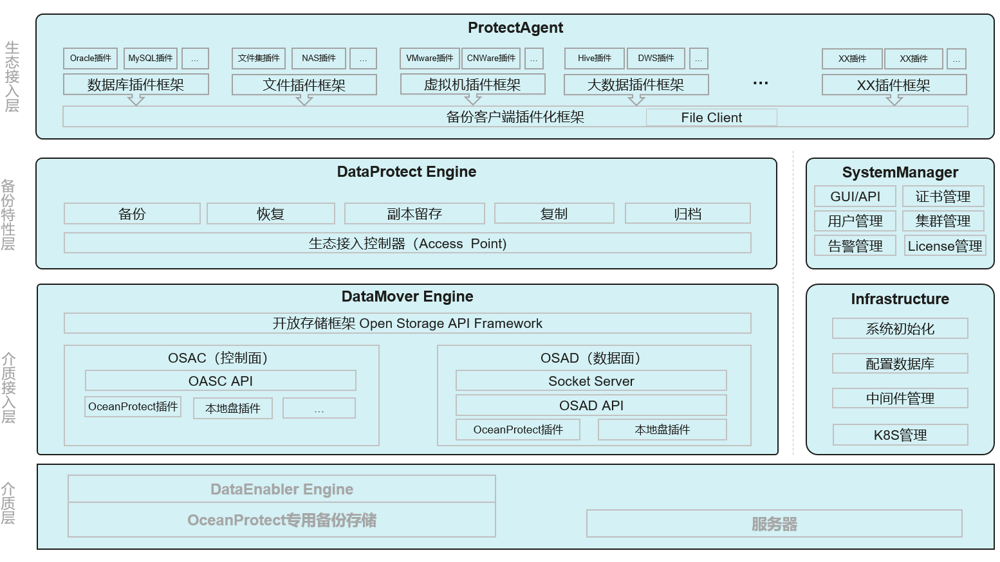

**数据保护代理（ProtetectAgent\)**

主要负责获取生态数据，并将数据写入介质接入层。

**数据保护引擎（DataProtect Engine\)**

主要负责配置保护策略，调度备份/恢复/复制/归档任务，向ProtectAgent发送备份任务，并监控任务执行状态，最终生成备份副本。

**数据移动引擎（DataMover Engine\)**

主要负责统一各种类型的备份存储的接入以及管理，并将ProtectAgent写入的数据写入的各种类型的备份介质进行持久化。

**系统管理器（SystemManager）**

主要负责系统配置管理，如：用户管理、告警管理、证书管理以及集群管理等。

**基于设施（Infrastructure\)**

主要负责管理K8S集群以及为其他管理及业务模块提供基础能力，如：数据库服务，Kafka消息服务，ElasticSearch服务，Zookeeper服务等。

**数据使能引擎\(DataEngabler Engine\)**

主要负责将备份数据再次进行加工利用，使能其他业务，如：对数据进行脱敏、勒索检测、AirGap隔离、以及对备份副本再次扫描，抽取元数据，提供检索服务等，该模块与open-eBackup备份介质密不可分，需与open-eBackup介质绑定使用。

## 产品原理<a name="ZH-CN_TOPIC_0000002013071429"></a>

open-eBackup的业务流程主要集中在ProtectAgent、DataProtect Engine和DataMover Engine三个子系统内，在备份的过程中，调用关系如下图所示：

**图 1** <a name="fig185772943315"></a>  
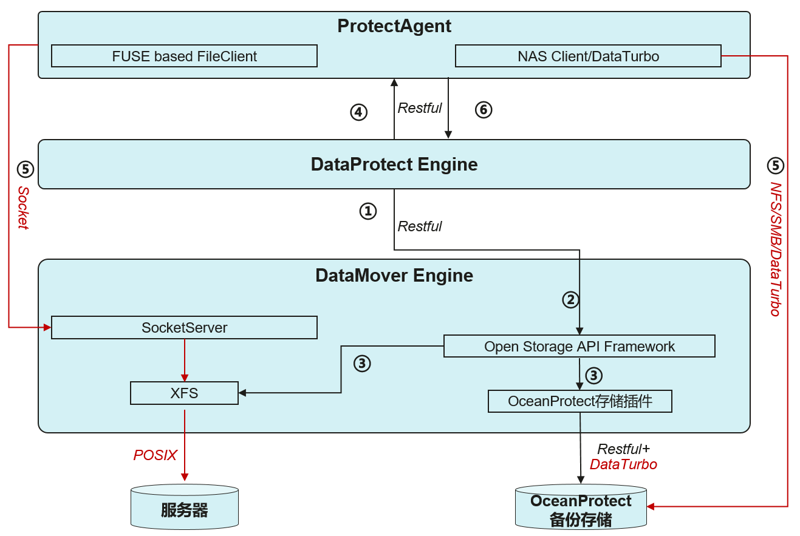

①** **DataProtect Engine发送创建存储库请求到DataMover Engine。

② DataMover Engine将请求转发到存储接入框架。

③ 存储接入框架根据存储类型，创建不同类型的存储库，以本地盘为例，Open Storage API Framework在本地盘上创建XFS文件作为备份存储库。

④ 准备运作完成后，DataProtect Engine将备份请求发送到ProtectAgent。

⑤ Protect Agent根据所备份的应用类型，将备份请求转发到不同的应用插件进行备份，并且根据不同的备份存储类型，调用不同的数据客户端将数据写入到不同的存储。以本地盘为例，ProtectAgent调用FUSE based FileClient将数据写入到DataMover Engine的SocketServer，SocketServer再将数据写入XFS文件系统。

## 工程简介<a name="ZH-CN_TOPIC_0000001976511326"></a>

open-eBackup工程中包含3个重要的目录：

-   build: 编译脚本入口，所有的编译构建从这里开始。
-   doc: 文件目录，关于open-eBackup的相关文档都归档在这里。
-   src: 代码所在路径，所有的开源代码都归档这里。
    -   ProtectAgent： 数据保护客户端，负责抓取生产应用数据，并写入备份存储。或读取备份存储数据，写入生产应用。
    -   AppPlugins: 应用备份插件，其中包含数据库备份插件、虚拟化备份插件、文件备份插件等。
    -   ProtectManager: 数据保护管理引擎，负责配置策略、策略调度、副本管理、任务管理等。
    -   DataMoverEngine: 数据移动引擎，负责管理备份存储、封装存储接口、副本复制、副本归档等。
    -   Infrastructure\_OM：基础设施，负责基础能力管理，如：数据库管理、缓存管理、检索引擎管理、消息队列管理等。
    -   DPAProduct: 构建脚本目录。

## 服务器兼容性说明

open-eBackup通用服务器部署模式服务器兼容性继承openEuler操作系统硬件兼容性要求，当前镜像使用的操作系统版本为openEuler 22.03 LTS，openEuler的兼容性列表请参考[openEuler兼容性列表](https://www.openeuler.org/zh/compatibility/)。

# 编译指导<a name="ZH-CN_TOPIC_0000001976671066"></a>


## 概述<a name="ZH-CN_TOPIC_0000001976511350"></a>

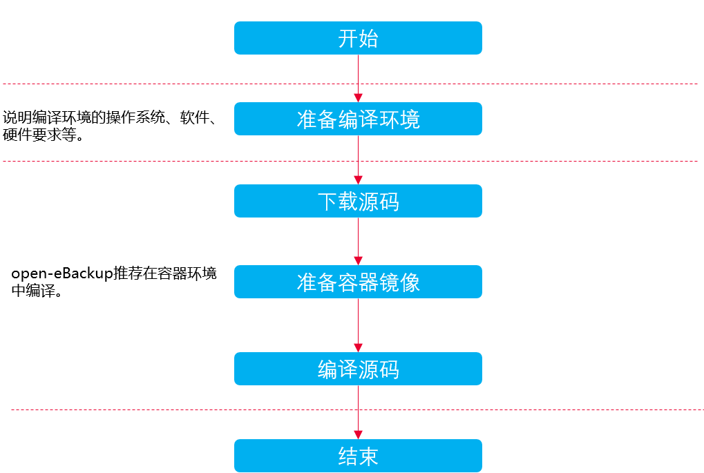

## 编译前准备<a name="ZH-CN_TOPIC_0000001976511334"></a>

1.  硬件要求
    -   主机数量：1台
    -   推荐主机硬件规格：
        -   CPU：4核（64位）
        -   内存：8GB
        -   磁盘空闲空间：100GB

    -   ARM架构的主机编译后生成open-eBackup引擎ARM类型的软件包。暂不支持X86架构的主机编译。

1.  操作系统要求

    open-eBackup引擎支持的操作系统（openEuler aarch64-bit）如下，建议open-eBackup引擎的编译操作系统与运行操作系统一致：

    -   OpenEuler-22.03-LTS\(aarch64\)

    下载地址：

    https://www.openeuler.org/en/download/archive/detail/?version=openEuler%2022.03%20LTS%20SP1

1.  软件要求

    open-eBackup引擎编译过程所依赖的软件如[表1](#table4754929184717)所示。

    **表 1**  软件依赖

    <a name="table4754929184717"></a>
    <table><thead align="left"><tr id="row675413294473"><th class="cellrowborder" valign="top" width="33.33333333333333%" id="mcps1.2.4.1.1"><p id="p39878340472"><a name="p39878340472"></a><a name="p39878340472"></a>所需软件</p>
    </th>
    <th class="cellrowborder" valign="top" width="33.33333333333333%" id="mcps1.2.4.1.2"><p id="p1598703414478"><a name="p1598703414478"></a><a name="p1598703414478"></a>建议版本</p>
    </th>
    <th class="cellrowborder" valign="top" width="33.33333333333333%" id="mcps1.2.4.1.3"><p id="p189871234124715"><a name="p189871234124715"></a><a name="p189871234124715"></a>说明</p>
    </th>
    </tr>
    </thead>
    <tbody><tr id="row3754112984716"><td class="cellrowborder" valign="top" width="33.33333333333333%" headers="mcps1.2.4.1.1 "><p id="p1698713411472"><a name="p1698713411472"></a><a name="p1698713411472"></a>Docker</p>
    </td>
    <td class="cellrowborder" valign="top" width="33.33333333333333%" headers="mcps1.2.4.1.2 "><p id="p209871534154717"><a name="p209871534154717"></a><a name="p209871534154717"></a>18.09.0及后续版本</p>
    </td>
    <td class="cellrowborder" valign="top" width="33.33333333333333%" headers="mcps1.2.4.1.3 "><p id="p698703434713"><a name="p698703434713"></a><a name="p698703434713"></a>用于构建、管理、运行open-eBackup编译镜像和容器。</p>
    </td>
    </tr>
    <tr id="row137542292478"><td class="cellrowborder" valign="top" width="33.33333333333333%" headers="mcps1.2.4.1.1 "><p id="p1398743434714"><a name="p1398743434714"></a><a name="p1398743434714"></a>Helm</p>
    </td>
    <td class="cellrowborder" valign="top" width="33.33333333333333%" headers="mcps1.2.4.1.2 "><p id="p598718345471"><a name="p598718345471"></a><a name="p598718345471"></a>3.13.3及后续版本</p>
    </td>
    <td class="cellrowborder" valign="top" width="33.33333333333333%" headers="mcps1.2.4.1.3 "><p id="p5987034174713"><a name="p5987034174713"></a><a name="p5987034174713"></a>用于构建、部署open-eBackup的容器。下载地址：</p>
    <p id="p498718342474"><a name="p498718342474"></a><a name="p498718342474"></a><a href="https://github.com/helm/helm/releases/tag/v3.13.3" target="_blank" rel="noopener noreferrer">https://github.com/helm/helm/releases/tag/v3.13.3</a></p>
    <p id="p39875347478"><a name="p39875347478"></a><a name="p39875347478"></a><a href="https://get.helm.sh/helm-v3.13.3-linux-arm64.tar.gz" target="_blank" rel="noopener noreferrer">https://get.helm.sh/helm-v3.13.3-linux-arm64.tar.gz</a></p>
    </td>
    </tr>
    <tr id="row4754162911476"><td class="cellrowborder" valign="top" width="33.33333333333333%" headers="mcps1.2.4.1.1 "><p id="p7987103414478"><a name="p7987103414478"></a><a name="p7987103414478"></a>Git</p>
    </td>
    <td class="cellrowborder" valign="top" width="33.33333333333333%" headers="mcps1.2.4.1.2 "><p id="p11987183494717"><a name="p11987183494717"></a><a name="p11987183494717"></a>2.33.0及后续版本</p>
    </td>
    <td class="cellrowborder" valign="top" width="33.33333333333333%" headers="mcps1.2.4.1.3 "><p id="p1098783464718"><a name="p1098783464718"></a><a name="p1098783464718"></a>用于下载源码。</p>
    </td>
    </tr>
    </tbody>
    </table>

1.  软件安装
    1.  执行以下命令安装docker。

        ```
        yum install -y docker
        ```

    2.  执行以下命令安装Helm。

        ```
        tar -zxvf helm-v3.13.3-linux-arm64.tar.gz linux-arm64/helm
        ```

        ```
        cp linux-arm64/helm /usr/local/bin
        ```

    3.  安装Git。

        ```
        yum install -y git
        ```

## 版本编译<a name="ZH-CN_TOPIC_0000002013071433"></a>


### 准备源码及其依赖二进制<a name="ZH-CN_TOPIC_0000002018517437"></a>

**操作步骤<a name="section582816517517"></a>**

1.  使用root用户登录主机。
2.  创建并进入源码下载目录。

    此处以将源码下载到目录“/open-eBackup”为例进行说明，您可根据实际环境进行替换。

    ```
    mkdir -p /open-eBackup
    ```

    ```
    cd /open-eBackup
    ```

3.  执行以下命令下载open-eBackup引擎源码。

    ```
    git clone https://gitcode.com/eBackup/open-eBackup.git
    ```

4.  下载[open-eBackup-bin.tgz](https://support.huawei.com/enterprise/zh/flash-storage/oceanprotect-databackup-pid-258115661/software/265701101?idAbsPath=fixnode01|7919749|251366268|250389224|251366267|258115661)到当前目录并解压。
    备注：如前期增加过下载白名单，可直接下载；如前期未增加下载白名单，则需向openebackup@163.com发送下载申请，并提供华为support账号
    
    ```
    mkdir -p open-eBackup-bin
    tar -zxvf open-eBackup-bin.tgz -C open-eBackup-bin
    ```

5.  [Nodejs官网](https://nodejs.org/)下载适合您服务器的nodejs包，版本选择18.20.1，解压到open-eBackup-bin目录并重命名为nodejs

    arm64版本参考如下地址

    ```
    https://nodejs.org/dist/v18.20.1/node-v18.20.1-linux-arm64.tar.xz
    tar -xvJf node-v18.20.1-linux-arm64.tar.xz
    mv node-v18.20.1-linux-arm64 open-eBackup-bin/nodejs
    ```

6.  下载openEuler到open-eBackup-bin目录下。

    下载地址为：

    ```
    https://repo.openeuler.org/openEuler-22.03-LTS/docker_img/aarch64/openEuler-docker.aarch64.tar.xz
    ```

7.  下载openGauss到open-eBackup-bin目录

    下载地址为：

    ```
    https://opengauss.obs.cn-south-1.myhuaweicloud.com/5.0.0/arm_2203/openGauss-Lite-5.0.0-openEuler-aarch64.tar.gz
    ```

8.  下载openGauss-Server和openGauss-connector-python-psycopg2到open-eBackup-bin目录下。

    openGuass-Server下载地址为：

    ```
    https://gitee.com/opengauss/openGauss-server/repository/archive/v5.0.0
    ```

    参考如下地址进行编译：

    ```
    https://gitee.com/opengauss/openGauss-server#%E4%BD%BF%E7%94%A8buildsh%E7%BC%96%E8%AF%91%E4%BB%A3%E7%A0%81
    ```

    openGauss-connector-python-psycopg2下载地址为：

    ```
    https://gitee.com/opengauss/openGauss-connector-python-psycopg2/tree/v5.0.0
    ```

    参考如下地址进行编译：

    ```
    https://gitee.com/opengauss/openGauss-connector-python-psycopg2
    ```

    生成openGauss-5.0.0-openEuler-aarch64-Python.tar.gz文件。将该文件拷贝到open-eBackup-bin目录下。

### 准备容器镜像<a name="ZH-CN_TOPIC_0000001982077300"></a>

**操作步骤<a name="section5812195513530"></a>**

1.  下载openEuler镜像，下载地址为：

    ```
    https://mirrors.aliyun.com/openeuler/openEuler-22.03-LTS/docker_img/aarch64/openEuler-docker.aarch64.tar.xz
    ```

2.  导入基础镜像。

    ```
    docker load -i openEuler-docker.aarch64.tar.xz
    ```

3.  执行以下命令切换目录。

    ```
    cd /open-eBackup/open-eBackup/build
    ```

4.  执行以下命令构建编译镜像。

    ```
    sh build_compile_container.sh
    ```

5.  执行以下命令查询编译镜像。

    ```
    docker image ls
    ```

    输出结果为：

    ```
    REPOSITORY                                        TAG                 IMAGE ID            CREATED             SIZE
    open-ebackup                                     devel               41ce54e25fdc        3 hours ago         1.22GB
    ```

### 编译源码<a name="ZH-CN_TOPIC_0000001981917564"></a>

**操作步骤<a name="section149574014564"></a>**

1.  执行以下命令启动编译容器。

    ```
    docker run -it --name open-ebackup -v /open-eBackup:/open-eBackup -v /var/run/docker.sock:/var/run/docker.sock -v /usr/local/bin/helm:/usr/bin/helm -v /usr/bin/docker:/usr/bin/docker open-ebackup:devel /bin/bash
    ```

2.  在容器中执行以下命令切换路径。

    ```
    cd /open-eBackup/open-eBackup/build
    ```

3.  执行以下命令进行代码编译。

    ```
    sh package_open_source_final.sh <workspace_dir> <code_path> <binary_path>
    如：sh package_open_source_final.sh /open-eBackup /open-eBackup/open-eBackup /open-eBackup/open-eBackup-bin
    ```

    > **说明：** 
    >workspace\_dir: 编译的工作路径，是代码路径和二进制目录的根目录
    >code\_path: 代码存放路径
    >binary\_path: 二进制存放路径

    编译完成后会在dest目录下生成open-ebackup-1.0.zip和open-ebackup-agent-1.0.zip文件。

# 安装软件包<a name="ZH-CN_TOPIC_0000002013230921"></a>


## 安装open-eBackup服务端软件<a name="ZH-CN_TOPIC_0000002013230953"></a>


### 安装与配置流程<a name="ZH-CN_TOPIC_0000001976511342"></a>

**图 1**  安装与配置流程<a name="fig937017146464"></a>  
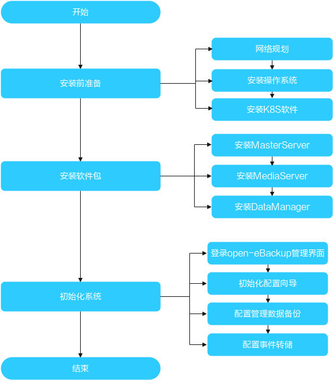

### 安装前环境准备<a name="ZH-CN_TOPIC_0000001976671058"></a>


#### 网络规划<a name="ZH-CN_TOPIC_0000002025914125"></a>

open-eBackup的网络平面名称及含义说明如[表1](#table1616882813438)所示。

**表 1**  网络平面说明

<a name="table1616882813438"></a>
<table><thead align="left"><tr id="row1516882834310"><th class="cellrowborder" valign="top" width="11.39%" id="mcps1.2.3.1.1"><p id="p216832894316"><a name="p216832894316"></a><a name="p216832894316"></a>名称</p>
</th>
<th class="cellrowborder" valign="top" width="88.61%" id="mcps1.2.3.1.2"><p id="p12168122824310"><a name="p12168122824310"></a><a name="p12168122824310"></a>说明</p>
</th>
</tr>
</thead>
<tbody><tr id="row71681128184316"><td class="cellrowborder" valign="top" width="11.39%" headers="mcps1.2.3.1.1 "><p id="p91687286437"><a name="p91687286437"></a><a name="p91687286437"></a>管理网络</p>
</td>
<td class="cellrowborder" valign="top" width="88.61%" headers="mcps1.2.3.1.2 "><p id="p113512165012"><a name="p113512165012"></a><a name="p113512165012"></a>与客户管理网络对接，用于系统管理和维护。</p>
</td>
</tr>
<tr id="row11168528124313"><td class="cellrowborder" valign="top" width="11.39%" headers="mcps1.2.3.1.1 "><p id="p2168102812434"><a name="p2168102812434"></a><a name="p2168102812434"></a>备份网络</p>
</td>
<td class="cellrowborder" valign="top" width="88.61%" headers="mcps1.2.3.1.2 "><p id="p91681928194311"><a name="p91681928194311"></a><a name="p91681928194311"></a>与客户应用系统对接，实现主机、应用和虚拟化环境的备份恢复。</p>
</td>
</tr>
<tr id="row1116812818438"><td class="cellrowborder" valign="top" width="11.39%" headers="mcps1.2.3.1.1 "><p id="p1616932820433"><a name="p1616932820433"></a><a name="p1616932820433"></a>归档网络</p>
</td>
<td class="cellrowborder" valign="top" width="88.61%" headers="mcps1.2.3.1.2 "><p id="p111691528144315"><a name="p111691528144315"></a><a name="p111691528144315"></a>与客户的对象存储对接，实现副本归档保护。</p>
</td>
</tr>
<tr id="row18493157174"><td class="cellrowborder" valign="top" width="11.39%" headers="mcps1.2.3.1.1 "><p id="p184931877717"><a name="p184931877717"></a><a name="p184931877717"></a>复制网络</p>
</td>
<td class="cellrowborder" valign="top" width="88.61%" headers="mcps1.2.3.1.2 "><p id="p134931177717"><a name="p134931177717"></a><a name="p134931177717"></a>与从端open-eBackup对接，实现副本复制。</p>
</td>
</tr>
<tr id="row35617451193"><td class="cellrowborder" valign="top" width="11.39%" headers="mcps1.2.3.1.1 "><p id="p956118451599"><a name="p956118451599"></a><a name="p956118451599"></a>内部通信网络</p>
</td>
<td class="cellrowborder" valign="top" width="88.61%" headers="mcps1.2.3.1.2 "><p id="p75613457915"><a name="p75613457915"></a><a name="p75613457915"></a>open-eBackup集群节点间进行管理信令的传输。</p>
</td>
</tr>
</tbody>
</table>

open-eBackup备份场景的组网示意如[图1](#fig63591548103512)所示。

**图 1**  备份组网示意<a name="fig63591548103512"></a>  

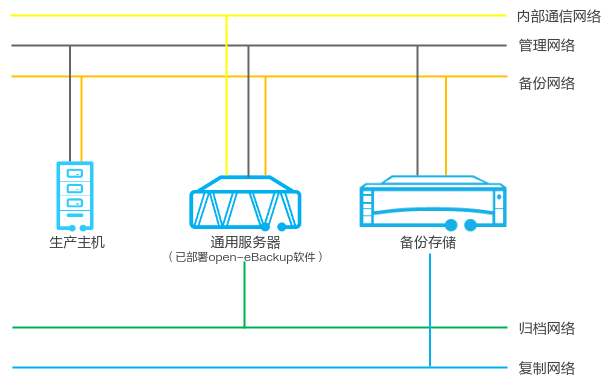

**数据规划<a name="zh-cn_topic_0000001269184728_zh-cn_topic_0000001213462433_zh-cn_topic_0000001133006201_zh-cn_topic_0304395625_zh-cn_topic_0304392980_section17660280"></a>**

open-eBackup的网络配置要求如[表2](#table8645111412544)所示。

**表 2**  网络配置说明

<a name="table8645111412544"></a>
<table><thead align="left"><tr id="row1564511410547"><th class="cellrowborder" valign="top" width="14.078592140785922%" id="mcps1.2.4.1.1"><p id="p10645171417547"><a name="p10645171417547"></a><a name="p10645171417547"></a>名称</p>
</th>
<th class="cellrowborder" valign="top" width="34.63653634636536%" id="mcps1.2.4.1.2"><p id="p56531242165419"><a name="p56531242165419"></a><a name="p56531242165419"></a>IP地址个数</p>
</th>
<th class="cellrowborder" valign="top" width="51.28487151284872%" id="mcps1.2.4.1.3"><p id="p3646714205410"><a name="p3646714205410"></a><a name="p3646714205410"></a>说明</p>
</th>
</tr>
</thead>
<tbody><tr id="row964691415419"><td class="cellrowborder" valign="top" width="14.078592140785922%" headers="mcps1.2.4.1.1 "><p id="p10646141414541"><a name="p10646141414541"></a><a name="p10646141414541"></a>管理网络</p>
</td>
<td class="cellrowborder" valign="top" width="34.63653634636536%" headers="mcps1.2.4.1.2 "><p id="p1149312462176"><a name="p1149312462176"></a><a name="p1149312462176"></a>1个管理IP/节点</p>
</td>
<td class="cellrowborder" valign="top" width="51.28487151284872%" headers="mcps1.2.4.1.3 "><p id="p17831115816166"><a name="p17831115816166"></a><a name="p17831115816166"></a>支持IPv4和IPv6。</p>
</td>
</tr>
<tr id="row12646161485410"><td class="cellrowborder" valign="top" width="14.078592140785922%" headers="mcps1.2.4.1.1 "><p id="p1864613146546"><a name="p1864613146546"></a><a name="p1864613146546"></a>备份网络</p>
</td>
<td class="cellrowborder" valign="top" width="34.63653634636536%" headers="mcps1.2.4.1.2 "><p id="p89311548121719"><a name="p89311548121719"></a><a name="p89311548121719"></a>1个备份IP/节点</p>
</td>
<td class="cellrowborder" valign="top" width="51.28487151284872%" headers="mcps1.2.4.1.3 "><p id="p10846192116194"><a name="p10846192116194"></a><a name="p10846192116194"></a>-</p>
</td>
</tr>
<tr id="row146461140549"><td class="cellrowborder" valign="top" width="14.078592140785922%" headers="mcps1.2.4.1.1 "><p id="p1646514145411"><a name="p1646514145411"></a><a name="p1646514145411"></a>归档网络</p>
</td>
<td class="cellrowborder" valign="top" width="34.63653634636536%" headers="mcps1.2.4.1.2 "><a name="ul158771028151817"></a><a name="ul158771028151817"></a><ul id="ul158771028151817"><li>独立归档网络场景：1个归档IP/节点</li><li>复用备份网络场景：无需额外规划IP</li></ul>
</td>
<td class="cellrowborder" valign="top" width="51.28487151284872%" headers="mcps1.2.4.1.3 "><p id="p18845132151914"><a name="p18845132151914"></a><a name="p18845132151914"></a>-</p>
</td>
</tr>
<tr id="row16215152513916"><td class="cellrowborder" valign="top" width="14.078592140785922%" headers="mcps1.2.4.1.1 "><p id="p22150251797"><a name="p22150251797"></a><a name="p22150251797"></a>复制网络</p>
</td>
<td class="cellrowborder" valign="top" width="34.63653634636536%" headers="mcps1.2.4.1.2 "><a name="ul106031445151810"></a><a name="ul106031445151810"></a><ul id="ul106031445151810"><li>独立归档网络场景：1个复制IP/节点</li><li>复用备份网络场景：无需额外规划IP</li></ul>
</td>
<td class="cellrowborder" valign="top" width="51.28487151284872%" headers="mcps1.2.4.1.3 "><p id="p1844221171914"><a name="p1844221171914"></a><a name="p1844221171914"></a>-</p>
</td>
</tr>
<tr id="row149235301285"><td class="cellrowborder" valign="top" width="14.078592140785922%" headers="mcps1.2.4.1.1 "><p id="p1392353017816"><a name="p1392353017816"></a><a name="p1392353017816"></a>内部通信网络</p>
</td>
<td class="cellrowborder" valign="top" width="34.63653634636536%" headers="mcps1.2.4.1.2 "><a name="ul43117501388"></a><a name="ul43117501388"></a><ul id="ul43117501388"><li>≥2个/节点</li><li>复用备份网络场景：无需额外规划IP</li></ul>
</td>
<td class="cellrowborder" valign="top" width="51.28487151284872%" headers="mcps1.2.4.1.3 "><p id="p69236301581"><a name="p69236301581"></a><a name="p69236301581"></a>当用户有集群高可用需求时，才需要规划内部通信网络。</p>
</td>
</tr>
</tbody>
</table>

#### 操作系统安装<a name="ZH-CN_TOPIC_0000002069751993"></a>

操作系统安装不在此文档中描述，请参与不同的操作系统安装文档安装操作系统。

#### Kubenetes安装<a name="ZH-CN_TOPIC_0000002033875950"></a>

Kubenetes集群的安装不在此文档 中描述，请参考kubenetes官方文档安装kubenetes集群。

举例（在openEuler 22.03版本操作系统上安装，仅作参考）：

1.  修改节点名

    ```
    hostnamectl set-hostname master
    ```

2.  安装docker

    ```
    yum install -y docker
    ```

3.  启动docker服务

    ```
    ystemctl start docker
    systemctl enable docker
    ```

4.  配置镜像源

    ```
    cat <<EOF > /etc/docker/daemon.json
    {
    "registry-mirrors": ["https://hub-mirror.c.163.com", "https://docker.mirrors.ustc.edu.cn", "https://registry.docker-cn.com"],
    "insecure-registries": ["hub-mirror.c.163.com", "docker.mirrors.ustc.edu.cn", "registry.docker-cn.com"],
    "seccomp-profile": "/etc/docker/profile.json",
    "exec-opts": ["native.cgroupdriver=systemd"],
    "experimental":true
    }
    EOF
    
    cat <<EOF > /etc/docker/profile.json
    {}
    EOF
    ```

    > **说明：** 
    >如果系统盘容量不足，请将docker的存储路径修改到其他路径，如：
    >```
    >"data-root":"<hostpath>",
    >```

5.  添加K8S yum源

    ```
    cat <<EOF > /etc/yum.repos.d/kubernetes.repo
    [kubernetes]
    name=Kubernetes
    baseurl=https://mirrors.aliyun.com/kubernetes/yum/repos/kubernetes-el7-aarch64/
    enabled=1
    gpgcheck=1
    repo_gpgcheck=1
    gpgkey=https://mirrors.aliyun.com/kubernetes/yum/doc/yum-key.gpg https://mirrors.aliyun.com/kubernetes/yum/doc/rpm-package-key.gpg
    EOF
    ```

1.  重启docker服务

    ```
    systemctl daemon-reload
    systemctl restart docker
    ```

2.  安装kubeadm，kubelet，kubectl（指定版本）

    ```
    yum install -y kubelet-1.23.6 kubeadm-1.23.6 kubectl-1.23.6
    ```

1.  设置kubelet开机自启动

    ```
    systemctl enable kubelet
    ```

1.  提前拉取CoreDNS镜像（上述镜像源中的coredns镜像不是ARM架构镜像）

    ```
    docker pull registry.cn-hangzhou.aliyuncs.com/goodrain/mirrored-coredns-coredns:1.10.1
    docker tag registry.cn-hangzhou.aliyuncs.com/goodrain/mirrored-coredns-coredns:1.10.1 registry.aliyuncs.com/google_containers/coredns:v1.8.4
    ```

1.  初始化K8S服务

    ```
    kubeadm init --apiserver-advertise-address=<管理平面IP> --image-repository registry.aliyuncs.com/google_containers --service-cidr=10.1.0.0/16 --pod-network-cidr=10.244.0.0/16 --kubernetes-version=v1.23.6
    ```

1.  去除污点节点

    ```
    kubectl taint node master node-role.kubernetes.io/master-
    ```

1.  给节点添加标签

    ```
    kubectl label nodes master role=MASTER --overwrite
    ```

#### 网络插件安装<a name="ZH-CN_TOPIC_0000002064194990"></a>

参考官网安装网络插件，本文以Flannel举例：

1.  安装cni-plugins-linux

    下载地址
    ```
    https://github.com/containernetworking/plugins/releases/download/v0.9.1/cni-plugins-linux-arm64-v0.9.1.tgz
    ```
    解压到`/opt/cni/bin`目录下
    ```
    tar -zxvf cni-plugins-linux-arm64-v0.9.1.tgz  -C /opt/cni/bin
    ```

2.  编辑kube-flannel.yaml

    ```
    ---
    kind: Namespace
    apiVersion: v1
    metadata:
      name: kube-flannel
      labels:
        k8s-app: flannel
        pod-security.kubernetes.io/enforce: privileged
    ---
    kind: ClusterRole
    apiVersion: rbac.authorization.k8s.io/v1
    metadata:
      labels:
        k8s-app: flannel
      name: flannel
    rules:
    - apiGroups:
      - ""
      resources:
      - pods
      verbs:
      - get
    - apiGroups:
      - ""
      resources:
      - nodes
      verbs:
      - get
      - list
      - watch
    - apiGroups:
      - ""
      resources:
      - nodes/status
      verbs:
      - patch
    ---
    kind: ClusterRoleBinding
    apiVersion: rbac.authorization.k8s.io/v1
    metadata:
      labels:
        k8s-app: flannel
      name: flannel
    roleRef:
      apiGroup: rbac.authorization.k8s.io
      kind: ClusterRole
      name: flannel
    subjects:
    - kind: ServiceAccount
      name: flannel
      namespace: kube-flannel
    ---
    apiVersion: v1
    kind: ServiceAccount
    metadata:
      labels:
        k8s-app: flannel
      name: flannel
      namespace: kube-flannel
    ---
    kind: ConfigMap
    apiVersion: v1
    metadata:
      name: kube-flannel-cfg
      namespace: kube-flannel
      labels:
        tier: node
        k8s-app: flannel
        app: flannel
    data:
      cni-conf.json: |
        {
          "name": "cbr0",
          "cniVersion": "0.3.1",
          "plugins": [
            {
              "type": "flannel",
              "delegate": {
                "hairpinMode": true,
                "isDefaultGateway": true
              }
            },
            {
              "type": "portmap",
              "capabilities": {
                "portMappings": true
              }
            }
          ]
        }
      net-conf.json: |
        {
          "Network": "10.244.0.0/16",
          "EnableNFTables": false,
          "Backend": {
            "Type": "vxlan"
          }
        }
    ---
    kind: DaemonSet
    apiVersion: apps/v1
    metadata:
      name: kube-flannel-ds
      namespace: kube-flannel
      labels:
        tier: node
        app: flannel
        k8s-app: flannel
    spec:
      selector:
        matchLabels:
          app: flannel
      template:
        metadata:
          labels:
            tier: node
            app: flannel
        spec:
          affinity:
            nodeAffinity:
              requiredDuringSchedulingIgnoredDuringExecution:
                nodeSelectorTerms:
                - matchExpressions:
                  - key: kubernetes.io/os
                    operator: In
                    values:
                    - linux
          hostNetwork: true
          priorityClassName: system-node-critical
          tolerations:
          - operator: Exists
            effect: NoSchedule
          serviceAccountName: flannel
          initContainers:
          - name: install-cni-plugin
            image: docker.io/flannel/flannel-cni-plugin:v1.5.1-flannel2
            command:
            - cp
            args:
            - -f
            - /flannel
            - /opt/cni/bin/flannel
            volumeMounts:
            - name: cni-plugin
              mountPath: /opt/cni/bin
          - name: install-cni
            image: docker.io/flannel/flannel:v0.26.0
    
            command:
            - cp
            args:
            - -f
            - /etc/kube-flannel/cni-conf.json
            - /etc/cni/net.d/10-flannel.conflist
            volumeMounts:
            - name: cni
              mountPath: /etc/cni/net.d
            - name: flannel-cfg
              mountPath: /etc/kube-flannel/
          containers:
          - name: kube-flannel
            image: docker.io/flannel/flannel:v0.26.0
            command:
            - /opt/bin/flanneld
            args:
            - --ip-masq
            - --kube-subnet-mgr
            resources:
              requests:
                cpu: "100m"
                memory: "50Mi"
            securityContext:
              privileged: false
              capabilities:
                add: ["NET_ADMIN", "NET_RAW"]
            env:
            - name: POD_NAME
              valueFrom:
                fieldRef:
                  fieldPath: metadata.name
            - name: POD_NAMESPACE
              valueFrom:
                fieldRef:
                  fieldPath: metadata.namespace
            - name: EVENT_QUEUE_DEPTH
              value: "5000"
            volumeMounts:
            - name: run
              mountPath: /run/flannel
            - name: flannel-cfg
              mountPath: /etc/kube-flannel/
            - name: xtables-lock
              mountPath: /run/xtables.lock
          volumes:
          - name: run
            hostPath:
              path: /run/flannel
    
          - name: cni-plugin
            hostPath:
              path: /opt/cni/bin
          - name: cni
            hostPath:
              path: /etc/cni/net.d
          - name: flannel-cfg
            configMap:
              name: kube-flannel-cfg
          - name: xtables-lock
            hostPath:
              path: /run/xtables.lock
              type: FileOrCreate
    ```

1.  安装flannel服务

    ```
    kubectl apply -f kube-flannel.yaml
    ```

#### Traefik安装<a name="ZH-CN_TOPIC_0000002099332589"></a>

Traefik的安装请参考Traefik官方文档安装，配置参数请关注如下例子步骤中的IP地及端口的配置要与业务服务端口相对应。

举例（仅作参考）：

**section title<a name="section138591352123210"></a>**

1.  拉取traefik镜像：

    ```
    docker pull swr.cn-north-4.myhuaweicloud.com/ddn-k8s/docker.io/rancher/mirrored-library-traefik:2.10.7-linuxarm64v8
    docker tag swr.cn-north-4.myhuaweicloud.com/ddn-k8s/docker.io/rancher/mirrored-library-traefik:2.10.7-linuxarm64v8 traefik:v2.11.2
    ```

2.  编辑traefik\_config.yaml（IP地址<IP\_ADDR\>根据实际情况修改）

    ```
    kind: ConfigMap
    apiVersion: v1
    metadata:
      name: traefik-config
      namespace: kube-system
    data:
      traefik.yaml: |-
        ping: ""                    ## 启用 Ping
        serversTransport:
          insecureSkipVerify: true  ## Traefik 忽略验证代理服务的 TLS 证书
        api:
          insecure: true            ## 允许 HTTP 方式访问 API
          dashboard: false           ## 启用 Dashboard
          debug: false              ## 启用 Debug 调试模式
        metrics:
          prometheus: ""            ## 配置 Prometheus 监控指标数据，并使用默认配置
        entryPoints:
          gui:
            address: "<IP_ADDR>:25080"
            http:
              redirections:
                entryPoint:
                  to: gui
                  scheme: https
            forwardedHeaders:
              insecure: true
            transport:
              respondingTimeouts:
                readTimeout: 0
            proxyProtocol:
                  insecure: true
          third:
            address: "<IP_ADDR>:25081"
            forwardedHeaders:
              insecure: true
            transport:
              respondingTimeouts:
                readTimeout: 0
            proxyProtocol:
                  insecure: true
          third_local:
            address: "127.0.0.1:25081"
            forwardedHeaders:
              insecure: true
            transport:
              respondingTimeouts:
                readTimeout: 0
            proxyProtocol:
                  insecure: true
          agent:
            address: "<IP_ADDR>:25082"
            forwardedHeaders:
              insecure: true
            proxyProtocol:
              insecure: true
            transport:
              respondingTimeouts:
                readTimeout: 0
          traefik:
            address: "127.0.0.1:25083"
            forwardedHeaders:
              insecure: true
            transport:
              respondingTimeouts:
                readTimeout: 0
          internal:
            address: "<IP_ADDR>:25084"
            forwardedHeaders:
              insecure: true
            transport:
              respondingTimeouts:
                readTimeout: 0
          replica:
            address: "<IP_ADDR>:25085"
            forwardedHeaders:
              insecure: true
            transport:
              respondingTimeouts:
                readTimeout: 0
        providers:
          kubernetesCRD: ""         ## 启用 Kubernetes CRD 方式来配置路由规则
          kubernetesIngress: ""     ## 启用 Kubernetes Ingress 方式来配置路由规则
        log:
          filePath: "/var/log/traefik/msg_traefik.log"              ## 设置调试日志文件存储路径，如果为空则输出到控制台
          level: INFO               ## 设置日志级别
          format: json              ## 设置调试日志格式
        accessLog:
          filePath: ""              ## 设置访问日志文件存储路径，如果为空则输出到控制台
          format: json              ## 设置访问调试日志格式
          bufferingSize: 0          ## 设置访问日志缓存行数
          filters:
            #statusCodes: ["200"]   ## 设置只保留指定状态码范围内的访问日志
            retryAttempts: true     ## 设置代理访问重试失败时，保留访问日志
            minDuration: 20         ## 设置保留请求时间超过指定持续时间的访问日志
          fields:                   ## 设置访问日志中的字段是否保留（keep 保留、drop 不保留）
            defaultMode: keep       ## 设置默认保留访问日志字段
            names:                  ## 针对访问日志特别字段特别配置保留模式
              ClientUsername: drop
            headers:                ## 设置 Header 中字段是否保留
              defaultMode: keep     ## 设置默认保留 Header 中字段
              names:                ## 针对 Header 中特别字段特别配置保留模式
                User-Agent: redact
                Authorization: drop
                Content-Type: keep
    ```

3.  编辑traefik\_rbac.yaml

    ```
    apiVersion: rbac.authorization.k8s.io/v1
    kind: ClusterRole
    metadata:
      name: traefik-ingress-controller
    
    rules:
      - apiGroups:
          - ""
        resources:
          - services
          - endpoints
          - secrets
        verbs:
          - get
          - list
          - watch
      - apiGroups:
          - extensions
          - networking.k8s.io
        resources:
          - ingresses
          - ingressclasses
        verbs:
          - get
          - list
          - watch
      - apiGroups:
          - extensions
          - networking.k8s.io
        resources:
          - ingresses/status
        verbs:
          - update
      - apiGroups:
          - traefik.io
          - traefik.containo.us
        resources:
          - middlewares
          - middlewaretcps
          - ingressroutes
          - traefikservices
          - ingressroutetcps
          - ingressrouteudps
          - tlsoptions
          - tlsstores
          - serverstransports
        verbs:
          - get
          - list
          - watch
    
    ---
    apiVersion: rbac.authorization.k8s.io/v1
    kind: ClusterRoleBinding
    metadata:
      name: traefik-ingress-controller
    roleRef:
      apiGroup: rbac.authorization.k8s.io
      kind: ClusterRole
      name: traefik-ingress-controller
    subjects:
      - kind: ServiceAccount
        name: traefik-ingress-controller
        namespace: kube-system
    
    ---
    apiVersion: v1
    kind: ServiceAccount
    metadata:
      namespace: kube-system
      name: traefik-ingress-controller
    ```

4.  编辑traefik\_ingress\_controller.yaml

    ```
    apiVersion: v1
    kind: Service
    metadata:
      name: traefik
      namespace: kube-system
    spec:
      ports:
        - name: internal
          port: 80
          targetPort: 25084
        - name: agent
          port: 90
          targetPort: 25082
      selector:
        app: traefik
    ---
    apiVersion: apps/v1
    kind: DaemonSet
    metadata:
      name: traefik-ingress-controller
      namespace: kube-system
      labels:
        app: traefik
    spec:
      selector:
        matchLabels:
          app: traefik
      template:
        metadata:
          name: traefik
          labels:
            app: traefik
        spec:
          securityContext:
            seccompProfile:
              type: RuntimeDefault
          affinity:
            nodeAffinity:
              requiredDuringSchedulingIgnoredDuringExecution:
                nodeSelectorTerms:
                  - matchExpressions:
                      - key: node-role.kubernetes.io/master
                        operator: Exists
          serviceAccountName: traefik-ingress-controller
          terminationGracePeriodSeconds: 1
          hostNetwork: true
          containers:
            - image: traefik:v2.11.2
              name: traefik-ingress-lb
              securityContext:
                runAsNonRoot: false
              ports:
                - name: gui
                  containerPort: 25080  #entryPoint端口,与configMap配置一致
                  hostPort: 25080       #宿主机规划占用端口
                - name: third
                  containerPort: 25081  #entryPoint端口
                  hostPort: 25081       #宿主机规划占用端口
                - name: agent
                  containerPort: 25082  #entryPoint端口
                  hostPort: 25082       #宿主机规划占用端口
                - name: traefik
                  containerPort: 25083
                  hostPort: 25083
                - name: internal
                  containerPort: 25084
                  hostPort: 25084
              command: ["/usr/local/bin/traefik"]
              args:
                - --configfile=/config/traefik.yaml
              volumeMounts:
                - mountPath: "/config"
                  name: "config"
          volumes:
            - name: config
              configMap:
                name: traefik-config
          tolerations:              ## 设置容忍所有污点，防止节点被设置污点
            - key: node-role.kubernetes.io/master
              operator: Exists
    ```

5.  下载traefik

    ```
    https://github.com/traefik/traefik-helm-chart/archive/refs/tags/v27.0.2.tar.gz
    ```

6.  部署traefik资源

    ```
    mkdir -p /opt/k8s/run/conf/traefik
    cd /opt/k8s/run/conf/traefik
    tar -xvf traefik-helm-chart-27.0.2.tar.gz
    cd traefik-helm-chart-27.0.2/traefik
    kubectl apply -f crds
    kubectl apply -f traefik_config.yaml
    kubectl apply -f traefik_rbac.yaml
    kubectl apply -f traefik_ingress_controller.yaml
    ```

### 安装软件包<a name="ZH-CN_TOPIC_0000002025926209"></a>


#### 在通用服务器上安装<a name="ZH-CN_TOPIC_0000002030791265"></a>

> **说明：** 
>1. openEuler 22.03操作系统已安装完成。
>2. Kubernetes 1.31及以后版本已安装完成。


##### 安装前准备<a name="ZH-CN_TOPIC_0000002030912765"></a>

**操作步骤<a name="section14880112812335"></a>**

1.  浏览器打下如下地址，下载ARM版本的helm。

    [https://get.helm.sh/helm-v3.13.3-linux-arm64.tar.gz](https://get.helm.sh/helm-v3.13.3-linux-arm64.tar.gz)

1.  解压软件包。

    ```
    tar -zxvf helm-v3.0.0-linux-arm.tar.gz
    ```

2.  拷贝helm。

    ```
    cp linux-arm/helm /usr/local/bin
    ```

1.  创建dpa命名空间

    ```
    kubectl create namespace dpa
    ```

2.  创建临时安装目录

    ```
    mdir -p /open-eBackup
    ```

3.  进入安装目录

    ```
    cd /open-eBackup
    ```

4.  上传open-ebackup-1.0.zip到安装环境的/open-eBackup。
5.  解压安装包

    ```
    unzip open-ebackup-1.0.zip
    ```

##### 安装MasterServer<a name="ZH-CN_TOPIC_0000002025805753"></a>

1.  创建dpa命名空间

    ```
    kubectl create namespace dpa
    ```

2.  安装MasterServer

    ```
    tar -zxvf open-eBackup_1.6.RC2_MasterServer.tgz
    mkdir open-eBackup_MasterServer_image
    tar -zxvf open-eBackup_1.6.RC2_MasterServer.tgz -C open-eBackup_MasterServer_image
    docker load -i open-eBackup_MasterServer_image/open-eBackup_1.6.RC2_MasterServer.tar.xz
    
    tar -zxvf open-eBackup_1.6.RC2_MediaServer.tgz
    mkdir open-eBackup_MediaServer_image
    tar -zxvf open-eBackup_1.6.RC2_MediaServer.tgz -C open-eBackup_MediaServer_image
    docker load -i open-eBackup_MediaServer_image/open-eBackup_1.6.RC2_MediaServer.tar.xz
    
    mkdir open-eBackup_MasterServer_chart
    tar -zxvf open-eBackup_MasterServer_chart.tgz -C open-eBackup_MasterServer_chart
    tar -zxvf open-eBackup_MasterServer_chart/databackup-1.6.0-RC2.tgz -C open-eBackup_MasterServer_chart
    helm install master-server open-eBackup_MasterServer_chart/databackup --set global.gaussdbpwd=R2F1c3NkYl8xMjM= --set global.replicas=1 --set global.deploy_type=d10 -n dpa
    ```

3.  查看安装结果

    ```
    kubectl get pods -n dpa
    ```

4.  更新cm infrastructure-conf 资源

    ```
    kubectl edit cm infrastructure-conf -n dpa -oyaml
    ```
    在database.updateTime后加入一行：

    ```
    master: 管理IP,master0
    ```
    master是节点名，8.40.117.214是管理IP

5.  卸载

    ```
    helm uninstall master-server -n dpa
    ```

##### 安装MediaServer<a name="ZH-CN_TOPIC_0000001989246506"></a>

1.  安装MediaServer

    ```
    mkdir open-eBackup_MediaServer_chart
    tar -zxvf open-eBackup_MediaServer_chart.tgz -C open-eBackup_MediaServer_chart
    tar -zxvf open-eBackup_MediaServer_chart/databackup-1.6.0-RC2.tgz -C open-eBackup_MediaServer_chart
    helm install media-server open-eBackup_MediaServer_chart/databackup --set global.gaussdbpwd=R2F1c3NkYl8xMjM= --set global.replicas=1 --set global.deploy_type=d10 -n dpa
    ```

1.  查看安装结果

    ```
    kubectl get pods -n dpa
    ```

1.  卸载

    ```
    helm uninstall media-server -n dpa
    kubectl delete namespace dpa(没装DataManager的情况下使用）
    ```

##### （可选）安装DataManager<a name="ZH-CN_TOPIC_0000001989406258"></a>

1.  安装DataManager

    ```
    mkdir open-eBackup_DataManager_image
    tar -zxvf open-eBackup_1.6.RC2_DataManager_debug.tgz
    tar -zxvf open-eBackup_1.6.RC2_DataManager_debug.tgz -C open-eBackup_DataManager_image/
    docker load -i open-eBackup_DataManager_image/open-eBackup_1.0_DataManager.tar.xz
    
    mkdir open-eBackup_DataManager_chart
    tar -zxvf open-eBackup_DataManager_chart.tgz -C open-eBackup_DataManager_chart
    tar -zxvf open-eBackup_DataManager_chart/databackup-1.6.0-RC2.tgz -C open-eBackup_DataManager_chart
    helm install data-manager open-eBackup_DataManager_chart/databackup --set global.gaussdbpwd=R2F1c3NkYl8xMjM= --set global.replicas=1 --set global.deploy_type=d10 -n dpa
    ```

2.  查看安装结果

    ```
    kubectl get pods -n dpa
    ```

1.  卸载

    ```
    helm uninstall data-manager -n dpa
    kubectl delete namespace dpa
    ```

#### 在OceanProtect上安装<a name="ZH-CN_TOPIC_0000001994151768"></a>


##### 安装部署工具包<a name="ZH-CN_TOPIC_0000002063262140"></a>

联系华为工程师下载部署工具包并按安装指导操作。

##### 安装MasterServer<a name="ZH-CN_TOPIC_0000001994172424"></a>

1.  解压软件包

    ```
    mkdir open-eBackup_MediaServer_image  open-eBackup_MasterServer_chart
    tar -zxvf open-eBackup_<version>_MediaServer_release.tgz -C open-eBackup_MasterServer_image
    tar -zxvf open-eBackup_<version>_MediaServer_chart.tgz -C open-eBackup_MasterServer_chart
    tar -zxvf open-eBackup_<version>_MediaServer_chart.tgz -C open-eBackup_MasterServer_chart
    tar -zxvf open-eBackup_MasterServer_chart/databackup-<version>.tgz
    ```

1.  导入镜像和chart

    ```
    isula load -i open-eBackup_MediaServer_image/open-eBackup_MediaServer.tar.xz
    sudo mount -o rw,remount /OSM/container_repo/open-eBackup/chart/<version>
    cp -rf open-eBackup_MediaServer_chart /OSM/container_repo
    ```

1.  安装MasterServer

    ```
    create container_application general app=DataBackup version=<version> namespace=dpa name=masterserver dynamic_config=timeout=1200,wait=true,global.replicas=1,global.deploy_type=d9,atomic=false,global.gaussdbpwd=R2F1c3NkYl8xMjM=
    ```

1.  

##### 安装MediaServer<a name="ZH-CN_TOPIC_0000001994332180"></a>

1.  解压软件包

    ```
    mkdir open-eBackup_MediaServer_image  open-eBackup_MediaServer_chart
    tar -zxvf open-eBackup_<version>_MediaServer_release.tgz -C open-eBackup_MediaServer_image
    tar -zxvf open-eBackup_<version>_MediaServer_chart.tgz -C open-eBackup_MediaServer_chart
    tar -zxvf open-eBackup__MediaServer_chart/databackup-<version>.tgz
    ```

1.  导入镜像

    ```
    isula load -i open-eBackup_MediaServer_image/open-eBackup_MediaServer.tar.xz
    cp -rf open-eBackup_MediaServer_chart /OSM/container_repo/MediaServer/chart/<version>
    ```

1.  安装MediaServer

    ```
    create container_application general app=MediaServer version=<version>
    namespace=dpa name=dataprotect dynamic_config=timeout=1200,wait=true,global.replicas=1,global.deploy_type=d9,atomic=false,global.gaussdbpwd=R2F1c3NkYl8xMjM=
    ```

##### 安装DataManager<a name="ZH-CN_TOPIC_0000002030811957"></a>

1.  1. 解压软件包

    ```
    mkdir open-eBackup_DataManager_image open-eBackup_DataManager_chart
    tar -zxvf open-eBackup_<version>_DataManager_release.tgz -C open-eBackup_DataManager_image
    tar -zxvf open-eBackup_<version>_DataManager_chart.tgz -C open-eBackup_DataManager_chart
    tar -zxvf open-eBackup__DataManager_chart/databackup-<version>.tgz
    ```

1.  2. 导入镜像

    ```
    docker load -i open-eBackup_DataManager_image/open-eBackup_DataManager.tar.xz
    cp -rf open-eBackup_DataManager_chart /OSM/container_repo/DataManager/chart/<version>
    ```

1.  3. 安装DataManager

    ```
    create container_application general app=DataManager version=<version>
    namespace=dpa name=dataprotect dynamic_config=timeout=1200,wait=true,global.replicas=1,global.deploy_type=d9,atomic=false,global.gaussdbpwd=R2F1c3NkYl8xMjM=
    ```

#### 卸载服务端软件<a name="ZH-CN_TOPIC_0000002012229924"></a>

1.  卸载MasterServer

    ```
    helm uninstall MasterServer  -n dp
    ```

2.  卸载DataManager

    ```
    helm uninstall DataManager  -n dpa
    ```

3.  卸载MediaServer

    ```
    helm uninstall MediaServer  -n dpa
    ```

4.  删除Namespace

    ```
    kubectl delete namespace dpa
    ```

### 初始化系统<a name="ZH-CN_TOPIC_0000002013230945"></a>


#### 初始化配置向导<a name="ZH-CN_TOPIC_0000001989248430"></a>

参考[登录open-eBackup管理界面](登录open-eBackup管理界面.md)，通过初始化配置向导可以对open-eBackup进行初始化设置。

**操作步骤<a name="section12129204025213"></a>**

1.  首次登录open-eBackup，系统进入“初始化配置“页面。
2.  在“配置备份网络“区域选择“备份网络”页签，为每个节点至少选择一个端口用于备份业务。
3.  如果需要配置复制网络，则请选择“复制网络”页签，为每个节点至少选择一个端口用于复制业务。否则，请跳过本步骤。
4.  如果需要配置归档网络，则请选择“归档网络”页签，为每个节点至少选择一个端口用于归档业务。否则，请跳过本步骤。
5.  单击“确认“。

    初始化配置大约需要30秒，您可以在界面中看到配置进度。

    当初始化配置出错时，请单击“导出日志”，请根据日志信息进行故障处理，如仍然出错请联系技术支持工程师协助解决。

#### 配置管理数据备份<a name="ZH-CN_TOPIC_0000001989408218"></a>

当您在进行例如升级或关键数据调整前，可以通过在open-eBackup管理界面中备份管理数据，以便系统在因人为误操作将某些配置数据（如用户、SLA，资源、告警通知等等）删除时使用该备份数据及时恢复。

**背景信息<a name="zh-cn_topic_0000001792387116_zh-cn_topic_0000001792345722_section490323916381"></a>**

open-eBackup备份的管理数据包括：密钥库文件、主密钥文件、数据库文件、ConfigMap、证书文件。

**注意事项<a name="zh-cn_topic_0000001792387116_zh-cn_topic_0000001792345722_zh-cn_topic_0219008867_section19325121814565"></a>**

-   当open-eBackup上存在正在执行的任务时，建议不要发起管理数据备份。
-   当存在正在执行的管理数据备份/恢复任务时，不允许再次执行管理数据备份/恢复任务。如果当前有手动任务正在执行时，计划触发的管理数据备份任务会取消执行。
-   只有配置备份策略后，才能执行备份。
-   配置管理数据备份时，不允许开启SFTP服务，需等待备份完成后才能开启。
-   SFTP服务的开启过程中不能执行配置管理数据备份操作，请等待开启完成后操作。
-   SFTP服务开启前已配置了系统管理数据备份策略，SFTP服务开启后将自动触发一次系统管理数据备份。
-   SFTP服务开启前若已有管理数据存在，开启后，由于已有的管理数据文件不满足系统恢复要求，文件将变为无效，无效的文件仅支持删除操作。

**操作步骤<a name="section537010556531"></a>**

1.  [登录open-eBackup管理界面](#登录open-eBackup管理界面)
2.  在菜单栏上，选择“系统  \>  设置“。
3.  在导航栏上，单击“管理数据备份“。
4.  配置管理数据备份策略。

    在“管理数据备份“区域，单击“备份策略“。在“备份策略“页面设置备份策略信息，参数说明如[表1](#zh-cn_topic_0000001792387116_zh-cn_topic_0000001792345722_table1444913416580)所示。配置完成后，单击“确定”。

    **表 1**  备份策略参数说明

    <a name="zh-cn_topic_0000001792387116_zh-cn_topic_0000001792345722_table1444913416580"></a>
    <table><thead align="left"><tr id="zh-cn_topic_0000001792387116_zh-cn_topic_0000001792345722_row134507445811"><th class="cellrowborder" valign="top" width="33.050000000000004%" id="mcps1.2.3.1.1"><p id="zh-cn_topic_0000001792387116_zh-cn_topic_0000001792345722_p945014445814"><a name="zh-cn_topic_0000001792387116_zh-cn_topic_0000001792345722_p945014445814"></a><a name="zh-cn_topic_0000001792387116_zh-cn_topic_0000001792345722_p945014445814"></a>参数</p>
    </th>
    <th class="cellrowborder" valign="top" width="66.95%" id="mcps1.2.3.1.2"><p id="zh-cn_topic_0000001792387116_zh-cn_topic_0000001792345722_p1845017425817"><a name="zh-cn_topic_0000001792387116_zh-cn_topic_0000001792345722_p1845017425817"></a><a name="zh-cn_topic_0000001792387116_zh-cn_topic_0000001792345722_p1845017425817"></a>说明</p>
    </th>
    </tr>
    </thead>
    <tbody><tr id="zh-cn_topic_0000001792387116_zh-cn_topic_0000001792345722_row134507495810"><td class="cellrowborder" valign="top" width="33.050000000000004%" headers="mcps1.2.3.1.1 "><p id="zh-cn_topic_0000001792387116_zh-cn_topic_0000001792345722_p31571742105813"><a name="zh-cn_topic_0000001792387116_zh-cn_topic_0000001792345722_p31571742105813"></a><a name="zh-cn_topic_0000001792387116_zh-cn_topic_0000001792345722_p31571742105813"></a><span id="zh-cn_topic_0000001792387116_zh-cn_topic_0000001792345722_text19607132312364"><a name="zh-cn_topic_0000001792387116_zh-cn_topic_0000001792345722_text19607132312364"></a><a name="zh-cn_topic_0000001792387116_zh-cn_topic_0000001792345722_text19607132312364"></a>备份时间</span></p>
    </td>
    <td class="cellrowborder" valign="top" width="66.95%" headers="mcps1.2.3.1.2 "><p id="zh-cn_topic_0000001792387116_zh-cn_topic_0000001792345722_p9127121416115"><a name="zh-cn_topic_0000001792387116_zh-cn_topic_0000001792345722_p9127121416115"></a><a name="zh-cn_topic_0000001792387116_zh-cn_topic_0000001792345722_p9127121416115"></a>设置按日备份的时间。</p>
    <p id="zh-cn_topic_0000001792387116_zh-cn_topic_0000001792345722_p41231654141018"><a name="zh-cn_topic_0000001792387116_zh-cn_topic_0000001792345722_p41231654141018"></a><a name="zh-cn_topic_0000001792387116_zh-cn_topic_0000001792345722_p41231654141018"></a>如果设置的时间点正在执行手动备份任务，本次自动备份任务将自动取消。</p>
    </td>
    </tr>
    <tr id="zh-cn_topic_0000001792387116_zh-cn_topic_0000001792345722_row44501243588"><td class="cellrowborder" valign="top" width="33.050000000000004%" headers="mcps1.2.3.1.1 "><p id="zh-cn_topic_0000001792387116_zh-cn_topic_0000001792345722_p1045004105811"><a name="zh-cn_topic_0000001792387116_zh-cn_topic_0000001792345722_p1045004105811"></a><a name="zh-cn_topic_0000001792387116_zh-cn_topic_0000001792345722_p1045004105811"></a><span id="zh-cn_topic_0000001792387116_zh-cn_topic_0000001792345722_text10705501192"><a name="zh-cn_topic_0000001792387116_zh-cn_topic_0000001792345722_text10705501192"></a><a name="zh-cn_topic_0000001792387116_zh-cn_topic_0000001792345722_text10705501192"></a>备份保留数量</span></p>
    </td>
    <td class="cellrowborder" valign="top" width="66.95%" headers="mcps1.2.3.1.2 "><p id="zh-cn_topic_0000001792387116_zh-cn_topic_0000001792345722_p884616199298"><a name="zh-cn_topic_0000001792387116_zh-cn_topic_0000001792345722_p884616199298"></a><a name="zh-cn_topic_0000001792387116_zh-cn_topic_0000001792345722_p884616199298"></a>最新可用的管理数据备份数量。</p>
    <p id="zh-cn_topic_0000001792387116_zh-cn_topic_0000001792345722_p144501445816"><a name="zh-cn_topic_0000001792387116_zh-cn_topic_0000001792345722_p144501445816"></a><a name="zh-cn_topic_0000001792387116_zh-cn_topic_0000001792345722_p144501445816"></a>数值必须在3-20之间。</p>
    <p id="zh-cn_topic_0000001792387116_zh-cn_topic_0000001792345722_p15200351111"><a name="zh-cn_topic_0000001792387116_zh-cn_topic_0000001792345722_p15200351111"></a><a name="zh-cn_topic_0000001792387116_zh-cn_topic_0000001792345722_p15200351111"></a>默认值：7。</p>
    </td>
    </tr>
    <tr id="zh-cn_topic_0000001792387116_zh-cn_topic_0000001792345722_row20450646586"><td class="cellrowborder" valign="top" width="33.050000000000004%" headers="mcps1.2.3.1.1 "><p id="zh-cn_topic_0000001792387116_zh-cn_topic_0000001792345722_p184501949586"><a name="zh-cn_topic_0000001792387116_zh-cn_topic_0000001792345722_p184501949586"></a><a name="zh-cn_topic_0000001792387116_zh-cn_topic_0000001792345722_p184501949586"></a><span id="zh-cn_topic_0000001792387116_zh-cn_topic_0000001792345722_text19134175325813"><a name="zh-cn_topic_0000001792387116_zh-cn_topic_0000001792345722_text19134175325813"></a><a name="zh-cn_topic_0000001792387116_zh-cn_topic_0000001792345722_text19134175325813"></a>SFTP IP地址</span></p>
    </td>
    <td class="cellrowborder" rowspan="4" valign="top" width="66.95%" headers="mcps1.2.3.1.2 "><p id="zh-cn_topic_0000001792387116_zh-cn_topic_0000001792345722_p28061237698"><a name="zh-cn_topic_0000001792387116_zh-cn_topic_0000001792345722_p28061237698"></a><a name="zh-cn_topic_0000001792387116_zh-cn_topic_0000001792345722_p28061237698"></a>设置用于存储备份文件的SFTP服务器信息。</p>
    <p id="zh-cn_topic_0000001792387116_zh-cn_topic_0000001792345722_p16351103820252"><a name="zh-cn_topic_0000001792387116_zh-cn_topic_0000001792345722_p16351103820252"></a><a name="zh-cn_topic_0000001792387116_zh-cn_topic_0000001792345722_p16351103820252"></a>请确保SFTP用户具备读写/var目录的权限。</p>
    <p id="zh-cn_topic_0000001792387116_zh-cn_topic_0000001792345722_p11412045113417"><a name="zh-cn_topic_0000001792387116_zh-cn_topic_0000001792345722_p11412045113417"></a><a name="zh-cn_topic_0000001792387116_zh-cn_topic_0000001792345722_p11412045113417"></a>修改SFTP IP地址后，原SFTP服务器备份记录将无效。</p>
    <p id="zh-cn_topic_0000001792387116_zh-cn_topic_0000001792345722_p1099210421111"><a name="zh-cn_topic_0000001792387116_zh-cn_topic_0000001792345722_p1099210421111"></a><a name="zh-cn_topic_0000001792387116_zh-cn_topic_0000001792345722_p1099210421111"></a>SFTP端口默认为：22。</p>
    </td>
    </tr>
    <tr id="zh-cn_topic_0000001792387116_zh-cn_topic_0000001792345722_row24505410584"><td class="cellrowborder" valign="top" headers="mcps1.2.3.1.1 "><p id="zh-cn_topic_0000001792387116_zh-cn_topic_0000001792345722_p61500014594"><a name="zh-cn_topic_0000001792387116_zh-cn_topic_0000001792345722_p61500014594"></a><a name="zh-cn_topic_0000001792387116_zh-cn_topic_0000001792345722_p61500014594"></a><span id="zh-cn_topic_0000001792387116_zh-cn_topic_0000001792345722_text17638720599"><a name="zh-cn_topic_0000001792387116_zh-cn_topic_0000001792345722_text17638720599"></a><a name="zh-cn_topic_0000001792387116_zh-cn_topic_0000001792345722_text17638720599"></a>SFTP用户名</span></p>
    </td>
    </tr>
    <tr id="zh-cn_topic_0000001792387116_zh-cn_topic_0000001792345722_row215016018591"><td class="cellrowborder" valign="top" headers="mcps1.2.3.1.1 "><p id="zh-cn_topic_0000001792387116_zh-cn_topic_0000001792345722_p15450164125817"><a name="zh-cn_topic_0000001792387116_zh-cn_topic_0000001792345722_p15450164125817"></a><a name="zh-cn_topic_0000001792387116_zh-cn_topic_0000001792345722_p15450164125817"></a><span id="zh-cn_topic_0000001792387116_zh-cn_topic_0000001792345722_text2641457185816"><a name="zh-cn_topic_0000001792387116_zh-cn_topic_0000001792345722_text2641457185816"></a><a name="zh-cn_topic_0000001792387116_zh-cn_topic_0000001792345722_text2641457185816"></a>SFTP密码</span></p>
    </td>
    </tr>
    <tr id="zh-cn_topic_0000001792387116_zh-cn_topic_0000001792345722_row41501307595"><td class="cellrowborder" valign="top" headers="mcps1.2.3.1.1 "><p id="zh-cn_topic_0000001792387116_zh-cn_topic_0000001792345722_p1746310568320"><a name="zh-cn_topic_0000001792387116_zh-cn_topic_0000001792345722_p1746310568320"></a><a name="zh-cn_topic_0000001792387116_zh-cn_topic_0000001792345722_p1746310568320"></a><span id="zh-cn_topic_0000001792387116_zh-cn_topic_0000001792345722_text8515173185918"><a name="zh-cn_topic_0000001792387116_zh-cn_topic_0000001792345722_text8515173185918"></a><a name="zh-cn_topic_0000001792387116_zh-cn_topic_0000001792345722_text8515173185918"></a>SFTP端口</span></p>
    </td>
    </tr>
    <tr id="zh-cn_topic_0000001792387116_zh-cn_topic_0000001792345722_row6882185917194"><td class="cellrowborder" valign="top" width="33.050000000000004%" headers="mcps1.2.3.1.1 "><p id="zh-cn_topic_0000001792387116_zh-cn_topic_0000001792345722_p108832599197"><a name="zh-cn_topic_0000001792387116_zh-cn_topic_0000001792345722_p108832599197"></a><a name="zh-cn_topic_0000001792387116_zh-cn_topic_0000001792345722_p108832599197"></a><span id="zh-cn_topic_0000001792387116_zh-cn_topic_0000001792345722_text1583735617348"><a name="zh-cn_topic_0000001792387116_zh-cn_topic_0000001792345722_text1583735617348"></a><a name="zh-cn_topic_0000001792387116_zh-cn_topic_0000001792345722_text1583735617348"></a>备份路径</span></p>
    </td>
    <td class="cellrowborder" valign="top" width="66.95%" headers="mcps1.2.3.1.2 "><p id="zh-cn_topic_0000001792387116_zh-cn_topic_0000001792345722_p20883459191910"><a name="zh-cn_topic_0000001792387116_zh-cn_topic_0000001792345722_p20883459191910"></a><a name="zh-cn_topic_0000001792387116_zh-cn_topic_0000001792345722_p20883459191910"></a>设置管理数据备份的路径。设置备份路径后，在SFTP服务器上会自动生成该路径。如果不填写，默认为/var/sysbackup。</p>
    <div class="note" id="zh-cn_topic_0000001792387116_zh-cn_topic_0000001792345722_note168367919445"><a name="zh-cn_topic_0000001792387116_zh-cn_topic_0000001792345722_note168367919445"></a><a name="zh-cn_topic_0000001792387116_zh-cn_topic_0000001792345722_note168367919445"></a><span class="notetitle"> 说明： </span><div class="notebody"><p id="zh-cn_topic_0000001792387116_zh-cn_topic_0000001792345722_p1183729184414"><a name="zh-cn_topic_0000001792387116_zh-cn_topic_0000001792345722_p1183729184414"></a><a name="zh-cn_topic_0000001792387116_zh-cn_topic_0000001792345722_p1183729184414"></a>请确保该SFTP用户有您所设置的备份路径的执行权限。</p>
    </div></div>
    </td>
    </tr>
    <tr id="zh-cn_topic_0000001792387116_zh-cn_topic_0000001792345722_row689471111593"><td class="cellrowborder" valign="top" width="33.050000000000004%" headers="mcps1.2.3.1.1 "><p id="zh-cn_topic_0000001792387116_zh-cn_topic_0000001792345722_p17895811195917"><a name="zh-cn_topic_0000001792387116_zh-cn_topic_0000001792345722_p17895811195917"></a><a name="zh-cn_topic_0000001792387116_zh-cn_topic_0000001792345722_p17895811195917"></a><span id="zh-cn_topic_0000001792387116_zh-cn_topic_0000001792345722_text148455211118"><a name="zh-cn_topic_0000001792387116_zh-cn_topic_0000001792345722_text148455211118"></a><a name="zh-cn_topic_0000001792387116_zh-cn_topic_0000001792345722_text148455211118"></a>数据加密密码</span></p>
    </td>
    <td class="cellrowborder" valign="top" width="66.95%" headers="mcps1.2.3.1.2 "><p id="zh-cn_topic_0000001792387116_zh-cn_topic_0000001792345722_p669281915177"><a name="zh-cn_topic_0000001792387116_zh-cn_topic_0000001792345722_p669281915177"></a><a name="zh-cn_topic_0000001792387116_zh-cn_topic_0000001792345722_p669281915177"></a>请输入密码，该密码将用作系统管理数据加密保存，以确保备份数据的安全性。手动备份也使用该密码进行加密。同时，请妥善保存该密码，当系统故障恢复时，需使用该密码进行解密。</p>
    </td>
    </tr>
    <tr id="zh-cn_topic_0000001792387116_zh-cn_topic_0000001792345722_row3895611175915"><td class="cellrowborder" valign="top" width="33.050000000000004%" headers="mcps1.2.3.1.1 "><p id="zh-cn_topic_0000001792387116_zh-cn_topic_0000001792345722_p3895111165920"><a name="zh-cn_topic_0000001792387116_zh-cn_topic_0000001792345722_p3895111165920"></a><a name="zh-cn_topic_0000001792387116_zh-cn_topic_0000001792345722_p3895111165920"></a><span id="zh-cn_topic_0000001792387116_zh-cn_topic_0000001792345722_text174141282117"><a name="zh-cn_topic_0000001792387116_zh-cn_topic_0000001792345722_text174141282117"></a><a name="zh-cn_topic_0000001792387116_zh-cn_topic_0000001792345722_text174141282117"></a>确认数据加密密码</span></p>
    </td>
    <td class="cellrowborder" valign="top" width="66.95%" headers="mcps1.2.3.1.2 "><p id="zh-cn_topic_0000001792387116_zh-cn_topic_0000001792345722_p2895711185912"><a name="zh-cn_topic_0000001792387116_zh-cn_topic_0000001792345722_p2895711185912"></a><a name="zh-cn_topic_0000001792387116_zh-cn_topic_0000001792345722_p2895711185912"></a>再次输入数据加密确认密码。</p>
    </td>
    </tr>
    </tbody>
    </table>

5.  单击“手动备份“，立即手动备份一次管理数据。

    > **说明：** 
    >手动备份时，系统也会使用备份策略中设置的“数据加密密码”进行管理数据加密保存。当系统故障恢复时，也需使用数据加密密码进行解密。

6.  在“手动备份“页面输入描述信息，单击“确定”。

#### 配置事件转储<a name="ZH-CN_TOPIC_0000002025807681"></a>

通过事件转储功能，系统会定时将事件导出到系统的本地磁盘，并删除保留周期外的数据库中的事件记录。

**背景信息<a name="zh-cn_topic_0000001839266085_zh-cn_topic_0000001839224657_zh-cn_topic_0000001349070253_zh-cn_topic_0000001254813470_zh-cn_topic_0000001123352597_section1596185819173"></a>**

用户可以通过open-eBackup下载已转储的事件文件，并可以删除该目录下不需要保留的事件文件。

**操作步骤<a name="section97418296579"></a>**

1.  [登录open-eBackup管理界面](#登录open-eBackup管理界面)
2.  在菜单栏上，选择“系统  \>  设置“。
3.  在导航栏中，单击“事件转储“。
4.  修改转储参数。
    1.  在“转储参数“区域，单击“修改“。
    2.  配置转储参数，相关参数说明如[表1](#zh-cn_topic_0000001839266085_zh-cn_topic_0000001839224657_zh-cn_topic_0000001349070253_zh-cn_topic_0000001254813470_zh-cn_topic_0000001123352597_table13374941017)所示。

        **表 1**  事件转储参数说明

        <a name="zh-cn_topic_0000001839266085_zh-cn_topic_0000001839224657_zh-cn_topic_0000001349070253_zh-cn_topic_0000001254813470_zh-cn_topic_0000001123352597_table13374941017"></a>
        <table><thead align="left"><tr id="zh-cn_topic_0000001839266085_zh-cn_topic_0000001839224657_zh-cn_topic_0000001349070253_zh-cn_topic_0000001254813470_zh-cn_topic_0000001123352597_row937139171015"><th class="cellrowborder" valign="top" width="23.96%" id="mcps1.2.3.1.1"><p id="zh-cn_topic_0000001839266085_zh-cn_topic_0000001839224657_zh-cn_topic_0000001349070253_zh-cn_topic_0000001254813470_zh-cn_topic_0000001123352597_zh-cn_topic_0171822298_p43287665"><a name="zh-cn_topic_0000001839266085_zh-cn_topic_0000001839224657_zh-cn_topic_0000001349070253_zh-cn_topic_0000001254813470_zh-cn_topic_0000001123352597_zh-cn_topic_0171822298_p43287665"></a><a name="zh-cn_topic_0000001839266085_zh-cn_topic_0000001839224657_zh-cn_topic_0000001349070253_zh-cn_topic_0000001254813470_zh-cn_topic_0000001123352597_zh-cn_topic_0171822298_p43287665"></a>参数</p>
        </th>
        <th class="cellrowborder" valign="top" width="76.03999999999999%" id="mcps1.2.3.1.2"><p id="zh-cn_topic_0000001839266085_zh-cn_topic_0000001839224657_zh-cn_topic_0000001349070253_zh-cn_topic_0000001254813470_zh-cn_topic_0000001123352597_zh-cn_topic_0171822298_p16640014"><a name="zh-cn_topic_0000001839266085_zh-cn_topic_0000001839224657_zh-cn_topic_0000001349070253_zh-cn_topic_0000001254813470_zh-cn_topic_0000001123352597_zh-cn_topic_0171822298_p16640014"></a><a name="zh-cn_topic_0000001839266085_zh-cn_topic_0000001839224657_zh-cn_topic_0000001349070253_zh-cn_topic_0000001254813470_zh-cn_topic_0000001123352597_zh-cn_topic_0171822298_p16640014"></a>说明</p>
        </th>
        </tr>
        </thead>
        <tbody><tr id="zh-cn_topic_0000001839266085_zh-cn_topic_0000001839224657_zh-cn_topic_0000001349070253_zh-cn_topic_0000001254813470_zh-cn_topic_0000001123352597_row153810991014"><td class="cellrowborder" valign="top" width="23.96%" headers="mcps1.2.3.1.1 "><p id="zh-cn_topic_0000001839266085_zh-cn_topic_0000001839224657_zh-cn_topic_0000001349070253_zh-cn_topic_0000001254813470_zh-cn_topic_0000001123352597_zh-cn_topic_0171822298_p49536326"><a name="zh-cn_topic_0000001839266085_zh-cn_topic_0000001839224657_zh-cn_topic_0000001349070253_zh-cn_topic_0000001254813470_zh-cn_topic_0000001123352597_zh-cn_topic_0171822298_p49536326"></a><a name="zh-cn_topic_0000001839266085_zh-cn_topic_0000001839224657_zh-cn_topic_0000001349070253_zh-cn_topic_0000001254813470_zh-cn_topic_0000001123352597_zh-cn_topic_0171822298_p49536326"></a><span id="zh-cn_topic_0000001839266085_zh-cn_topic_0000001839224657_text4138192464116"><a name="zh-cn_topic_0000001839266085_zh-cn_topic_0000001839224657_text4138192464116"></a><a name="zh-cn_topic_0000001839266085_zh-cn_topic_0000001839224657_text4138192464116"></a>转储时间</span></p>
        </td>
        <td class="cellrowborder" valign="top" width="76.03999999999999%" headers="mcps1.2.3.1.2 "><p id="zh-cn_topic_0000001839266085_zh-cn_topic_0000001839224657_zh-cn_topic_0000001349070253_zh-cn_topic_0000001254813470_zh-cn_topic_0000001123352597_zh-cn_topic_0171822298_p53019476"><a name="zh-cn_topic_0000001839266085_zh-cn_topic_0000001839224657_zh-cn_topic_0000001349070253_zh-cn_topic_0000001254813470_zh-cn_topic_0000001123352597_zh-cn_topic_0171822298_p53019476"></a><a name="zh-cn_topic_0000001839266085_zh-cn_topic_0000001839224657_zh-cn_topic_0000001349070253_zh-cn_topic_0000001254813470_zh-cn_topic_0000001123352597_zh-cn_topic_0171822298_p53019476"></a>设置事件信息的转储时间。</p>
        <p id="zh-cn_topic_0000001839266085_zh-cn_topic_0000001839224657_zh-cn_topic_0000001349070253_zh-cn_topic_0000001254813470_zh-cn_topic_0000001123352597_zh-cn_topic_0171822298_p7413244"><a name="zh-cn_topic_0000001839266085_zh-cn_topic_0000001839224657_zh-cn_topic_0000001349070253_zh-cn_topic_0000001254813470_zh-cn_topic_0000001123352597_zh-cn_topic_0171822298_p7413244"></a><a name="zh-cn_topic_0000001839266085_zh-cn_topic_0000001839224657_zh-cn_topic_0000001349070253_zh-cn_topic_0000001254813470_zh-cn_topic_0000001123352597_zh-cn_topic_0171822298_p7413244"></a>通常设置转储时间为系统业务空闲时间段。</p>
        </td>
        </tr>
        <tr id="zh-cn_topic_0000001839266085_zh-cn_topic_0000001839224657_zh-cn_topic_0000001349070253_zh-cn_topic_0000001254813470_zh-cn_topic_0000001123352597_row13381496108"><td class="cellrowborder" valign="top" width="23.96%" headers="mcps1.2.3.1.1 "><p id="zh-cn_topic_0000001839266085_zh-cn_topic_0000001839224657_zh-cn_topic_0000001349070253_zh-cn_topic_0000001254813470_zh-cn_topic_0000001123352597_p135601413597"><a name="zh-cn_topic_0000001839266085_zh-cn_topic_0000001839224657_zh-cn_topic_0000001349070253_zh-cn_topic_0000001254813470_zh-cn_topic_0000001123352597_p135601413597"></a><a name="zh-cn_topic_0000001839266085_zh-cn_topic_0000001839224657_zh-cn_topic_0000001349070253_zh-cn_topic_0000001254813470_zh-cn_topic_0000001123352597_p135601413597"></a><span id="zh-cn_topic_0000001839266085_zh-cn_topic_0000001839224657_text155141932154117"><a name="zh-cn_topic_0000001839266085_zh-cn_topic_0000001839224657_text155141932154117"></a><a name="zh-cn_topic_0000001839266085_zh-cn_topic_0000001839224657_text155141932154117"></a>转储周期</span></p>
        </td>
        <td class="cellrowborder" valign="top" width="76.03999999999999%" headers="mcps1.2.3.1.2 "><p id="zh-cn_topic_0000001839266085_zh-cn_topic_0000001839224657_zh-cn_topic_0000001349070253_zh-cn_topic_0000001254813470_zh-cn_topic_0000001123352597_zh-cn_topic_0171822298_p15156672"><a name="zh-cn_topic_0000001839266085_zh-cn_topic_0000001839224657_zh-cn_topic_0000001349070253_zh-cn_topic_0000001254813470_zh-cn_topic_0000001123352597_zh-cn_topic_0171822298_p15156672"></a><a name="zh-cn_topic_0000001839266085_zh-cn_topic_0000001839224657_zh-cn_topic_0000001349070253_zh-cn_topic_0000001254813470_zh-cn_topic_0000001123352597_zh-cn_topic_0171822298_p15156672"></a>系统每隔多久自动转储一次事件信息。</p>
        <p id="zh-cn_topic_0000001839266085_zh-cn_topic_0000001839224657_zh-cn_topic_0000001349070253_zh-cn_topic_0000001254813470_p78734156541"><a name="zh-cn_topic_0000001839266085_zh-cn_topic_0000001839224657_zh-cn_topic_0000001349070253_zh-cn_topic_0000001254813470_p78734156541"></a><a name="zh-cn_topic_0000001839266085_zh-cn_topic_0000001839224657_zh-cn_topic_0000001349070253_zh-cn_topic_0000001254813470_p78734156541"></a>【取值范围】</p>
        <p id="zh-cn_topic_0000001839266085_zh-cn_topic_0000001839224657_zh-cn_topic_0000001349070253_zh-cn_topic_0000001254813470_p580392112543"><a name="zh-cn_topic_0000001839266085_zh-cn_topic_0000001839224657_zh-cn_topic_0000001349070253_zh-cn_topic_0000001254813470_p580392112543"></a><a name="zh-cn_topic_0000001839266085_zh-cn_topic_0000001839224657_zh-cn_topic_0000001349070253_zh-cn_topic_0000001254813470_p580392112543"></a>7~120天。</p>
        <p id="zh-cn_topic_0000001839266085_zh-cn_topic_0000001839224657_zh-cn_topic_0000001349070253_zh-cn_topic_0000001254813470_zh-cn_topic_0000001123352597_zh-cn_topic_0171822298_p2192324"><a name="zh-cn_topic_0000001839266085_zh-cn_topic_0000001839224657_zh-cn_topic_0000001349070253_zh-cn_topic_0000001254813470_zh-cn_topic_0000001123352597_zh-cn_topic_0171822298_p2192324"></a><a name="zh-cn_topic_0000001839266085_zh-cn_topic_0000001839224657_zh-cn_topic_0000001349070253_zh-cn_topic_0000001254813470_zh-cn_topic_0000001123352597_zh-cn_topic_0171822298_p2192324"></a>例如，转储周期设置为7天，则系统每7天进行一次自动转储操作。</p>
        </td>
        </tr>
        <tr id="zh-cn_topic_0000001839266085_zh-cn_topic_0000001839224657_zh-cn_topic_0000001349070253_zh-cn_topic_0000001254813470_zh-cn_topic_0000001123352597_row17381292106"><td class="cellrowborder" valign="top" width="23.96%" headers="mcps1.2.3.1.1 "><p id="zh-cn_topic_0000001839266085_zh-cn_topic_0000001839224657_zh-cn_topic_0000001349070253_zh-cn_topic_0000001254813470_zh-cn_topic_0000001123352597_zh-cn_topic_0171822298_p4978733"><a name="zh-cn_topic_0000001839266085_zh-cn_topic_0000001839224657_zh-cn_topic_0000001349070253_zh-cn_topic_0000001254813470_zh-cn_topic_0000001123352597_zh-cn_topic_0171822298_p4978733"></a><a name="zh-cn_topic_0000001839266085_zh-cn_topic_0000001839224657_zh-cn_topic_0000001349070253_zh-cn_topic_0000001254813470_zh-cn_topic_0000001123352597_zh-cn_topic_0171822298_p4978733"></a><span id="zh-cn_topic_0000001839266085_zh-cn_topic_0000001839224657_text14826240104110"><a name="zh-cn_topic_0000001839266085_zh-cn_topic_0000001839224657_text14826240104110"></a><a name="zh-cn_topic_0000001839266085_zh-cn_topic_0000001839224657_text14826240104110"></a>保留最近的数据库记录</span></p>
        </td>
        <td class="cellrowborder" valign="top" width="76.03999999999999%" headers="mcps1.2.3.1.2 "><p id="zh-cn_topic_0000001839266085_zh-cn_topic_0000001839224657_zh-cn_topic_0000001349070253_zh-cn_topic_0000001254813470_zh-cn_topic_0000001123352597_p1079116101905"><a name="zh-cn_topic_0000001839266085_zh-cn_topic_0000001839224657_zh-cn_topic_0000001349070253_zh-cn_topic_0000001254813470_zh-cn_topic_0000001123352597_p1079116101905"></a><a name="zh-cn_topic_0000001839266085_zh-cn_topic_0000001839224657_zh-cn_topic_0000001349070253_zh-cn_topic_0000001254813470_zh-cn_topic_0000001123352597_p1079116101905"></a>保留数据库中最近X天的事件记录。</p>
        <p id="zh-cn_topic_0000001839266085_zh-cn_topic_0000001839224657_zh-cn_topic_0000001349070253_zh-cn_topic_0000001254813470_p12603242185415"><a name="zh-cn_topic_0000001839266085_zh-cn_topic_0000001839224657_zh-cn_topic_0000001349070253_zh-cn_topic_0000001254813470_p12603242185415"></a><a name="zh-cn_topic_0000001839266085_zh-cn_topic_0000001839224657_zh-cn_topic_0000001349070253_zh-cn_topic_0000001254813470_p12603242185415"></a>【取值范围】</p>
        <p id="zh-cn_topic_0000001839266085_zh-cn_topic_0000001839224657_zh-cn_topic_0000001349070253_zh-cn_topic_0000001254813470_p18603194215543"><a name="zh-cn_topic_0000001839266085_zh-cn_topic_0000001839224657_zh-cn_topic_0000001349070253_zh-cn_topic_0000001254813470_p18603194215543"></a><a name="zh-cn_topic_0000001839266085_zh-cn_topic_0000001839224657_zh-cn_topic_0000001349070253_zh-cn_topic_0000001254813470_p18603194215543"></a>7~120天。</p>
        <p id="zh-cn_topic_0000001839266085_zh-cn_topic_0000001839224657_zh-cn_topic_0000001349070253_zh-cn_topic_0000001254813470_zh-cn_topic_0000001123352597_zh-cn_topic_0171822298_p624200"><a name="zh-cn_topic_0000001839266085_zh-cn_topic_0000001839224657_zh-cn_topic_0000001349070253_zh-cn_topic_0000001254813470_zh-cn_topic_0000001123352597_zh-cn_topic_0171822298_p624200"></a><a name="zh-cn_topic_0000001839266085_zh-cn_topic_0000001839224657_zh-cn_topic_0000001349070253_zh-cn_topic_0000001254813470_zh-cn_topic_0000001123352597_zh-cn_topic_0171822298_p624200"></a>例如，保留最近的数据库记录设置为7天，则系统的数据库中保留最近7天的事件记录。</p>
        </td>
        </tr>
        <tr id="zh-cn_topic_0000001839266085_zh-cn_topic_0000001839224657_zh-cn_topic_0000001349070253_zh-cn_topic_0000001254813470_zh-cn_topic_0000001123352597_row8393941011"><td class="cellrowborder" valign="top" width="23.96%" headers="mcps1.2.3.1.1 "><p id="zh-cn_topic_0000001839266085_zh-cn_topic_0000001839224657_zh-cn_topic_0000001349070253_zh-cn_topic_0000001254813470_zh-cn_topic_0000001123352597_p320516317119"><a name="zh-cn_topic_0000001839266085_zh-cn_topic_0000001839224657_zh-cn_topic_0000001349070253_zh-cn_topic_0000001254813470_zh-cn_topic_0000001123352597_p320516317119"></a><a name="zh-cn_topic_0000001839266085_zh-cn_topic_0000001839224657_zh-cn_topic_0000001349070253_zh-cn_topic_0000001254813470_zh-cn_topic_0000001123352597_p320516317119"></a><span id="zh-cn_topic_0000001839266085_zh-cn_topic_0000001839224657_text1174765118419"><a name="zh-cn_topic_0000001839266085_zh-cn_topic_0000001839224657_text1174765118419"></a><a name="zh-cn_topic_0000001839266085_zh-cn_topic_0000001839224657_text1174765118419"></a>文件类型</span></p>
        </td>
        <td class="cellrowborder" valign="top" width="76.03999999999999%" headers="mcps1.2.3.1.2 "><p id="zh-cn_topic_0000001839266085_zh-cn_topic_0000001839224657_zh-cn_topic_0000001349070253_zh-cn_topic_0000001254813470_zh-cn_topic_0000001123352597_zh-cn_topic_0171822298_p4100073"><a name="zh-cn_topic_0000001839266085_zh-cn_topic_0000001839224657_zh-cn_topic_0000001349070253_zh-cn_topic_0000001254813470_zh-cn_topic_0000001123352597_zh-cn_topic_0171822298_p4100073"></a><a name="zh-cn_topic_0000001839266085_zh-cn_topic_0000001839224657_zh-cn_topic_0000001349070253_zh-cn_topic_0000001254813470_zh-cn_topic_0000001123352597_zh-cn_topic_0171822298_p4100073"></a>转储事件文件的格式。</p>
        <p id="zh-cn_topic_0000001839266085_zh-cn_topic_0000001839224657_zh-cn_topic_0000001349070253_zh-cn_topic_0000001254813470_zh-cn_topic_0000001123352597_zh-cn_topic_0171822298_p36900657"><a name="zh-cn_topic_0000001839266085_zh-cn_topic_0000001839224657_zh-cn_topic_0000001349070253_zh-cn_topic_0000001254813470_zh-cn_topic_0000001123352597_zh-cn_topic_0171822298_p36900657"></a><a name="zh-cn_topic_0000001839266085_zh-cn_topic_0000001839224657_zh-cn_topic_0000001349070253_zh-cn_topic_0000001254813470_zh-cn_topic_0000001123352597_zh-cn_topic_0171822298_p36900657"></a>取值包括“Excel”和“CSV”。</p>
        </td>
        </tr>
        <tr id="zh-cn_topic_0000001839266085_zh-cn_topic_0000001839224657_zh-cn_topic_0000001349070253_zh-cn_topic_0000001254813470_zh-cn_topic_0000001123352597_row173919911101"><td class="cellrowborder" valign="top" width="23.96%" headers="mcps1.2.3.1.1 "><p id="zh-cn_topic_0000001839266085_zh-cn_topic_0000001839224657_zh-cn_topic_0000001349070253_zh-cn_topic_0000001254813470_zh-cn_topic_0000001123352597_p1028515283217"><a name="zh-cn_topic_0000001839266085_zh-cn_topic_0000001839224657_zh-cn_topic_0000001349070253_zh-cn_topic_0000001254813470_zh-cn_topic_0000001123352597_p1028515283217"></a><a name="zh-cn_topic_0000001839266085_zh-cn_topic_0000001839224657_zh-cn_topic_0000001349070253_zh-cn_topic_0000001254813470_zh-cn_topic_0000001123352597_p1028515283217"></a><span id="zh-cn_topic_0000001839266085_zh-cn_topic_0000001839224657_text1576645615214"><a name="zh-cn_topic_0000001839266085_zh-cn_topic_0000001839224657_text1576645615214"></a><a name="zh-cn_topic_0000001839266085_zh-cn_topic_0000001839224657_text1576645615214"></a>语言类型</span></p>
        </td>
        <td class="cellrowborder" valign="top" width="76.03999999999999%" headers="mcps1.2.3.1.2 "><p id="zh-cn_topic_0000001839266085_zh-cn_topic_0000001839224657_zh-cn_topic_0000001349070253_zh-cn_topic_0000001254813470_zh-cn_topic_0000001123352597_zh-cn_topic_0171822298_p2254227"><a name="zh-cn_topic_0000001839266085_zh-cn_topic_0000001839224657_zh-cn_topic_0000001349070253_zh-cn_topic_0000001254813470_zh-cn_topic_0000001123352597_zh-cn_topic_0171822298_p2254227"></a><a name="zh-cn_topic_0000001839266085_zh-cn_topic_0000001839224657_zh-cn_topic_0000001349070253_zh-cn_topic_0000001254813470_zh-cn_topic_0000001123352597_zh-cn_topic_0171822298_p2254227"></a>事件信息的语言。</p>
        <p id="zh-cn_topic_0000001839266085_zh-cn_topic_0000001839224657_zh-cn_topic_0000001349070253_zh-cn_topic_0000001254813470_zh-cn_topic_0000001123352597_zh-cn_topic_0171822298_p20288046"><a name="zh-cn_topic_0000001839266085_zh-cn_topic_0000001839224657_zh-cn_topic_0000001349070253_zh-cn_topic_0000001254813470_zh-cn_topic_0000001123352597_zh-cn_topic_0171822298_p20288046"></a><a name="zh-cn_topic_0000001839266085_zh-cn_topic_0000001839224657_zh-cn_topic_0000001349070253_zh-cn_topic_0000001254813470_zh-cn_topic_0000001123352597_zh-cn_topic_0171822298_p20288046"></a>取值包括简体中文和英文。</p>
        </td>
        </tr>
        </tbody>
        </table>

    3.  单击“保存“。

5.  配置和开启SFTP服务器。
    1.  在“SFTP服务器“区域，单击“修改“。
    2.  单击“状态“右侧的，开启并配置SFTP服务器的相关参数，相关参数说明如[表2](#zh-cn_topic_0000001839266085_zh-cn_topic_0000001839224657_zh-cn_topic_0000001349070253_zh-cn_topic_0000001254813470_zh-cn_topic_0223232402_alarm_alarm_save_table01)所示。

        **表 2**  SFTP服务器参数

        <a name="zh-cn_topic_0000001839266085_zh-cn_topic_0000001839224657_zh-cn_topic_0000001349070253_zh-cn_topic_0000001254813470_zh-cn_topic_0223232402_alarm_alarm_save_table01"></a>
        <table><thead align="left"><tr id="zh-cn_topic_0000001839266085_zh-cn_topic_0000001839224657_zh-cn_topic_0000001349070253_zh-cn_topic_0000001254813470_zh-cn_topic_0223232402_row40286359"><th class="cellrowborder" valign="top" width="25.45%" id="mcps1.2.3.1.1"><p id="zh-cn_topic_0000001839266085_zh-cn_topic_0000001839224657_zh-cn_topic_0000001349070253_zh-cn_topic_0000001254813470_zh-cn_topic_0223232402_p41969672"><a name="zh-cn_topic_0000001839266085_zh-cn_topic_0000001839224657_zh-cn_topic_0000001349070253_zh-cn_topic_0000001254813470_zh-cn_topic_0223232402_p41969672"></a><a name="zh-cn_topic_0000001839266085_zh-cn_topic_0000001839224657_zh-cn_topic_0000001349070253_zh-cn_topic_0000001254813470_zh-cn_topic_0223232402_p41969672"></a>参数名称</p>
        </th>
        <th class="cellrowborder" valign="top" width="74.55000000000001%" id="mcps1.2.3.1.2"><p id="zh-cn_topic_0000001839266085_zh-cn_topic_0000001839224657_zh-cn_topic_0000001349070253_zh-cn_topic_0000001254813470_zh-cn_topic_0223232402_p44100310"><a name="zh-cn_topic_0000001839266085_zh-cn_topic_0000001839224657_zh-cn_topic_0000001349070253_zh-cn_topic_0000001254813470_zh-cn_topic_0223232402_p44100310"></a><a name="zh-cn_topic_0000001839266085_zh-cn_topic_0000001839224657_zh-cn_topic_0000001349070253_zh-cn_topic_0000001254813470_zh-cn_topic_0223232402_p44100310"></a>参数说明</p>
        </th>
        </tr>
        </thead>
        <tbody><tr id="zh-cn_topic_0000001839266085_zh-cn_topic_0000001839224657_zh-cn_topic_0000001349070253_zh-cn_topic_0000001254813470_zh-cn_topic_0223232402_row64272308"><td class="cellrowborder" valign="top" width="25.45%" headers="mcps1.2.3.1.1 "><p id="zh-cn_topic_0000001839266085_zh-cn_topic_0000001839224657_zh-cn_topic_0000001349070253_zh-cn_topic_0000001254813470_zh-cn_topic_0223232402_p38674437"><a name="zh-cn_topic_0000001839266085_zh-cn_topic_0000001839224657_zh-cn_topic_0000001349070253_zh-cn_topic_0000001254813470_zh-cn_topic_0223232402_p38674437"></a><a name="zh-cn_topic_0000001839266085_zh-cn_topic_0000001839224657_zh-cn_topic_0000001349070253_zh-cn_topic_0000001254813470_zh-cn_topic_0223232402_p38674437"></a><span id="zh-cn_topic_0000001839266085_zh-cn_topic_0000001839224657_text12486189164718"><a name="zh-cn_topic_0000001839266085_zh-cn_topic_0000001839224657_text12486189164718"></a><a name="zh-cn_topic_0000001839266085_zh-cn_topic_0000001839224657_text12486189164718"></a>用户名</span></p>
        </td>
        <td class="cellrowborder" valign="top" width="74.55000000000001%" headers="mcps1.2.3.1.2 "><p id="zh-cn_topic_0000001839266085_zh-cn_topic_0000001839224657_zh-cn_topic_0000001349070253_zh-cn_topic_0000001254813470_zh-cn_topic_0223232402_p45621724"><a name="zh-cn_topic_0000001839266085_zh-cn_topic_0000001839224657_zh-cn_topic_0000001349070253_zh-cn_topic_0000001254813470_zh-cn_topic_0223232402_p45621724"></a><a name="zh-cn_topic_0000001839266085_zh-cn_topic_0000001839224657_zh-cn_topic_0000001349070253_zh-cn_topic_0000001254813470_zh-cn_topic_0223232402_p45621724"></a>用于存储事件信息的SFTP服务器的用户名称。</p>
        <p id="zh-cn_topic_0000001839266085_zh-cn_topic_0000001839224657_zh-cn_topic_0000001349070253_zh-cn_topic_0000001254813470_zh-cn_topic_0223232402_p4372126"><a name="zh-cn_topic_0000001839266085_zh-cn_topic_0000001839224657_zh-cn_topic_0000001349070253_zh-cn_topic_0000001254813470_zh-cn_topic_0223232402_p4372126"></a><a name="zh-cn_topic_0000001839266085_zh-cn_topic_0000001839224657_zh-cn_topic_0000001349070253_zh-cn_topic_0000001254813470_zh-cn_topic_0223232402_p4372126"></a>[取值范围]</p>
        <a name="zh-cn_topic_0000001839266085_zh-cn_topic_0000001839224657_zh-cn_topic_0000001349070253_zh-cn_topic_0000001254813470_zh-cn_topic_0223232402_ul39349140"></a><a name="zh-cn_topic_0000001839266085_zh-cn_topic_0000001839224657_zh-cn_topic_0000001349070253_zh-cn_topic_0000001254813470_zh-cn_topic_0223232402_ul39349140"></a><ul id="zh-cn_topic_0000001839266085_zh-cn_topic_0000001839224657_zh-cn_topic_0000001349070253_zh-cn_topic_0000001254813470_zh-cn_topic_0223232402_ul39349140"><li>长度为1～255个字符。</li><li>不能包含特殊字符，特殊字符包括：!':;|`$&lt;&gt;&amp;-()#?"\* 。</li></ul>
        <p id="zh-cn_topic_0000001839266085_zh-cn_topic_0000001839224657_zh-cn_topic_0000001349070253_zh-cn_topic_0000001254813470_zh-cn_topic_0223232402_p143101839181619"><a name="zh-cn_topic_0000001839266085_zh-cn_topic_0000001839224657_zh-cn_topic_0000001349070253_zh-cn_topic_0000001254813470_zh-cn_topic_0223232402_p143101839181619"></a><a name="zh-cn_topic_0000001839266085_zh-cn_topic_0000001839224657_zh-cn_topic_0000001349070253_zh-cn_topic_0000001254813470_zh-cn_topic_0223232402_p143101839181619"></a>[示例]</p>
        <p id="zh-cn_topic_0000001839266085_zh-cn_topic_0000001839224657_zh-cn_topic_0000001349070253_zh-cn_topic_0000001254813470_zh-cn_topic_0223232402_p209964415169"><a name="zh-cn_topic_0000001839266085_zh-cn_topic_0000001839224657_zh-cn_topic_0000001349070253_zh-cn_topic_0000001254813470_zh-cn_topic_0223232402_p209964415169"></a><a name="zh-cn_topic_0000001839266085_zh-cn_topic_0000001839224657_zh-cn_topic_0000001349070253_zh-cn_topic_0000001254813470_zh-cn_topic_0223232402_p209964415169"></a>admin</p>
        </td>
        </tr>
        <tr id="zh-cn_topic_0000001839266085_zh-cn_topic_0000001839224657_zh-cn_topic_0000001349070253_zh-cn_topic_0000001254813470_zh-cn_topic_0223232402_row17181697"><td class="cellrowborder" valign="top" width="25.45%" headers="mcps1.2.3.1.1 "><p id="zh-cn_topic_0000001839266085_zh-cn_topic_0000001839224657_zh-cn_topic_0000001349070253_zh-cn_topic_0000001254813470_zh-cn_topic_0223232402_p49540230"><a name="zh-cn_topic_0000001839266085_zh-cn_topic_0000001839224657_zh-cn_topic_0000001349070253_zh-cn_topic_0000001254813470_zh-cn_topic_0223232402_p49540230"></a><a name="zh-cn_topic_0000001839266085_zh-cn_topic_0000001839224657_zh-cn_topic_0000001349070253_zh-cn_topic_0000001254813470_zh-cn_topic_0223232402_p49540230"></a><span id="zh-cn_topic_0000001839266085_zh-cn_topic_0000001839224657_zh-cn_topic_0000001349070253_zh-cn_topic_0000001254813470_text86851244114511"><a name="zh-cn_topic_0000001839266085_zh-cn_topic_0000001839224657_zh-cn_topic_0000001349070253_zh-cn_topic_0000001254813470_text86851244114511"></a><a name="zh-cn_topic_0000001839266085_zh-cn_topic_0000001839224657_zh-cn_topic_0000001349070253_zh-cn_topic_0000001254813470_text86851244114511"></a>密码</span></p>
        </td>
        <td class="cellrowborder" valign="top" width="74.55000000000001%" headers="mcps1.2.3.1.2 "><p id="zh-cn_topic_0000001839266085_zh-cn_topic_0000001839224657_zh-cn_topic_0000001349070253_zh-cn_topic_0000001254813470_zh-cn_topic_0223232402_p53335679"><a name="zh-cn_topic_0000001839266085_zh-cn_topic_0000001839224657_zh-cn_topic_0000001349070253_zh-cn_topic_0000001254813470_zh-cn_topic_0223232402_p53335679"></a><a name="zh-cn_topic_0000001839266085_zh-cn_topic_0000001839224657_zh-cn_topic_0000001349070253_zh-cn_topic_0000001254813470_zh-cn_topic_0223232402_p53335679"></a>登录SFTP服务器的密码。</p>
        <p id="zh-cn_topic_0000001839266085_zh-cn_topic_0000001839224657_zh-cn_topic_0000001349070253_zh-cn_topic_0000001254813470_zh-cn_topic_0223232402_p25222741"><a name="zh-cn_topic_0000001839266085_zh-cn_topic_0000001839224657_zh-cn_topic_0000001349070253_zh-cn_topic_0000001254813470_zh-cn_topic_0223232402_p25222741"></a><a name="zh-cn_topic_0000001839266085_zh-cn_topic_0000001839224657_zh-cn_topic_0000001349070253_zh-cn_topic_0000001254813470_zh-cn_topic_0223232402_p25222741"></a>[取值范围]</p>
        <p id="zh-cn_topic_0000001839266085_zh-cn_topic_0000001839224657_zh-cn_topic_0000001349070253_zh-cn_topic_0000001254813470_zh-cn_topic_0223232402_p25678078"><a name="zh-cn_topic_0000001839266085_zh-cn_topic_0000001839224657_zh-cn_topic_0000001349070253_zh-cn_topic_0000001254813470_zh-cn_topic_0223232402_p25678078"></a><a name="zh-cn_topic_0000001839266085_zh-cn_topic_0000001839224657_zh-cn_topic_0000001349070253_zh-cn_topic_0000001254813470_zh-cn_topic_0223232402_p25678078"></a>长度为1～255个字符。</p>
        <p id="zh-cn_topic_0000001839266085_zh-cn_topic_0000001839224657_zh-cn_topic_0000001349070253_zh-cn_topic_0000001254813470_zh-cn_topic_0223232402_p29776111"><a name="zh-cn_topic_0000001839266085_zh-cn_topic_0000001839224657_zh-cn_topic_0000001349070253_zh-cn_topic_0000001254813470_zh-cn_topic_0223232402_p29776111"></a><a name="zh-cn_topic_0000001839266085_zh-cn_topic_0000001839224657_zh-cn_topic_0000001349070253_zh-cn_topic_0000001254813470_zh-cn_topic_0223232402_p29776111"></a>[示例]</p>
        <p id="zh-cn_topic_0000001839266085_zh-cn_topic_0000001839224657_zh-cn_topic_0000001349070253_zh-cn_topic_0000001254813470_zh-cn_topic_0223232402_p66658409"><a name="zh-cn_topic_0000001839266085_zh-cn_topic_0000001839224657_zh-cn_topic_0000001349070253_zh-cn_topic_0000001254813470_zh-cn_topic_0223232402_p66658409"></a><a name="zh-cn_topic_0000001839266085_zh-cn_topic_0000001839224657_zh-cn_topic_0000001349070253_zh-cn_topic_0000001254813470_zh-cn_topic_0223232402_p66658409"></a>user123456</p>
        </td>
        </tr>
        <tr id="zh-cn_topic_0000001839266085_zh-cn_topic_0000001839224657_zh-cn_topic_0000001349070253_zh-cn_topic_0000001254813470_zh-cn_topic_0223232402_row63054773"><td class="cellrowborder" valign="top" width="25.45%" headers="mcps1.2.3.1.1 "><p id="zh-cn_topic_0000001839266085_zh-cn_topic_0000001839224657_zh-cn_topic_0000001349070253_zh-cn_topic_0000001254813470_zh-cn_topic_0223232402_p7163025"><a name="zh-cn_topic_0000001839266085_zh-cn_topic_0000001839224657_zh-cn_topic_0000001349070253_zh-cn_topic_0000001254813470_zh-cn_topic_0223232402_p7163025"></a><a name="zh-cn_topic_0000001839266085_zh-cn_topic_0000001839224657_zh-cn_topic_0000001349070253_zh-cn_topic_0000001254813470_zh-cn_topic_0223232402_p7163025"></a><span id="zh-cn_topic_0000001839266085_zh-cn_topic_0000001839224657_text18091717124713"><a name="zh-cn_topic_0000001839266085_zh-cn_topic_0000001839224657_text18091717124713"></a><a name="zh-cn_topic_0000001839266085_zh-cn_topic_0000001839224657_text18091717124713"></a>服务器IP地址</span></p>
        </td>
        <td class="cellrowborder" valign="top" width="74.55000000000001%" headers="mcps1.2.3.1.2 "><p id="zh-cn_topic_0000001839266085_zh-cn_topic_0000001839224657_zh-cn_topic_0000001349070253_zh-cn_topic_0000001254813470_zh-cn_topic_0223232402_p43334120"><a name="zh-cn_topic_0000001839266085_zh-cn_topic_0000001839224657_zh-cn_topic_0000001349070253_zh-cn_topic_0000001254813470_zh-cn_topic_0223232402_p43334120"></a><a name="zh-cn_topic_0000001839266085_zh-cn_topic_0000001839224657_zh-cn_topic_0000001349070253_zh-cn_topic_0000001254813470_zh-cn_topic_0223232402_p43334120"></a>SFTP服务器的IP地址。</p>
        <p id="zh-cn_topic_0000001839266085_zh-cn_topic_0000001839224657_zh-cn_topic_0000001349070253_zh-cn_topic_0000001254813470_zh-cn_topic_0223232402_p20402852"><a name="zh-cn_topic_0000001839266085_zh-cn_topic_0000001839224657_zh-cn_topic_0000001349070253_zh-cn_topic_0000001254813470_zh-cn_topic_0223232402_p20402852"></a><a name="zh-cn_topic_0000001839266085_zh-cn_topic_0000001839224657_zh-cn_topic_0000001349070253_zh-cn_topic_0000001254813470_zh-cn_topic_0223232402_p20402852"></a>[取值范围]</p>
        <a name="zh-cn_topic_0000001839266085_zh-cn_topic_0000001839224657_zh-cn_topic_0000001349070253_zh-cn_topic_0000001254813470_zh-cn_topic_0223232402_ul49407948"></a><a name="zh-cn_topic_0000001839266085_zh-cn_topic_0000001839224657_zh-cn_topic_0000001349070253_zh-cn_topic_0000001254813470_zh-cn_topic_0223232402_ul49407948"></a><ul id="zh-cn_topic_0000001839266085_zh-cn_topic_0000001839224657_zh-cn_topic_0000001349070253_zh-cn_topic_0000001254813470_zh-cn_topic_0223232402_ul49407948"><li>当IP地址为IPv4时：<a name="zh-cn_topic_0000001839266085_zh-cn_topic_0000001839224657_zh-cn_topic_0000001349070253_zh-cn_topic_0000001254813470_zh-cn_topic_0223232402_ul42620826"></a><a name="zh-cn_topic_0000001839266085_zh-cn_topic_0000001839224657_zh-cn_topic_0000001349070253_zh-cn_topic_0000001254813470_zh-cn_topic_0223232402_ul42620826"></a><ul id="zh-cn_topic_0000001839266085_zh-cn_topic_0000001839224657_zh-cn_topic_0000001349070253_zh-cn_topic_0000001254813470_zh-cn_topic_0223232402_ul42620826"><li>IPv4的32位地址分成4个8位字段，每个8位字段写成十进制，中间用点号分隔。</li><li>IPv4地址各字段不能为空，只能为整数。</li><li>左起第一个字段的取值范围为1～223（不包括127）。</li><li>其余字段的取值范围为0～255。</li><li>IP地址不能设置为特殊地址，例如广播地址等。</li></ul>
        </li><li>当IP地址为IPv6时：<a name="zh-cn_topic_0000001839266085_zh-cn_topic_0000001839224657_zh-cn_topic_0000001349070253_zh-cn_topic_0000001254813470_zh-cn_topic_0223232402_ul43859437"></a><a name="zh-cn_topic_0000001839266085_zh-cn_topic_0000001839224657_zh-cn_topic_0000001349070253_zh-cn_topic_0000001254813470_zh-cn_topic_0223232402_ul43859437"></a><ul id="zh-cn_topic_0000001839266085_zh-cn_topic_0000001839224657_zh-cn_topic_0000001349070253_zh-cn_topic_0000001254813470_zh-cn_topic_0223232402_ul43859437"><li>IPv6的128位地址分成8个16位字段，每个16位字段写成4个十六进制，中间用冒号分隔。</li><li>IPv6地址中每个16位字段中的前导零位可以去除做简化表示，但每个字段必须至少保留一位数字。</li><li>如果地址中包含很长的零序列，为进一步简化表示，可以用冒号将十六进制格式中相邻的连续零位合并，用双冒号“::”表示。“::”在一个地址中只能出现一次，该符号也能用来压缩地址中前部和尾部的相邻的连续零位。</li><li>IP地址不能设置为特殊地址，例如网络地址、回环地址、组播地址等。</li></ul>
        </li></ul>
        <p id="zh-cn_topic_0000001839266085_zh-cn_topic_0000001839224657_zh-cn_topic_0000001349070253_zh-cn_topic_0000001254813470_zh-cn_topic_0223232402_p54247797"><a name="zh-cn_topic_0000001839266085_zh-cn_topic_0000001839224657_zh-cn_topic_0000001349070253_zh-cn_topic_0000001254813470_zh-cn_topic_0223232402_p54247797"></a><a name="zh-cn_topic_0000001839266085_zh-cn_topic_0000001839224657_zh-cn_topic_0000001349070253_zh-cn_topic_0000001254813470_zh-cn_topic_0223232402_p54247797"></a>[示例]</p>
        <p id="zh-cn_topic_0000001839266085_zh-cn_topic_0000001839224657_zh-cn_topic_0000001349070253_zh-cn_topic_0000001254813470_zh-cn_topic_0223232402_p18468133"><a name="zh-cn_topic_0000001839266085_zh-cn_topic_0000001839224657_zh-cn_topic_0000001349070253_zh-cn_topic_0000001254813470_zh-cn_topic_0223232402_p18468133"></a><a name="zh-cn_topic_0000001839266085_zh-cn_topic_0000001839224657_zh-cn_topic_0000001349070253_zh-cn_topic_0000001254813470_zh-cn_topic_0223232402_p18468133"></a>192.168.1.100</p>
        <p id="zh-cn_topic_0000001839266085_zh-cn_topic_0000001839224657_zh-cn_topic_0000001349070253_zh-cn_topic_0000001254813470_zh-cn_topic_0223232402_p31995475"><a name="zh-cn_topic_0000001839266085_zh-cn_topic_0000001839224657_zh-cn_topic_0000001349070253_zh-cn_topic_0000001254813470_zh-cn_topic_0223232402_p31995475"></a><a name="zh-cn_topic_0000001839266085_zh-cn_topic_0000001839224657_zh-cn_topic_0000001349070253_zh-cn_topic_0000001254813470_zh-cn_topic_0223232402_p31995475"></a>fc00::1234</p>
        </td>
        </tr>
        <tr id="zh-cn_topic_0000001839266085_zh-cn_topic_0000001839224657_zh-cn_topic_0000001349070253_zh-cn_topic_0000001254813470_row196216816393"><td class="cellrowborder" valign="top" width="25.45%" headers="mcps1.2.3.1.1 "><p id="zh-cn_topic_0000001839266085_zh-cn_topic_0000001839224657_zh-cn_topic_0000001349070253_zh-cn_topic_0000001254813470_p79621187396"><a name="zh-cn_topic_0000001839266085_zh-cn_topic_0000001839224657_zh-cn_topic_0000001349070253_zh-cn_topic_0000001254813470_p79621187396"></a><a name="zh-cn_topic_0000001839266085_zh-cn_topic_0000001839224657_zh-cn_topic_0000001349070253_zh-cn_topic_0000001254813470_p79621187396"></a><span id="zh-cn_topic_0000001839266085_zh-cn_topic_0000001839224657_text43701815114811"><a name="zh-cn_topic_0000001839266085_zh-cn_topic_0000001839224657_text43701815114811"></a><a name="zh-cn_topic_0000001839266085_zh-cn_topic_0000001839224657_text43701815114811"></a>端口</span></p>
        </td>
        <td class="cellrowborder" valign="top" width="74.55000000000001%" headers="mcps1.2.3.1.2 "><p id="zh-cn_topic_0000001839266085_zh-cn_topic_0000001839224657_zh-cn_topic_0000001349070253_zh-cn_topic_0000001254813470_p199621987398"><a name="zh-cn_topic_0000001839266085_zh-cn_topic_0000001839224657_zh-cn_topic_0000001349070253_zh-cn_topic_0000001254813470_p199621987398"></a><a name="zh-cn_topic_0000001839266085_zh-cn_topic_0000001839224657_zh-cn_topic_0000001349070253_zh-cn_topic_0000001254813470_p199621987398"></a>SFTP服务器的端口。</p>
        <p id="zh-cn_topic_0000001839266085_zh-cn_topic_0000001839224657_zh-cn_topic_0000001349070253_zh-cn_topic_0000001254813470_p13928067403"><a name="zh-cn_topic_0000001839266085_zh-cn_topic_0000001839224657_zh-cn_topic_0000001349070253_zh-cn_topic_0000001254813470_p13928067403"></a><a name="zh-cn_topic_0000001839266085_zh-cn_topic_0000001839224657_zh-cn_topic_0000001349070253_zh-cn_topic_0000001254813470_p13928067403"></a>[取值范围]</p>
        <p id="zh-cn_topic_0000001839266085_zh-cn_topic_0000001839224657_zh-cn_topic_0000001349070253_zh-cn_topic_0000001254813470_p1592811634012"><a name="zh-cn_topic_0000001839266085_zh-cn_topic_0000001839224657_zh-cn_topic_0000001349070253_zh-cn_topic_0000001254813470_p1592811634012"></a><a name="zh-cn_topic_0000001839266085_zh-cn_topic_0000001839224657_zh-cn_topic_0000001349070253_zh-cn_topic_0000001254813470_p1592811634012"></a>取值范围为：1～65535。</p>
        <p id="zh-cn_topic_0000001839266085_zh-cn_topic_0000001839224657_zh-cn_topic_0000001349070253_zh-cn_topic_0000001254813470_p7928167400"><a name="zh-cn_topic_0000001839266085_zh-cn_topic_0000001839224657_zh-cn_topic_0000001349070253_zh-cn_topic_0000001254813470_p7928167400"></a><a name="zh-cn_topic_0000001839266085_zh-cn_topic_0000001839224657_zh-cn_topic_0000001349070253_zh-cn_topic_0000001254813470_p7928167400"></a>[示例]</p>
        <p id="zh-cn_topic_0000001839266085_zh-cn_topic_0000001839224657_zh-cn_topic_0000001349070253_zh-cn_topic_0000001254813470_p1292946104010"><a name="zh-cn_topic_0000001839266085_zh-cn_topic_0000001839224657_zh-cn_topic_0000001349070253_zh-cn_topic_0000001254813470_p1292946104010"></a><a name="zh-cn_topic_0000001839266085_zh-cn_topic_0000001839224657_zh-cn_topic_0000001349070253_zh-cn_topic_0000001254813470_p1292946104010"></a>22</p>
        </td>
        </tr>
        <tr id="zh-cn_topic_0000001839266085_zh-cn_topic_0000001839224657_zh-cn_topic_0000001349070253_zh-cn_topic_0000001254813470_zh-cn_topic_0223232402_row41496693"><td class="cellrowborder" valign="top" width="25.45%" headers="mcps1.2.3.1.1 "><p id="zh-cn_topic_0000001839266085_zh-cn_topic_0000001839224657_zh-cn_topic_0000001349070253_zh-cn_topic_0000001254813470_zh-cn_topic_0223232402_p5788996"><a name="zh-cn_topic_0000001839266085_zh-cn_topic_0000001839224657_zh-cn_topic_0000001349070253_zh-cn_topic_0000001254813470_zh-cn_topic_0223232402_p5788996"></a><a name="zh-cn_topic_0000001839266085_zh-cn_topic_0000001839224657_zh-cn_topic_0000001349070253_zh-cn_topic_0000001254813470_zh-cn_topic_0223232402_p5788996"></a><span id="zh-cn_topic_0000001839266085_zh-cn_topic_0000001839224657_text1591272254811"><a name="zh-cn_topic_0000001839266085_zh-cn_topic_0000001839224657_text1591272254811"></a><a name="zh-cn_topic_0000001839266085_zh-cn_topic_0000001839224657_text1591272254811"></a>文件保存路径</span></p>
        </td>
        <td class="cellrowborder" valign="top" width="74.55000000000001%" headers="mcps1.2.3.1.2 "><p id="zh-cn_topic_0000001839266085_zh-cn_topic_0000001839224657_zh-cn_topic_0000001349070253_zh-cn_topic_0000001254813470_zh-cn_topic_0223232402_p66255527"><a name="zh-cn_topic_0000001839266085_zh-cn_topic_0000001839224657_zh-cn_topic_0000001349070253_zh-cn_topic_0000001254813470_zh-cn_topic_0223232402_p66255527"></a><a name="zh-cn_topic_0000001839266085_zh-cn_topic_0000001839224657_zh-cn_topic_0000001349070253_zh-cn_topic_0000001254813470_zh-cn_topic_0223232402_p66255527"></a>事件信息转储的文件路径。</p>
        <p id="zh-cn_topic_0000001839266085_zh-cn_topic_0000001839224657_zh-cn_topic_0000001349070253_zh-cn_topic_0000001254813470_p1248652184210"><a name="zh-cn_topic_0000001839266085_zh-cn_topic_0000001839224657_zh-cn_topic_0000001349070253_zh-cn_topic_0000001254813470_p1248652184210"></a><a name="zh-cn_topic_0000001839266085_zh-cn_topic_0000001839224657_zh-cn_topic_0000001349070253_zh-cn_topic_0000001254813470_p1248652184210"></a>[取值范围]</p>
        <a name="zh-cn_topic_0000001839266085_zh-cn_topic_0000001839224657_zh-cn_topic_0000001349070253_zh-cn_topic_0000001254813470_ul1045852174211"></a><a name="zh-cn_topic_0000001839266085_zh-cn_topic_0000001839224657_zh-cn_topic_0000001349070253_zh-cn_topic_0000001254813470_ul1045852174211"></a><ul id="zh-cn_topic_0000001839266085_zh-cn_topic_0000001839224657_zh-cn_topic_0000001349070253_zh-cn_topic_0000001254813470_ul1045852174211"><li>长度为1～1024个字符。</li><li>不能包含特殊字符!':;|`$&lt;&gt;&amp;-()#?"\*，首字符不能为“.”且首尾字符不能为空格，与路径分隔符/后第一个字符不能为“.”。</li></ul>
        <p id="zh-cn_topic_0000001839266085_zh-cn_topic_0000001839224657_zh-cn_topic_0000001349070253_zh-cn_topic_0000001254813470_zh-cn_topic_0223232402_p38404427"><a name="zh-cn_topic_0000001839266085_zh-cn_topic_0000001839224657_zh-cn_topic_0000001349070253_zh-cn_topic_0000001254813470_zh-cn_topic_0223232402_p38404427"></a><a name="zh-cn_topic_0000001839266085_zh-cn_topic_0000001839224657_zh-cn_topic_0000001349070253_zh-cn_topic_0000001254813470_zh-cn_topic_0223232402_p38404427"></a>[示例]</p>
        <p id="zh-cn_topic_0000001839266085_zh-cn_topic_0000001839224657_zh-cn_topic_0000001349070253_zh-cn_topic_0000001254813470_zh-cn_topic_0223232402_p10095526"><a name="zh-cn_topic_0000001839266085_zh-cn_topic_0000001839224657_zh-cn_topic_0000001349070253_zh-cn_topic_0000001254813470_zh-cn_topic_0223232402_p10095526"></a><a name="zh-cn_topic_0000001839266085_zh-cn_topic_0000001839224657_zh-cn_topic_0000001349070253_zh-cn_topic_0000001254813470_zh-cn_topic_0223232402_p10095526"></a>/test</p>
        </td>
        </tr>
        </tbody>
        </table>

    3.  （可选）单击“测试“，可校验已设置的参数值是否正确。
        -   当系统弹出错误提示框时，表明其中至少有一个参数设置错误，请修改后重试。
        -   当系统弹出成功提示框时，表明SFTP服务器参数设置正确。

    4.  单击“保存“。

**后续处理<a name="zh-cn_topic_0000001839266085_section13774291089"></a>**

-   查看和下载转储文件：

    在“转储历史“区域，您可以查看事件转储的历史记录，同时您可以在已转储的事件记录所在“转储文件“区域，单击文件名称，并将其下载至本地备份。

-   删除转储文件：

    在“转储历史“区域，某个转储文件所在行右侧的“更多“并选择“删除“，删除保存在系统上的转储文件。

-   上传转储事件：

    在“转储历史“区域，某个转储文件所在行右侧的“更多“并选择“上传“，将保存在系统上的转储事件上传至已开启的SFTP服务器。

## 安装open-eBackup客户端软件<a name="ZH-CN_TOPIC_0000002013071449"></a>


### 安装流程<a name="ZH-CN_TOPIC_0000001989215538"></a>

安装了ProtectAgent软件的主机称为数据保护代理主机，简称代理主机。代理主机用于备份恢复过程中的流程控制和数据传输。对资源进行保护前需要准备用于安装ProtectAgent软件的主机，并为主机安装ProtectAgent。

[图1](#_fig6838160172715)介绍针对各类受保护资源代理主机的部署流程。

**图 1**  代理主机部署流程<a name="_fig6838160172715"></a>  
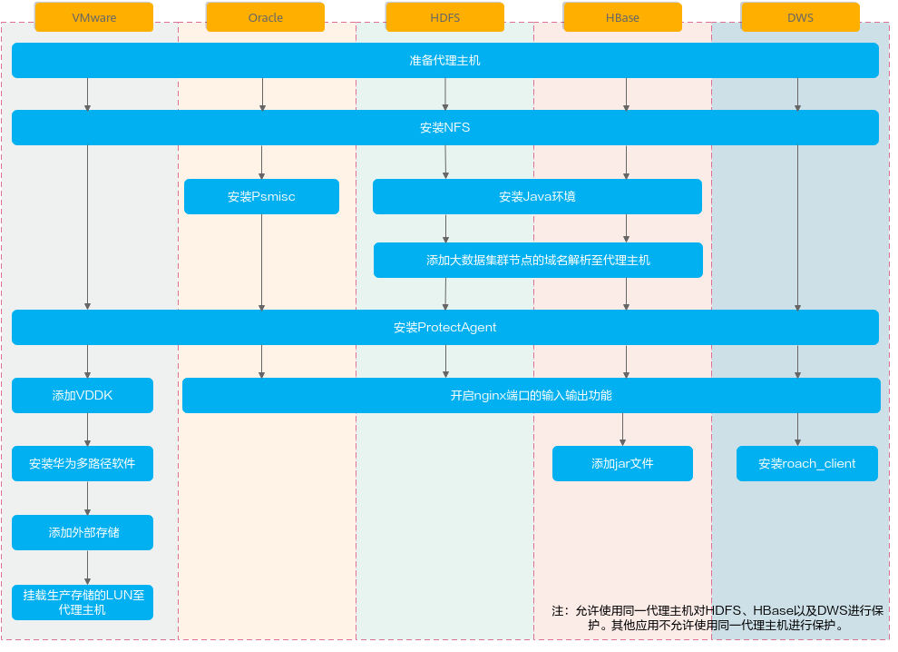

### 安装ProtectAgent软件<a name="ZH-CN_TOPIC_0000002025895257"></a>


#### 安装前配置<a name="ZH-CN_TOPIC_0000002025774789"></a>

如果备份存储类型使用的是NFS协议时，请参考本节为代理主机安装NFS。备份存储协议类型如果不是NFS时请忽略本节。

**Linux OS<a name="section1438105974313"></a>**

安装NFS前，请确保已配置yum源。以下以Red Hat Enterprise Linux 7.2版本为例说明。

1.  使用**root**帐户登录代理主机。
2.  执行以下命令检查是否已安装NFS。

    ```
    rpm -q nfs-utils
    ```

    回显是否显示nfs-utils的安装版本：

    -   是，处理结束。
    -   否，执行[步骤3](#li1910016234219)。

3.  <a name="li1910016234219"></a>执行以下命令安装NFS。

    ```
    yum -y install nfs-utils
    ```

**AIX OS<a name="section12439125974318"></a>**

以下以AIX 7.1版本为例说明。

1.  使用**root**帐户登录代理主机。
2.  执行以下命令查询NFS服务是否已正常启动。

    ```
    lssrc -g nfs
    ```

    回显中以下项的值为“active”，则表示NFS服务已正常启动。

    ```
    # lssrc -g nfs 
    Subsystem         Group            PID          Status 
     biod             nfs              4587710      active 
     rpc.statd        nfs              5767286      active 
     rpc.lockd        nfs              3932320      active 
     nfsd             nfs              11403334     active 
     rpc.mountd       nfs              10158322     active
    ```

3.  执行以下命令查询portmap服务是否已正常启动。

    ```
    lssrc -s portmap
    ```

    回显中portmap为“active”，则表示portmap已正常启动。

    ```
    # lssrc -s portmap 
    Subsystem         Group            PID          Status 
     portmap          portmap          9568416      active
    ```

4.  如果NFS服务或portmap服务未正常启动，执行以下命令启动。

    ```
    startsrc -g nfs
    ```

    ```
    startsrc -s portmap
    ```

**Solaris OS<a name="section17439175917433"></a>**

以下以Oracle Solaris 11.4版本为例说明。

1.  使用**root**帐户登录代理主机。
2.  执行以下命令查看NFS服务是否已启动。

    ```
    svcs -a | grep nfs
    ```

    回显中“/nfs/client”为“online”时表示NFS服务已启动。

    ```
    root@solaris:~# svcs -a | grep nfs 
    disabled       May_06   svc:/network/nfs/server:default 
    disabled       May_06   svc:/network/nfs/rquota:default 
    online         May_06   svc:/network/nfs/fedfs-client:default 
    online         May_06   svc:/network/nfs/cleanup-upgrade:default 
    online         May_06   svc:/network/nfs/cleanup:default 
    online         May_06   svc:/network/nfs/cbd:default 
    online         May_06   svc:/network/nfs/mapid:default 
    online         May_06   svc:/network/nfs/nlockmgr:default 
    online         May_06   svc:/network/nfs/status:default 
    online         May_10   svc:/network/nfs/client:default
    ```

3.  如果NFS服务未启动，执行以下命令启动NFS服务。

    ```
    svcadm enable -s svc:/network/nfs/client:default
    ```

#### 安装ProtectAgent<a name="ZH-CN_TOPIC_0000001989375290"></a>


##### 自动推送安装<a name="ZH-CN_TOPIC_0000001989376126"></a>

您需要在代理主机上安装ProtectAgent软件，ProtectAgent充当open-eBackup与受保护资源之间的代理进行数据备份和恢复。本节介绍通过DataProtect Engine自动推送安装包至代理主机的方式批量为主机安装ProtectAgent。

**前提条件<a name="section2708mcpsimp"></a>**

-   代理主机上未安装ProtectAgent。
-   已获取需要安装ProtectAgent的代理主机的IP地址，该IP地址必须与open-eBackup的备份网络连通。
-   已获取登录代理主机的系统管理员用户及其密码。
-   代理主机支持curl（要求curl支持TLS1.2、TLS1.3）、unzip、ping、ping6、awk/nawk命令。
-   代理主机已安装net-tools工具包、iproute工具包。
-   部署open-eBackup时，系统会预置相应版本的ProtectAgent软件包至DataProtect Engine。如果预置的ProtectAgent软件包版本不满足您的需求，那么安装ProtectAgent前请先执行以下命令上传其他版本的ProtectAgent软件包：
    1.  选择“保护 \> 主机&应用 \> 主机”。
    2.  单击“ProtectAgent软件包管理”，配置相关参数。

        参数说明如[表1](#_d0e22022)所示。

        **表 1**  上传ProtectAgent软件包

        <a name="_d0e22022"></a>
        <table><thead align="left"><tr id="row31212mcpsimp"><th class="cellrowborder" valign="top" width="35%" id="mcps1.2.3.1.1"><p id="p31214mcpsimp"><a name="p31214mcpsimp"></a><a name="p31214mcpsimp"></a>参数</p>
        </th>
        <th class="cellrowborder" valign="top" width="65%" id="mcps1.2.3.1.2"><p id="p31216mcpsimp"><a name="p31216mcpsimp"></a><a name="p31216mcpsimp"></a>说明</p>
        </th>
        </tr>
        </thead>
        <tbody><tr id="row31218mcpsimp"><td class="cellrowborder" valign="top" width="35%" headers="mcps1.2.3.1.1 "><p id="p31220mcpsimp"><a name="p31220mcpsimp"></a><a name="p31220mcpsimp"></a>模式</p>
        </td>
        <td class="cellrowborder" valign="top" width="65%" headers="mcps1.2.3.1.2 "><p id="p31222mcpsimp"><a name="p31222mcpsimp"></a><a name="p31222mcpsimp"></a>选择“上传”。</p>
        </td>
        </tr>
        <tr id="row31223mcpsimp"><td class="cellrowborder" valign="top" width="35%" headers="mcps1.2.3.1.1 "><p id="p31225mcpsimp"><a name="p31225mcpsimp"></a><a name="p31225mcpsimp"></a>代理文件</p>
        </td>
        <td class="cellrowborder" valign="top" width="65%" headers="mcps1.2.3.1.2 "><p class="msonormal" id="p31227mcpsimp"><a name="p31227mcpsimp"></a><a name="p31227mcpsimp"></a>单击<a name="image1255"></a><a name="image1255"></a><span></span>，选择已获取的ProtectAgent软件包。</p>
        <div class="note" id="note31228mcpsimp"><a name="note31228mcpsimp"></a><a name="note31228mcpsimp"></a><span class="notetitle"> 说明： </span><div class="notebody"><p id="p31229mcpsimp"><a name="p31229mcpsimp"></a><a name="p31229mcpsimp"></a>只支持上传.zip格式的软件包，文件大小不超过2GB。</p>
        </div></div>
        </td>
        </tr>
        </tbody>
        </table>

    3.  单击“确定”，开始上传软件包。

**注意事项<a name="section2719mcpsimp"></a>**

受保护资源为GaussDB\(DWS\)时，如果您不需要配置防火墙，可以执行**systemctl stop SuSEfirewall2.service**命令关闭防火墙。

**操作步骤<a name="section31951511194814"></a>**

1.  受保护资源是否为HDFS或HBase集群，且集群中配置了Kerberos认证。
    -   是，安装前要确保代理主机、open-eBackup以及Kerberos服务器的时间一致。如果时间不一致，请使用同一NTP服务器，否则可能导致ProtectAgent安装失败。
    -   否，安装前要确保代理主机与open-eBackup设备时间一致。

        参考以下步骤查看open-eBackup设备时间：

        1. 登录open-eBackup系统。

        2. 选择“系统 \> 设置 \> 设备时间”。

        查看当前设备时间，如果时间不一致，请修改主机时间或使用同一NTP服务器，否则可能导致ProtectAgent安装失败。

2.  选择“保护 \> 主机&应用 \> 主机”。
3.  单击“安装代理”，配置相关参数。

    参数说明如[表2](#_d0e20248)。

    **表 2**  安装代理参数

    <a name="_d0e20248"></a>
    <table><thead align="left"><tr id="row2749mcpsimp"><th class="cellrowborder" valign="top" width="28.000000000000004%" id="mcps1.2.3.1.1"><p id="p2751mcpsimp"><a name="p2751mcpsimp"></a><a name="p2751mcpsimp"></a>参数</p>
    </th>
    <th class="cellrowborder" valign="top" width="72%" id="mcps1.2.3.1.2"><p id="p2753mcpsimp"><a name="p2753mcpsimp"></a><a name="p2753mcpsimp"></a>说明</p>
    </th>
    </tr>
    </thead>
    <tbody><tr id="row2755mcpsimp"><td class="cellrowborder" valign="top" width="28.000000000000004%" headers="mcps1.2.3.1.1 "><p id="p2757mcpsimp"><a name="p2757mcpsimp"></a><a name="p2757mcpsimp"></a>代理类型</p>
    </td>
    <td class="cellrowborder" valign="top" width="72%" headers="mcps1.2.3.1.2 "><p id="p2759mcpsimp"><a name="p2759mcpsimp"></a><a name="p2759mcpsimp"></a>根据受保护资源的类型选择代理类型。</p>
    <a name="ul2760mcpsimp"></a><a name="ul2760mcpsimp"></a><ul id="ul2760mcpsimp"><li>主机代理(Oracle)：当受保护资源为Oracle数据库时，选择该类型。</li><li>外置代理(VMware)：当受保护资源为VMware虚拟机时，选择该类型。</li><li>外置代理(通用)：当受保护资源为GaussDB(DWS)、HDFS或HBase时，选择该类型。</li></ul>
    </td>
    </tr>
    <tr id="row2764mcpsimp"><td class="cellrowborder" valign="top" width="28.000000000000004%" headers="mcps1.2.3.1.1 "><p id="p2766mcpsimp"><a name="p2766mcpsimp"></a><a name="p2766mcpsimp"></a>操作系统</p>
    </td>
    <td class="cellrowborder" valign="top" width="72%" headers="mcps1.2.3.1.2 "><p id="p2768mcpsimp"><a name="p2768mcpsimp"></a><a name="p2768mcpsimp"></a>代理主机的操作系统类型。</p>
    </td>
    </tr>
    <tr id="row2769mcpsimp"><td class="cellrowborder" valign="top" width="28.000000000000004%" headers="mcps1.2.3.1.1 "><p id="p2771mcpsimp"><a name="p2771mcpsimp"></a><a name="p2771mcpsimp"></a>IP类型</p>
    </td>
    <td class="cellrowborder" valign="top" width="72%" headers="mcps1.2.3.1.2 "><p id="p2773mcpsimp"><a name="p2773mcpsimp"></a><a name="p2773mcpsimp"></a>代理主机的IP地址类型，支持IPv4和IPv6。</p>
    </td>
    </tr>
    <tr id="row2774mcpsimp"><td class="cellrowborder" valign="top" width="28.000000000000004%" headers="mcps1.2.3.1.1 "><p id="p2776mcpsimp"><a name="p2776mcpsimp"></a><a name="p2776mcpsimp"></a>IP地址</p>
    </td>
    <td class="cellrowborder" valign="top" width="72%" headers="mcps1.2.3.1.2 "><p id="p2778mcpsimp"><a name="p2778mcpsimp"></a><a name="p2778mcpsimp"></a>代理主机的IP地址。该IP地址必须与open-eBackup X8000的备份网络连通。</p>
    <a name="ul2779mcpsimp"></a><a name="ul2779mcpsimp"></a><ul id="ul2779mcpsimp"><li>当代理主机IP地址为IPv4时，输入代理主机的IP地址或网段（网段地址的前24位必须相同），以英文逗号隔开。<p id="p2781mcpsimp"><a name="p2781mcpsimp"></a><a name="p2781mcpsimp"></a>如：10.40.100.85~10.40.100.95,10.40.100.101</p>
    </li><li>当代理主机IP地址为IPv6时，输入代理主机的IP地址，以英文逗号隔开。<p id="p2783mcpsimp"><a name="p2783mcpsimp"></a><a name="p2783mcpsimp"></a>如：fe80::250:56ff:fe9f:98ac,fe80::250:56ff:fe9f:98ad</p>
    </li></ul>
    </td>
    </tr>
    <tr id="row2784mcpsimp"><td class="cellrowborder" valign="top" width="28.000000000000004%" headers="mcps1.2.3.1.1 "><p id="p2786mcpsimp"><a name="p2786mcpsimp"></a><a name="p2786mcpsimp"></a>用户名</p>
    </td>
    <td class="cellrowborder" rowspan="2" valign="top" width="72%" headers="mcps1.2.3.1.2 "><p id="p2788mcpsimp"><a name="p2788mcpsimp"></a><a name="p2788mcpsimp"></a>代理主机的系统管理员用户名及密码。</p>
    </td>
    </tr>
    <tr id="row2789mcpsimp"><td class="cellrowborder" valign="top" headers="mcps1.2.3.1.1 "><p id="p2791mcpsimp"><a name="p2791mcpsimp"></a><a name="p2791mcpsimp"></a>密码</p>
    </td>
    </tr>
    </tbody>
    </table>

4.  单击“测试”。

    系统验证填写的代理主机IP地址、用户名、密码是否正确。

5.  测试成功后单击“确定”。

    当“主机”页面显示安装了ProtectAgent的主机后，表示该主机已成功注册至DataProtect Engine。

##### 手动安装<a name="ZH-CN_TOPIC_0000002025775621"></a>

您需要在代理主机上安装ProtectAgent软件，ProtectAgent充当open-eBackup与受保护资源之间的代理进行数据备份和恢复。本节介绍登录代理主机后台手动为其安装ProtectAgent。

**注意事项<a name="section20911mcpsimp"></a>**

受保护资源为GaussDB\(DWS\)时，如果您不需要配置防火墙，可以执行**systemctl stop SuSEfirewall2.service**命令关闭防火墙。

**操作步骤<a name="section751273420614"></a>**

1.  在DataProtect Engine下载ProtectAgent软件包。

    具体操步骤如下：

    1.  选择“保护 \> 主机&应用 \> 主机”。
    2.  单击“ProtectAgent软件包管理”，配置相关参数。

        参数说明如[表2-36](#_d0e22136)所示。

        **表 1**  上传ProtectAgent软件包

        <a name="_d0e22136"></a>
        <table><thead align="left"><tr id="row34377mcpsimp"><th class="cellrowborder" valign="top" width="35%" id="mcps1.2.3.1.1"><p id="p34379mcpsimp"><a name="p34379mcpsimp"></a><a name="p34379mcpsimp"></a>参数</p>
        </th>
        <th class="cellrowborder" valign="top" width="65%" id="mcps1.2.3.1.2"><p id="p34381mcpsimp"><a name="p34381mcpsimp"></a><a name="p34381mcpsimp"></a>说明</p>
        </th>
        </tr>
        </thead>
        <tbody><tr id="row34383mcpsimp"><td class="cellrowborder" valign="top" width="35%" headers="mcps1.2.3.1.1 "><p id="p34385mcpsimp"><a name="p34385mcpsimp"></a><a name="p34385mcpsimp"></a>模式</p>
        </td>
        <td class="cellrowborder" valign="top" width="65%" headers="mcps1.2.3.1.2 "><p id="p34387mcpsimp"><a name="p34387mcpsimp"></a><a name="p34387mcpsimp"></a>选择“下载”。</p>
        </td>
        </tr>
        <tr id="row34388mcpsimp"><td class="cellrowborder" valign="top" width="35%" headers="mcps1.2.3.1.1 "><p id="p34390mcpsimp"><a name="p34390mcpsimp"></a><a name="p34390mcpsimp"></a>代理类型</p>
        </td>
        <td class="cellrowborder" valign="top" width="65%" headers="mcps1.2.3.1.2 "><p id="p34392mcpsimp"><a name="p34392mcpsimp"></a><a name="p34392mcpsimp"></a>根据受保护资源的类型选择代理类型。</p>
        <a name="ul34393mcpsimp"></a><a name="ul34393mcpsimp"></a><ul id="ul34393mcpsimp"><li>主机代理(Oracle)：当受保护资源为Oracle数据库时，选择该类型。</li><li>外置代理(VMware)：当受保护资源为VMware虚拟机时，选择该类型。</li><li>外置代理(通用)：当受保护资源为GaussDB(DWS)、HDFS、HBase，选择该类型。</li></ul>
        </td>
        </tr>
        <tr id="row34397mcpsimp"><td class="cellrowborder" valign="top" width="35%" headers="mcps1.2.3.1.1 "><p id="p34399mcpsimp"><a name="p34399mcpsimp"></a><a name="p34399mcpsimp"></a>操作系统</p>
        </td>
        <td class="cellrowborder" valign="top" width="65%" headers="mcps1.2.3.1.2 "><p id="p34401mcpsimp"><a name="p34401mcpsimp"></a><a name="p34401mcpsimp"></a>代理主机的操作系统类型。</p>
        </td>
        </tr>
        <tr id="row34402mcpsimp"><td class="cellrowborder" valign="top" width="35%" headers="mcps1.2.3.1.1 "><p id="p34404mcpsimp"><a name="p34404mcpsimp"></a><a name="p34404mcpsimp"></a>私钥密码</p>
        </td>
        <td class="cellrowborder" valign="top" width="65%" headers="mcps1.2.3.1.2 "><p id="p34406mcpsimp"><a name="p34406mcpsimp"></a><a name="p34406mcpsimp"></a>用户自定义私钥密码，根据界面提示的复杂度要求输入。</p>
        <p id="p34407mcpsimp"><a name="p34407mcpsimp"></a><a name="p34407mcpsimp"></a>私钥密码用于对ProtectAgent软件包中的私钥文件进行加密，私钥文件用于代理主机与open-eBackup X8000鉴权。请妥善保管此私钥密码，后续安装过程中会使用。</p>
        <div class="note" id="note34408mcpsimp"><a name="note34408mcpsimp"></a><a name="note34408mcpsimp"></a><span class="notetitle"> 说明： </span><div class="notebody"><p id="p34409mcpsimp"><a name="p34409mcpsimp"></a><a name="p34409mcpsimp"></a>填写私钥密码后，open-eBackup X8000将使用此处填写的私钥密码对ProtectAgent软件包中的私钥文件进行加密。</p>
        <p id="p34411mcpsimp"><a name="p34411mcpsimp"></a><a name="p34411mcpsimp"></a>如果在下载ProtectAgent软件包前，已参考《open-eBackup X8000 1.2.1 安全配置指南》导入Agent证书，此处可以填写与Agent证书相同的私钥密码，也可以自行定义私钥密码。</p>
        </div></div>
        </td>
        </tr>
        <tr id="row34412mcpsimp"><td class="cellrowborder" valign="top" width="35%" headers="mcps1.2.3.1.1 "><p id="p34414mcpsimp"><a name="p34414mcpsimp"></a><a name="p34414mcpsimp"></a>确认私钥密码</p>
        </td>
        <td class="cellrowborder" valign="top" width="65%" headers="mcps1.2.3.1.2 "><p id="p34416mcpsimp"><a name="p34416mcpsimp"></a><a name="p34416mcpsimp"></a>再次输入私钥密码。</p>
        </td>
        </tr>
        </tbody>
        </table>

    3.  单击“确定”。

        获取下载到的ProtectAgent软件包。

        在Windows Server使用Internet Explorer 11下载ProtectAgent。

2.  受保护资源是否为HDFS或HBase集群，且集群中配置了Kerberos认证。
    -   是，安装前要确保代理主机、open-eBackup以及Kerberos服务器的时间一致。如果时间不一致，请使用同一NTP服务器，否则可能导致ProtectAgent安装失败。
    -   否，安装前要确保代理主机与open-eBackup设备时间一致。

        参考以下步骤查看open-eBackup设备时间：

        1.  登录open-eBackup。
        2.  选择“系统 \> 设置 \> 设备时间”。

            查看当前设备时间，如果时间不一致，请修改主机时间或使用同一NTP服务器，否则可能导致ProtectAgent安装失败。

3.  安装ProtectAgent软件。

    1.  使用PuTTY，以系统管理员帐户登录需要安装ProtectAgent的主机。
    2.  依次执行以下命令创建软件包的存放目录并授权。

        软件包存放目录的权限需要为755。此处以存放目录为“/opt/install”为例说明。

        ```
        mkdir /opt/install
        ```

        ```
        chmod -R 755 /opt/install
        ```

    3.  使用WinSCP上传软件包至“/opt/install”目录。
    4.  进入“/opt/install”目录后，执行以下命令解压软件包。_xxx_为ProtectAgent的版本号。

        ```
        unzip open-eBackup_DataProtect_xxx_client_others.zip
        ```

    5.  执行以下命令进入软件包目录。

        ```
        cd /opt/install/open-eBackup_DataProtect_xxx_client/
        ```

    6.  执行以下命令安装ProtectAgent软件。

        ```
        sh install.sh
        ```

    > **说明：** 
    >-   安装ProtectAgent软件时，系统自动检测环境中是否已安装net-tools工具包、iproute工具包，如检测到未安装会提示安装。
    >-   根据回显提示完成软件安装，安装过程中需要输入[表1](#_d0e22136)中创建的私钥。
    >-   安装过程中，系统会检查当前主机已配置的业务网络IP，如果检查到已配置多个业务网络IP，会提示用户选择其中一个业务IP用于代理主机备份恢复业务。
    >-   安装过程中，如果系统检测到DataProtect Engine上存在相同IP地址但UUID不同的主机时，会提示是否覆盖DataProtect Engine的原主机：
    >-   当选择覆盖时，新安装的主机将继承原主机的副本信息，并且更新新主机的UUID与原主机相同。
    >-   当选择不覆盖时，您需要先在DataProtect Engine上删除原主机后，重新安装。

4.  主机安装ProtectAgent软件后，DataProtect Engine会自动发现该主机，执行如下步骤进行检查。
    1.  登录open-eBackup。
    2.  选择“保护 \> 主机&应用 \> 主机”。
    3.  查看已安装ProtectAgent的主机是否已存在于DataProtect Engine。

        如果在DataProtect Engine上未发现已安装ProtectAgent的主机，请联系系统管理员为该用户进行资源授权。

        1.  使用系统管理员登录open-eBackup。
        2.  选择“保护 \> 主机&应用 \> 主机”。
        3.  在该主机所在行，单击“更多 \> 资源授权”。
        4.  将该主机授权给相应的用户。

1.  重复以上步骤为其他代理主机安装ProtectAgent软件。

#### 安装后配置<a name="ZH-CN_TOPIC_0000001989215542"></a>


##### 添加VDDK（适用于VMware）<a name="ZH-CN_TOPIC_0000002025779581"></a>

备份恢复VMware虚拟机时，依赖VMware的VDDK能力，参考本节在代理主机上添加VDDK库。受保护资源不是VMware时请忽略本节。

**获取VDDK包<a name="section7875mcpsimp"></a>**

**表 1**  VDDK下载路径

<a name="table7877mcpsimp"></a>
<table><thead align="left"><tr id="row7883mcpsimp"><th class="cellrowborder" valign="top" width="55.00000000000001%" id="mcps1.2.3.1.1"><p id="p7885mcpsimp"><a name="p7885mcpsimp"></a><a name="p7885mcpsimp"></a>VMware受保护环境版本</p>
</th>
<th class="cellrowborder" valign="top" width="45%" id="mcps1.2.3.1.2"><p id="p7887mcpsimp"><a name="p7887mcpsimp"></a><a name="p7887mcpsimp"></a>获取路径</p>
</th>
</tr>
</thead>
<tbody><tr id="row7889mcpsimp"><td class="cellrowborder" valign="top" width="55.00000000000001%" headers="mcps1.2.3.1.1 "><p id="p7891mcpsimp"><a name="p7891mcpsimp"></a><a name="p7891mcpsimp"></a>VMware受保护环境为VMware vSphere 5.1、5.5或6.0</p>
</td>
<td class="cellrowborder" valign="top" width="45%" headers="mcps1.2.3.1.2 "><p id="p7893mcpsimp"><a name="p7893mcpsimp"></a><a name="p7893mcpsimp"></a><a href="https://code.vmware.com/web/sdk/6.0/vddk" target="_blank" rel="noopener noreferrer">下载VDDK 6.0.2版本</a></p>
</td>
</tr>
<tr id="row7895mcpsimp"><td class="cellrowborder" valign="top" width="55.00000000000001%" headers="mcps1.2.3.1.1 "><p id="p7897mcpsimp"><a name="p7897mcpsimp"></a><a name="p7897mcpsimp"></a>VMware受保护环境为VMware vSphere 6.5、6.7</p>
</td>
<td class="cellrowborder" valign="top" width="45%" headers="mcps1.2.3.1.2 "><p id="p7899mcpsimp"><a name="p7899mcpsimp"></a><a name="p7899mcpsimp"></a><a href="https://code.vmware.com/web/sdk/6.7/vddk" target="_blank" rel="noopener noreferrer">下载VDDK 6.7.3版本</a></p>
</td>
</tr>
<tr id="row7901mcpsimp"><td class="cellrowborder" colspan="2" valign="top" headers="mcps1.2.3.1.1 mcps1.2.3.1.2 "><p id="p7903mcpsimp"><a name="p7903mcpsimp"></a><a name="p7903mcpsimp"></a>注：本节以“tar.gz”格式的VDDK包为例说明相关操作。</p>
</td>
</tr>
</tbody>
</table>

**添加VDDK 6.0.2库（VMware受保护环境为VMware vSphere 5.1、5.5或6.0）<a name="section37822732719"></a>**

1.  使用PuTTY，以**root**帐号登录代理主机。
2.  执行以下命令进入“ProtectClient”目录。

    ```
    cd /opt/open-eBackup/ProtectClient
    ```

3.  执行以下命令停止ProtectAgent服务。

    ```
    sh stop.sh
    ```

4.  执行以下命令进入“/ProtectClient-E”目录。

    ```
    cd /opt/open-eBackup/ProtectClient/ProtectClient-E/
    ```

5.  执行以下命令，创建vddk目录。

    ```
    mkdir -p lib/vddk/6.0
    ```

6.  使用WinSCP，以**root**帐号将获取到的VDDK压缩包上传至代理主机的“/opt/open-eBackup/ProtectClient/ProtectClient-E/lib/vddk/6.0”目录。
7.  执行以下命令解压VDDK压缩包。

    ```
    tar -zxvf 压缩包名称
    ```

    解压后的目录一般为：

    vmware-vix-disklib-distrib:

    -   bin64
    -   doc
    -   include
    -   lib32
    -   lib64

8.  进入“/vmware-vix-disklib-distrib”目录后，执行以下命令删除除lib64以外的其他目录。

    ```
    rm -rf bin64 doc include lib32
    ```

9.  依次执行以下命令删除libstdc++.so.6.0.13文件。

    ```
    cd /opt/open-eBackup/ProtectClient/ProtectClient-E/lib/vddk/6.0/vmware-vix-disklib-distrib/lib64/
    ```

    ```
    rm -f libstdc++.so.6.0.13
    ```

10. 创建新的同名软连接文件。

    ```
    ln -s /opt/open-eBackup/ProtectClient/ProtectClient-E/bin/libstdc++.so.6.0.28 libstdc++.so.6.0.13
    ```

11. 如果VMware vSphere为5.1或5.5版本时，执行以下命令创建软连接。否则请跳过。

    ```
    ln -s /opt/open-eBackup/ProtectClient/ProtectClient-E/lib/vddk/6.0 5.1
    ```

    ```
    ln -s /opt/open-eBackup/ProtectClient/ProtectClient-E/lib/vddk/6.0 5.5
    ```

12. 依次执行以下命令更改新创建的lib文件夹的权限，及所属的用户及用户组。

    ```
    cd /opt/open-eBackup/ProtectClient/ProtectClient-E/
    ```

    ```
    chown rdadmin:rdadmin lib -R
    ```

    ```
    chown -h rdadmin:rdadmin lib -R
    ```

    ```
    chmod 550 lib -R
    ```

13. 依次执行以下命令启动ProtectAgent服务。

    ```
    cd /opt/open-eBackup/ProtectClient
    ```

    ```
    sh start.sh
    ```

14. 重复以上步骤在其他代理主机添加VDDK库。

**添加VDDK 6.7.3库（VMware受保护环境为VMware vSphere 6.5、6.7）<a name="section1579152713276"></a>**

1.  使用PuTTY，以**root**帐号登录代理主机。
2.  执行以下命令进入“ProtectClient”目录。

    ```
    cd /opt/open-eBackup/ProtectClient
    ```

3.  执行以下命令停止ProtectAgent服务。

    ```
    sh stop.sh
    ```

4.  执行以下命令进入“/ProtectClient-E”目录。

    ```
    cd /opt/open-eBackup/ProtectClient/ProtectClient-E/
    ```

5.  执行以下命令，创建vddk目录。

    ```
    mkdir -p lib/vddk/6.7
    ```

6.  使用WinSCP，以**root**帐号将获取到的VDDK压缩包上传至代理主机的“/opt/open-eBackup/ProtectClient/ProtectClient-E/lib/vddk/6.7”目录。
7.  执行以下命令解压VDDK压缩包。

    ```
    tar -zxvf 压缩包名称
    ```

    解压后的目录一般为：

    vmware-vix-disklib-distrib:

    -   bin64
    -   doc
    -   include
    -   lib32
    -   lib64

8.  进入“/vmware-vix-disklib-distrib”目录后，执行以下命令删除除lib64以外的其他目录。

    ```
    rm -rf bin64 doc include lib32
    ```

9.  依次执行以下命令删除libstdc++.so.6文件。

    ```
    cd /opt/open-eBackup/ProtectClient/ProtectClient-E/lib/vddk/6.7/vmware-vix-disklib-distrib/lib64/
    ```

    ```
    rm -f libstdc++.so.6
    ```

10. 创建新的同名软连接文件。

    ```
    ln -s /opt/open-eBackup/ProtectClient/ProtectClient-E/bin/libstdc++.so.6.0.28 libstdc++.so.6
    ```

11. 如果VMware vSphere为6.5版本时，执行以下命令创建软连接。否则请跳过。

    ```
    ln -s /opt/open-eBackup/ProtectClient/ProtectClient-E/lib/vddk/6.7 6.5
    ```

12. 依次执行以下命令更改新创建的lib文件夹的权限，及所属的用户及用户组。

    ```
    cd /opt/open-eBackup/ProtectClient/ProtectClient-E/
    ```

    ```
    chown rdadmin:rdadmin lib -R
    ```

    ```
    chown -h rdadmin:rdadmin lib -R
    ```

    ```
    chmod 550 lib -R
    ```

13. 依次执行以下命令启动ProtectAgent服务。

    ```
    cd /opt/open-eBackup/ProtectClient
    ```

    ```
    sh start.sh
    ```

14. 重复以上步骤在其他代理主机添加VDDK库。

##### 安装华为多路径软件（适用于VMware）<a name="ZH-CN_TOPIC_0000001989380090"></a>

如果VMware虚拟机使用的生产存储是华为OceanStor Dorado，请参考本节安装华为多路径软件。非该场景请忽略。

**背景信息<a name="section38554mcpsimp"></a>**

-   如果VMware虚拟机使用的生产存储是华为OceanStor Dorado时，您需要执行安装华为多路径软件以及将其作为外部存储加入open-eBackup的操作。代理主机将自动发现生产存储的LUN。
-   如果VMware虚拟机使用的生产存储不是华为OceanStor Dorado时，您需要在代理主机手动挂载LUN，使得代理主机可发现生产存储的LUN。

**获取软件包<a name="section38559mcpsimp"></a>**

获取华为多路径软件包OceanStor\_UltraPath\_xxx\_CentOS.zip，xxx为多路径软件的版本号，获取路径：

-   企业网用户：[点此前往](https://support.huawei.com/enterprise/zh/centralized-storage/ultrapath-pid-8576127/software)
-   运营商用户：[点此前往](https://support.huawei.com/carrier/productNewOffering?col=product&path=PBI1-21430725/PBI1-251363742/PBI1-21499296/PBI1-8576127&resTab=SW)

**操作步骤<a name="section38567mcpsimp"></a>**

在所有代理主机安装华为多路径软件，具体请参考[《OceanStor UltraPath for Linux xxx 用户指南》](https://support.huawei.com/enterprise/zh/centralized-storage/ultrapath-pid-8576127)。

##### 添加存储设备（适用于VMware）<a name="ZH-CN_TOPIC_0000001989220342"></a>

如果VMware虚拟机使用的生产存储是华为OceanStor Dorado，则需要参考本节将OceanStor Dorado添加至open-eBackup X8000。非该场景请忽略。

**操作步骤<a name="section1144051617325"></a>**

1.  选择“保护 \> 存储 \> 存储设备”。
2.  单击“添加设备”，添加存储设备。
3.  选择设备类型为OceanStor Dorado 6.x。
4.  按界面要求配置参数。参数说明如[添加存储设备（适用于VMware）](添加存储设备（适用于VMware）.md)所示。

    **表 1**  添加设备参数说明

    <a name="_d0e21459"></a>
    <table><thead align="left"><tr id="row25240mcpsimp"><th class="cellrowborder" valign="top" width="26%" id="mcps1.2.3.1.1"><p id="p25242mcpsimp"><a name="p25242mcpsimp"></a><a name="p25242mcpsimp"></a>参数</p>
    </th>
    <th class="cellrowborder" valign="top" width="74%" id="mcps1.2.3.1.2"><p id="p25244mcpsimp"><a name="p25244mcpsimp"></a><a name="p25244mcpsimp"></a>说明</p>
    </th>
    </tr>
    </thead>
    <tbody><tr id="row25246mcpsimp"><td class="cellrowborder" valign="top" width="26%" headers="mcps1.2.3.1.1 "><p id="p25248mcpsimp"><a name="p25248mcpsimp"></a><a name="p25248mcpsimp"></a>设备名称</p>
    </td>
    <td class="cellrowborder" valign="top" width="74%" headers="mcps1.2.3.1.2 "><p id="p25250mcpsimp"><a name="p25250mcpsimp"></a><a name="p25250mcpsimp"></a>用户自定义设备名称。</p>
    </td>
    </tr>
    <tr id="row25251mcpsimp"><td class="cellrowborder" valign="top" width="26%" headers="mcps1.2.3.1.1 "><p id="p25253mcpsimp"><a name="p25253mcpsimp"></a><a name="p25253mcpsimp"></a>IP地址</p>
    </td>
    <td class="cellrowborder" valign="top" width="74%" headers="mcps1.2.3.1.2 "><p id="p25255mcpsimp"><a name="p25255mcpsimp"></a><a name="p25255mcpsimp"></a>存储设备的管理IP地址。</p>
    </td>
    </tr>
    <tr id="row25256mcpsimp"><td class="cellrowborder" valign="top" width="26%" headers="mcps1.2.3.1.1 "><p id="p25258mcpsimp"><a name="p25258mcpsimp"></a><a name="p25258mcpsimp"></a>端口</p>
    </td>
    <td class="cellrowborder" valign="top" width="74%" headers="mcps1.2.3.1.2 "><p id="p25260mcpsimp"><a name="p25260mcpsimp"></a><a name="p25260mcpsimp"></a>open-eBackup与存储设备的管理平面通信的端口号。</p>
    <p id="p25261mcpsimp"><a name="p25261mcpsimp"></a><a name="p25261mcpsimp"></a>默认端口号为8088。</p>
    </td>
    </tr>
    <tr id="row25262mcpsimp"><td class="cellrowborder" valign="top" width="26%" headers="mcps1.2.3.1.1 "><p id="p25264mcpsimp"><a name="p25264mcpsimp"></a><a name="p25264mcpsimp"></a>用户名</p>
    </td>
    <td class="cellrowborder" rowspan="2" valign="top" width="74%" headers="mcps1.2.3.1.2 "><p id="p25266mcpsimp"><a name="p25266mcpsimp"></a><a name="p25266mcpsimp"></a>存储设备的用户名及密码，用户角色必须是管理员或超级管理员。</p>
    </td>
    </tr>
    <tr id="row25267mcpsimp"><td class="cellrowborder" valign="top" headers="mcps1.2.3.1.1 "><p id="p25269mcpsimp"><a name="p25269mcpsimp"></a><a name="p25269mcpsimp"></a>密码</p>
    </td>
    </tr>
    <tr id="row25270mcpsimp"><td class="cellrowborder" valign="top" width="26%" headers="mcps1.2.3.1.1 "><p id="p25272mcpsimp"><a name="p25272mcpsimp"></a><a name="p25272mcpsimp"></a>是否校验证书</p>
    </td>
    <td class="cellrowborder" valign="top" width="74%" headers="mcps1.2.3.1.2 "><p id="p25274mcpsimp"><a name="p25274mcpsimp"></a><a name="p25274mcpsimp"></a>当已导入存储设备的CA证书后，请开启该项。开启后，添加存储设备时会对其证书进行校验，确保open-eBackup X8000与存储设备交互的安全性。</p>
    </td>
    </tr>
    </tbody>
    </table>

5.  单击“确定”。

    添加成功后，已添加的存储设备信息将在“存储设备”页面显示。

##### 挂载生产存储的LUN至代理主机（适用于VMware）<a name="ZH-CN_TOPIC_0000002025900025"></a>

当VMware虚拟化环境使用SAN传输模式备份恢复，且生产存储不是华为OceanStor Dorado时，则需要参考本节手动将生产存储的LUN挂载给代理主机。非该场景请忽略。

**背景信息<a name="section33254mcpsimp"></a>**

本文以VMware生产存储为华为OceanStor 5600 V500R007存储，虚拟化环境为VMware 6.5版本为例，介绍如何挂载生产存储的LUN至代理主机。非该版本操作会有差异，请参考对应存储产品的文档进行操作。

**IP SAN场景<a name="section71511257193320"></a>**

当代理主机与生产存储之间为IP链路时，执行以下步骤。

1.  使用PuTTY，登录代理主机。
2.  <a name="li17429162615404"></a>查询代理主机的iSCSI启动器名称。
    1.  执行**rpm -qa |grep iscsi**命令查询代理主机是否安装了iSCSI启动器。

        \[root@root \~\]\# rpm -qa |grep iscsi

        iscsi-initiator-utils-6.2.0.873-29.el7.x86\_64 

        iscsi-initiator-utils-iscsiuio-6.2.0.873-29.el7.x86\_64

        如上所示，系统已经安装了iSCSI启动器。

    2.  执行**cat /etc/iscsi/initiatorname.iscsi**命令，查询iSCSI启动器的名称。

        \[root@root \~\]\#cat /etc/iscsi/initiatorname.iscsi

        InitiatorName=iqn.1994-05.com.redhat:38d7b046dd9a

        上面的信息中，我们可以发现代理主机的iSCSI启动器名称为“iqn.1994-05.com.redhat:38d7b046dd9a”。

3.  查看待备份的虚拟机对应的数据存储。
    1.  登录待备份的虚拟机所在的虚拟化平台。
    2.  在左侧导航栏单击“虚拟机”，单击待备份的虚拟机名称。
    3.  在右侧视图“硬件配置”区域，单击“硬盘x”，查看硬盘对应的数据存储名称，如datastore01。

4.  联系机房管理员了解datastore01对应的生产存储的管理IP地址。
5.  <a name="li2511185696"></a>查看待备份的虚拟机所在的ESXi主机对应的LUN，并创建LUN组。
    1.  以**admin**帐户登录OceanStor 5600 V500R007存储的DeviceManager界面。

        登录地址：**https://**_生产存储管理IP地址_**:8088**

    2.  在右侧导航，选择“资源分配”，单击“主机”，在“主机”页签，通过搜索找到ESXi主机。
    3.  <a name="li1364271811135"></a>单击主机名称，查看映射给主机的LUN名称。
    4.  在右侧导航，选择“资源分配”，单击“LUN”，选择“LUN组”页签，根据[步骤5.3](#li1364271811135)查到的LUN，查找ESXi主机对应的LUN所在的LUN组。

6.  配置与代理主机通信的以太网端口IP地址。
    1.  在右侧导航，选择“系统”，使用旋转图标，切换到设备后视图。
    2.  单击与代理主机相连的以太网端口，在弹出的“以太网端口”窗口，单击“修改”，配置以太网端口IP地址。

7.  <a name="li1788517511813"></a>创建主机和主机组。
    1.  在右侧导航，选择“资源分配”，单击“主机”，在“主机”页签，单击“创建”，选择“手动创建”。
    2.  根据界面提示，创建主机。

        配置启动器时，选择iSCSI类型，选择[步骤2](#li17429162615404)中查询的iSCSI启动器名称。

    3.  选择“主机组”页签，单击“创建”，根据界面提示创建主机组。

8.  将[步骤5](#li2511185696)的LUN组映射给[步骤7](#li1788517511813)的主机组。
    1.  在右侧导航，选择“资源分配”，单击“映射视图”。
    2.  单击“创建”，根据界面提示创建映射视图。

9.  登录代理主机执行以下命令扫描LUN。

    ```
    for host in $(ls -1d /sys/class/scsi_host/*); do echo "- - -" > ${host}/scan ; done
    ```

10. 执行以下命令检查是否已扫描到对应的LUN。

    ```
    fdisk -l
    ```

**FC SAN场景<a name="section1715205717338"></a>**

当代理主机与生产存储之间为FC链路时，执行以下步骤。

1.  使用PuTTY，登录代理主机。
2.  <a name="li695317364611"></a>执行**cat /sys/class/fc\_host/host\*/port\_name **命令查询代理主机HBA卡的WWN。

    ```
    # cat /sys/class/fc_host/host*/port_name  
    0x210000e08b907955  
    0x210000e08b907956
    ```

    上面的信息中，我们可以发现代理主机HBA卡的WWN为“0x210000e08b907955”和“0x210000e08b907956”。

3.  查看待备份的虚拟机对应的数据存储。
    1.  登录待备份的虚拟机所在的虚拟化平台。
    2.  在左侧导航栏单击“虚拟机”，单击待备份的虚拟机名称。
    3.  在右侧视图“硬件配置”区域，单击“硬盘x”，查看硬盘对应的数据存储名称，如datastore01。

4.  联系机房管理员了解datastore01对应的生产存储的管理IP地址。
5.  <a name="li4313819192213"></a>查看待备份的虚拟机所在的ESXi Server对应的LUN，并创建LUN组。
    1.  以**admin**帐户登录OceanStor 5600 V500R007存储的DeviceManager界面。

        登录地址：**https://**_生产存储管理IP地址_**:8088**

    2.  在右侧导航，选择“资源分配 ”，单击“主机”，在“主机”页签，通过搜索找到ESXi主机。
    3.  <a name="li731316197226"></a>单击主机名称，在界面下方，单击“映射的LUN”，查看映射给主机的LUN名称。
    4.  在右侧导航，选择“资源分配 ”，单击“LUN”，选择“LUN组”页签，根据[步骤5.3](#li731316197226)查到的LUN，查找ESXi主机对应的LUN所在的LUN组。

6.  <a name="li1231312192223"></a>创建主机和主机组。
    1.  在右侧导航，选择“资源分配”，单击“主机”，在“主机”页签，单击“创建”，选择“手动创建”。
    2.  根据界面提示，创建主机。

        配置启动器时，选择FC类型，选择[步骤2](#li695317364611)中查询的WWN。

    3.  选择“主机组”页签，单击“创建”，根据界面提示创建主机组。

7.  将[步骤5](#li4313819192213)的LUN组映射给[步骤6](#li1231312192223)的主机组。
    1.  在右侧导航，选择“资源分配 ”，单击“映射视图”。
    2.  单击“创建”，根据界面提示创建映射视图。

8.  登录代理主机执行以下命令扫描LUN。

    ```
    for host in $(ls -1d /sys/class/scsi_host/*); do echo "- - -" > ${host}/scan ; done
    ```

9.  执行以下命令检查是否已扫描到对应的LUN。

    ```
    fdisk -l
    ```

### 卸载ProtectAgent软件<a name="ZH-CN_TOPIC_0000002013071441"></a>

卸载ProtectAgent后，open-eBackup将不会对该资源进行备份或恢复。如需卸载ProtectAgent可参考本节操作。

**操作步骤<a name="section14199334134012"></a>**

1.  使用PuTTY，以系统管理员帐户登录需要卸载ProtectAgent的主机。
2.  执行以下命令进入ProtectAgent软件安装目录。

    ```
    cd /opt/open-eBackup/ProtectClient
    ```

3.  执行以下命令卸载软件。

    ```
    sh uninstall.sh
    ```

1.  如果该主机后续会再次安装ProtectAgent，且该主机之前是用于保护Oracle数据库再次安装ProtectAgent将用于保护VMware虚拟机，或者该主机之前是用于保护VMware虚拟机再次安装ProtectAgent将用于保护Oracle数据库，那么参考以下步骤删除主机的“/etc/HostSN/HostSN”文件。非该场景请忽略。
    1.  使用PuTTY，登录主机。
    2.  执行以下命令删除“/etc/HostSN/HostSN”文件。

        ```
        rm -rf /etc/HostSN/HostSN
        ```

1.  如果该主机后续会再次安装ProtectAgent，且再次安装ProtectAgent前，主机重新安装过操作系统或者主机的“/etc/HostSN/HostSN”被删除，则参考以下步骤在DataProtect Engine上删除主机。非该场景请忽略。
    1.  登录open-eBackup。
    2.  选择“保护 \> 主机&应用 \> 主机”。
    3.  按照IP地址查找到已卸载ProtectAgent的主机后，单击“删除主机”。

        删除前确保主机未关联SLA。

# 使用指导<a name="ZH-CN_TOPIC_0000002013230937"></a>


## 登录open-eBackup管理界面<a name="ZH-CN_TOPIC_0000002013071461"></a>

在任意一台与open-eBackup连接的维护终端上，通过浏览器访问open-eBackup的管理网口IP地址，可以登录open-eBackup管理界面。

**前提条件<a name="section37709mcpsimp"></a>**

使用open-eBackup的管理界面前请先检查维护终端是否满足使用要求：

-   操作系统及浏览器的兼容性

    open-eBackup管理界面支持多种操作系统和浏览器，包括：Internet Explorer 11及以上、Google Chrome 87.0及以上、Firefox 85.0及以上。

-   为了保证显示正常，建议浏览器缩放比例或系统显示比例为100%。
    -   Windows 7操作系统通过“控制面板 \> 显示”进行设置，其他操作系统请根据实际界面操作。
    -   浏览器通过按“Ctrl+0”（Windows）或“Command+0”（MAC OS）组合键快速进行设置。

-   维护终端和open-eBackup通信正常。

**背景信息<a name="section37721mcpsimp"></a>**

-   本文以Windows操作系统为例，介绍如何登录open-eBackup。
-   如果当前登录用户在会话超时时限内（默认为60分钟，可修改）未执行任何操作，系统将会自动退出，用户需要重新登录。

**操作步骤<a name="section16196164454418"></a>**

1.  在维护终端运行浏览器。
2.  在地址栏中输入控制框管理网口的IP地址“https://XXX.XXX.XXX.XXX:25080”并按“Enter”。

    系统进入open-eBackup登录界面。

    XXX.XXX.XXX.XXX表示控制器的管理IP地址。

    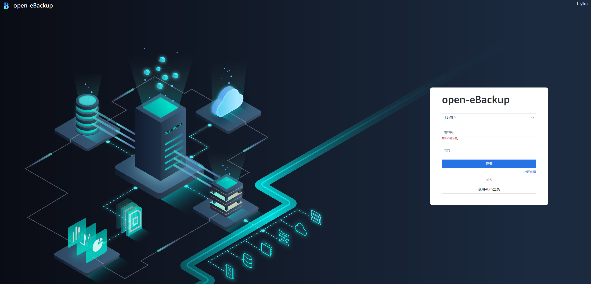

    > **说明：** 
    >浏览器可能会提示网站的安全证书有问题，此时只要确认IP地址正确，您仍然可以选择忽略该提示并继续访问ProtectManager管理界面。

3.  在“用户名”和“密码”中输入登录的用户名和密码。
4.  单击“登录”。

    系统进入open-eBackup管理界面。

## 菜单功能介绍（参考管理员指南）<a name="ZH-CN_TOPIC_0000001976671050"></a>

open-eBackup针对业界主流应用，如数据库（Oracle、MySQL、SQL Server、SAP HANA等）、虚拟化平台（VMware、FusionCompute等）、操作系统（Windows、Linux 等），大数据（HDFS、HBase、Hive等）及其他应用，进行全面的数据保护，包括备份、复制容灾、长期保留、副本数据恢复和副本数据再利用。本章节详细介绍open-eBackup管理界面各功能模块（[首页](#section066319254418)、[保护](#section552194114463)、[数据利用](#section116816188559)、[监控](#section207371692175)和[系统](#section197176134254)）。了解了各个功能模块之后，您可以使用open-eBackup进行业务配置。

**首页<a name="section066319254418"></a>**

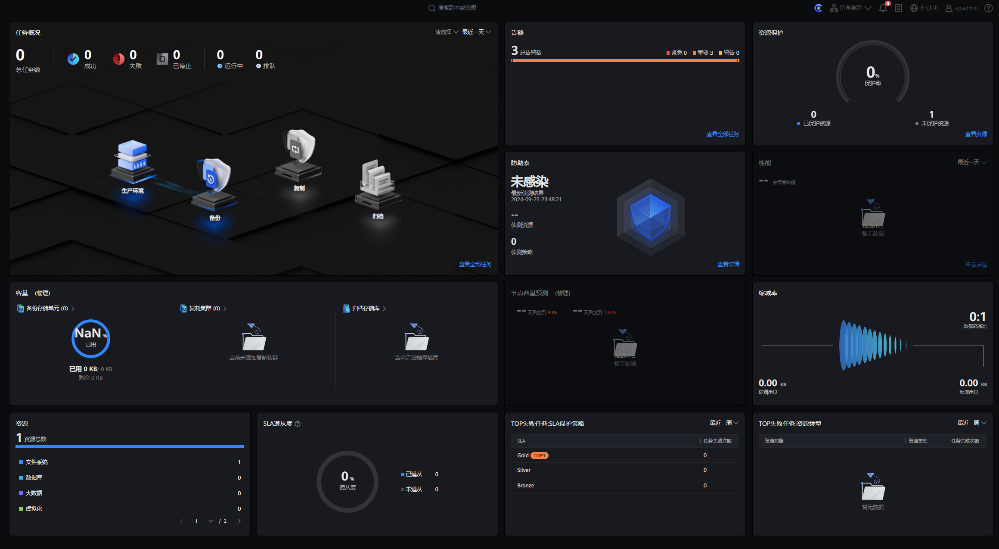

各部分的描述如[表1](#table10560991707)所示。

**表 1** “首页“界面说明

<a name="table10560991707"></a>
<table><thead align="left"><tr id="row155611098016"><th class="cellrowborder" valign="top" width="7.84078407840784%" id="mcps1.2.4.1.1"><p id="p85611892013"><a name="p85611892013"></a><a name="p85611892013"></a>序号</p>
</th>
<th class="cellrowborder" valign="top" width="22.26222622262226%" id="mcps1.2.4.1.2"><p id="p7561791701"><a name="p7561791701"></a><a name="p7561791701"></a>名称</p>
</th>
<th class="cellrowborder" valign="top" width="69.89698969896989%" id="mcps1.2.4.1.3"><p id="p4561595018"><a name="p4561595018"></a><a name="p4561595018"></a>说明</p>
</th>
</tr>
</thead>
<tbody><tr id="row135611591208"><td class="cellrowborder" valign="top" width="7.84078407840784%" headers="mcps1.2.4.1.1 "><p id="p056117911012"><a name="p056117911012"></a><a name="p056117911012"></a>1</p>
</td>
<td class="cellrowborder" valign="top" width="22.26222622262226%" headers="mcps1.2.4.1.2 "><p id="p159607270017"><a name="p159607270017"></a><a name="p159607270017"></a>所有任务</p>
</td>
<td class="cellrowborder" valign="top" width="69.89698969896989%" headers="mcps1.2.4.1.3 "><p id="p119591827203"><a name="p119591827203"></a><a name="p119591827203"></a>展示系统的所有任务。</p>
</td>
</tr>
<tr id="row165611910017"><td class="cellrowborder" valign="top" width="7.84078407840784%" headers="mcps1.2.4.1.1 "><p id="p45611891903"><a name="p45611891903"></a><a name="p45611891903"></a>2</p>
</td>
<td class="cellrowborder" valign="top" width="22.26222622262226%" headers="mcps1.2.4.1.2 "><p id="p69591227607"><a name="p69591227607"></a><a name="p69591227607"></a>所有资源</p>
</td>
<td class="cellrowborder" valign="top" width="69.89698969896989%" headers="mcps1.2.4.1.3 "><p id="p98141441590"><a name="p98141441590"></a><a name="p98141441590"></a>展示接入系统的所有<span class="uicontrol" id="uicontrol1167213528223"><a name="uicontrol1167213528223"></a><a name="uicontrol1167213528223"></a>“已保护”</span>和<span class="uicontrol" id="uicontrol28185548228"><a name="uicontrol28185548228"></a><a name="uicontrol28185548228"></a>“未保护”</span>的资源。</p>
</td>
</tr>
<tr id="row5561691603"><td class="cellrowborder" valign="top" width="7.84078407840784%" headers="mcps1.2.4.1.1 "><p id="p1856149203"><a name="p1856149203"></a><a name="p1856149203"></a>3</p>
</td>
<td class="cellrowborder" valign="top" width="22.26222622262226%" headers="mcps1.2.4.1.2 "><p id="p9958132717020"><a name="p9958132717020"></a><a name="p9958132717020"></a>告警</p>
</td>
<td class="cellrowborder" valign="top" width="69.89698969896989%" headers="mcps1.2.4.1.3 "><p id="p1495882714014"><a name="p1495882714014"></a><a name="p1495882714014"></a>展示系统产生的告警。</p>
</td>
</tr>
<tr id="row642073212018"><td class="cellrowborder" valign="top" width="7.84078407840784%" headers="mcps1.2.4.1.1 "><p id="p17420732604"><a name="p17420732604"></a><a name="p17420732604"></a>4</p>
</td>
<td class="cellrowborder" valign="top" width="22.26222622262226%" headers="mcps1.2.4.1.2 "><p id="p10420032601"><a name="p10420032601"></a><a name="p10420032601"></a>系统容量</p>
</td>
<td class="cellrowborder" valign="top" width="69.89698969896989%" headers="mcps1.2.4.1.3 "><p id="p15420632706"><a name="p15420632706"></a><a name="p15420632706"></a>展示系统的总容量和已使用容量。</p>
</td>
</tr>
<tr id="row2517183416010"><td class="cellrowborder" valign="top" width="7.84078407840784%" headers="mcps1.2.4.1.1 "><p id="p185171534906"><a name="p185171534906"></a><a name="p185171534906"></a>5</p>
</td>
<td class="cellrowborder" valign="top" width="22.26222622262226%" headers="mcps1.2.4.1.2 "><p id="p105174341009"><a name="p105174341009"></a><a name="p105174341009"></a>SLA遵从度</p>
</td>
<td class="cellrowborder" valign="top" width="69.89698969896989%" headers="mcps1.2.4.1.3 "><p id="p18517143416017"><a name="p18517143416017"></a><a name="p18517143416017"></a>展示资源的SLA遵从度。</p>
</td>
</tr>
<tr id="row0270436804"><td class="cellrowborder" valign="top" width="7.84078407840784%" headers="mcps1.2.4.1.1 "><p id="p4270173617012"><a name="p4270173617012"></a><a name="p4270173617012"></a>6</p>
</td>
<td class="cellrowborder" valign="top" width="22.26222622262226%" headers="mcps1.2.4.1.2 "><p id="p527023611012"><a name="p527023611012"></a><a name="p527023611012"></a>数据缩减</p>
</td>
<td class="cellrowborder" valign="top" width="69.89698969896989%" headers="mcps1.2.4.1.3 "><p id="p1027015363015"><a name="p1027015363015"></a><a name="p1027015363015"></a>展示数据缩减比。通过源端重删、复制链路重删，实现数据缩减。</p>
</td>
</tr>
<tr id="row559610391809"><td class="cellrowborder" valign="top" width="7.84078407840784%" headers="mcps1.2.4.1.1 "><p id="p45961939902"><a name="p45961939902"></a><a name="p45961939902"></a>7</p>
</td>
<td class="cellrowborder" valign="top" width="22.26222622262226%" headers="mcps1.2.4.1.2 "><p id="p15971939402"><a name="p15971939402"></a><a name="p15971939402"></a>容量趋势</p>
</td>
<td class="cellrowborder" valign="top" width="69.89698969896989%" headers="mcps1.2.4.1.3 "><p id="p1159719396017"><a name="p1159719396017"></a><a name="p1159719396017"></a>展示系统容量的变化趋势。</p>
</td>
</tr>
<tr id="row1099513439015"><td class="cellrowborder" valign="top" width="7.84078407840784%" headers="mcps1.2.4.1.1 "><p id="p1299510435019"><a name="p1299510435019"></a><a name="p1299510435019"></a>8</p>
</td>
<td class="cellrowborder" valign="top" width="22.26222622262226%" headers="mcps1.2.4.1.2 "><p id="p29957439014"><a name="p29957439014"></a><a name="p29957439014"></a>性能</p>
</td>
<td class="cellrowborder" valign="top" width="69.89698969896989%" headers="mcps1.2.4.1.3 "><p id="p4995843205"><a name="p4995843205"></a><a name="p4995843205"></a>展示系统的性能。</p>
</td>
</tr>
</tbody>
</table>

**保护<a name="section552194114463"></a>**

“保护“界面如下图所示。

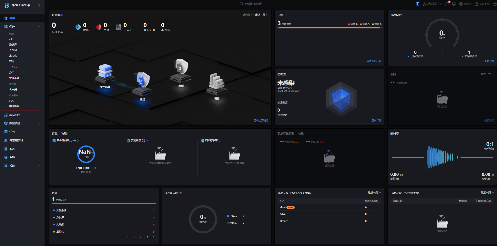

各部分的描述如[表2](#table13737114317491)所示。

**表 2** “保护“界面说明

<a name="table13737114317491"></a>
<table><thead align="left"><tr id="row10737174314915"><th class="cellrowborder" valign="top" width="7.84078407840784%" id="mcps1.2.4.1.1"><p id="p1173794320490"><a name="p1173794320490"></a><a name="p1173794320490"></a>序号</p>
</th>
<th class="cellrowborder" valign="top" width="22.26222622262226%" id="mcps1.2.4.1.2"><p id="p167371843174913"><a name="p167371843174913"></a><a name="p167371843174913"></a>名称</p>
</th>
<th class="cellrowborder" valign="top" width="69.89698969896989%" id="mcps1.2.4.1.3"><p id="p127371143134918"><a name="p127371143134918"></a><a name="p127371143134918"></a>说明</p>
</th>
</tr>
</thead>
<tbody><tr id="row197372043184917"><td class="cellrowborder" valign="top" width="7.84078407840784%" headers="mcps1.2.4.1.1 "><p id="p3737194310494"><a name="p3737194310494"></a><a name="p3737194310494"></a>1</p>
</td>
<td class="cellrowborder" valign="top" width="22.26222622262226%" headers="mcps1.2.4.1.2 "><p id="p11737154374910"><a name="p11737154374910"></a><a name="p11737154374910"></a>总览</p>
</td>
<td class="cellrowborder" valign="top" width="69.89698969896989%" headers="mcps1.2.4.1.3 "><p id="p1073714319498"><a name="p1073714319498"></a><a name="p1073714319498"></a>总览系统中<span class="uicontrol" id="uicontrol92069691415"><a name="uicontrol92069691415"></a><a name="uicontrol92069691415"></a>“已保护”</span>和<span class="uicontrol" id="uicontrol184422913148"><a name="uicontrol184422913148"></a><a name="uicontrol184422913148"></a>“未保护”</span>的各类生产资源。</p>
</td>
</tr>
<tr id="row973794304911"><td class="cellrowborder" valign="top" width="7.84078407840784%" headers="mcps1.2.4.1.1 "><p id="p473716432496"><a name="p473716432496"></a><a name="p473716432496"></a>2</p>
</td>
<td class="cellrowborder" valign="top" width="22.26222622262226%" headers="mcps1.2.4.1.2 "><p id="p1673714316498"><a name="p1673714316498"></a><a name="p1673714316498"></a>应用注册</p>
</td>
<td class="cellrowborder" valign="top" width="69.89698969896989%" headers="mcps1.2.4.1.3 "><p id="p20737154324915"><a name="p20737154324915"></a><a name="p20737154324915"></a>对<span class="uicontrol" id="uicontrol6271084156"><a name="uicontrol6271084156"></a><a name="uicontrol6271084156"></a>“主机&amp;应用”</span>、<span class="uicontrol" id="uicontrol19911792154"><a name="uicontrol19911792154"></a><a name="uicontrol19911792154"></a>“虚拟化&amp;容器”</span>、<span class="uicontrol" id="uicontrol18165312101513"><a name="uicontrol18165312101513"></a><a name="uicontrol18165312101513"></a>“大数据”</span>、<span class="uicontrol" id="uicontrol1543712149156"><a name="uicontrol1543712149156"></a><a name="uicontrol1543712149156"></a>“存储”</span>、<span class="uicontrol" id="uicontrol1592917163155"><a name="uicontrol1592917163155"></a><a name="uicontrol1592917163155"></a>“平台”</span>类型的生产资源进行创建保护的操作。</p>
</td>
</tr>
<tr id="row117377438494"><td class="cellrowborder" valign="top" width="7.84078407840784%" headers="mcps1.2.4.1.1 "><p id="p16737443114920"><a name="p16737443114920"></a><a name="p16737443114920"></a>3</p>
</td>
<td class="cellrowborder" valign="top" width="22.26222622262226%" headers="mcps1.2.4.1.2 "><p id="p1673710435497"><a name="p1673710435497"></a><a name="p1673710435497"></a>策略</p>
</td>
<td class="cellrowborder" valign="top" width="69.89698969896989%" headers="mcps1.2.4.1.3 "><p id="p273724354915"><a name="p273724354915"></a><a name="p273724354915"></a>配置SLA和限速策略。</p>
<a name="ul12592194915154"></a><a name="ul12592194915154"></a><ul id="ul12592194915154"><li>SLA（Service Level Agreement）是一组可配置的数据保护策略，策略中定义了数据保护和副本保留的规则。将这些策略关联至受保护环境，以实现对特定受保护环境的保护</li><li>限速策略用于限制保护任务的最大带宽以保证关键业务的性能。</li></ul>
</td>
</tr>
</tbody>
</table>

**数据利用<a name="section116816188559"></a>**

> **注意：** 
>数据利用的大部分功能配合华为OceanProtect备份存储时才能使用，无华为OceanProtect备份存储时可能会提示错误。

“数据利用“界面如下图所示。

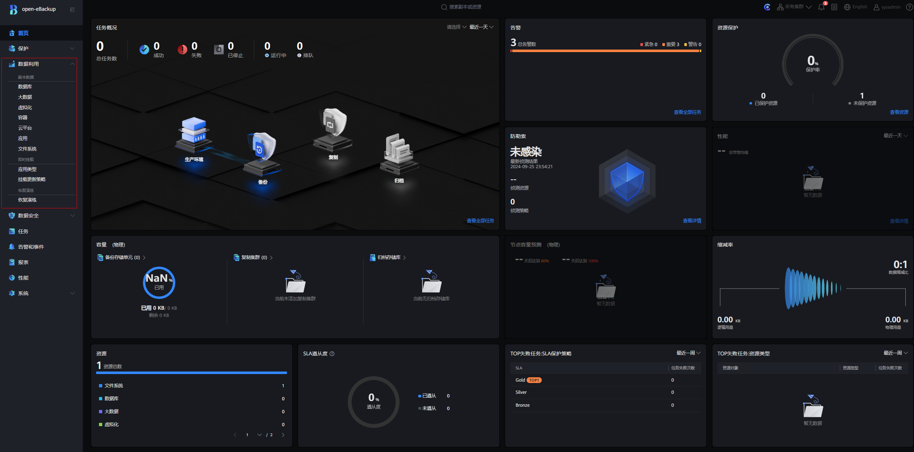

各部分的描述如[表3](#table2381121615569)所示。

**表 3** “数据利用“界面说明

<a name="table2381121615569"></a>
<table><thead align="left"><tr id="row0382101610569"><th class="cellrowborder" valign="top" width="6.9906990699069915%" id="mcps1.2.4.1.1"><p id="p13382716205618"><a name="p13382716205618"></a><a name="p13382716205618"></a>序号</p>
</th>
<th class="cellrowborder" valign="top" width="19.55195519551955%" id="mcps1.2.4.1.2"><p id="p9382181616568"><a name="p9382181616568"></a><a name="p9382181616568"></a>名称</p>
</th>
<th class="cellrowborder" valign="top" width="73.45734573457347%" id="mcps1.2.4.1.3"><p id="p14382516205615"><a name="p14382516205615"></a><a name="p14382516205615"></a>说明</p>
</th>
</tr>
</thead>
<tbody><tr id="row1038291611566"><td class="cellrowborder" valign="top" width="6.9906990699069915%" headers="mcps1.2.4.1.1 "><p id="p03815411228"><a name="p03815411228"></a><a name="p03815411228"></a>1</p>
</td>
<td class="cellrowborder" valign="top" width="19.55195519551955%" headers="mcps1.2.4.1.2 "><p id="p8382151620568"><a name="p8382151620568"></a><a name="p8382151620568"></a>副本数据</p>
</td>
<td class="cellrowborder" valign="top" width="73.45734573457347%" headers="mcps1.2.4.1.3 "><p id="p93824165563"><a name="p93824165563"></a><a name="p93824165563"></a>该页面支持以资源维度或副本维度查看副本，并支持修改副本保留策略、为复制副本创建保护等操作。</p>
</td>
</tr>
<tr id="row03821416175614"><td class="cellrowborder" valign="top" width="6.9906990699069915%" headers="mcps1.2.4.1.1 "><p id="p1738216160564"><a name="p1738216160564"></a><a name="p1738216160564"></a>2</p>
</td>
<td class="cellrowborder" valign="top" width="19.55195519551955%" headers="mcps1.2.4.1.2 "><p id="p9382181613567"><a name="p9382181613567"></a><a name="p9382181613567"></a>即时挂载</p>
</td>
<td class="cellrowborder" valign="top" width="73.45734573457347%" headers="mcps1.2.4.1.3 "><p id="p97319452716"><a name="p97319452716"></a><a name="p97319452716"></a>通过即时挂载将备份副本挂载给使用数据的虚拟机，达到可立即恢复或访问备份副本数据的效果。支持对文件集、Oracle、MySQL/MariaDB、VMware、NAS文件系统、NAS共享进行即时挂载。</p>
</td>
</tr>
<tr id="row9382121665616"><td class="cellrowborder" valign="top" width="6.9906990699069915%" headers="mcps1.2.4.1.1 "><p id="p8382151612564"><a name="p8382151612564"></a><a name="p8382151612564"></a>3</p>
</td>
<td class="cellrowborder" valign="top" width="19.55195519551955%" headers="mcps1.2.4.1.2 "><p id="p16382151619563"><a name="p16382151619563"></a><a name="p16382151619563"></a>恢复演练</p>
</td>
<td class="cellrowborder" valign="top" width="73.45734573457347%" headers="mcps1.2.4.1.3 "><p id="p38481491197"><a name="p38481491197"></a><a name="p38481491197"></a>通过恢复演练功能校验备份副本的有效性，或进行恢复功能进行测试。</p>
</td>
</tr>
</tbody>
</table>

数据安全

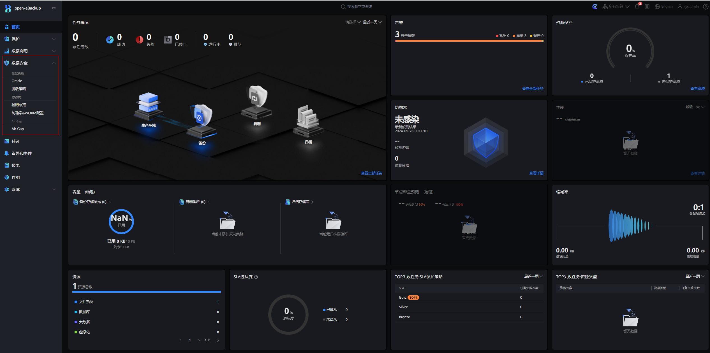

**表 4**  数据安全界面说明

<a name="table192571924195617"></a>
<table><thead align="left"><tr id="row525772495611"><th class="cellrowborder" valign="top" width="6.87068706870687%" id="mcps1.2.4.1.1">&nbsp;&nbsp;</th>
<th class="cellrowborder" valign="top" width="19.591959195919593%" id="mcps1.2.4.1.2">&nbsp;&nbsp;</th>
<th class="cellrowborder" valign="top" width="73.53735373537353%" id="mcps1.2.4.1.3">&nbsp;&nbsp;</th>
</tr>
</thead>
<tbody><tr id="row1325732411562"><td class="cellrowborder" valign="top" width="6.87068706870687%" headers="mcps1.2.4.1.1 "><p id="p167631834115613"><a name="p167631834115613"></a><a name="p167631834115613"></a>1</p>
</td>
<td class="cellrowborder" valign="top" width="19.591959195919593%" headers="mcps1.2.4.1.2 "><p id="p376383412563"><a name="p376383412563"></a><a name="p376383412563"></a>数据脱敏</p>
</td>
<td class="cellrowborder" valign="top" width="73.53735373537353%" headers="mcps1.2.4.1.3 "><p id="p776393412561"><a name="p776393412561"></a><a name="p776393412561"></a>对副本挂载或副本恢复的数据内容进行敏感数据识别、脱敏，实现数据再利用场景下对敏感隐私信息的保护。</p>
<p id="p1176311343564"><a name="p1176311343564"></a><a name="p1176311343564"></a>支持对Oracle进行数据脱敏。</p>
</td>
</tr>
<tr id="row6257102419564"><td class="cellrowborder" valign="top" width="6.87068706870687%" headers="mcps1.2.4.1.1 "><p id="p117631834175619"><a name="p117631834175619"></a><a name="p117631834175619"></a>2</p>
</td>
<td class="cellrowborder" valign="top" width="19.591959195919593%" headers="mcps1.2.4.1.2 "><p id="p9763334155614"><a name="p9763334155614"></a><a name="p9763334155614"></a>防勒索</p>
</td>
<td class="cellrowborder" valign="top" width="73.53735373537353%" headers="mcps1.2.4.1.3 "><p id="p16763133455611"><a name="p16763133455611"></a><a name="p16763133455611"></a>对备份副本/复制副本进行WORM设置和勒索软件检测，从而对数据进行保护。</p>
<p id="p127631734115616"><a name="p127631734115616"></a><a name="p127631734115616"></a>支持对VMware、NAS文件系统、NAS共享进行勒索检测。</p>
</td>
</tr>
<tr id="row92574241569"><td class="cellrowborder" valign="top" width="6.87068706870687%" headers="mcps1.2.4.1.1 "><p id="p9763134115617"><a name="p9763134115617"></a><a name="p9763134115617"></a>3</p>
</td>
<td class="cellrowborder" valign="top" width="19.591959195919593%" headers="mcps1.2.4.1.2 "><p id="p16763173410568"><a name="p16763173410568"></a><a name="p16763173410568"></a>Air Gap</p>
</td>
<td class="cellrowborder" valign="top" width="73.53735373537353%" headers="mcps1.2.4.1.3 "><p id="p6763123413560"><a name="p6763123413560"></a><a name="p6763123413560"></a>通过对存储设备关联Air Gap策略，实现复制链路通断控制，从而构建隔离区，对数据进行保护。</p>
</td>
</tr>
</tbody>
</table>

**监控<a name="section207371692175"></a>**

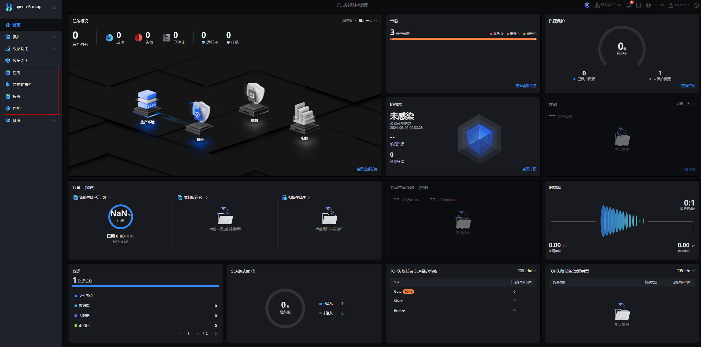

**表 5** “监控“界面说明

<a name="table17744125113173"></a>
<table><thead align="left"><tr id="row1074465191710"><th class="cellrowborder" valign="top" width="6.9906990699069915%" id="mcps1.2.4.1.1"><p id="p187441051181716"><a name="p187441051181716"></a><a name="p187441051181716"></a>序号</p>
</th>
<th class="cellrowborder" valign="top" width="19.55195519551955%" id="mcps1.2.4.1.2"><p id="p167441551181717"><a name="p167441551181717"></a><a name="p167441551181717"></a>名称</p>
</th>
<th class="cellrowborder" valign="top" width="73.45734573457347%" id="mcps1.2.4.1.3"><p id="p10744145171715"><a name="p10744145171715"></a><a name="p10744145171715"></a>说明</p>
</th>
</tr>
</thead>
<tbody><tr id="row187449518172"><td class="cellrowborder" valign="top" width="6.9906990699069915%" headers="mcps1.2.4.1.1 "><p id="p13744105111710"><a name="p13744105111710"></a><a name="p13744105111710"></a>1</p>
</td>
<td class="cellrowborder" valign="top" width="19.55195519551955%" headers="mcps1.2.4.1.2 "><p id="p374445151717"><a name="p374445151717"></a><a name="p374445151717"></a>性能</p>
</td>
<td class="cellrowborder" valign="top" width="73.45734573457347%" headers="mcps1.2.4.1.3 "><p id="p17745155141713"><a name="p17745155141713"></a><a name="p17745155141713"></a>通过I/O响应时间、IOPS、带宽指标了解系统的运行状态。</p>
</td>
</tr>
<tr id="row5745175141712"><td class="cellrowborder" valign="top" width="6.9906990699069915%" headers="mcps1.2.4.1.1 "><p id="p67451451141718"><a name="p67451451141718"></a><a name="p67451451141718"></a>2</p>
</td>
<td class="cellrowborder" valign="top" width="19.55195519551955%" headers="mcps1.2.4.1.2 "><p id="p15745125111720"><a name="p15745125111720"></a><a name="p15745125111720"></a>告警和事件</p>
</td>
<td class="cellrowborder" valign="top" width="73.45734573457347%" headers="mcps1.2.4.1.3 "><p id="p1529955881816"><a name="p1529955881816"></a><a name="p1529955881816"></a>查看系统产生的告警和事件，并根据其详细信息和修复建议进行处理，保证设备和业务的正常运行。</p>
</td>
</tr>
<tr id="row1274511514178"><td class="cellrowborder" valign="top" width="6.9906990699069915%" headers="mcps1.2.4.1.1 "><p id="p187453517174"><a name="p187453517174"></a><a name="p187453517174"></a>3</p>
</td>
<td class="cellrowborder" valign="top" width="19.55195519551955%" headers="mcps1.2.4.1.2 "><p id="p1574555116174"><a name="p1574555116174"></a><a name="p1574555116174"></a>任务</p>
</td>
<td class="cellrowborder" valign="top" width="73.45734573457347%" headers="mcps1.2.4.1.3 "><p id="p10179124112213"><a name="p10179124112213"></a><a name="p10179124112213"></a>展示数据保护任务的运行状态和执行详情，支持停止任务和下载任务。</p>
</td>
</tr>
<tr id="row57451151181716"><td class="cellrowborder" valign="top" width="6.9906990699069915%" headers="mcps1.2.4.1.1 "><p id="p1074595111711"><a name="p1074595111711"></a><a name="p1074595111711"></a>4</p>
</td>
<td class="cellrowborder" valign="top" width="19.55195519551955%" headers="mcps1.2.4.1.2 "><p id="p13745551111714"><a name="p13745551111714"></a><a name="p13745551111714"></a>报表</p>
</td>
<td class="cellrowborder" valign="top" width="73.45734573457347%" headers="mcps1.2.4.1.3 "><p id="p101832295237"><a name="p101832295237"></a><a name="p101832295237"></a>通过报表功能，查看系统中关键资源（如存储容量使用情况）状态及关键任务（如备份、恢复）的运行情况。</p>
</td>
</tr>
</tbody>
</table>

**系统<a name="section197176134254"></a>**

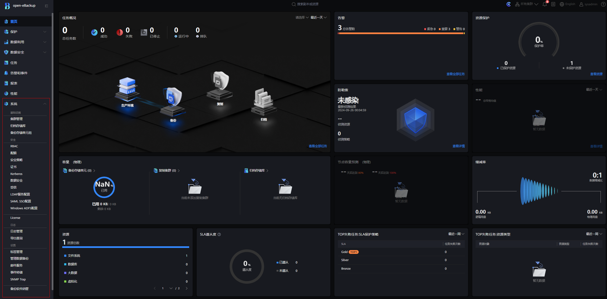

各部分的描述如[表6](#table14391133610273)所示。

**表 6** “系统“界面说明

<a name="table14391133610273"></a>
<table><thead align="left"><tr id="row11391123642711"><th class="cellrowborder" valign="top" width="6.9906990699069915%" id="mcps1.2.4.1.1"><p id="p639120368272"><a name="p639120368272"></a><a name="p639120368272"></a>序号</p>
</th>
<th class="cellrowborder" valign="top" width="13.201320132013203%" id="mcps1.2.4.1.2"><p id="p183916369277"><a name="p183916369277"></a><a name="p183916369277"></a>名称</p>
</th>
<th class="cellrowborder" valign="top" width="79.80798079807981%" id="mcps1.2.4.1.3"><p id="p639143610275"><a name="p639143610275"></a><a name="p639143610275"></a>说明</p>
</th>
</tr>
</thead>
<tbody><tr id="row0391193652712"><td class="cellrowborder" valign="top" width="6.9906990699069915%" headers="mcps1.2.4.1.1 "><p id="p6391203619276"><a name="p6391203619276"></a><a name="p6391203619276"></a>1</p>
</td>
<td class="cellrowborder" valign="top" width="13.201320132013203%" headers="mcps1.2.4.1.2 "><p id="p1239117364277"><a name="p1239117364277"></a><a name="p1239117364277"></a>基础设施</p>
</td>
<td class="cellrowborder" valign="top" width="79.80798079807981%" headers="mcps1.2.4.1.3 "><p id="p19282433163210"><a name="p19282433163210"></a><a name="p19282433163210"></a>进行集群管理、归档/备份存储库管理。</p>
</td>
</tr>
<tr id="row1239118367272"><td class="cellrowborder" valign="top" width="6.9906990699069915%" headers="mcps1.2.4.1.1 "><p id="p83919369278"><a name="p83919369278"></a><a name="p83919369278"></a>2</p>
</td>
<td class="cellrowborder" valign="top" width="13.201320132013203%" headers="mcps1.2.4.1.2 "><p id="p14391163613274"><a name="p14391163613274"></a><a name="p14391163613274"></a>安全</p>
</td>
<td class="cellrowborder" valign="top" width="79.80798079807981%" headers="mcps1.2.4.1.3 "><a name="ul117801230114110"></a><a name="ul117801230114110"></a><ul id="ul117801230114110"><li>用户和角色：系统内置了<span class="uicontrol" id="uicontrol1384480114713"><a name="uicontrol1384480114713"></a><a name="uicontrol1384480114713"></a>“系统管理员”</span>、<span class="uicontrol" id="uicontrol1683392124716"><a name="uicontrol1683392124716"></a><a name="uicontrol1683392124716"></a>“数据保护管理员”</span>、<span class="uicontrol" id="uicontrol1983384204712"><a name="uicontrol1983384204712"></a><a name="uicontrol1983384204712"></a>“审计员”</span>、<span class="uicontrol" id="uicontrol15181151320470"><a name="uicontrol15181151320470"></a><a name="uicontrol15181151320470"></a>“远端设备管理员”</span>、<span class="uicontrol" id="uicontrol5761415184714"><a name="uicontrol5761415184714"></a><a name="uicontrol5761415184714"></a>“灾备管理员”</span>角色的用户，具有不同的权限。</li><li>配额：用于网管软件使用open-eBackup做数据保护任务时，限制SAML用户的数据保护功能以及备份/归档配额。</li><li>安全策略：管理密码策略、弱口令字典、会话超时时间、访问控制、登录策略、密钥更新策略、本地存储密码更新、内部组件密码更新。</li><li>证书：管理证书，用于保证open-eBackup内部各组件及与外部之间通信安全性。</li><li>Kerberos：用于进行Kerberos认证。</li><li>数据安全：配置<span class="uicontrol" id="uicontrol10255145517571"><a name="uicontrol10255145517571"></a><a name="uicontrol10255145517571"></a>“复制链路加密”</span>和<span class="uicontrol" id="uicontrol18799757115711"><a name="uicontrol18799757115711"></a><a name="uicontrol18799757115711"></a>“备份链路加密”</span>开关</li><li>受信：管理主机受信，用于提升系统安全性。</li><li>LDAP服务配置：用于LDAP服务器认证方式登录系统。</li><li>SAML SSO配置：配置SAML SSO，可实现网管软件跳转open-eBackup。</li></ul>
</td>
</tr>
<tr id="row43926360275"><td class="cellrowborder" valign="top" width="6.9906990699069915%" headers="mcps1.2.4.1.1 "><p id="p83927367277"><a name="p83927367277"></a><a name="p83927367277"></a>3</p>
</td>
<td class="cellrowborder" valign="top" width="13.201320132013203%" headers="mcps1.2.4.1.2 "><p id="p14392143632715"><a name="p14392143632715"></a><a name="p14392143632715"></a>日志管理</p>
</td>
<td class="cellrowborder" valign="top" width="79.80798079807981%" headers="mcps1.2.4.1.3 "><p id="p1528113333218"><a name="p1528113333218"></a><a name="p1528113333218"></a>进行日志级别设置和日志导出。</p>
</td>
</tr>
<tr id="row1839213652711"><td class="cellrowborder" valign="top" width="6.9906990699069915%" headers="mcps1.2.4.1.1 "><p id="p639243612718"><a name="p639243612718"></a><a name="p639243612718"></a>4</p>
</td>
<td class="cellrowborder" valign="top" width="13.201320132013203%" headers="mcps1.2.4.1.2 "><p id="p339283620273"><a name="p339283620273"></a><a name="p339283620273"></a>导出查询</p>
</td>
<td class="cellrowborder" valign="top" width="79.80798079807981%" headers="mcps1.2.4.1.3 "><p id="p132791833163213"><a name="p132791833163213"></a><a name="p132791833163213"></a>导出系统日志、副本文件、检测报告和代理日志。</p>
</td>
</tr>
<tr id="row188485817283"><td class="cellrowborder" valign="top" width="6.9906990699069915%" headers="mcps1.2.4.1.1 "><p id="p1284820814286"><a name="p1284820814286"></a><a name="p1284820814286"></a>5</p>
</td>
<td class="cellrowborder" valign="top" width="13.201320132013203%" headers="mcps1.2.4.1.2 "><p id="p984813882814"><a name="p984813882814"></a><a name="p984813882814"></a>设置</p>
</td>
<td class="cellrowborder" valign="top" width="79.80798079807981%" headers="mcps1.2.4.1.3 "><a name="ul26911131144312"></a><a name="ul26911131144312"></a><ul id="ul26911131144312"><li>管理数据备份：备份管理数据，以便系统在因人为误操作将某些配置数据（如用户、SLA，资源、告警通知等等）删除时使用该备份数据及时恢复。</li><li>邮件服务：系统管理员忘记密码或需要设置动态口令时，系统提供以电子邮件的形式将验证码发送至预先设定的邮箱地址中。</li><li>告警设置：对告警配置信息进行设置。</li><li>事件转储：通过事件转储功能，系统会定时将事件导出到系统的本地磁盘，并删除保留周期外的数据库中的事件记录。</li><li>SNMP Trap：通过配置SNMP，用户可以查询、设置open-eBackup信息，或接收open-eBackup的告警信息。</li><li>SFTP服务：配置SFTP服务，通过SFTP用户连接SFTP服务器后进行用户数据的上传和下载。</li><li>设备时间：修改设备时间。</li></ul>
</td>
</tr>
</tbody>
</table>

