# 版权声明

Copyright © 2024 Huawei Technologies Co.,Ltd.

This work is licensed under the Creative Commons Attribution-ShareAlike 4.0 International License. You are free to share and adapt the material as long as you attribute the author and distribute your contributions under the same license.

To view a copy of this license, visit http://creativecommons.org/licenses/by-sa/4.0/

**概述**

本文档详细的描述了open-eBackup备份软件的功能及原理介绍。

**读者对象**

本文档主要适用于升级的操作人员。操作人员必须具备以下经验和技能：

-   熟悉当前网络的组网和相关网元的版本信息。
-   有该设备维护经验，熟悉设备的操作维护方式。

**符号约定**

在本文中可能出现下列标志，它们所代表的含义如下。

<table><thead align="left"><tr id="row1530720816410"><th class="cellrowborder" valign="top" width="20.580000000000002%" id="mcps1.1.3.1.1">
<strong id="b2136615816410">符号</strong>

</th>
<th class="cellrowborder" valign="top" width="79.42%" id="mcps1.1.3.1.2">
<strong id="b5941558116410">说明</strong>

</th>
</tr>
</thead>
<tbody><tr id="row1372280416410"><td class="cellrowborder" valign="top" width="20.580000000000002%" headers="mcps1.1.3.1.1 ">

</td>
<td class="cellrowborder" valign="top" width="79.42%" headers="mcps1.1.3.1.2 ">
表示如不避免则将会导致死亡或严重伤害的具有高等级风险的危害。

</td>
</tr>
<tr id="row466863216410"><td class="cellrowborder" valign="top" width="20.580000000000002%" headers="mcps1.1.3.1.1 ">

</td>
<td class="cellrowborder" valign="top" width="79.42%" headers="mcps1.1.3.1.2 ">
表示如不避免则可能导致死亡或严重伤害的具有中等级风险的危害。

</td>
</tr>
<tr id="row123863216410"><td class="cellrowborder" valign="top" width="20.580000000000002%" headers="mcps1.1.3.1.1 ">

</td>
<td class="cellrowborder" valign="top" width="79.42%" headers="mcps1.1.3.1.2 ">
表示如不避免则可能导致轻微或中度伤害的具有低等级风险的危害。

</td>
</tr>
<tr id="row5786682116410"><td class="cellrowborder" valign="top" width="20.580000000000002%" headers="mcps1.1.3.1.1 ">

</td>
<td class="cellrowborder" valign="top" width="79.42%" headers="mcps1.1.3.1.2 ">
用于传递设备或环境安全警示信息。如不避免则可能会导致设备损坏、数据丢失、设备性能降低或其它不可预知的结果。

“须知”不涉及人身伤害。

</td>
</tr>
<tr id="row2856923116410"><td class="cellrowborder" valign="top" width="20.580000000000002%" headers="mcps1.1.3.1.1 ">

</td>
<td class="cellrowborder" valign="top" width="79.42%" headers="mcps1.1.3.1.2 ">
对正文中重点信息的补充说明。

“说明”不是安全警示信息，不涉及人身、设备及环境伤害信息。

</td>
</tr>
</tbody>
</table>

# 摘要

open-eBackup是国内首个开源的兼容多应用生态的备份软件，不仅能够对接数据库、虚拟化、文件等多场景，并且具有安全、重删、压缩等功能。希望能够通过大赛，吸引全球备份软件用户、伙伴、开发者共同加入，共同探索数据备份技术发展趋势，制定相应的软件解决方案。

在当今的数字化时代，IT建设面临巨大的挑战，可以从灾备中心和大数据中心两个角度进行挑战分析：

-   灾备中心
    -   备份数据仅用来做数据恢复，灾备建设投入产出比低。
    -   数据保护效率低下。
    -   数据恢复验证难

-   大数据中心
    -   海量数据采集时间长，备份时间长，备份失败的影响增加。
    -   数据近线保存时间变长，备份数据量激增，管理难度增加。
    -   数据恢复时间长，业务中断的恢复时间变长。

open-eBackup具有备份快、恢复快、用量省、高可靠的特点。这款恢复速度最快的备份系统，可帮助用户实现高效备份恢复，大幅节省TCO，广泛适用于政府、金融、运营商、医疗、制造等行业。

本文从产品定位、硬件架构、软件架构、特性方面详细介绍了open-eBackup的关键技术，以及为客户带来的独特价值。

# 产品简介

## 支持型号及规格

<table><thead align="left"><tr id="row34945187139"><th class="cellrowborder" valign="top" width="52%" id="mcps1.1.3.1.1">
规格名称

</th>
<th class="cellrowborder" valign="top" width="48%" id="mcps1.1.3.1.2">
open-eBackup

</th>
</tr>
</thead>
<tbody><tr id="row94941818131315"><td class="cellrowborder" valign="top" width="52%" headers="mcps1.1.3.1.1 ">
CPU型号

</td>
<td class="cellrowborder" valign="top" width="48%" headers="mcps1.1.3.1.2 ">
ARM

</td>
</tr>
<tr id="row13858717111310"><td class="cellrowborder" valign="top" width="52%" headers="mcps1.1.3.1.1 ">
CPU个数

</td>
<td class="cellrowborder" valign="top" width="48%" headers="mcps1.1.3.1.2 ">
16

</td>
</tr>
<tr id="row2049413189130"><td class="cellrowborder" valign="top" width="52%" headers="mcps1.1.3.1.1 ">
内存/节点

</td>
<td class="cellrowborder" valign="top" width="48%" headers="mcps1.1.3.1.2 ">
64GB/128GB

</td>
</tr>
<tr id="row154961118201312"><td class="cellrowborder" valign="top" width="52%" headers="mcps1.1.3.1.1 ">
最大备份带宽/节点

</td>
<td class="cellrowborder" valign="top" width="48%" headers="mcps1.1.3.1.2 ">
12TB/h

</td>
</tr>
<tr id="row161295911144"><td class="cellrowborder" valign="top" width="52%" headers="mcps1.1.3.1.1 ">
最大恢复带宽/节点

</td>
<td class="cellrowborder" valign="top" width="48%" headers="mcps1.1.3.1.2 ">
7TB/h

</td>
</tr>
<tr id="row1496181813136"><td class="cellrowborder" valign="top" width="52%" headers="mcps1.1.3.1.1 ">
支持的数据备份特性

</td>
<td class="cellrowborder" valign="top" width="48%" headers="mcps1.1.3.1.2 ">
所有特性

</td>
</tr>
</tbody>
</table>

## 特性概述

随着 IT 的不断发展，数据资产已经成为企业生存的根本，企业的生产、经营、战略，都离不开数据的支撑。数据保护，也渐渐的从单纯的保护数据，演变成备份数据的再利用，让备份数据发挥更多的价值，企业备份面临如下挑战。

-   生产环境的业务复杂、应用多样，备份数据量大；
-   恢复时间长，业务面临长时间中断；
-   备份数据难以管理，备份数据内容黑盒，难以精确查找恢复内容；
-   备份系统投资回报率低，难以利用备份数据支撑其他业务，以提高系统的利用率。
-   备份数据存储容量难以预测，备份系统本身可靠性不高，无法预知未来风险。

一系列的需求发展和关联技术的变革对客户IT基础设施的构建和保护提出了更高的要求，要构建一个高可靠的现代化IT基础设施，选择一个高效、可靠、备份数据再利用能力广泛的数据保护系统是最为关键的环节。

open-eBackup秉承“极致保护+高效利用”的设计，通过自研备份软件的核心科技能力，实现原生备份能力，提供稳定高性能备份和极致可靠服务，满足现代化智能IT系统对备份系统的诉求。同时，通过对备份数据实现即时挂载、业务回迁等，通过备份数据的再利用能力，全面提高企业对于备份系统的投资回报。

open-eBackup是面向金融、运营商、政府、安平等行业的关键应用业务打造的新一代高性能数据保护产品能力，产品集备份软件、备份服务器、备份存储、备份数据管理、数据安全能力于一体，为客户提供高效、灵活、安全的数据保护能力：

-   **备份能力生态兼容**
    -   主机备份：支持物理机/虚拟机文件集备份；
    -   NAS备份：支持兼容各厂商NAS文件备份；
    -   数据库备份：支持Oracle、SQL Server、MySQL、Mariodb、DB2、TDSQL、OceanBase、TiDB、GoldenDB、MongoDB、GBase、SAP HANA、GaussDB T、OpenGauss、Dameng、PostgreSQL、云和恩墨（Opengauss）、海量数据（Opengauss）等多种数据库；
    -   大数据备份：支持Cloudra CDH/CDP大数据平台、开源Hadoop HDFS以及星环大数据、华为FusionInsight、MapReduce Sevice等大数据平台中的HDFS、HBase、Hive、ElasticSearch、Redis、ClickHouse等组件；
    -   虚拟化/云/容器备份：支持VMware、FusionCompute、HuaweiCloud Stack、kubernetes等虚拟化和云平台数据备份；
    -   华为数据仓库备份：支持华为数据仓库服务DWS备份；

-   **多数据流并发，备份大带宽**
    -   并发传输：支持双控并行传输备份数据，根据应用和节点负载选择备份传输网络通道，最大程度发挥网络传输能力，单节点备份带宽可达12TB/h。
    -   线性扩展：支持扩容，最大支持扩展到32节点。

-   **空间动态扩容，存储大容量**
    -   在线扩容硬盘、硬盘框，扩容后存储容量自动纳入备份存储空间，满足海量备份数据存储需求。
    -   节点线性扩容，支持32节点集群，性能/容量线性扩展。

-   **副本任意挂载，使用超灵活**
    -   备份副本支持实时挂载，可秒级恢复业务并接管生产，保障业务系统不中断，挂载业务运行过程中可回迁至生产，业务不中断，数据不丢失。
    -   副本挂载策略化，后台自动更新挂载副本，减少人工操作，极大提高数据分析、自动化开发测试效率。

open-eBackup能够满足数据库、虚拟机、物理服务器、文件、大数据等企业级应用的关键保护需求，一套设备保护多种用户生产系统，容量、性能可线性扩展，助力金融、运营商、医疗、制造等行业提升数据保护效率，节省数据保护投资，简化管理流程。

## 网络规划

open-eBackup每节点至少需要配置1个管理IP，至少需要1个备份网络平面IP，备份过程中主要传输备份/恢复信令，本章节主要介绍备份一体机网络平面划分及几种典型场景下的网络规划。

**图 1**  open-eBackup网络平面划分  

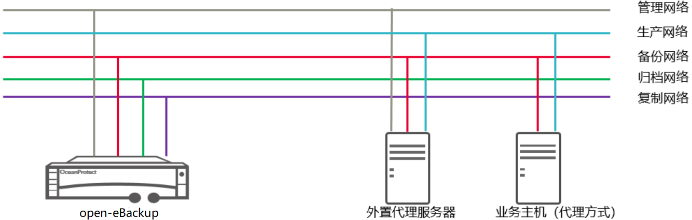

open-eBackup将网络按逻辑划分为管理网络，生产网络，备份网络，归档网络，复制网络。

管理网络：主要用于设备管理，业务配置等少量管理数据传输的管理网络。

生产网络：指客户现网中实际传输生产数据的业务网络。

备份网络：指客户环境中专门为备份数据传输建立的独立网络。

归档网络：指归档存储介质所在的数据传输网络。

复制网络：指多中心之间，专门为中心之间的数据传输建设的专网或专线。

图中设备描述：

open-eBackup：

外置代理服务器：open-eBackup在VMware SAN模式备份、HCS（高性能诉求场景配置，或需要支持后端存储为Pacific的增量备份时\)、大数据、DWS、GaussDB（gauss for opengauss）场景下，整体方案中需要额外配置的代理服务器

业务主机：数据库、文件备份等场景下，需要将备份代理软件包安装在业务主机上，这里指待保护数据库、文件所在主机。

OceanProtect网络接入：

<table><thead align="left"><tr id="zh-cn_topic_0000001558983365_row437817221759"><th class="cellrowborder" valign="top" width="13.91%" id="mcps1.1.3.1.1">
网络平面

</th>
<th class="cellrowborder" valign="top" width="86.09%" id="mcps1.1.3.1.2">
描述

</th>
</tr>
</thead>
<tbody><tr id="zh-cn_topic_0000001558983365_row03785221359"><td class="cellrowborder" valign="top" width="13.91%" headers="mcps1.1.3.1.1 ">
管理网络

</td>
<td class="cellrowborder" valign="top" width="86.09%" headers="mcps1.1.3.1.2 ">
用于备份业务配置，设备管理操作，以及部分涉及管理网络的云环境备份中的对接。

备份业务网络配置

Vmware备份VCenter对接

NAS备份存储设备管理网络对接

</td>
</tr>
<tr id="zh-cn_topic_0000001558983365_row17379112210517"><td class="cellrowborder" valign="top" width="13.91%" headers="mcps1.1.3.1.1 ">
备份网络

</td>
<td class="cellrowborder" valign="top" width="86.09%" headers="mcps1.1.3.1.2 ">
用于备份恢复过程中信令以及数据传输；

</td>
</tr>
<tr id="zh-cn_topic_0000001558983365_row203795223511"><td class="cellrowborder" valign="top" width="13.91%" headers="mcps1.1.3.1.1 ">
复制网络

</td>
<td class="cellrowborder" valign="top" width="86.09%" headers="mcps1.1.3.1.2 ">
用于复制过程中数据传输，以及复制过程中控制信令传输；

</td>
</tr>
<tr id="zh-cn_topic_0000001558983365_row19379102218514"><td class="cellrowborder" valign="top" width="13.91%" headers="mcps1.1.3.1.1 ">
归档网络

</td>
<td class="cellrowborder" valign="top" width="86.09%" headers="mcps1.1.3.1.2 ">
用于归档过程中信令以及数据传输；

</td>
</tr>
</tbody>
</table>

外置代理服务器（Proxy）网络接入：

<table><thead align="left"><tr id="zh-cn_topic_0000001558983365_row555116245619"><th class="cellrowborder" valign="top" width="13.91%" id="mcps1.1.3.1.1">
网络平面

</th>
<th class="cellrowborder" valign="top" width="86.09%" id="mcps1.1.3.1.2">
描述

</th>
</tr>
</thead>
<tbody><tr id="zh-cn_topic_0000001558983365_row2551132412620"><td class="cellrowborder" valign="top" width="13.91%" headers="mcps1.1.3.1.1 ">
管理网络

</td>
<td class="cellrowborder" valign="top" width="86.09%" headers="mcps1.1.3.1.2 ">
外置代理服务器在Vmware SAN模式备份、HDFS/HBase/Hive、HCS（高性能诉求，或需要支持后端存储为Pacific的增量备份时）备份场景中独立配置的必要扩展服务器，管理网络主要用于设备管理和备份环境对接。

BMC设备管理

Vmware备份VCenter对接；HDFS/HBase/Hive备份NameNode对接；HCS备份ManageOne对接；

</td>
</tr>
<tr id="zh-cn_topic_0000001558983365_row145511724167"><td class="cellrowborder" valign="top" width="13.91%" headers="mcps1.1.3.1.1 ">
生产网络

</td>
<td class="cellrowborder" valign="top" width="86.09%" headers="mcps1.1.3.1.2 ">
用于备份数据读取和恢复数据写入；

</td>
</tr>
<tr id="zh-cn_topic_0000001558983365_row555114242067"><td class="cellrowborder" valign="top" width="13.91%" headers="mcps1.1.3.1.1 ">
备份网络

</td>
<td class="cellrowborder" valign="top" width="86.09%" headers="mcps1.1.3.1.2 ">
用于备份数据写入和恢复数据读取；

</td>
</tr>
</tbody>
</table>

业务主机（Agent）网络接入：

<table><thead align="left"><tr id="zh-cn_topic_0000001558983365_row101276392914"><th class="cellrowborder" valign="top" width="13.91%" id="mcps1.1.3.1.1">
网络平面

</th>
<th class="cellrowborder" valign="top" width="86.09%" id="mcps1.1.3.1.2">
描述

</th>
</tr>
</thead>
<tbody><tr id="zh-cn_topic_0000001558983365_row812710391394"><td class="cellrowborder" valign="top" width="13.91%" headers="mcps1.1.3.1.1 ">
备份网络

</td>
<td class="cellrowborder" valign="top" width="86.09%" headers="mcps1.1.3.1.2 ">
用于备份数据写入和恢复数据读取；

</td>
</tr>
</tbody>
</table>

# 数据备份软件设计

## 备份软件架构

open-eBackup采用存储与数据保护软件分离的模式部署，基础存储系统运行于主机Host OS之上，保证存储读写IO交换性能，数据保护软件使用全容器化、微服务化部署模式，存储系统与数据保护系统之间资源隔离，数据保护系统之间按应用资源隔离，极大减少故障影响域。从架构视角，系统分为如下层级：

**图 1**  软件架构  

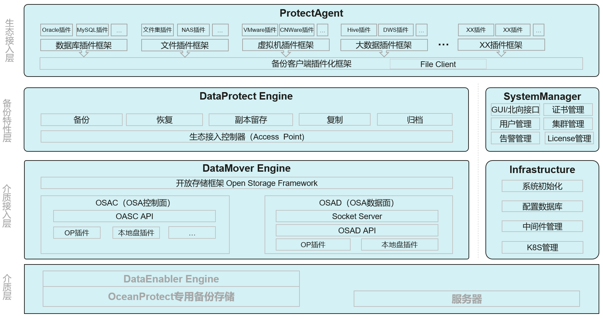

-   数据保护客户端（ProtectAgent）：主机文件，主机内数据库等负载备份时，需要安装备份代理，根据需要保护的应用类型识别需要安装的代理软件，在主机侧完成应用数据保护，无代理备份方式的应用不需要安装
-   数据备份特性层（DataProtect Engine）：负责处理数据保护业务，容器化部署，分布式架构；主要支持主机文件、数据库生态、虚拟化/云/容器生态、大数据生态保护策略的配置管理以及调度管理，以及副本数据流动能力。
-   介质接入层（DataMover Engine）：备份数据存储基础平台，负责提供备份数据传输协议、备份数据存储和布局管理、数据压缩以及重复数据删除等，为备份系统提供存储、快照、复制等基础能力。
-   硬件层：基础硬件，以及相关的驱动程序。
-   基础设施（Infrastructure）：安装部署、K8S管理、消息中间件、缓存中间件、数据库中间件等以及系统初始化的管理。
-   系统管理（SystemManager）：支持用户管理、告警管理、证书管理、集群管理License管理，以及对接华为存储产品线多种网管平台，同时支持标准协议对接三方网关平台。

## 产品特点

open-eBackup备份与恢复系统 , 不仅支持周期性全量备份、增量备份，还支持永久增量备份、原生格式备份、副本即时可用（配合华为OceanProtect存储）、端到端防勒索（配合华为OceanProtect存储），全局数据检索等特性、同时支持副本生命周期管理实现副本归档长期保留和远程复制容灾等多种功能。系统支持针对各类应用生态系统进行备份保护包括：主机文件/OS、NAS文件、数据库、虚拟化/云/容器、大数据、数据仓库等。

### 永久增量备份（合成全量）

open-eBackup备份软件支持的大部分应用，均支持永久增量备份方式进行增量数据存储，和传统后期合成永久增量不同，备份软件采用ROW（Redirect-On-Write）写时重定向/COW（Copy-On-Write）写时拷贝方式进行合成。备份数据以原始文件格式或固定文件格式写入，当增量备份时，分析增量数与上一次备份数据的差异数据块和偏移位置，并将差异数据覆盖写入文件，得到最新的全量合成副本，副本合成后生成快照，快照记录以来关系，当下次增量备份时，基于上次文件系统快照，新数据分片重定向写入新位置。省略中间合成过程。提升备份和恢复效率。

**图 1**  传统厂商永久增量备份原理  
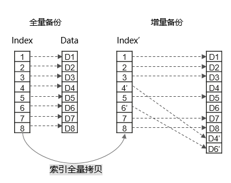

传统厂商在实现永久增量备份时，需要先进行一次上次备份副本的索引文件全量拷贝，再根据增量信息修改对应的偏移索引。得到永久增量副本的全量索引文件。或者拷贝真实数据后再合并写入成新文件写入，这种实现方式需要拷贝一次索引文件，并多次对索引文件进行修改写，或者拷贝整文件内容合并后写入，对存储层带来极大的IO负担。

**图 2**  open-eBackup ROW永久增量备份原理  

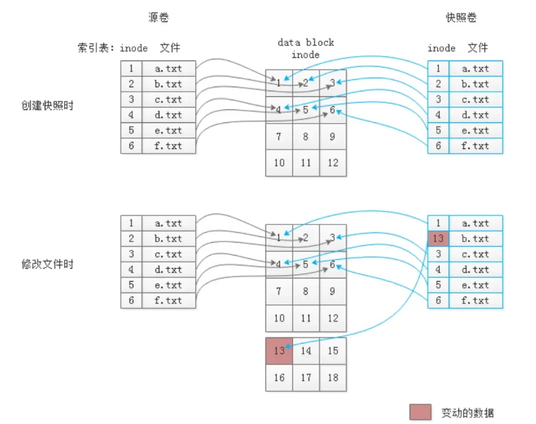

open-eBackup 备份软件永久增量备份技术，结合华为OceanProtect存储，针对索引文件采用ROW快照技术，变化数据块仅新增变化数据索引信息，不拷贝全量索引。极大缩减存储IO开销，提升备份性能。

**图 3**  open-eBackup COW永久增量备份原理  

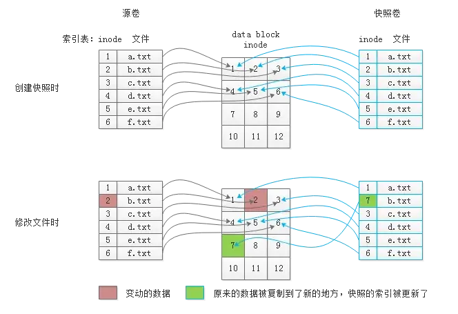

open-eBackup 备份软件永久增量备份技术，结合本地盘存储，针对索引文件采用COW快照技术，变化数据需要将原数据块拷贝到一个新位置，并更新快照卷中的新索引关系，极大的增加了存储的IO开销，备份性能相对ROW性能有所降低。

### 原生格式备份

传统备份发展历程中，通常采用备份软件和存储介质分离部署，为便于备份数据的重删缩减、加密等处理，通常将备份数据拆分存放为私有格式，此时的备份数据无法被原应用软件识别，称之为非原生格式备份。对于非原生格式的备份副本，恢复时需要将数据完全写回生产环境，才能将业务恢复，数据量越大，RTO越大。原生格式备份将备份数据以应用能识别的数据格式进行存储，将数据的缩减、加密能力下沉到存储底层。增量备份时将增量数据和全量数据进行整合，确保每一个备份副本都是可被应用识别的完整副本，极大提升副本的恢复效率。

**图 1**  传统备份软件数据存储格式  
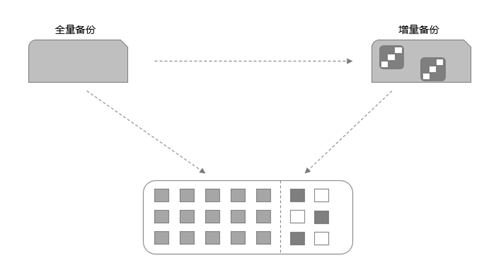

open-eBackup原生格式会将数据合并形成应用可识别的文件格式，并最终对备份文件创建快照进行保留，对应用提供即时挂载、即时恢复等能力。

**图 2**  open-eBackup保留和生产端相同的原生数据格式  
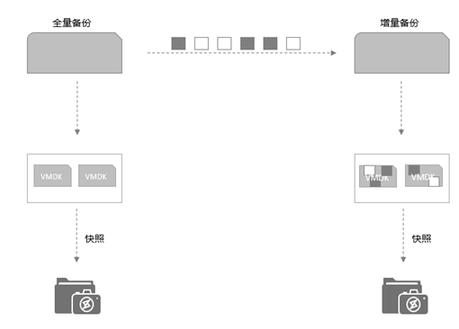

由于原生格式副本需要按照通用协议可识别的方式组织文件存储，这样生产应用才可识别这些备份文件，所以需要支持如SCSI、NFS、CIFS、HDFS、S3等标准协议，传统备份软件由于重删层处于前述协议层之上，因此一旦由备份软件重删后，数据就不可被标准协议识别，或者以标准协议格式存放，就无法进行重删压缩、加密操作，因此，传统备份软件通常是挂载能力与重删压缩等能力互斥，给客户使用带来极大不遍。

OceanProtect备份存储与open-eBackup备份软件架构垂直整合，将重删能力构筑在文件系统协议之下，并支持标准NFS、CIFS协议，将挂载、即时恢复等快速恢复能力与重删压缩、加密等能力兼而顾之，完整的满足客户诉求。

**图 3**  同时支持副本挂载和重删压缩  

.png)

-   **原生格式备份下的重删压缩**：传统的备份厂商，受软件架构限制，通常只能将备份软件的重删压缩特性构建在备份软件上，将备份软件重删、压缩处理后的数据存放到备份存储中，以便发挥备份软件特定场景下的压缩率优势，但是这样的实现方式会导致很多应用无法实现副本的即时挂载和恢复，因为应用往往基于操作系统之上运行，只支持识别通用的NAS存储、SAN存储或者对象存储上的数据，对于重删后的备份数据无法识别。open-eBackup备份软件和OceanProtect存储系统，深度结合，在存储层之下实现适用于备份场景的重删技术，同时支持通过通用NAS协议对外进行副本挂载和即时恢复。

### 副本即时可用

为便于用户即时查看副本内容，或利用备份副本进行开发测试、数据分析等操作，open-eBackup与OceanProtect备份存储相结合，支持备份副本即时挂载可用，支持Oracle、VMware、NAS备份、MySQL备份、文件备份等备份副本和复制副本的Live-Mount挂载能力，用户可快速挂载备份副本数据，实现备份数据利用和分钟级即时恢复。其中Oracle、VMware支持即时挂载后端数据迁移能力，自动将数据回签到生产系统，本章节主要介绍挂载能力和实现原理。

**图 1**  LiveMount挂载  
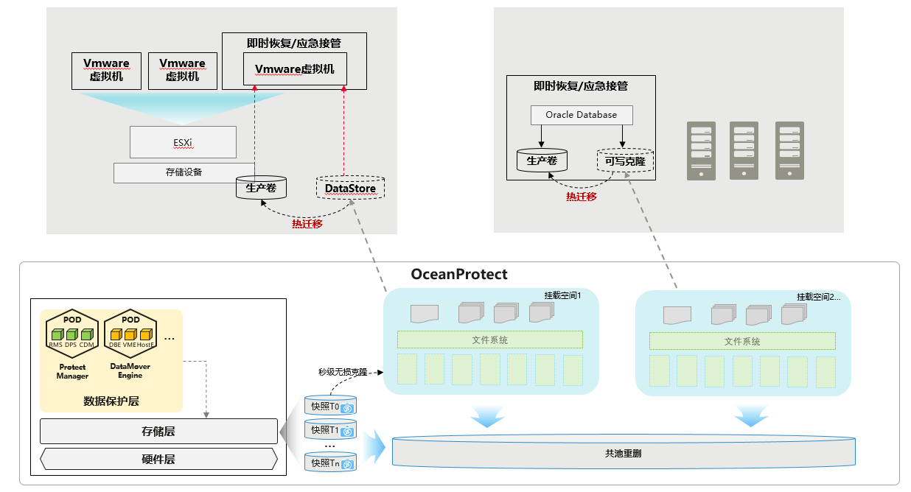

挂载使用的几种场景：

-   用户手动选择指定副本，进行挂载。
-   用户设置自动挂载策略，open-eBackup 根据策略设置，到期自动替换副本进行挂载。
-   用户通过open-eBackup中的副本进行挂载接管业务，业务运行一段时间后回迁到生产。

针对支持挂载的的应用，每次备份完成后，保留一个只读快照，快照内容与生产应用实际内容、格式保持一致，Live-Mount执行前，为指定只读副本创建一个无损可写克隆，然后将克隆的可写文件系统挂载到虚拟机或应用之上，以便应用或虚拟机能够快速拉起。

拉起后的应用涉及到新数据的变化时，将新数据写入备份存储空间，新数据依然采用ROW写时重定向方式保存，与原快照数据共享未变化数据，且共池重删。当挂载业务使用后，还能通过虚拟机vMotion，数据库切换存储等方式，将备份数据与挂载后的新业务数据无缝迁移回生产存储。

**图 2**  秒级无损克隆  
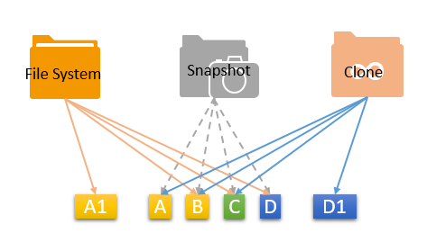

## 生产系统保护生态

open-eBackup备份软件提供了丰富的应用生态兼容性。包括主机、NAS Server、数据库、大数据、虚拟化、云平台、容器等。

应用备份功能表：

### 主机/NAS备份

open-eBackup支持主机/NAS备份能力包括：主机文件、NAS文件备份能力，主机文件备份时，需要在主机上安装数据保护客户端，通过LAN-Base方式进行备份，NAS存储无需代理，通过ServerFree方式备份。

**主机文件系统备份**，基于快速扫描的备份方案，通过文件/目录关联差异快速扫描技术和小文件聚合技术，提升扫描性能和备份性能。

-   基于快速扫描和聚合技术的快速备份方案：基于文件差异快速扫描技术，小文件聚合技术提升备份性能。

**NAS存储系统文件备份**，根据生产存储类型，主要区分为两种技术方案：

-   基于内部存储快照比对和块级增量的极速备份方案：使用OceanStor系统产品时，基于内部存储快照进行差异比对，免去耗时的差异扫描过程，同时结合文件内块级增量备份技术，提供高于友商3倍的极速备份能力。
-   基于快速扫描和聚合技术的快速备份方案：基于文件差异快速扫描技术，小文件聚合技术提升备份性能。

主要特点如下：

-   **无代理备份：**NAS海量小文件备份，任何场景下，均无需安装备份代理，其余场景需要基于Agent进行备份。
-   **永久增量（合成全量）：**基于ROW/COW快照技术，备份过程中同步合成全量，提升恢复性能，切断副本间的恢复依赖关系，且不占用额外空间，任意副本可删除。
-   **并发备份/恢复**：支持子任务拆分，单任务拆分成多个子任务，并发执行在多个节点、多个控制器中。
-   **文件聚合：**支持备份文件聚合，提升KB级小文件场景下的备份性能，避免磁盘IO成为性能瓶颈。
-   **副本挂载：**支持备份副本挂载，副本数据利用。
-   **支持备份副本复制、副本归档**

    支持将备份副本复制到包含其他open-eBackup系统，复制副本能力与备份副本相同，支持将备份副本归档到对象存储。归档副本支持普通的恢复能力。

-   **支持流量控制**

    支持备份任务流控，合理规划备份对象传输时间与带宽，同时也可以减小对生产系统的运行影响。

### 数据库生态系统备份

open-eBackup备份软件，针对数据库提供永久增量、周期性全量、日志备份等备份能力，根据用户配置，在指定时间对生产数据库发起备份，并将备份数据存放在备份存储池中。当生产数据损坏时，能使用备份数据进行快速恢复，或基于备份数据进行业务临时接管。

支持的数据库类型：Oracle、SQL Server、MySQL、Mariadb、DB2、SAP HANA、OceanBase、TDSQL 、TiDB、GoldenDB、GBase、MongoDB、GaussDB T、OpenGauss、Dameng、KingBase、Informix、PostgreSQL、HCS GaussDB、云和恩墨（Opengauss）、海量数据（Opengauss）等数据库进行在线备份保护，备份任务配置过程全部图形化操作。

数据库备份的主要特点：

-   **支持全量备份、增量备份、差异备份、永久增量**

    支持灵活的备份策略设置，能够设置永久增量、周期性全量、差异备份、日志备份等多种策略。

-   **支持即时恢复**

    能够利用备份副本数据为原生格式的特点，能在数据恢复回生产的同时，先快速的先将应用拉起，减少业务中断时长，减少RTO。

-   **支持任意时间点恢复**

    能通过日志备份，支持将生产数据恢复到过去任意时间点，减小RPO。

-   **支持原机、异机恢复，原位置、指定位置恢复**等不同的恢复目标。
-   **支持从节点优先**，识别主从、集群后优先从备节点进行备份，减少生产业务影响。
-   **支持备份任务高可靠**，每次备份识别主备角色，容忍数据库主备切换、节点故障场景下，备份任务不失败。
-   **支持备份副本挂载**

    备份副本能快速挂载，极速拉起，接管生产业务。

-   **支持备份副本复制、副本归档**

    支持将备份副本复制到其他open-eBackup备份系统，复制副本能力与备份副本相同，支持将备份副本归档到对象存储。归档副本支持普通的恢复能力。

-   **支持流量控制**

    支持备份任务流控，合理规划备份对象传输时间与带宽，同时也可以减小对生产系统的运行影响。

### 虚拟化/云/容器生态系统备份

open-eBackup备份软件提供虚拟化、云、容器场景的整机备份功能采用无代理备份方式，无需在被备份的VM内安装备份代理即可完成备份恢复，通过快速检索可实现VM的单文件恢复。由于华为备份一体机采用全ARM架构，因此部分场景需要额外通过物理机或虚拟机部署数据保护代理，通过代理进行备份流程的控制和数据的交换。针对HCS云平台，提供全栈备份服务能力，支持云主机无代理的备份服务，基于存储永久增量备份，不占用业务主机资源和业务网络资源，用户无需在所备份云服务器内安装客户端插件即可完成云主机整机备份，并支持云服务器内文件细粒度恢复。

虚拟化环境数据保护主要特点：

支持的应用类型：FusionCompute、HuaweiCloudStack、Kubernetes、VMware、CNware和OpenStack等。

-   **支持全量备份、永久增量备份，**备份任务配置过程全部图形化操作，无需编写脚本。
-   **支持环境自动扫描**，支持虚拟机、主机、DataStore、CNA节点、容器namespace、statefulset的备份。
-   **并发备份/恢复**：支持子任务拆分，单任务拆分成多个子任务，并发执行在多个节点、多个控制器中。
-   **块级增量备份**：支持块级增量备份，极大减少增量备份数据量。
-   **支持即时恢复**

    即时恢复能快速恢复生产业务，业务能实现秒级恢复拉起。

-   **支持即时挂载**

    即时挂载不影响原生产环境，在新环境中秒级拉起业务虚拟机，对快速开发测试、数据分析提供环境。即时挂载还支持用户配置自动化更新策略，免去定期的人工副本挂载配置。

-   **支持自定义前后置脚本**

    支持添加自定义脚本，在任务执行前、执行成功后、执行失败后触发。由于自定义脚本可完全由用户自行编写，所以可以完全适应各类场景。

-   **支持即时挂载后的业务回迁**

    能够将挂载并运行一段时间后的虚拟机迁移回生产环境。

-   **支持恢复到原位置或指定位置**

    支持恢复原虚拟机，其他虚拟机和新创虚拟机。

-   **支持文件级细粒度恢复**

    支持细粒度恢复副本中的文件或目录。精准恢复需要的部分文件或目录。

-   **支持备份副本复制、副本归档**

    支持将备份副本复制到其他open-eBackup备份系统中，复制副本能力与备份副本相同，支持将备份副本归档到对象存储。归档副本支持普通的恢复能力

-   **支持流量控制**

    支持备份任务流控，合理规划备份对象传输时间与带宽，同时也可以减小对生产系统的运行影响。

### 大数据生态系统备份

备份一体机支持对Cloudra CDH/CDP大数据平台、星环大数据、开源Hadoop HDFS以及华为FusionInsight、MapReduce Sevice中的HDFS、Hbase、Hive进行备份，备份任务配置过程全部图形化操作，无需编写脚本，备份采用多节点并行流备份，从多个备份代理节点进行数据备份，相较于友商基于文件粒度的差异数据对比，OceanProtect 备份一体机HDFS备份支持文件内容分片的增量数据备份，大大减少增量备份时的备份数据量。同时采用ROW技术后台实时全量合成，减小恢复RTO，利用存储层重删技术，在支持数据重删压缩的基础上提供原生格式备份、全局检索和文件级细粒度恢复能力。

支持的组件类型：HDFS、Hbase、Hive、ElasticSearch、Redis、ClickHouse。

大数据HDFS备份主要特点：

-   **灵活代理部署：**支持备份代理无侵入式部署和部署到大数据平台节点内。
-   **多组件保护：**支持HDFS、Hbase、Hive、ElasticSearch、Redis、ClickHouse等组件保护。
-   **永久增量：**基于ROW快照技术，备份过程中同步合成全量，提升恢复性能，切断副本间的恢复依赖关系，且不占用额外空间，任意副本可删除。
-   **细粒度备份：**支持数据库namespace级别、表级别备份，支持分布式文件系统目录、文件级别备份，以及搜索引擎索引级别备份。
-   **细粒度恢复：**支持从备份副本中恢复部分内容，精准恢复。
-   **并发备份/恢复**：支持子任务拆分，单任务拆分成多个子任务，并发执行在多个节点、多个控制器中。
-   **块级增量备份**：支持文件内容的块级增量备份，针对HDFS文件追加写修改场景，极大减少增量备份数据量。
-   **任意时间点恢复：**支持HBase基于WAL的日志备份，支持恢复到表数据的任意时间点。
-   **数据一致性**：基于快照的备份，支持副本内文件时间点一致性。
-   **支持备份副本复制、副本归档**

    支持将备份副本复制到其他open-eBackup备份系统中，复制副本能力与备份副本相同，支持将备份副本归档到对象存储。归档副本支持普通的恢复能力。

-   **支持流量控制**

    支持备份任务流控，合理规划备份对象传输时间与带宽，同时也可以减小对生产系统的运行影响。

### 数据仓库备份

数据仓库服务GaussDB\(DWS\) 是一种基于华为云/华为全栈云基础架构和平台的在线数据处理数据库，提供即开即用、可扩展且完全托管的分析型数据库服务。GaussDB\(DWS\)是基于华为融合数据仓库GaussDB产品的云原生服务 ，兼容标准ANSI SQL 99和SQL 2003，同时兼容PostgreSQL/Oracle数据库生态，为各行业PB级海量大数据分析提供有竞争力的解决方案。

open-eBackup备份软件结合DWS云基础架构，支持对GaussDB\(DWS\)数据仓库进行在线备份保护。备份任务配置过程全部图形化操作，无需编写脚本，提供针对DWS的数据库备份和恢复能力。ProtectAgent与RoachClient融合部署，提供接口供RoachClient调用，最终将备份数据写入存储设备中。

支持的数仓类型：GaussDB OLAP，DWS。

DWS数据保护主要特点：

-   **端到端运维**，完整的DWS备份管理界面，提供便捷的管理操作。
-   **分布式并行流备份**，多套设备并行接收备份数据，大幅减少备份时间窗
-   **可外置部署备份代理**，对生产系统零影响
-   **横向扩容**，满足生产业务扩张诉求
-   **细粒度恢复**，支持表级细粒度恢复，缩短RTO
-   **支持备份副本复制、副本归档**

    支持将备份副本复制到其他open-eBackup备份系统中，复制副本能力与备份副本相同，支持将备份副本归档到对象存储。归档副本支持普通的恢复能力。

-   **支持流量控制**

    支持备份任务流控，合理规划备份对象传输时间与带宽，同时也可以减小对生产系统的运行影响。

## 副本生命周期管理

open-eBackup备份软件针对已完成的备份副本提供了丰富的副本生命周期管理和副本流动能力。支持将本地备份数据归档到对象存储，用于副本长期保留；支持灵活设置归档时间和保留规则，支持指定副本进行归档或者指定日期进行归档；支持设置归档保留周期，支持1对多归档目标。包括将副本数据归档到对象存储（兼容OceanStor Pacific\(S3\), FusionStorage OBS, OceanStor 9000\(S3\), Huawei Cloud OBS, Amazon AWS, Microsoft Azure, Google Cloud等等），以及复制到另一套open-eBackup备份系统中。

### 副本归档

企业用户常常因为法规要求或业务需要，需要长期保留备份数据，他们通常是5年、10年设置更久，为了节省客户建设成本，同时消除数据孤岛，面向多云的数据环境。open-eBackup备份软件支持用户根据需求选择某些受保护对象的全量副本或部分副本进行归档到云环境中。

云归档是基于SLA策略进行触发和执行，归档后的副本恢复时会有较长的时间消耗，如果对于备份数据的恢复时间目标（RTO）有一定的容忍程度，则可以将这些数据归档到外部的归档介质中。为方便对归档副本进行检索和细粒度恢复，open-eBackup备份软件在归档时，会记录并留存归档数据文件索引信息，当需要使用归档副本进行恢复时，先根据索引信息打开目录列表，选取其中需要的文件或目录进行恢复。

副本云归档主要基于各云厂商提供的SDK或API接口开发，任务按节点拆分，单个副本的归档任务并发在多控制器节点上执行，同时结合BBR加速能力，提供高效的数据云归档功能。

云归档任务运行时，归档服务首先将归档任务拆分为多个子任务，并将任务发送到通信框架缓存队列，同时与其他节点上的归档服务一起到缓存队列中取子任务，获取到子任务后根据任务类型，到任务所在原服务中，获取副本详细信息及增量归档的分段差量位图，根据差量位图信息，读取相应数据块，大块拆分为4M，小块聚合为4M，最终经压缩后发送到对象存储。

<table><tbody><tr id="zh-cn_topic_0000001508063560_row696mcpsimp"><td class="cellrowborder" colspan="2" valign="top">
副本长期保留（副本归档）

</td>
<td class="cellrowborder" valign="top">&nbsp;&nbsp;</td>
</tr>
<tr id="zh-cn_topic_0000001508063560_row700mcpsimp"><td class="cellrowborder" rowspan="3" valign="top" width="22.997700229977003%">
副本归档

</td>
<td class="cellrowborder" valign="top" width="27.997200279972006%">
副本归档RPO

</td>
<td class="cellrowborder" valign="top" width="49.005099490050995%">
最小值：备份完成后立即归档（周期性归档最小RPO为1小时）

</td>
</tr>
<tr id="zh-cn_topic_0000001508063560_row707mcpsimp"><td class="cellrowborder" valign="top">
副本归档模式

</td>
<td class="cellrowborder" valign="top">
- 备份完成后立即归档

- 周期性归档

- 保留XX时间后归档

</td>
</tr>
<tr id="zh-cn_topic_0000001508063560_row712mcpsimp"><td class="cellrowborder" valign="top">
副本归档粒度

</td>
<td class="cellrowborder" valign="top">
指定副本归档（按策略归档部分副本）

</td>
</tr>
<tr id="zh-cn_topic_0000001508063560_row717mcpsimp"><td class="cellrowborder" rowspan="2" valign="top" width="22.997700229977003%">
归档对象

</td>
<td class="cellrowborder" valign="top" width="27.997200279972006%">
备份副本

</td>
<td class="cellrowborder" valign="top" width="49.005099490050995%">
全量备份/永久增量备份

</td>
</tr>
<tr id="zh-cn_topic_0000001508063560_row724mcpsimp"><td class="cellrowborder" valign="top">
复制副本

</td>
<td class="cellrowborder" valign="top">
全量备份/永久增量备份

</td>
</tr>
<tr id="zh-cn_topic_0000001508063560_row729mcpsimp"><td class="cellrowborder" rowspan="2" valign="top" width="22.997700229977003%">
归档目标

</td>
<td class="cellrowborder" valign="top" width="27.997200279972006%">
Target

</td>
<td class="cellrowborder" valign="top" width="49.005099490050995%">
AWS，

OceanStor Pacific(S3)，

FusionStorage OBS，

OceanStor 9000(S3)，

Huawei Cloud

</td>
</tr>
<tr id="zh-cn_topic_0000001508063560_row736mcpsimp"><td class="cellrowborder" valign="top">
最大归档目标数量

</td>
<td class="cellrowborder" valign="top">
4 (最大1:4的归档组网)

</td>
</tr>
<tr id="zh-cn_topic_0000001508063560_row753mcpsimp"><td class="cellrowborder" rowspan="2" valign="top" width="22.997700229977003%">
归档网络

</td>
<td class="cellrowborder" valign="top" width="27.997200279972006%">
网络质量

</td>
<td class="cellrowborder" valign="top" width="49.005099490050995%">
支持基于BBR的传输协议优化，容忍最差网络质量为TTL&lt;=100ms、5%丢包率

</td>
</tr>
<tr id="zh-cn_topic_0000001508063560_row760mcpsimp"><td class="cellrowborder" valign="top">
带宽限制

</td>
<td class="cellrowborder" valign="top">
支持

</td>
</tr>
<tr id="row48611630125617"><td class="cellrowborder" rowspan="2" valign="top" width="22.997700229977003%">
副本恢复

</td>
<td class="cellrowborder" valign="top" width="27.997200279972006%">
检索

</td>
<td class="cellrowborder" valign="top" width="49.005099490050995%">
支持

</td>
</tr>
<tr id="row940033315614"><td class="cellrowborder" valign="top">
细粒度恢复

</td>
<td class="cellrowborder" valign="top">
支持

</td>
</tr>
</tbody>
</table>

### 副本复制

open-eBackup备份软件支持用户根据需求选择资源级的副本复制，将副本数据完整的复制到另一套open-eBackup备份系统中，当源数据中心遭受灾难时，在异地快速恢复业务。支持文件、数据库和虚拟化等各类备份副本远程复制到异地设备实现容灾保护，支持1对多、多对1和双向等多种远程复制方式。副本复制规格参见下表。

<table><tbody><tr id="zh-cn_topic_0000001559143305_row780mcpsimp"><td class="cellrowborder" colspan="2" valign="top">
副本复制

</td>
<td class="cellrowborder" valign="top">&nbsp;&nbsp;</td>
</tr>
<tr id="zh-cn_topic_0000001559143305_row784mcpsimp"><td class="cellrowborder" rowspan="4" valign="top" width="21%">
副本复制

</td>
<td class="cellrowborder" valign="top" width="27.97%">
副本复制RPO

</td>
<td class="cellrowborder" valign="top" width="51.03%">
最小值：备份完成后立即复制（周期性复制最小RPO为1小时）

</td>
</tr>
<tr id="zh-cn_topic_0000001559143305_row791mcpsimp"><td class="cellrowborder" valign="top">
副本复制模式

</td>
<td class="cellrowborder" valign="top">
- 备份完成后立即复制 - 周期性复制

</td>
</tr>
<tr id="zh-cn_topic_0000001559143305_row796mcpsimp"><td class="cellrowborder" valign="top">
副本复制粒度

</td>
<td class="cellrowborder" valign="top">
以保护资源为粒度，不支持单个保护资源下部分副本的复制

</td>
</tr>
<tr id="zh-cn_topic_0000001559143305_row194511114141819"><td class="cellrowborder" valign="top">
副本复制对象

</td>
<td class="cellrowborder" valign="top">
全量备份/增量备份/差异备份/永久增量备份

</td>
</tr>
<tr id="zh-cn_topic_0000001559143305_row801mcpsimp"><td class="cellrowborder" rowspan="3" valign="top" width="21%">
复制组网

</td>
<td class="cellrowborder" valign="top" width="27.97%">
最大复制目标数量

</td>
<td class="cellrowborder" valign="top" width="51.03%">
4 (最大1:4的复制组网)

</td>
</tr>
<tr id="zh-cn_topic_0000001559143305_row808mcpsimp"><td class="cellrowborder" valign="top">
最大复制源数量

</td>
<td class="cellrowborder" valign="top">
16 (最大16:1的复制组网)

</td>
</tr>
<tr id="zh-cn_topic_0000001559143305_row813mcpsimp"><td class="cellrowborder" valign="top">
双向复制

</td>
<td class="cellrowborder" valign="top">
支持

</td>
</tr>
<tr id="zh-cn_topic_0000001559143305_row830mcpsimp"><td class="cellrowborder" valign="top" width="21%">
复制网络

</td>
<td class="cellrowborder" valign="top" width="27.97%">
带宽限制

</td>
<td class="cellrowborder" valign="top" width="51.03%">
支持

</td>
</tr>
<tr id="zh-cn_topic_0000001559143305_row837mcpsimp"><td class="cellrowborder" rowspan="2" valign="top" width="21%">
复制副本恢复

</td>
<td class="cellrowborder" valign="top" width="27.97%">
恢复到复制目标端

</td>
<td class="cellrowborder" valign="top" width="51.03%">
支持

</td>
</tr>
<tr id="zh-cn_topic_0000001559143305_row844mcpsimp"><td class="cellrowborder" valign="top">
恢复到复制源端

</td>
<td class="cellrowborder" valign="top">
不支持

</td>
</tr>
<tr id="zh-cn_topic_0000001559143305_row658504419112"><td class="cellrowborder" rowspan="2" valign="top" width="21%">
归档网络

</td>
<td class="cellrowborder" valign="top" width="27.97%">
网络质量

</td>
<td class="cellrowborder" valign="top" width="51.03%">
支持基于BBR的传输协议优化，容忍最差网络质量为TTL&lt;=100ms、5%丢包率

</td>
</tr>
<tr id="zh-cn_topic_0000001559143305_row6733947119"><td class="cellrowborder" valign="top">
带宽限制

</td>
<td class="cellrowborder" valign="top">
支持

</td>
</tr>
</tbody>
</table>

用户可根据需求选择立即复制、周期性复制，满足用户多副本存储要求，复制支持链路压缩，目标端数据压缩、重删，可支持复制任务的带宽限速。

open-eBackup备份软件的副本复制功能，用于支撑用户副本级容灾，应用异地迁移等场景，复制能力仅针对副本，不复制归档日志等额外信息，目标端复制副本使用能力与源端一致。

# 配合OceanProtect备份存储可获得的特性

## 全局数据检索

open-eBackup 备份备份软件内置全局检索能力，提供整系统受保护资源的搜索能力和备份副本数据搜索能力，支持文件、数据库、虚拟化/私有云/容器的生产资源类型按照资源名称进行搜索，并快速创建备份恢复任务，提升管理效率。支持对文件、虚拟机、HDFS等的备份副本数据全局检索。支持模糊匹配文件名、目录名搜索。能快速查找受保护环境中的所有对象（如添加的VMware vCenter中的虚拟机），同时能秒级检索VMware虚拟机备份副本，主机文件级备份副本中的目录、文件，并针对查找到的目标文件进行细粒度的恢复和下载。

同时提供在线索引和离线索引两种索引创建方式，在线索引在备份副本生成后立即进行索引创建，离线索引在备份完成后，手动选择副本创建索引。备份完成后自动或用户在界面手动触发副本数据索引创建任务，主机文件级的索引数据直接在备份过程中的元数据导出，VMware整机备份副本的索引在索引创建任务中，首先将原生格式副本挂载到节点上，识别并挂载副本中的文件系统，文件系统挂载到节点后，遍历目录和文件生成副本内容的索引信息。

全局检索能力可以快速直观的展示副本内容，帮助用户快速发现多个备份副本中的任意文件的变化过程，并对细粒度恢复提供基础能力。

**图 1**  全局检索图示  
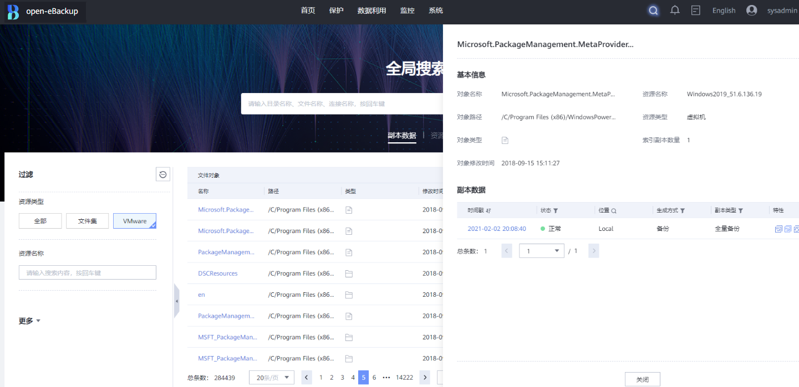

> **说明：** 
>当前支持VMware虚拟机副本、大数据HDFS副本、NAS海量小文件备份副本、主机文件级副本的内容级细粒度文件检索，其余应用支持检索受保护对象信息。

## 副本数据脱敏

为保障企业备份数据安全，open-eBackup结合华为OceanProtect 备份介质提供副本数据脱敏能力，支持对数据库备份副本数据脱敏；支持预置满足PCI-DSS、PII、HIPAA法规要求的脱敏策略；支持自定义脱敏策略等。本章节主要描述数据脱敏原理。

Live-Mount为企业开发测试数据准备极大的提升了使用效率，但副本中的数据与原生产中的数据完全一致，在特性的开发测试场景，用户数据属于隐私数据，为避免隐私数据的泄露，open-eBackup备份软件提供了数据库备份副本的数据脱敏能力，能将副本中的数据进行离线脱敏，在脱敏完成后再进行挂载测试，能保证副本中的隐私数据不泄露，用户数据安全可靠。

离线数据脱敏原理上先将待脱敏副本进行挂载，挂载完成后登陆目标数据库，并根据脱敏规则，将数据进行脱敏处理，处理完成后由用户进行脱敏结果检查，检查无误生产脱敏报告，此时目标副本中的持久化数据已经过脱敏化处理。

**图 1**  离线脱敏原理  

.png)

## 数据缩减功能

OceanProtect支持多种重删压缩功能，支持后端在线重删，源端重删、复制链路重删；重删压缩技术采用多层变长分片提升去重率，支持合并压缩、数据压紧、数据重排等技术提升压缩率。

SmartDedupe是重复数据删除技术，完全相同的数据块在存储时只保留一份数据块，其他数据直接引用同一份相同的数据块，以此减少数据的存储空间。

SmartCompression是数据压缩技术，数据在写入存储介质前先经过无损压缩算法进行压缩后把压缩后的数据块写入存储介质，以此减少数据的存储空间。

OceanProtect的SmartDedupe&SmartCompression特性采用先重删再压缩的设计。重删采用在线变长重删技术，压缩采用华为专有的高效压缩算法+压缩后数据字节级压紧存储技术。

## 端到端防勒索

open-eBackup与OceanProtect备份介质相结合，提供副本端到端防勒索解决方案，首先将备份数据通过加密通过传输到备份存储设备中，并对链路中的数据进行完整性校验和加密处理，备份存储接收到数据后经过加密处理后，存储到硬盘介质中，然后进行勒索病毒检测，检测完成的无感染安全副本，进行法规级WORM属性设置，可设置保护期，防止备份数据在存储过程中被篡改，最后还能通过加密链路复制到远端安全区进行存储，并通过AIR Gap控制复制物理链路的开合，将数据复制到隔离区，减少网络攻击和窃取风险。

**图 1**  端到端勒索病毒防护方案  
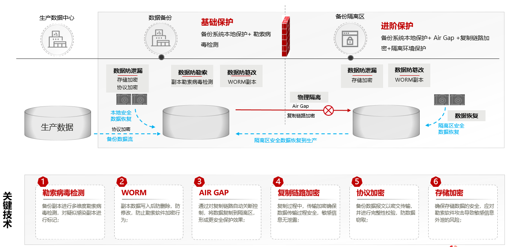

### 加密传输

open-eBackup与OceanProtect相结合，使用NFS协议将生产系统中的数据传输到备份设备中进行存储，NFS协议使用客户端IP进行鉴权，在复杂的网络环境中存在一定的安全风险，备份特性使用Kerberos 对备份链路进行认证和加密。Kerberos 是一种客户机/服务器体系结构，用于在网络上提供安全事务。该服务可提供功能强大的用户验证以及完整性和保密性。通过验证，可保证网络事务的发送者和接收者的身份真实，同时该服务还可以检验来回传递的数据的有效性（完整性），并在传输过程中对数据进行加密（保密性）。使用 Kerberos 服务，可以安全登录到其他计算机、执行命令、交换数据以及传输文件。开启数据加密传输功能后，安全性有所提高，但是性能有所下降，需根据实际使用场景进行选择。

NFS Kerberos依据RPCSEC\_GSS安全机制完成NFSv4 Kerberos认证。RPCSEC\_GSS安全机制包含三个部分，分别为Kerberos上下文创建，RPC数据交换和Kerberos上下文销毁。

### 加密存储

为保证备份数据的安全性。OceanProtect支持基于存储系统的阵列加密，启用控制器处理器的内置加密引擎，配置内置密管或者外置密管完成备份数据的静态加密。

-   内置密管：存储系统自带的密钥管理应用，采用NIST SP 800-57最佳实践设计，对密钥进行生命周期管理。内置密管具有易部署、易配置、易管理的特点；如果数据中心的密钥管理仅用于存储系统，且无需通过密码模块安全标准FIPS 140-2认证和中国国密认证，建议选择内置密管。
-   外置密管：采用KMIP+TLS的标准协议，满足FIPS 140-2认证/中国国密认证的密管。如果数据中心多场景需要密钥集中管理，或者需要通过密码模块安全标准FIPS 140-2的认证，建议选择外置密管。

备份数据加密利用控制器处理器的内置加密引擎进行加解密，该独立内置加密引擎集成ARM硬件的加密算法的卸载能力。执行加解密算法时，不需要软件参与，进行硬件卸载。当在备份存储层进行数据加密时，加密子系统按照硬盘粒度生成安全密钥DEK，并且向密管申请密钥（AK），然后使用AK对DEK进行加密保存，业务IO下发后加解密卸载到内置加密引擎执行。加密引擎支持的加密算法为AES-256-XTS和SM4-128-XTS\(限中国大陆地区\)，密管使用算法需要和加密引擎匹配。

**内置密管**使用存储系统自带的密钥管理应用，采用NIST SP 800-57最佳实践设计，对密钥进行生命周期管理，包括密钥分层保护、密钥备份、密钥恢复、密钥产生、密钥更新、密钥销毁。内置密管具有易部署、易配置、易管理的特点；如果数据中心的密钥管理仅用于备份系统，且无需通过密码模块安全标准FIPS 140-2的认证，建议选择内置密管。

> **说明：** 
>内置密管支持国际AES算法，不支持中国国密SM4算法。
>内置密管安全能力依赖存储系统，存储系统的安全能力构建参考安全技术白皮书。

**外置密管**把加密密钥保存在存储系统外部，支持密钥产生、更新、销毁、备份、恢复等操作。它与存储控制器之间采用KMIP+TLS进行密钥传输，保证密钥的安全性，同时外置密管支持双机模式，两个外置密管之间会进行密钥的实时同步，保证密钥可靠性。

> **说明：** 
>外置密管支持国际AES算法/中国国密SM4算法（具体密管型号支持算法请参考《OceanProtect专用备份存储系统硬盘加密用户指南》），满足FIPS 140-2认证/中国国密认证。选择外置密管时，请与MO联系确认外置密管的可供应性。

### WORM

为保证备份数据存储可靠性，以防数据在存储过程中被无意或恶意篡改，OceanProtect支持将备份副本进行WORM锁定，实现一写多读功能，即备份副本写入完成后，可通过设置使其进入保护状态，在该状态下文件只能被读取，无法被删除、修改或重命名。

在实现时，内置备份软件在存储层文件系统上新增文件相关的一些属性，这些属性控制着对文件的访问和修改的限制；每个文件会各自保存自己的WORM属性，以保证备份数据不被篡改。

WORM副本在设置的保留周期内，不允许修改和删除，同时WORM功能还能与勒索软件检测功能结合，将副本进行勒索病毒扫描后，仅对未感染副本进行WORM属性设置，保证存储系统中的备份数据整洁。

> **须知：** 
>华为OceanProtect 数据保护设备法规遵从\(Compliance\)模式遵照SEC Rule 17a-4\(f\)法规施行数据保护机制，但未进行相关第三方认证。

### 勒索软件检测

勒索病毒，是一种新型电脑病毒，主要以邮件、程序木马、网页挂马的形式进行传播。该病毒性质恶劣、危害极大，一旦感染将给用户带来无法估量的损失。这种病毒利用各种加密算法对文件进行加密，被感染者一般无法解密，必须拿到解密的私钥才有可能破解。

传统厂商在备份时，仅仅对数据进行搬迁，不考虑副本内容安全性，当生产环境被勒索病毒感染后，对应的备份副本也会在备份时将病毒文件进行拷贝，导致备份的副本也是被感染过的副本，客户无法感知到副本当前是否可用，是否已被感染。

OceanProtect 备份介质内置智能勒索病毒扫描能力，在每次备份完成后，立即对副本内容进行特征检查和行为分析，使用基线特征模型对备份副本进行基础检查，当发现有疑似感染特征时，再启动AI机器学习检查模型进行深度分析。确定当某个副本有高度感染行为时，对该副本进行标记并告警，以便提醒用户进行清除和处理。

**图 1**  智能勒索病毒检测  
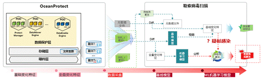

防勒索系统主要使用特征对副本内容进行检测，先使用应用统计方法、数据可视化等，对基础变化特征进行统计，发掘正常文件系统变化与了所感染变化特征之间的差异，通过基线模型的建立，筛选过滤出有可疑行为的文件系统变化，并进行进一步检测判断。

> **说明：** 
>当前版本支持VMware、文件备份、NAS备份副本勒索病毒检测。

# 缩略语

<table><thead align="left"><tr id="zh-cn_topic_0000001302926093_row43923123"><th class="cellrowborder" valign="top" width="19.19191919191919%" id="mcps1.1.4.1.1">
英文缩写

</th>
<th class="cellrowborder" valign="top" width="47.474747474747474%" id="mcps1.1.4.1.2">
英文全称

</th>
<th class="cellrowborder" valign="top" width="33.33333333333333%" id="mcps1.1.4.1.3">
中文全称

</th>
</tr>
</thead>
<tbody><tr id="zh-cn_topic_0000001302926093_row1061333103019"><td class="cellrowborder" valign="top" width="19.19191919191919%" headers="mcps1.1.4.1.1 ">
FRU

</td>
<td class="cellrowborder" valign="top" width="47.474747474747474%" headers="mcps1.1.4.1.2 ">
Field Replaceable Unit

</td>
<td class="cellrowborder" valign="top" width="33.33333333333333%" headers="mcps1.1.4.1.3 ">
现场可更换单元

</td>
</tr>
<tr id="zh-cn_topic_0000001302926093_row17503500"><td class="cellrowborder" valign="top" width="19.19191919191919%" headers="mcps1.1.4.1.1 ">
FlashLink&reg;

</td>
<td class="cellrowborder" valign="top" width="47.474747474747474%" headers="mcps1.1.4.1.2 ">
FlashLink&reg;

</td>
<td class="cellrowborder" valign="top" width="33.33333333333333%" headers="mcps1.1.4.1.3 ">
盘控配合技术

</td>
</tr>
<tr id="zh-cn_topic_0000001302926093_row63785121"><td class="cellrowborder" valign="top" width="19.19191919191919%" headers="mcps1.1.4.1.1 ">
CK

</td>
<td class="cellrowborder" valign="top" width="47.474747474747474%" headers="mcps1.1.4.1.2 ">
Chunk

</td>
<td class="cellrowborder" valign="top" width="33.33333333333333%" headers="mcps1.1.4.1.3 ">
数据块

</td>
</tr>
<tr id="zh-cn_topic_0000001302926093_row59592471"><td class="cellrowborder" valign="top" width="19.19191919191919%" headers="mcps1.1.4.1.1 ">
CKG

</td>
<td class="cellrowborder" valign="top" width="47.474747474747474%" headers="mcps1.1.4.1.2 ">
Chunk Group

</td>
<td class="cellrowborder" valign="top" width="33.33333333333333%" headers="mcps1.1.4.1.3 ">
数据块组

</td>
</tr>
<tr id="zh-cn_topic_0000001302926093_row18138873"><td class="cellrowborder" valign="top" width="19.19191919191919%" headers="mcps1.1.4.1.1 ">
DIF

</td>
<td class="cellrowborder" valign="top" width="47.474747474747474%" headers="mcps1.1.4.1.2 ">
Data Integrity Field

</td>
<td class="cellrowborder" valign="top" width="33.33333333333333%" headers="mcps1.1.4.1.3 ">
数据完整性字段

</td>
</tr>
<tr id="zh-cn_topic_0000001302926093_row8665826175115"><td class="cellrowborder" valign="top" width="19.19191919191919%" headers="mcps1.1.4.1.1 ">
RDMA

</td>
<td class="cellrowborder" valign="top" width="47.474747474747474%" headers="mcps1.1.4.1.2 ">
Remote Direct Memory Access

</td>
<td class="cellrowborder" valign="top" width="33.33333333333333%" headers="mcps1.1.4.1.3 ">
远程直接数据存取

</td>
</tr>
<tr id="zh-cn_topic_0000001302926093_row3531486"><td class="cellrowborder" valign="top" width="19.19191919191919%" headers="mcps1.1.4.1.1 ">
FC

</td>
<td class="cellrowborder" valign="top" width="47.474747474747474%" headers="mcps1.1.4.1.2 ">
Fiber Channel

</td>
<td class="cellrowborder" valign="top" width="33.33333333333333%" headers="mcps1.1.4.1.3 ">
光纤通道

</td>
</tr>
<tr id="zh-cn_topic_0000001302926093_row16263103362710"><td class="cellrowborder" valign="top" width="19.19191919191919%" headers="mcps1.1.4.1.1 ">
FS

</td>
<td class="cellrowborder" valign="top" width="47.474747474747474%" headers="mcps1.1.4.1.2 ">
File System

</td>
<td class="cellrowborder" valign="top" width="33.33333333333333%" headers="mcps1.1.4.1.3 ">
文件系统

</td>
</tr>
<tr id="zh-cn_topic_0000001302926093_row22845731"><td class="cellrowborder" valign="top" width="19.19191919191919%" headers="mcps1.1.4.1.1 ">
FTL

</td>
<td class="cellrowborder" valign="top" width="47.474747474747474%" headers="mcps1.1.4.1.2 ">
FLASH Translation Layer

</td>
<td class="cellrowborder" valign="top" width="33.33333333333333%" headers="mcps1.1.4.1.3 ">
FLASH转换层

</td>
</tr>
<tr id="zh-cn_topic_0000001302926093_row14123440"><td class="cellrowborder" valign="top" width="19.19191919191919%" headers="mcps1.1.4.1.1 ">
GC

</td>
<td class="cellrowborder" valign="top" width="47.474747474747474%" headers="mcps1.1.4.1.2 ">
Garbage Collection

</td>
<td class="cellrowborder" valign="top" width="33.33333333333333%" headers="mcps1.1.4.1.3 ">
垃圾回收

</td>
</tr>
<tr id="zh-cn_topic_0000001302926093_row62121397"><td class="cellrowborder" valign="top" width="19.19191919191919%" headers="mcps1.1.4.1.1 ">
SSD

</td>
<td class="cellrowborder" valign="top" width="47.474747474747474%" headers="mcps1.1.4.1.2 ">
Solid State Disk

</td>
<td class="cellrowborder" valign="top" width="33.33333333333333%" headers="mcps1.1.4.1.3 ">
固态硬盘

</td>
</tr>
<tr id="zh-cn_topic_0000001302926093_row20083047"><td class="cellrowborder" valign="top" width="19.19191919191919%" headers="mcps1.1.4.1.1 ">
LUN

</td>
<td class="cellrowborder" valign="top" width="47.474747474747474%" headers="mcps1.1.4.1.2 ">
Logical Unit Number

</td>
<td class="cellrowborder" valign="top" width="33.33333333333333%" headers="mcps1.1.4.1.3 ">
逻辑单元号

</td>
</tr>
<tr id="zh-cn_topic_0000001302926093_row53901255"><td class="cellrowborder" valign="top" width="19.19191919191919%" headers="mcps1.1.4.1.1 ">
OLAP

</td>
<td class="cellrowborder" valign="top" width="47.474747474747474%" headers="mcps1.1.4.1.2 ">
On-Line Analytical Processing

</td>
<td class="cellrowborder" valign="top" width="33.33333333333333%" headers="mcps1.1.4.1.3 ">
联机分析处理系统

</td>
</tr>
<tr id="zh-cn_topic_0000001302926093_row4864091"><td class="cellrowborder" valign="top" width="19.19191919191919%" headers="mcps1.1.4.1.1 ">
OLTP

</td>
<td class="cellrowborder" valign="top" width="47.474747474747474%" headers="mcps1.1.4.1.2 ">
On-Line Transaction Processing

</td>
<td class="cellrowborder" valign="top" width="33.33333333333333%" headers="mcps1.1.4.1.3 ">
联机事务处理系统

</td>
</tr>
<tr id="zh-cn_topic_0000001302926093_row34019058"><td class="cellrowborder" valign="top" width="19.19191919191919%" headers="mcps1.1.4.1.1 ">
OP

</td>
<td class="cellrowborder" valign="top" width="47.474747474747474%" headers="mcps1.1.4.1.2 ">
Over-Provisioning

</td>
<td class="cellrowborder" valign="top" width="33.33333333333333%" headers="mcps1.1.4.1.3 ">
预留空间

</td>
</tr>
<tr id="zh-cn_topic_0000001302926093_row16856419"><td class="cellrowborder" valign="top" width="19.19191919191919%" headers="mcps1.1.4.1.1 ">
RAID

</td>
<td class="cellrowborder" valign="top" width="47.474747474747474%" headers="mcps1.1.4.1.2 ">
Redundant Array of Independent Disks

</td>
<td class="cellrowborder" valign="top" width="33.33333333333333%" headers="mcps1.1.4.1.3 ">
独立硬盘冗余阵列

</td>
</tr>
<tr id="zh-cn_topic_0000001302926093_row14835533"><td class="cellrowborder" valign="top" width="19.19191919191919%" headers="mcps1.1.4.1.1 ">
RAID-TP

</td>
<td class="cellrowborder" valign="top" width="47.474747474747474%" headers="mcps1.1.4.1.2 ">
Redundant Array of Independent Disks-Triple Parity

</td>
<td class="cellrowborder" valign="top" width="33.33333333333333%" headers="mcps1.1.4.1.3 ">
独立硬盘冗余阵列-3盘冗余

</td>
</tr>
<tr id="zh-cn_topic_0000001302926093_row4765656"><td class="cellrowborder" valign="top" width="19.19191919191919%" headers="mcps1.1.4.1.1 ">
SAS

</td>
<td class="cellrowborder" valign="top" width="47.474747474747474%" headers="mcps1.1.4.1.2 ">
Serial Attached SCSI

</td>
<td class="cellrowborder" valign="top" width="33.33333333333333%" headers="mcps1.1.4.1.3 ">
串行SCSI

</td>
</tr>
<tr id="zh-cn_topic_0000001302926093_row56760689"><td class="cellrowborder" valign="top" width="19.19191919191919%" headers="mcps1.1.4.1.1 ">
SCSI

</td>
<td class="cellrowborder" valign="top" width="47.474747474747474%" headers="mcps1.1.4.1.2 ">
Small Computer System Interface

</td>
<td class="cellrowborder" valign="top" width="33.33333333333333%" headers="mcps1.1.4.1.3 ">
小型计算机系统接口

</td>
</tr>
<tr id="zh-cn_topic_0000001302926093_row4036497"><td class="cellrowborder" valign="top" width="19.19191919191919%" headers="mcps1.1.4.1.1 ">
SSD

</td>
<td class="cellrowborder" valign="top" width="47.474747474747474%" headers="mcps1.1.4.1.2 ">
Solid State Disk

</td>
<td class="cellrowborder" valign="top" width="33.33333333333333%" headers="mcps1.1.4.1.3 ">
固态硬盘

</td>
</tr>
<tr id="zh-cn_topic_0000001302926093_row25760373"><td class="cellrowborder" valign="top" width="19.19191919191919%" headers="mcps1.1.4.1.1 ">
T10 PI

</td>
<td class="cellrowborder" valign="top" width="47.474747474747474%" headers="mcps1.1.4.1.2 ">
T10 Protection Information

</td>
<td class="cellrowborder" valign="top" width="33.33333333333333%" headers="mcps1.1.4.1.3 ">
T10数据保护信息

</td>
</tr>
<tr id="zh-cn_topic_0000001302926093_row609510"><td class="cellrowborder" valign="top" width="19.19191919191919%" headers="mcps1.1.4.1.1 ">
VDI

</td>
<td class="cellrowborder" valign="top" width="47.474747474747474%" headers="mcps1.1.4.1.2 ">
Virtual Desktop Infrastructure

</td>
<td class="cellrowborder" valign="top" width="33.33333333333333%" headers="mcps1.1.4.1.3 ">
虚拟桌面架构

</td>
</tr>
<tr id="zh-cn_topic_0000001302926093_row61830130"><td class="cellrowborder" valign="top" width="19.19191919191919%" headers="mcps1.1.4.1.1 ">
VSI

</td>
<td class="cellrowborder" valign="top" width="47.474747474747474%" headers="mcps1.1.4.1.2 ">
Virtual Server Infrastructure

</td>
<td class="cellrowborder" valign="top" width="33.33333333333333%" headers="mcps1.1.4.1.3 ">
服务器虚拟化架构

</td>
</tr>
<tr id="zh-cn_topic_0000001302926093_row14649520"><td class="cellrowborder" valign="top" width="19.19191919191919%" headers="mcps1.1.4.1.1 ">
WA

</td>
<td class="cellrowborder" valign="top" width="47.474747474747474%" headers="mcps1.1.4.1.2 ">
Write amplification

</td>
<td class="cellrowborder" valign="top" width="33.33333333333333%" headers="mcps1.1.4.1.3 ">
写入放大

</td>
</tr>
<tr id="zh-cn_topic_0000001302926093_row40344576"><td class="cellrowborder" valign="top" width="19.19191919191919%" headers="mcps1.1.4.1.1 ">
Wear Leveling

</td>
<td class="cellrowborder" valign="top" width="47.474747474747474%" headers="mcps1.1.4.1.2 ">
Wear Leveling

</td>
<td class="cellrowborder" valign="top" width="33.33333333333333%" headers="mcps1.1.4.1.3 ">
磨损均衡

</td>
</tr>
<tr id="zh-cn_topic_0000001302926093_row15748167"><td class="cellrowborder" valign="top" width="19.19191919191919%" headers="mcps1.1.4.1.1 ">
TCO

</td>
<td class="cellrowborder" valign="top" width="47.474747474747474%" headers="mcps1.1.4.1.2 ">
Total Cost of Ownership

</td>
<td class="cellrowborder" valign="top" width="33.33333333333333%" headers="mcps1.1.4.1.3 ">
总体拥有成本

</td>
</tr>
<tr id="zh-cn_topic_0000001302926093_row7566645"><td class="cellrowborder" valign="top" width="19.19191919191919%" headers="mcps1.1.4.1.1 ">
DC

</td>
<td class="cellrowborder" valign="top" width="47.474747474747474%" headers="mcps1.1.4.1.2 ">
Data Center

</td>
<td class="cellrowborder" valign="top" width="33.33333333333333%" headers="mcps1.1.4.1.3 ">
数据中心

</td>
</tr>
<tr id="zh-cn_topic_0000001302926093_row1535510965516"><td class="cellrowborder" valign="top" width="19.19191919191919%" headers="mcps1.1.4.1.1 ">
DCL

</td>
<td class="cellrowborder" valign="top" width="47.474747474747474%" headers="mcps1.1.4.1.2 ">
Data Change Log

</td>
<td class="cellrowborder" valign="top" width="33.33333333333333%" headers="mcps1.1.4.1.3 ">
数据变更日志

</td>
</tr>
<tr id="zh-cn_topic_0000001302926093_row1228814517019"><td class="cellrowborder" valign="top" width="19.19191919191919%" headers="mcps1.1.4.1.1 ">
TP

</td>
<td class="cellrowborder" valign="top" width="47.474747474747474%" headers="mcps1.1.4.1.2 ">
Time Point

</td>
<td class="cellrowborder" valign="top" width="33.33333333333333%" headers="mcps1.1.4.1.3 ">
时间点

</td>
</tr>
<tr id="zh-cn_topic_0000001302926093_row174217351204"><td class="cellrowborder" valign="top" width="19.19191919191919%" headers="mcps1.1.4.1.1 ">
GUI

</td>
<td class="cellrowborder" valign="top" width="47.474747474747474%" headers="mcps1.1.4.1.2 ">
Graphical User Interface

</td>
<td class="cellrowborder" valign="top" width="33.33333333333333%" headers="mcps1.1.4.1.3 ">
图形用户界面

</td>
</tr>
<tr id="zh-cn_topic_0000001302926093_row619244614390"><td class="cellrowborder" valign="top" width="19.19191919191919%" headers="mcps1.1.4.1.1 ">
CLI

</td>
<td class="cellrowborder" valign="top" width="47.474747474747474%" headers="mcps1.1.4.1.2 ">
Command Line Interface

</td>
<td class="cellrowborder" valign="top" width="33.33333333333333%" headers="mcps1.1.4.1.3 ">
命令行界面

</td>
</tr>
<tr id="zh-cn_topic_0000001302926093_row1920383445617"><td class="cellrowborder" valign="top" width="19.19191919191919%" headers="mcps1.1.4.1.1 ">
FIM

</td>
<td class="cellrowborder" valign="top" width="47.474747474747474%" headers="mcps1.1.4.1.2 ">
front-end interconnect I/O module

</td>
<td class="cellrowborder" valign="top" width="33.33333333333333%" headers="mcps1.1.4.1.3 ">
前端共享卡

</td>
</tr>
<tr id="zh-cn_topic_0000001302926093_row19674133818016"><td class="cellrowborder" valign="top" width="19.19191919191919%" headers="mcps1.1.4.1.1 ">
SCM

</td>
<td class="cellrowborder" valign="top" width="47.474747474747474%" headers="mcps1.1.4.1.2 ">
storage class memory

</td>
<td class="cellrowborder" valign="top" width="33.33333333333333%" headers="mcps1.1.4.1.3 ">
存储级内存

</td>
</tr>
<tr id="zh-cn_topic_0000001302926093_row17320135765219"><td class="cellrowborder" valign="top" width="19.19191919191919%" headers="mcps1.1.4.1.1 ">
FRU

</td>
<td class="cellrowborder" valign="top" width="47.474747474747474%" headers="mcps1.1.4.1.2 ">
field replaceable unit

</td>
<td class="cellrowborder" valign="top" width="33.33333333333333%" headers="mcps1.1.4.1.3 ">
现场可更换单元

</td>
</tr>
<tr id="zh-cn_topic_0000001302926093_row335217718264"><td class="cellrowborder" valign="top" width="19.19191919191919%" headers="mcps1.1.4.1.1 ">
PI

</td>
<td class="cellrowborder" valign="top" width="47.474747474747474%" headers="mcps1.1.4.1.2 ">
Protection Information

</td>
<td class="cellrowborder" valign="top" width="33.33333333333333%" headers="mcps1.1.4.1.3 ">
保护信息

</td>
</tr>
<tr id="zh-cn_topic_0000001302926093_row17661163494511"><td class="cellrowborder" valign="top" width="19.19191919191919%" headers="mcps1.1.4.1.1 ">
SFP

</td>
<td class="cellrowborder" valign="top" width="47.474747474747474%" headers="mcps1.1.4.1.2 ">
Similar FingerPrint

</td>
<td class="cellrowborder" valign="top" width="33.33333333333333%" headers="mcps1.1.4.1.3 ">
相似指纹

</td>
</tr>
<tr id="zh-cn_topic_0000001302926093_row1486512587412"><td class="cellrowborder" valign="top" width="19.19191919191919%" headers="mcps1.1.4.1.1 ">
DTOE

</td>
<td class="cellrowborder" valign="top" width="47.474747474747474%" headers="mcps1.1.4.1.2 ">
Direct TCP/IP Offloading Engine

</td>
<td class="cellrowborder" valign="top" width="33.33333333333333%" headers="mcps1.1.4.1.3 ">
TOE直通技术

</td>
</tr>
<tr id="zh-cn_topic_0000001302926093_row1190143673014"><td class="cellrowborder" valign="top" width="19.19191919191919%" headers="mcps1.1.4.1.1 ">
NUMA

</td>
<td class="cellrowborder" valign="top" width="47.474747474747474%" headers="mcps1.1.4.1.2 ">
non-uniform memory access

</td>
<td class="cellrowborder" valign="top" width="33.33333333333333%" headers="mcps1.1.4.1.3 ">
非一致性内存访问

</td>
</tr>
<tr id="zh-cn_topic_0000001302926093_row05931348113618"><td class="cellrowborder" valign="top" width="19.19191919191919%" headers="mcps1.1.4.1.1 ">
ROW

</td>
<td class="cellrowborder" valign="top" width="47.474747474747474%" headers="mcps1.1.4.1.2 ">
redirect-on-write

</td>
<td class="cellrowborder" valign="top" width="33.33333333333333%" headers="mcps1.1.4.1.3 ">
写时重定向

</td>
</tr>
<tr id="zh-cn_topic_0000001302926093_row3830131015618"><td class="cellrowborder" valign="top" width="19.19191919191919%" headers="mcps1.1.4.1.1 ">
PID

</td>
<td class="cellrowborder" valign="top" width="47.474747474747474%" headers="mcps1.1.4.1.2 ">
Proportional Integral Derivative

</td>
<td class="cellrowborder" valign="top" width="33.33333333333333%" headers="mcps1.1.4.1.3 ">
比例微积分算法

</td>
</tr>
<tr id="zh-cn_topic_0000001302926093_row3724121122718"><td class="cellrowborder" valign="top" width="19.19191919191919%" headers="mcps1.1.4.1.1 ">
SMP

</td>
<td class="cellrowborder" valign="top" width="47.474747474747474%" headers="mcps1.1.4.1.2 ">
symmetrical multiprocessor system

</td>
<td class="cellrowborder" valign="top" width="33.33333333333333%" headers="mcps1.1.4.1.3 ">
对称多处理器系统

</td>
</tr>
</tbody>
</table>

