# 版权声明

Copyright © 2024 Huawei Technologies Co.,Ltd.

This work is licensed under the Creative Commons Attribution-ShareAlike 4.0 International License. You are free to share and adapt the material as long as you attribute the author and distribute your contributions under the same license.

To view a copy of this license, visit http://creativecommons.org/licenses/by-sa/4.0/

**概述**

本文档详细的描述了open-eBackup备份软件的功能及原理介绍。

**读者对象**

本文档主要适用于升级的操作人员。操作人员必须具备以下经验和技能：

-   熟悉当前网络的组网和相关网元的版本信息。
-   有该设备维护经验，熟悉设备的操作维护方式。

**符号约定**

在本文中可能出现下列标志，它们所代表的含义如下。

<table><thead align="left"><tr id="row1530720816410"><th class="cellrowborder" valign="top" width="20.580000000000002%" id="mcps1.1.3.1.1">
<strong id="b2136615816410">符号</strong>

</th>
<th class="cellrowborder" valign="top" width="79.42%" id="mcps1.1.3.1.2">
<strong id="b5941558116410">说明</strong>

</th>
</tr>
</thead>
<tbody><tr id="row1372280416410"><td class="cellrowborder" valign="top" width="20.580000000000002%" headers="mcps1.1.3.1.1 ">

</td>
<td class="cellrowborder" valign="top" width="79.42%" headers="mcps1.1.3.1.2 ">
表示如不避免则将会导致死亡或严重伤害的具有高等级风险的危害。

</td>
</tr>
<tr id="row466863216410"><td class="cellrowborder" valign="top" width="20.580000000000002%" headers="mcps1.1.3.1.1 ">

</td>
<td class="cellrowborder" valign="top" width="79.42%" headers="mcps1.1.3.1.2 ">
表示如不避免则可能导致死亡或严重伤害的具有中等级风险的危害。

</td>
</tr>
<tr id="row123863216410"><td class="cellrowborder" valign="top" width="20.580000000000002%" headers="mcps1.1.3.1.1 ">

</td>
<td class="cellrowborder" valign="top" width="79.42%" headers="mcps1.1.3.1.2 ">
表示如不避免则可能导致轻微或中度伤害的具有低等级风险的危害。

</td>
</tr>
<tr id="row5786682116410"><td class="cellrowborder" valign="top" width="20.580000000000002%" headers="mcps1.1.3.1.1 ">

</td>
<td class="cellrowborder" valign="top" width="79.42%" headers="mcps1.1.3.1.2 ">
用于传递设备或环境安全警示信息。如不避免则可能会导致设备损坏、数据丢失、设备性能降低或其它不可预知的结果。

“须知”不涉及人身伤害。

</td>
</tr>
<tr id="row2856923116410"><td class="cellrowborder" valign="top" width="20.580000000000002%" headers="mcps1.1.3.1.1 ">

</td>
<td class="cellrowborder" valign="top" width="79.42%" headers="mcps1.1.3.1.2 ">
对正文中重点信息的补充说明。

“说明”不是安全警示信息，不涉及人身、设备及环境伤害信息。

</td>
</tr>
</tbody>
</table>

# 摘要

open-eBackup是国内首个开源的兼容多应用生态的备份软件，不仅能够对接数据库、虚拟化、文件等多场景，并且具有安全、重删、压缩等功能。希望能够通过大赛，吸引全球备份软件用户、伙伴、开发者共同加入，共同探索数据备份技术发展趋势，制定相应的软件解决方案。

在当今的数字化时代，IT建设面临巨大的挑战，可以从灾备中心和大数据中心两个角度进行挑战分析：

-   灾备中心
    -   备份数据仅用来做数据恢复，灾备建设投入产出比低。
    -   数据保护效率低下。
    -   数据恢复验证难

-   大数据中心
    -   海量数据采集时间长，备份时间长，备份失败的影响增加。
    -   数据近线保存时间变长，备份数据量激增，管理难度增加。
    -   数据恢复时间长，业务中断的恢复时间变长。

open-eBackup具有备份快、恢复快、用量省、高可靠的特点。这款恢复速度最快的备份系统，可帮助用户实现高效备份恢复，大幅节省TCO，广泛适用于政府、金融、运营商、医疗、制造等行业。

本文从产品定位、硬件架构、软件架构、特性方面详细介绍了open-eBackup的关键技术，以及为客户带来的独特价值。

# 产品简介

## 支持型号及规格

<table><thead align="left"><tr id="row34945187139"><th class="cellrowborder" valign="top" width="52%" id="mcps1.1.3.1.1">
规格名称

</th>
<th class="cellrowborder" valign="top" width="48%" id="mcps1.1.3.1.2">
open-eBackup

</th>
</tr>
</thead>
<tbody><tr id="row94941818131315"><td class="cellrowborder" valign="top" width="52%" headers="mcps1.1.3.1.1 ">
CPU型号

</td>
<td class="cellrowborder" valign="top" width="48%" headers="mcps1.1.3.1.2 ">
ARM

</td>
</tr>
<tr id="row13858717111310"><td class="cellrowborder" valign="top" width="52%" headers="mcps1.1.3.1.1 ">
CPU个数

</td>
<td class="cellrowborder" valign="top" width="48%" headers="mcps1.1.3.1.2 ">
16

</td>
</tr>
<tr id="row2049413189130"><td class="cellrowborder" valign="top" width="52%" headers="mcps1.1.3.1.1 ">
内存/节点

</td>
<td class="cellrowborder" valign="top" width="48%" headers="mcps1.1.3.1.2 ">
64G

</td>
</tr>
<tr id="row154961118201312"><td class="cellrowborder" valign="top" width="52%" headers="mcps1.1.3.1.1 ">
最大备份带宽/节点

</td>
<td class="cellrowborder" valign="top" width="48%" headers="mcps1.1.3.1.2 ">
12TB/h

</td>
</tr>
<tr id="row161295911144"><td class="cellrowborder" valign="top" width="52%" headers="mcps1.1.3.1.1 ">
最大恢复带宽/节点

</td>
<td class="cellrowborder" valign="top" width="48%" headers="mcps1.1.3.1.2 ">
7TB/h

</td>
</tr>
<tr id="row1496181813136"><td class="cellrowborder" valign="top" width="52%" headers="mcps1.1.3.1.1 ">
支持的数据备份特性

</td>
<td class="cellrowborder" valign="top" width="48%" headers="mcps1.1.3.1.2 ">
所有特性

</td>
</tr>
</tbody>
</table>

## 特性概述

随着 IT 的不断发展，数据资产已经成为企业生存的根本，企业的生产、经营、战略，都离不开数据的支撑。数据保护，也渐渐的从单纯的保护数据，演变成备份数据的再利用，让备份数据发挥更多的价值，企业备份面临如下挑战。

-   生产环境的业务复杂、应用多样，备份数据量大；
-   恢复时间长，业务面临长时间中断；
-   备份数据难以管理，备份数据内容黑盒，难以精确查找恢复内容；
-   备份系统投资回报率低，难以利用备份数据支撑其他业务，以提高系统的利用率。
-   备份数据存储容量难以预测，备份系统本身可靠性不高，无法预知未来风险。

一系列的需求发展和关联技术的变革对客户IT基础设施的构建和保护提出了更高的要求，要构建一个高可靠的现代化IT基础设施，选择一个高效、可靠、备份数据再利用能力广泛的数据保护系统是最为关键的环节。

open-eBackup秉承“极致保护+高效利用”的设计，通过自研备份软件的核心科技能力，实现原生备份能力，提供稳定高性能备份和极致可靠服务，满足现代化智能IT系统对备份系统的诉求。同时，通过对备份数据实现即时挂载、业务回迁、全局索引、数据脱敏，通过备份数据的再利用能力，全面提高企业对于备份系统的投资回报。

open-eBackup是面向金融、运营商、政府、安平等行业的关键应用业务打造的新一代高性能数据保护产品能力，产品集备份软件、备份服务器、备份存储、备份数据管理、数据安全能力于一体，为客户提供高效、灵活、安全的数据保护能力：

-   **备份能力生态兼容**
    -   主机备份：支持物理机/虚拟机文件集备份；
    -   NAS备份：支持兼容各厂商NAS文件备份；
    -   数据库备份：支持Oracle、SQL Server、MySQL、Mariodb、DB2、TDSQL、OceanBase、TiDB、GoldenDB、MongoDB、GBase、SAP HANA、GaussDB T、OpenGauss、Dameng、PostgreSQL、云和恩墨（Opengauss）、海量数据（Opengauss）等多种数据库；
    -   大数据备份：支持Cloudra CDH/CDP大数据平台、开源Hadoop HDFS以及星环大数据、华为FusionInsight、MapReduce Sevice等大数据平台中的HDFS、HBase、Hive、ElasticSearch、Redis、ClickHouse等组件；
    -   虚拟化/云/容器备份：支持VMware、FusionCompute、HuaweiCloud Stack、kubernetes等虚拟化和云平台数据备份；
    -   华为数据仓库备份：支持华为数据仓库服务DWS备份；

-   **多数据流并发，备份大带宽**
    -   并发传输：支持双控并行传输备份数据，根据应用和节点负载选择备份传输网络通道，最大程度发挥网络传输能力，单节点备份带宽可达12TB/h。
    -   线性扩展：支持扩容，最大支持扩展到32节点。

-   **空间动态扩容，存储大容量**
    -   超大容量， 单节点最大可用容量1PB。
    -   在线扩容硬盘、硬盘框，扩容后存储容量自动纳入备份存储空间，满足海量备份数据存储需求。
    -   节点线性扩容，支持32节点集群，性能/容量线性扩展。

-   **副本任意挂载，使用超灵活**
    -   备份副本支持实时挂载，可秒级恢复业务并接管生产，保障业务系统不中断，挂载业务运行过程中可回迁至生产，业务不中断，数据不丢失。
    -   副本挂载策略化，后台自动更新挂载副本，减少人工操作，极大提高数据分析、自动化开发测试效率。
    -   全闪存SSD硬盘：IOPS可达100,000 IOPS@1ms，保障挂载副本数据高效读写。

-   **全局数据检索，查找超快速**
    -   全局数据检索：全局受保护资源、副本数据内容文件级检索，基于副本数据内容的检索，细粒度文件的恢复，让操作更简单，恢复数据更精确。
    -   超大索引容量，支持存储百亿级数据，秒级检索，极大提升恢复效率。

-   **数据库脱敏，勒索软件检测，数据更安全**
    -   数据脱敏：基于生产数据库、备份副本的数据脱敏，能将副本数据用于测试、审计时脱除敏感数据，保障数据安全。
    -   灵活的脱敏策略：内置丰富的脱敏策略模板，可按需替换副本数据内容，满足多种安全法规要求。
    -   勒索病毒检测：基于机器学习的多副本勒索软件特征扫描，疑似感染副本标记，确保副本使用更安全。
    -   WORM：法规级遵从，防止副本内容篡改，确保副本存储更安全。
    -   端到端加密：数据传输加密、存储加密。

open-eBackup能够满足数据库、虚拟机、物理服务器、文件、大数据等企业级应用的关键保护需求，一套设备保护多种用户生产系统，容量、性能可线性扩展，助力金融、运营商、医疗、制造等行业提升数据保护效率，节省数据保护投资，简化管理流程。

## 网络规划

open-eBackup每节点至少需要配置1个管理IP，至少需要1个备份网络平面IP，用于内部组件容器IP分配，备份过程中主要传输备份/恢复信令，本章节主要介绍备份一体机网络平面划分及几种典型场景下的网络规划。

### 网络平面划分

**图 1**  open-eBackup网络平面划分  

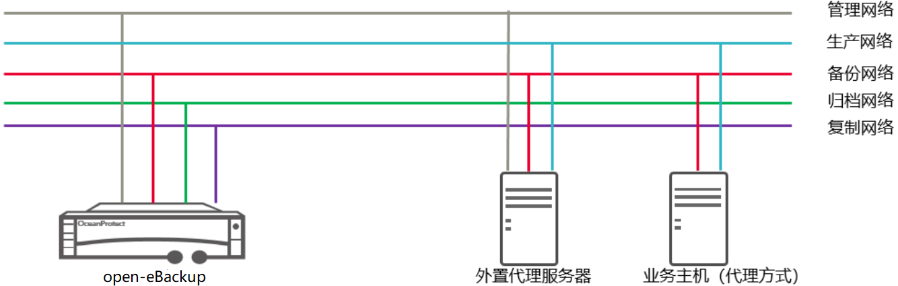

open-eBackup将网络按逻辑划分为管理网络，生产网络，备份网络，归档网络，复制网络。

管理网络：主要用于设备管理，业务配置等少量管理数据传输的管理网络。

生产网络：指客户现网中实际传输生产数据的业务网络。

备份网络：指客户环境中专门为备份数据传输建立的独立网络。

归档网络：指归档存储介质所在的数据传输网络。

复制网络：指多中心之间，专门为中心之间的数据传输建设的专网或专线。

图中设备描述：

open-eBackup：

外置代理服务器：open-eBackup在VMware SAN模式备份、HCS（高性能诉求场景配置，或需要支持后端存储为Pacific的增量备份时\)、大数据、DWS、GaussDB（gauss for opengauss）场景下，整体方案中需要额外配置的代理服务器

业务主机：数据库、文件备份等场景下，需要将备份代理软件包安装在业务主机上，这里指待保护数据库、文件所在主机。

OceanProtect网络接入：

<table><thead align="left"><tr id="zh-cn_topic_0000001558983365_row437817221759"><th class="cellrowborder" valign="top" width="13.91%" id="mcps1.1.3.1.1">
网络平面

</th>
<th class="cellrowborder" valign="top" width="86.09%" id="mcps1.1.3.1.2">
描述

</th>
</tr>
</thead>
<tbody><tr id="zh-cn_topic_0000001558983365_row03785221359"><td class="cellrowborder" valign="top" width="13.91%" headers="mcps1.1.3.1.1 ">
管理网络

</td>
<td class="cellrowborder" valign="top" width="86.09%" headers="mcps1.1.3.1.2 ">
用于备份业务配置，设备管理操作，以及部分涉及管理网络的云环境备份中的对接。

备份业务网络配置

Vmware备份VCenter对接

NAS备份存储设备管理网络对接

</td>
</tr>
<tr id="zh-cn_topic_0000001558983365_row17379112210517"><td class="cellrowborder" valign="top" width="13.91%" headers="mcps1.1.3.1.1 ">
备份网络

</td>
<td class="cellrowborder" valign="top" width="86.09%" headers="mcps1.1.3.1.2 ">
用于备份恢复过程中信令以及数据传输；

</td>
</tr>
<tr id="zh-cn_topic_0000001558983365_row203795223511"><td class="cellrowborder" valign="top" width="13.91%" headers="mcps1.1.3.1.1 ">
复制网络

</td>
<td class="cellrowborder" valign="top" width="86.09%" headers="mcps1.1.3.1.2 ">
用于复制过程中数据传输，以及复制过程中控制信令传输；

</td>
</tr>
<tr id="zh-cn_topic_0000001558983365_row19379102218514"><td class="cellrowborder" valign="top" width="13.91%" headers="mcps1.1.3.1.1 ">
归档网络

</td>
<td class="cellrowborder" valign="top" width="86.09%" headers="mcps1.1.3.1.2 ">
用于归档过程中信令以及数据传输；

</td>
</tr>
</tbody>
</table>

外置代理服务器（Proxy）网络接入：

<table><thead align="left"><tr id="zh-cn_topic_0000001558983365_row555116245619"><th class="cellrowborder" valign="top" width="13.91%" id="mcps1.1.3.1.1">
网络平面

</th>
<th class="cellrowborder" valign="top" width="86.09%" id="mcps1.1.3.1.2">
描述

</th>
</tr>
</thead>
<tbody><tr id="zh-cn_topic_0000001558983365_row2551132412620"><td class="cellrowborder" valign="top" width="13.91%" headers="mcps1.1.3.1.1 ">
管理网络

</td>
<td class="cellrowborder" valign="top" width="86.09%" headers="mcps1.1.3.1.2 ">
外置代理服务器在Vmware SAN模式备份、HDFS/HBase/Hive、HCS（高性能诉求，或需要支持后端存储为Pacific的增量备份时）备份场景中独立配置的必要扩展服务器，管理网络主要用于设备管理和备份环境对接。

BMC设备管理

Vmware备份VCenter对接；HDFS/HBase/Hive备份NameNode对接；HCS备份ManageOne对接；

</td>
</tr>
<tr id="zh-cn_topic_0000001558983365_row145511724167"><td class="cellrowborder" valign="top" width="13.91%" headers="mcps1.1.3.1.1 ">
生产网络

</td>
<td class="cellrowborder" valign="top" width="86.09%" headers="mcps1.1.3.1.2 ">
用于备份数据读取和恢复数据写入；

</td>
</tr>
<tr id="zh-cn_topic_0000001558983365_row555114242067"><td class="cellrowborder" valign="top" width="13.91%" headers="mcps1.1.3.1.1 ">
备份网络

</td>
<td class="cellrowborder" valign="top" width="86.09%" headers="mcps1.1.3.1.2 ">
用于备份数据写入和恢复数据读取；

</td>
</tr>
</tbody>
</table>

业务主机（Agent）网络接入：

<table><thead align="left"><tr id="zh-cn_topic_0000001558983365_row101276392914"><th class="cellrowborder" valign="top" width="13.91%" id="mcps1.1.3.1.1">
网络平面

</th>
<th class="cellrowborder" valign="top" width="86.09%" id="mcps1.1.3.1.2">
描述

</th>
</tr>
</thead>
<tbody><tr id="zh-cn_topic_0000001558983365_row812710391394"><td class="cellrowborder" valign="top" width="13.91%" headers="mcps1.1.3.1.1 ">
备份网络

</td>
<td class="cellrowborder" valign="top" width="86.09%" headers="mcps1.1.3.1.2 ">
用于备份数据写入和恢复数据读取；

</td>
</tr>
</tbody>
</table>

# 数据备份软件设计

本章主要介绍OceanProtect备份一体机内置数据备份增值特性的关键功能及技术原理。

## 备份软件架构

OceanProtect备份一体机采用存储与数据保护软件分离的模式部署，基础存储系统运行于主机Host OS之上，保证存储读写IO交换性能，数据保护软件使用全容器化、微服务化部署模式，存储系统与数据保护系统之间资源隔离，数据保护系统之间按应用资源隔离，极大减少故障影响域。从架构视角，OceanProtect 数据保护系统分为如下层级：

**图 1**  软件架构  

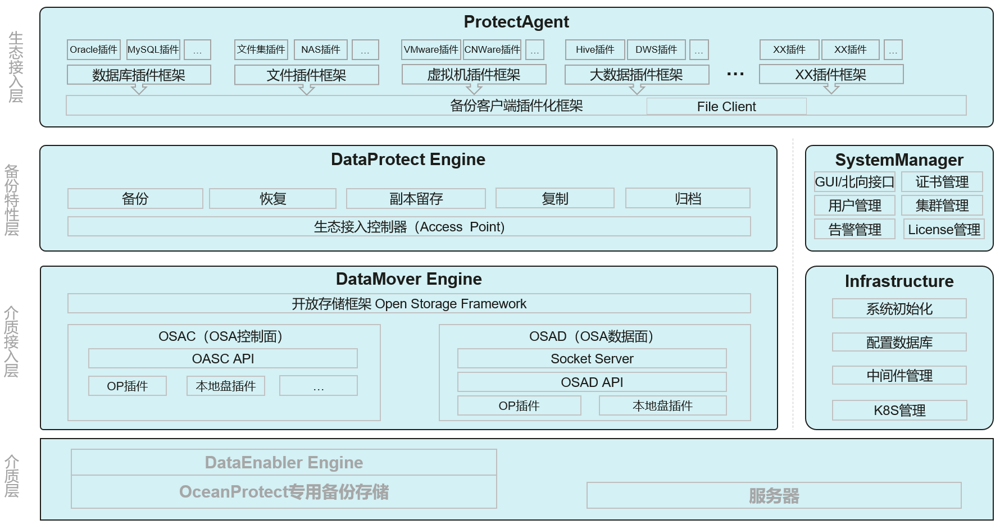

-   数据保护客户端（ProtectAgent）：主机文件，主机内数据库等负载备份时，需要安装备份代理，根据需要保护的应用类型识别需要安装的代理软件，在主机侧完成应用数据保护，无代理备份方式的应用不需要安装
-   数据备份特性层（DataProtect Engine）：负责处理数据保护业务，容器化部署，分布式架构；主要支持主机文件、数据库生态、虚拟化/云/容器生态、大数据生态保护策略的配置管理以及调度管理，以及副本数据流动能力。
-   介质接入层（DataMover Engine）：备份数据存储基础平台，负责提供备份数据传输协议、备份数据存储和布局管理、数据压缩以及重复数据删除等，为备份系统提供存储、快照、复制等基础能力。
-   硬件层：基础硬件，以及相关的驱动程序。
-   基础设施（Infrastructure）：安装部署、K8S管理、消息中间件、缓存中间件、数据库中间件等以及系统初始化的管理。
-   系统管理（SystemManager）：支持用户管理、告警管理、证书管理、集群管理License管理，以及对接华为存储产品线多种网管平台，同时支持标准协议对接三方网关平台。

## 产品特点

open-eBackup备份与恢复系统 , 不仅支持周期性全量备份、增量备份，还支持永久增量备份、原生格式备份、副本即时可用（配合华为OceanProtect存储）、端到端防勒索（配合华为OceanProtect存储），全局数据检索等特性、同时支持副本生命周期管理实现副本归档长期保留和远程复制容灾等多种功能。系统支持针对各类应用生态系统进行备份保护包括：主机文件/OS、NAS文件、数据库、虚拟化/云/容器、大数据、数据仓库等。

### 永久增量备份（合成全量）

open-eBackup备份软件支持的大部分应用，均支持永久增量备份方式进行增量数据存储，和传统后期合成永久增量不同，备份软件采用ROW（Redirect-On-Write）写时重定向/COW（Copy-On-Write）写时拷贝方式进行合成。备份数据以原始文件格式或固定文件格式写入，当增量备份时，分析增量数与上一次备份数据的差异数据块和偏移位置，并将差异数据覆盖写入文件，得到最新的全量合成副本，副本合成后生成快照，快照记录以来关系，当下次增量备份时，基于上次文件系统快照，新数据分片重定向写入新位置。省略中间合成过程。提升备份和恢复效率。

同时，全量合成技术还可以结合应用，实现应用感知的源端数据重删能力，在全量备份时，仅传输差异块数据，并在服务端合成为完整的全量备份副本，这一技术将在[5.5章节](源端重删.md)进行讲解。

**图 1**  传统厂商永久增量备份原理  
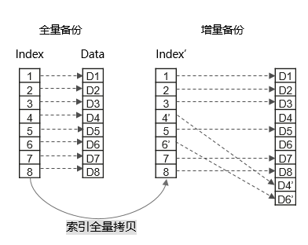

传统厂商在实现永久增量备份时，需要先进行一次上次备份副本的索引文件全量拷贝，再根据增量信息修改对应的偏移索引。得到永久增量副本的全量索引文件。或者拷贝真实数据后再合并写入成新文件写入，这种实现方式需要拷贝一次索引文件，并多次对索引文件进行修改写，或者拷贝整文件内容合并后写入，对存储层带来极大的IO负担。

**图 2**  open-eBackup ROW永久增量备份原理  

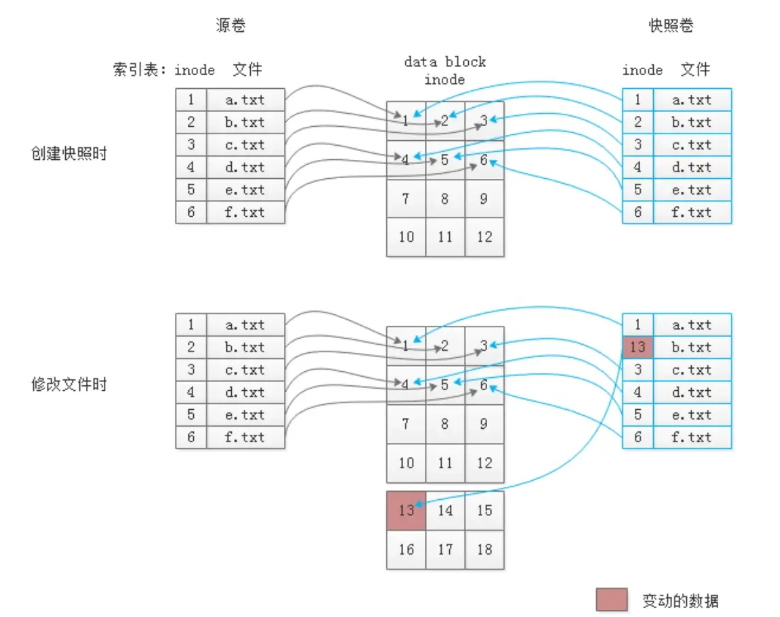

open-eBackup 备份软件永久增量备份技术，结合华为OceanProtect存储，针对索引文件采用ROW快照技术，变化数据块仅新增变化数据索引信息，不拷贝全量索引。极大缩减存储IO开销，提升备份性能。

**图 3**  open-eBackup COW永久增量备份原理  

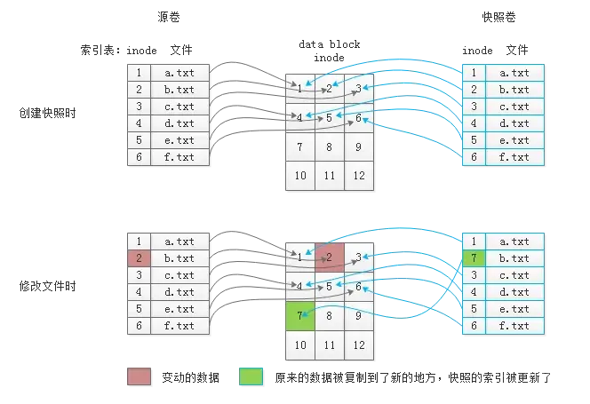

open-eBackup 备份软件永久增量备份技术，结合本地盘存储，针对索引文件采用COW快照技术，变化数据需要将原数据块拷贝到一个新位置，并更新快照卷中的新索引关系，极大的增加了存储的IO开销，备份性能相对ROW性能有所降低。

### 原生格式备份

传统备份发展历程中，通常采用备份软件和存储介质分离部署，为便于备份数据的重删缩减、加密等处理，通常将备份数据拆分存放为私有格式，此时的备份数据无法被原应用软件识别，称之为非原生格式备份。对于非原生格式的备份副本，恢复时需要将数据完全写回生产环境，才能将业务恢复，数据量越大，RTO越大。原生格式备份将备份数据以应用能识别的数据格式进行存储，将数据的缩减、加密能力下沉到存储底层。增量备份时将增量数据和全量数据进行整合，确保每一个备份副本都是可被应用识别的完整副本，极大提升副本的恢复效率。

**图 1**  传统备份软件数据存储格式  
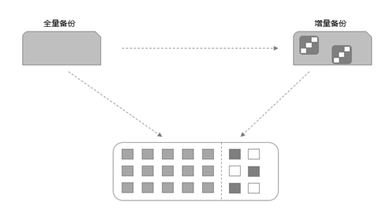

OceanProtect原生格式会将数据合并形成应用可识别的文件格式，并最终对备份文件创建快照进行保留，对应用提供即时挂载、即时恢复等能力。

**图 2**  OceanProtect保留和生产端相同的原生数据格式  
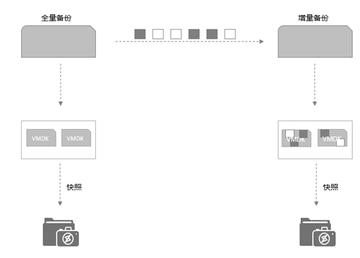

由于原生格式副本需要按照通用协议可识别的方式组织文件存储，这样生产应用才可识别这些备份文件，所以需要支持如SCSI、NFS、CIFS、HDFS、S3等标准协议，传统备份软件由于重删层处于前述协议层之上，因此一旦由备份软件重删后，数据就不可被标准协议识别，或者以标准协议格式存放，就无法进行重删压缩、加密操作，因此，传统备份软件通常是挂载能力与重删压缩等能力互斥，给客户使用带来极大不遍。

OceanProtect备份存储与open-eBackup备份软件架构垂直整合，将重删能力构筑在文件系统协议之下，并支持标准NFS、CIFS协议，将挂载、即时恢复等快速恢复能力与重删压缩、加密等能力兼而顾之，完整的满足客户诉求。

**图 3**  同时支持副本挂载和重删压缩  

.png)

-   **原生格式备份下的重删压缩**：传统的备份厂商，受软件架构限制，通常只能将备份软件的重删压缩特性构建在备份软件上，将备份软件重删、压缩处理后的数据存放到备份存储中，以便发挥备份软件特定场景下的压缩率优势，但是这样的实现方式会导致很多应用无法实现副本的即时挂载和恢复，因为应用往往基于操作系统之上运行，只支持识别通用的NAS存储、SAN存储或者对象存储上的数据，对于重删后的备份数据无法识别。open-eBackup备份软件和OceanProtect存储系统，深度结合，在存储层之下实现适用于备份场景的重删技术，同时支持通过通用NAS协议对外进行副本挂载和即时恢复。

### 副本即时可用

为便于用户即时查看副本内容，或利用备份副本进行开发测试、数据分析等操作，open-eBackup与OceanProtect备份存储相结合，支持备份副本即时挂载可用，支持Oracle、VMware、NAS备份、MySQL备份、文件备份等备份副本和复制副本的Live-Mount挂载能力，用户可快速挂载备份副本数据，实现备份数据利用和分钟级即时恢复。其中Oracle、VMware支持即时挂载后端数据迁移能力，自动将数据回签到生产系统，本章节主要介绍挂载能力和实现原理。

**图 1**  LiveMount挂载  
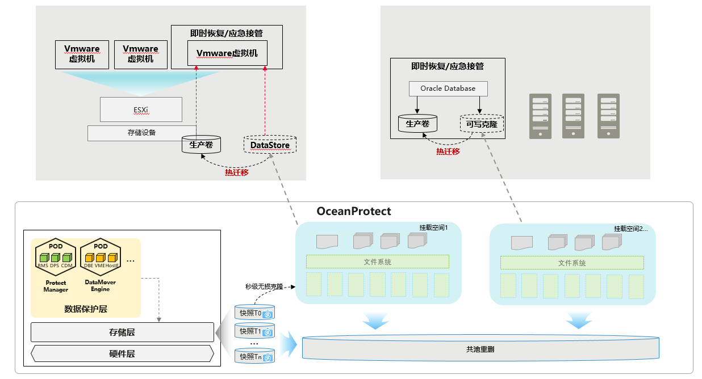

挂载使用的几种场景：

-   用户手动选择指定副本，进行挂载。
-   用户设置自动挂载策略，open-eBackup 根据策略设置，到期自动替换副本进行挂载。
-   用户通过open-eBackup中的副本进行挂载接管业务，业务运行一段时间后回迁到生产。

针对支持挂载的的应用，每次备份完成后，保留一个只读快照，快照内容与生产应用实际内容、格式保持一致，Live-Mount执行前，为指定只读副本创建一个无损可写克隆，然后将克隆的可写文件系统挂载到虚拟机或应用之上，以便应用或虚拟机能够快速拉起。

拉起后的应用涉及到新数据的变化时，将新数据写入OceanProtect存储空间，新数据依然采用ROW写时重定向方式保存，与原快照数据共享未变化数据，且共池重删。当挂载业务使用后，还能通过虚拟机vMotion，数据库切换存储等方式，将备份数据与挂载后的新业务数据无缝迁移回生产存储。

**图 2**  秒级无损克隆  
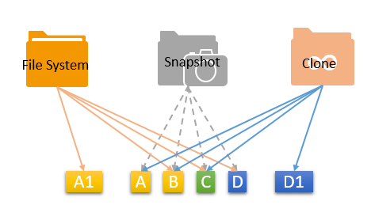

### 端到端防勒索（配合OceanProtect备份介质）

open-eBackup与OceanProtect备份介质相结合，提供副本端到端防勒索解决方案，首先将备份数据通过加密通过传输到备份存储设备中，并对链路中的数据进行完整性校验和加密处理，备份存储接收到数据后经过加密处理后，存储到硬盘介质中，然后进行勒索病毒检测，检测完成的无感染安全副本，进行法规级WORM属性设置，可设置保护期，防止备份数据在存储过程中被篡改，最后还能通过加密链路复制到远端安全区进行存储，并通过AIR Gap控制复制物理链路的开合，将数据复制到隔离区，减少网络攻击和窃取风险。

**图 1**  端到端勒索病毒防护方案  
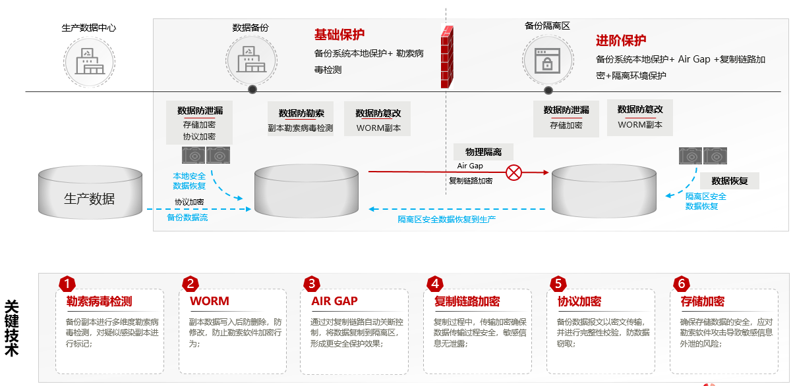

#### 加密传输

open-eBackup与OceanProtect相结合，使用NFS协议将生产系统中的数据传输到备份设备中进行存储，NFS协议使用客户端IP进行鉴权，在复杂的网络环境中存在一定的安全风险，备份特性使用Kerberos 对备份链路进行认证和加密。Kerberos 是一种客户机/服务器体系结构，用于在网络上提供安全事务。该服务可提供功能强大的用户验证以及完整性和保密性。通过验证，可保证网络事务的发送者和接收者的身份真实，同时该服务还可以检验来回传递的数据的有效性（完整性），并在传输过程中对数据进行加密（保密性）。使用 Kerberos 服务，可以安全登录到其他计算机、执行命令、交换数据以及传输文件。开启数据加密传输功能后，安全性有所提高，但是性能有所下降，需根据实际使用场景进行选择。

NFS Kerberos依据RPCSEC\_GSS安全机制完成NFSv4 Kerberos认证。RPCSEC\_GSS安全机制包含三个部分，分别为Kerberos上下文创建，RPC数据交换和Kerberos上下文销毁。

**图 1**  Kerberos传输加密流程  
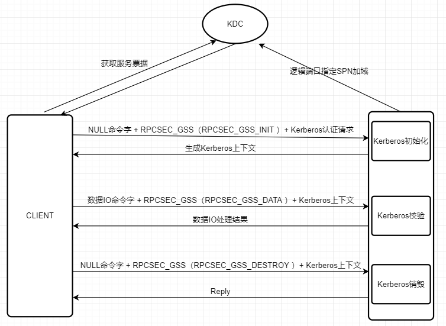

1.  存储逻辑端口上支持SPN加域，KDC上生成SPN机器账号信息，存储Keytab文件中生成SPN以及对应的密钥信息。
2.  NFS客户端从域控获取访问SPN票据信息。
3.  NFS客户端挂载（逻辑端口加域的SPN名称）时通过发送NULL命令字，RPC指定RPCSEC\_GSS认证模式，RPC Proc指定RPC\_GSS\_INIT以及从KDC获取到的票据信息发送给NFS服务端进行Kerberos初始化。NFS服务端根据keytab中的SPN以及密钥信息校验GSS请求的票据信息，校验成功后给客户端响应Kerberos上下文信息，后续使用同一个挂载点的NFS Kerberos业务访问时都使用该上下文件进行验证。
4.  NFS客户端业务认证成功后，可以进行数据访问，如读写/创删文件等操作。IO数据访问流程中，客户端携带认证成功的Kerberos上下文信息以及安全模式类型\(Krb5/Krb5i/Krb5p\)，NFS服务端根据上下文信息进行Kerberos认证，Kerberos认证成功后才能进行数据处理，保证安全性。
5.  NFS客户端业务使用完成后对挂载点执行umount操作。Umount共享后，客户端会通过NULL命令，RPC Proc指定RPC\_GSS\_Destroy以及初始化生成的Kerberos上下文信息，通知NFS服务端清除生成的Kerberos缓存信息。NFS服务端收到清除请求后，根据Kerberos上下文清除Kerberos资源。

备份特性使用Krb5p对数据包进行完整性校验和数据加密，可提供最高级别的安全保证。

#### 加密存储

为保证备份数据的安全性。OceanProtect支持基于存储系统的阵列加密，启用控制器处理器的内置加密引擎，配置内置密管或者外置密管完成备份数据的静态加密。

-   内置密管：存储系统自带的密钥管理应用，采用NIST SP 800-57最佳实践设计，对密钥进行生命周期管理。内置密管具有易部署、易配置、易管理的特点；如果数据中心的密钥管理仅用于存储系统，且无需通过密码模块安全标准FIPS 140-2认证和中国国密认证，建议选择内置密管。
-   外置密管：采用KMIP+TLS的标准协议，满足FIPS 140-2认证/中国国密认证的密管。如果数据中心多场景需要密钥集中管理，或者需要通过密码模块安全标准FIPS 140-2的认证，建议选择外置密管。

备份数据加密利用控制器处理器的内置加密引擎进行加解密，该独立内置加密引擎集成ARM硬件的加密算法的卸载能力。执行加解密算法时，不需要软件参与，进行硬件卸载。当在备份存储层进行数据加密时，加密子系统按照硬盘粒度生成安全密钥DEK，并且向密管申请密钥（AK），然后使用AK对DEK进行加密保存，业务IO下发后加解密卸载到内置加密引擎执行。加密引擎支持的加密算法为AES-256-XTS和SM4-128-XTS\(限中国大陆地区\)，密管使用算法需要和加密引擎匹配。

**内置密管**使用存储系统自带的密钥管理应用，采用NIST SP 800-57最佳实践设计，对密钥进行生命周期管理，包括密钥分层保护、密钥备份、密钥恢复、密钥产生、密钥更新、密钥销毁。内置密管具有易部署、易配置、易管理的特点；如果数据中心的密钥管理仅用于备份系统，且无需通过密码模块安全标准FIPS 140-2的认证，建议选择内置密管。

内置密管包含以下六个特性：

-   密钥保护

    内置密管支持三层密钥设计，root key、master key、work key。

-   Root key：根密钥，是多层密钥系统的首层密钥，对Master key进行加密保护。
-   Master key：加密密钥，对Work key进行加密保护。
-   Work key：工作密钥，加解密数据。
-   密钥备份

    内置密管提供通过手动和自动方式将密钥密文备份到外部的sftp/ftp服务器。

-   密钥恢复

    内置密管通过sftp/ftp将之前备份的密钥进行恢复。

-   密钥产生

    OceanProtect开启加密功能时，存储系统的块设备管理子系统会向内置密管申请加密密钥；内置密管会产生一个加密密钥返回给块设备管理子系统。

-   密钥更新

    加密密钥的生命周期结束或者密钥被泄露时，内置密管支持块设备管理子系统申请更新加密密钥。

-   密钥销毁

    当加密密钥的生命周期结束或者硬盘的生命周期结束，需要销毁硬盘对应的加密密钥，内置密管支持销毁对应的加密密钥。

> **说明：** 
>内置密管支持国际AES算法，不支持中国国密SM4算法。
>内置密管安全能力依赖存储系统，存储系统的安全能力构建参考安全技术白皮书。

**外置密管**把加密密钥保存在存储系统外部，支持密钥产生、更新、销毁、备份、恢复等操作。它与存储控制器之间采用KMIP+TLS进行密钥传输，保证密钥的安全性，同时外置密管支持双机模式，两个外置密管之间会进行密钥的实时同步，保证密钥可靠性。

> **说明：** 
>外置密管支持国际AES算法/中国国密SM4算法（具体密管型号支持算法请参考《OceanProtect专用备份存储系统硬盘加密用户指南》），满足FIPS 140-2认证/中国国密认证。选择外置密管时，请与MO联系确认外置密管的可供应性。

#### WORM

为保证备份数据存储可靠性，以防数据在存储过程中被无意或恶意篡改，OceanProtect支持将备份副本进行WORM锁定，实现一写多读功能，即备份副本写入完成后，可通过设置使其进入保护状态，在该状态下文件只能被读取，无法被删除、修改或重命名。

在实现时，内置备份软件在存储层文件系统上新增文件相关的一些属性，这些属性控制着对文件的访问和修改的限制；每个文件会各自保存自己的WORM属性，以保证备份数据不被篡改。

WORM副本在设置的保留周期内，不允许修改和删除，同时WORM功能还能与勒索软件检测功能结合，将副本进行勒索病毒扫描后，仅对未感染副本进行WORM属性设置，保证存储系统中的备份数据整洁。

> **须知：** 
>华为OceanProtect 数据保护设备法规遵从\(Compliance\)模式遵照SEC Rule 17a-4\(f\)法规施行数据保护机制，但未进行相关第三方认证。

#### 勒索软件检测

勒索病毒，是一种新型电脑病毒，主要以邮件、程序木马、网页挂马的形式进行传播。该病毒性质恶劣、危害极大，一旦感染将给用户带来无法估量的损失。这种病毒利用各种加密算法对文件进行加密，被感染者一般无法解密，必须拿到解密的私钥才有可能破解。

传统厂商在备份时，仅仅对数据进行搬迁，不考虑副本内容安全性，当生产环境被勒索病毒感染后，对应的备份副本也会在备份时将病毒文件进行拷贝，导致备份的副本也是被感染过的副本，客户无法感知到副本当前是否可用，是否已被感染。

OceanProtect 备份介质内置智能勒索病毒扫描能力，在每次备份完成后，立即对副本内容进行特征检查和行为分析，使用基线特征模型对备份副本进行基础检查，当发现有疑似感染特征时，再启动AI机器学习检查模型进行深度分析。确定当某个副本有高度感染行为时，对该副本进行标记并告警，以便提醒用户进行清除和处理。

**图 1**  智能勒索病毒检测  
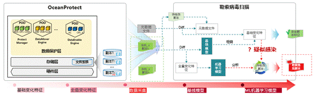

防勒索系统主要使用特征对副本内容进行检测，先使用应用统计方法、数据可视化等，对基础变化特征进行统计，发掘正常文件系统变化与了所感染变化特征之间的差异，通过基线模型的建立，筛选过滤出有可疑行为的文件系统变化，并进行进一步检测判断。

**表 1**  基础变化特征

<table><thead align="left"><tr id="zh-cn_topic_0000001559143301_row1728114213455"><th class="cellrowborder" valign="top" width="18.18%" id="mcps1.2.4.1.1">
<strong id="zh-cn_topic_0000001559143301_b52884218452">基础特征</strong>

</th>
<th class="cellrowborder" valign="top" width="22.220000000000002%" id="mcps1.2.4.1.2">
<strong id="zh-cn_topic_0000001559143301_b42804212453">描述</strong>

</th>
<th class="cellrowborder" valign="top" width="59.599999999999994%" id="mcps1.2.4.1.3">
<strong id="zh-cn_topic_0000001559143301_b2281420456">说明</strong>

</th>
</tr>
</thead>
<tbody><tr id="zh-cn_topic_0000001559143301_row1228184218455"><td class="cellrowborder" valign="top" width="18.18%" headers="mcps1.2.4.1.1 ">
后缀种类变化数量

</td>
<td class="cellrowborder" valign="top" width="22.220000000000002%" headers="mcps1.2.4.1.2 ">
变化前后的后缀并集-交集

</td>
<td class="cellrowborder" rowspan="2" valign="top" width="59.599999999999994%" headers="mcps1.2.4.1.3 ">
正常的文件变化通常较少修改文件后缀，而勒索软件通常会增加特定的后缀，或者增加随机后缀，所以若出现后缀种类变化超过一定数量或者变化后的后缀种类数量很少，则可能是勒索软件加密导致。

</td>
</tr>
<tr id="zh-cn_topic_0000001559143301_row19281142124519"><td class="cellrowborder" valign="top" headers="mcps1.2.4.1.1 ">
变化后的后缀种类数量

</td>
<td class="cellrowborder" valign="top" headers="mcps1.2.4.1.2 ">
文件变化后的后缀种类数量

</td>
</tr>
<tr id="zh-cn_topic_0000001559143301_row1828144214456"><td class="cellrowborder" valign="top" width="18.18%" headers="mcps1.2.4.1.1 ">
st_size变化的众数数量

</td>
<td class="cellrowborder" valign="top" width="22.220000000000002%" headers="mcps1.2.4.1.2 ">
文件大小变化值的众数数量

</td>
<td class="cellrowborder" valign="top" width="59.599999999999994%" headers="mcps1.2.4.1.3 ">
部分勒索软件加密文件的大小变化完全相同，若出现一定量相同的文件大小变化，则可能是勒索软件加密导致。

</td>
</tr>
<tr id="zh-cn_topic_0000001559143301_row1528134234514"><td class="cellrowborder" valign="top" width="18.18%" headers="mcps1.2.4.1.1 ">
文件头种类的变化数量

</td>
<td class="cellrowborder" valign="top" width="22.220000000000002%" headers="mcps1.2.4.1.2 ">
变化后文件头的种类–变化前文件头的种类

</td>
<td class="cellrowborder" valign="top" width="59.599999999999994%" headers="mcps1.2.4.1.3 ">
通常同类型的文件使用相同的文件头来表示类型，所以文件头的种类并不多，但大部分勒索软件也会加密文件头，导致原本相同的文件头也变得不同了，文件头的种类增加。也存在少量勒索软件会将所有加密后的文件增加相同的文件头，导致文件头种类数量减少，所以可通过文件头种类变化的数量来判断是否可能存在勒索软件入侵。

</td>
</tr>
<tr id="zh-cn_topic_0000001559143301_row02854219457"><td class="cellrowborder" valign="top" width="18.18%" headers="mcps1.2.4.1.1 ">
变化后文件尾种类的数量

</td>
<td class="cellrowborder" valign="top" width="22.220000000000002%" headers="mcps1.2.4.1.2 ">
变化后文件尾种类的数量

</td>
<td class="cellrowborder" rowspan="2" valign="top" width="59.599999999999994%" headers="mcps1.2.4.1.3 ">
大部分勒索软件会在加密文件后增加相同的文件尾，所以可以通过文件尾种类数量是否减少一定值和变化后文件尾种类数量是否小于一定值来判断勒索软件入侵的可能性。

</td>
</tr>
<tr id="zh-cn_topic_0000001559143301_row628642154513"><td class="cellrowborder" valign="top" headers="mcps1.2.4.1.1 ">
文件尾种类的变化数量

</td>
<td class="cellrowborder" valign="top" headers="mcps1.2.4.1.2 ">
变化后文件尾的数量–变化前文件尾的数量

</td>
</tr>
<tr id="zh-cn_topic_0000001559143301_row2291642194520"><td class="cellrowborder" valign="top" width="18.18%" headers="mcps1.2.4.1.1 ">
新增相同文件名数量

</td>
<td class="cellrowborder" valign="top" width="22.220000000000002%" headers="mcps1.2.4.1.2 ">
新增文件中具有相同文件名的文件个数

</td>
<td class="cellrowborder" valign="top" width="59.599999999999994%" headers="mcps1.2.4.1.3 ">
勒索软件通常会在每个目录下放置勒索note，若出现新增文件中有超过一定数量的文件具有相同的文件名，则可能是勒索软件入侵。

</td>
</tr>
<tr id="zh-cn_topic_0000001559143301_row122924214517"><td class="cellrowborder" valign="top" width="18.18%" headers="mcps1.2.4.1.1 ">
新增文件头的种类比率

</td>
<td class="cellrowborder" valign="top" width="22.220000000000002%" headers="mcps1.2.4.1.2 ">
新增文件的文件头种类/新增文件数量

</td>
<td class="cellrowborder" valign="top" width="59.599999999999994%" headers="mcps1.2.4.1.3 ">
若勒索软件是通过新建-复制-加密-删除原始文件的方式生成加密文件，加密文件的文件头各不相同，则新增文件头的种类比率较高。

</td>
</tr>
</tbody>
</table>

当检测到如上基础特征达到如下特征的域值时，则备份副本会被标记位可疑副本。

-   后缀种类变化数量≥**【阈值】**
-   变化后的后缀种类数量≤**【阈值】**&&后缀种类变化数量≠0
-   st\_size变化的众数数量≥**【阈值】**
-   文件头种类的变化数量≥**【阈值】**
-   变化后文件尾种类的数量≤**【阈值】**  && 文件尾种类的变化数量≤**【阈值】**
-   新增相同文件名数量≥**【阈值】**
-   新增文件头的种类比率≥**【阈值】**

    对于使用基线模型进行检测后，发现的可疑副本，OceanProtect会采集数据集的全量变化特征，使用机器学习分类模型判断是否被感染，标记被感染的副本。

    **表 2**  全量变化特征

    
    <table><thead align="left"><tr id="zh-cn_topic_0000001559143301_row198257717472"><th class="cellrowborder" valign="top" width="37.37%" id="mcps1.2.3.1.1">
<strong id="zh-cn_topic_0000001559143301_b138258718472">特征</strong>

    </th>
    <th class="cellrowborder" valign="top" width="62.629999999999995%" id="mcps1.2.3.1.2">
<strong id="zh-cn_topic_0000001559143301_b148251773471">描述</strong>

    </th>
    </tr>
    </thead>
    <tbody><tr id="zh-cn_topic_0000001559143301_row158268794716"><td class="cellrowborder" valign="top" width="37.37%" headers="mcps1.2.3.1.1 ">
修改文件比率

    </td>
    <td class="cellrowborder" valign="top" width="62.629999999999995%" headers="mcps1.2.3.1.2 ">
修改文件数/原始文件总数

    </td>
    </tr>
    <tr id="zh-cn_topic_0000001559143301_row08268717478"><td class="cellrowborder" valign="top" width="37.37%" headers="mcps1.2.3.1.1 ">
后缀种类的变化量

    </td>
    <td class="cellrowborder" valign="top" width="62.629999999999995%" headers="mcps1.2.3.1.2 ">
变化后后缀种类数量 - 变化前后缀种类数量

    </td>
    </tr>
    <tr id="zh-cn_topic_0000001559143301_row482617715471"><td class="cellrowborder" valign="top" width="37.37%" headers="mcps1.2.3.1.1 ">
变化前后后缀的diff值

    </td>
    <td class="cellrowborder" valign="top" width="62.629999999999995%" headers="mcps1.2.3.1.2 ">
文件变化前后的后缀并集-交集

    </td>
    </tr>
    <tr id="zh-cn_topic_0000001559143301_row7826177134717"><td class="cellrowborder" valign="top" width="37.37%" headers="mcps1.2.3.1.1 ">
变化后的后缀种类数量

    </td>
    <td class="cellrowborder" valign="top" width="62.629999999999995%" headers="mcps1.2.3.1.2 ">
统计被修改的文件变化后的后缀种类数量

    </td>
    </tr>
    <tr id="zh-cn_topic_0000001559143301_row1182667114712"><td class="cellrowborder" valign="top" width="37.37%" headers="mcps1.2.3.1.1 ">
相同文件名变化比率

    </td>
    <td class="cellrowborder" valign="top" width="62.629999999999995%" headers="mcps1.2.3.1.2 ">
统计文件名变化的diff种类和数量，相同文件名变化的众数数量/总变化文件数量

    </td>
    </tr>
    <tr id="zh-cn_topic_0000001559143301_row282616713477"><td class="cellrowborder" valign="top" width="37.37%" headers="mcps1.2.3.1.1 ">
st_mode变化的比率

    </td>
    <td class="cellrowborder" valign="top" width="62.629999999999995%" headers="mcps1.2.3.1.2 ">
st_mode发生变化的文件数量/总变化文件数量

    </td>
    </tr>
    <tr id="zh-cn_topic_0000001559143301_row1682697104714"><td class="cellrowborder" valign="top" width="37.37%" headers="mcps1.2.3.1.1 ">
st_size变化的极差

    </td>
    <td class="cellrowborder" valign="top" width="62.629999999999995%" headers="mcps1.2.3.1.2 ">
size变化的最大值 - 最小值

    </td>
    </tr>
    <tr id="zh-cn_topic_0000001559143301_row68266734710"><td class="cellrowborder" valign="top" width="37.37%" headers="mcps1.2.3.1.1 ">
st_size变化的标准差

    </td>
    <td class="cellrowborder" valign="top" width="62.629999999999995%" headers="mcps1.2.3.1.2 ">
size变化值的离散程度

    </td>
    </tr>
    <tr id="zh-cn_topic_0000001559143301_row18261572475"><td class="cellrowborder" valign="top" width="37.37%" headers="mcps1.2.3.1.1 ">
st_size变化众数数量

    </td>
    <td class="cellrowborder" valign="top" width="62.629999999999995%" headers="mcps1.2.3.1.2 ">
size变化值众数的数量

    </td>
    </tr>
    <tr id="zh-cn_topic_0000001559143301_row682697154710"><td class="cellrowborder" valign="top" width="37.37%" headers="mcps1.2.3.1.1 ">
st_size变化众数的比率

    </td>
    <td class="cellrowborder" valign="top" width="62.629999999999995%" headers="mcps1.2.3.1.2 ">
size变化值众数的数量/总变化文件数量

    </td>
    </tr>
    <tr id="zh-cn_topic_0000001559143301_row1782619711477"><td class="cellrowborder" valign="top" width="37.37%" headers="mcps1.2.3.1.1 ">
变化文件中未改变st_mtime的比率

    </td>
    <td class="cellrowborder" valign="top" width="62.629999999999995%" headers="mcps1.2.3.1.2 ">
文件变化但st_mtime未改变的数量/总变化文件数量

    </td>
    </tr>
    <tr id="zh-cn_topic_0000001559143301_row882619724718"><td class="cellrowborder" valign="top" width="37.37%" headers="mcps1.2.3.1.1 ">
st_mtime的极差

    </td>
    <td class="cellrowborder" valign="top" width="62.629999999999995%" headers="mcps1.2.3.1.2 ">
最大st_stime –最小st_stime

    </td>
    </tr>
    <tr id="zh-cn_topic_0000001559143301_row208267774714"><td class="cellrowborder" valign="top" width="37.37%" headers="mcps1.2.3.1.1 ">
st_mtime变化的标准差

    </td>
    <td class="cellrowborder" valign="top" width="62.629999999999995%" headers="mcps1.2.3.1.2 ">
修改文件st_mtime的离散程度

    </td>
    </tr>
    <tr id="zh-cn_topic_0000001559143301_row08269714472"><td class="cellrowborder" valign="top" width="37.37%" headers="mcps1.2.3.1.1 ">
文件头发生变化的比率

    </td>
    <td class="cellrowborder" valign="top" width="62.629999999999995%" headers="mcps1.2.3.1.2 ">
文件头发生变化的数量/总变化文件量

    </td>
    </tr>
    <tr id="zh-cn_topic_0000001559143301_row178264724715"><td class="cellrowborder" valign="top" width="37.37%" headers="mcps1.2.3.1.1 ">
变化后文件头的种类比率

    </td>
    <td class="cellrowborder" valign="top" width="62.629999999999995%" headers="mcps1.2.3.1.2 ">
变化文件的文件头种类数量/总变化文件数量

    </td>
    </tr>
    <tr id="zh-cn_topic_0000001559143301_row138268764716"><td class="cellrowborder" valign="top" width="37.37%" headers="mcps1.2.3.1.1 ">
文件头种类的变化数量

    </td>
    <td class="cellrowborder" valign="top" width="62.629999999999995%" headers="mcps1.2.3.1.2 ">
变化后文件头的种类–变化前文件头的种类

    </td>
    </tr>
    <tr id="zh-cn_topic_0000001559143301_row1882647104715"><td class="cellrowborder" valign="top" width="37.37%" headers="mcps1.2.3.1.1 ">
变化后文件头的总熵值

    </td>
    <td class="cellrowborder" valign="top" width="62.629999999999995%" headers="mcps1.2.3.1.2 ">
将变化后的文件头拼接在一起，计算总熵值

    </td>
    </tr>
    <tr id="zh-cn_topic_0000001559143301_row188267784711"><td class="cellrowborder" valign="top" width="37.37%" headers="mcps1.2.3.1.1 ">
文件头总熵值的变化量

    </td>
    <td class="cellrowborder" valign="top" width="62.629999999999995%" headers="mcps1.2.3.1.2 ">
变化后文件头的总熵值–变化前文件头的总熵值

    </td>
    </tr>
    <tr id="zh-cn_topic_0000001559143301_row12826673474"><td class="cellrowborder" valign="top" width="37.37%" headers="mcps1.2.3.1.1 ">
变化后文件尾众数的数量

    </td>
    <td class="cellrowborder" valign="top" width="62.629999999999995%" headers="mcps1.2.3.1.2 ">
变化后具有相同文件尾4字节的文件数量

    </td>
    </tr>
    <tr id="zh-cn_topic_0000001559143301_row14826197154712"><td class="cellrowborder" valign="top" width="37.37%" headers="mcps1.2.3.1.1 ">
变化文件的文件尾种类数量

    </td>
    <td class="cellrowborder" valign="top" width="62.629999999999995%" headers="mcps1.2.3.1.2 ">
变化后文件的文件尾4字节的种类数量

    </td>
    </tr>
    <tr id="zh-cn_topic_0000001559143301_row382677164719"><td class="cellrowborder" valign="top" width="37.37%" headers="mcps1.2.3.1.1 ">
变化后文件尾种类的比率

    </td>
    <td class="cellrowborder" valign="top" width="62.629999999999995%" headers="mcps1.2.3.1.2 ">
变化文件的文件尾种类数量/总变化文件数量

    </td>
    </tr>
    <tr id="zh-cn_topic_0000001559143301_row148271714473"><td class="cellrowborder" valign="top" width="37.37%" headers="mcps1.2.3.1.1 ">
文件尾种类的变化数量

    </td>
    <td class="cellrowborder" valign="top" width="62.629999999999995%" headers="mcps1.2.3.1.2 ">
变化后文件尾的数量–变化前文件尾的数量

    </td>
    </tr>
    <tr id="zh-cn_topic_0000001559143301_row6827197144716"><td class="cellrowborder" valign="top" width="37.37%" headers="mcps1.2.3.1.1 ">
变化后文件尾的总熵值

    </td>
    <td class="cellrowborder" valign="top" width="62.629999999999995%" headers="mcps1.2.3.1.2 ">
将变化后的文件尾拼接在一起，计算总熵值

    </td>
    </tr>
    <tr id="zh-cn_topic_0000001559143301_row19827874470"><td class="cellrowborder" valign="top" width="37.37%" headers="mcps1.2.3.1.1 ">
文件尾总熵值的变化

    </td>
    <td class="cellrowborder" valign="top" width="62.629999999999995%" headers="mcps1.2.3.1.2 ">
变化后文件尾的总熵值–变化前文件尾的总熵值

    </td>
    </tr>
    <tr id="zh-cn_topic_0000001559143301_row7827187174717"><td class="cellrowborder" valign="top" width="37.37%" headers="mcps1.2.3.1.1 ">
新增相同文件名的数量

    </td>
    <td class="cellrowborder" valign="top" width="62.629999999999995%" headers="mcps1.2.3.1.2 ">
新增文件中具有相同文件名的文件个数

    </td>
    </tr>
    <tr id="zh-cn_topic_0000001559143301_row282797194716"><td class="cellrowborder" valign="top" width="37.37%" headers="mcps1.2.3.1.1 ">
新增最多文件名是否包含特殊词汇

    </td>
    <td class="cellrowborder" valign="top" width="62.629999999999995%" headers="mcps1.2.3.1.2 ">
新增最多的相同文件名中是否包含特殊词检测，比如crypt、recover、restore、readme

    </td>
    </tr>
    <tr id="zh-cn_topic_0000001559143301_row2827107144711"><td class="cellrowborder" valign="top" width="37.37%" headers="mcps1.2.3.1.1 ">
新增后缀种类数量

    </td>
    <td class="cellrowborder" valign="top" width="62.629999999999995%" headers="mcps1.2.3.1.2 ">
新增文件后缀种类和初始后缀种类差集的数量

    </td>
    </tr>
    <tr id="zh-cn_topic_0000001559143301_row382711704715"><td class="cellrowborder" valign="top" width="37.37%" headers="mcps1.2.3.1.1 ">
新增后缀众数的数量

    </td>
    <td class="cellrowborder" valign="top" width="62.629999999999995%" headers="mcps1.2.3.1.2 ">
新增文件中具体最多相同后缀的文件数量

    </td>
    </tr>
    <tr id="zh-cn_topic_0000001559143301_row38272719472"><td class="cellrowborder" valign="top" width="37.37%" headers="mcps1.2.3.1.1 ">
新增文件st_mtime的极差

    </td>
    <td class="cellrowborder" valign="top" width="62.629999999999995%" headers="mcps1.2.3.1.2 ">
新增文件最大st_time-最小st_time

    </td>
    </tr>
    <tr id="zh-cn_topic_0000001559143301_row98271079474"><td class="cellrowborder" valign="top" width="37.37%" headers="mcps1.2.3.1.1 ">
新增文件st_mtime的标准差

    </td>
    <td class="cellrowborder" valign="top" width="62.629999999999995%" headers="mcps1.2.3.1.2 ">
新增文件的st_time的离散程度

    </td>
    </tr>
    <tr id="zh-cn_topic_0000001559143301_row16827170477"><td class="cellrowborder" valign="top" width="37.37%" headers="mcps1.2.3.1.1 ">
新增文件头的种类的比率

    </td>
    <td class="cellrowborder" valign="top" width="62.629999999999995%" headers="mcps1.2.3.1.2 ">
新增文件的文件头种类/新增文件数量

    </td>
    </tr>
    <tr id="zh-cn_topic_0000001559143301_row98270718473"><td class="cellrowborder" valign="top" width="37.37%" headers="mcps1.2.3.1.1 ">
新增文件尾众数的数量

    </td>
    <td class="cellrowborder" valign="top" width="62.629999999999995%" headers="mcps1.2.3.1.2 ">
新增文件具有最多相同文件尾的文件数量

    </td>
    </tr>
    <tr id="zh-cn_topic_0000001559143301_row138272711474"><td class="cellrowborder" valign="top" width="37.37%" headers="mcps1.2.3.1.1 ">
备份文件删除比率

    </td>
    <td class="cellrowborder" valign="top" width="62.629999999999995%" headers="mcps1.2.3.1.2 ">
删除备份文件数量/备份文件总数

    </td>
    </tr>
    </tbody>
    </table>

    > **说明：** 
    >当前版本支持VMware、文件备份、NAS备份副本勒索病毒检测。

### 全局数据检索

open-eBackup 备份备份软件内置全局检索能力，提供整系统受保护资源的搜索能力和备份副本数据搜索能力，支持文件、数据库、虚拟化/私有云/容器的生产资源类型按照资源名称进行搜索，并快速创建备份恢复任务，提升管理效率。支持对文件、虚拟机、HDFS等的备份副本数据全局检索。支持模糊匹配文件名、目录名搜索。能快速查找受保护环境中的所有对象（如添加的VMware vCenter中的虚拟机），同时能秒级检索VMware虚拟机备份副本，主机文件级备份副本中的目录、文件，并针对查找到的目标文件进行细粒度的恢复和下载。

同时提供在线索引和离线索引两种索引创建方式，在线索引在备份副本生成后立即进行索引创建，离线索引在备份完成后，手动选择副本创建索引。备份完成后自动或用户在界面手动触发副本数据索引创建任务，主机文件级的索引数据直接在备份过程中的元数据导出，VMware整机备份副本的索引在索引创建任务中，首先将原生格式副本挂载到节点上，识别并挂载副本中的文件系统，文件系统挂载到节点后，遍历目录和文件生成副本内容的索引信息。

全局检索能力可以快速直观的展示副本内容，帮助用户快速发现多个备份副本中的任意文件的变化过程，并对细粒度恢复提供基础能力。

**图 1**  全局检索图示  
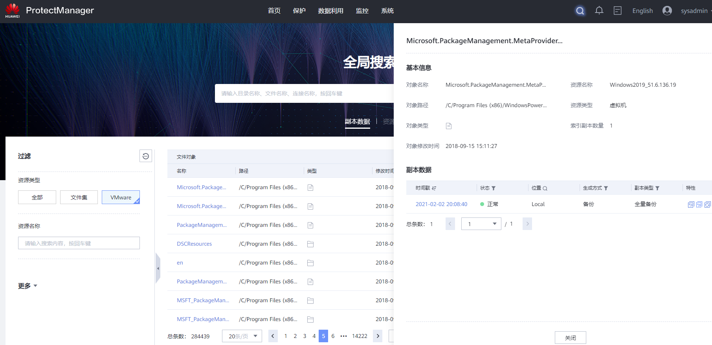

检索系统对副本中的文件和目录以四字节拆分创建索引信息，均衡索引信息存储空间大小和查找精确度，以文件syncdat为例，系统将首先将该文件名拆分为“sync”，“dat”创建索引，所以为连续字符的任意组合，如文件名为syncdat的文件最终存储的索引信息为：

**图 2**  分组创建索引  

索引建立时，首先将副本挂载到索引所在容器，遍历副本目录和文件，根据如上索引创建策略，为所有目录和文件创建索引，并将其权重和分词结果记录到分布式实时搜索引擎Elastic Search，当用户搜索数据时候，再根据权重将结果排名，打分，再将返回结果呈现给用户。

**图 3**  副本内容索引  
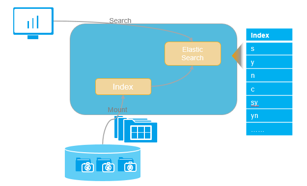

> **说明：** 
>当前支持VMware虚拟机副本、大数据HDFS副本、NAS海量小文件备份副本、主机文件级副本的内容级细粒度文件检索，其余应用支持检索受保护对象信息。

## 生产系统保护生态

open-eBackup备份软件提供了丰富的应用生态兼容性。包括主机、NAS Server、数据库、大数据、虚拟化、云平台、容器等。

应用备份功能表：

### 主机/NAS备份

open-eBackup支持主机/NAS备份能力包括：主机文件、NAS文件备份能力，主机文件备份时，需要在主机上安装数据保护客户端，通过LAN-Base方式进行备份，NAS存储无需代理，通过ServerFree方式备份。

**主机文件系统备份**，基于快速扫描的备份方案，通过文件/目录关联差异快速扫描技术和小文件聚合技术，提升扫描性能和备份性能。

-   基于快速扫描和聚合技术的快速备份方案：基于文件差异快速扫描技术，小文件聚合技术提升备份性能。

**NAS存储系统文件备份**，根据生产存储类型，主要区分为两种技术方案：

-   基于内部存储快照比对和块级增量的极速备份方案：使用OceanStor系统产品时，基于内部存储快照进行差异比对，免去耗时的差异扫描过程，同时结合文件内块级增量备份技术，提供高于友商3倍的极速备份能力。
-   基于快速扫描和聚合技术的快速备份方案：基于文件差异快速扫描技术，小文件聚合技术提升备份性能。

主要特点如下：

-   **无代理备份：**NAS海量小文件备份，任何场景下，均无需安装备份代理，其余场景需要基于Agent进行备份。
-   **永久增量（合成全量）：**基于ROW快照技术，备份过程中同步合成全量，提升恢复性能，切断副本间的恢复依赖关系，且不占用额外空间，任意副本可删除。
-   **并发备份/恢复**：支持子任务拆分，单任务拆分成多个子任务，并发执行在多个节点、多个控制器中。
-   **文件聚合：**支持备份文件聚合，提升KB级小文件场景下的备份性能，避免磁盘IO成为性能瓶颈。
-   **副本挂载（结合OceanProtect备份介质）：**支持备份副本挂载，副本数据利用。
-   **全局检索/细粒度恢复**：支持备份副本内容全局检索，秒级检索到需要恢复的文件或目录，提升恢复效率。
-   **支持数据压缩、重删（结合OceanProtect备份介质）**：备份数据存储层重删，源端重删，在数据重删基础上支持副本挂载、即时恢复等高级功能。
-   **支持备份副本复制、副本归档**

    支持将备份副本复制到包含其他open-eBackup系统，复制副本能力与备份副本相同，支持将备份副本归档到对象存储。归档副本支持普通的恢复能力。

-   **支持勒索病毒检测（结合OceanProtect备份介质）**

    支持副本勒索病毒检测，保障备份数据内容安全，通过备份副本检测识别生产环境勒索病毒感染警告。

-   **支持流量控制**

    支持备份任务流控，合理规划备份对象传输时间与带宽，同时也可以减小对生产系统的运行影响。

### 数据库生态系统备份

open-eBackup备份软件，针对数据库提供永久增量、周期性全量、日志备份等备份能力，根据用户配置，在指定时间对生产数据库发起备份，并将备份数据存放在备份存储池中。当生产数据损坏时，能使用备份数据进行快速恢复，或基于备份数据进行业务临时接管。

支持的数据库类型：Oracle、SQL Server、MySQL、Mariadb、DB2、SAP HANA、OceanBase、TDSQL 、TiDB、GoldenDB、GBase、MongoDB、GaussDB T、OpenGauss、Dameng、KingBase、Informix、PostgreSQL、HCS GaussDB、云和恩墨（Opengauss）、海量数据（Opengauss）等数据库进行在线备份保护，备份任务配置过程全部图形化操作。

数据库备份的主要特点：

-   **支持全量备份、增量备份、差异备份、永久增量**

    支持灵活的备份策略设置，能够设置永久增量、周期性全量、差异备份、日志备份等多种策略。

-   **支持即时恢复**

    能够利用备份副本数据为原生格式的特点，能在数据恢复回生产的同时，先快速的先将应用拉起，减少业务中断时长，减少RTO。

-   **支持任意时间点恢复**

    能通过日志备份，支持将生产数据恢复到过去任意时间点，减小RPO。

-   **支持原机、异机恢复，原位置、指定位置恢复**等不同的恢复目标。
-   **支持从节点优先**，识别主从、集群后优先从备节点进行备份，减少生产业务影响。
-   **支持备份任务高可靠**，每次备份识别主备角色，容忍数据库主备切换、节点故障场景下，备份任务不失败。
-   **支持数据压缩、重删（结合OceanProtect备份介质）**

    备份数据存储层重删、源端重删，在数据重删基础上支持副本挂载、即时恢复等高级功能。

-   **支持数据加密（结合OceanProtect备份介质）**

    备份数据传输过程加密、存储加密

-   **支持备份副本挂载（结合OceanProtect备份介质）**

    备份副本能快速挂载，极速拉起，接管生产业务。

-   **支持备份副本复制、副本归档**

    支持将备份副本复制到其他open-eBackup备份系统，复制副本能力与备份副本相同，支持将备份副本归档到对象存储。归档副本支持普通的恢复能力。

-   **支持流量控制**

    支持备份任务流控，合理规划备份对象传输时间与带宽，同时也可以减小对生产系统的运行影响。

### 虚拟化/云/容器生态系统备份

open-eBackup备份软件提供虚拟化、云、容器场景的整机备份功能采用无代理备份方式，无需在被备份的VM内安装备份代理即可完成备份恢复，通过快速检索可实现VM的单文件恢复。由于华为备份一体机采用全ARM架构，因此部分场景需要额外通过物理机或虚拟机部署数据保护代理，通过代理进行备份流程的控制和数据的交换。针对HCS云平台，提供全栈备份服务能力，支持云主机无代理的备份服务，基于存储永久增量备份，不占用业务主机资源和业务网络资源，用户无需在所备份云服务器内安装客户端插件即可完成云主机整机备份，并支持云服务器内文件细粒度恢复。

虚拟化环境数据保护主要特点：

支持的应用类型：FusionCompute、HuaweiCloudStack、Kubernetes、VMware、CNware。

-   **支持全量备份、永久增量备份，**备份任务配置过程全部图形化操作，无需编写脚本。
-   **支持环境自动扫描**，支持虚拟机、主机、DataStore、CNA节点、容器namespace、statefulset的备份。
-   **并发备份/恢复**：支持子任务拆分，单任务拆分成多个子任务，并发执行在多个节点、多个控制器中。
-   **块级增量备份**：支持块级增量备份，极大减少增量备份数据量。
-   **支持数据压缩、重删（结合OceanProtect备份介质）**

    备份数据存储层重删，源端重删，在数据重删基础上支持副本挂载、即时恢复等高级功能。

-   **支持即时恢复（结合OceanProtect备份介质）**

    即时恢复能快速恢复生产业务，业务能实现秒级恢复拉起。

-   **支持即时挂载（结合OceanProtect备份介质）**

    即时挂载不影响原生产环境，在新环境中秒级拉起业务虚拟机，对快速开发测试、数据分析提供环境。即时挂载还支持用户配置自动化更新策略，免去定期的人工副本挂载配置。

-   **支持自定义前后置脚本**

    支持添加自定义脚本，在任务执行前、执行成功后、执行失败后触发。由于自定义脚本可完全由用户自行编写，所以可以完全适应各类场景。

-   **支持即时挂载后的业务回迁**

    能够将挂载并运行一段时间后的虚拟机迁移回生产环境。

-   **支持恢复到原位置或指定位置**

    支持恢复原虚拟机，其他虚拟机和新创虚拟机。

-   **支持文件级细粒度恢复**

    支持细粒度恢复副本中的文件或目录。精准恢复需要的部分文件或目录。

-   **支持副本内容文件/目录检索**

    支持根据名称检索副本内容中的文件或目录进行快速检索。

-   **支持备份副本复制、副本归档**

    支持将备份副本复制到其他open-eBackup备份系统中，复制副本能力与备份副本相同，支持将备份副本归档到对象存储。归档副本支持普通的恢复能力

-   **支持勒索病毒检测（结合OceanProtect备份介质）**

    支持副本勒索病毒检测，保障备份数据内容安全，通过备份副本检测识别生产环境勒索病毒感染警告。

-   **支持流量控制**

    支持备份任务流控，合理规划备份对象传输时间与带宽，同时也可以减小对生产系统的运行影响。

### 大数据生态系统备份

备份一体机支持对Cloudra CDH/CDP大数据平台、星环大数据、开源Hadoop HDFS以及华为FusionInsight、MapReduce Sevice中的HDFS、Hbase、Hive进行备份，备份任务配置过程全部图形化操作，无需编写脚本，备份采用多节点并行流备份，从多个备份代理节点进行数据备份，相较于友商基于文件粒度的差异数据对比，OceanProtect 备份一体机HDFS备份支持文件内容分片的增量数据备份，大大减少增量备份时的备份数据量。同时采用ROW技术后台实时全量合成，减小恢复RTO，利用存储层重删技术，在支持数据重删压缩的基础上提供原生格式备份、全局检索和文件级细粒度恢复能力。

支持的组件类型：HDFS、Hbase、Hive、ElasticSearch、Redis、ClickHouse。

大数据HDFS备份主要特点：

-   **灵活代理部署：**支持备份代理无侵入式部署和部署到大数据平台节点内。
-   **多组件保护：**支持HDFS、Hbase、Hive、ElasticSearch、Redis、ClickHouse等组件保护。
-   **永久增量：**基于ROW快照技术，备份过程中同步合成全量，提升恢复性能，切断副本间的恢复依赖关系，且不占用额外空间，任意副本可删除。
-   **细粒度备份：**支持数据库namespace级别、表级别备份，支持分布式文件系统目录、文件级别备份，以及搜索引擎索引级别备份。
-   **细粒度恢复：**支持从备份副本中恢复部分内容，精准恢复。
-   **并发备份/恢复**：支持子任务拆分，单任务拆分成多个子任务，并发执行在多个节点、多个控制器中。
-   **全局检索/细粒度恢复**：支持备份副本内容全局检索，秒级检索到需要恢复的文件或目录，提升恢复效率。
-   **块级增量备份**：支持文件内容的块级增量备份，针对HDFS文件追加写修改场景，极大减少增量备份数据量。
-   **任意时间点恢复：**支持HBase基于WAL的日志备份，支持恢复到表数据的任意时间点。
-   **支持数据压缩、重删（结合OceanProtect备份介质）**：备份数据存储层重删，源端重删，在数据重删基础上支持细粒度恢复等高级功能。
-   **数据一致性**：基于快照的备份，支持副本内文件时间点一致性。
-   **支持备份副本复制、副本归档**

    支持将备份副本复制到其他open-eBackup备份系统中，复制副本能力与备份副本相同，支持将备份副本归档到对象存储。归档副本支持普通的恢复能力。

-   **支持流量控制**

    支持备份任务流控，合理规划备份对象传输时间与带宽，同时也可以减小对生产系统的运行影响。

### 数据仓库备份

数据仓库服务GaussDB\(DWS\) 是一种基于华为云/华为全栈云基础架构和平台的在线数据处理数据库，提供即开即用、可扩展且完全托管的分析型数据库服务。GaussDB\(DWS\)是基于华为融合数据仓库GaussDB产品的云原生服务 ，兼容标准ANSI SQL 99和SQL 2003，同时兼容PostgreSQL/Oracle数据库生态，为各行业PB级海量大数据分析提供有竞争力的解决方案。

open-eBackup备份软件结合DWS云基础架构，支持对GaussDB\(DWS\)数据仓库进行在线备份保护。备份任务配置过程全部图形化操作，无需编写脚本，提供针对DWS的数据库备份和恢复能力。ProtectAgent与RoachClient融合部署，提供接口供RoachClient调用，最终将备份数据写入存储设备中。

支持的数仓类型：GaussDB OLAP，DWS。

DWS数据保护主要特点：

-   **端到端运维**，完整的DWS备份管理界面，提供便捷的管理操作。
-   **分布式并行流备份**，多套设备并行接收备份数据，大幅减少备份时间窗
-   **可外置部署备份代理**，对生产系统零影响
-   **横向扩容**，满足生产业务扩张诉求
-   **支持数据压缩、重删（结合OceanProtect备份介质）**

    备份数据后端块级重删，存储压缩

-   **细粒度恢复**，支持表级细粒度恢复，缩短RTO
-   **支持备份副本复制、副本归档**

    支持将备份副本复制到其他open-eBackup备份系统中，复制副本能力与备份副本相同，支持将备份副本归档到对象存储。归档副本支持普通的恢复能力。

-   **支持流量控制**

    支持备份任务流控，合理规划备份对象传输时间与带宽，同时也可以减小对生产系统的运行影响。

## 副本生命周期管理

open-eBackup备份软件针对已完成的备份副本提供了丰富的副本生命周期管理和副本流动能力。支持将本地备份数据归档到对象存储和磁带存储，用于副本长期保留；支持灵活设置归档时间和保留规则，支持指定副本进行归档或者指定日期进行归档；支持设置归档保留周期，支持1对多归档目标。包括将副本数据归档到对象存储（兼容OceanStor Pacific\(S3\), FusionStorage OBS, OceanStor 9000\(S3\), Huawei Cloud OBS, Amazon AWS, Microsoft Azure, Google Cloud等等）和磁带存储介质，以及复制到另一套open-eBackup备份系统中。

### 副本归档

企业用户常常因为法规要求或业务需要，需要长期保留备份数据，他们通常是5年、10年设置更久，为了节省客户建设成本，同时消除数据孤岛，面向多云的数据环境。open-eBackup备份软件支持用户根据需求选择某些受保护对象的全量副本或部分副本进行归档到云环境或离线存储（如：磁带介质）中，我们将这个特性根据存储介质的不同，区分为云归档和磁带归档。

不论是云归档或者磁带归档，都是基于SLA策略进行触发和执行，归档后的副本恢复时会有较长的时间消耗，如果对于备份数据的恢复时间目标（RTO）有一定的容忍程度，则可以将这些数据归档到外部的归档介质中。

为方便对归档副本进行检索和细粒度恢复，open-eBackup备份软件在归档时，会记录并留存归档数据文件索引信息，当需要使用归档副本进行恢复时，先根据索引信息打开目录列表，选取其中需要的文件或目录进行恢复。

#### 云归档

副本云归档主要基于各云厂商提供的SDK或API接口开发，任务按节点拆分，单个副本的归档任务并发在多控制器节点上执行，同时结合BBR加速能力，提供高效的数据云归档功能。

云归档任务运行时，归档服务首先将归档任务拆分为多个子任务，并将任务发送到通信框架缓存队列，同时与其他节点上的归档服务一起到缓存队列中取子任务，获取到子任务后根据任务类型，到任务所在原服务中，获取副本详细信息及增量归档的分段差量位图，根据差量位图信息，读取相应数据块，大块拆分为4M，小块聚合为4M，最终经压缩后发送到对象存储。

<table><tbody><tr id="zh-cn_topic_0000001508063560_row696mcpsimp"><td class="cellrowborder" colspan="2" valign="top">
副本长期保留（副本归档）

</td>
<td class="cellrowborder" valign="top">&nbsp;&nbsp;</td>
</tr>
<tr id="zh-cn_topic_0000001508063560_row700mcpsimp"><td class="cellrowborder" rowspan="3" valign="top" width="22.997700229977003%">
副本归档

</td>
<td class="cellrowborder" valign="top" width="27.997200279972006%">
副本归档RPO

</td>
<td class="cellrowborder" valign="top" width="49.005099490050995%">
最小值：备份完成后立即归档（周期性归档最小RPO为1小时）

</td>
</tr>
<tr id="zh-cn_topic_0000001508063560_row707mcpsimp"><td class="cellrowborder" valign="top">
副本归档模式

</td>
<td class="cellrowborder" valign="top">
- 备份完成后立即归档

- 周期性归档

- 保留XX时间后归档

</td>
</tr>
<tr id="zh-cn_topic_0000001508063560_row712mcpsimp"><td class="cellrowborder" valign="top">
副本归档粒度

</td>
<td class="cellrowborder" valign="top">
指定副本归档（按策略归档部分副本）

</td>
</tr>
<tr id="zh-cn_topic_0000001508063560_row717mcpsimp"><td class="cellrowborder" rowspan="2" valign="top" width="22.997700229977003%">
归档对象

</td>
<td class="cellrowborder" valign="top" width="27.997200279972006%">
备份副本

</td>
<td class="cellrowborder" valign="top" width="49.005099490050995%">
全量备份/永久增量备份

</td>
</tr>
<tr id="zh-cn_topic_0000001508063560_row724mcpsimp"><td class="cellrowborder" valign="top">
复制副本

</td>
<td class="cellrowborder" valign="top">
全量备份/永久增量备份

</td>
</tr>
<tr id="zh-cn_topic_0000001508063560_row729mcpsimp"><td class="cellrowborder" rowspan="2" valign="top" width="22.997700229977003%">
归档目标

</td>
<td class="cellrowborder" valign="top" width="27.997200279972006%">
Target

</td>
<td class="cellrowborder" valign="top" width="49.005099490050995%">
AWS，

OceanStor Pacific(S3)，

FusionStorage OBS，

OceanStor 9000(S3)，

Huawei Cloud

</td>
</tr>
<tr id="zh-cn_topic_0000001508063560_row736mcpsimp"><td class="cellrowborder" valign="top">
最大归档目标数量

</td>
<td class="cellrowborder" valign="top">
4 (最大1:4的归档组网)

</td>
</tr>
<tr id="zh-cn_topic_0000001508063560_row741mcpsimp"><td class="cellrowborder" rowspan="2" valign="top" width="22.997700229977003%">
数据缩减

</td>
<td class="cellrowborder" valign="top" width="27.997200279972006%">
存储空间缩减

</td>
<td class="cellrowborder" valign="top" width="49.005099490050995%">
数据压缩

</td>
</tr>
<tr id="zh-cn_topic_0000001508063560_row748mcpsimp"><td class="cellrowborder" valign="top">
传输链路缩减

</td>
<td class="cellrowborder" valign="top">
数据压缩

</td>
</tr>
<tr id="zh-cn_topic_0000001508063560_row753mcpsimp"><td class="cellrowborder" rowspan="2" valign="top" width="22.997700229977003%">
归档网络

</td>
<td class="cellrowborder" valign="top" width="27.997200279972006%">
网络质量

</td>
<td class="cellrowborder" valign="top" width="49.005099490050995%">
支持基于BBR的传输协议优化，容忍最差网络质量为TTL&lt;=100ms、5%丢包率

</td>
</tr>
<tr id="zh-cn_topic_0000001508063560_row760mcpsimp"><td class="cellrowborder" valign="top">
带宽限制

</td>
<td class="cellrowborder" valign="top">
支持

</td>
</tr>
<tr id="row48611630125617"><td class="cellrowborder" rowspan="2" valign="top" width="22.997700229977003%">
副本恢复

</td>
<td class="cellrowborder" valign="top" width="27.997200279972006%">
检索

</td>
<td class="cellrowborder" valign="top" width="49.005099490050995%">
支持

</td>
</tr>
<tr id="row940033315614"><td class="cellrowborder" valign="top">
细粒度恢复

</td>
<td class="cellrowborder" valign="top">
支持

</td>
</tr>
</tbody>
</table>

#### 磁带归档

副本云归档主要为了将在线备份数据进行离线长期留存，归档是多驱动器并发归档，以多磁带组成介质集，并在介质集内支持磁带的循环覆盖使用，主要规格如下：

<table><tbody><tr id="zh-cn_topic_0000001507743788_row696mcpsimp"><td class="cellrowborder" colspan="2" valign="top">
副本长期保留（副本归档）

</td>
<td class="cellrowborder" valign="top">&nbsp;&nbsp;</td>
</tr>
<tr id="zh-cn_topic_0000001507743788_row700mcpsimp"><td class="cellrowborder" rowspan="3" valign="top" width="23%">
副本归档

</td>
<td class="cellrowborder" valign="top" width="28.000000000000004%">
副本归档RPO

</td>
<td class="cellrowborder" valign="top" width="49%">
最小值：备份完成后立即归档（周期性归档最小RPO为1小时）

</td>
</tr>
<tr id="zh-cn_topic_0000001507743788_row707mcpsimp"><td class="cellrowborder" valign="top">
副本归档模式

</td>
<td class="cellrowborder" valign="top">
- 备份完成后立即归档 - 周期性归档 - 保留XX时间后归档

</td>
</tr>
<tr id="zh-cn_topic_0000001507743788_row712mcpsimp"><td class="cellrowborder" valign="top">
副本归档粒度

</td>
<td class="cellrowborder" valign="top">
指定副本归档（按策略归档部分副本）

</td>
</tr>
<tr id="zh-cn_topic_0000001507743788_row717mcpsimp"><td class="cellrowborder" rowspan="2" valign="top" width="23%">
归档对象

</td>
<td class="cellrowborder" valign="top" width="28.000000000000004%">
备份副本

</td>
<td class="cellrowborder" valign="top" width="49%">
全量备份/永久增量备份

</td>
</tr>
<tr id="zh-cn_topic_0000001507743788_row724mcpsimp"><td class="cellrowborder" valign="top">
复制副本

</td>
<td class="cellrowborder" valign="top">
全量备份/永久增量备份

</td>
</tr>
<tr id="zh-cn_topic_0000001507743788_row144261114174"><td class="cellrowborder" rowspan="2" valign="top" width="23%">
归档目标

</td>
<td class="cellrowborder" valign="top" width="28.000000000000004%">
D2D2T

</td>
<td class="cellrowborder" valign="top" width="49%">
LTO5/LTO6/LTO7/LTO8

</td>
</tr>
<tr id="zh-cn_topic_0000001507743788_row736mcpsimp"><td class="cellrowborder" valign="top">
最大归档目标数量

</td>
<td class="cellrowborder" valign="top">
4 (最大1:4的归档组网)

</td>
</tr>
<tr id="zh-cn_topic_0000001507743788_row741mcpsimp"><td class="cellrowborder" valign="top" width="23%">
数据缩减

</td>
<td class="cellrowborder" valign="top" width="28.000000000000004%">
存储空间缩减

</td>
<td class="cellrowborder" valign="top" width="49%">
数据压缩

</td>
</tr>
<tr id="row1382918209576"><td class="cellrowborder" rowspan="2" valign="top" width="23%">
副本恢复

</td>
<td class="cellrowborder" valign="top" width="28.000000000000004%">
检索

</td>
<td class="cellrowborder" valign="top" width="49%">
支持

</td>
</tr>
<tr id="row6920102275716"><td class="cellrowborder" valign="top">
细粒度恢复

</td>
<td class="cellrowborder" valign="top">
支持

</td>
</tr>
</tbody>
</table>

### 副本复制

open-eBackup备份软件支持用户根据需求选择资源级的副本复制，将副本数据完整的复制到另一套open-eBackup备份系统中，当源数据中心遭受灾难时，在异地快速恢复业务。支持文件、数据库和虚拟化等各类备份副本远程复制到异地设备实现容灾保护，支持1对多、多对1和双向等多种远程复制方式。副本复制规格参见下表。

<table><tbody><tr id="zh-cn_topic_0000001559143305_row780mcpsimp"><td class="cellrowborder" colspan="2" valign="top">
副本复制

</td>
<td class="cellrowborder" valign="top">&nbsp;&nbsp;</td>
</tr>
<tr id="zh-cn_topic_0000001559143305_row784mcpsimp"><td class="cellrowborder" rowspan="4" valign="top" width="21%">
副本复制

</td>
<td class="cellrowborder" valign="top" width="27.97%">
副本复制RPO

</td>
<td class="cellrowborder" valign="top" width="51.03%">
最小值：备份完成后立即复制（周期性复制最小RPO为1小时）

</td>
</tr>
<tr id="zh-cn_topic_0000001559143305_row791mcpsimp"><td class="cellrowborder" valign="top">
副本复制模式

</td>
<td class="cellrowborder" valign="top">
- 备份完成后立即复制 - 周期性复制

</td>
</tr>
<tr id="zh-cn_topic_0000001559143305_row796mcpsimp"><td class="cellrowborder" valign="top">
副本复制粒度

</td>
<td class="cellrowborder" valign="top">
以保护资源为粒度，不支持单个保护资源下部分副本的复制

</td>
</tr>
<tr id="zh-cn_topic_0000001559143305_row194511114141819"><td class="cellrowborder" valign="top">
副本复制对象

</td>
<td class="cellrowborder" valign="top">
全量备份/增量备份/差异备份/永久增量备份

</td>
</tr>
<tr id="zh-cn_topic_0000001559143305_row801mcpsimp"><td class="cellrowborder" rowspan="3" valign="top" width="21%">
复制组网

</td>
<td class="cellrowborder" valign="top" width="27.97%">
最大复制目标数量

</td>
<td class="cellrowborder" valign="top" width="51.03%">
4 (最大1:4的复制组网)

</td>
</tr>
<tr id="zh-cn_topic_0000001559143305_row808mcpsimp"><td class="cellrowborder" valign="top">
最大复制源数量

</td>
<td class="cellrowborder" valign="top">
16 (最大16:1的复制组网)

</td>
</tr>
<tr id="zh-cn_topic_0000001559143305_row813mcpsimp"><td class="cellrowborder" valign="top">
双向复制

</td>
<td class="cellrowborder" valign="top">
支持

</td>
</tr>
<tr id="zh-cn_topic_0000001559143305_row818mcpsimp"><td class="cellrowborder" rowspan="2" valign="top" width="21%">
数据缩减

</td>
<td class="cellrowborder" valign="top" width="27.97%">
链路传输数据缩减

</td>
<td class="cellrowborder" valign="top" width="51.03%">
数据压缩

</td>
</tr>
<tr id="zh-cn_topic_0000001559143305_row825mcpsimp"><td class="cellrowborder" valign="top">
存储空间数据缩减

</td>
<td class="cellrowborder" valign="top">
重删、压缩

</td>
</tr>
<tr id="zh-cn_topic_0000001559143305_row830mcpsimp"><td class="cellrowborder" valign="top" width="21%">
复制网络

</td>
<td class="cellrowborder" valign="top" width="27.97%">
带宽限制

</td>
<td class="cellrowborder" valign="top" width="51.03%">
支持

</td>
</tr>
<tr id="zh-cn_topic_0000001559143305_row837mcpsimp"><td class="cellrowborder" rowspan="2" valign="top" width="21%">
复制副本恢复

</td>
<td class="cellrowborder" valign="top" width="27.97%">
恢复到复制目标端

</td>
<td class="cellrowborder" valign="top" width="51.03%">
支持

</td>
</tr>
<tr id="zh-cn_topic_0000001559143305_row844mcpsimp"><td class="cellrowborder" valign="top">
恢复到复制源端

</td>
<td class="cellrowborder" valign="top">
不支持

</td>
</tr>
<tr id="zh-cn_topic_0000001559143305_row658504419112"><td class="cellrowborder" rowspan="2" valign="top" width="21%">
归档网络

</td>
<td class="cellrowborder" valign="top" width="27.97%">
网络质量

</td>
<td class="cellrowborder" valign="top" width="51.03%">
支持基于BBR的传输协议优化，容忍最差网络质量为TTL&lt;=100ms、5%丢包率

</td>
</tr>
<tr id="zh-cn_topic_0000001559143305_row6733947119"><td class="cellrowborder" valign="top">
带宽限制

</td>
<td class="cellrowborder" valign="top">
支持

</td>
</tr>
</tbody>
</table>

用户可根据需求选择立即复制、周期性复制，满足用户多副本存储要求，复制支持链路压缩，目标端数据压缩、重删，可支持复制任务的带宽限速。

open-eBackup备份软件的副本复制功能，用于支撑用户副本级容灾，应用异地迁移等场景，复制能力仅针对副本，不复制归档日志等额外信息，目标端复制副本使用能力与源端一致，复制时，采用存储底层远程复制能力进行文件系统异步复制，能减少备份软件读写对于整体复制性能带来的损耗，更大的提升复制带宽。

## 副本数据脱敏

为保障企业备份数据安全，open-eBackup结合华为OceanProtect 备份介质提供副本数据脱敏能力，支持对数据库备份副本数据脱敏；支持预置满足PCI-DSS、PII、HIPAA法规要求的脱敏策略；支持自定义脱敏策略等。本章节主要描述数据脱敏原理。

### 数据脱敏

Live-Mount为企业开发测试数据准备极大的提升了使用效率，但副本中的数据与原生产中的数据完全一致，在特性的开发测试场景，用户数据属于隐私数据，为避免隐私数据的泄露，open-eBackup备份软件提供了数据库备份副本的数据脱敏能力，能将副本中的数据进行离线脱敏，在脱敏完成后再进行挂载测试，能保证副本中的隐私数据不泄露，用户数据安全可靠。

离线数据脱敏原理上先将待脱敏副本进行挂载，挂载完成后登陆目标数据库，并根据脱敏规则，将数据进行脱敏处理，处理完成后由用户进行脱敏结果检查，检查无误生产脱敏报告，此时目标副本中的持久化数据已经过脱敏化处理。

**图 1**  离线脱敏原理  

.png)

为方便实现用户敏感数据脱敏处理，预置多种典型脱敏规则：

<table><tbody><tr id="zh-cn_topic_0000001507903704_row962mcpsimp"><td class="cellrowborder" valign="top" width="18%">
类型

</td>
<td class="cellrowborder" valign="top" width="35%">
描述

</td>
<td class="cellrowborder" valign="top" width="24%">
脱敏前

</td>
<td class="cellrowborder" valign="top" width="23%">
脱敏后

</td>
</tr>
<tr id="zh-cn_topic_0000001507903704_row971mcpsimp"><td class="cellrowborder" valign="top" width="18%">
Noise-Adding

</td>
<td class="cellrowborder" valign="top" width="35%">
在原有数值上增加或减少随机数

</td>
<td class="cellrowborder" valign="top" width="24%">
10000

</td>
<td class="cellrowborder" valign="top" width="23%">
1053000

</td>
</tr>
<tr id="zh-cn_topic_0000001507903704_row980mcpsimp"><td class="cellrowborder" valign="top" width="18%">
Fixed-Number

</td>
<td class="cellrowborder" valign="top" width="35%">
指定固定的数字进行替换

</td>
<td class="cellrowborder" valign="top" width="24%">
8088

</td>
<td class="cellrowborder" valign="top" width="23%">
9527

</td>
</tr>
<tr id="zh-cn_topic_0000001507903704_row989mcpsimp"><td class="cellrowborder" valign="top" width="18%">
Partial-Mask1

</td>
<td class="cellrowborder" valign="top" width="35%">
将部分内容进行掩盖

</td>
<td class="cellrowborder" valign="top" width="24%">
15935124518

</td>
<td class="cellrowborder" valign="top" width="23%">
159****4518

</td>
</tr>
<tr id="zh-cn_topic_0000001507903704_row998mcpsimp"><td class="cellrowborder" valign="top" width="18%">
Partial-Mask2

</td>
<td class="cellrowborder" valign="top" width="35%">
将部分内容进行掩盖

</td>
<td class="cellrowborder" valign="top" width="24%">
50024317820701125x

</td>
<td class="cellrowborder" valign="top" width="23%">
500************25x

</td>
</tr>
<tr id="zh-cn_topic_0000001507903704_row1007mcpsimp"><td class="cellrowborder" valign="top" width="18%">
Shuffling

</td>
<td class="cellrowborder" valign="top" width="35%">
随机变化位置

</td>
<td class="cellrowborder" valign="top" width="24%">
I am ok.

</td>
<td class="cellrowborder" valign="top" width="23%">
ok. I am

</td>
</tr>
<tr id="zh-cn_topic_0000001507903704_row1016mcpsimp"><td class="cellrowborder" valign="top" width="18%">
Full-Mask

</td>
<td class="cellrowborder" valign="top" width="35%">
全部覆盖

</td>
<td class="cellrowborder" valign="top" width="24%">
Secret

</td>
<td class="cellrowborder" valign="top" width="23%">
******

</td>
</tr>
<tr id="zh-cn_topic_0000001507903704_row1025mcpsimp"><td class="cellrowborder" valign="top" width="18%">
Numeric-Range

</td>
<td class="cellrowborder" valign="top" width="35%">
替换为指定范围的随机数

</td>
<td class="cellrowborder" valign="top" width="24%">
8088

</td>
<td class="cellrowborder" valign="top" width="23%">
1111

</td>
</tr>
<tr id="zh-cn_topic_0000001507903704_row1034mcpsimp"><td class="cellrowborder" valign="top" width="18%">
PII-Type

</td>
<td class="cellrowborder" valign="top" width="35%">
用PII的类型覆盖原文

</td>
<td class="cellrowborder" valign="top" width="24%">&nbsp;&nbsp;</td>
<td class="cellrowborder" valign="top" width="23%">&nbsp;&nbsp;</td>
</tr>
<tr id="zh-cn_topic_0000001507903704_row1041mcpsimp"><td class="cellrowborder" valign="top" width="18%">
Format-Preserving

</td>
<td class="cellrowborder" valign="top" width="35%">
适用加密算法对数据进行加密，密文长度与原文长度相等

</td>
<td class="cellrowborder" valign="top" width="24%">
Wonderful

</td>
<td class="cellrowborder" valign="top" width="23%">
Da2CB2VxM

</td>
</tr>
</tbody>
</table>

# 存储系统软件设计（配合OceanProtect备份介质）

## NAS逻辑架构

OceanProtect备份一体机节点内的NAS采用分布式NAS架构，文件系统在创建时，均匀的归属到不同的控制器，在系统正常运行时，文件系统内的所有目录和文件在一个CPU内部的所有Core之间打散，减少跨CPU访问的系统延迟，以提升读写性能、目录遍历查询、属性遍历查询、批量属性设置等场景的性能。通过RAID2.0+的全局数据块打散技术，每个文件系统的数据被数据块打散到存储池的所有硬盘上，提升大文件的写入带宽。OceanProtect 备份一体机基于NAS协议架构对外提供即时挂载和即时恢复业务。

### NAS协议

#### NFS协议

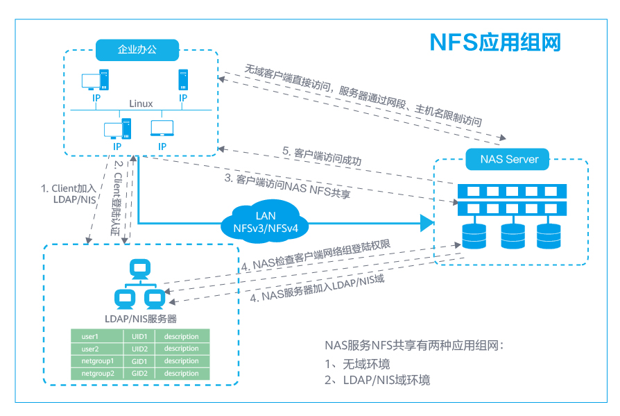

NFS \(Network File System\)网络文件系统，是在linux/ unix环境里面普遍使用的网络文件共享协议。

NFS的应用场景主要有：

-   面向安装在UNIX/LINUX/AIX/SOLARIS等类UNIX操作系统上的备份软件。

OceanProtect支持NFS协议版本包括 NFS V3、NFS V4.1，支持本地用户环境（无域环境）以及LDAP/NIS域控管理网络环境，LDAP支持导入证书提供LDAPS的安全域传输。在多租户环境下，支持每个租户单独配置LDAP/NIS服务。

#### CIFS协议

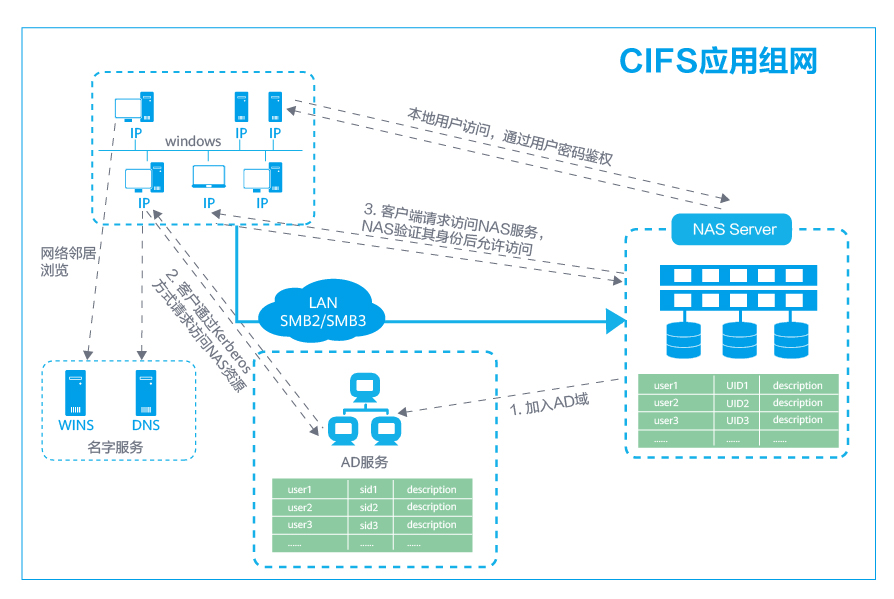

SMB（Server Message Block）也称为CIFS（ Common Internet File System ，公共互联网文件系统），是在Windows环境里面普遍使用的网络文件共享协议。

SMB的应用场景主要有：

-   面向安装在Windows操作系统上的备份软件。

    OceanProtect支持SMB2.0/SMB3.0协议，支持本地用户环境（无域环境）以及AD域控管理网络环境，能基于AD域的Kerberos和NTLM认证鉴权，支持单一域、父子域、信任域等AD域网络环境。在多租户环境下，支持每个租户配置独立的AD域。

#### 跨协议访问

OceanProtect支持NFS/SMB 跨协议访问，能为一个文件系统既配置NFS共享服务又配置SMB共享服务，系统通过Multiprotocal Lock manager进行分布式锁管理，保证NFS/SMB能互斥的访问相同的文件，不会造成文件损坏或数据不一致。

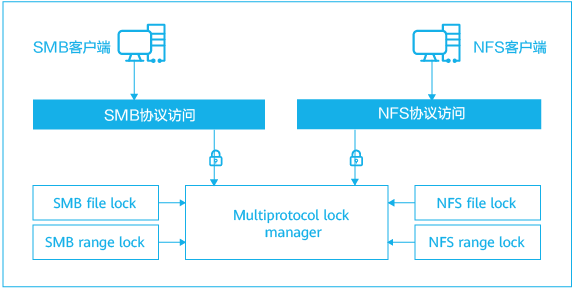

跨协议访问场景下的安全模式，OceanProtect支持2种：

-   NT模式：仅允许在window端通过SMB设置文件的属性和ACL权限，系统会自动根据配置好的用户映射关系，将SMB用户的文件权限映射到NFS端，从而NFS端使用对应的Linux用户来访问该文件时可以成功鉴权。在NFS端该模式会禁止用户设置文件的Mode和ACL权限。
-   UNIX模式：仅允许在Linux/UNIX端通过NFS设置文件的权限，系统会自动根据配置好的用户映射关系，将Linux用户的文件权限映射到SMB端，从而SMB端使用对应的用户来访问该文件时可以成功鉴权。在SMB端该模式会禁止用户设置文件的ACL权限。

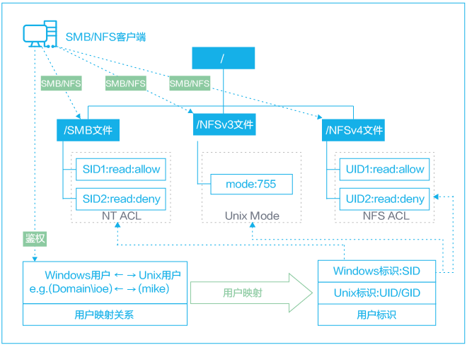

### 内置DNS负载均衡

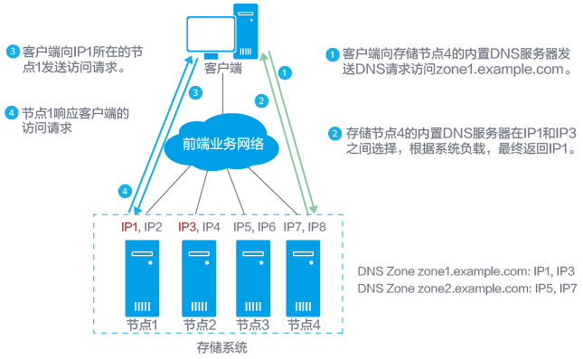

在NAS环境中，主机可通过域名访问存储阵列上的服务。当同一域名下有多个IP地址时，可通过DNS实现不同IP间的负载均衡。外置的DNS服务器无法感知阵列上各IP所在节点的CPU利用率、所在端口的带宽利用率等负载情况，通常只能提供简单的round-robin策略，无法真实的反应各IP的负载情况，均衡效果不理想。

使用传统外置DNS服务器主要有以下问题：

-   只能提供round-robin均衡策略，无法感知阵列上各IP所在节点的CPU利用率、所在端口的带宽利用率等负载情况，均衡效果不理想。
-   依赖外置DNS服务器稳定性，阵列不能提供高可靠的域名解析服务。

OceanProtect提供一种新的内置DNS负载均衡技术，可以感知阵列上各IP的负载情况，获得更好的负载均衡效果，从而提升存储业务性能和可靠性。

OceanProtect内置DNS负载均衡特性支持的策略有轮循方式、按节点CPU利用率、按节点连接数、按节点带宽利用率、按节点综合负载，其选择参考如表所示。

<table><thead align="left"><tr id="zh-cn_topic_0000001254686106_row185331942194015"><th class="cellrowborder" valign="top" width="17.96%" id="mcps1.1.4.1.1">
名称

</th>
<th class="cellrowborder" valign="top" width="40.81%" id="mcps1.1.4.1.2">
说明

</th>
<th class="cellrowborder" valign="top" width="41.23%" id="mcps1.1.4.1.3">
使用场景

</th>
</tr>
</thead>
<tbody><tr id="zh-cn_topic_0000001254686106_row205330422409"><td class="cellrowborder" valign="top" width="17.96%" headers="mcps1.1.4.1.1 ">
加权轮询

</td>
<td class="cellrowborder" valign="top" width="40.81%" headers="mcps1.1.4.1.2 ">
当客户端通过域名访问时，根据性能数据计算权重，同一域名下需负载的各IP以相等的概率选中处理客户端业务。

</td>
<td class="cellrowborder" valign="top" width="41.23%" headers="mcps1.1.4.1.3 ">
适用于多个NAS链接的任务执行时间和业务压力都比较均衡，新链接均匀选择所有节点。

</td>
</tr>
<tr id="zh-cn_topic_0000001254686106_row1353394210402"><td class="cellrowborder" valign="top" width="17.96%" headers="mcps1.1.4.1.1 ">
CPU利用率

</td>
<td class="cellrowborder" valign="top" width="40.81%" headers="mcps1.1.4.1.2 ">
当客户端通过域名访问时，根据各节点CPU使用率性能数据计算权重，以权值作为概率选择节点处理客户端业务。

</td>
<td class="cellrowborder" valign="top" width="41.23%" headers="mcps1.1.4.1.3 ">
适用于不同节点承担不同业务导致CPU压力差异较大（如容器业务），新链接选择当前CPU压力较小节点。

</td>
</tr>
<tr id="zh-cn_topic_0000001254686106_row1953354254013"><td class="cellrowborder" valign="top" width="17.96%" headers="mcps1.1.4.1.1 ">
带宽利用率

</td>
<td class="cellrowborder" valign="top" width="40.81%" headers="mcps1.1.4.1.2 ">
当客户端通过域名访问时，根据各节点总带宽利用率性能数据计算权重，以权值作为概率选择节点处理客户端业务。

</td>
<td class="cellrowborder" valign="top" width="41.23%" headers="mcps1.1.4.1.3 ">
适用于NAS链接之间带宽需求不均衡；

新链接选择当前总带宽较小的节点。

</td>
</tr>
<tr id="zh-cn_topic_0000001254686106_row195331442154014"><td class="cellrowborder" valign="top" width="17.96%" headers="mcps1.1.4.1.1 ">
NAS连接数

</td>
<td class="cellrowborder" valign="top" width="40.81%" headers="mcps1.1.4.1.2 ">
当客户端通过域名访问时，根据各节点NAS连接数性能数据计算权重，以权值作为概率选择节点处理客户端业务。

</td>
<td class="cellrowborder" valign="top" width="41.23%" headers="mcps1.1.4.1.3 ">
适用于NAS链接数量很多且每个链接的业务压力都很小的场景。

</td>
</tr>
<tr id="zh-cn_topic_0000001254686106_row11533194214019"><td class="cellrowborder" valign="top" width="17.96%" headers="mcps1.1.4.1.1 ">
综合负载

</td>
<td class="cellrowborder" valign="top" width="40.81%" headers="mcps1.1.4.1.2 ">
当客户端通过域名访问时，根据性能数据的节点综合负载选择节点处理客户端业务。根据CPU利用率、带宽利用率和NAS连接数计算节点负载，负载越低则被选中的概率越高。

</td>
<td class="cellrowborder" valign="top" width="41.23%" headers="mcps1.1.4.1.3 ">
适用于NAS链接业务多变且没有规律场景

</td>
</tr>
</tbody>
</table>

### 审计日志

审计日志特性是对设备的操作进行日志记录，提供日志审计功能实现设备访问安全管理和业务规律和趋势的分析判断。OceanProtect审计日志（如图1所示）支持管理操作审计日志和NAS业务操作审计日志。

图1：审计日志

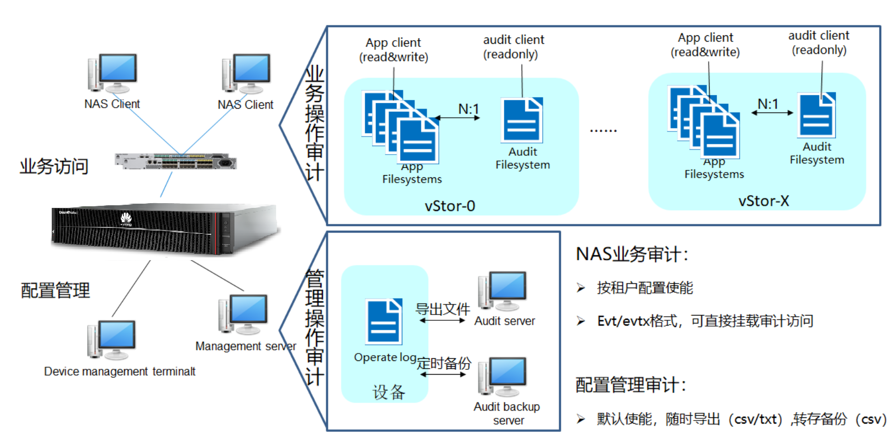

业务访问的审计是针对NAS服务业务对NAS客户端的访问操作进行日志记录，采用独立的审计日志文件系统记录日志。该功能按租户为单位支持使能配置，租户间相互独立，支持保证模式和非保证模式，支持配置具体的审计操作对象（具体的配置对象参考特性指南说明）。租户的审计日志功能一旦开启，则对应审计的操作需要先记录操作日志，再执行操作任务。在保证模式下如果操作日志记录失败则操作不执行，可能会造成业务中断；非保证模式下操作将继续执行，但记录的操作日志信息将不完整，系统默认为保证模式，客户可以在线修改。审计日志文件系统采用evt格式存放日志，该文件系统支持实时共享给审计日志服务器进行审计访问。

配置管理的审计是针对设备管理员对设备的配置管理操作进行的日志记录，仅记录配置修改类操作（查询类不记录），该日志文件采用系统内部文件存储，不支持提供在线访问功能，该功能默认使能（不能关闭），支持实时导出查询（导出格式可以选CSV和TXT格式），支持CSV格式转存日志备份服务器。

## RAID 2.0+

存储的数据，最终都会存储到SSD盘上，如果有些盘片上存放的数据不均匀，就可能导致某些压力大的SSD盘成为系统的瓶颈。OceanProtect通过RAID 2.0+技术，通过细粒度的划分，实现所有文件系统/LUN的数据均衡的分布在每个SSD盘上，实现盘的负载均衡。RAID 2.0+ 的机制：

-   多个SSD组成一个存储池（Storage Pool）；
-   每个SSD盘被切分成固定大小的Chunk（简称CK，通常大小为4MB）进行逻辑空间管理；
-   来自不同SSD盘的CK按照客户配置RAID冗余级别组成Chunk组（CKG）。
-   CKG再被划分为更细粒度的Grain，通常为8K，为Voulume使用的最小粒度

**图 1**  RAID2.0+映射图  
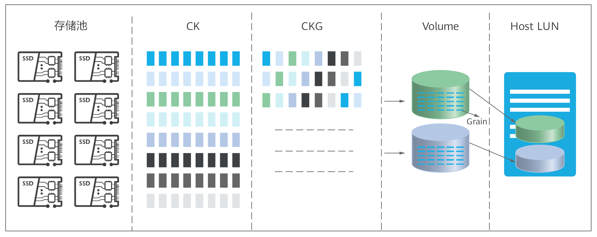

# 系统性能设计（配合OceanProtect备份介质）

为了满足OceanProtect备份一体机产品高吞吐量，高数据缩减率的诉求，系统需要强大的运算能力。在同一个控制器内实现了业界最多的CPU 核数，提供了强劲的运算能力。

OceanProtect通过从主机访问均衡、前端网络、CPU、后端网络等全I/O路径的软件优化，充分利用强大的硬件能力为客户提供极致的高带宽。[表1](#zh-cn_topic_0000001302686101_table43551030522)按照从主机到SSD/HDD盘的I/O下发的全流程，针对当前的问题和痛点，来阐述整个产品的关键性能的设计。

**表 1**  OceanProtect关键性能设计

<table><thead align="left"><tr id="zh-cn_topic_0000001302686101_row752116308215"><th class="cellrowborder" valign="top" id="mcps1.2.6.1.1">
<strong id="zh-cn_topic_0000001302686101_b5251510154418">I/O全流程</strong>

</th>
<th class="cellrowborder" valign="top" id="mcps1.2.6.1.2">
<strong id="zh-cn_topic_0000001302686101_b153042010174417">面临的挑战</strong>

</th>
<th class="cellrowborder" valign="top" id="mcps1.2.6.1.3">
<strong id="zh-cn_topic_0000001302686101_b19306810154413">关键设计</strong>

</th>
<th class="cellrowborder" colspan="2" valign="top" id="mcps1.2.6.1.4">
<strong id="zh-cn_topic_0000001302686101_b330731044418">性能设计原理简述</strong>

</th>
</tr>
</thead>
<tbody><tr id="zh-cn_topic_0000001302686101_row45218303214"><td class="cellrowborder" valign="top" headers="mcps1.2.6.1.1 ">
前端

</td>
<td class="cellrowborder" valign="top" headers="mcps1.2.6.1.2 ">
原生ETH协议层次多，CPU资源开销大，最大性能受限。

</td>
<td class="cellrowborder" valign="top" headers="mcps1.2.6.1.3 ">
华为深度优化的TOE技术（DTOE，Direct TCP offload engine ），节省出的CPU资源用于其它任务从而提升系统的最大吞吐量

</td>
<td class="cellrowborder" colspan="2" valign="top" headers="mcps1.2.6.1.4 "><ul id="zh-cn_topic_0000001302686101_ul290815175369"><li>I/O绕过内核态，减少跨态开销</li><li>协议硬件卸载，减少CPU参与

</li></ul>
</td>
</tr>
<tr id="zh-cn_topic_0000001302686101_row752120301726"><td class="cellrowborder" rowspan="2" valign="top" headers="mcps1.2.6.1.1 ">
控制器

</td>
<td class="cellrowborder" valign="top" headers="mcps1.2.6.1.2 ">
如何发挥多CPU多核的计算能力

</td>
<td class="cellrowborder" valign="top" headers="mcps1.2.6.1.3 ">
智能众核技术，减少资源冲突概率和CPU调度的开销，提升CPU资源处理IO的效率，从而提升系统的最大吞吐量

</td>
<td class="cellrowborder" colspan="2" valign="top" headers="mcps1.2.6.1.4 "><ul id="zh-cn_topic_0000001302686101_ul59312673617"><li>CPU间按CPU分组分发，减少跨CPU调度的时延</li><li>CPU内按服务区分进行分区设计，减少服务相互干扰</li><li>服务分区内无锁设计，减少锁冲突</li></ul>
</td>
</tr>
<tr id="zh-cn_topic_0000001302686101_row155224305211"><td class="cellrowborder" valign="top" headers="mcps1.2.6.1.1 ">
自研高效指纹算法

</td>
<td class="cellrowborder" valign="top" headers="mcps1.2.6.1.2 ">
多路并发技术，混合调用多个CPU指令

</td>
<td class="cellrowborder" colspan="2" valign="top" headers="mcps1.2.6.1.4 ">
Multi-buffer技术：算法同时进行两个SHA1+CRC32的计算，提供两片buffer。通过将两个指令流混合在一起，同时进行两次计算。

</td>
</tr>
<tr id="zh-cn_topic_0000001302686101_row145222300214"><td class="cellrowborder" rowspan="2" valign="top" headers="mcps1.2.6.1.1 ">
后端

</td>
<td class="cellrowborder" rowspan="2" valign="top" headers="mcps1.2.6.1.2 ">
由于写放大导致SSD寿命短、写性能低

</td>
<td class="cellrowborder" valign="top" headers="mcps1.2.6.1.3 ">
多流技术，减少垃圾回收的写放大，优化SSD的写带宽

</td>
<td class="cellrowborder" colspan="2" valign="top" headers="mcps1.2.6.1.4 ">
冷热数据分流减少盘内写惩罚

</td>
</tr>
<tr id="zh-cn_topic_0000001302686101_row652293012213"><td class="cellrowborder" valign="top" headers="mcps1.2.6.1.1 ">
ROW满分条写，减少EC效验的写放大，提升系统写带宽。

</td>
<td class="cellrowborder" colspan="2" valign="top" headers="mcps1.2.6.1.4 ">
ROW满分条写入的设计降低随机写的写放大

</td>
</tr>
<tr id="zh-cn_topic_0000001302686101_row136821157145118"><td class="cellrowborder" rowspan="2" valign="top" headers="mcps1.2.6.1.1 ">
针对备份场景专项优化

</td>
<td class="cellrowborder" valign="top" headers="mcps1.2.6.1.2 ">
重删对HDD的介质的顺序读写特性不友好

</td>
<td class="cellrowborder" valign="top" headers="mcps1.2.6.1.3 ">
将指纹的查重功能和地址索引功能分离，保证数据经过重删和压缩后盘上数据布局和文件的LBA地址一致

</td>
<td class="cellrowborder" colspan="2" valign="top" headers="mcps1.2.6.1.4 ">
以ID为中心的三层元数据架构，解决重删扰乱数据布局的顺序性导致HDD盘乱序读盘性能差的问题。

</td>
</tr>
<tr id="zh-cn_topic_0000001302686101_row1968295785117"><td class="cellrowborder" valign="top" headers="mcps1.2.6.1.1 ">
多次全量备份后，最新的全量备份被打散分布，影响最新备份任务的恢复性能

</td>
<td class="cellrowborder" valign="top" headers="mcps1.2.6.1.2 ">
对大块数据被分片重删后的离散度进行数据局部整理

</td>
<td class="cellrowborder" colspan="2" valign="top" headers="mcps1.2.6.1.4 ">
数据离散度局部性整理

</td>
</tr>
</tbody>
</table>

## 前端网络优化

前端网络优化主要是优化应用程序与存储器之间的时延，包括：针对NAS和iSCSI场景的协议卸载优化、以及针对通用场景的调度优化。

**协议卸载**

网卡（NAS/iSCSI）的性能瓶颈主要在冗长的I/O路径，其中TCP/IP的开销异常大，华为通过深度优化的用户态TCP/IP和iSCSI协议栈和网卡TOE直通对协议计算工作进行卸载到接口卡上完成，释放出CPU的计算资源用于其他任务，提升系统的最大性能。如[图1](#zh-cn_topic_0000001303166137_fig2017278153719)：

**图 1**  DTOE技术  
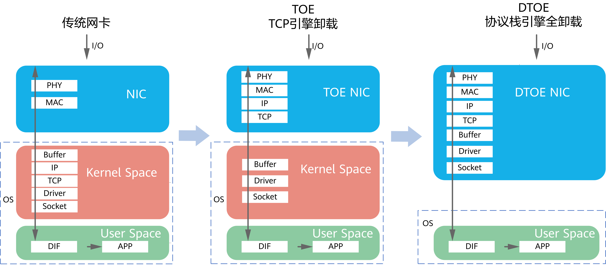

传统网卡，控制器处理的网络协议栈层次深，处理每个数据包都要触发一次中断，CPU资源开销严重。

TOE技术，网卡对TCP/IP协议层进行卸载，每个应用程序完成一次完整的数据处理才触发一次中断，显著减轻中断开销；但是在这种优化情况下还有部分驱动等运行在内核态，存在用户态和内核态的系统调用、线程切换等开销带来额外的时延。

OceanProtect的DTOE技术，将IP数据路径卸载到网卡，传输层的处理包括DIF校验功能下移到华为定制的网卡微码里，彻底消除了CPU开销；同时，系统中的工作线程，采用的轮询的方式，周期性去检查接口模块的接收队列，有请求就立即处理。减少了请求来了以后，再去唤醒工作线程带来的时延开销。

## 控制器内优化

### 智能众核技术

OceanProtect采用了业界最多的CPU个数和CPU 核数，提供了强劲的运算能力。通过智能众核技术，降低了跨CPU访问等一系列多核、多CPU架构带来的性能下降等负面影响，充分发挥了CPU的强劲的运算能力，实现了系统性能随着CPU数量线性增加。智能众核技术，由CPU分组技术、业务分组技术、核间免锁技术组成。

#### vNode处理域

**vNode域**

为了更好的扩展性，存储系统划分为多个VNode，vNode是一个逻辑资源对象，每个VNode对应一颗CPU以及这颗CPU直接访问的内存资源。每颗CPU及连接的本地内存划分到同一个VNode，实现CPU对内存的高效访问；

VNode也是业务处理单元。一个业务流程，尽可能在一个VNode内处理完成；Cache镜像副本关系，也建立在VNode之间。

**避免跨CPU访问**

VNode包含CPU和内存等物理资源，内存为CPU能够直接访问的本地内存，避免访问远端内存（非本CPU内存控制器连接的内存，访问时延更大）。主机IO请求根据智能分发算法，分发到VNode，业务会在VNode内完成端到端处理。避免跨CPU节点的通信开销和跨CPU访问远端内存的开销及CPU间的冲突，实现了性能随CPU个数线性增长；如下图所示，VNode0最小化访问其他VNode的内存，同时，Vnode0的请求，也最小化通过CPU间的互联通道转发到其他VNode。

.png)

#### 核间免锁

在业务分组内部，每个核在处理业务逻辑时，使用独立的数据组织结构，避免同一个业务分组内部的CPU访问同一个内存结构的冲突，实现CPU核间的免锁；

如下图所示举例：CPU核24-35对应Storage Pool业务分组，在这些CPU核上，只运行Sotrage Pool的业务逻辑；同时，在Storage Pool业务分组内，业务再分解到不同的CPU 核上，这些核使用独立的数据组织，避免核间的锁冲突。

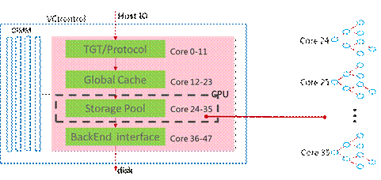

#### CPU智能动态负载均衡

传统的CPU分组技术能解决各个业务的冲突域问题，但是也带来了不同的场景下各个CPU分组间资源利用不均衡的问题。OceanProtect的动态负载均衡技术根据任务的计算开销不同差异化定义调度策略，使得任务在CPU内各核分组间实现负载均衡，将高密计算的任务与普通密度计算任务区分开来，作为各CPU分组间负载均衡的调度单元，防止任务间调度相互干扰有效提升任务执行流水效率。

**图 1**   
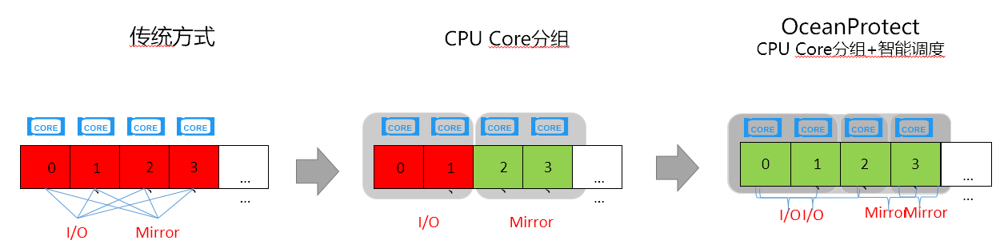

**表 1**  调度方式对比

<table><thead align="left"><tr id="zh-cn_topic_0000001254686142_row6155111752915"><th class="cellrowborder" valign="top" width="7.670000000000001%" id="mcps1.2.5.1.1">&nbsp;&nbsp;</th>
<th class="cellrowborder" valign="top" width="30.43%" id="mcps1.2.5.1.2">
传统方式

</th>
<th class="cellrowborder" valign="top" width="31.209999999999997%" id="mcps1.2.5.1.3">
CPU Core固定分组

</th>
<th class="cellrowborder" valign="top" width="30.69%" id="mcps1.2.5.1.4">
CPU Core分组 + 智能调度

</th>
</tr>
</thead>
<tbody><tr id="zh-cn_topic_0000001254686142_row1915511712915"><td class="cellrowborder" valign="top" width="7.670000000000001%" headers="mcps1.2.5.1.1 ">
优点

</td>
<td class="cellrowborder" valign="top" width="30.43%" headers="mcps1.2.5.1.2 ">
可以把CPU的所有Core资源充分调度和利用，适应业务频繁变化的场景

</td>
<td class="cellrowborder" valign="top" width="31.209999999999997%" headers="mcps1.2.5.1.3 ">
任务分组避免不同任务间相互干扰，减少资源跨CPU Core的频繁切换，提升CPU处理效率。

</td>
<td class="cellrowborder" valign="top" width="30.69%" headers="mcps1.2.5.1.4 ">
根据CPU Core的负载状态和待分发任务的分组属性，分发任务到适合的CPU Core。CPU Core实现负载均衡，无明显的CPU资源闲置浪费

</td>
</tr>
<tr id="zh-cn_topic_0000001254686142_row15155111722912"><td class="cellrowborder" valign="top" width="7.670000000000001%" headers="mcps1.2.5.1.1 ">
缺点

</td>
<td class="cellrowborder" valign="top" width="30.43%" headers="mcps1.2.5.1.2 ">
不同任务竞争CPU不同核的时间片，锁冲突高导致数据IO在不同核间频繁切换，导致CPU计算效率低，时延高且不稳定

</td>
<td class="cellrowborder" valign="top" width="31.209999999999997%" headers="mcps1.2.5.1.3 ">
CPU资源分组和任务绑定，难以适应多变的业务场景，导致部分CPU资源闲置浪费。

</td>
<td class="cellrowborder" valign="top" width="30.69%" headers="mcps1.2.5.1.4 ">
开发难度大。

</td>
</tr>
</tbody>
</table>

通过VNode、业务分组、核间免锁、CPU智能动态负载均衡四级众核扩展技术，实现了性能随控制器节点数、控制内CPU数、CPU内核数的性能准线性增长。下图是测试的性能随CPU核数增长的情况。

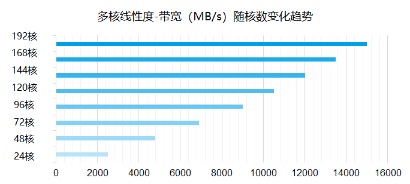

### 自研高效指纹算法

使用指纹专用NEON指令，优化代码逻辑，通过软硬结合等多种方式将多个指令流混合在一起，同时计算指纹。

Multi-buffer技术：算法同时进行两种不同的hash的计算，提供两片buffer。通过将两个指令流混合在一起，同时进行两次计算。此时，对CPU中的运算单元ALU的利用可以更加充分，从而达到提升性能的目的。使用multi-buffer技术，可以使用相同的计算资源，达到接近2倍的计算带宽。

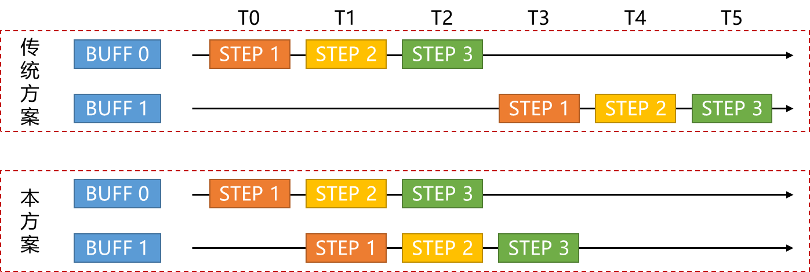

## 后端网络优化

### 多流分区技术

SSD内部使用NAND Flash来作为存储介质，其逻辑结构如下图所示。每个SSD盘由多个NAND Flash颗粒组成，每个NAND Flash颗粒包含多个Block，每个Block包含多个Page\(4KB或8KB\)。由于NAND的特性，Flash颗粒中的Block需要先擦除再写。擦除的单位是Block，在擦除前需要把该Block中的有效数据搬移走，对有效数据的搬移就产生了盘内写放大。

通过多流分区技术，对存储系统内的数据进行分类，不同类型的数据存放到SSD盘上不同的Block中，相同类型的数据同时为有效数据或者同时为垃圾数据的概率较大，减少了擦除Block时搬移（搬移需要一次读盘和一次写盘操作）的数据量，减少了盘内写放大，提升了SSD盘的写性能和寿命。

**图 1**  SSD盘内部逻辑结构  
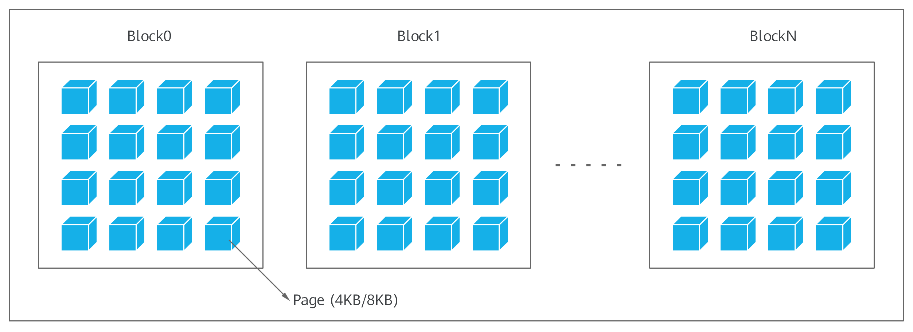

在SSD的垃圾回收过程中，对于每次擦除的Block，SSD硬盘期望该Block中所有数据都是无效数据，这样就可以直接擦除整个Block，而不用搬移有效数据，可以减少系统的写放大。而存储系统中不同数据具备不同的冷热程度。比如：系统的元数据更新频繁，属于热数据，成为垃圾的概率更高；而用户数据一般修改的频率要低，属于冷数据，成为垃圾的概率要低。多流写技术通过SSD驱动和控制器软件配合，冷热数据存放在不同的Block中，从而增加Block中数据同时无效的概率，达到减少垃圾回收（GC）过程中搬移有效数据的数据量，提升SSD的性能及可靠性。下面两个图为采用多流技术减少盘位写放大的原理示意图，[图2](#zh-cn_topic_0000001255686110_fig9448631122818)为未采用多流技术示意图，冷热数据混在同一个Block上，造成垃圾回收时搬移的数据量大。[图3](#zh-cn_topic_0000001255686110_fig1378514912319)为采用多流技术后，冷数据和热数据存在不同的Block上，减少垃圾搬移量。

**图 2**  冷热数据未分流垃圾搬移量  
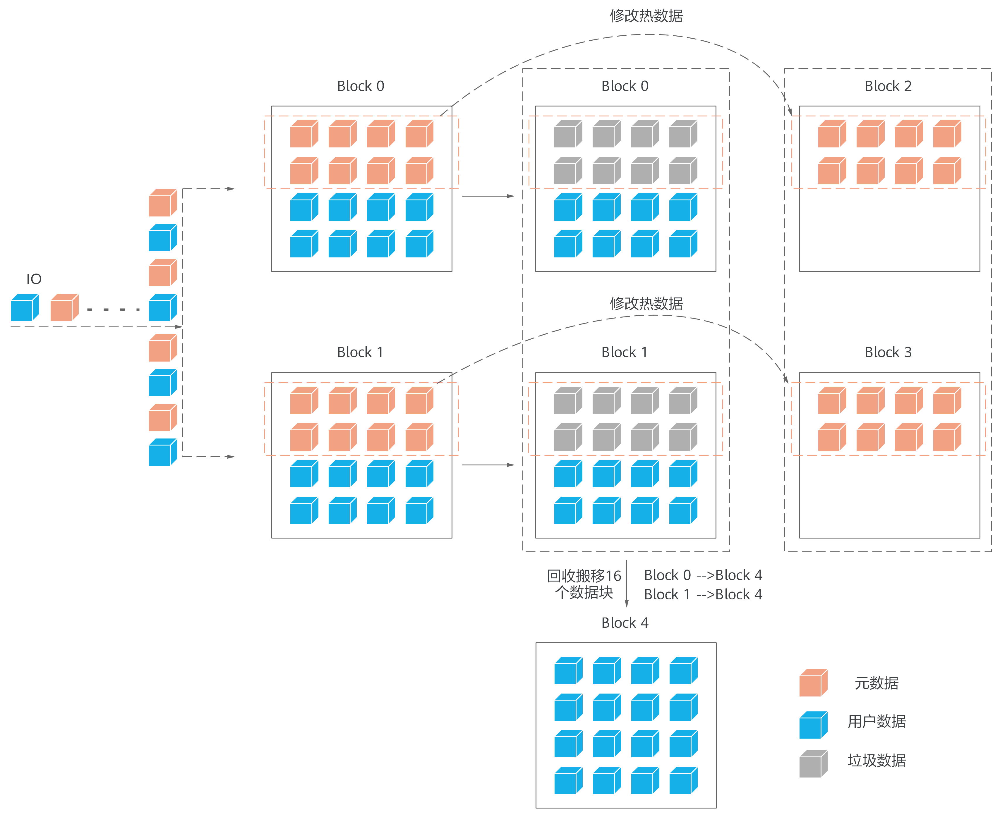

**图 3**  冷热数据分流的回收搬移量  
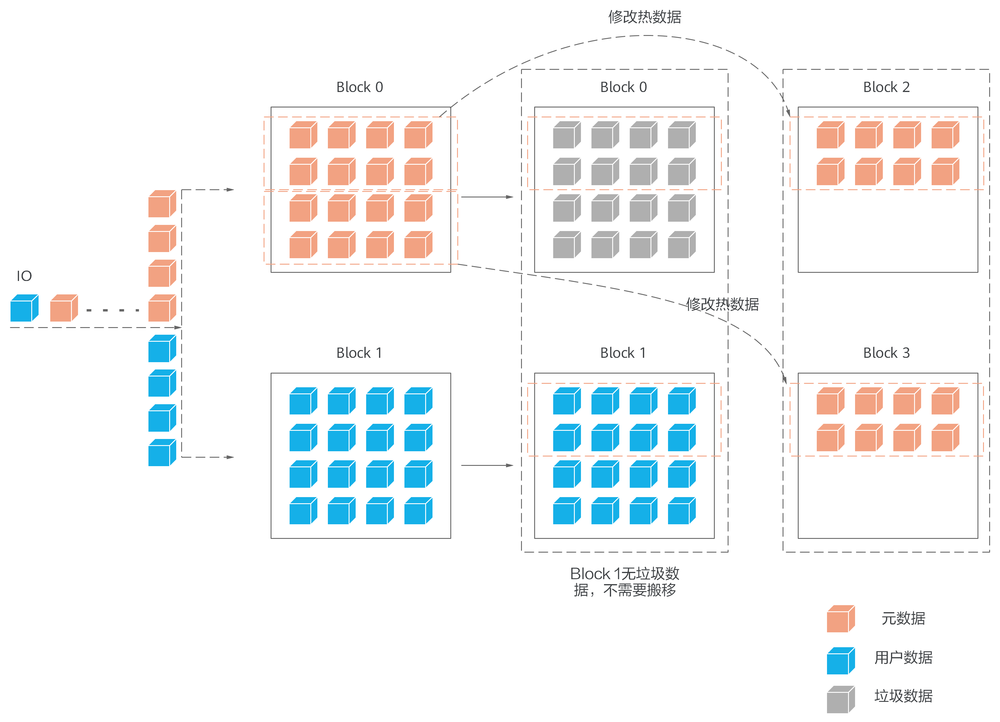

OceanProtect实现了三类冷热数据分流：元数据、新写的数据、垃圾回收搬移的有效数据。元数据最热，新写的数据中，如果长时间没有改写的，那么就会被垃圾回收搬移，这些被搬移的数据就是改动概率最小，最冷的数据。通过三类分流，减少了SSD盘写放大，极大提升GC回收效率，减少对SSD颗粒的写数据量，提升系统的写性能。延长SSD盘的寿命。

### 大块顺序写

备份任务的IO模型大部分是顺序写，但是在备份数据直接拉起业务的场景下，应用程序的IO模型大部分是随机IO写。对于随机写模型，传统RAID写流程会产生几倍的写放大惩罚，导致写性能下降很大。

OceanProtect通过对所有的写（包括新写数据和对老数据的改写等）都采用ROW（Redirect On Write）大块顺序写的方式，避免了传统RAID写流程所需的数据读和校验修改写而产生RAID写惩罚，有效降低了写入过程阵列控制器的CPU开销与对SSD盘的读写压力。同时通过ROW技术每次写通过分配新的Flash颗粒来写，实现每个Flash 颗粒擦写次数均衡，避免对固定地址的Flash颗粒反复擦写而耗尽Flash颗粒的寿命导致SSD快速故障。

相比传统的RAID覆盖写的方式，ROW大块顺序写方式解决了RAID写惩罚使得各种RAID级别都能实现高性能。客户在使用OceanProtect时只需要考虑业务的数据可靠性的要求而不需要考虑不同RAID基本对性能的影响，也使得RAID-TP的性能满足商用要求。

**图 1**  ROW大块顺序写  
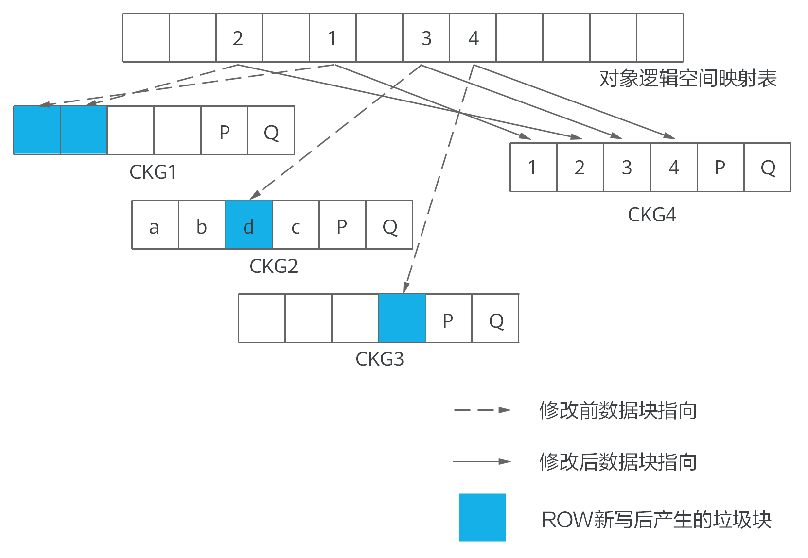

上图以RAID6（4+2）为例，对已有数据进行改写，改写写入的数据为1、2、3、4。采用传统的覆盖写方式，对每个数据所在的CKG均需要进行修改写。以CKG2为例，写入新数据3时，需要读取校验列P、Q和原始数据d，通过冗余算法计算出新的校验位P’、Q’，再把P’、Q’和数据3写入CKG2中。而采用ROW满分条写设计，写入数据1、2、3、4时，直接使用数据1、2、3、4计算出P、Q作为一个新的RAID分条写入硬盘，再修改LBA的指针指向新的CKG，整个过程无需额外的预读。

对于传统RAID，以RAID 6为例，D0数据发生变化，需要先读D0、P和Q；再写新的nD0、nP和nQ，因此其读放大是3，写放大也是3。通常对于传统RAID（xD+yP）的随机IO写其读写放大为y+1。

**图 2**  传统RAID6的写放大  
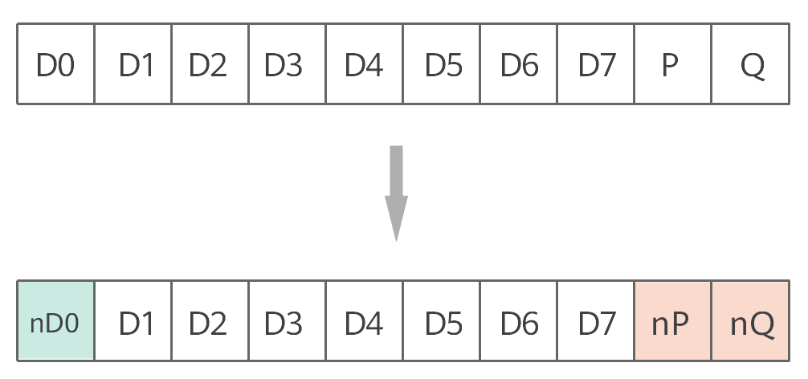

下表为各种传统RAID级别的写放大数据。

**表 1**  传统RAID的写放大

<table><thead align="left"><tr id="zh-cn_topic_0000001303166129_row63390755"><th class="cellrowborder" valign="top" width="30.826917308269174%" id="mcps1.2.5.1.1">
传统RAID类型

</th>
<th class="cellrowborder" valign="top" width="22.367763223677635%" id="mcps1.2.5.1.2">
随机IO写产生的写放大

</th>
<th class="cellrowborder" valign="top" width="25.46745325467453%" id="mcps1.2.5.1.3">
随机IO写产生的读放大

</th>
<th class="cellrowborder" valign="top" width="21.33786621337866%" id="mcps1.2.5.1.4">
顺序写IO写放大

</th>
</tr>
</thead>
<tbody><tr id="zh-cn_topic_0000001303166129_row281173"><td class="cellrowborder" valign="top" width="30.826917308269174%" headers="mcps1.2.5.1.1 ">
RAID6(14D+2P)

</td>
<td class="cellrowborder" valign="top" width="22.367763223677635%" headers="mcps1.2.5.1.2 ">
3

</td>
<td class="cellrowborder" valign="top" width="25.46745325467453%" headers="mcps1.2.5.1.3 ">
3

</td>
<td class="cellrowborder" valign="top" width="21.33786621337866%" headers="mcps1.2.5.1.4 ">
1.14（16/14）

</td>
</tr>
<tr id="zh-cn_topic_0000001303166129_row375211484411"><td class="cellrowborder" valign="top" width="30.826917308269174%" headers="mcps1.2.5.1.1 ">
RAID-TP（传统RAID不支持）

</td>
<td class="cellrowborder" valign="top" width="22.367763223677635%" headers="mcps1.2.5.1.2 ">
-

</td>
<td class="cellrowborder" valign="top" width="25.46745325467453%" headers="mcps1.2.5.1.3 ">
-

</td>
<td class="cellrowborder" valign="top" width="21.33786621337866%" headers="mcps1.2.5.1.4 ">
-

</td>
</tr>
</tbody>
</table>

OceanProtect在典型场景下RAID5采用11D+1P（D为数据列，P为校验列），RAID 6 采用 22D+2P（P、Q校验列），RAID-TP为21D+3P（P、Q、R校验列），下图展示了采用ROW满分条写在典型场景下的写放大比较。

**表 2**  ROW大块顺序写放大率

<table><thead align="left"><tr id="zh-cn_topic_0000001303166129_row1764810575611"><th class="cellrowborder" valign="top" width="29.292929292929294%" id="mcps1.2.5.1.1">&nbsp;&nbsp;</th>
<th class="cellrowborder" valign="top" width="24.242424242424242%" id="mcps1.2.5.1.2">
随机IO写产生的写放大

</th>
<th class="cellrowborder" valign="top" width="25.252525252525253%" id="mcps1.2.5.1.3">
随机IO写产生的读放大

</th>
<th class="cellrowborder" valign="top" width="21.21212121212121%" id="mcps1.2.5.1.4">
顺序写IO写放大

</th>
</tr>
</thead>
<tbody><tr id="zh-cn_topic_0000001303166129_row20649258569"><td class="cellrowborder" valign="top" width="29.292929292929294%" headers="mcps1.2.5.1.1 ">
RAID 6（22D+2P）

</td>
<td class="cellrowborder" valign="top" width="24.242424242424242%" headers="mcps1.2.5.1.2 ">
1.09（24/22）

</td>
<td class="cellrowborder" valign="top" width="25.252525252525253%" headers="mcps1.2.5.1.3 ">
0

</td>
<td class="cellrowborder" valign="top" width="21.21212121212121%" headers="mcps1.2.5.1.4 ">
1.09

</td>
</tr>
<tr id="zh-cn_topic_0000001303166129_row964915155611"><td class="cellrowborder" valign="top" width="29.292929292929294%" headers="mcps1.2.5.1.1 ">
RAID-TP （21D+3P）

</td>
<td class="cellrowborder" valign="top" width="24.242424242424242%" headers="mcps1.2.5.1.2 ">
1.14（24/21）

</td>
<td class="cellrowborder" valign="top" width="25.252525252525253%" headers="mcps1.2.5.1.3 ">
0

</td>
<td class="cellrowborder" valign="top" width="21.21212121212121%" headers="mcps1.2.5.1.4 ">
1.14

</td>
</tr>
</tbody>
</table>

OceanProtect实现的RAID 6相对RAID 5性能下降5%以内，RAID-TP的性能相对RAID 6性能下降5%以内。

OceanProtect采用更大的RAID条带，在保证数据可靠性的基础上提升RAID空间利用率。下图展示了传统RAID和OceanProtect备份一体机在RAID空间利用率的对比。

**表 3**  RAID空间利用率对比

<table><thead align="left"><tr id="zh-cn_topic_0000001303166129_row115272221917"><th class="cellrowborder" valign="top" id="mcps1.2.6.1.1">&nbsp;&nbsp;</th>
<th class="cellrowborder" colspan="2" valign="top" id="mcps1.2.6.1.2">
传统RAID技术

</th>
<th class="cellrowborder" colspan="2" valign="top" id="mcps1.2.6.1.3">
OceanProtect RAID技术

</th>
</tr>
</thead>
<tbody><tr id="zh-cn_topic_0000001303166129_row189533492819"><td class="cellrowborder" valign="top" width="15.25%" headers="mcps1.2.6.1.1 ">
RAID级别

</td>
<td class="cellrowborder" valign="top" width="18.04%" headers="mcps1.2.6.1.2 ">
最大RAID条带

</td>
<td class="cellrowborder" valign="top" width="19.56%" headers="mcps1.2.6.1.2 ">
RAID空间利用率

</td>
<td class="cellrowborder" valign="top" width="22.93%" headers="mcps1.2.6.1.3 ">
最大RAID条带

</td>
<td class="cellrowborder" valign="top" width="24.22%" headers="mcps1.2.6.1.3 ">
RAID空间利用率

</td>
</tr>
<tr id="zh-cn_topic_0000001303166129_row3527142214118"><td class="cellrowborder" valign="top" width="15.25%" headers="mcps1.2.6.1.1 ">
RAID 6

</td>
<td class="cellrowborder" valign="top" width="18.04%" headers="mcps1.2.6.1.2 ">
12+2

</td>
<td class="cellrowborder" valign="top" width="19.56%" headers="mcps1.2.6.1.2 ">
85.7%

</td>
<td class="cellrowborder" valign="top" width="22.93%" headers="mcps1.2.6.1.3 ">
23+2

</td>
<td class="cellrowborder" valign="top" width="24.22%" headers="mcps1.2.6.1.3 ">
92%

</td>
</tr>
<tr id="zh-cn_topic_0000001303166129_row1252762216114"><td class="cellrowborder" valign="top" width="15.25%" headers="mcps1.2.6.1.1 ">
RAID-TP

</td>
<td class="cellrowborder" valign="top" width="18.04%" headers="mcps1.2.6.1.2 ">
NA

</td>
<td class="cellrowborder" valign="top" width="19.56%" headers="mcps1.2.6.1.2 ">
NA

</td>
<td class="cellrowborder" valign="top" width="22.93%" headers="mcps1.2.6.1.3 ">
22+3

</td>
<td class="cellrowborder" valign="top" width="24.22%" headers="mcps1.2.6.1.3 ">
88%

</td>
</tr>
</tbody>
</table>

OceanProtect可以同时提供更高的数据可靠性以及更高的空间利用率。

## 备份软件性能优化

### 数据直通存储

传统的备份技术，通常将备份数据流使用Agent或Proxy捕获生产上的待备份数据，数据被捕获后通过与备份服务端的MediaServer节点通过，将数据传输到MediaServer进行加密、切片等重新布局处理，然后在将处理过后的数据放入存储系统，这种处理流程下的IO路径过长，导致备份数据经过了一层没有必要的处理流程，最终导致性能损伤或需要大规模扩展Media Server。

open-eBackup采用数据直通存储的技术，备份数据通过Agent或Proxy进行捕获，捕获后的数据直接已原始格式写入一体化存储设备，存储设备对数据进行加密、重删等处理，节省了备份数据的传输次数，节省中间的处理过程，提升备份效率。

**图 1**  数据直通存储  

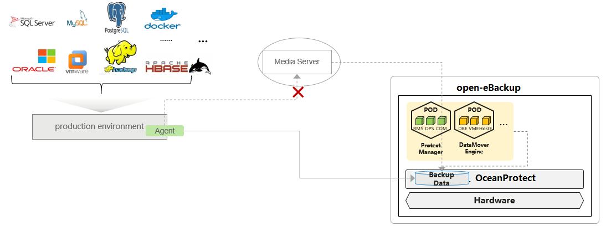

### 分布式并行流备份

**图 1**  多节点分布式并行流，实现PB级超大规模集群的备份/恢复  
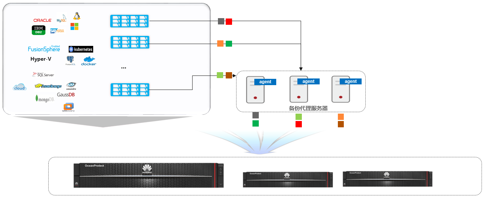

open-eBackup备份软件针对大数据量应用，为提升备份带宽，将任务拆分为多个子任务并分摊到多个节点内，最大程度利用多节点的计算和传输能力，以满足PB级数据量的备份性能诉求。

虚拟化/云/容器类应用并发：将虚拟机/容器/云主机整机任务拆分为多个磁盘任务，以磁盘子任务粒度分摊到多个备份代理节点上。

大数据生态类应用并发：以文件粒度（HDFS）或表级粒度（HBASE/Hive）拆分为多个子任务，并分摊到多个备份代理节点上。

DWS数仓备份：以节点生成的备份对象粒度分摊到多个open-eBackup备份系统上。

## 备份存储性能优化

针对上层备份业务数据的多路大块顺序写+大块顺序读的IO模型特征，OceanProtect存储层进行了控制器内的端到端的优化设计：大颗粒的数据分片，减少单位空间管理元数据的数量，提升大带宽顺序读写的元数据处理效率，同时减少元数据处理的CPU开销让渡给其他业务，达成提升性能效果。减少了元数据的数量同时减少了元数据占用的存储空间，在备份场景的高数据缩减率背景下，最终元数据的空间占用整个存储空间的比例明显减少，减少元数据数量能带来明显的空间节省效果，减少存储空间。

对于变长分片算法的应用，输入的连续数据块越大，最终计算后切分的数据分段的重删效果越好，但是这个数据并非是线性增长关系，通过大量的实验数据分析，我们选择了4MB大小的数据块作为OceanProtect备份一体机的变长分片输入。基于备份应用的顺序写特征，我们通过存储的写cache的缓冲效应汇集顺序写业务流的数据，在cache中聚齐4MB大小的数据块后把4MB的数据一次传输给变长分片模块，然后由变长分片模块进行数据分片计算以获得较高的数据重删率。对于非顺序流的写请求，不进行4MB同时大块的数据处理单元，相对小数据块减少了单位时间内的写次数，减少了系统流程的处理开销，提升了系统后端和写硬盘的性能。

### 为备份任务和恢复任务定制

备份任务一般情况下是按照备份任务生成的文件的逻辑地址顺序写入，备份恢复时大部分的IO都是按照文件逻辑地址顺序读取，读数据的顺序与写数据的顺序基本一致。open-eBackup备份软件对这个特性专门设计了一套数据布局架构。

传统的重删架构以数据块的指纹表为中心进行数据布局，顺序的数据经过重删后，会按照指纹进行打散存放，盘上数据按照指纹归属存放，与LBA顺序无关。扰乱了业务数据的顺序性。这种方式适合全SSD存储，但是在HDD为存储介质的存储上，HDD盘随机访问的性能差，将会影响写数据的重删查找和恢复性能。

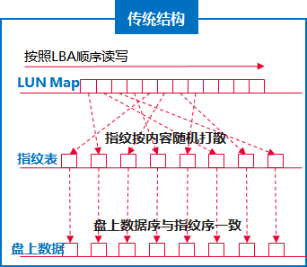

OceanProtect针对备份任务执行时一般是按照生成备份文件的逻辑地址顺序写，备份任务恢复时一般按照备份文件的逻辑地址顺序读的特点，结合HDD盘顺序读写性能高，随机读写性能低的特点。专门设计了以ID为中心的三层元数据结构，解决重删扰乱数据布局的顺序性导致HDD盘乱序读盘性能差的问题。

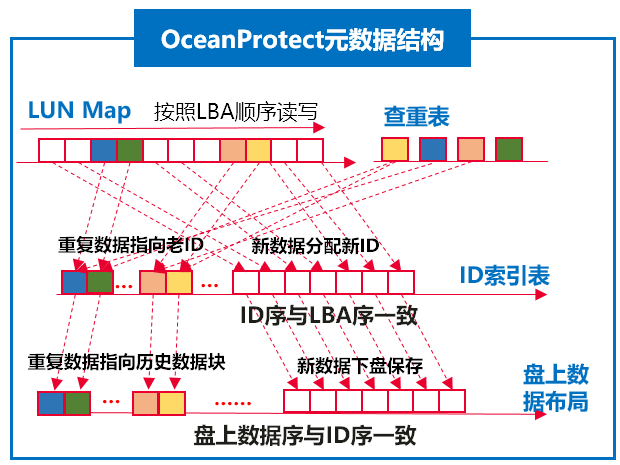

基于备份软件的备份任务是顺序写，恢复任务也是顺序读的业务特点，引入ID元数据，ID元数据采用批量申请和分配，保证ID的分配顺序性和写入的LBA地址顺序性一致。将指纹的查重功能和地址索引功能分离，分成查重表和ID索引表。通过ID与LBA同序，盘上数据布局与ID同步，保证HDD盘上存放的元数据和数据与主机访问顺序同序。

如上图所示，文件级的顺序写数据在经过变长分片后，进行重删指纹计算和查找，重复的数据，LBA直接指向已有ID，新数据块按照LBA地址进行排序后分配新ID，新分配的ID顺序递增，永不复用。新数据经过压缩后下盘，新数据在存储介质上按照新数据ID的顺序排布。从端到端的结果看，备份软件写入的顺序数据，经过重删后需要保存的新增数据块在存储介质上也是顺序保存的。这样的设计有两个重要优势：1、备份性能优化，存储系统写存储介质的IO是顺序写，发挥HDD高带宽的优势，提升整个系统的性能。2、备份恢复性能优化，备份软件新进数据恢复时的顺序，经过ID的转换后变成对存储介质的大块顺序读，一次读取一大段数据，因为存储介质上的数据是按照备份软件的写入顺序排布的，所以系统自发的从存储介质上一次读取一大段顺序数据，如果多读取的数据当前读IO不需要，多读取的数据进入读cache缓存，但是只要备份软件的恢复任务没有终止，前面系统多读取的数据大概率是可以在很快一段时间内被备份软件后续的顺序读请求命中，从而提升系统的恢复性能。

### 恢复性能优化

备份系统随着备份次数的增加以及增量备份与全量备份时的重删关系，会使后写入的备份数据的重删数据的物理排布越来越离散，导致恢复读性能会逐渐变差；其次备份恢复的使用场景决定了最新写入的备份数据用于恢复的概率最高，但是其恢复性能因为在HDD盘上布局的离散性大往往最差，导致用户在遇到数据丢失或突发状况时的恢复时间往往无法接受。为构筑OceanProtect的性能优势，打造用户数据的即时恢复能力，华为创新研发出针对备份数据恢复性能的局部性整理算法。

由于最新的备份数据往往会重删在早期多次的备份数据上，所以在恢复最新一次备份时需要多次随机读取老备份上的数据，引入大量的随机读操作，从而导致HDD的读性能较低。局部性整理算法的核心在于减少备份恢复时的随机读操作。如图：[局部性整理效果](#zh-cn_topic_0000001254686150_fig8289162517143)

**图 1**  局部性整理效果演示  
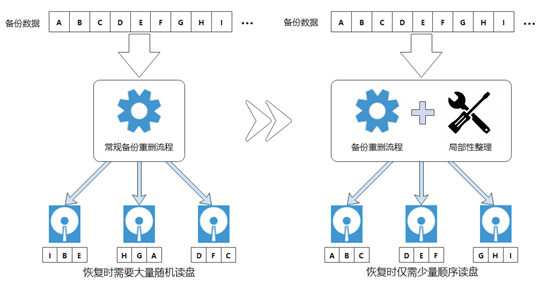

具体实现是通过在备份数据写入过程中实时的计算数据的离散度（混乱程度），再根据该部分数据在恢复时会引入的盘上随机操作次数判断是否要对该部分数据在盘上的排布进行调整。最后对待整理数据的盘上布局进行调整时，不同于传统新备份引用老备份数据的方式，局部性整理会将老备份引用到新备份的数据上，并删除老备份写入的重复数据块。如图 2[图2](#zh-cn_topic_0000001254686150_fig253252851513)所示。从而在执行恢复最新备份时，只需顺序读最新备份上的数据与顺序读部分老备份上的数据，减少随机读带来的恢复性能降低问题。

**图 2**  局部性整理后备份间数据引用关系  
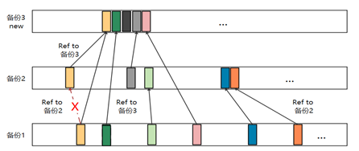

# 系统可靠性设计（配合OceanProtect备份介质）

OceanProtect通过数据可靠性设计、业务可用性设计保证，为用户提供最高6个9的可用度。Acitve-Active+分布式架构，支持接口卡、控制器、硬盘故障，业务不中断，备份应用不感知，确保每一次备份时间窗稳定完成备份任务。

## 数据可靠性设计

针对主机写入到存储的数据，OceanProtect会经历（1）数据缓存，（2）盘上持久化，（3）数据路径传输三个过程。下面我们分别对这三个过程的数据可靠性措施进行说明。

**图 1**  数据可靠性全景  
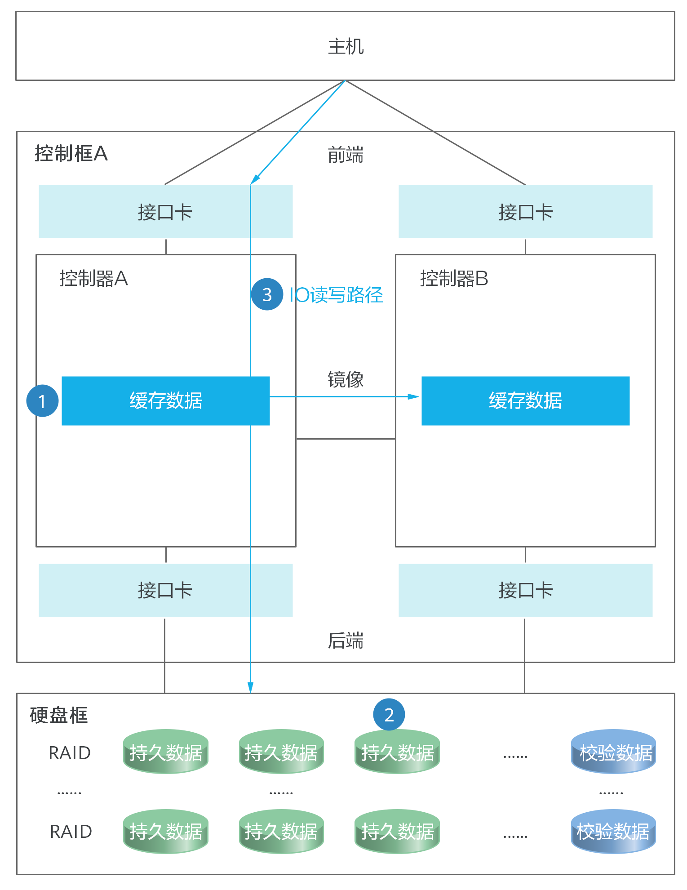

### 缓存数据可靠性保证

为了提升写入数据的速度，OceanProtect提供了写缓存机制。即数据写入到控制器的内存缓存及其跨控的副本就向主机返回成功，然后后台将缓存数据下盘。

储存于控制器内存中的用户数据，一旦遇到系统掉电或是控制器故障，将存在内存数据丢失进而导致内存数据丢失的风险。为了应对上述故障模式，系统提供了写数据镜像和掉电保护功能保证数据可靠性。

#### 写数据镜像

华为全系列备份一体机支持写数据镜像模式。

主机写入的数据先写入两个控制器的保电cach后，返回主机写成功。如果发生一个控制器故障或者复位的场景，剩下的控制器保存了故障控制器的脏数据镜像，可以直接接管故障控制器的业务核脏数据，业务不中断，数据不丢失。

#### 掉电保护

OceanProtect内置了BBU模块（备电），当存储阵列在供电故障后，能利用BBU模块将各控制器内存中的缓存数据刷入到保险箱中。待阵列电力恢复后，系统在启动时，再将保险箱中的缓存数据恢复到内存，保证数据不丢失。控制器上软件模块在监测到控制器拨出后，能利用控制器上的BBU模块（备电），将用户缓存数据备份到保险箱中（掉电场景下持久化写缓存中数据的空间），保证数据的完整性。系统的掉电刷保险箱流程，由底层系统完成，不依赖上层软件单元，确保了刷盘过程不会受业务影响，进一步提升了用户数据的可靠性。

### 持久数据可靠性保证

OceanProtect通过盘内RAID技术保证单盘数据可靠性，保证盘内数据不丢失；通过系统RAID2.0+技术、缩列重构保证系统级的数据可靠性，即冗余范围内的单盘故障，多盘故障也不会导致数据丢失或是冗余度下降。

#### 盘内RAID

硬盘除了会出现整体故障外，用于存储数据的颗粒也会出现区域性损坏，我们称之为静默失效（坏块）。这些坏块不会体现为单盘故障，但会导致盘上相应的数据无法访问。

通过常规的坏块扫描可以提前发现静默失效数据并进行修复，但因为扫描对盘访问会占用较多资源，为了避免影响前台业务，扫描速率必须有所控制，在盘容量且数量较大时，扫描一次花费时间少则数周，多则数月才能完成所有盘的扫描工作。而在扫描间隔期间，出现坏块并叠加盘故障，则可能导致数据损坏无法恢复。

在坏块扫描基础之上，为了应对扫描隔离内的静默失效问题，OceanProtect结合华为自研的HSSD\(Huawei SSD\)，提供了盘内RAID特性。即针对盘内的数据，以Die为单位建立RAID，通过RAID4形成冗余，容忍单个Die失效，盘内数据不丢失。

**图 1**  SSD盘内RAID  
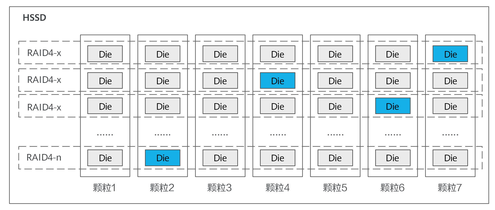

#### RAID2.0+

传统RAID的存储系统中RAID组的成员盘是固定的几个物理盘，用户使用的LUN/FS从某一个RAID组中划分。由于系统中每个LUN/FS的访问频度不同，这就导致系统中一部分RAID组中的硬盘异常繁忙，形成“热点”，而其它RAID组的硬盘即使空闲，也无能为力。另外，硬盘如果长期工作，它的故障率就会明显升高，结果快速故障。因此，传统RAID存储系统中的“热点”硬盘，时刻面临负载不均和部分盘着“过劳死”的风险。

OceanProtect将每个SSD盘切分成固定大小的Chunk（简称CK，大小为4MB），将所有盘上Chunk按RAID冗余组成Chunk组，形成RAID2.0+，相对于传统RAID机制，RAID2.0+具备如下优势：

-   业务负载均衡，避免热点。数据打散到资源池内所有硬盘上，没有热点，硬盘负荷平均，避免个别盘因为承担更多的写操作而提前达到寿命的上限。
-   快速重构，缩小风险窗口。当硬盘故障时，故障盘上的有效数据会被重构到资源池内除故障盘外的所有盘上，实现了多对多的重构，速度快，大幅缩短数据处于非冗余状态的时间。
-   全盘参与重构。资源池内所有硬盘都会参与重构，每个盘的重构负载很低，重构过程对上层应用无影响。

##### 盘级冗余RAID

盘级冗余以盘为单位进行RAID成员选盘，满足RAID2.0+，均衡随机选盘，每个Chunk组，在每个盘上最多选1个Chunk，能保证冗余内盘数故障后数据不丢失，比如4个硬盘框，每硬盘框25硬盘，共100块硬盘，RAID6能保证任意坏2块盘业务不中断，RAID-TP能保证任意坏3块盘业务不中断。

#### 缩列重构

当硬盘域因为连续盘故障，盘更换等原因导致可用成员盘数小于RAID成员盘数时，将导致原有的重构无法进行，用户数据冗余无法保证。为了应对上述问题，OceanProtect重构采用动态RAID重构（缩列重构）。即存储池总的可用硬盘小于RAID成员盘数，缩列重构时保持M（校验列）不变，减少N（数据列）的方式进行重构，重构前后RAID校验列数不变，数据列数变少。缩列重构完成后，RAID组成员盘数减少，但是RAID冗余级别不变。

故障盘更换完成后，系统会根据存储池内的可用硬盘数，增加N（数据列），新写数据就会采用新的RAID方式，故障期间写的数据也会逐渐转换为新的RAID方式。

> **说明：** 
>缩列重构会导致系统的总可用容量降低，当出现多盘故障时请务必及时处理盘故障并关注存储池使用利用率情况。

#### 后台数据一致性扫描

OceanProtect备份一体机提供了自动的周期性的后台数据一致性扫描功能。后台扫描速度和主机业务压力互斥。后台数据一致性扫描功能会按照系统记录的硬盘驱动器空间使用位图进行顺序扫描，数据从硬盘驱动器读取后进行DIF效验+RAID分条一致性效验+矩阵效验，发现问题后系统自动后台进行数据修复，修复失败会上报数据损坏告警，可以联系华为工程师进行人工深度修复。

后台数据一致性扫描功能主要用于保护数据长期存储可能出现的静默失效问题。解决数据长生命周期保护问题。后台数据一致性扫描功能可以通过CLI命令手动关闭和开启。

### IO路径数据可靠性保证

数据在存储系统内部传输时，会经过了多个部件、多种传输通道和复杂的软件处理，其中任意一个错误都可能会导致数据错误。如果这种错误无法被立即检测出来，就可能将这些错误的数据写入到持久化的盘、内部计算或是将错误的数据返回给主机，造成业务异常。

为了解决上述问题，OceanProtect通过端到端PI功能保证传输路径数据错误（数据块内部跳变）能被检测出来并纠错。通过矩阵校验功能保证数据整体跳变（整块数据被老数据或其它数据覆盖）也能被检测出来。通过上述措施，保证IO路径数据可靠性。

#### 端到端PI

OceanProtect通过支持ANSIT10 PI（Protection Information）来保证存储系统内部的数据完整性保护。当数据从主机下发到达阵列后，阵列会在收到数据后，首先对每512个字节插入8字节的PI，然后再做内部处理。

数据在达到盘以后，盘本身会对数据进行PI校验，保证数据在从前端接收（插入PI）到下盘这段时间出现跳变或改写能被校验出来。如下所示：绿色的点表示对数据插入PI，蓝色的点表示对512字节的数据计算PI并与存储的8字节的PI比对，识别数据是否出现错误。

**图 1**  端到端PI  
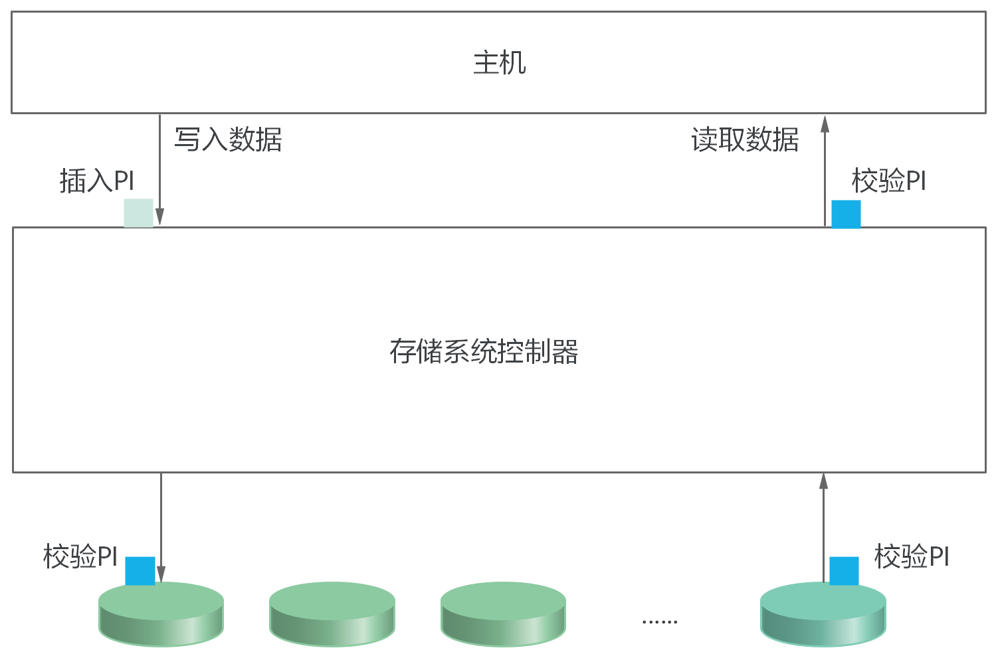

当主机读取数据时，为了防止盘上数据跳变，盘在读取数据后会对数据进行校验，一旦出错会通知上层控制器软件通过RAID冗余恢复跳变前的数据。为了防止数据在盘-阵列前端返回之间路径出现问题，会在向主机返回前再次校验数据是否跳变，一旦出现问题会降级读（通过RAID的其它成员盘计算出错误盘上的数据）恢复故障数据，从而端到端保证了阵列前端到后端数据可靠性。

#### 矩阵校验

盘本身内部结构复杂或是读盘路径较长（经历多个硬件部件），极有可能出现硬件内部软件原因导致漏写\(新数据未写到盘却返回成功，盘上为老数据\)，整体读偏（读取A数据却返回了B数据）或写偏（本该写入A地址的数据写到了B地址）的情况发生。一旦出现此类错误，通过数据本身的PI校验必然通过，如果继续使用，则可能导致向主机返回错误的数据\(如老数据\)。

**图 1**  父子校验  
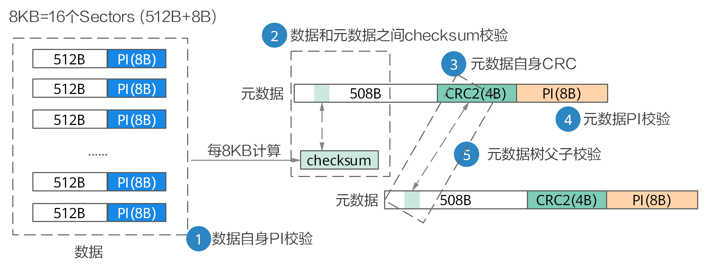

为了应对盘可能出现的漏写，读偏，写偏，OceanProtect提供了矩阵校验。如上图所示：每个数据是由512字节的数据和8字节PI构成，其中PI内的2个字节作为CRC检验，横向保证512数据的可靠性（保护点1）。我们将16个用户数据PI区中的CRC提取出来，计算CRC形成checksum，然后存储在其归属的元数据节点中。一旦单个或多个数据\(512+8\)出现整体偏移，因为其PI区也产生变化，会导致16个数据计算的checksum也发生变化，这样就和其元数据中存储的checksum不一致。纵向保证了数据的可靠性。系统检测到数据损坏后，通过RAID冗余恢复故障数据，形成矩阵校验。

## 业务可用性设计

在主机访问阵列的整个路径，存储阵列提供了多重冗余保护能力。即在IO经过的接口模块或链路（1）；控制板（2）；存储介质（3）出现单点故障，都能通过冗余部件和和容错措施保证备份业务不中断，不需要人工干预。

**图 1**  系统多冗余设计  
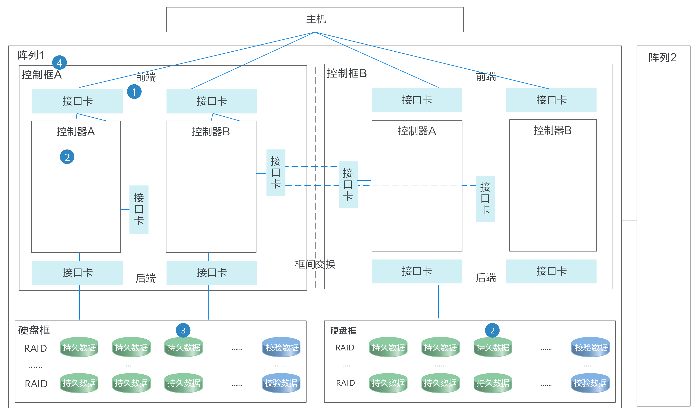

### 接口模块/链路冗余保护

OceanProtect是一个全冗余的系统。对接主机的前端，连接硬盘的后端，以及控制器之间的通讯，均有链路/接口模块冗余保护。通过前端共享卡与主机建立连接，当控制器故障或是更换时，由于主机或前端共享卡连接未中断，因此不会导致重新建连。待剩下的控制器接管业务后，共享卡将重试或是新的IO下发到接管控制器，保证业务连续性。

### 控制器冗余保护

OceanProtect为存储的关键部件控制器提供了高冗余的可靠性保证。典型场景下，缓存数据除在当前控制器存在外，还会选择另外一个控制器作为其副本，确保单控制器故障时，业务能切换到冗余的缓存副本归属控制器，保证业务连续性。

备份软件容器实例冗余保护

华为OceanProtect X3000/X6000/X8000中的备份业务功能通过全容器化部署，按照控制器节点进行冗余，每个控制器中均部署备份业务实例，当一个控制框内的业务故障时，另一个控制器上的备份服务将接管业务。

**图 1**  节点冗余  
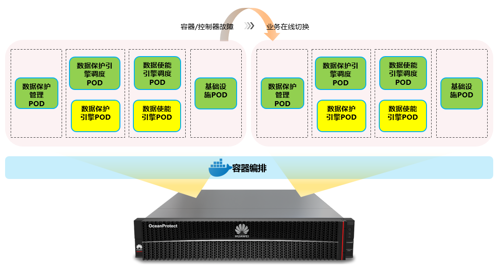

#### 持续镜像

华为OceanProtect高端型号提供了持续镜像功能。举例：A控故障，B控的缓存数据选择C控或者D控做缓存镜像；当控制器D再故障，选择B控和C控做缓存镜像，提供了4坏3的业务高可用能力。这样的设计保证了即使单控制器故障，客户未及时更换，再次出现控制器故障，也不会导致数据丢失和业务中断，最大限度的保证了业务连续性。

当单控故障，其承载的业务快速切换到镜像控制器，剩余的控制器重新建立数据的镜像关系。业务请求可以保持回写\(不透写\)，保障了系统性能，同时数据镜像冗余保障了系统的数据可靠性和业务连续性。

### 存储介质冗余保护

OceanProtect除了保证单盘本身的高可靠性之外，还利用多盘冗余能力保证单盘故障损坏后的业务可用能力。即通过算法及时发现单盘故障或是亚健康，及时隔离，避免长期影响业务，然后再利用冗余技术恢复故障盘数据，持续对外提供业务能力。

#### 盘故障快速隔离

OceanProtect在盘正常运行过程中，会监测在位/复位信号，当盘因为更换拨出/故障时，软件感知后能快速响应此事件，将不在位/故障的盘进行隔离，新的IO在其它盘触发写入，读IO则通过降级读后向主机返回。

另外，经过长时间的不间断工作，硬盘会出现部分器件老化、颗粒失效等，此时硬盘响应I/O的速度比较慢，并可能影响到业务。这时响应慢的硬盘会被快速检测并隔离，避免对业务造成进一步的影响。

OceanProtect的慢盘快速检测与隔离基于聚类算法，对硬盘类型、接口类型、所属硬盘域进行类的划分，按类统计硬盘I/O的平均服务时间，并建立模型进行横向比较，在较短周期内检测出慢盘并从业务中隔离，减少慢盘影响主机业务时间。

#### 多盘冗余

OceanProtect支持如下方式配置RAID。客户可以通过以下配置，支持不同数量盘故障后的业务连续性。当前系统最大可支持存储池内任意3块硬盘同时故障，数据不丢失，业务不中断能力。

-   RAID 5采用EC-1算法，每个校验条带生成1个校验数据，支持同时坏1盘；
-   RAID 6采用EC-2算法，每个校验条带生成2个校验数据，支持同时坏2盘；
-   RAID-TP采用EC-3算法，每个校验条带生成3个校验数据，支持同时坏3盘。

## 数据备份软件可靠性设计

### 容器实例冗余保护

华为OceanProtect X6000/X8000中的备份业务功能通过全容器化部署，按照控制器节点进行冗余，每个控制器中均部署备份业务实例，当一个控制框内的业务故障时，另一个控制器上的备份服务将接管业务。

**图 1**  节点冗余  

# 数据缩减功能（配合OceanProtect备份介质）

OceanProtect支持多种重删压缩功能，支持后端在线重删，源端重删、复制链路重删；重删压缩技术采用多层变长分片提升去重率，支持合并压缩、数据压紧、数据重排等技术提升压缩率。

SmartDedupe是重复数据删除技术，完全相同的数据块在存储时只保留一份数据块，其他数据直接引用同一份相同的数据块，以此减少数据的存储空间。

SmartCompression是数据压缩技术，数据在写入存储介质前先经过无损压缩算法进行压缩后把压缩后的数据块写入存储介质，以此减少数据的存储空间。

OceanProtect的SmartDedupe&SmartCompression特性采用先重删再压缩的设计。重删采用在线变长重删技术，压缩采用华为专有的高效压缩算法+压缩后数据字节级压紧存储技术。本章主要介绍重删压缩的实现原理。

**图 1**  重删压缩处理流程  

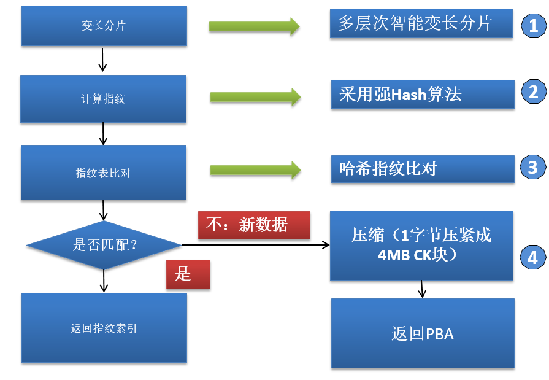

1.  用户写入数据时，先进行变长分片处理：系统根据多层次智能变长分片的算法，对写入的数据进行指纹特征计算，根据计算结果对数据块进行变长分片，把连续的数据块切分成不等长的数据。
2.  数据重删流程，经过变长分片切分后的数据块经过强哈希算法的计算生成指纹。
3.  用哈希指纹进行指纹比对，如果在系统的指纹库中找到完全一样的指纹，说明本次写入的数据块是重复数据，更新数据应用计数后返回已经存在的指纹索引。
4.  如果哈希指纹在指纹数据库中找不到完全一致的，证明本次写入的数据块是新数据。进入后续的压缩流程+写盘流程。

## 数据预处理

备份软件写入的数据一般包含元数据和客户备份数据。部分备份软件会把元数据和备份数据合并在一个文件中，元数据散布到整个文件中。元数据包含时间戳、校验等随机数据，因此元数据本身的重删率很低。如果把元数据和客户备份数据放在一起进行重删会降低整体数据的重删效果。

OceanProtect针对备份软件的备份数据和元数据布局做了特征识别处理，把备份软件插入的元数据和备份数据分离，用户数据做聚合后进行变长分片重删，元数据单独做压缩处理。从而提升整体的数据缩减率。如下图：[图1](#zh-cn_topic_0000001303166113_fig86397219717)

**图 1**  备份软件数据预处理  
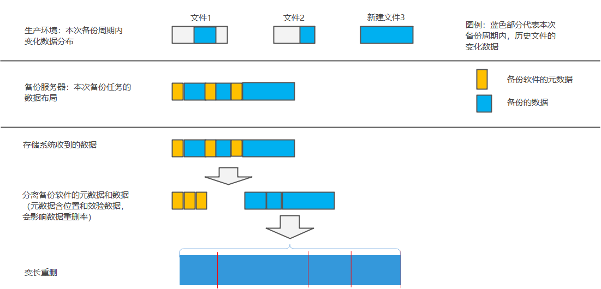

## 重复数据删除

### 源端重删

OceanProtect源端重删有两类技术：通用源端重删技术和应用感知的源端重删技术（即虚拟合成全量技术）：

通用源端重删技术不区分应用、不区分是全量、还是增量备份，对所有数据进行数据分片，数据计算指纹和数据查重，已经存在备份系统的数据只传输元数据，非重复数据传输数据，从而达到减少数据传输量的目的；

应用感知的源端重删技术是指针对备份业务特征产生的，备份业务有全量备份、增备备份和差异备份；与通用源端重删技术相似，应用感知的源端重删技术的主要受益在全量备份场景，通过将变化数据与存储端已有的数据进行整合形成全量副本，避免已经存在的数据的再次传输，从而达到减少数据传输量的目的；

#### 通用源端重删DataTurbo

**图 1**  通用源端重删DataTurbo  

通用源端重删技术不区分应用、不区分是全量、还是增量备份，对所有数据进行数据分片，数据计算指纹和数据查重，已经存在备份系统的数据只传输元数据，在后端增加索引计数，从而达到减少数据量传输目的；这种源端重删技术很好的减少了数据传输数据量，提升了备份性能；但是需要对所有数据进行数据分片和查重，增加了Host的资源开销。为解决这种问题，OceanProtect提供了一种应用感知的源端重删技术。

#### 应用感知的源端重删

**图 1**  应用感知的源端重删  
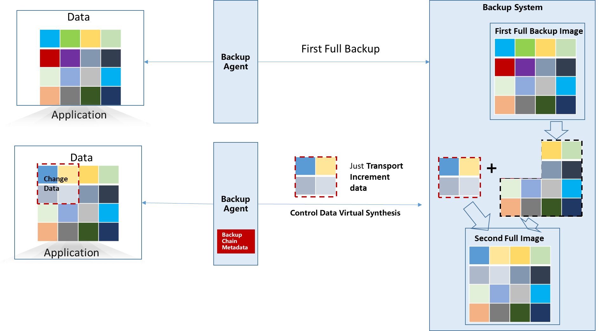

应用感知的源端重删技术针对于特性的应用，备份业务有全量备份、增备备份和差异备份；传统源端重删技术主要受益在全量备份场景，避免已经存在的数据的技术再次传输；应用感知的源端重删技术受益场景与之相似，在备份软件对部分应用全量备份或者增量备份产生的数据，记录了一个数据源，每次备份过程中备份前和备份后的关联元数据（如Backup chain metadata），当下一次全量备份时，只做增量备份，而未变化的数据，通过已经存在的备份副本数据进行数据重组，形成一个全新全量副本；该技术很好的减少了全量备份对主机的资源消耗，同时对全量副本而言，与传统全量备份技术受益相同，该特性广泛使用于虚拟化备份，大数据备份、Oracle备份和主机备份。

### 变长重删

-   
传统的存储系统将用户文件按照固定长度分片后存储，在备份场景下这会导致严重的问题，因为一旦用户文件中插入或者删除一部分数据之后，再次定长分片会得到大段和修改前有极小差异的定长分片，导致修改前和修改后的数据有大量的比例无法重删。OceanProtect采用变长分片技术来解决这类问题，变长分片技术通过计算数据流的特征，根据特征来决定切点的位置（切分后得到的数据块长度不一致），当用户插入或者删除一部分数据后，仅仅在插入或者删除位置附近极小范围的位置，数据流特征有变化，其他位置数据特征会保持不变，这样修改前后的数据的特征差异程度仅仅和插入或者删除的数据量有关，没有发生变化的地方将会生成完全一样的变长分片，最终被存储系统重删掉，从而实现较高的重删率。

OceanProtect专用备份存储采用的是基于内容定义的分块算法，主要用于解决数据偏移导致重删率低的问题，如下图展示基于内容定义分块的基本原理，通过使用滑窗内容判断是否应该切块，从而达到按内容定义切点的目的。

**图 1**  滑动窗口计算示意  

.png)

#### 多层次变长智能数据分片

传统的变长分片技术在低熵数据流的切片效果不好，容易出现滑窗滑动到最大分片也找不到合适切点，最后只能以最大分片长度进行切分的情况，最终切分出的数据块重删率较低。如下图：[图1](#zh-cn_topic_0000001302686113_fig138404245279)

**图 1**  数据插入情况下传统定长切片和传统变长切片重删效果  
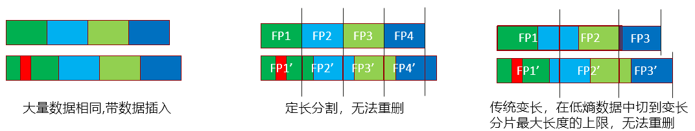

OceanProtect专用备份存储针对传统变长算法在低熵数据中的缺点，创新出华为自研多层次变长切片算法，如[图2](#zh-cn_topic_0000001302686113_fig7826436173513)所示算法的特点是：采用多阈值切点查找算法，对同一个数据段使用多个阈值算法进行多次切片，得到不同的切点。然后对计算出的全部切点使用数据熵筛选算法选择符合设定条件的切点。以算法筛选出的切点为基准进行数据的变长分片。

通过数据模拟，华为自研的多层次变长切片算法相对传统的切片算法，重删率提升10%以上。

**图 2**  多层次变长切片  
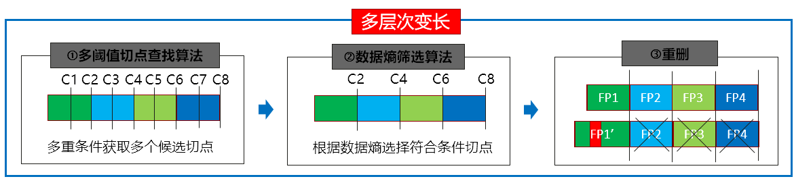

#### 重删原理

基于专用备份存储系统的应用场景，备份数据重删率较高。传统存储上针对重复数据采用的从硬盘读取数据后先解压缩再逐字节对比方式销毁太多的CPU计算资源。OceanProtect采用弱Hash指纹索引+强Hash比较的双重Hash指纹比较的方式来消除单一Hash冲突带来数据不一致的问题，可以节省控制器大量的CPU资源和后端硬盘压力，最终达到提升系统性能的目的。

OceanProtect重删流程

1.用户数据经过变长分片之后，系统会对每个数据块计算弱Hash和强Hash两种指纹。

2.系统将数据块及其两种指纹按照一定的规则发送到对应的控制器上，利用弱Hash指纹进行重复数据查询。

3.如果在指纹表中找到相同弱哈希指纹，则通过该指纹表中对应指纹的地址读取盘上的存储强Hash指纹，读取出来的强Hash指纹和用户新写入数据块的强Hash指纹进行对比。比较的结果如果相同则执行操作7；如果不相同则系统此时认为出现Hash冲突，该数据块将不会继续执行重删流程，数据块将写入系统，如果开启压缩，则会进行压缩。

4.如果在指纹表中没有找到相同指纹，则判断待重删数据为新数据，在指纹索引表中记录新的弱哈希指纹信息。

5.如果开启压缩，新数据块将进入压缩流程；如果压缩未开启，则直接申请该数据块长度存储空间保存数据。存储的地址将会被记录；

6.弱哈希指纹和数据保存的地址的映射关系保存到指纹表中，便于下次查找；

7.强Hash指纹比较的相同，则系统将判定数据块为重复数据，不需要保存，只需要增加对应指纹的引用计数，将已经存在的索引作为本次写入数据块的索引。

**图 1**  重删流程图  
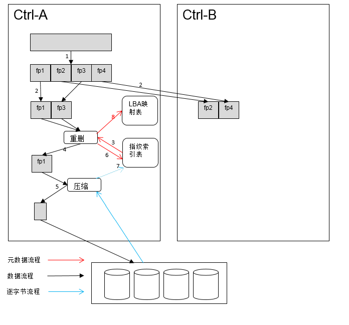

OceanProtect在线重复数据删除是指在将数据写入存储介质之前进行重复数据删除。在线重删的过程如下所述：

存储系统会对新写入的数据先进行变长分片，并对变长分片切分的数据块计算指纹，与系统中已存在的指纹进行对比（进行查重）。如果找到相同指纹，则文件系统的逻辑地址直接指向重复数据块的ID，不再重复写入数据块。如果未找到相同的指纹，则给写入的新数据块分配新ID，并记录文件系统LBA和新ID，指纹与新ID，新ID和存储介质写入地址的映射关系。

采用ID表作为LBA，指纹表和存储介质地址三个元数据的转换中心的设计是专门面向备份软件读写业务模型+HDD的读写特征设计。

如上图所示，文件级的顺序写数据在经过变长分片后，进行重删指纹计算和查找，重复的数据，LBA直接指向已有ID，新数据块按照LBA地址进行排序后分配新ID，新分配的ID顺序递增，永不复用。新数据经过压缩后下盘，新数据在存储介质上按照新数据ID的顺序排布。从端到端的结果看，备份软件写入的顺序数据，经过重删后需要保存的新增数据块在存储介质上也是顺序保存的。

## 复制链路重删

在备份业务场景，数据复制需要将本地数据的全量备份到备份系统，然后在异地再进行安全存储。这样的备份方式使得数据有一个特点：数据高度重复，则数据重删技术就会得到极大的收益。高度冗余的备份数据在进行数据备份和数据保护时要求在更短时间内完成更多备份数据来加速备份，对链路复制提出了以下要求：重复数据消除大幅减少存储占用空间；低带宽要求以加速备份并减少 WAN 使用成本。OceanProtect实现复制链路重删，用来大幅降低拷贝数据量，节省客户的复制带宽资源。

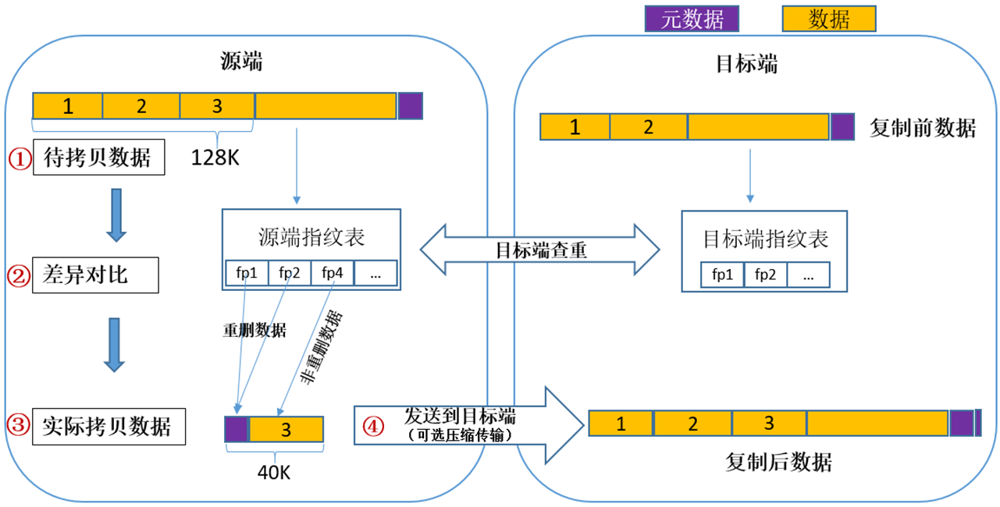

复制链路重删流程：

1、进行异步复制同步之前，在源端确定上一个复制时间点后的所有新备份数据，确定待拷贝数据；

2、将待拷贝的数据进行指纹检索，将对应的指纹发送到目标端进行查重，确定数据是否可以在目标端重删

3、可以重删的数据重删的数据，只发送相应的指纹；不能重删的数据进行完整数据的拷贝，两种数据组成了复制链路中实力拷贝的数据

4、将实际拷贝数据发送到目标端时，可以选择进行压缩传输，进一步降低数据传输量

## 压缩

数据压缩主要包括两个过程，首先是采用压缩算法对输入的数据块进行压缩，形成一个个的小数据块，然后再把这些压缩后的数据块拼接在一起（数据压紧，Data Compaction）下盘。

本章主要介绍数据压紧的实现原理。

### 合并压缩

按照测试数据表现，一次参与压缩的数据块越大，最终的压缩率越高。

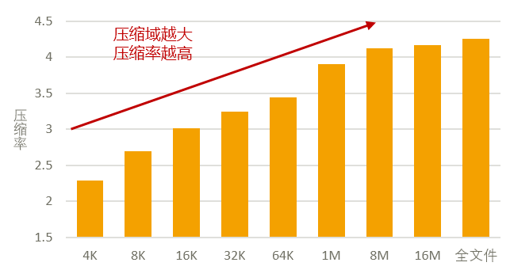

OceanProtect 采用合并压缩技术，如图[图1](#zh-cn_topic_0000001254686130_fig133641128173812)所示，系统将ID连续的数据块合并成大的数据块（128KB）后一次压缩。利用备份软件顺序写，恢复时同样顺序读的特点，ID连续的数据块合并一起压缩，在执行备份恢复时，一次读取后解压得到的ID连续的数据块会在读cache被后续备份软件发起的连续的读请求命中，减少读盘时间从而提升整体性能。

**图 1**  合并压缩原理图  
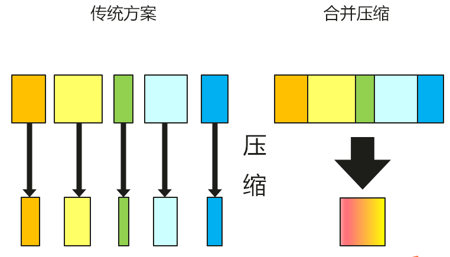

### 压缩处理（SmartCompression）

**备份场景专用预处理**

OceanProtect在数据压缩前，采用华为自主研发的多种预处理算法，针对主要备份场景下的数据特点进行特征处理，达到备份全场景覆盖，预处理的特点是通过数据流特征识别数据场景，并按照数据特征对数据进行清洗（去除软件在数据中插入的Tag等特殊标识）、重排（按照数据类型特征进行可逆的数据重排，提升压缩率）、去冗余（按照数据特征去除冗余数据），提升压缩率。预处理只对数据做特征处理，处理完成的数据和识别的数据特征传输到自适应LZ模块进行去重压缩。

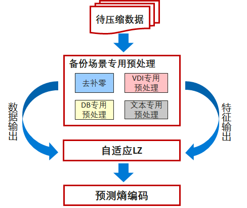

通过预处理，会输出预处理后的数据，以及识别的数据特征。

**自适应LZ**

按照预处理模块识别的数据特征，匹配多种预置的去重策略对预处理后数据的进行去重处理。

**预测熵编码**

自研高性能预测编码算法，根据备份数据特征训练预测模型，结合词频信息和预测技术，提升压缩率。

通过备份场景专用预处理+自适应LZ+预测熵编码 三级技术加持帮助OceanProtect备份存储实现在虚拟机+文件共享备份场景压缩率提升10%+，数据库备份场景压缩率提升30%+。

### 数据压紧（Data Compaction）

本章主要介绍数据压紧的实现原理。

OceanProtect压缩后的用户数据按照字节级对齐，进行数据压紧，减少浪费物理空间，相对于1kB（相对业界主流对齐粒度）粒度对齐，提供更高缩减率。

如[图1](#zh-cn_topic_0000001303166117_fig135152620520)所示，通过字节级对齐，减少物理空间的浪费，相对于1kB粒度对齐节省了2kB物理空间，从而提升压缩率。

**图 1**  压缩后数据字节级对齐原理  

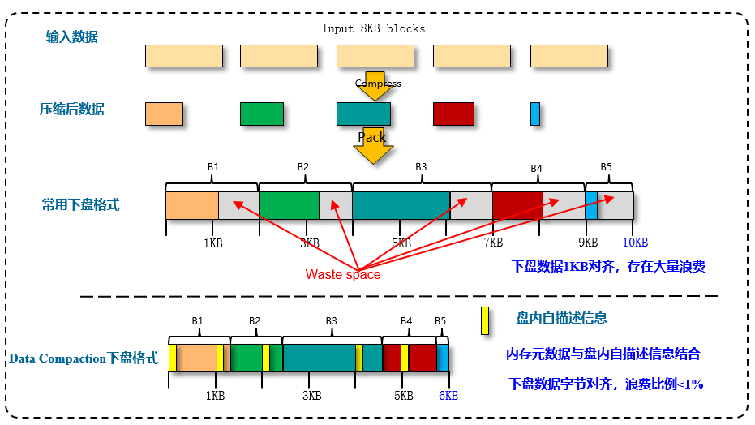

### 数据重排

OceanProtect中采用了数据重排技术，对于一个数Grain粒度的数据块，OceanProtect系统会在每个512B后面都会插入数据的校验信息。由于校验信息中存在随机数据，对于压缩算法，随机数据会打乱压缩算法的计算，降低压缩率。因此，数据重排技术将用户数据和校验数据分开，对用户数据进行压缩，同时对校验数据进行定制化缩减。这样能够得到更好的压缩率和压缩解压速度。

**图 1**  数据重排  
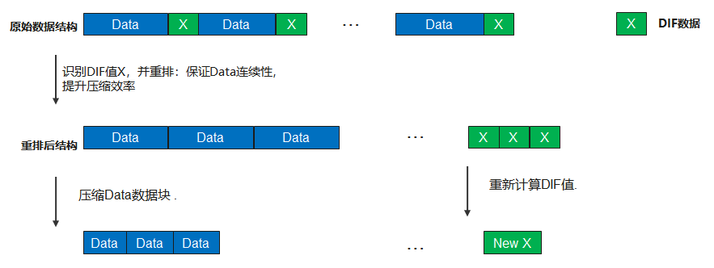

# 系统安全设计（配合OceanProtect备份介质）

存储安全是通过技术控制手段，其中包括对数据完整性、保密性和可用性监控，系统安全启动、权限访问访问控制，结合存储设备及网络的具体安全威胁采取对应的安全策略，以防止存储资源和数据用于未经授权的用户和用途。存储安全包含设备安全、网络安全、业务安全、管理安全。本章节主要讲解系统安全相关的软件完整性保护、安全启动和数据加密能力。数字签名技术，保障从华为研发的产品包（包括升级包）到设备安装、升级过程中没有被篡改。安全启动技术，保障存储设备启动运行过程中，对启动的部件进行校验，防止启动文件被非法篡改。硬盘加密特性，应用于对用户存储数据的保护，防止因硬盘丢失等原因导致用户数据丢失。

## 总体安全框架

总体安全框架参考了ITU-T X.805电信网络安全架构模型，结合存储设备及网络的具体安全威胁给出对应的安全对策，以满足企业实际运营的安全需求。****如[图1](#zh-cn_topic_0000001539420329_it_52_06_000003_mmccppss_fig_01)所示。

**图 1**  安全框架  

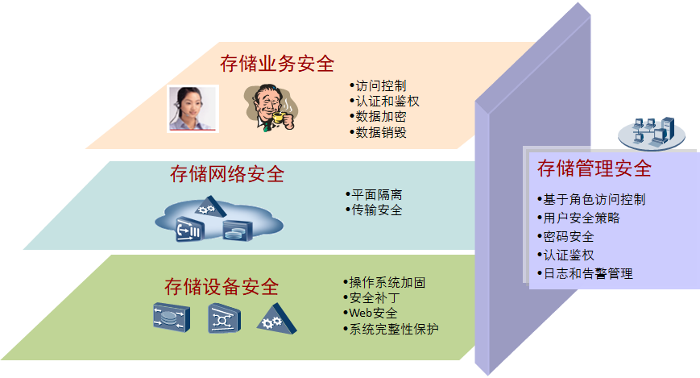

## 安全能力及设计

安全分层简要介绍如下：

-   存储设备安全：操作系统加固、补丁管理、Web安全、系统完整性保护，软件完整性保护，安全启动。
-   存储网络安全：平面隔离、网络隔离、传输安全。
-   存储及数据备份业务安全：访问控制、认证和鉴权、数据加密、数据销毁、数据留存、数据审计。
-   管理安全：基于角色访问控制（RBAC）、用户安全策略、密码安全、认证鉴权（LDAP、本地用户、双因子认证等）、证书管理、日志和告警管理。

# 系统可服务性设计

本章首先描述open-eBackup的系统管理，通过各种接口对存储系统进行管理（包括DeviceManger、CLI、Restful API、SNMP、SMIS等）；然后描述升级过程主机透明的升级方式。

## 存储系统管理

OceanProtect提供设备管理接口和北向集成管理接口。设备管理包括：图形界面管理DeviceManager和命令行界面CLI；北向接口以Restful为主，支持SNMP、配套评估工具以及一系列的第三方网管系统插件，详细参考产品的兼容性网站（[http://support-open.huawei.com/ready/pages/user/compatibility/support-matrix.jsf](http://support-open.huawei.com/ready/pages/user/compatibility/support-matrix.jsf)）。

### DeviceManager

DeviceManager是OceanProtect内置的GUI（Graphical User Interface）管理工具，基于HTML5实现，用户使用普通浏览器直接访问 https://存储管理IP:8088/ 即可使用。通过DeviceManager，可以完成几乎所有需要的配置和管理动作。

DeviceManager支持的管理功能包括：

-   存储空间管理：包括存储池管理、LUN管理、LUN及主机间的映射。
-   数据保护管理：使用快照、复制等，完成数据的保护。
-   配置任务：为复杂配置操作提供后台任务，用于跟踪配置流程的详细执行步骤。
-   故障管理：包括存储设备与存储上各类管理单元的状态监控、故障报警、故障修复建议与修复向导。
-   性能及容量管理：支持实时的性能及容量监控、历史性能及容量数据采集与查看、性能数据关联分析等。
-   安全管理：支持用户管理、角色管理、权限管理、证书管理、密钥管理等。

DeviceManager使用全新的UI设计，提供简洁的交互界面，用户完成配置任务仅需少量的操作，给用户更好的体验。

#### 存储空间管理

##### 灵活的存储池管理

OceanProtect通过存储池的方式管理存储空间，一个存储池可以由多个SSD构成，并划分为多个LUN或文件系统供主机使用。用户可以选择只使用一个存储池管理所有空间，也可以选择划分多个存储池：

-   整个存储系统只使用一个存储池

    最简单的划分方式，用户可以不用手动创建存储池，仅需要在系统初始化的时候选择将所有盘创建为唯一的存储池即可。

-   划分多个存储池隔离不同应用

    如果用户希望通过多个存储池管理空间，隔离不同应用的故障域等，可以在任何时候手动创建存储池，创建方式有两种。仅指定用于创建存储池的盘个数，系统自动挑选符合要求的盘创建存储池，或者手动选择特定的盘创建。

#### 配置任务

DeviceManager会自动为复杂配置操作启动后台配置任务，用户提交配置操作后，任务自动生成并在存储后台执行，这样用户不用等待任务的执行，可以进行同步进行其他操作。

例如：基于保护组的保护、跨设备保护配置操作等，都使用了后台配置任务机制，比如保护组中有数百个LUN，为这些LUN创建完保护需要较长的时间及数百次操作，通过后台任务机制，可以大大节省用户等待配置完成的时间。

-   任务步骤及任务进度

    一个复杂任务往往包含多个可执行步骤，可以通过DeviceManager实时查看任务执行到哪个步骤，也可以查看任务整体执行进度（%）。

-   任务支持纯后台执行

    当提交一个配置任务后，任务就在后台执行，用户无需等待任务完成，可以关闭DeviceManager页面，任务会在后台自动完成。用户也可以提交多个不同的配置任务，只要这些任务依赖的资源不互相冲突，任务就会自动在后台按照提交顺序挨个执行。

-   任务断点继续

    如果任务执行过程中，碰到系统断电等意外中断场景，当系统重新拉起，任务会在中断点继续执行，保证最终完成所有配置步骤。

-   失败任务手动重试

    如果任务的某个步骤执行过程碰到异常无法继续执行，任务会自动中断，并提示用户任务中断的原因，比如创建FS时存储空间不足导致无法继续执行。如果用户可以手动排除任务中断的故障，那么在排查故障以后，用户可以手动重启任务，重启后任务会从失败点继续往下执行。

#### 故障管理

##### 硬件设备状态监控

提供直观的、所见即所得的设备硬件视图，通过不同颜色的示意，方便用户监控存储硬件状态。如[图1](#zh-cn_topic_0000001302446125_fig10940122810399)所示，对硬件组件状态进行了汇总统计。

**图 1**  资产清单管理界面  
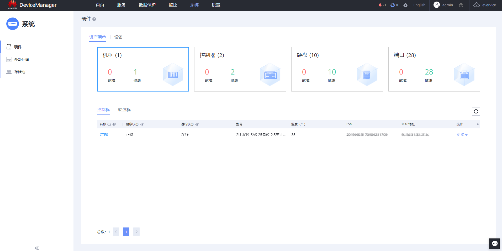

用户可以进一步导航浏览具体的设备框及其上面的硬件组件，通过设备硬件视图直观查看设备框。通过硬件视图，用户可以监控每一个硬件组件的实时状态，获知具体硬件组件（端口、硬盘等）的具体物理位置，方便用户进行硬件维护。

支持实时显示健康状态的硬件组件包括：硬盘、端口、接口卡、风扇、电源、BBU、控制器、硬盘框等组件。除了实时的健康状态，硬盘、端口等组件也支持性能监控，具体的性能监控能力，参见[性能及容量管理](性能及容量管理.md)。

##### 告警与事件监控

提供实时的系统故障监控，系统发生故障后，会实时推送到DeviceManager主页面，如[图1](#zh-cn_topic_0000001302686121_fig11989184284116)所示。

**图 1**  告警通知提示  
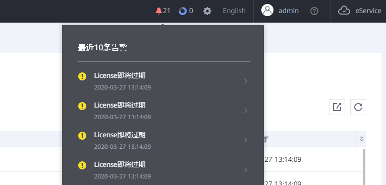

同时提供专门的管理页面，方便用户查看所有告警信息或事件信息，用户可以根据故障修复建议，修复故障。

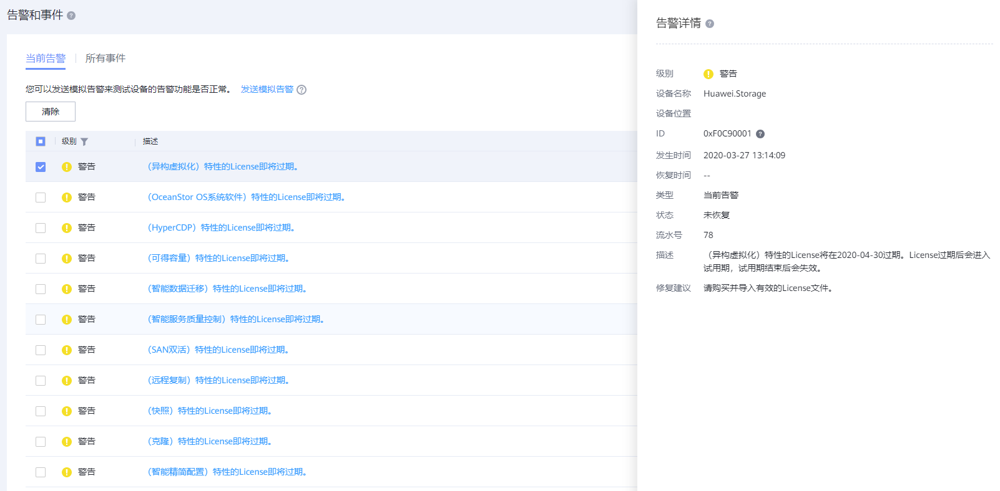

系统产生的告警，除了可以直接通过DeviceManager查看外，也支持通过syslog、邮件、手机短信（需要选用特定的短信猫）等方式实时通知到用户。

-   支持用户配置邮件接收地址，可以同时配置一批接收邮箱，这些邮件会同时接收到告警通知。
-   支持用户配置告警接收的手机号，可以同时配置一批手机号，这些手机号会同时接收到告警通知。

#### 性能及容量管理

性能数据的采集与分析功能是用于设备日常维护的必要功能，由于性能数据量非常大，并且分析数据需要消耗很多系统资源，以往这类特性都是需要额外使用一个服务器，安装特定的性能数据采集与分析软件，才可以使用，这造成了不必要的复杂性。

open-eBackup直接内置了性能数据与容量数据采集与分析组件，用户不需要额外的服务器安装软件即可使用。而且组件经过特别设计，对存储系统的资源消耗降到了最低。

##### 内置性能数据采集与分析能力

open-eBackup无需额外安装特定的性能采集软件，系统内置性能分析组件，开箱即用。系统支持最长3年以内的历史性能和容量数据采集、保存与查看。用户也可以自己配置性能数据保存时长。支持对多种特定对象进行性能采集与分析，如：控制器，端口，硬盘，文件系统，远程复制，复制链路等。每种对象支持监控多个性能指标，如带宽，IOPS，平均IO响应时间，利用率等。

支持将不同类型的对象和指标在一个视图展示，便于用户分析性能问题。支持根据指标进行top和bottom对象分析，用户可快速找到业务压力大的对象，指导用户对业务进行调优。下图是一个性能监控示意图，详细的监控对象、监控指标及性能分析功能，参见联机帮助。

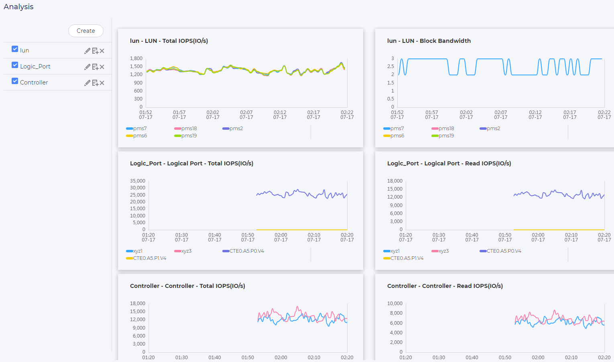

##### 独立的数据存储空间

为了存储收集到的性能数据与容量数据，需要划分一个专门的存储空间存放数据，DeviceManager提供专门的配置页面，让用户可以自主选择数据存放的存储池；

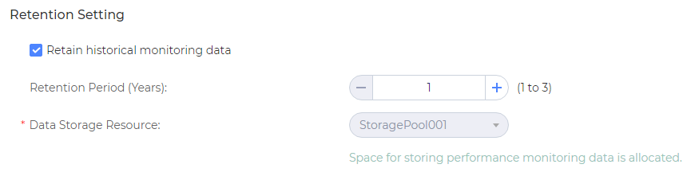

也可以定制数据存储时间，最长支持设定存放3年的性能数据，DeviceManager会根据选择，自动计算需要的存储空间，并在用户选择的存储池上划分相应的存储空间。

##### 支持容量预测

支持系统和存储池容量预测，支持未来一年的容量利用率预测。用户可根据容量预测结果提前制定出更好的资源使用计划，根据预测情况进行资源的调度。

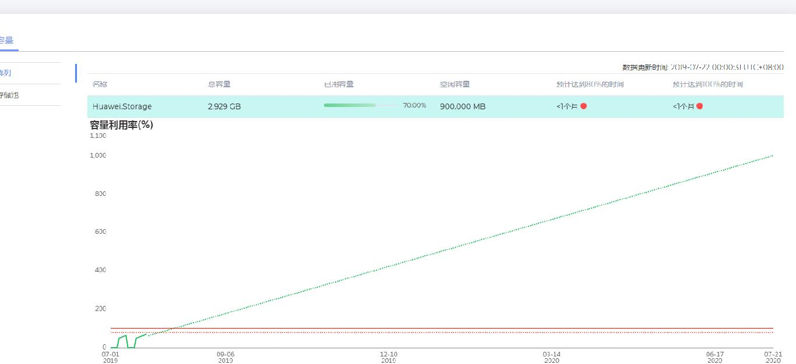

##### 支持性能阈值告警

支持对控制器、端口、FS、复制等对象配置阈值告警，告警的阈值、震荡周期和告警级别都支持自定义配置；

由于不同的存储资源所承载的业务类型存在差异，通用的阈值告警可能无法满足需求；性能管理支持对特定监控对象设置例外阈值规则，保证阈值告警的精准性。

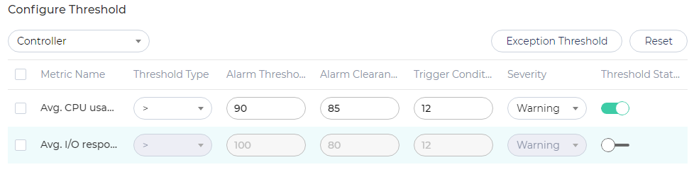

##### 支持定时报表

支持定时生成特定对象的性能/容量报表，用户可定期掌握存储设备的性能状况和容量使用情况。

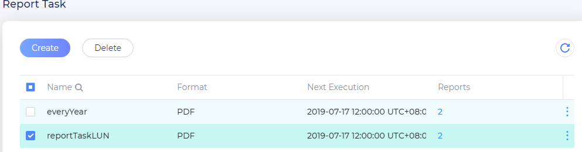

支持按天、按周、或按月生成报表，可以设定生成报表的具体时间，可以设定报表生效的时间段，以及报表保存期限。可以选择报表文件格式，当前支持生成\*.pdf和\*.csv两种格式。

对于性能报表，用户可以自己选择需要生成报表的对象，所有可以进行性能统计的对象都可以纳入报表，可以选择报表需要展示的性能指标。对于容量报表，可以统计整系统、存储池的容量。

用户可以创建多个报表任务，每个报表任务都可以配置自己的参数，系统会按照任务要求自动按期生成相应的报表。

### CLI

CLI是Command Line Interface的缩写，即命令行界面，允许管理员和其他系统用户执行存储系统的管理和维护操作。CLI基于SSH协议，并且支持基于密钥的SSH访问。

### Restful API

OceanProtect的Restful API 允许基于HTTPS的接口用于系统的自动化、编制、查询和调配。借助API，可以使用第三方应用程序来控制和完全管理阵列。因此，它使我们可以开发灵活的管理解决方案用于OceanProtect。

### SNMP

存储系统支持通过SNMP Trap方式上报告警与事件，也支持直接通过SNMP接口查询存储的告警与事件，采集性能数据，或者查询存储系统上的管理对象信息。

### SMI-S

SMI-S\(Storage Management Initiative Specification\)是SNIA\(全球网络存储工业协会\)发起并主导的一种存储标准管理接口，有众多存储厂商参与定义并实现。SMI-S接口提供存储硬件和业务配置能力，存储管理软件可以使用此接口管理存储设备，执行一些标准的管理任务，如查看存储硬件、存储资源、告警信息等。OceanProtect支持SMI-S 1.6.1、1.6.0、1.5.0版本。

## 备份系统管理

华为OceanProtect 备份一体机提供单独的备份业务管理界面和北向集成管理接口。支持用户和权限管理，支持系统管理员/数据保护管理员/审计员等用户角色权限分离，支持对不同操作用户分配不同的资源、功能和配额等备份管理权限。北向接口以Restful为主，支持SNMP告警和事件上报。

支持如下角色：

<table><tbody><tr id="zh-cn_topic_0000001558983389_row1246mcpsimp"><td class="cellrowborder" colspan="2" valign="top">
用户管理

</td>
<td class="cellrowborder" valign="top">&nbsp;&nbsp;</td>
</tr>
<tr id="zh-cn_topic_0000001558983389_row1250mcpsimp"><td class="cellrowborder" rowspan="4" valign="top" width="18%">
用户角色

</td>
<td class="cellrowborder" valign="top" width="23%">
系统管理员

</td>
<td class="cellrowborder" valign="top" width="59%">
具备系统所有权限

</td>
</tr>
<tr id="zh-cn_topic_0000001558983389_row1257mcpsimp"><td class="cellrowborder" valign="top">
数据保护管理员

</td>
<td class="cellrowborder" valign="top">
具备数据保护权限，可创建多个角色的数据保护管理员，满足分域管理要求

</td>
</tr>
<tr id="zh-cn_topic_0000001558983389_row1262mcpsimp"><td class="cellrowborder" valign="top">
远端设备管理员

</td>
<td class="cellrowborder" valign="top">
远程复制机机账号，具备远程复制权限

</td>
</tr>
<tr id="zh-cn_topic_0000001558983389_row1267mcpsimp"><td class="cellrowborder" valign="top">
审计员

</td>
<td class="cellrowborder" valign="top">
具备系统事件、操作日志审计权限

</td>
</tr>
</tbody>
</table>

### open-eBackup GUI

open-eBackup 数据保护系统内置用户业务配置GUI（Graphical User Interface）管理工具，基于HTML5实现，用户使用普通浏览器直接访问 https://管理IP: 25080/ 即可使用。通过该管理界面可以完成所有备份业务需要的配置和管理动作。下图是open-eBackup登录页面：

**图 1**  open-eBackup登录页面  

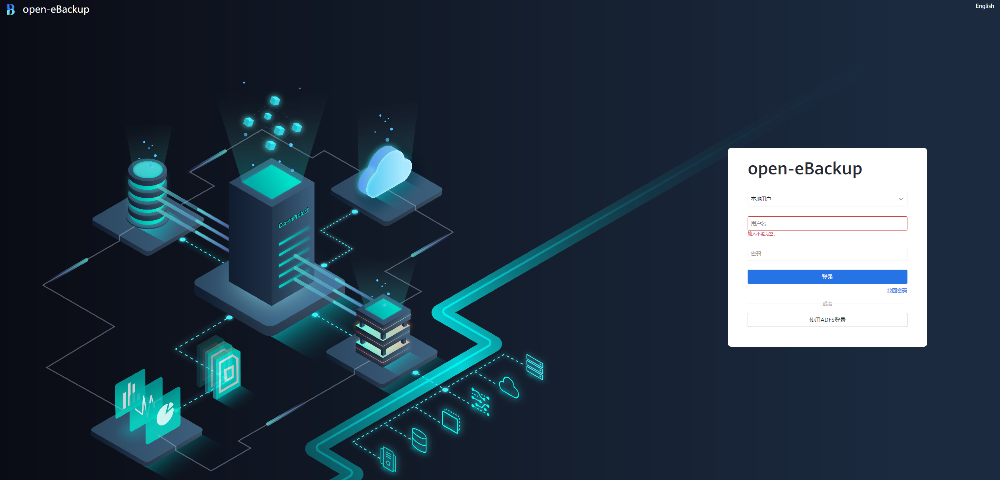

open-eBackup支持的管理功能包括：

-   受保护资源管理：包括受保护资源管理、状态管理、资源扫描。
-   数据保护：包括SLA管理，资源与SLA的绑定管理、数据恢复。
-   数据利用：包括副本挂载Live-Mount，数据脱敏，全局检索等。
-   系统监控：节点的流量监控，任务监控，告警监控。
-   系统管理：系统中的相关配置管理，包括网络，存储、日志、应用设置等。
-   安全管理：支持用户管理、角色管理、安全策略、证书管理，用户数据隔离等。

### Restful API

备份功能的Restful API 允许基于HTTPS的接口用于系统的自动化、编制、查询和调配。借助API，可以使用第三方应用程序来控制和完全管理数据保护业务。因此，它使我们可以开发灵活的管理解决方案用于open-eBackup数据保护系统。

### 客户端批量推送安装

数据功能服务端软件在设备内出厂时内置，开箱即用，备份客户端软件安装包也内置对应版本在设备中，现网部署时，可通过open-eBackup管理界面进行推送安装。无需登录到每个受保护资源或外置代理节点手动安装。

**图 1**  客户端批量推送安装  
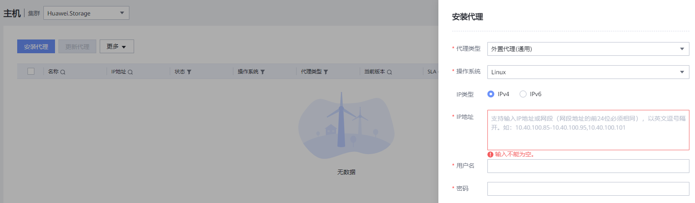

推送任务开始执行后，会针对每一个客户端推送生成安装任务，单个客户端安装失败不影响其他客户端安装，对于失败的客户端，失败自动回滚，可单独进行重试推送。

-   **支持IPv4/IPv6、windows/linux**

    支持**IPv4/IPv6**、windows、linux客户端推送安装

-   **批量推送**

    支持批量推送，可填写多网段、多IP，单个客户端生成独立的推送任务，单个任务失败自动回滚，不影响其他推送任务执行。

## 云智能管理（配合OceanProtect备份介质）

传统的服务支持方式为全人工服务，在故障发现环节，技术服务人员面临着问题发现不及时、信息传递不到位的挑战。为了解决以上难题，华为提供基于云原生（Cloud-Native）的eService云智能管理系统（简称eService），在取得客户授权的情况下，将设备告警和日志每天定时回传至eService，eService运用人工智能（AI）技术，实现智能报障、实时健康度分析、智能故障预防等功能、识别潜在风险、自动故障定位、提供故障排除解决方案，最大限度地降低设备运行风险，降低运营成本。

**图 1**  eService典型组网图  
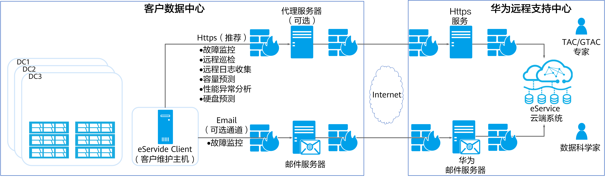

eService系统由前端系统和云端系统协同工作：

-   前端系统：部署在客户侧。

    使用eService Client或者在DeviceManager上开启eService服务，接入eService云端，采集客户设备的告警等信息，并及时将其发送到华为侧的云端系统。

-   云端系统：部署在华为远程支持中心。

    能够全天候地接收部署在客户侧的前端系统发回的设备告警等信息，eService将问题自动上报至华为远程技术支持中心并创建相应服务请求，华为服务工程师会及时协助客户解决处理。

eService有如下优势：

-   提供自助式智能运维系统，为客户提供精准化的贴身信息服务。
-   客户可以在任何时间、地点使用Web访问eService，查看设备状况。
-   数据安全可靠，保证信息安全传输且客户授权后eService才能接入客户系统。
-   提供7\*24小时不间断服务，自动创建进度跟踪单，主动式运维，安全可靠。
-   eService云端系统使用华为云，通过大数据分析和AI人工智能技术驱动IT运维活动，提前识别故障，降低运维难度，全面提升运维效率。

### 采集信息范围

取得客户授权后，存储系统可通过网络连接到eService，定期收集华为存储系统的运维数据并上传至eService。通过获得的所有数据来全面了解存储运维活动，其中包括：性能数据、配置信息、告警信息、系统日志和硬盘信息。

**表 1**  采集信息范围

<table><tbody><tr id="zh-cn_topic_0000001254686122_row14810456"><td class="cellrowborder" valign="top" width="25%">
数据类型

</td>
<td class="cellrowborder" valign="top" width="25%">
数据说明

</td>
<td class="cellrowborder" valign="top" width="50%">
上传周期

</td>
</tr>
<tr id="zh-cn_topic_0000001254686122_row53125076"><td class="cellrowborder" valign="top" width="25%">
性能数据

</td>
<td class="cellrowborder" valign="top" width="25%">
扩展名为“.txt”的“json”格式文件

</td>
<td class="cellrowborder" valign="top" width="50%">
自动上传。每5分钟上传一次新增的性能数据到eService云端。

</td>
</tr>
<tr id="zh-cn_topic_0000001254686122_row28171394"><td class="cellrowborder" valign="top" width="25%">
配置信息

</td>
<td class="cellrowborder" valign="top" width="25%">
扩展名为“.txt”的文本文件

</td>
<td class="cellrowborder" valign="top" width="50%">
自动上传。每天上传一次配置到eService云端。

</td>
</tr>
<tr id="zh-cn_topic_0000001254686122_row53223490"><td class="cellrowborder" valign="top" width="25%">
告警信息

</td>
<td class="cellrowborder" valign="top" width="25%">
HTTPS消息

</td>
<td class="cellrowborder" valign="top" width="50%">
自动上传。每30秒上传一次新增的设备告警消息到eService云端。

</td>
</tr>
<tr id="zh-cn_topic_0000001254686122_row34571641"><td class="cellrowborder" rowspan="2" valign="top" width="25%">
系统日志

</td>
<td class="cellrowborder" valign="top" width="25%">
Email

</td>
<td class="cellrowborder" valign="top" width="50%">
自动上传。每5分钟上传一次新增的设备告警消息到eService云端。

</td>
</tr>
<tr id="zh-cn_topic_0000001254686122_row56198103"><td class="cellrowborder" valign="top">
扩展名为“.tgz”格式的文件

</td>
<td class="cellrowborder" valign="top">
华为技术支持人员在eService云端手动触发上传系统日志。目前支持上传全量日志、最近一小时、最近两小时或最近一天的日志，也可上传自定义时间段内的日志。

</td>
</tr>
<tr id="zh-cn_topic_0000001254686122_row42729680"><td class="cellrowborder" valign="top" width="25%">
硬盘信息

</td>
<td class="cellrowborder" valign="top" width="25%">
扩展名为“.txt”的文本文件

</td>
<td class="cellrowborder" valign="top" width="50%">
自动上传。每天上传一次硬盘信息到eService云端。

</td>
</tr>
</tbody>
</table>

### 智能报障

eService提供7\*24全天候健康守护，当设备发生故障时，自动通知到eService。对客户设备进行7\*24小时全天候故障监控，当设备产生告警后，统一上报到eService，eService结合全球设备故障特征模型库，能够自动进行告警屏蔽、抑制和过滤，提升告警处理的准确性和处理效率，解决了传统方式需要通过配置规则进行屏蔽、抑制以及过滤告警，造成无法全覆盖所有场景，导致告警漏报、误报的难题；此外，根据Call Home服务级别，eService云智能管理系统可自动创建跟踪单并分派给相应的华为工程师进行处理，同时根据事先约定的联系方式（默认为Email）通知客户，加速问题定位和解决。

**图 1**  智能报障实现原理图  
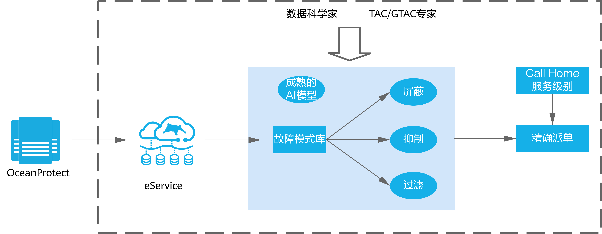

### 容量预测

系统容量的变化受多种因素影响，传统通过单一预测算法无法确保预测结果的准确性，eService通过以下两个维度的处理，确保预测结果的合理性和准确性。

-   算法上，eService采用多种预测模型簇进行在线预测，输出多模型的预测结果，根据在线训练推荐的选取规则，选取最优的预测结果；同时eService定期对历史使用容量数据进行在线训练和验证，从线性预测、可识别趋势、周期、局部变化全方位考虑，优化模型参数，确保预测算法的最优。
-   业务上，eService预测算法模型能够精准的识别容量变化中影响因素多样性，比如重大事件导致容量的陡增陡降、已有业务容量回收导致的非规律性趋势、新业务上线导致容量跳变等，从而更准确的预测系统未来容量消耗。

eService使用智能AI算法选取最佳预测模型，能够预测未来12个月的容量消耗情况；同时，根据容量预测算法可为客户提供过载资源预警、已有业务扩容建议、容量年度规划等服务。

**图 1**  容量预测实现原理图  
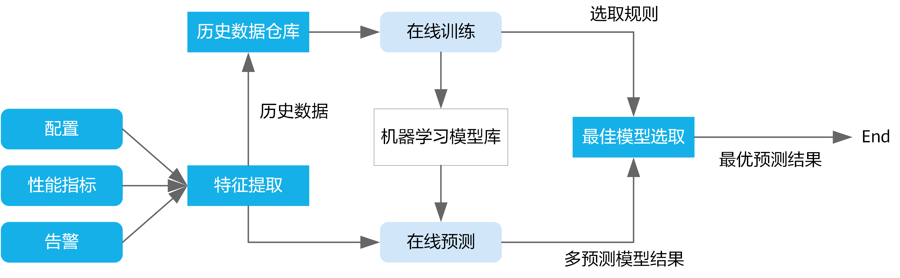

各部件职责：

-   数据源采集：采集配置、性能指标、告警信息，减少多种因素对机器学习训练结果的干扰。
-   特征提取：利用算法自动进行特性变换和特征提取。
-   历史数据仓库： 最大保存存储最近一年的容量相关历史数据。
-   在线训练：
    -   通过大量样本训练，得到各个模型预测度量指标统计信息，同时输出模型选择规则。
    -   针对当前历史数据，通过有限次迭代，优化模型算法。

-   机器学习模型库: 包括ARIMA、FBPROPHET和线性等预测模型。
-   在线预测： 将优化后的模型进行在线预测，输出多个模型的预测结果和度量指标值MAPE。

    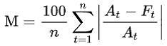

    上式中At为容量实际值，Ft为容量预测值。

-   最优模型选取： 将在线训练的模型统计信息和在线预测的结果， 进行加权，选取最优预测结果。

### 硬盘健康预测

硬盘是存储系统的基础组成，虽然当今存储系统广泛使用各种冗余技术，但都只能保证有限块硬盘失效的场景，如RAID5只允许一块硬盘失效，当出现两块硬盘失效时，存储系统为保障数据可靠，将停止对外提供服务。同时硬盘还是存储系统最大的消耗品，硬盘寿命是很多用户最关心的话题，由于SSD盘是电子元器件，硬盘寿命预测指标非常少，同时业务每天读写繁忙度不同加剧寿命预测结果的难度。

eService通过采集硬盘的Smart信息、硬盘的I/O链路信息、自研的硬盘可靠性指标，输入到数百个华为自研的硬盘失效预测模型里进行预测，实现精准预测SSD盘寿命的功能。eService使用智能AI算法实现硬盘风险预测，提前发现故障硬盘和更换风险盘，实现故障预防，提高系统可靠性

**图 1**  硬盘健康预测实现原理图  
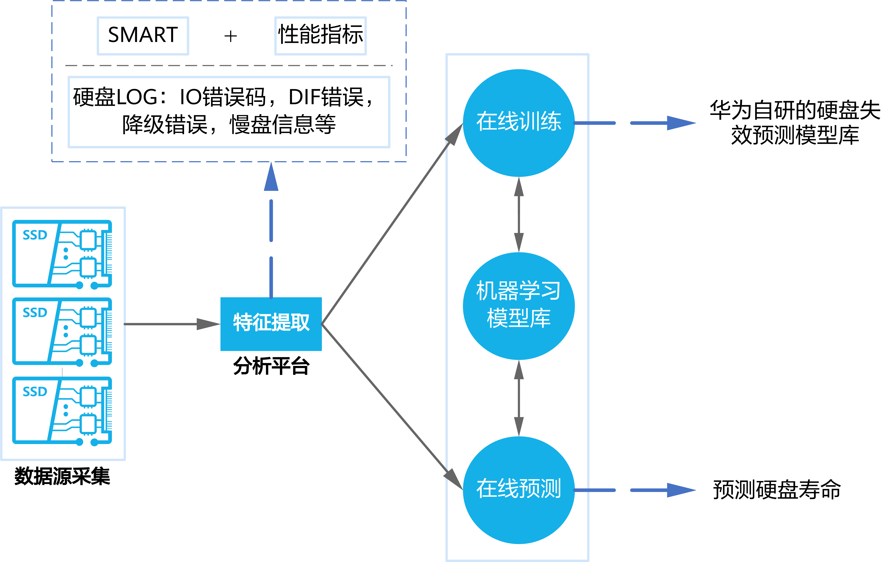

-   数据源采集

    硬盘厂商会提供硬盘的S.M.A.R.T的静态数据，这些S.M.A.R.T信息中有很多可以表征硬盘的运行状态，能够一定范围内识别风险盘，但预测结果准确度很难保证。eService采用AI动态分析硬盘S.M.A.R.T的变化、性能指标波动规律，以及硬盘LOG，确保预测结果更加准确。

-   S.M.A.R.T

    SSD盘，SSD接口提供了SCSI Log Page信息，这些Log Page中的信息详细记录当前硬盘的状态、当前性能指标，如grown defect list、non-medium error、read/write/verfify uncorrected errors等。

-   性能指标

    包括硬盘每分钟的平均IO大小分布、IOPS、带宽、每天处理的bytes数等Workload信息，以及时延，平均服务时间等性能指标。

-   硬盘LOG

    包括华为存储内部采集的IO错误码信息，DIF错误信息，降级错误信息，慢盘信息与慢盘周期、盘片寿命等信息，确保预测更加准确。

-   特征提取

    通过HistoryBigData 大量样本数据，利用算法自动进行特性变换和特征提取

-   分析平台
    -   在线训练：基于模型算法进行训练，通过有限次迭代，优化模型算法。
    -   机器学习模型库：自研的硬盘失效预测模型。
    -   在线预测：使用优化后的训练模型对硬盘进行失效预测

-   预测结果

    eService通过海量的SSD硬盘数据的测试验证，基于华为自研的硬盘失效预测模型实现精准预测SSD盘寿命。

### 设备健康评估

通常情况下，设备上线后，客户通过巡检来预防设备风险，这种方式面临两个问题：

-   巡检频次问题

    巡检一般固定周期（月度或季度）进行，导致客户不能及时发现问题。

-   巡检深度问题

    只能检查当前设备是否存在问题，缺少对设备系统、硬件、配置、容量、性能风险的分析。

eService从系统、硬件、配置、容量、性能维度实时评估设备健康，发现设备潜在风险，通过健康分数直观反映设备运行状况，同时为客户提供解决方案，实现风险的主动预防。

**图 1**  设备健康评估详情  
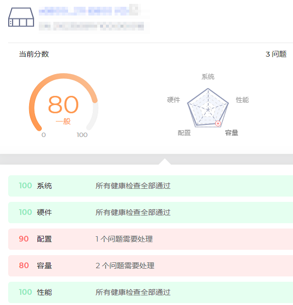

### 性能潮汐分析

众所周知，周期性业务实施（如定时快照、SmartTier迁移）或临时变更业务实施（如在线升级、扩容、备件更换）应该在设备业务负载较低时进行，避免影响在线业务。传统方式，运维人员需要通过经验或查看过去一段时间的性能指标来估算出合适的时间窗口。

eService性能潮汐，根据设备历史性能数据，从负载、IOPS、带宽、时延4个维度分析业务周期规律，直观地查看业务周期规律，以及选择合适的时间窗口进行周期性业务实施（如定时快照）或临时变更业务实施（如在线升级、扩容、备件更换），避免业务高峰期操作影响业务。

**图 1**  周维度潮汐分析实现原理图  
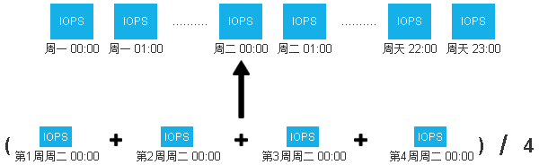

根据设备过去4周的性能数据，计算周一到周天每个小时的性能指标值，以IOPS为例，将过去四周每个工作日与休息日的整点时刻的IOPS相加,再除以4，得到周潮汐规律，天维度，月维度潮汐规律原理类似。

客户根据需要查看天维度、周维度、月维度业务潮汐规律，如下图所示。

**图 2**  周性能潮汐  
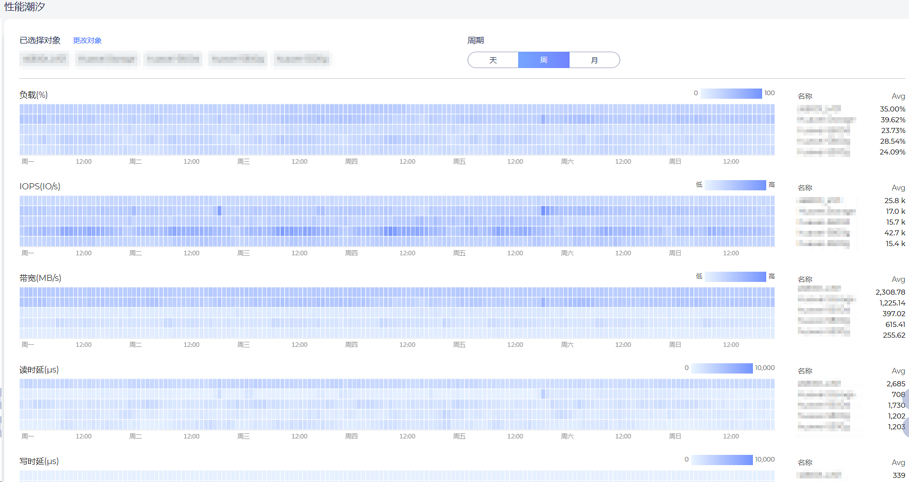

### 性能异常检测

业务能否平稳运行，是企业最关心的问题，但由于性能问题的复杂性与隐蔽性，用户难以提前识别并解决性能问题。等到问题恶化并影响业务时，已经给用户造成损失。eService性能异常检测，针对业务出现的时延问题，基于历史性能数据，采用深度学习算法，学习业务特征，结合行业与华为强大的专家经验，得到设备性能画像，实时检测异常数据，进行精准定位并给出修复建议。

**图 1**  性能异常检测实现原理图  
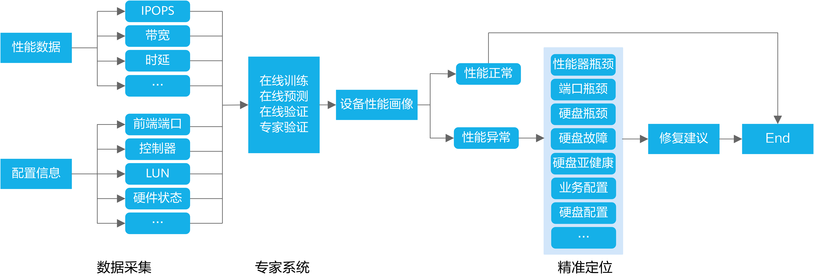

### 性能瓶颈分析

随着业务上线，运维普遍关心设备性能压力是否过大、业务能否稳定运行。由于影响设备性能的因素复杂（设备硬件配置、设备软件配置、业务类型、性能数据等），需要人工同时非常多的指标进行比对分析，因此设备性能压力评估以及性能调优是老大难问题。

eService性能瓶颈分析，对设备配置信息，性能数据等进行关联分析，自动评估设备性能压力并结合华为强大的专家经验，直观的给出设备整体负载与各部件负载，识别出性能瓶颈，并给出相应的优化建议，客户可根据当前的瓶颈分析建议进行相应的优化调整，保障业务稳定运行。

**图 1**  性能瓶颈实现原理图  
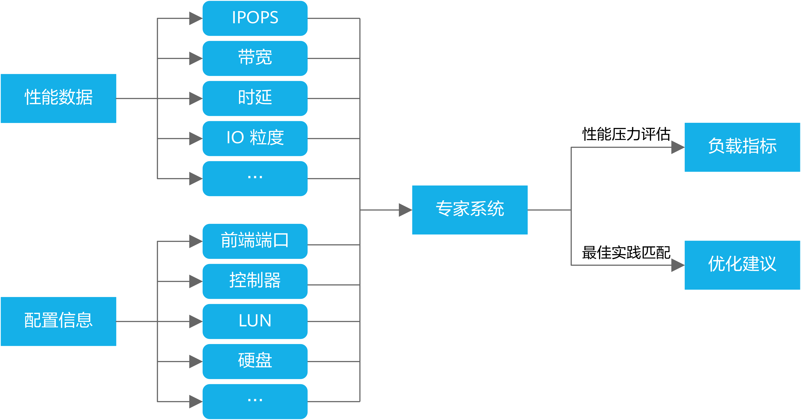

客户可查看当前设备的负载情况，包括设备整体负载与各部件负载，如[图2](#zh-cn_topic_0000001255006118_fig61954093)所示。

**图 2**  性能瓶颈分析总览  
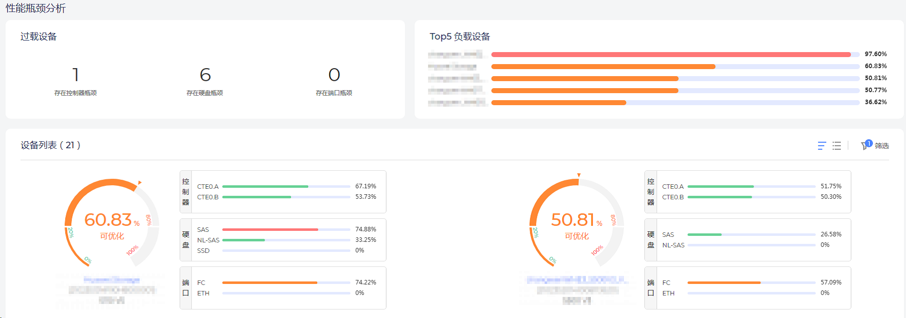

## 升级过程透明（NDU）

一直以来，存储系统升级都需要重启控制器，需要将业务在控制器间进行倒换来保持业务在线，这样不仅对业务性能有很大影响，并且还需收集大量的主机信息用于评估可能存在的升级兼容风险。主机信息收集需要获取主机账户，而且需要收集的信息繁多，其中一部分信息还无法做到自动评估，需要人工参与，使得升级变更非常复杂。

OceanProtect新提供一种无需重启控制器的升级方式。升级过程中，控制器不重启，业务无影响，且升级完成后性能迅速恢复。

**组件化升级**

存储系统可以分为4个层次：物理硬件、驱动固件、操作系统和存储软件，OceanProtect通过不同的方式分层次更新来实现整个系统的升级，如[图1](#fig13503192432515)所示。

**图 1**  分层次升级  

-   物理硬件无需升级；
-   驱动固件包括BIOS、CPLD、接口模块的FirmWare等，通过固件热升级的方式实现更新，不需要重启控制器；
-   操作系统通过打热补丁方式实现更新；
-   存储软件和备份软件都是用户态进程，通过Kill掉老的进程，再用升级后的代码重新拉起进程，整个过程秒级完成。

通过分层次升级，以及前端链路保连接技术，实现了升级无需重启控制器，无需切换主机链路，备份业务基本无感知。

**保连接技术**

在使用前端共享接口模块的场景，主机与存储系统的链路建立在主机与共享接口模块之间。主机下发的业务请求，到达共享接口模块后，接口模块再分发到控制器上。共享接口模块在控制内的业务进程重新拉起期间收到的主机I/O，会暂存在共享接口模块上，待业务进程正常后再向控制器分发。由于业务进程重新拉起的时间非常短（1-2S），就实现了主机下发的I/O不超时，主机无感知。

对不使用前端共享接口模块的场景，在业务进程拉起的过程中，通过守护进程保持控制器与主机之间的链路（FC、ISCSI链路）不断开。由于业务进程拉起的时间非常短（1-2S），就实现了主机下发的I/O不超时，主机无感知。

**升级过程性能无损，业务影响时间短**

OceanProtect不涉及业务倒换，因此对主机的性能影响甚微，且2秒内性能可以恢复到100%。升级过程，由于不涉及控制器重启、链路切换，省去了主机信息收集和兼容性评估等复杂步骤，存储系统升级时长（从导包到最后升级成功）缩短到小于30分钟，通常情况下10分钟即可完成。其中升级IO处理进程仅用时10s，即业务影响时长仅10s，保证升级对存储系统的影响最小。

# 缩略语

<table><thead align="left"><tr id="zh-cn_topic_0000001302926093_row43923123"><th class="cellrowborder" valign="top" width="19.19191919191919%" id="mcps1.1.4.1.1">
英文缩写

</th>
<th class="cellrowborder" valign="top" width="47.474747474747474%" id="mcps1.1.4.1.2">
英文全称

</th>
<th class="cellrowborder" valign="top" width="33.33333333333333%" id="mcps1.1.4.1.3">
中文全称

</th>
</tr>
</thead>
<tbody><tr id="zh-cn_topic_0000001302926093_row1061333103019"><td class="cellrowborder" valign="top" width="19.19191919191919%" headers="mcps1.1.4.1.1 ">
FRU

</td>
<td class="cellrowborder" valign="top" width="47.474747474747474%" headers="mcps1.1.4.1.2 ">
Field Replaceable Unit

</td>
<td class="cellrowborder" valign="top" width="33.33333333333333%" headers="mcps1.1.4.1.3 ">
现场可更换单元

</td>
</tr>
<tr id="zh-cn_topic_0000001302926093_row17503500"><td class="cellrowborder" valign="top" width="19.19191919191919%" headers="mcps1.1.4.1.1 ">
FlashLink&reg;

</td>
<td class="cellrowborder" valign="top" width="47.474747474747474%" headers="mcps1.1.4.1.2 ">
FlashLink&reg;

</td>
<td class="cellrowborder" valign="top" width="33.33333333333333%" headers="mcps1.1.4.1.3 ">
盘控配合技术

</td>
</tr>
<tr id="zh-cn_topic_0000001302926093_row63785121"><td class="cellrowborder" valign="top" width="19.19191919191919%" headers="mcps1.1.4.1.1 ">
CK

</td>
<td class="cellrowborder" valign="top" width="47.474747474747474%" headers="mcps1.1.4.1.2 ">
Chunk

</td>
<td class="cellrowborder" valign="top" width="33.33333333333333%" headers="mcps1.1.4.1.3 ">
数据块

</td>
</tr>
<tr id="zh-cn_topic_0000001302926093_row59592471"><td class="cellrowborder" valign="top" width="19.19191919191919%" headers="mcps1.1.4.1.1 ">
CKG

</td>
<td class="cellrowborder" valign="top" width="47.474747474747474%" headers="mcps1.1.4.1.2 ">
Chunk Group

</td>
<td class="cellrowborder" valign="top" width="33.33333333333333%" headers="mcps1.1.4.1.3 ">
数据块组

</td>
</tr>
<tr id="zh-cn_topic_0000001302926093_row18138873"><td class="cellrowborder" valign="top" width="19.19191919191919%" headers="mcps1.1.4.1.1 ">
DIF

</td>
<td class="cellrowborder" valign="top" width="47.474747474747474%" headers="mcps1.1.4.1.2 ">
Data Integrity Field

</td>
<td class="cellrowborder" valign="top" width="33.33333333333333%" headers="mcps1.1.4.1.3 ">
数据完整性字段

</td>
</tr>
<tr id="zh-cn_topic_0000001302926093_row8665826175115"><td class="cellrowborder" valign="top" width="19.19191919191919%" headers="mcps1.1.4.1.1 ">
RDMA

</td>
<td class="cellrowborder" valign="top" width="47.474747474747474%" headers="mcps1.1.4.1.2 ">
Remote Direct Memory Access

</td>
<td class="cellrowborder" valign="top" width="33.33333333333333%" headers="mcps1.1.4.1.3 ">
远程直接数据存取

</td>
</tr>
<tr id="zh-cn_topic_0000001302926093_row3531486"><td class="cellrowborder" valign="top" width="19.19191919191919%" headers="mcps1.1.4.1.1 ">
FC

</td>
<td class="cellrowborder" valign="top" width="47.474747474747474%" headers="mcps1.1.4.1.2 ">
Fiber Channel

</td>
<td class="cellrowborder" valign="top" width="33.33333333333333%" headers="mcps1.1.4.1.3 ">
光纤通道

</td>
</tr>
<tr id="zh-cn_topic_0000001302926093_row16263103362710"><td class="cellrowborder" valign="top" width="19.19191919191919%" headers="mcps1.1.4.1.1 ">
FS

</td>
<td class="cellrowborder" valign="top" width="47.474747474747474%" headers="mcps1.1.4.1.2 ">
File System

</td>
<td class="cellrowborder" valign="top" width="33.33333333333333%" headers="mcps1.1.4.1.3 ">
文件系统

</td>
</tr>
<tr id="zh-cn_topic_0000001302926093_row22845731"><td class="cellrowborder" valign="top" width="19.19191919191919%" headers="mcps1.1.4.1.1 ">
FTL

</td>
<td class="cellrowborder" valign="top" width="47.474747474747474%" headers="mcps1.1.4.1.2 ">
FLASH Translation Layer

</td>
<td class="cellrowborder" valign="top" width="33.33333333333333%" headers="mcps1.1.4.1.3 ">
FLASH转换层

</td>
</tr>
<tr id="zh-cn_topic_0000001302926093_row14123440"><td class="cellrowborder" valign="top" width="19.19191919191919%" headers="mcps1.1.4.1.1 ">
GC

</td>
<td class="cellrowborder" valign="top" width="47.474747474747474%" headers="mcps1.1.4.1.2 ">
Garbage Collection

</td>
<td class="cellrowborder" valign="top" width="33.33333333333333%" headers="mcps1.1.4.1.3 ">
垃圾回收

</td>
</tr>
<tr id="zh-cn_topic_0000001302926093_row62121397"><td class="cellrowborder" valign="top" width="19.19191919191919%" headers="mcps1.1.4.1.1 ">
SSD

</td>
<td class="cellrowborder" valign="top" width="47.474747474747474%" headers="mcps1.1.4.1.2 ">
Solid State Disk

</td>
<td class="cellrowborder" valign="top" width="33.33333333333333%" headers="mcps1.1.4.1.3 ">
固态硬盘

</td>
</tr>
<tr id="zh-cn_topic_0000001302926093_row20083047"><td class="cellrowborder" valign="top" width="19.19191919191919%" headers="mcps1.1.4.1.1 ">
LUN

</td>
<td class="cellrowborder" valign="top" width="47.474747474747474%" headers="mcps1.1.4.1.2 ">
Logical Unit Number

</td>
<td class="cellrowborder" valign="top" width="33.33333333333333%" headers="mcps1.1.4.1.3 ">
逻辑单元号

</td>
</tr>
<tr id="zh-cn_topic_0000001302926093_row53901255"><td class="cellrowborder" valign="top" width="19.19191919191919%" headers="mcps1.1.4.1.1 ">
OLAP

</td>
<td class="cellrowborder" valign="top" width="47.474747474747474%" headers="mcps1.1.4.1.2 ">
On-Line Analytical Processing

</td>
<td class="cellrowborder" valign="top" width="33.33333333333333%" headers="mcps1.1.4.1.3 ">
联机分析处理系统

</td>
</tr>
<tr id="zh-cn_topic_0000001302926093_row4864091"><td class="cellrowborder" valign="top" width="19.19191919191919%" headers="mcps1.1.4.1.1 ">
OLTP

</td>
<td class="cellrowborder" valign="top" width="47.474747474747474%" headers="mcps1.1.4.1.2 ">
On-Line Transaction Processing

</td>
<td class="cellrowborder" valign="top" width="33.33333333333333%" headers="mcps1.1.4.1.3 ">
联机事务处理系统

</td>
</tr>
<tr id="zh-cn_topic_0000001302926093_row34019058"><td class="cellrowborder" valign="top" width="19.19191919191919%" headers="mcps1.1.4.1.1 ">
OP

</td>
<td class="cellrowborder" valign="top" width="47.474747474747474%" headers="mcps1.1.4.1.2 ">
Over-Provisioning

</td>
<td class="cellrowborder" valign="top" width="33.33333333333333%" headers="mcps1.1.4.1.3 ">
预留空间

</td>
</tr>
<tr id="zh-cn_topic_0000001302926093_row16856419"><td class="cellrowborder" valign="top" width="19.19191919191919%" headers="mcps1.1.4.1.1 ">
RAID

</td>
<td class="cellrowborder" valign="top" width="47.474747474747474%" headers="mcps1.1.4.1.2 ">
Redundant Array of Independent Disks

</td>
<td class="cellrowborder" valign="top" width="33.33333333333333%" headers="mcps1.1.4.1.3 ">
独立硬盘冗余阵列

</td>
</tr>
<tr id="zh-cn_topic_0000001302926093_row14835533"><td class="cellrowborder" valign="top" width="19.19191919191919%" headers="mcps1.1.4.1.1 ">
RAID-TP

</td>
<td class="cellrowborder" valign="top" width="47.474747474747474%" headers="mcps1.1.4.1.2 ">
Redundant Array of Independent Disks-Triple Parity

</td>
<td class="cellrowborder" valign="top" width="33.33333333333333%" headers="mcps1.1.4.1.3 ">
独立硬盘冗余阵列-3盘冗余

</td>
</tr>
<tr id="zh-cn_topic_0000001302926093_row4765656"><td class="cellrowborder" valign="top" width="19.19191919191919%" headers="mcps1.1.4.1.1 ">
SAS

</td>
<td class="cellrowborder" valign="top" width="47.474747474747474%" headers="mcps1.1.4.1.2 ">
Serial Attached SCSI

</td>
<td class="cellrowborder" valign="top" width="33.33333333333333%" headers="mcps1.1.4.1.3 ">
串行SCSI

</td>
</tr>
<tr id="zh-cn_topic_0000001302926093_row56760689"><td class="cellrowborder" valign="top" width="19.19191919191919%" headers="mcps1.1.4.1.1 ">
SCSI

</td>
<td class="cellrowborder" valign="top" width="47.474747474747474%" headers="mcps1.1.4.1.2 ">
Small Computer System Interface

</td>
<td class="cellrowborder" valign="top" width="33.33333333333333%" headers="mcps1.1.4.1.3 ">
小型计算机系统接口

</td>
</tr>
<tr id="zh-cn_topic_0000001302926093_row4036497"><td class="cellrowborder" valign="top" width="19.19191919191919%" headers="mcps1.1.4.1.1 ">
SSD

</td>
<td class="cellrowborder" valign="top" width="47.474747474747474%" headers="mcps1.1.4.1.2 ">
Solid State Disk

</td>
<td class="cellrowborder" valign="top" width="33.33333333333333%" headers="mcps1.1.4.1.3 ">
固态硬盘

</td>
</tr>
<tr id="zh-cn_topic_0000001302926093_row25760373"><td class="cellrowborder" valign="top" width="19.19191919191919%" headers="mcps1.1.4.1.1 ">
T10 PI

</td>
<td class="cellrowborder" valign="top" width="47.474747474747474%" headers="mcps1.1.4.1.2 ">
T10 Protection Information

</td>
<td class="cellrowborder" valign="top" width="33.33333333333333%" headers="mcps1.1.4.1.3 ">
T10数据保护信息

</td>
</tr>
<tr id="zh-cn_topic_0000001302926093_row609510"><td class="cellrowborder" valign="top" width="19.19191919191919%" headers="mcps1.1.4.1.1 ">
VDI

</td>
<td class="cellrowborder" valign="top" width="47.474747474747474%" headers="mcps1.1.4.1.2 ">
Virtual Desktop Infrastructure

</td>
<td class="cellrowborder" valign="top" width="33.33333333333333%" headers="mcps1.1.4.1.3 ">
虚拟桌面架构

</td>
</tr>
<tr id="zh-cn_topic_0000001302926093_row61830130"><td class="cellrowborder" valign="top" width="19.19191919191919%" headers="mcps1.1.4.1.1 ">
VSI

</td>
<td class="cellrowborder" valign="top" width="47.474747474747474%" headers="mcps1.1.4.1.2 ">
Virtual Server Infrastructure

</td>
<td class="cellrowborder" valign="top" width="33.33333333333333%" headers="mcps1.1.4.1.3 ">
服务器虚拟化架构

</td>
</tr>
<tr id="zh-cn_topic_0000001302926093_row14649520"><td class="cellrowborder" valign="top" width="19.19191919191919%" headers="mcps1.1.4.1.1 ">
WA

</td>
<td class="cellrowborder" valign="top" width="47.474747474747474%" headers="mcps1.1.4.1.2 ">
Write amplification

</td>
<td class="cellrowborder" valign="top" width="33.33333333333333%" headers="mcps1.1.4.1.3 ">
写入放大

</td>
</tr>
<tr id="zh-cn_topic_0000001302926093_row40344576"><td class="cellrowborder" valign="top" width="19.19191919191919%" headers="mcps1.1.4.1.1 ">
Wear Leveling

</td>
<td class="cellrowborder" valign="top" width="47.474747474747474%" headers="mcps1.1.4.1.2 ">
Wear Leveling

</td>
<td class="cellrowborder" valign="top" width="33.33333333333333%" headers="mcps1.1.4.1.3 ">
磨损均衡

</td>
</tr>
<tr id="zh-cn_topic_0000001302926093_row15748167"><td class="cellrowborder" valign="top" width="19.19191919191919%" headers="mcps1.1.4.1.1 ">
TCO

</td>
<td class="cellrowborder" valign="top" width="47.474747474747474%" headers="mcps1.1.4.1.2 ">
Total Cost of Ownership

</td>
<td class="cellrowborder" valign="top" width="33.33333333333333%" headers="mcps1.1.4.1.3 ">
总体拥有成本

</td>
</tr>
<tr id="zh-cn_topic_0000001302926093_row7566645"><td class="cellrowborder" valign="top" width="19.19191919191919%" headers="mcps1.1.4.1.1 ">
DC

</td>
<td class="cellrowborder" valign="top" width="47.474747474747474%" headers="mcps1.1.4.1.2 ">
Data Center

</td>
<td class="cellrowborder" valign="top" width="33.33333333333333%" headers="mcps1.1.4.1.3 ">
数据中心

</td>
</tr>
<tr id="zh-cn_topic_0000001302926093_row1535510965516"><td class="cellrowborder" valign="top" width="19.19191919191919%" headers="mcps1.1.4.1.1 ">
DCL

</td>
<td class="cellrowborder" valign="top" width="47.474747474747474%" headers="mcps1.1.4.1.2 ">
Data Change Log

</td>
<td class="cellrowborder" valign="top" width="33.33333333333333%" headers="mcps1.1.4.1.3 ">
数据变更日志

</td>
</tr>
<tr id="zh-cn_topic_0000001302926093_row1228814517019"><td class="cellrowborder" valign="top" width="19.19191919191919%" headers="mcps1.1.4.1.1 ">
TP

</td>
<td class="cellrowborder" valign="top" width="47.474747474747474%" headers="mcps1.1.4.1.2 ">
Time Point

</td>
<td class="cellrowborder" valign="top" width="33.33333333333333%" headers="mcps1.1.4.1.3 ">
时间点

</td>
</tr>
<tr id="zh-cn_topic_0000001302926093_row174217351204"><td class="cellrowborder" valign="top" width="19.19191919191919%" headers="mcps1.1.4.1.1 ">
GUI

</td>
<td class="cellrowborder" valign="top" width="47.474747474747474%" headers="mcps1.1.4.1.2 ">
Graphical User Interface

</td>
<td class="cellrowborder" valign="top" width="33.33333333333333%" headers="mcps1.1.4.1.3 ">
图形用户界面

</td>
</tr>
<tr id="zh-cn_topic_0000001302926093_row619244614390"><td class="cellrowborder" valign="top" width="19.19191919191919%" headers="mcps1.1.4.1.1 ">
CLI

</td>
<td class="cellrowborder" valign="top" width="47.474747474747474%" headers="mcps1.1.4.1.2 ">
Command Line Interface

</td>
<td class="cellrowborder" valign="top" width="33.33333333333333%" headers="mcps1.1.4.1.3 ">
命令行界面

</td>
</tr>
<tr id="zh-cn_topic_0000001302926093_row1920383445617"><td class="cellrowborder" valign="top" width="19.19191919191919%" headers="mcps1.1.4.1.1 ">
FIM

</td>
<td class="cellrowborder" valign="top" width="47.474747474747474%" headers="mcps1.1.4.1.2 ">
front-end interconnect I/O module

</td>
<td class="cellrowborder" valign="top" width="33.33333333333333%" headers="mcps1.1.4.1.3 ">
前端共享卡

</td>
</tr>
<tr id="zh-cn_topic_0000001302926093_row19674133818016"><td class="cellrowborder" valign="top" width="19.19191919191919%" headers="mcps1.1.4.1.1 ">
SCM

</td>
<td class="cellrowborder" valign="top" width="47.474747474747474%" headers="mcps1.1.4.1.2 ">
storage class memory

</td>
<td class="cellrowborder" valign="top" width="33.33333333333333%" headers="mcps1.1.4.1.3 ">
存储级内存

</td>
</tr>
<tr id="zh-cn_topic_0000001302926093_row17320135765219"><td class="cellrowborder" valign="top" width="19.19191919191919%" headers="mcps1.1.4.1.1 ">
FRU

</td>
<td class="cellrowborder" valign="top" width="47.474747474747474%" headers="mcps1.1.4.1.2 ">
field replaceable unit

</td>
<td class="cellrowborder" valign="top" width="33.33333333333333%" headers="mcps1.1.4.1.3 ">
现场可更换单元

</td>
</tr>
<tr id="zh-cn_topic_0000001302926093_row335217718264"><td class="cellrowborder" valign="top" width="19.19191919191919%" headers="mcps1.1.4.1.1 ">
PI

</td>
<td class="cellrowborder" valign="top" width="47.474747474747474%" headers="mcps1.1.4.1.2 ">
Protection Information

</td>
<td class="cellrowborder" valign="top" width="33.33333333333333%" headers="mcps1.1.4.1.3 ">
保护信息

</td>
</tr>
<tr id="zh-cn_topic_0000001302926093_row17661163494511"><td class="cellrowborder" valign="top" width="19.19191919191919%" headers="mcps1.1.4.1.1 ">
SFP

</td>
<td class="cellrowborder" valign="top" width="47.474747474747474%" headers="mcps1.1.4.1.2 ">
Similar FingerPrint

</td>
<td class="cellrowborder" valign="top" width="33.33333333333333%" headers="mcps1.1.4.1.3 ">
相似指纹

</td>
</tr>
<tr id="zh-cn_topic_0000001302926093_row1486512587412"><td class="cellrowborder" valign="top" width="19.19191919191919%" headers="mcps1.1.4.1.1 ">
DTOE

</td>
<td class="cellrowborder" valign="top" width="47.474747474747474%" headers="mcps1.1.4.1.2 ">
Direct TCP/IP Offloading Engine

</td>
<td class="cellrowborder" valign="top" width="33.33333333333333%" headers="mcps1.1.4.1.3 ">
TOE直通技术

</td>
</tr>
<tr id="zh-cn_topic_0000001302926093_row1190143673014"><td class="cellrowborder" valign="top" width="19.19191919191919%" headers="mcps1.1.4.1.1 ">
NUMA

</td>
<td class="cellrowborder" valign="top" width="47.474747474747474%" headers="mcps1.1.4.1.2 ">
non-uniform memory access

</td>
<td class="cellrowborder" valign="top" width="33.33333333333333%" headers="mcps1.1.4.1.3 ">
非一致性内存访问

</td>
</tr>
<tr id="zh-cn_topic_0000001302926093_row05931348113618"><td class="cellrowborder" valign="top" width="19.19191919191919%" headers="mcps1.1.4.1.1 ">
ROW

</td>
<td class="cellrowborder" valign="top" width="47.474747474747474%" headers="mcps1.1.4.1.2 ">
redirect-on-write

</td>
<td class="cellrowborder" valign="top" width="33.33333333333333%" headers="mcps1.1.4.1.3 ">
写时重定向

</td>
</tr>
<tr id="zh-cn_topic_0000001302926093_row3830131015618"><td class="cellrowborder" valign="top" width="19.19191919191919%" headers="mcps1.1.4.1.1 ">
PID

</td>
<td class="cellrowborder" valign="top" width="47.474747474747474%" headers="mcps1.1.4.1.2 ">
Proportional Integral Derivative

</td>
<td class="cellrowborder" valign="top" width="33.33333333333333%" headers="mcps1.1.4.1.3 ">
比例微积分算法

</td>
</tr>
<tr id="zh-cn_topic_0000001302926093_row3724121122718"><td class="cellrowborder" valign="top" width="19.19191919191919%" headers="mcps1.1.4.1.1 ">
SMP

</td>
<td class="cellrowborder" valign="top" width="47.474747474747474%" headers="mcps1.1.4.1.2 ">
symmetrical multiprocessor system

</td>
<td class="cellrowborder" valign="top" width="33.33333333333333%" headers="mcps1.1.4.1.3 ">
对称多处理器系统

</td>
</tr>
</tbody>
</table>

